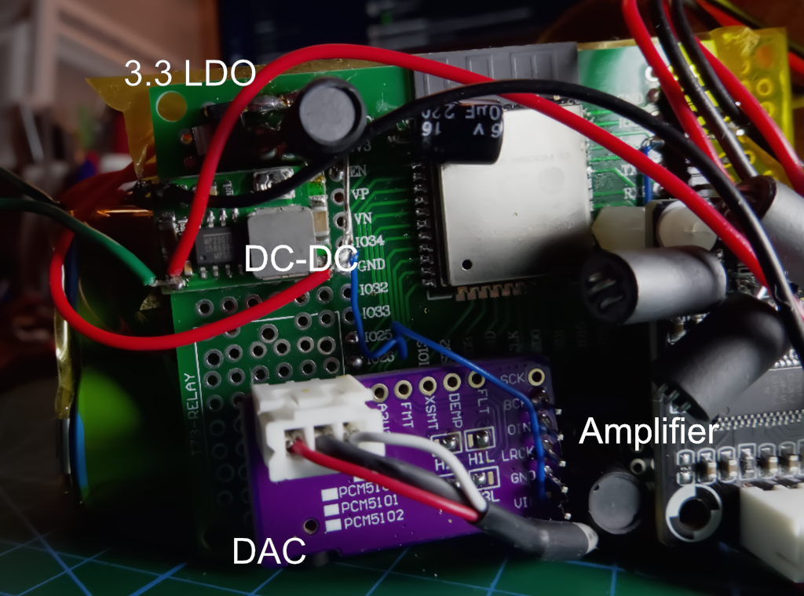
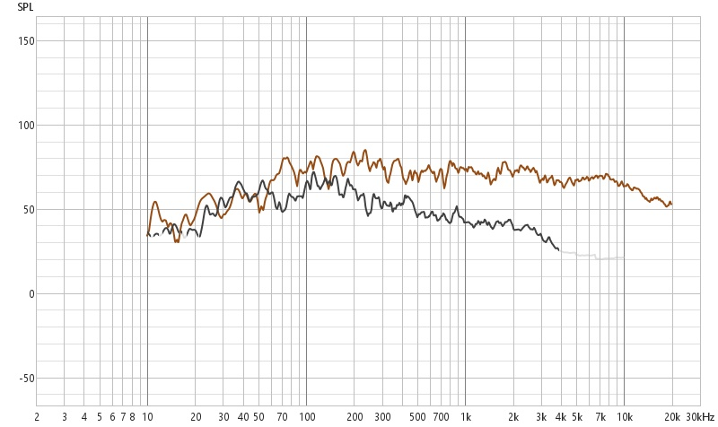
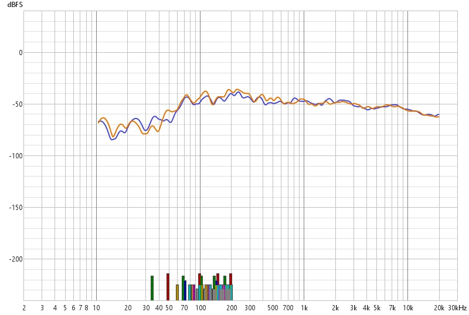
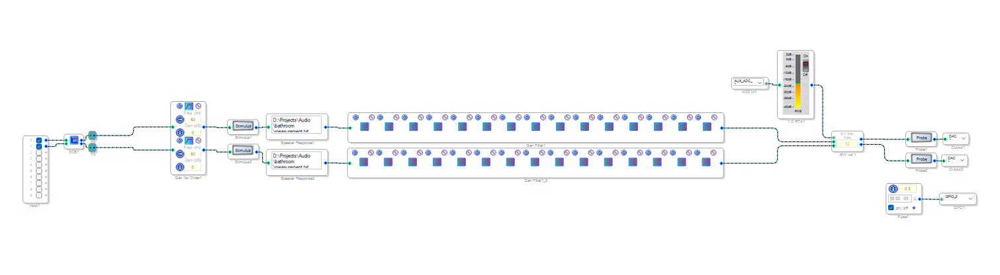
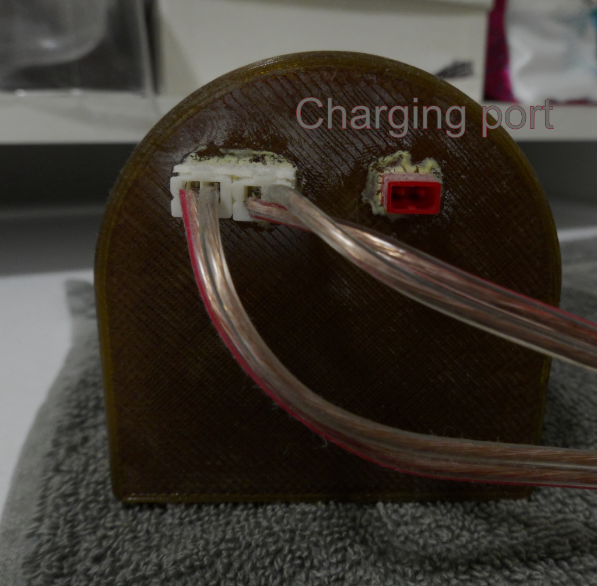

Mano obsesija dėl garso atkūrimo prasidėjo su pirmuoju i386 PC. Tais laikais, bet kokio garso išgavimas iš kompiuterio reikalavo išmanumo. Eksperimentavau su vidiniu PC garsiakalbiu, tiesiogiai konfigūruodamas laikmačio IC registrus, kad sugeneruočiau primityvų garsą per gudrų PWM moduliavimą. Rezultatai buvo siaubingi, bet žavūs, ypač visi tie MODPlayer, ITTracker ir t.t. Paskui atėjo DAC, sulipdytas iš rezistorių ir laidų ant LPT porto - geriau, bet vis tiek šiurkštu. Galiausiai perėjau prie vidutiniškų Sound Blaster kortų, nors mano pats pirmasis patyrimas su tikru PC garsu buvo per Spectrum PC, kuris turėjo dedikuotą YAMAHA garso sintezės mikroschemą. Tos mikroschemos programavimas prieš interneto eroje buvo eksperimentavimas bandymų ir klaidų būdu skaitant įvairius elektronikos žurnalus. Nepaisant to, kiekvienas "palypėjimas" kaip aparatinėje(PWM, DAC, SB) taip ir akustinėje srityje(PC Speker, free floating car speaker, flat electrostatic speakers) sukeldavo nepakartojamų emocijų!

Metai ėjo, ir mano garso eksperimentai nukeliavo už PC garso ribų. Perėjau prie Open Baffle(OB - atvirų pertvarų) konfigūracijų, dėl jų dipolinio spinduliavimo diagramos ir dėžės rezonansų nebuvimo. Tada atėjo tamsieji amžiai - pora latviškų 200W trijų juostų garsiakalbių, kur skambėjo neblogai, bet neišskirtinai. Lūžio taškas atėjo, kai susilitavau 10 kanalų stiprintuvą ir paverčiau tuos bokštelius į tris atskirus kanalus kiekvienoje pusėje(Prieš tai buvo 2x LM3886). Išroviau vidinius filtrus ir praleidau viską per 10in/10out DSP, paleisdamas REW matavimus, kad sulyginčiau kiekvieną garsiakalbį atskirai ir pasiekčiau kambario modų korekciją. Vėlesni papildymai įtraukė žemų dažnių shakerį, pritvirtintą prie sofos - nes kodėl gi ne**pajusti** sprogimų filmuose ar dinozaurų žingsnių tiesiogine prasme? Ir niekada nebegrįšiu į prieš-vibratorių(Hmm, čia ne tai apie ką galvojate:D ) laikus! Koks patyrimas tiesiogine prasme!

Nepaisant šių projektų, vis kažko trūko: pasirodo - visaapimančio garso. Perėjau nuo 2.0 prie 2.1, tada 5.1, deja įprasti garsiakalbiai visada atrodė kaip taškiniai šaltiniai kad ir kiek laiko praleisdavau REW programėlėje su matavimo mikrofonu. OB pagerino reikalus, bet štai kur tampa įdomu: tokie garsiakalbiai veikia geriausiai su dideliais viso diapazono garsiakalbiais, tam tikru atstumu nuo sienų ir t.t. Tačiau viso diapazono garsiakalbiai turi diafragmos "skilimą" tam tikruose dažniuose - pati diafragma sukuria stovinčias bangas, sukeliant fazės neatitikimus ir kryptingumo problemas. Tas pat dalykas, kuris daro garsiakalbį "viso diapazono", tampa jo apribojimu. Nepaisant to - skambėsys nepakartojamas!

Beje, užbėgant už akių paminėsiu, jog visgi didžiausią garso kokybei kambaryje įtaką daro to kambario modų slopinimas sklaidant ar sugeriant garsą. Šioje srityje dar nedaug pasiekiau, bet turiu minty :) 

Šis suvokimas atvedė mane prie DML (Distributed Mode Loudspeakers - paskirstyto bangų garsiakalbių). Pagalvokite apie gitarą ar violončelę - klausytojai girdi sklindantį garsą iš viso instrumento korpuso, ne iš mažo vibruojančio taško. DML bando atkartoti šį principą. Vibruojantis paviršius prie kurio pritvirtintas exciteris tampa instrumentu. Taip, tai suboptimalu labai lokalizuotam aukštų dažnių atkūrimui (išsprendžiama su mažais vidurių/aukštųjų dažnių garsiakalbiais mano TODO sąraše), bet kuriant įtraukiantį garso lauką, DML yra logiškas žingsnis nuo OB.

Kas mus atveda prie praktinio pritaikymo: kokybiškos muzikos duše. Šis įrašas dokumentuoja mano vonios kambario lubų DML instaliaciją, nuo aparatinės įrangos pasirinkimo iki DSP kalibravimo.

# Kas yra DML garsiakalbis

Distributed Mode Loudspeaker naudoja lengvą, standžią plokštę (paprastai polistirenas, korys arba kompozitas), varomą vieno ar daugiau žadinimo elementų (exciters). Vietoj to, kad judėtų kaip standus stūmoklis, plokštė suskyla į kelis rezonansinius režimus - kiekvienas dažnis sužadina skirtingas paviršines stovinčias ir bėgančias bangas(nors techniškai tai visai skirtingi rėžimai su skirtingais tvirtinimais ir t.t.). Gražus dalykas apie DML yra tas, kad bet kas gali tapti garsiakalbiu! Bet kas, kas gali vibruoti, tai yra. Stalas, kėdė, siena, langas, ar pieno pakelis...

DML susideda iš dviejų dalių:


Ir daiktas, kuris gali vibruoti - mano atveju vonios kambario plastikinės lubos (užbėgant už akių pasakysiu - ganėtinai prastas pasirinkimas, bet hey, juk tai eksperimentas).

# Kaip veikia DML

Skirtumas tarp stūmoklio režimo ir paskirstyto režimo veikimo tampa aiškus, kai vizualizuojate paviršiaus judesį:

```p5js
let time = 0;
let showDML = true;

sketch.setup = () => {
  sketch.createCanvas(720, 400);
  sketch.frameRate(30);
}

sketch.draw = () => {
  sketch.background(20);
  time += 0.05;
  
  // Title
  sketch.fill(255);
  sketch.textSize(16);
  sketch.textAlign(sketch.CENTER);
  sketch.text(showDML ? "DML - Paskirstytos Modos" : "Garsiakalbiai - Stūmoklio režimas", 
              sketch.width/2, 30);
  
  // Toggle button
  sketch.fill(60);
  sketch.rect(sketch.width/2 - 50, 350, 100, 30, 5);
  sketch.fill(255);
  sketch.textSize(12);
  sketch.text("Toggle Mode", sketch.width/2, 370);
  
  // Check for click
  if(sketch.mouseIsPressed) {
    if(sketch.mouseX > sketch.width/2 - 50 && 
       sketch.mouseX < sketch.width/2 + 50 &&
       sketch.mouseY > 350 && sketch.mouseY < 380) {
      showDML = !showDML;
    }
  }
  
  // Draw speaker panel
  let panelWidth = 300;
  let panelHeight = 200;
  let panelX = (sketch.width - panelWidth) / 2;
  let panelY = 100;
  let segments = 60;
  
  if(showDML) {
    // DML - multiple modal patterns
    sketch.noFill();
    sketch.stroke(100, 200, 255);
    sketch.strokeWeight(2);
    
    sketch.beginShape();
    for(let i = 0; i <= segments; i++) {
      let x = panelX + (i / segments) * panelWidth;
      
      // Combine multiple modes with different frequencies and phases
      let displacement = 
        10 * sketch.sin(time + i * 0.3) * sketch.sin(i * 0.15) +
        7 * sketch.sin(time * 1.3 + i * 0.5) * sketch.cos(i * 0.2) +
        5 * sketch.sin(time * 0.7 + i * 0.8) * sketch.sin(i * 0.25);
      
      let y = panelY + panelHeight/2 + displacement;
      sketch.vertex(x, y);
    }
    sketch.endShape();
    
    // Draw exciter position
    sketch.fill(255, 100, 100);
    sketch.noStroke();
    sketch.circle(panelX + panelWidth * 0.3, 
                  panelY + panelHeight/2, 8);
    sketch.fill(255);
    sketch.textSize(10);
    sketch.text("Exciter", panelX + panelWidth * 0.3, 
                panelY + panelHeight/2 - 15);
    
  } else {
    // Conventional piston mode - uniform displacement
    sketch.noFill();
    sketch.stroke(255, 150, 100);
    sketch.strokeWeight(2);
    
    let displacement = 15 * sketch.sin(time);
    
    sketch.beginShape();
    for(let i = 0; i <= segments; i++) {
      let x = panelX + (i / segments) * panelWidth;
      let y = panelY + panelHeight/2 + displacement;
      sketch.vertex(x, y);
    }
    sketch.endShape();
    
    // Draw voice coil position
    sketch.fill(255, 100, 100);
    sketch.noStroke();
    sketch.circle(panelX + panelWidth * 0.5, 
                  panelY + panelHeight/2 + displacement, 8);
  }
  
  // Draw reference line
  sketch.stroke(80);
  sketch.strokeWeight(1);
  sketch.line(panelX - 20, panelY + panelHeight/2, 
              panelX + panelWidth + 20, panelY + panelHeight/2);
  
  // Annotations
  sketch.fill(180);
  sketch.noStroke();
  sketch.textSize(11);
  sketch.textAlign(sketch.LEFT);
  
  if(showDML) {
    sketch.text("Sudėtingos vibracijos modos", panelX, panelY - 15);
    sketch.text("Skirtingos plokštės sritys vibruoja skirtingai", panelX, panelY - 3);
  } else {
    sketch.text("Tolygus poslinkis", panelX, panelY - 15);
    sketch.text("Visas paviršius juda vientisai", panelX, panelY - 3);
  }
}
```

Spustelėkite "Toggle Mode", kad perjungtumėte tarp vizualizacijos režimų. DML plokštė rodo kelis vienu metu rezonansinius režimus - kiekvienas dažnis sukuria skirtingas stovinčas ir bėgančias bangas. Įprastų garsiakalbių diafragma juda vientisai(išskyrus kuomet žadinamas signalo dažnis viršija lūžio tašką kuomet diagragmoje susidaro stovinčios bangos - paprastai tai yra didelis blogis garso kokybei).

Dar svarbiau, garsiakalbis juda kaip stūmoklis, stumiantis ir traukiantis orą, kurdamas garsą ir sąveikauja su dėžės vidumi bei pačia dėže kuri taip pat skleidžia garsą net jei pagaminta iš betono. Labai nedaug garso šaltinių veikia šitaip. DML daro kitaip - visas paviršius leidžiamas laisvai vibruoti ir visas paviršius skleidžia garsą. Labai panašiai kaip įvairūs muzikos instrumentai. Triukas yra žadinti plokštę taip, kad būtų sužadinami tik reikiami režimai. Iš tiesų, kuo daugiau dažnių sužadina stovinčias bangas - tuo geriau. Nebent tai bėgančios bangos rėžimas - tuomet stovinčios bangos kaip ir žalingos. Kita vertus, pritaikius skaitmeninį signalų apdorojimą galima kovoti su atkūriamų dažnių netolygumu proto ribose.

# Sistemos architektūra

Mano implementacija naudoja ESP32 kaip Bluetooth garso imtuvą, perduodantį signalą į DAC, tada ADAU DSP korekcijai, TPA3110 stiprinimui ir galiausiai žadinimo elementus, pritvirtintus prie lubų:


Komponentų pasirinkimo pagrindimas:


**ADAU1401**: 28-bitų SigmaDSP branduolys su integruotu ADC/DAC. SigmaStudio suteikia grafinį programavimą parametriniam EQ, daliklams, dinamikai. 1401 turi pakankamai apdorojimo galios mano menkiems 2 kanalams. Naudojau žemųjų dažnių stiprinimo modulį, kuris prideda žemųjų dažnių harmonikas, kad muzika skambėtų žemiškiau (tokie patys triukai daromi mažuose Bluetooth garsiakalbiuose ar net telefonuose - kitaip tariant naudoja psichoakustikos triukus sudaryti žemo dažnio iliuziją)



**ESP32**: Integruotas Bluetooth su A2DP sink palaikymu, I2S išvestis švariam skaitmeninio garso perdavimui. ESP-IDF framework'as suteikia neblogą A2DP implementaciją. Yra daug pavyzdžių PlatformIO, aš tik modifikavau kelis dalykus, kad atitiktų mano DAC.

**PCM5102**: Švarus 24-bitų DAC su puikiu SNR (112 dB). Nereikalingas išorinis MCLK - naudoja vidinį PLL. I2S sąsaja eliminuoja ground-loop problemas, kurios kankina analoginius Bluetooth modulius.
Galėjau tiesiogiai maitinti I2S iš ESP32 į DSP. Ir bandžiau tai padaryti, bet negalėjau sukonfigūruoti, kaip priversti ADAU mikroschemą dekoduoti I2S signalą be MCLK. Man rodos ADAU1401 nemoka pati susigeneruot MCLK.


**TPA3110**: Class D efektyvus ir puikiai tinka tokiam mažam uždaram korpusui. Gali duoti 30W kanalui prie 16V į 4Ohm @10% THD. Gal stiprintuvas ir pernelyg galingas, bet iki 10W garsas yra labai švarus ir čipas nekaista net be radiatoriaus! Pridėjau feritinių karoliukų pagal rekomendaciją (iš esmės "iš akies")


**Žadinimo elementai**: 10W Dayton Audio. Būtų neblogai daugiau nei vieną užkabint geresniam modų sužadinimui... Bet nesivarginau, nes plokštės pradeda trintis viena į kitą, gerokai iškreipdamos garsą. Būtų gerai pakelti žemųjų dažnių ribą...


Prieš galutinai pritvirtindamas žadinimo elementus, pridėjau laikiną dvipusę juostą ant membranų (nenuėmęs originalaus apsauginio popieriuko) ir išbandžiau kelias skirtingas tvirtinimo vietas. Teko truputį paplušėti, nes reikėjo  matuot akustiką sėdint už vonios kambario durų, kad neįtakočiau mažos patalpos akustinių parametrų sugerdamas nemažą akustinės energijo dalį. Gavau šiek tiek kardio tą dieną bėgiodamas pirmyn-atgal :)

# ESP32 kaip Bluetooth imtuvas

ESP32 implementuoja A2DP sink (Bluetooth garso imtuvo) funkcionalumą. Kažkaip pamečiau firmware, bet jis pagrįstas vienu iš pavyzdžių ESPIDF/Arduino Bluetooth grotuvui ar panašiai. Turėjau padaryti kelis pakeitimus ir kodas nebveiktų dabar (2025) vis tiek, nes bibliotekos kiek pasistūmėjo į priekį. Nebent naudot senesnę IDF ir PlatformIO, bet ai, kam tas vargas su senienom :D 

A2DP stack'as dekoduoja SBC/AAC, išvedant PCM į I2S. Jokio papildomo apdorojimo nereikia ESP32 - DSP tvarko visą korekciją. Na gal dėl garso lygio reikėjo kažką implementuot papildomai, kad iš telefono galima būtų garsumą reguliuot.

# Instaliacija ir fizinė sąranka

Galima iš lempos klijuot tuos exciterius, tačiau galima ir paoptimizuot truputį, kad gautųsi "skambesnės" modos. Lubos visgi yra iš visų gallų įvirtintos plokštės, todėl dominuoja stovinčios bangos. Tačiau konkrečiai mano lubos buvo pusiau priklijuotos prie medinio rėmo ir yra šiek tiek laisvos. Taigi jos gerokai slopinamos, todėl vibracijos toli nenukeliauja. Nors vis tiek galiu pajusti priešingam vonios lubų kampelyje.

Bet kuriuo atveju, štai ką padariau - pritvirtinau exciterius pagal intuiciją - kažkur arčiau kampų viduryje tarp kampų ir centro ir pan. Stengiausi pataikyti tarp medinių balkių. Bandžiau matuoti atsakus skirtingose vietose ir galiausiai vietą pasirinkau pagal geriausią dažninį atsaką bei mažiausias iškraipymus.
REW gali parodyti iškraipymus ir skambėjimą, tai buvo labai naudinga.

# Dažnių atsakas ir DSP korekcija

Žalias DML atsakas rodo 15-20 dB svyravimą per garso juostą. Modaliniai rezonansai sukuria viršūnes, o anti-rezonansai sukuria įdubas:



Nekalibruotas atsakas rodo:
- Žemų dažnių kritimą žemiau 80 Hz
- Tačiau iškraipymai šauna į viršų žemiau 190 Hz (jie tvarkomi iki 10%)
- Aukštų dažnių kritimą virš 10 kHz
- Nelygus atsakas visur reiškia, kad yra daug modų




Spektrograma rodo:
- daug triukšmo ir vibracijų <300Hz - Mano vonios kambarys dėl kažkokios priežasties labai triukšmingas(galų gale tai rezonansinė erdvė)
- Lubos atrodo skamba visur, ypač 6kHz, bet tai gali būti ūžianti lempa
- Pavadinčiau tai nesėkme, jei dušo triukšmas neužgožtų šių trūkumų. Ir tai vis tiek skamba geriau nei bluetooth garsiakalbis!
- Deja neišmatavau/neišsaugojau įprasto bluetooth garsiakalbio spektro palyginimui

DSP korekcijos metodas:



**DC Blocker**: Tiesiog geras dalykas turėti įėjime.

**Stimulus**: Čia nurodau išmatuotus atsakus. Galiu diagnozuoti problemas su filtrais, kai įkeliu koeficientus. Ši dalis labai kaprizinga ir mėgsta atstatyti kiekvieną kartą, kai atidarau SigmaStudio. Taigi prieš įkėlimą visada patikrinu, ar mano DSP iš tikrųjų išlygina dažnius.

**Parametrinis EQ**: 15 juostų PEQ. Adresuoja pagrindines viršūnes/įdubas ±12 dB diapazone. Pakelia aukštuosius - paprastai kelti EQ yra blogis, bet turiu gan nemažai "laisvos eigos" kaip galios taip ir DSP dinaminio diapazono prasme. Nebandykite koreguoti gilių įdubų - jos yra dėl vonios rezonansų ir kinta priklausomai nuo klausymosi pozicijos. Ypač su tokiu dėžėtu vonios kambariu su kietomis plytelių sienomis, kurios puikiausiai atspindi bet ką, kad net avižėlių pirstelėjimai girdisi.

**Polkių filtrai**: Aukštų dažnių praleidimo filtras ties 60 Hz (12 dB/oktava) apsaugo exciterius.

Tiesiog išmatuoju atsaką patalpinęs kalibruotą matavimo mikrofoną į vonią, importuoju rezultatus į SigmaStudio kaip testavimo signalą. Tada generuoju filtrų stack'ą palyginimui ir importuoju koeficientus į PEQ filtrus. Blokai atlieka likusį darbą ir galiu išbandyti, ar mano filtrai veikia, maitindamas DSP programą testiniu signalu (išmatuotu sweep atsaku). Šaunu!

Deja, neišsaugojau atsako po kalibravimo. Bet jei gerai prisimenu, jis buvo maždaug plokščias su mažesniais iškraipymais žemiau 200Hz. Rezultatai labai priklauso nuo mikrofono padėties (aukščiau, žemiau, priekyje ar gale vonios ir pan.), tad nemačiau reikalo išsaugoti šių matavimų. Jie vidutiniškai gerai vidurkinasi ir glotninasi :D

# Subjektyvus veikimas




Visų pirma, šio DIY pranašumas yra tas, kad galiu iš tikrųjų gana gerai subalansuoti vonios kambario garsą. Priešingai nei leidžia USB bum-boksai! Taigi galiu gana patenkinamai mėgautis muzika duše be užgožiančio žemųjų dažnių rezonanso (Įdomus faktas: aną galiu rasti niūniuodamas). Taip pat, nebesijaučia, jog garsas ateina iš bluetooth garsiakalbio. Jaučiasi, kad garsas ateina iš visur aplink tave. Ir stereo efektas vis tiek išlieka!

Tačiau vienas trūkumas su tvirtinimu yra tas, kad vargšės lubos nebuvo suprojektuotos atsižvelgiant į vibracijas. Nors plastikinės plokštės yra pritvirtintos prie medinio rėmo (manau klijais), jos vis tiek rodo trinties požymius visur kur kur susitinka/susijungia dvi plokštės. Ir tai lemia cypimus ir kitokius nemalonius artefaktus padidinus galią.

Kitas trūkumas - kažką pridirbau su maitinimu - kartais arba ESP32, arba ADAU DSP tinkamai nesiinicializuoja ir turiu kelis kartus tai išjungt/įjungt ar įjungt/išjungt, kol atsiranda garsas. Tai labai erzina dėl ko iš tikrųjų nenaudoju šio įrenginio :(

Vis dar planuoju diagnozuoti maitinimo/reset problemas. Tam reikia geresnio oscilografo su 12bit rezoliucija ir geresniu triggeriu. Mano pigus kiniškas 2x180MHz oscilografas yra tik 8bit ir trigger'inimas įgyvendintas daug prasčiau. Jis nesuaktyvina labai trumpų impulsų ir neleidžia prizoomint fiksavimo buferio. Ir šiaip nepatogus tokiem keistiem matavimam. Taigi atidėlioju. Rezultatas - šiek tiek nuobodesnis dušas nei galėtų būti.

Taip pat, šiems žadinimo elementams trūksta galios. Ir negaliu jos kelti dėl cypsiančių plastikinių plokščių.
Galbūt tiesiog pakabinsiu 1x0.7m akrilines plokštes kurios ir atliks DML funkciją, kad atriščiau nuo lubų - bus paprasčiau suderint ir padidint galią...

PS. Iš tingėjimo verčiau iš Anglų į Lietuvių su AI... teko nemažai taisyt, tad gali būt kažkur praleidau kokią nesąmonę(Spėju dauguma LLM buvo apmokyti ant Delfi forumų...)