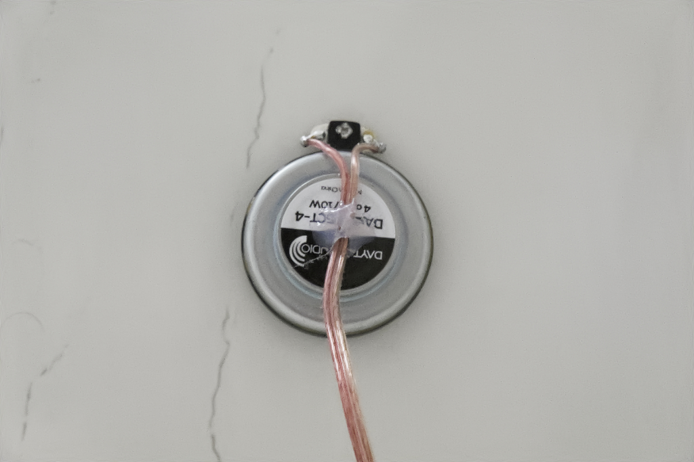

My obsession with audio reproduction started with my first i386 PC. Back then, getting any sound out of a computer required creativity. I experimented with the internal PC speaker, directly accessing the timer IC to generate crude audio through clever PWM modulation. The results were terrible, but fascinating. Next came a DAC cobbled together on the LPT port - better, but still harsh. Eventually I graduated to mediocre Sound Blaster cards, though my very first experience with proper PC audio was actually through a Spectrum PC that featured a dedicated sound synthesizer chip. Programming that chip during the pre-internet era was an exercise in trial and error with photocopied datasheets.

Years passed, and my audio experiments evolved beyond PC sound. I moved into open baffle configurations, attracted by their dipole radiation pattern and lack of box resonances. Then came the dark ages - a pair of Latvian 200W three-way tower speakers that sounded decent but unremarkable. The turning point came when I built a 10-channel amplifier and converted those towers into three separate channels per side. I gutted the internal crossovers and deployed a 10in/10out DSP running REW measurements to equalize each driver individually and attempt room mode correction. Later additions included a bass shaker mounted to the couch - because why not feel the explosions in movies? And I will never go back to pre-shaker times! What an experience!

Despite these successes, I kept chasing something: all-encompassing sound. I progressed from 2.0 to 2.1, then 5.1, but conventional speakers always felt like point sources. Open baffle improved things, but here's where it gets interesting: open baffle works best with large full-range drivers. However, full-range drivers exhibit cone breakup at certain frequencies - the cone itself develops standing wave modes, causing phase inconsistencies and directivity problems. The very thing that makes a driver "full-range" becomes its limitation.

This realization led me to DML (Distributed Mode Loudspeakers). Consider a guitar or cello - listeners hear sound emanating from the entire instrument body, not a small vibrating point. DML attempts to replicate this principle. The panel becomes the instrument. Yes, it's suboptimal for highly localized high-frequency reproduction (solvable with small mid/high-range speakers on my TODO list), but for creating an immersive soundfield, DML represents a logical progression from open baffle.

Which brings us to the practical application: getting quality music in the shower. This post documents my bathroom ceiling DML installation, from hardware selection through DSP calibration.

# What is a DML Speaker

A Distributed Mode Loudspeaker uses a lightweight, stiff panel (typically polystyrene, honeycomb, or composite) driven by one or more exciters. Instead of moving as a rigid piston, the panel breaks up into multiple resonant modes - each frequency excites different standing wave patterns across the surface. The neat thing about DMLs is anything can become a speaker! Anything that can vibrate that is.

DML consists of two parts: 


*These are Daytone 10W exciters*

And the thing that can vibrate - in my case a bathroom plastic ceiling.

# How DML Works

The difference between piston-mode and distributed-mode operation becomes clear when visualizing surface motion:

```p5js
let time = 0;
let showDML = true;

sketch.setup = () => {
  sketch.createCanvas(720, 400);
  sketch.frameRate(30);
}

sketch.draw = () => {
  sketch.background(20);
  time += 0.05;
  
  // Title
  sketch.fill(255);
  sketch.textSize(16);
  sketch.textAlign(sketch.CENTER);
  sketch.text(showDML ? "DML - Distributed Mode" : "Conventional - Piston Mode", 
              sketch.width/2, 30);
  
  // Toggle button
  sketch.fill(60);
  sketch.rect(sketch.width/2 - 50, 350, 100, 30, 5);
  sketch.fill(255);
  sketch.textSize(12);
  sketch.text("Toggle Mode", sketch.width/2, 370);
  
  // Check for click
  if(sketch.mouseIsPressed) {
    if(sketch.mouseX > sketch.width/2 - 50 && 
       sketch.mouseX < sketch.width/2 + 50 &&
       sketch.mouseY > 350 && sketch.mouseY < 380) {
      showDML = !showDML;
    }
  }
  
  // Draw speaker panel
  let panelWidth = 300;
  let panelHeight = 200;
  let panelX = (sketch.width - panelWidth) / 2;
  let panelY = 100;
  let segments = 60;
  
  if(showDML) {
    // DML - multiple modal patterns
    sketch.noFill();
    sketch.stroke(100, 200, 255);
    sketch.strokeWeight(2);
    
    sketch.beginShape();
    for(let i = 0; i <= segments; i++) {
      let x = panelX + (i / segments) * panelWidth;
      
      // Combine multiple modes with different frequencies and phases
      let displacement = 
        10 * sketch.sin(time + i * 0.3) * sketch.sin(i * 0.15) +
        7 * sketch.sin(time * 1.3 + i * 0.5) * sketch.cos(i * 0.2) +
        5 * sketch.sin(time * 0.7 + i * 0.8) * sketch.sin(i * 0.25);
      
      let y = panelY + panelHeight/2 + displacement;
      sketch.vertex(x, y);
    }
    sketch.endShape();
    
    // Draw exciter position
    sketch.fill(255, 100, 100);
    sketch.noStroke();
    sketch.circle(panelX + panelWidth * 0.3, 
                  panelY + panelHeight/2, 8);
    sketch.fill(255);
    sketch.textSize(10);
    sketch.text("Exciter", panelX + panelWidth * 0.3, 
                panelY + panelHeight/2 - 15);
    
  } else {
    // Conventional piston mode - uniform displacement
    sketch.noFill();
    sketch.stroke(255, 150, 100);
    sketch.strokeWeight(2);
    
    let displacement = 15 * sketch.sin(time);
    
    sketch.beginShape();
    for(let i = 0; i <= segments; i++) {
      let x = panelX + (i / segments) * panelWidth;
      let y = panelY + panelHeight/2 + displacement;
      sketch.vertex(x, y);
    }
    sketch.endShape();
    
    // Draw voice coil position
    sketch.fill(255, 100, 100);
    sketch.noStroke();
    sketch.circle(panelX + panelWidth * 0.5, 
                  panelY + panelHeight/2 + displacement, 8);
  }
  
  // Draw reference line
  sketch.stroke(80);
  sketch.strokeWeight(1);
  sketch.line(panelX - 20, panelY + panelHeight/2, 
              panelX + panelWidth + 20, panelY + panelHeight/2);
  
  // Annotations
  sketch.fill(180);
  sketch.noStroke();
  sketch.textSize(11);
  sketch.textAlign(sketch.LEFT);
  
  if(showDML) {
    sketch.text("Complex modal patterns", panelX, panelY - 15);
    sketch.text("Different regions vibrate independently", panelX, panelY - 3);
  } else {
    sketch.text("Uniform displacement", panelX, panelY - 15);
    sketch.text("Entire surface moves as rigid body", panelX, panelY - 3);
  }
}
```

Click "Toggle Mode" to switch between visualization modes. The DML panel exhibits multiple simultaneous resonant modes - each frequency creates a different standing wave pattern. Conventional speakers move uniformly.

Also, more importantly, Speaker moves as a piston pushing and pulling on air creating sound. Very few sound sources operate this way. DML does it differently - the whole surface is allowed to freely vibrate and the whole surface emits the sound. Very much like various musical instruments. The trick is to drive the panel in such a way so that only required modes are excited. This is harder to accomplish than it sounds(pun intended).

# System Architecture

My implementation uses ESP32 as a Bluetooth audio receiver, feeding a DAC, then ADAU DSP for correction, TPA3110 for amplification, and finally the exciters mounted on the ceiling:


Component selection rationale:


*ADAU1401 evaluation board plays an important role in the whole digital->analog->sound pipeline*

**ADAU1401**: 28-bit SigmaDSP core with integrated ADC/DAC. SigmaStudio provides graphical programming for parametric EQ, crossovers, dynamics. The 1401 includes sufficient processing power for my measly 2 channels. I used Bass boost module that adds bass harmonics so that the music sounds more bassy(same tricks are done in small Bluetooth speakers or even phones)


*ESP32 and amplifier boards with power section that converts 4xLiPo voltage into manageable 5V and 3.3V*

**ESP32**: Built-in Bluetooth with A2DP sink support, I2S output for clean digital audio transfer. The ESP-IDF framework provides stable A2DP implementation. There are plenty examples for PlatformIO, I just modified a few things to fit my DAC.

**PCM5102**: Clean 24-bit DAC with excellent SNR (112 dB). No external MCLK required - uses internal PLL. I2S interface eliminates ground loop concerns that plague analog Bluetooth modules.
I could feed I2S from ESP32 directly into the DSP. And I tried to do so, but couldn't configure out how to make ADAU chip to decode I2S signal.


*This is the main power-horse that drives the speakers. It is powered directly from battery BMS*

**TPA3110**: Class D efficiency for minimal heat in enclosed ceiling space. Can deliver 30W per channel at 16V into 4Ohms @10% THD. An overkill, but at up to 10W it is very clean and cool! I've added ferrite beads as per recommendation(eyeballed them basically)


**Exciters**: 10W Dayton Audio. Two exciters per channel for better modal excitation... But I did not bother since the panels start to rub one another distorting sound considerably. I'd have to raise the bass cutoff.


*Exciters are mounted on the ceiling in rather unappealing manner*

Before mounting the exciters I added a non-permanent double-sided tape onto the membranes(without removing the protective paper part) and tried a few different locations. This was tedious since I had to run the acoustic measurements from outside the bathroom. Got a bit of cardio that day :)

# ESP32 as Bluetooth Receiver

The ESP32 handles A2DP sink (Bluetooth audio receiver) functionality. I kind of lost the firmware, but it is based on some example for ESPIDF/Arduino Bluetooth player or something. I had to make a few adjustments and the code wouldn't work now(2025) anyway since the libraries have advanced so much.

The A2DP stack decodes SBC/AAC, outputting PCM to I2S. No additional processing needed on ESP32 - DSP handles all correction.

Power consumption: ~80mA during streaming. ESP32's deep sleep between connections saves power since this thing is battery operated as you've noticed by looking at the guts!

# Installation and Physical Setup

When working with free-vibrating panels sone placement optimization can be made. However, my ceiling was semi-glued to the wooden frame and is somewhat loose. So it is damped a lot thus vibrations don't travel far. Although, I can still feel them across the ceiling from corner to corner.

Anyway, what I did was mount them in the intuitive position - somewhere closer to the corners in the middle between the corners and the center, etc. Tried to measure responses in different places and chose the best response plus the less distortions.
REW can show you distortions and ringing, so that was very helpful.

# Frequency Response and DSP Correction

Raw DML response exhibits 15-20 dB variation across the audio band. Modal resonances create peaks, and anti-resonances create nulls:


*Frequency response graph showing raw measurement with obvious peaks around 300Hz, 800Hz, 2kHz and nulls at 500Hz, 1.5kHz. Y-axis: SPL (dB), X-axis: Frequency (Hz, log scale)*

The uncalibrated response shows:
- Low-frequency rolloff below 80 Hz
- However Distortion shoots through the roof below 190 Hz (it is manageable up to 10%)
- High-frequency rolloff above 10 kHz
- Ragged response all around means there are lots of modes


*Left and Right responses align adequately*


The spectrogram shows:
- lots of noise and vibrations at <300Hz - My bathroom is noisy for some reason
- The ceiling appears to be ringing all over the place, especially 6kHz but that might be the lamp buzzing
- I would call it a failure if the shower noise would not overwhelm these deficiencies. And this still sounds better than bluetooth speaker!
- Sadly I did not measure/save the spectrum of a regular bluetooth speaker for comparison

DSP correction approach:


*DSP Stack inside SigmaStudio*

**DC Blocker**: Just a good thing to have on the input.

**Stimulus**: Here I specify the measured responses. I can troubleshoot the filters when I upload the coefficients. This part is very finnicky and likes to reset every time I open SigmaStudio. So before upload I always check if my outputs are actually flat-ish.

**Parametric EQ**: 15-band PEQ in ADAU1401 SigmaStudio. Address major peaks/nulls within ±12 dB range. Boost the highs. Don't attempt to correct deep nulls - they're spatial and vary with listening position. Especially with such a boxy bathroom with hard tile walls that reflect anything readily. Good thing we have enough power amp power to boost high frequency rolloff and don't drive exciters too much.

**Shelving filters**: High-pass at 60 Hz (12 dB/octave) to protect exciters. 

Measurement setup: REW (Room EQ Wizard) with USB measurement mic at primary listening position (shower/tub).

I Simply measure the respose, import it into SigmaStudio as test signal. Then generate a filter stack for the equalization and import the coefficients into Sigma Studio. The blocks do the rest and I can test if my filters work by feeding the DSP program test signal(measured sweep response). Neat!

Unfortunately I did not save the response after calibration. But If I remember correctly it was more or less flat with lower distortions below 200Hz. The results depended very much on mic placement(higher, lower, in the front or back of the tub, etc) that I thought I did not need to save these measurements. They average nicely though.

# Subjective Performance


*The whole unit - this is what my Wife sees*


*Connections*


First of all, the advantage of this DIY approach is that I can actually equalize the boomy bathroom quite well. Unlike what USB boom-boxes allow! So I can pretty much enjoy music while showering without overwhelming bass rezonanse(Fun fact: which I can find by humming). Also, the sound doesn't feel like it is coming from a bluetooth speaker. It feels like the sound comes from all around you. And the stereo effect still persists!

However, one downside with the mounting is that the poor ceiling was not designed with vibration in mind. While the plastic boards are attached to the wooden frame(I think by glue), they still exhibit friction on where two boards meet. And this introduces squeeks and other unpleasant artifacts when I ramp up the power.

Another downside - I messed up with powering - sometimes either ESP32 or ADAU DSP does not initialize properly and I have to power-cycle it several times before the sound starts sounding. This is very annoying which led to not actually using this contraption.

I still plan on diagnosing the power/reset issues. For that I need a better scope that would allow 12bit capturing with proper triggering setup. My cheap(well, 180+EU is not that cheap) chinese 180MHZ scope is only 8bit and triggering is implemented poorly. It does not trigger on very short pulses and can't really expand on its capture buffer when it triggers. Also, no easy way to view the waveform in order to measure timings... So I've been postponing this. The result - abit more boring showering than what it could have been.

Also, these exciters lack power. And I can't go for more due to squeeky plastic panels anyway.
Maybe I'll just hang 1x.7m acryllic panels there to decouple from the ceiling...