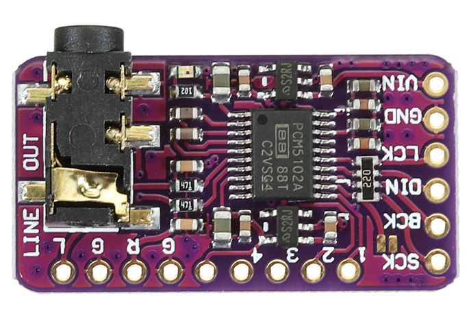
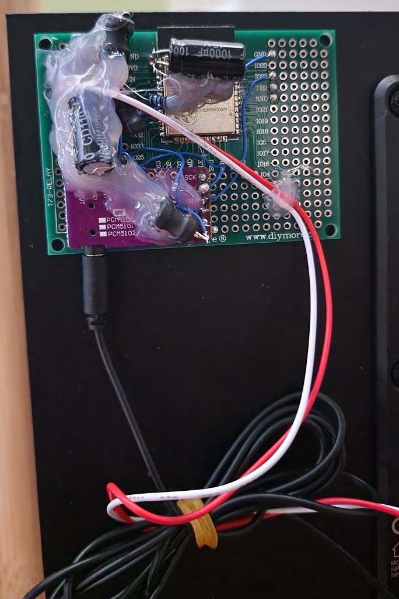

I was building a Christmas set of spherical speakers just to familiarize myself with ADAU1401 Sigma DSP. And I wanted to add Bluetooth
capability to the speakers so that they could receive sound data from an old Samsung Galaxy Node 10.1 in the kitchen.

Granted, I have ordered some Bluetooth audio receivers, however, while they are being shipped, I thought to myself: Hey, I already have 
powerful CPUs(ESP32) with Bluetooth. These chips have I2S and I have I2S DACs waiting for another project! Why don't I give it a try and just google
some Arduino projects that connect ESP32 A2DP sink with I2S and use that as a receiver?

Well, It would be really simple, except that I decided to use dirt-cheap Cirrus Logic CS4344 modules... And these modules require a master clock to function properly.
Little did I know, that MCLK output of the WROOM modules that I had was really unstable. I was even doubting my logic analyzer recordings!

# Firmware

There is [ESP32-A2DP](https://github.com/pschatzmann/ESP32-A2DP) - a very useful library that should cover all your needs with respect to Bluetooth and I2S. The most simple way to
create a Bluetooth receiver using this library and an ESP32 is just 7 lines of code!

```c
#include "BluetoothA2DPSink.h"

BluetoothA2DPSink a2dp_sink;

void setup() {
    a2dp_sink.start("ESP_SPEAKER");
}

void loop() {
}
```

However, As I mentioned, at first I tried to use CS4344 I2S DAC that supports up to 196kHz sample rate. Thus I also needed to add a MCLK output like so:

```c
void setup() {
    i2s_pin_config_t my_pin_config = {
        .mck_io_num = 0,
        .bck_io_num = 26,
        .ws_io_num = 25,
        .data_out_num = 22,
        .data_in_num = I2S_PIN_NO_CHANGE
    };
    a2dp_sink.set_pin_config(my_pin_config);
    a2dp_sink.start("ESP_SPEAKER");
}
```

Note, however, that ESP32 can only use GPIO 0, 2 and 3 for MCLK output, however, I was already using these pins for programming as well as reading out logs except for GPIO0.

# Internal ESP32 DAC

It is well known, that ESP32 has two built-in DACs that also accept I2S input. You can route it via I2S config like so:

```c
  const i2s_config_t i2s_config = {
      .mode = (i2s_mode_t) (I2S_MODE_MASTER | I2S_MODE_TX | I2S_MODE_DAC_BUILT_IN),
      .sample_rate = 44100, // corrected by info from bluetooth
      .bits_per_sample = (i2s_bits_per_sample_t) 16, /* the DAC module will only take the 8bits from MSB */
      .channel_format =  I2S_CHANNEL_FMT_RIGHT_LEFT,
      .communication_format = (i2s_comm_format_t)I2S_COMM_FORMAT_STAND_MSB,
      .intr_alloc_flags = 0, // default interrupt priority
      .dma_buf_count = 8,
      .dma_buf_len = 64,
      .use_apll = false
  };

  a2dp_sink.set_i2s_config(i2s_config);
```

The resolution of that DAC is only 8 bits, therefore it is unsuitable for HiFi music I was trying to extract from this module :)
Therefore, I did not even consider using it. But, for those who would like to try it out, you can find examples in [ESP32-A2DP](https://github.com/pschatzmann/ESP32-A2DP).

# Hooking up CS4344 DAC


```viz-dot
digraph structs {
    node [shape=record];
    rankdir=LR;
    esp32 [label="ESP32 | { {PIN|GPIO26|GPIO25|GPIO22|GPIO0|EN|GND|VCC} | {Name|<26> BCK|<25> WS|<22> DOUT|<0> MCLK|<7> EN|<5> GND|<6> VCC} }"];
    pwr [label="POWER | {<5> GND} | {<6> VCC}"];
    cs4344 [label="CS4344 module | { {PIN|<1> 1|<2> 2|<3> 3|<4> 4|<5> 5|<6> 6} | {Name|SDIN|SCLK|LRCLK|MCLK|GND|VCC} }"];
    // cs4344 [label="CS4344 module | {PIN|Name} | {<1> 1|SDIN} | {<2> 2|SCLK} | {<3> 3|LRCLK} | {<4> 4|MCLK} | {<5> 5|GND} | {<6> 6|VCC}"];
    "pwr":5 -> "esp32":5[color=blue];
    "pwr":5 -> "cs4344":5[color=blue];
    "pwr":6 -> "esp32":6[color=red];
    "pwr":6 -> "esp32":7[color=blue];
    "pwr":6 -> "cs4344":6[color=red];
    "esp32":0 -> "cs4344":4;
    "esp32":26 -> "cs4344":2;
    "esp32":25 -> "cs4344":3;
    "esp32":22 -> "cs4344":1;
}
```

After downloading the firmware, I hooked up the DAC to the ESP32 and listened to the output of it via 3.5mm jack. And the sound was horrible. I was very frustrated and tried different clock rates, pins. I even tried to build IDF A2DP examples... Although the sound was a little bit better with raw IDF framework, it was still garbage. I even thought it was due to the very low output driving capabilities of the CS4344, even though it was defective... Until I hooked up a logic analyzer to monitor what is happening on the I2S interface.

This is what should be on the I2S interface(not particularly phase-correct):

```wave
{signal: [
  {name: 'MCLK', wave: 'n........................'},
  {name: 'BCLK', wave: 'h|l|h|l|h|l|h|l|h|l|h|l|h'},
  {name: 'LRCLK', wave: '1.0..|....1..|....0..|...'},
  {name: 'DOUT', wave: 'xxx=.......=.......=.....', data: ["Left MSB", "Right MSB", "Left MSB"]},
]}
```

However, this is what I got on two different ESP32 dev boards as well as the raw module:

```wave
{signal: [
  {name: 'MCLK', wave: 'h.lh.l.h..lhlh.l..hl.hlh.'},
  {name: 'BCLK', wave: 'h|l|h|l|h|l|h|l|h|l|h|l|h'},
  {name: 'LRCLK', wave: '1.0..|....1..|....0..|...'},
  {name: 'DOUT', wave: 'xxx=.......=.......=.....', data: ["Left MSB", "Right MSB", "Left MSB"]},
]}
```

According to CS4344 [datasheet](https://www.mouser.com/datasheet/2/76/CS4344-45-48_F2-472818.pdf), the MCLK duty cycle should be 50% with a very small margin. There is no strong requirement for the phase relationship between MCLK and other signals except that they should be synchronous. CS4344 even can generate BCLK clock from MCLK, however, I barely see why that would be more 
convenient than generating MCLK from BCLK, but hey, the module is dirt-cheap :)

In both cases, LRCLK run at 48kHz, which was right. As well as BCLK(which is Fs*2*BitsPerSample). DOUT was a bit off, but CS4344 claims to detect the mode properly. And even if it didn't detect the I2S signal mode, the sound should still not contain so much noise and distortion!
According to measurements, the MCLK signal frequency varied between 13MHz and some odd 7MHz. Unfortunately, my scope analog bandwidth is just at 8MHz, so I couldn't see the actual waveform of the MCLK.
But the problem seemed evident - MCLK was not stable at all.

# PCM5102 to the rescue



```viz-dot
digraph structs {
    node [shape=record];
    rankdir=LR;
    esp32 [label="ESP32 | { {PIN|GPIO26|GPIO25|GPIO22|EN|GND|VCC} | {Name|<26> BCK|<25> WS|<22> DOUT|<7> EN|<5> GND|<6> VCC} }"];
    pwr [label="POWER | {<5> GND} | {<6> VCC}"];
    pcm5102 [label="PCM5102 module | { {PIN|<1> 1|<2> 2|<3> 3|<4> 4|<5> 5|<6> 6} | {Name|SCK|BCK|DIN|LRCK|GND|VCC} }"];
    "pwr":5 -> "esp32":5[color=blue];
    "pwr":5 -> "pcm5102":5[color=blue];
    "pwr":6 -> "esp32":6[color=red];
    "pwr":6 -> "esp32":7[color=blue];
    "pwr":6 -> "pcm5102":6[color=red];
    "esp32":26 -> "pcm5102":2;
    "esp32":25 -> "pcm5102":4;
    "esp32":22 -> "pcm5102":3;
}
```
Frustrated, I desoldered the Cirrus Logic DAC and plugged in PCM5102 and viola! Perfect sound! No noise, no distortion - perfect.
Although, this board has to be configured like so:


Plus, the SCK jumper must be shorted on the front side of the PCB.

The thing is, PCM5102 can generate its own MCLK from BCLK provided by ESP32, so that confirms my(grounded and confirmed by a logic analyzer) suspicion, that the MCLK output from ESP32 is garbage.
Interestingly enough, I did not find any useful articles about marrying ESP32 and CS4344, but there was one elusive question on some forum regarding dirty MCLK output... But there were no further messages
on that topic :(

# The finished Bluetooth receiver addin



After I calmed down from frustration about CS4344, I added filters on the power side of the board, soldered everything to ESP32 proto board and attached it to a refactored
subwoofer of Christmas spherical speakers with a double-sided sticky tape...

# TODO

I'll need to investigate further why ESP32 MCLK is so jittery and connect CS4344 to ADAU1701 to confirm that the DAC itself is working...

If the MCLK output of ESP32 was stable, I then could then route it to the ADAU1401 directly, so that the DSP could operate as a slave and would
be able to receive I2S data stream directly. This way I wouldn't even need so heavy filtering on the power supply side from both ADAU and the ESP32...
