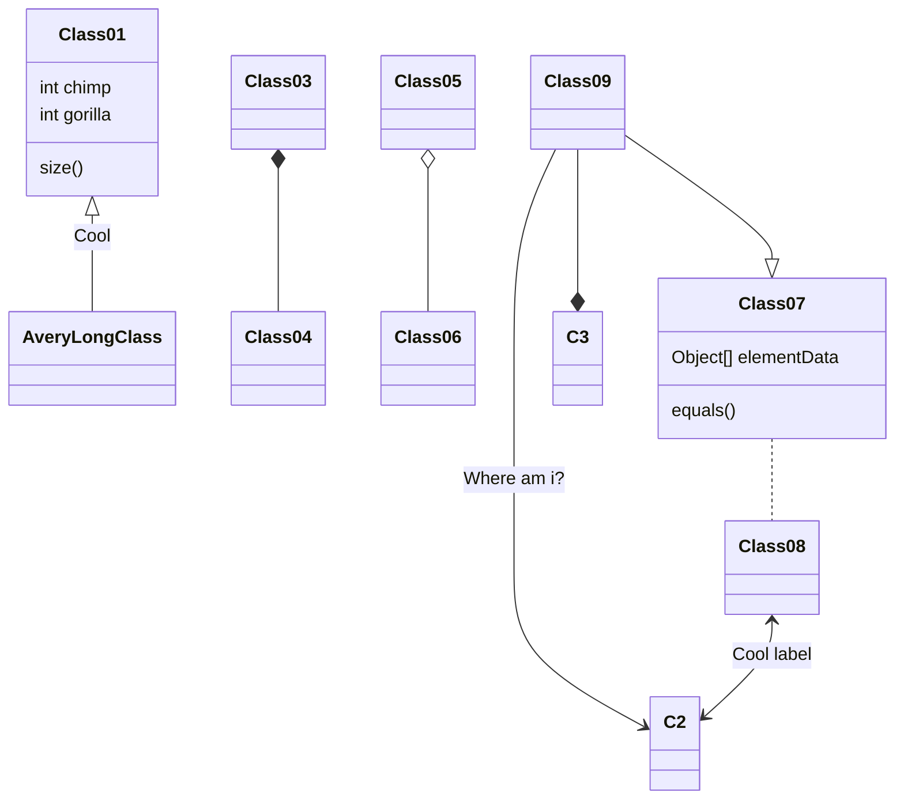

I've been involved in Full Stack for a while now in one form or another(either maintaining, designing or working on Full Stack projects). Even during school time, I was building websites for myself and my friends. I've built sites commercially even.
Although I've been using either pure HTML+JS or even PHP/Perl at some point. I rarely liked this activity, especially since the visual designs of the web pages were lacking and I just couldn't make myself study some visual design :(

At some point in time, I learned Django and Flask. I enjoyed building web apps using these frameworks a little bit more than in my school days when Python wasn't invented yet.
However, my outlook changed a little bit, when I tried writing embedded Web servers that served Angular/React SPA apps! Not to mention Web3 dApps that I've been exploring for a few years already.

Therefore it was not a surprise that I chose Django for ITOHI blog. I decided I didn't want to build anything myself and instead used [Mezzanine CMS](https://github.com/stephenmcd/mezzanine). And it was good for a while. I simply ran it bare on my server(Huge security risk, although despite many thousands of exploit scans I was seeing in the logs **daily** it remained unhacked).
Until I had to rebuild my server(the experiments I was doing required a newer Linux kernel). And this is where the frustration came in - the management of all the services that are needed for running Django... Not to mention the low performance of the whole shebang.
Also, I found myself immersed in code a lot these several years. And I discovered that I actively avoided logging into this otherwise convenient CMS. Drafts of new blog posts started piling up...

At some point in time I said "Enough!" and googled "Golang CMS" or something of resemblance. One particular result caught my eye: [Hugo: The world's fastest framework for building websites](https://gohugo.io).
This also was urged by the fact that I was building several projects that required proper performant backend (spoiler: I'm working on a distributed robot communication system based on NATS, gRPC. My aquarium being the testbed). And the fact, that I was actively migrating from Python to Golang(It went as far as migrating some C/C++ embedded projects to TinyGo! - that's how excited I am about Go.).

# Hugo

Contrary to what I was used to, Hugo is not a framework. It is not a template. It is not even a server or a library. It's a Static Site rendering toolkit.
The great thing about it is that you write Markdown and Hugo builds HTML, CSS and everything you need for your users to view your creation.

There are lots of themes, plugins, etc. Although, it appears that there are no default themes or recommended themes, so you must choose the one that is best fitting to your niche. Or, you can always create one. The Hugo website has ample resources to help you out there...

There are many tutorials on how to set up a basic Hugo site, even how to deploy it to Netlify or a similar service, so I won't be covering these. Instead, I'll cover what I found little info about and had to inspect a few projects in order to achieve what I wanted.

## Workflow

The workflow actually really appeals to the way I used to work recently.
Basically what you do is setup your favorite Static Site hosting, CI/CD pipeline for deployment and start writing those nice Markdown posts :)

At least that is what I've done:

- Setup Hugo project
- Choose a theme (hugo-clarity)
- Configure the theme
- Configure markdown (added Mermaid, Charts.js, WaveDrom, and Graph-Viz)
- Setup Github Pages
- Setup Github Actions

# Theme configurability

Most themes allow you to customize certain parts of it. For example, if you want to add a script or a style sheet - you can do that using `layouts`. Every theme has different ways to do that. The easiest way to figure out how to add something that is not in the theme is to inspect `themes/<theme name>/layouts/_defaults/baseof.html`. Then look at what is referenced there. Look at these
files and make note of empty ones.

For example, hugo-clarity theme has `layouts/partials/hooks` folder (referenced in `<head>...</head>` section in `baseof.html`). There are two partials `head` and `head-end`. I have used the `head-end` partial (`layouts/partials/hooks/head-end.html`) to add such features as Mermaid diagrams, Charts.js and others.

## Sometimes Hugo serve fails

Sometimes `hugo serve` fails and won't render your site properly. I found out that running `hugo mod clean` and then `hugo serve` again helps. I haven't encountered that while using git submodules, however, here I decided to use hugo modules instead. And apparently, Hugo module's cache sometimes corrupts or gets outdated. And in that case, Hugo renderer cannot find the required templates.

## GoAT

GoAt is a really powerful graphing tool that creates SVG from ASCII art. This is really helpful for those who cannot decide what tool to use: Paint, GIMP, InkScape, or Draw.io for their graphs...
Goat actually comes for free with Hugo.

```goat
      .               .                .               .--- 1          .-- 1     / 1
     / \              |                |           .---+            .-+         +
    /   \         .---+---.         .--+--.        |   '--- 2      |   '-- 2   / \ 2
   +     +        |       |        |       |    ---+            ---+          +
  / \   / \     .-+-.   .-+-.     .+.     .+.      |   .--- 3      |   .-- 3   \ / 3
 /   \ /   \    |   |   |   |    |   |   |   |     '---+            '-+         +
 1   2 3   4    1   2   3   4    1   2   3   4         '--- 4          '-- 4     \ 4
```

Generated using this code:

````markdown
```goat
      .               .                .               .--- 1          .-- 1     / 1
     / \              |                |           .---+            .-+         +
    /   \         .---+---.         .--+--.        |   '--- 2      |   '-- 2   / \ 2
   +     +        |       |        |       |    ---+            ---+          +
  / \   / \     .-+-.   .-+-.     .+.     .+.      |   .--- 3      |   .-- 3   \ / 3
 /   \ /   \    |   |   |   |    |   |   |   |     '---+            '-+         +
 1   2 3   4    1   2   3   4    1   2   3   4         '--- 4          '-- 4     \ 4
```
````

## Mermaid

[Mermaid](https://mermaid-js.github.io/mermaid/) is a versatile graphing tool that supports many different graphs. For example, class diagram can be drawn like this:



Generated using this code:

````markdown

````

## Charts.js

Sometimes it is needed to show some charts. And here is how to do it:

```chart
{
    "type": "bar",
    "data": {
        "labels": ["Red", "Blue", "Yellow", "Green", "Purple", "Orange"],
        "datasets": [{
            "label": "Bar Chart",
            "data": [12, 19, 18, 16, 13, 14],
            "backgroundColor": [
                "rgba(255, 99, 132, 0.2)",
                "rgba(54, 162, 235, 0.2)",
                "rgba(255, 206, 86, 0.2)",
                "rgba(75, 192, 192, 0.2)",
                "rgba(153, 102, 255, 0.2)",
                "rgba(255, 159, 64, 0.2)"
            ],
            "borderColor": [
                "rgba(255, 99, 132, 1)",
                "rgba(54, 162, 235, 1)",
                "rgba(255, 206, 86, 1)",
                "rgba(75, 192, 192, 1)",
                "rgba(153, 102, 255, 1)",
                "rgba(255, 159, 64, 1)"
            ],
            "borderWidth": 1
        }]
    }
}
```

Generated using this code:
````markdown
```chart
{
    "type": "bar",
    "data": {
        "labels": ["Red", "Blue", "Yellow", "Green", "Purple", "Orange"],
        "datasets": [{
            "label": "Bar Chart",
            "data": [12, 19, 18, 16, 13, 14],
            "backgroundColor": [
                "rgba(255, 99, 132, 0.2)",
                "rgba(54, 162, 235, 0.2)",
                "rgba(255, 206, 86, 0.2)",
                "rgba(75, 192, 192, 0.2)",
                "rgba(153, 102, 255, 0.2)",
                "rgba(255, 159, 64, 0.2)"
            ],
            "borderColor": [
                "rgba(255, 99, 132, 1)",
                "rgba(54, 162, 235, 1)",
                "rgba(255, 206, 86, 1)",
                "rgba(75, 192, 192, 1)",
                "rgba(153, 102, 255, 1)",
                "rgba(255, 159, 64, 1)"
            ],
            "borderWidth": 1
        }]
    }
}
```
````

## WaveDrom

Since this blog is mostly about electronics and embedded programming, I need to draw timing diagrams. And [WaveDrom](https://wavedrom.com/tutorial.html) is a perfect way to add them:

```wave
{ signal: [
  { name: "clk",         wave: "p.....|..." },
  { name: "Data",        wave: "x.345x|=.x", data: ["head", "body", "tail", "data"] },
  { name: "Request",     wave: "0.1..0|1.0" },
  {},
  { name: "Acknowledge", wave: "1.....|01." }
]}
```

Generated using this code:
````markdown
```wave
{ signal: [
  { name: "clk",         wave: "p.....|..." },
  { name: "Data",        wave: "x.345x|=.x", data: ["head", "body", "tail", "data"] },
  { name: "Request",     wave: "0.1..0|1.0" },
  {},
  { name: "Acknowledge", wave: "1.....|01." }
]}
```
````

## Graph-Viz

When Mermaid lacks versatility, or you need to add something really unique, you can definitely do it with Graph-Viz using [.DOT language](https://graphviz.org/doc/info/lang.html).
However, I have added an outdated [JS library](https://github.com/mdaines/viz.js) that uses hacks to enable GraphViz support via JS... So I'm not sure when that feature goes out of date...

```viz-dot
digraph G {

  subgraph cluster_0 {
    style=filled;
    color=lightgrey;
    node [style=filled,color=white];
    a0 -> a1 -> a2 -> a3;
    label = "process #1";
  }

  subgraph cluster_1 {
    node [style=filled];
    b0 -> b1 -> b2 -> b3;
    label = "process #2";
    color=blue
  }
  start -> a0;
  start -> b0;
  a1 -> b3;
  b2 -> a3;
  a3 -> a0;
  a3 -> end;
  b3 -> end;

  start [shape=Mdiamond];
  end [shape=Msquare];
}
```

Generated using this code:

````markdown
```viz-dot
digraph G {

  subgraph cluster_0 {
    style=filled;
    color=lightgrey;
    node [style=filled,color=white];
    a0 -> a1 -> a2 -> a3;
    label = "process #1";
  }

  subgraph cluster_1 {
    node [style=filled];
    b0 -> b1 -> b2 -> b3;
    label = "process #2";
    color=blue
  }
  start -> a0;
  start -> b0;
  a1 -> b3;
  b2 -> a3;
  a3 -> a0;
  a3 -> end;
  b3 -> end;

  start [shape=Mdiamond];
  end [shape=Msquare];
}
```
````

Actually, I decided to use Graph-Viz after I discovered [WireWiz](https://github.com/formatc1702/WireViz) tool that allows generating wiring diagrams. And internally it uses Graph Python library. I thought I could replicate it using pure GraphViz engine since sometimes it is really handy showing how certain prototypes are wired together without actually drawing any schematics...

```viz-dot
digraph structs {
    node [shape=record];
    rankdir=LR;
    esp32 [label="ESP32 | { {PIN|GPIO26|GPIO25|GPIO22|GPIO0|EN|GND|VCC} | {Name|<26> BCK|<25> WS|<22> DOUT|<0> MCLK|<7> EN|<5> GND|<6> VCC} }"];
    pwr [label="POWER | {<5> GND} | {<6> VCC}"];
    cs4344 [label="CS4344 module | { {PIN|<1> 1|<2> 2|<3> 3|<4> 4|<5> 5|<6> 6} | {Name|SDIN|SCLK|LRCLK|MCLK|GND|VCC} }"];
    // cs4344 [label="CS4344 module | {PIN|Name} | {<1> 1|SDIN} | {<2> 2|SCLK} | {<3> 3|LRCLK} | {<4> 4|MCLK} | {<5> 5|GND} | {<6> 6|VCC}"];
    "pwr":5 -> "esp32":5[color=blue];
    "pwr":5 -> "cs4344":5[color=blue];
    "pwr":6 -> "esp32":6[color=red];
    "pwr":6 -> "esp32":7[color=blue];
    "pwr":6 -> "cs4344":6[color=red];
    "esp32":0 -> "cs4344":4;
    "esp32":26 -> "cs4344":2;
    "esp32":25 -> "cs4344":3;
    "esp32":22 -> "cs4344":1;
}
```

Using this code:

````markdown
```viz-dot
digraph structs {
    node [shape=record];
    rankdir=LR;
    esp32 [label="ESP32 | { {PIN|GPIO26|GPIO25|GPIO22|GPIO0|EN|GND|VCC} | {Name|<26> BCK|<25> WS|<22> DOUT|<0> MCLK|<7> EN|<5> GND|<6> VCC} }"];
    pwr [label="POWER | {<5> GND} | {<6> VCC}"];
    cs4344 [label="CS4344 module | { {PIN|<1> 1|<2> 2|<3> 3|<4> 4|<5> 5|<6> 6} | {Name|SDIN|SCLK|LRCLK|MCLK|GND|VCC} }"];
    "pwr":5 -> "esp32":5[color=blue];
    "pwr":5 -> "cs4344":5[color=blue];
    "pwr":6 -> "esp32":6[color=red];
    "pwr":6 -> "esp32":7[color=blue];
    "pwr":6 -> "cs4344":6[color=red];
    "esp32":0 -> "cs4344":4;
    "esp32":26 -> "cs4344":2;
    "esp32":25 -> "cs4344":3;
    "esp32":22 -> "cs4344":1;
}
```
````

Note to self: Table-like labels are not supported in this version of Graphviz. Also, this version of GraphViz requires ports to be numbers and record names to be surrounded by double quotes in order to properly connect ports.

# p5js

[P5js](https://github.com/processing/p5.js) is a very powerful JavaScript library that allows you to create intricate animations and graphics. P5js is even used in NFTs!
For example, this snippet:

````markdown
```p5js
// this class describes the properties of a single particle.
class Particle {
// setting the co-ordinates, radius and the
// speed of a particle in both the co-ordinates axes.
  constructor(){
    this.x = sketch.random(0,sketch.width);
    this.y = sketch.random(0,sketch.height);
    this.r = sketch.random(1,8);
    this.xSpeed = sketch.random(-2,2);
    this.ySpeed = sketch.random(-1,1.5);
  }

// creation of a particle.
  createParticle() {
    sketch.noStroke();
    sketch.fill('rgba(200,169,169,0.5)');
    sketch.circle(this.x,this.y,this.r);
  }

// setting the particle in motion.
  moveParticle() {
    if(this.x < 0 || this.x > sketch.width)
      this.xSpeed*=-1;
    if(this.y < 0 || this.y > sketch.height)
      this.ySpeed*=-1;
    this.x+=this.xSpeed;
    this.y+=this.ySpeed;
  }

// this function creates the connections(lines)
// between particles which are less than a certain distance apart
  joinParticles(particles) {
    particles.forEach(element =>{
      let dis = sketch.dist(this.x,this.y,element.x,element.y);
      if(dis<85) {
        sketch.stroke('rgba(255,255,255,0.04)');
        sketch.line(this.x,this.y,element.x,element.y);
      }
    });
  }
}

// an array to add multiple particles
let particles = [];

sketch.setup = () => {
  sketch.createCanvas(720, 400);
  for(let i = 0;i<sketch.width/10;i++){
    particles.push(new Particle());
  }
}

sketch.draw = () => {
  sketch.background('#0f0f0f');
  for(let i = 0;i<particles.length;i++) {
    particles[i].createParticle();
    particles[i].moveParticle();
    particles[i].joinParticles(particles.slice(i));
  }
}
```
````

will create this kind of embedded application:

```p5js
// this class describes the properties of a single particle.
class Particle {
// setting the co-ordinates, radius and the
// speed of a particle in both the co-ordinates axes.
  constructor(){
    this.x = sketch.random(0,sketch.width);
    this.y = sketch.random(0,sketch.height);
    this.r = sketch.random(1,8);
    this.xSpeed = sketch.random(-2,2);
    this.ySpeed = sketch.random(-1,1.5);
  }

// creation of a particle.
  createParticle() {
    sketch.noStroke();
    sketch.fill('rgba(200,169,169,0.5)');
    sketch.circle(this.x,this.y,this.r);
  }

// setting the particle in motion.
  moveParticle() {
    if(this.x < 0 || this.x > sketch.width)
      this.xSpeed*=-1;
    if(this.y < 0 || this.y > sketch.height)
      this.ySpeed*=-1;
    this.x+=this.xSpeed;
    this.y+=this.ySpeed;
  }

// this function creates the connections(lines)
// between particles which are less than a certain distance apart
  joinParticles(particles) {
    particles.forEach(element =>{
      let dis = sketch.dist(this.x,this.y,element.x,element.y);
      if(dis<85) {
        sketch.stroke('rgba(255,255,255,0.04)');
        sketch.line(this.x,this.y,element.x,element.y);
      }
    });
  }
}

// an array to add multiple particles
let particles = [];

sketch.setup = () => {
  sketch.createCanvas(720, 400);
  for(let i = 0;i<sketch.width/10;i++){
    particles.push(new Particle());
  }
}

sketch.draw = () => {
  sketch.background('#0f0f0f');
  for(let i = 0;i<particles.length;i++) {
    particles[i].createParticle();
    particles[i].moveParticle();
    particles[i].joinParticles(particles.slice(i));
  }
}
```

Please note, though, that the content must be trusted since JS code is injected in the resulting page as is. This unfortunately opens up for XSS attacks.
Also, note how `sketch.` is all over the place? This is due to the way the code block is rendered in the shortcode:

```markdown
<div id='p5jsContainer{{ .Page.Store.Get "P5JSInstances" }}'>
</div>
<script>
new p5((sketch) => {
  {{ .Inner | safeJS }}
}, 'p5jsContainer{{ .Page.Store.Get "P5JSInstances" }}');
</script>
{{ .Page.Store.Add "P5JSInstances" 1 }}
```

In this case, `sketch` variable is the context of the p5 rendering engine. Therefore, if you were to transfer any sketches from p5 editor, you would also add `sketch.` to things that are normally 
declared by p5 when it loads.

# Conclusion

So far I've been enjoying Hugo and the concept of SSW. And I only touched the surface of it. All the features mentioned previously were added sloppily and might induce certain unpleasant emotions in
JS professionals... But for now, it works and that is all I need, currently.

Quite recently I found out that Grammarly is available in VSCode!