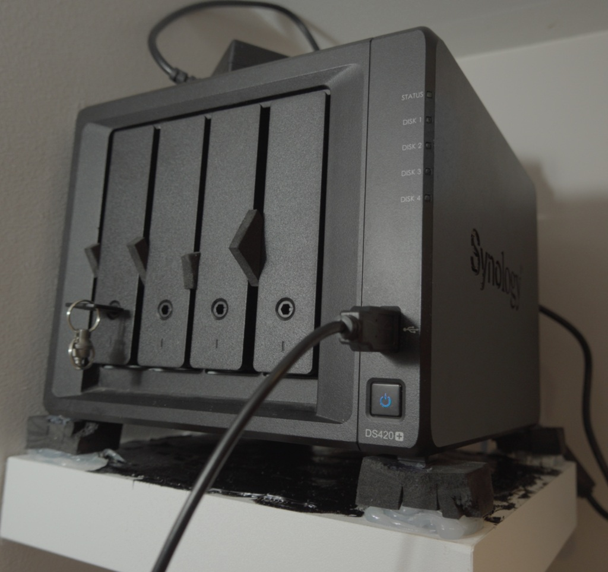
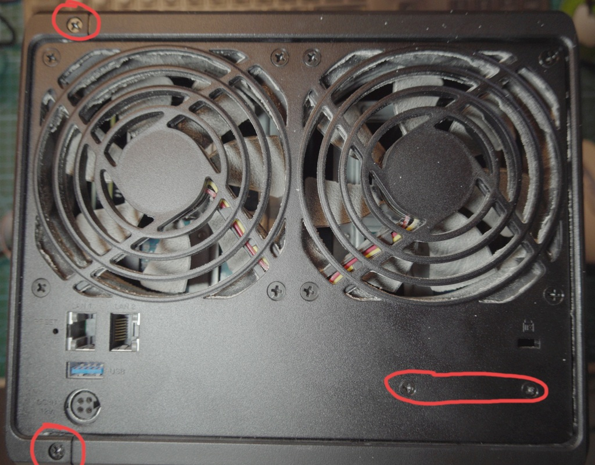
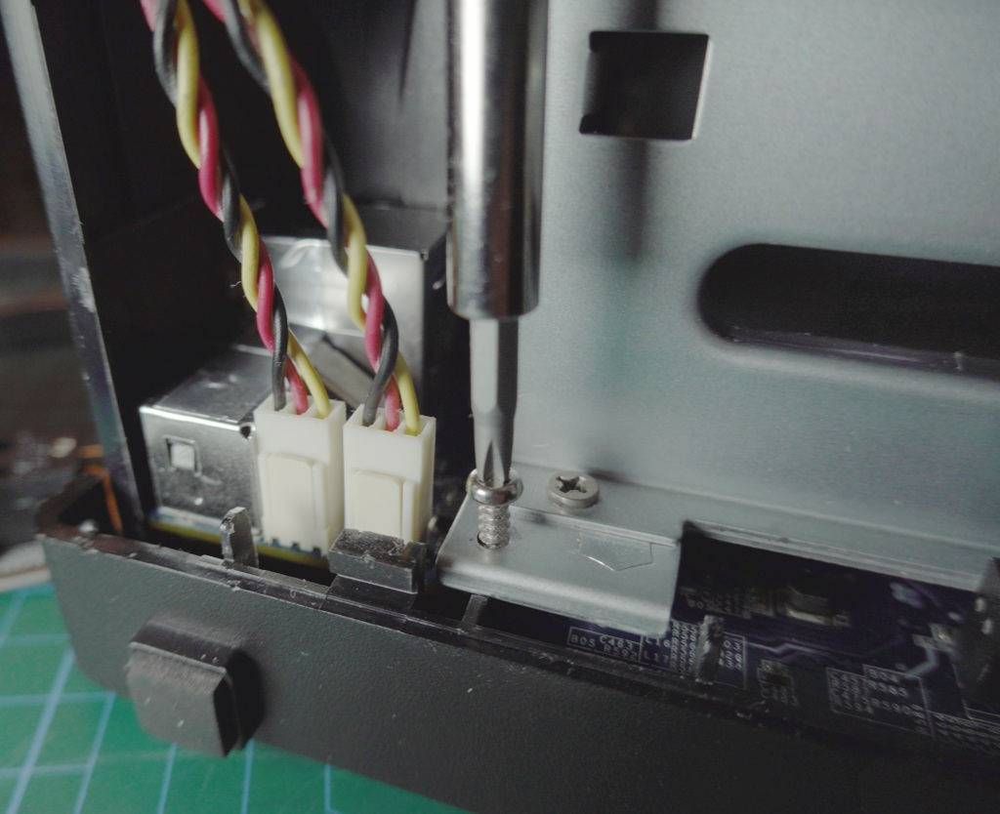
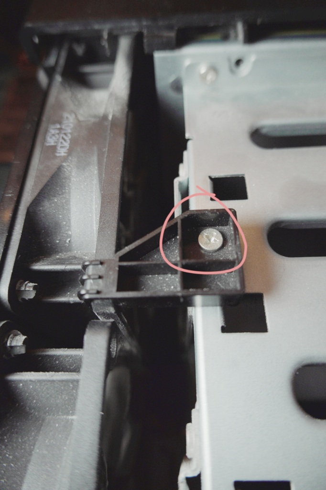
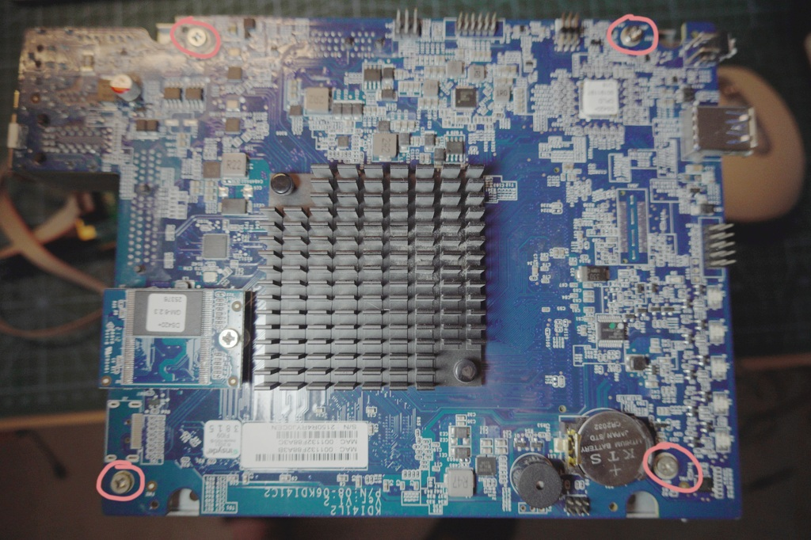
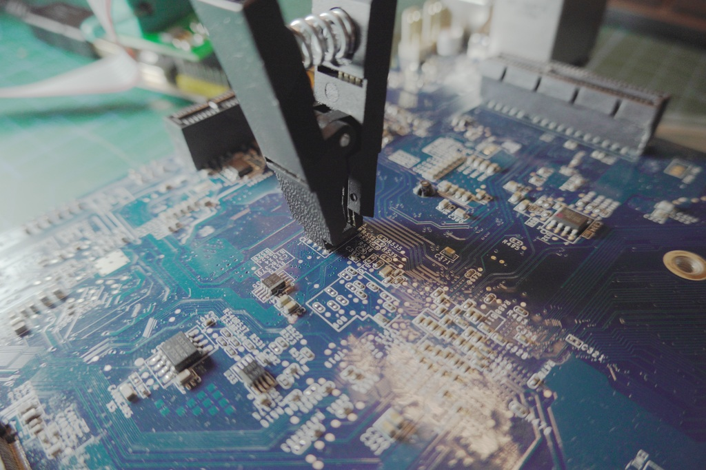
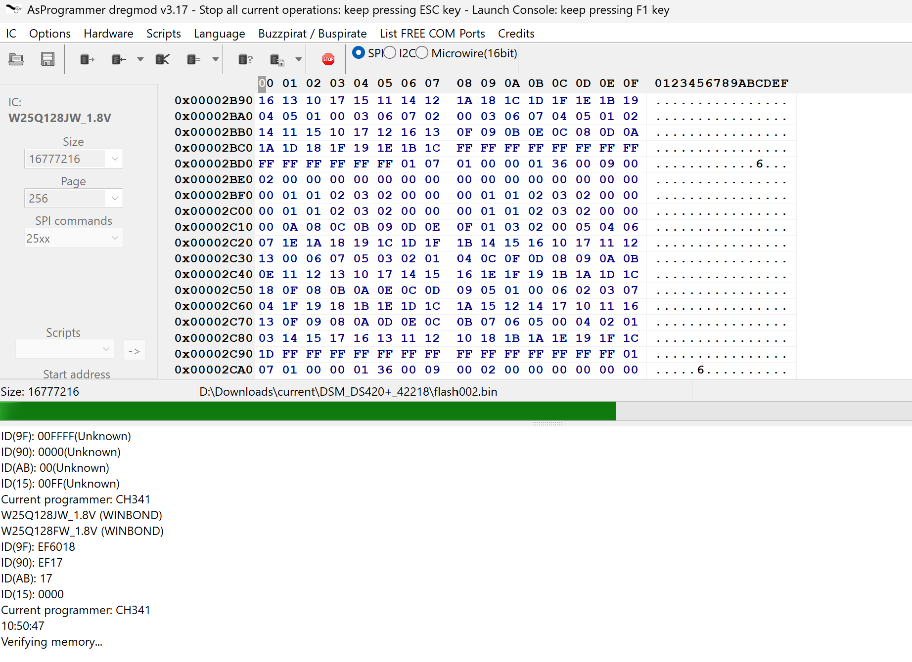

Vieną dieną mano DS420+ tiesiog numirė - nebeįsijungė. Na, ne visiškai mirė - jis įsijungė, ventiliatoriai suktėsi, diskai taip pat sukinėjosi ir įprastai urzgė, mėlyna lemputė mirksėjo... bet tiek. Jokio tinklo, jokių pyptelėjimų, nieko.



## Pradinė diagnostika

Pirmiausia bandžiau išimti visus diskus. Kartais blogas diskas gali neleisti krautis. Ne - ta pati mirksinti mėlyna lempa.

Ištraukiau RAM modulį. Vis tiek mirksi.

Ištraukiau M.2 SSD cache. Atspėjote - vis tiek mirksi.

Laikas patikrinti maitinimo šaltinį. Prijungiau multimetrą ir patvirtinau, kad jis duoda 12V. Maitinimo blokas tikriausiai veikia... Tuo metu nežinojau, kad PSU yra dažna gedimų vieta Synology įrenginiuose, bet esu peržiūrėjęs per daug laptopų remonto vaizdo įrašų, todėl nusprendžiau išardyti ir pažiūrėti, kaip atrodo pagrindinė plokštė.

Mano mintis buvo, kad kažkas negerai su RAM arba spartinančiąja atmintimi dėl dulkių (kai kurie kaimynai atliko remontą gana neatsakingai, todėl prieš kelis mėnesius mano laptopo ventiliatoriai mirė dėl visų statybinių dulkių - jau nekalbu apie sudirgusias akis, galvos skausmą ir pan.) kažką užtrumpinančių viduje. Taigi, jei nepastebėsiu nieko akivaizdžiai nudegusio, bent jau išvalysiu vidų nuo dulkių. Be to, dulkės (ypač statybinės) gali pakeisti signalo linijos impedansą, kas pabloginana signalus ten, kur tai svarbiausia (pvz., didelės spartos PCIE), todėl gera mintis palaikyti grandynus švarius.

## Laikas imtis ardymo

Gerai, pažiūrėkime, kas viduje. Teko pažiūrėti kelis išardymo vaizdo įrašus, kad suprasčiau, kaip jis surinktas, taigi štai žingsnis po žingsnio išardymo seka... Bet pirmiausia - išimkite visus stalčius (**ir įsiminkite tvarką** - tai svarbu, jei vertinate savo duomenis!)

Šis NAS įrenginys susideda iš dviejų dalių, kurios išslysta viena iš kitos, kai tam tikri varžtai yra išsukti. Žinoma, pirmiausia reikia išsukti varžtelius



Nereikia išsukinėti ventiliatorių varžtų. Dabar tiesiog atjunkite ventiliatorius, išsukite stalčių korpusą (yra keturi varžtai kiekviename kampe - taip pat galite atsukti stalčių korpusą nuo pagrindinės plokštės, bet tai galima padaryti vėliau)



Ir ventiliatorių laikiklius



Ir voila - turite pagrindinę plokštę. Atkreipkite dėmesį į varžtus, tvirtinančius ją prie korpuso (galėjote atsukti kitą pusę vietoj šios)



Patikrinau kondensatorius paprastu LCR zondu - jokių trumpųjų jungčių, talpos atrodo pakankamai didelės, viskas gerai. CMOS baterija gera(3.25V).
Prijungiau PSU ir atsargiai išmatavau įtampas plokštėje prie kiekvieno kondensatoriaus "+" kontakto - 12V, 5V, 3.3V, 1.2V, 1V magistralės visos yra. CPU turėtų gauti maitinimą. Jis šyla, bet ne per daug. Mano paties pagaminta šiluminė kamera nemato jokių karštų taškų - tai reiškia, kad greičiausiai niekur netrumpina.

Taigi, trumpinimai ir akivaizdžiai sugedusios dalys atmestos. PSU turi veikti, nes visos įtampos yra. Nuoga pagrindinė plokštė neturėtų reikalauti daug srovės, todėl vien įtampos nėra rodiklis - bet sakykim viskas čia gerai.

Skaičiau forumuose ir reddit, kad įprastas įtariamasis gali būti DOM USB Flash valdymo mikroschema(Prisukta plokštelė su NAND FLASH čipu). Tačiau paprastai kalba apie USBest gamintoją - kontrolerio pakeitimas paprastai išsprendžia krovimosi problemas, bet mano yra kitoks - PHISON, ir neaišku, ar jo perlitavimas padėtų. Pirmiausia turėčiau jį prijungti prie laptopo ir patikrinti skaitymo spartas bei patikrinti ar yra skaitymo klaidų.
Bet tas žingsnis turėtų būti atliktas patvirtinus jo kaltę (aš tiesiog tingiu lituot USB adapterį jam)! Taigi, prisijunkime prie pagrindinės plokštės Serial Debug Port ir pažiūrėkime, kuo ji iš tiesų nepatenkinta.


Laimei, yra būdas prisijungti prie debug konsolės. Prisijungiau prie UART kontaktų, paleidau terminalą 115200 greičiu, įjungiau... nieko. Nė vieno simbolio. Tai blogai - reiškia, kad CPU net nevykdo bios kodo. Patikrinau oscilografu tik tam, kad patvirtinčiau - taip, jokios veiklos.

Beje, iš tiesų nebūtina ardyti viso NAS, kad pasiekt šį prievadą! Kažkur apačioje yra durelės, kurios suteikia prieigą prie šių kontaktų. Tačiau kiekvienas įrenginys skiriasi...

## BIOS problema

DS420+ naudoja Winbond W25Q128JWSIQ - 16MB (128Mbit) 1.8V SPI flash mikroschemą BIOS. Prijungiau oscilografą prie CLK kontakto, kad pamatyčiau, ar yra kokia nors SPI veikla.


Kažkas vyksta MISO/MOSI/CLK kontaktuose maždaug 2-3 sekundes, tada sustoja. Greičiausiai CPU bando skaityti flash, užkliumpa už sugadintų duomenų ir pasiduoda. Klasikinis sugadintas BIOS. Forumai patvirtino, kad tai gali būti atvejis. Greičiausiai nutrauktas arba sugadintas firmware atnaujinimas (matyt, bios įrašomas su kiekvienu firmware atnaujinimu ir kai kuriems žmonėms kai kuriuose modeliuose - kiekvieno mašinos paleidimo metu!).

## BIOS ištraukimas ir taisymas

Laimei, turėjau CH341A programavimo įrankį. Bet neturėjau 1.8V adapterio (kritiškai svarbu - mikroschema yra 1.8V, ne 3.3V!). Teko užsisakyti tokį ir jam atvykus, gavau štai ką:


**Svarbu:** Dauguma CH341A plokščių pagal nutylėjimą išveda 5V dėl gamintojo klaidos, kuri greičiausiai užmuš 3.3V ir beveik tikrai sudegins 1.8V mikroschemas. Modifikavimo instrukcijas galite rasti [čia](https://github.com/OpenIPC/wiki/blob/master/en/hardware-programmer-ch341a-voltage-fix.md).

Pataisęs savo flash programuotoją, prisegiau jį prie W25Q128JWSIQ mikroschemos. Palikau 3 (WP) ir 7 (HOLD) kontaktus atjungtus - jų prijungimas gali sukelti problemų programavimo metu.

**Planas**:

0. Prieš įrašant bet ką, reikia nuskaityti esamą BIOS (bent 2 kartus, kad patikrintumėte, jog duomenys teisingi ir programuotojas veikia tinkamai)
1. Atsisiųsti DSM 7 PAT failą DS420+ (Jūsų modeliui bus kitas failas, žinoma)
2. Ištraukti `bios.ROM` iš jo (PAT failas yra tiesiog archyvas - su 7zip atsidaro puikiai)
3. Nupjauti Synology antraštes/poraštes naudojant žemiau esantį Python skriptą
4. Palyginti su savo bios atsarginiais failais - daug baitų turėtų sutapti, ypač pradžioje
5. Įrašyti
   1. Pirmiausia įsitikinkite, kad patvirtinote su savo atsargine kopija
   2. Ištrinkite mikroschemą
   3. Įkelkite savo `flash.bin` failą
   4. Patikrinkite!
6. Pabandykite jį paleisti, kai prijungtas prie plokštės nuosekliojo prievado. Skirkite jam kelias minutes, bet linux krautimosi pranešimai turėtų pradėti tekėti po kelių sekundžių
7. Jei jūsų DOM yra tvarkoje, turėtumėte išgirsti pyptelėjimą

Synology apvelka BIOS kodą metaduomenimis. Tikrasis BIOS yra tarp dviejų parašų: `$_IFLASH_BIOSIMG` (pradžia) ir `$_IFLASH_INI_IMG` (pabaiga). Visa, kas prieš ir po, turi būti nupjauta. Tada užpildykite rezultatą nuliukais, kad pasiektumėte lygiai 16MB.

Štai Python skriptas, kurį parašiau tam padaryti:

```python
#!/usr/bin/env python3

import argparse
import sys

CHIP_SIZE = 16 * 1024 * 1024  # 16MB

def main():
  parser = argparse.ArgumentParser(
    description='Extract BIOS from Synology PAT file'
  )
  parser.add_argument('-i', '--input', default='bios.ROM', 
                      help='Input bios.ROM from PAT file')
  parser.add_argument('-o', '--output', default='flash.bin',
                      help='Output file (16MB)')
  args = parser.parse_args()

  # Read input
  with open(args.input, 'rb') as f:
    data = f.read()

  print(f"Input: {len(data)} bytes ({len(data)/(1024*1024):.2f} MB)\n")

  # Find signatures
  header_str = b'$_IFLASH_BIOSIMG'
  header_size = len(header_str) + 8
  header_idx = data.find(header_str)
  footer_idx = data.find(b'$_IFLASH_INI_IMG')

  if header_idx == -1 or footer_idx == -1:
    print("Error: Signatures not found")
    sys.exit(1)

  print(f"Header ends at: 0x{header_idx:X}")
  print(f"Footer at: 0x{footer_idx:X}")

  # Extract BIOS
  bios_data = data[header_idx+header_size:footer_idx]
  bios_size = len(bios_data)
  pad_size = CHIP_SIZE - bios_size

  print(f"\nBIOS: {bios_size} bytes ({bios_size/(1024*1024):.2f} MB)")
  print(f"Padding: {pad_size} bytes ({pad_size/(1024*1024):.2f} MB)")

  # Write: [BIOS] + [zeros]
  with open(args.output, 'wb') as f:
    f.write(bios_data)
    f.write(b'\x00' * pad_size)

  print(f"\n✓ Created: {args.output} ({CHIP_SIZE} bytes)")

if __name__ == '__main__':
   main()
```

Naudojimas:

```bash
# Išskleisti PAT failą
7z x DSM_DS420+_xxxxx.pat

# Paleisti skriptą
python3 extract_bios.py -i bios.ROM -o flash.bin
```

Išvestis:

```
Input: 9437184 bytes (9.00 MB)

Header at: 0xAD1D0
Footer at: 0x8AD1D0

BIOS: 8388608 bytes (8.00 MB)
Padding: 8388608 bytes (8.00 MB)

✓ Created: flash.bin (16777216 bytes)
```

## BIOS įrašymas

PASTABA: Įsitikinkite, kad nuskaitėte flash ir išsaugojote - tik tam atvejui! Atsarginės kopijos niekada nekenkia. Be to, gal jum smalsu, kokie gi baitai jūsų biose buvo sugadinti! Mano turėjo kelių baitų skirtumus
pradžioje ir atsitiktinėse vietose. Jei ši problema pasikartos, greičiausiai teks pakeisti mikroschemą.

Naudojau AsProgrammer su CH341A, bet iš tikrųjų bet kuris flash programuotojas turėtų tikti. Aptiko mikroschemą kaip W25Q128JWSIQ (tai įsitikina, kad ryšys su mikroschema yra užmegztas), įkėliau `flash.bin` ir paspaudžiau įrašyti.



Laukiau maždaug porą minučių, kol įrašymas bus baigtas. Paverifikavau, kad įrašymas buvo sėkmingas. Atsegiau programuotoją, prijungiau PSU, paspaudžiau maitinimo mygtuką ir...



Jis užsibootino! Mėlyna švieselė nustojo mirksėti, išgirdau pyptelėjimą, tinklas atsirado. Nuoseklioji konsolė parodė visą bootinimosi seką. MAC adresas išliko iš atskiros 512Kbit flash mikroschemos.

DS420+ gyvas! Būtų gerai ir DOM atsarginę kopiją pasidaryti. Skaičiau, kad galima naudoti įprastą USB flash - tik reikia perprogramuoti gamintojo informaciją. Gal kitą kartą...

Jei jūsų Synology užstrigo su mirksančia mėlyna lempa ir be neparodo kitų gyvybės ženklų, yra vilties. Aparatinė įranga tikriausiai tvarkoje - tai tik sugadintas firmware, arba blogas maitinimo šaltinis. Nors internetuose mačiau keletą bjauriai susprogusių keramikinių...
Ir beje, panašus metodas gali būti taikomas beveik bet kuriam DS serijos NAS.

## Nuorodos ir naudingi puslapiai

- `r/synology` ir `r/synology_support`
- Jei reikia taisyti sugadintą DOM: https://xpenology.com/forum/topic/9804-ds412-usb-flash-module-pinout/
- Šiek tiek susijęs su in-system BIOS mikroschemų įrašymu: https://www.downtowndougbrown.com/2021/12/upgrading-a-motherboards-bios-uefi-the-hard-way/
- https://forum.doozan.com/read.php?3,128079,page=1
- https://xpenology.com/forum/topic/70824-i-need-help-recovering-the-bios-on-my-rs815/
- https://www.synoforum.com/threads/bios-for-ds1817.12758/
- https://www.synoforum.com/threads/help-required-to-recover-my-bricked-ds220.12393/#post-62071
- Šis [vaizdo įrašas](https://www.youtube.com/watch?v=UELYOvFPeLs) padėjo man su išardymu
- Šis [vaizdo įrašas](https://www.youtube.com/watch?v=IxxjOLzy30o) arba šis [vaizdo įrašas](https://www.youtube.com/watch?v=pujpr-hd8bw) yra apie kitą NAS modelį, bet turi labai naudingų patarimų apie įprastas problemas ir sprendimus!
- Šis [vaizdo įrašas](https://www.youtube.com/watch?v=c89vFpvMC5M) apie DOM remontą (galite ieškoti xpenology forumuose, kad rastumėte alternatyvų!)
- Daugiau detalių apie nuosekliojo prievado prijungimą: https://www.reddit.com/r/synology_service/comments/1ohptep/when_you_want_to_connect_to_the_nas_serial_port/