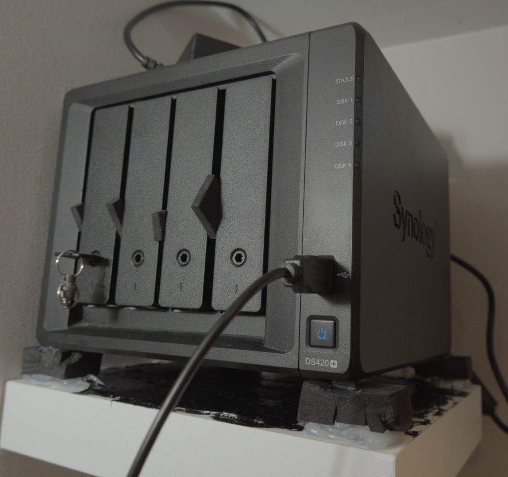
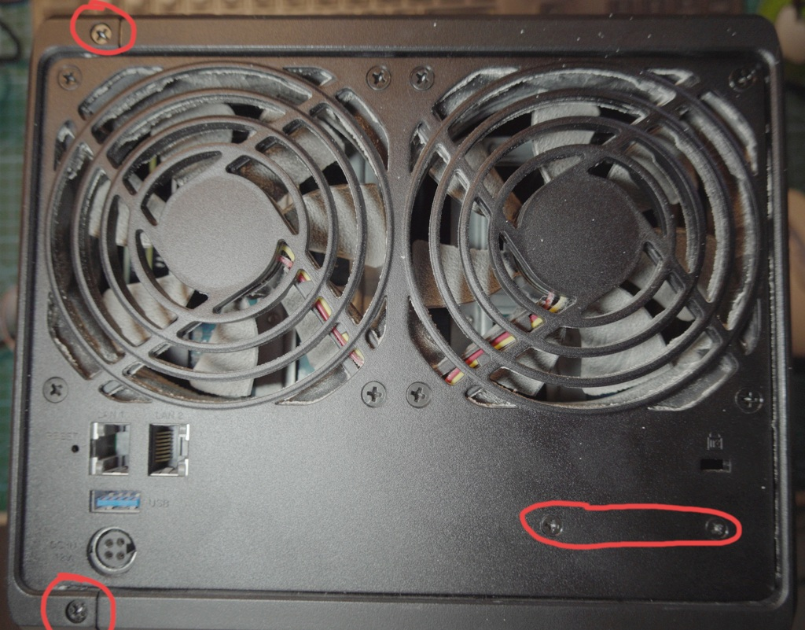
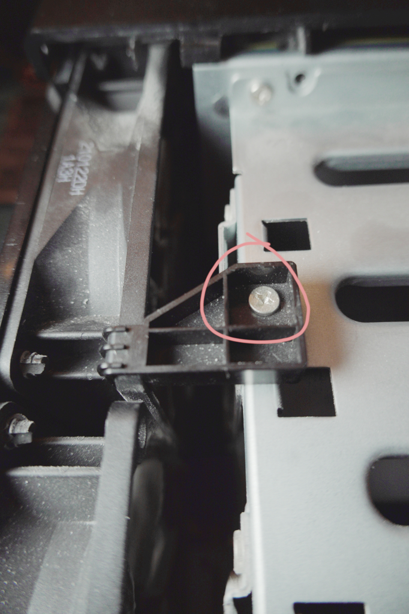
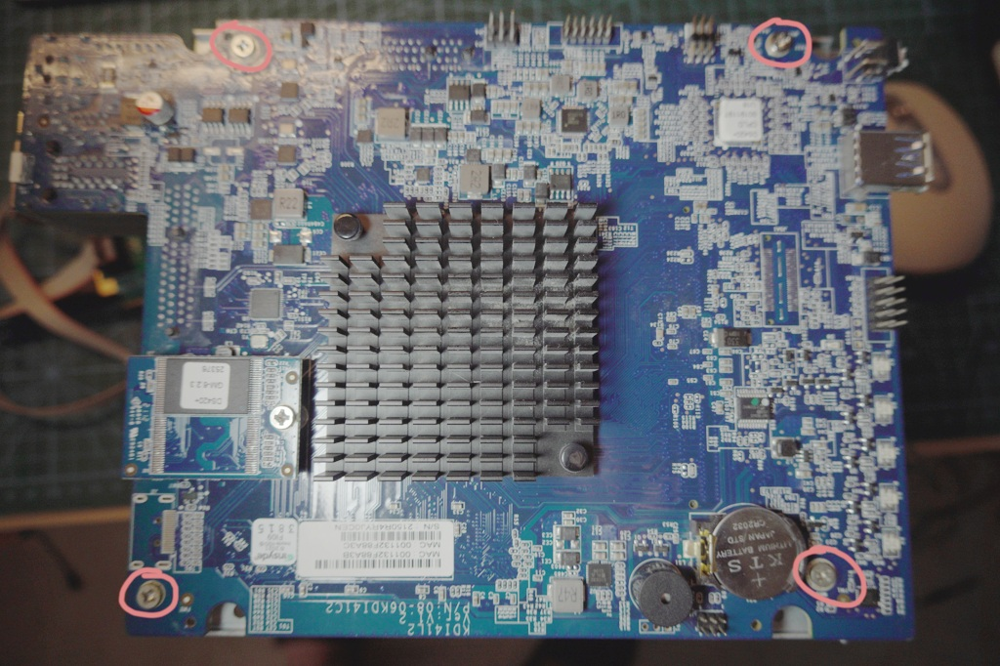
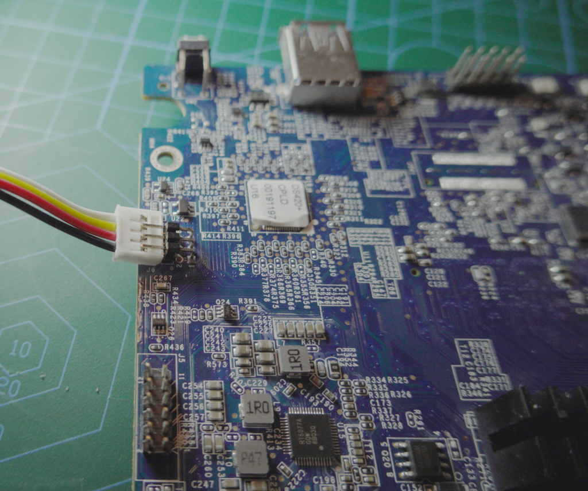
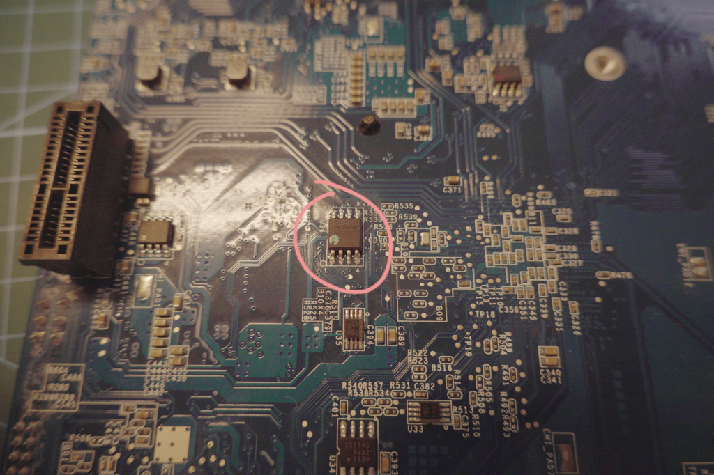
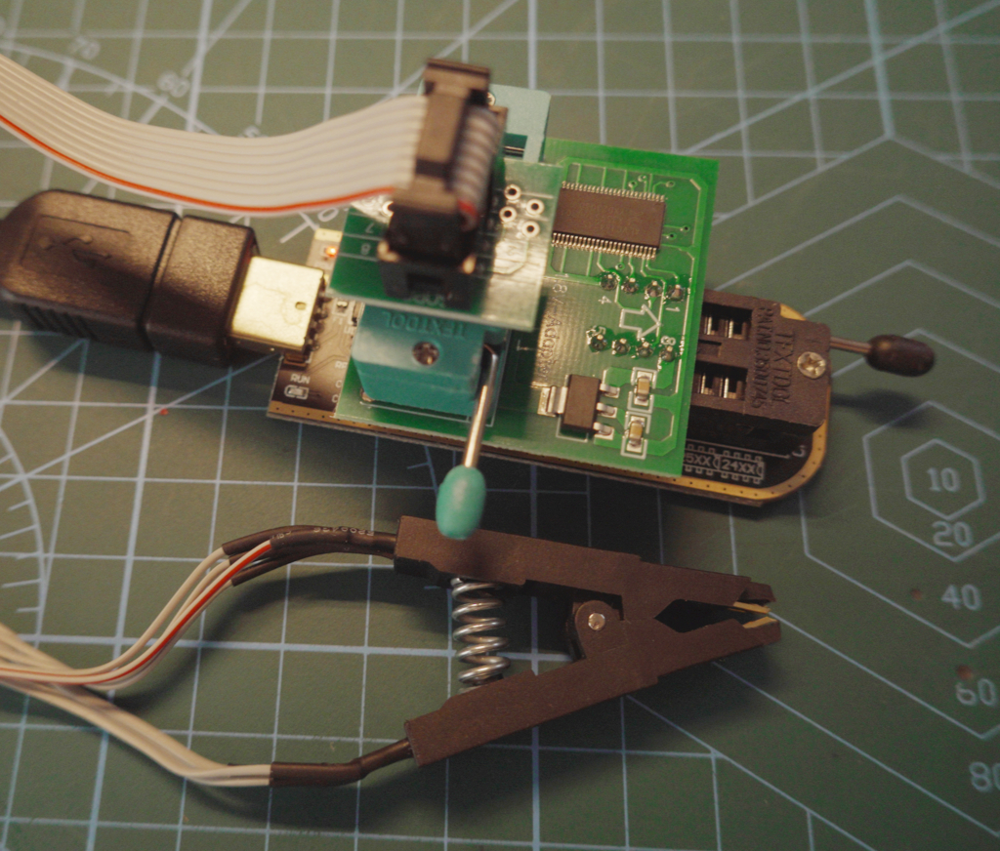
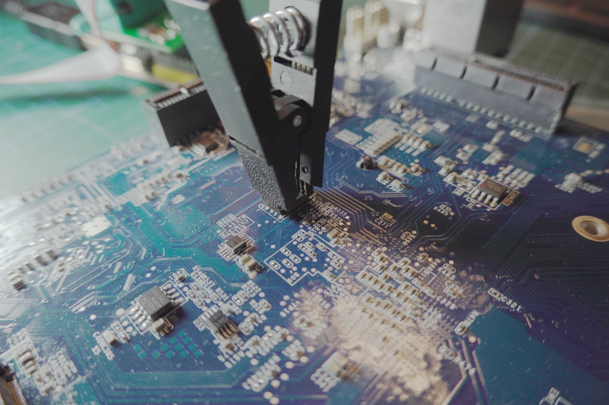
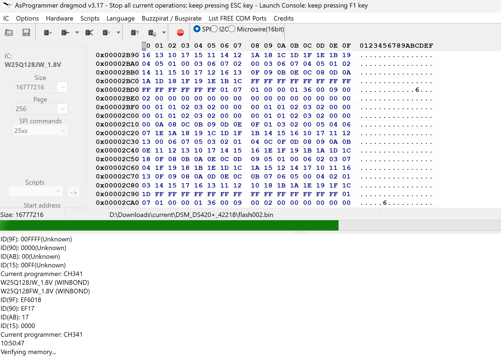

One day my DS420+ just died. Well, not completely dead - it powered on, fans spun up, disks spun up too, blue LED blinked... but that was it. No network, no beeps, nothing. Just an expensive paperweight with my data trapped inside.



## Initial Diagnostics

First thing I tried was removing all the drives. Sometimes a bad drive can prevent boot. Nope - same blinking blue LED.

Removed the RAM stick. Still blinking.

Pulled out the M.2 cache SSD. You guessed it - still blinking.

Time to check the power supply. Connected the multimeter and verified it has 12V. PSU might be fine... At that point I didn't know that PSU is a common failure point in Synology devices, but I've watched too many 
laptop repair videos, so decided to tear down the unit and see how the mother board looks like.

My thinking was that something was wrong with RAM or cache SSD due to dust (Some neighbors did a renovation in a rather irresponsible manner so that a few months back my laptop fans died due to all the construction dust - not to mentino eye irritation, etc.) shorting something inside. So if I don't spot anything obviously burnt I'd at least clean it. Also, dust(especially construction dust) can change signal line impedance degrading signals where they matter (e.g. high speed PCIE), so it's a good idea to keep the boards clean.

## Teardown Time

Alright, let's see what's inside. Had to look at a few teardown videos to understand how it is assembled, so, here is a step by step teardown sequence... But first - remove all the trays(and **remember the order** - this is important if you value your data!)

This NAS unit consists of two parts that slide off each other once certain screws are removed. Of course first you need to 



No need to remove fan screws. Now just disconnect the fans, unscre the bay chassis (there are four screws on each corner - you can also unscrew the bay chassis from the motherboard, but it can be done later)


And fan holding brackets



And vuola - you have the motherboard. Note the screws securing it to the chassis(you could unscew the other side instead)



Checked capacitors with simple probe - no shorts, capacitances seem reasonably high, all good. CMOS battery measures fine.
Connected PSU and carefully measured voltages on the board at each capacitor + terminal - 12V, 5V, 3.3V, 1.2V, 1V rails all present. CPU should be getting power. It is getting warm, but not too warm. My DIY thermal camera doesn't see any hotspots - this means possibly no shorts and no broken capacitors.

So, shorts and obviously broken parts ruled out. PSU must be working since all he voltages are present. Bare motherboard shouldn't draw a lot of current, so voltages alone aren't an indicator.

I've read in the forums and reddit that the usual suspect may be the DOM USB Flash control chip - The breakout board with soldered FLASH chip on it. However, they usually speak about USBest manufacturer - replacing the controller chip usually solves booting issues, but mine is different - PHISON and it is unclear if resoldering it would help. First I'd need to connect it to my laptop and check the read speads and check for errors.
But, that step should be done if I can confirm that it is the culpit(I'm just too lazy to build USB adapter for it)! So, let's connect to the motherboard and see what it is actually doing.



Thankfully there is a way to hook up to the serial console. Connected to the UART pins, fired up the terminal at 115200 baud, powered on... nothing. Not a single character. This is bad - means the CPU isn't even executing early boot code. Checked with scope just to confirm - yep, no activity.

By the way, you don't need to disassemble your NAS to access this port! There is a door somewhere on the bottom of the device that gives access to these pins. Every device is different though.

## The BIOS Problem

The DS420+ uses a Winbond W25Q128JWSIQ - a 16MB (128Mbit) 1.8V SPI flash chip for BIOS. I hooked up my oscilloscope to the CLK pin to see if there's any SPI activity.



There's activity on MISO/MOSI/CLK pins for about 2-3 seconds, then it stops. Most likely the CPU is trying to read the flash, hitting corrupted data, and giving up. Classic corrupted BIOS. Forums confirmed that might be the case. Most likely an interrupted or corrupted flash update (apparently this happens on every firmware update and for some people on some models - on every start of the machine!).


## Extracting and Fixing the BIOS

Luckily I had a CH341A programmer. But I did not have a 1.8V adapter (critical - the chip is 1.8V, not 3.3V!). Had to order one and once it arrived, got this:



**Important:** Most CH341A boards output 5V by default due to a bug which will most likely kill 3.3V and most definitely fry 1.8V chips. You can find modification instructions [here](https://github.com/OpenIPC/wiki/blob/master/en/hardware-programmer-ch341a-voltage-fix.md).

After fixing my flash programmer I clipped onto the W25Q128JWSIQ chip. Left pins 3 (WP) and 7 (HOLD) disconnected - connecting them can cause issues during programming.

**The plan**:

0. Before flashing anything you need to read your existing BIOS (at least 2 times to verify that the data is correct and the programmer is functioning properly)
1. Download DSM 7 PAT file for DS420+ (Every model has their own PAT file - search on Synology support page)
2. Extract `bios.ROM` from it (PAT file is a simple archive that can be opened with 7zip, or simply untared)
3. Strip the Synology headers/footers using the script below
4. Compare it to your bios backup files - a lot of bytes should match, especially the beginning
5. Flash it
   1. First make sure to verify with your backup
   2. Erase the chip
   3. Upload your `flash.bin` file
   4. Verify!
6. Try booting it up while connected to the serial port of the board. Give it a few minutes, but linux boot messages should start flowing in a few seconds
7. If your DOM is allright you should hear a beep

Synology wraps the BIOS code with metadata. The actual BIOS sits between two signatures: `$_IFLASH_BIOSIMG` (start) and `$_IFLASH_INI_IMG` (end). Everything before and after needs to be stripped. Then pad the result `with zeros to reach exactly 16MB.

Here's the Python script I wrote to do this:

```python
#!/usr/bin/env python3

import argparse
import sys

CHIP_SIZE = 16 * 1024 * 1024  # 16MB

def main():
  parser = argparse.ArgumentParser(
    description='Extract BIOS from Synology PAT file'
  )
  parser.add_argument('-i', '--input', default='bios.ROM', 
                      help='Input bios.ROM from PAT file')
  parser.add_argument('-o', '--output', default='flash.bin',
                      help='Output file (16MB)')
  args = parser.parse_args()

  # Read input
  with open(args.input, 'rb') as f:
    data = f.read()

  print(f"Input: {len(data)} bytes ({len(data)/(1024*1024):.2f} MB)\n")

  # Find signatures
  header_str = b'$_IFLASH_BIOSIMG'
  header_size = len(header_str) + 8
  header_idx = data.find(header_str)
  footer_idx = data.find(b'$_IFLASH_INI_IMG')

  if header_idx == -1 or footer_idx == -1:
    print("Error: Signatures not found")
    sys.exit(1)

  print(f"Header ends at: 0x{header_idx:X}")
  print(f"Footer at: 0x{footer_idx:X}")

  # Extract BIOS
  bios_data = data[header_idx+header_size:footer_idx]
  bios_size = len(bios_data)
  pad_size = CHIP_SIZE - bios_size

  print(f"\nBIOS: {bios_size} bytes ({bios_size/(1024*1024):.2f} MB)")
  print(f"Padding: {pad_size} bytes ({pad_size/(1024*1024):.2f} MB)")

  # Write: [BIOS] + [zeros]
  with open(args.output, 'wb') as f:
    f.write(bios_data)
    f.write(b'\x00' * pad_size)

  print(f"\n✓ Created: {args.output} ({CHIP_SIZE} bytes)")

if __name__ == '__main__':
   main()
```

Usage:

```bash
# Extract PAT file

7z x DSM_DS420+_xxxxx.pat

# Run script

python3 extract_bios.py -i bios.ROM -o flash.bin
```

Output:

```
Input: 9437184 bytes (9.00 MB)

Header at: 0xAD1D0
Footer at: 0x8AD1D0

BIOS: 8388608 bytes (8.00 MB)
Padding: 8388608 bytes (8.00 MB)

✓ Created: flash.bin (16777216 bytes)
```


## Flashing the BIOS

NOTE: Make sure you have read the flash and saved - just in case! Backups never hurt. Also, you might be curious what bytes in your flash are corrupted! Mine had a few bytes different
from the extracted `bios.ROM` at the beginning and sprinkled around. If this issue persists I might replace the chip - some forum members experienced this multiple times and replacement solved this issue.

I used AsProgrammer with the CH341A, but really any flash programmer should do. Detected the chip as W25Q128JWSIQ(This makes sure the connection with the chip is made), loaded flash.bin, and hit write.



Waited about 2 minutes for the write to complete. Verified the write was successful. Unclipped the programmer, reconnected everything, hit the power button and...



It booted. Blue LED stopped blinking, heard the beep, network came up. Serial console showed the full boot sequence. MAC address intact from the separate 512Kbit flash chip.

DS420+ is alive! I might as well backup the DOM - just in case. I've read that it is possible to use regular USB flash there - just need to reprogram vendor information.

If your Synology is stuck with a blinking blue LED and no serial output, there's hope. The hardware is probably fine - it's just corrupted firmware. Though I've seen some nasty blown up ceramics on the internet...
And by the way, similar approach can be applied to almost any DS series NAS.

## References and useful links

- `r/synology` and `r/synology_support`
- In case you need to work on borked DOM: https://xpenology.com/forum/topic/9804-ds412-usb-flash-module-pinout/
- Somewhat related regarding in-system flashing of BIOS chips: https://www.downtowndougbrown.com/2021/12/upgrading-a-motherboards-bios-uefi-the-hard-way/
- https://forum.doozan.com/read.php?3,128079,page=1
- https://xpenology.com/forum/topic/70824-i-need-help-recovering-the-bios-on-my-rs815/
- https://www.synoforum.com/threads/bios-for-ds1817.12758/
- https://www.synoforum.com/threads/help-required-to-recover-my-bricked-ds220.12393/#post-62071
- This [video](https://www.youtube.com/watch?v=UELYOvFPeLs) helped me with disassemble
- This [video](https://www.youtube.com/watch?v=IxxjOLzy30o) or this [video](https://www.youtube.com/watch?v=pujpr-hd8bw) is about a different NAS model, but has very useful tips on common issues and solutions!
- This [video](https://www.youtube.com/watch?v=c89vFpvMC5M) about DOM repair (You can search xpenology forums to find alternatives though!)
- More details about the serial port connection: https://www.reddit.com/r/synology_service/comments/1ohptep/when_you_want_to_connect_to_the_nas_serial_port/ 