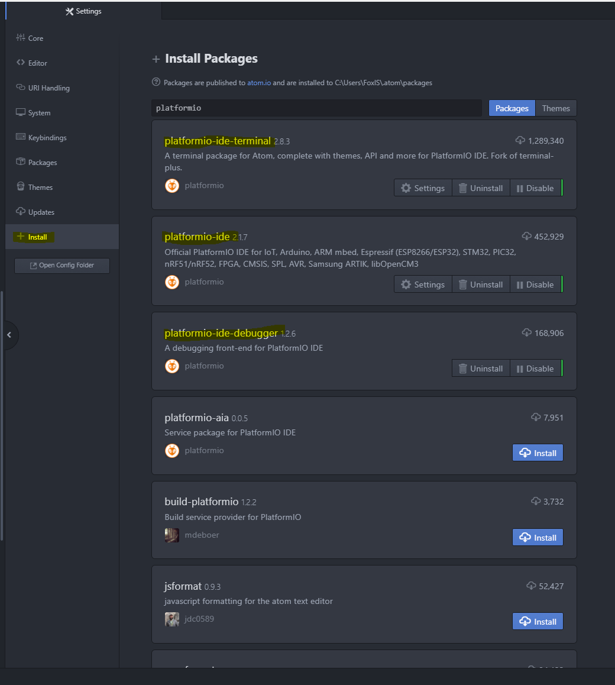
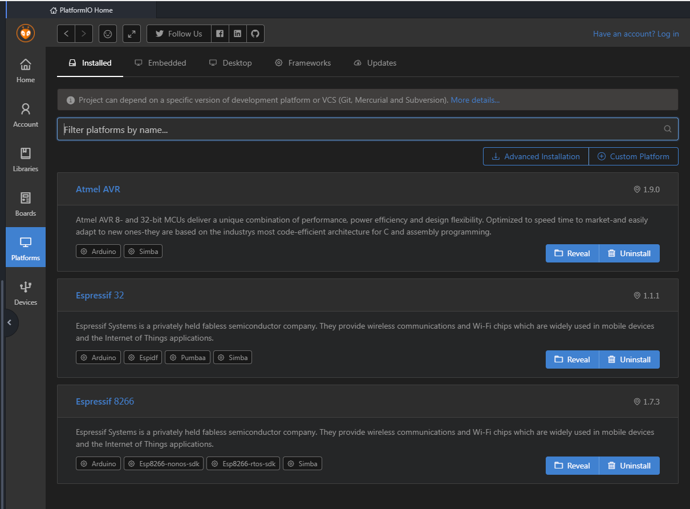

There are many different ways to develop and deploy embedded solutions, one of the most popular ones would be Arduino IDE. But the editor is very simplistic, without handy features such as intellisense, code refactoring and many others. I've used AVR Studio, IAR, even VIM to develop code for AVR/STM microcontrollers.. But they are either designed specifically for that platform or are commercial products. And I love Open Source :)

There are two Open Source IDEs that I've tried: Atom and Visual Studio Code together with PlatformIO. This post is about setting up Atom with PlatformIO to develop and deploy for many different embedded platforms. It also supports other languages, such as Python, HTML, CSS, JS, etc.

# Downloading and installing
First we need to download and install [Atom](https://atom.io/). Installation instructions can be found on the Atom page, so I won't duplicate them here.

However Atom itself is just an IDE with a lot of various extensions. We need to install Platformio packages:

You should definitely install other packages (e.g. git) that you would use.

After all the installation and restarting of Atom we should have PlatformIO:

Here is a list of packages that I use:

- autocomplete-clang
- git-plus
- git-log
- git-diff-details
- linter-gcc
- platformio-ide
- platformio-ide-terminal
- platformio-ide-debugging
- project-manager
- github
- language-c
- language-git
- language-html
- language-css
- language-javascript
- language-python
- language-typescript

Before creating or opening any projects we should install frameworks and boards. As for libraries... I personally don't like to install libraries globally - I tend to put them into platformio.ini project file.

# Configure Platformio
This step is also very easy with Platformio package/library managers. First we need to install platforms. You can see a list of already installed platforms on my machine:

Now you are ready to start your projects using Platformio and Atom.

