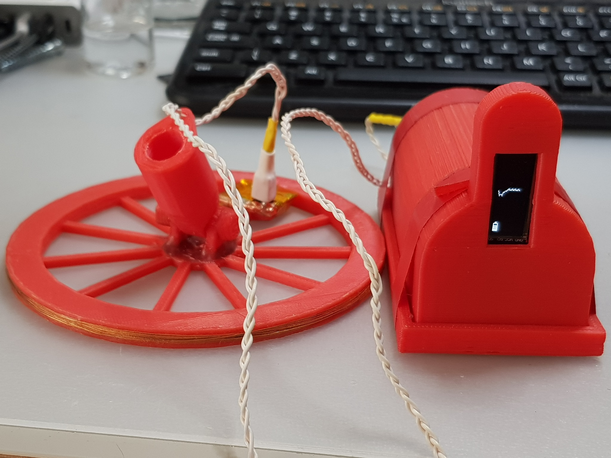
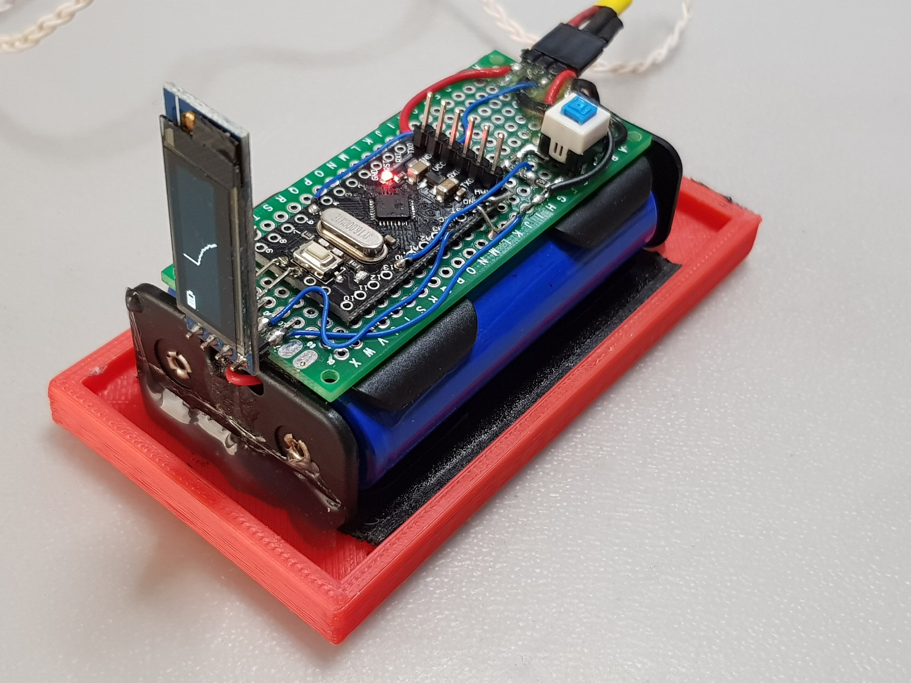
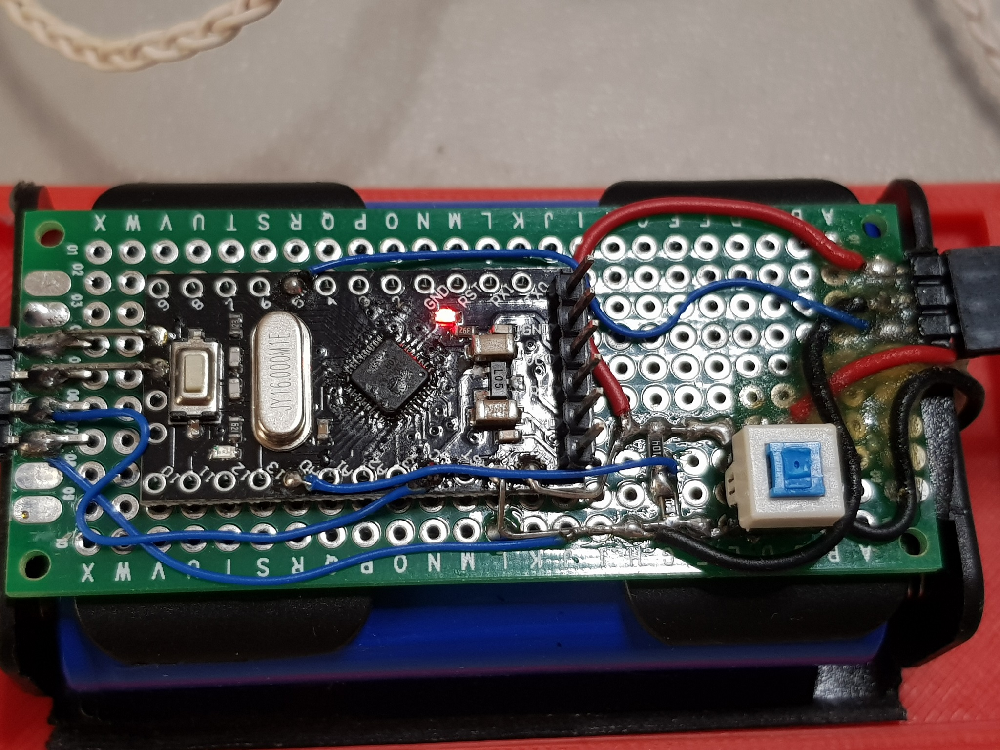
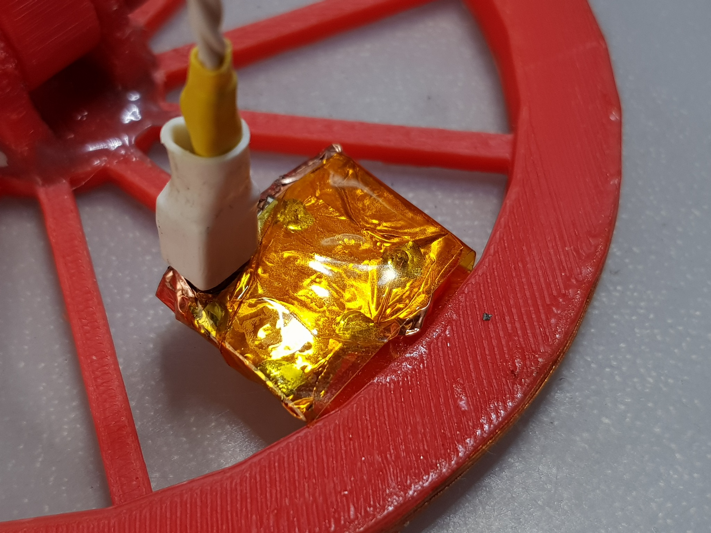
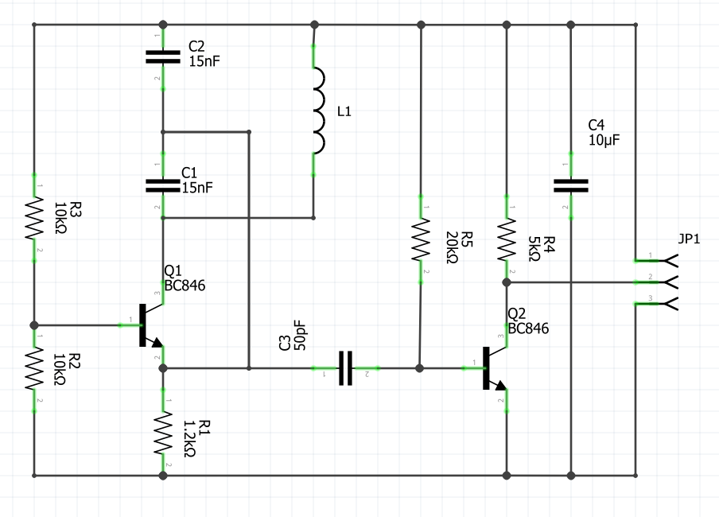
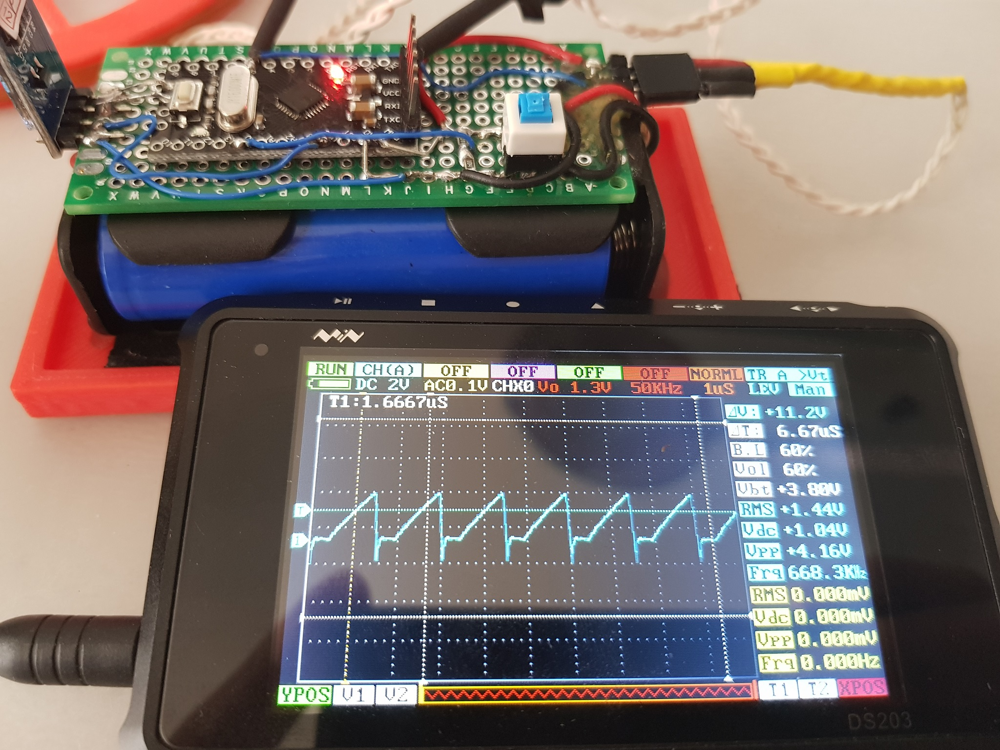
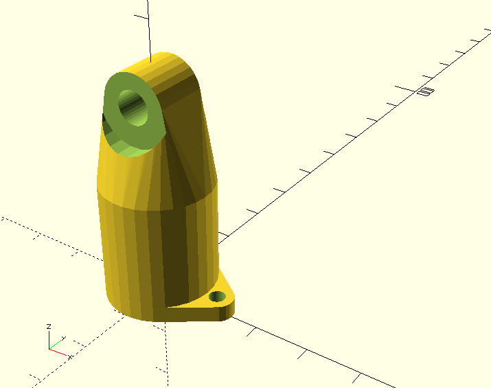
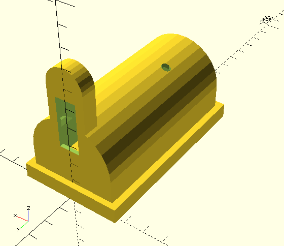

There are a lot of forests in Lithuania which I like exploring on my bike. In the past a lot of Lithuanian resistance troops resided in those forests, so there is a big probability to stumble upon a stash of some kind. However that stash might as well be a grenade or a bomb of some kind, but nevertheless I always wanted to combine my motorcycle riding through the woods with treasure hunting and some time ago I decided to build a simple metal detector. Granted there are lots of metal detector designs, like BFO, VLFD, PI and so on (I'll briefly cover some of them in the theory section). Some of them I've tried in the past with various results and then during one boring evening of browsing the internet I stumbled upon [this blog](http://dzlsevilgeniuslair.blogspot.com/2013/07/diy-arduino-based-metal-detector.html) and decided to build this type of metal detector. The design is really simple - there is a simple oscillator circuit and a frequency counter. When the coil passes over or near various ferromagnetic or paramagnetic materials the frequency of the oscillator changes and based on this change you can decide where to dig. Moreover since the frequency counter can be implemented on any microcontroller you can analyse the frequency change in many different ways potentially enabling metal differentiation and even filter out frequency drift, that plagues other types of detectors.

The code for this project can be found [here](https://github.com/foxis/ardoodles) in the folder `arduino/MetalDetector`. Folder `arduino/MetalDetector/third-party` contains the code that inspired this project.

Along with the Arduino source code you will find there OpenSCAD files and STL files of the 3D printed parts for this project except for the screw, that holds arm and coil parts.

# Metal detector types
## BFO
Beat Frequency Oscillator is the most simple and easy to build and operate metal detector. It consists of two oscillators running at the same frequency and the main coil of one of the oscillators is exposed, i.e. being the search coil. When there is no metal object near the coil, two oscillators are tuned to be of the same frequency. The signals from these oscillators are summed together and they generally either cancel out or produce a single tone, which is filtered out. This tone is of higher frequency than the human can hear or the headphones can reproduce, so this silence is regarded as "no object". However when a metal object is introduced near the search coil, the oscillator resonance frequency changes and consequently after being mixed with the fixed frequency oscillator starts to give off non-zero frequency which can be heard. And depending on the pitch of that tone one can gauge how close or how big the metal object is. It is fair to note, that not only metal can induce said tone. Anything, that changes either capacitance or inductance of the oscillator resonant circuit will change the resulting pitch of the tone. So if one wishes to build such a metal detector must properly isolate the coil and the two oscillators from environment in such a way, that only search coil inductance would be affected.

By the way, also the two oscillators must be built in a very similar way using very similar devices (transistors) in order to eliminate temperature drift as much as possible.

## VLFD
Very Low-Frequency Detector is quite popular type of metal detectors. It consists of two electrically tuned coils, usually arranged in D shapes forming a circle. One coil acts as a transmitter, while another as a receiver. Metal object introduced in the alternating induced magnetic field changes the phase of the received signal. Depending on the received signal phase depth and roughly type of metal can be determined. Also frequency of the transmitted signal can be changed which adds another dimension to the phase response analysis.

## PI
Pulse Induction is another way to measure presence of metallic objects near search coil. The operation is as follows: transmitting coil is being pulsed with short pulses of current. That in turn induces pulsed magnetic field around the coil. Presence of any metallic objects changes the shape and dynamics of this pulsed electromagnetic field as in the previous examples, however in this case during current off stage of the pulse back-emf of the coil is being measured. Or more precisely the time it takes for the induced magnetic field to collapse.

## Magnetostriction based metal detectors
This type of metal detection is rather complicated and involves a very interesting phenomena - [magnetostriction](https://en.wikipedia.org/wiki/Magnetostriction). In simple words, when a metallic object is placed in alternating magnetic field it starts to vibrate. Conversely if a metallic object is placed inside a constant magnetic field and is being vibrated (e.g. by ultrasound) it starts to generate alternating electromagnetic field ([anti-shoplifting security tags](https://en.wikipedia.org/wiki/Electronic_article_surveillance) rely on the same effect). Very interesting result of magnetostriction based metal detection is ability to discriminate between different materials, as every metal produces quite a different signal.

Magnetostriction based metal detector consists of an ultrasound transducer and a receiving coil. Earth's magnetic field is used for the required constant magnetic field. Ultrasound permeates the soil, hits the metal object and induces acoustic vibration in it. Due to magnetostriction, this metal being in constant Earth's magnetic field starts to generate alternating electromagnetic field, which in turn is picked up by the receiving coil, amplified and analysed.

This method is fundamentally different than the other methods of detecting metals, because it does not measure in any way the magnetic permeability of the environment.

# Metal detector using an oscillator and arduino with OLED
Arduino (or any other microcontroller or platform) can be used for either VLF or PI metal detector, however I wanted to build a metal detector during a single evening. And then I stumbled upon [this blog](http://dzlsevilgeniuslair.blogspot.com/2013/07/diy-arduino-based-metal-detector.html), where a metal detector is being discussed which appears to be an extremely simple using not less simple principle - arduino simply measures generated signal frequency by a simple Collpits generator circuit, which is identical to the one in the blog post except that I've added an emitter follower in order to isolate the oscillator output from the wires and arduino. Without this isolation output frequency changes drastically even if you hold your hand near the arduino module :)

## Operation
The search coil has integrated Collpits oscillator with a buffer circuit, which generates the signal of around 660kHz. This signal is picked up by an Arduino Pro Mini board (using Atmega168), the frequency is being measured. 32 points of the measured frequency are stored in a FIFO buffer, scaled to fit 128 pixels of the display and drawn on the 128x32 OLED display together with battery indicator.

The oscillator needs to warmup for some time, but that is not really necessary - because once you start swinging the search coil and it finds any metal, there will be a spike on the graph. If the frequency of the oscillator haven't settled before that - the graph will not be horizontal. Conversely once it settles - the graph will be horizontal. No calibration or zero-in is required for this kind of operation :)

## Construction
Here is the picture of the assembled metal detector using 3D printed parts:

Here in the picture you can see the search coil wound on the 3D printed coil carcass, braided wire that connects the search coil and the Arduino, and battery holder with the arduino itself and OLED.

The search coil has the oscillator integrated. Oscillator is assembled from SMD components, mainly resistors, condensators and BC846 transistors. The board of the oscillator is wrapped in copper foil in order to insulate it from the environment. I don't remember how many turns there are in the coil, but something around 15-20. I think the lower number of turns, the better, as the frequency is higher and frequency change due to inductance change with metal present is bigger which makes metal detection more sensitive. Also the higher the frequency the faster is the frequency counter response. Although there is a tradeoff of the signal frequency and the sensitivity due to the condition of the soil. If the soil is mineral-rich and moist, it may be quite conductive thus blocking high frequency signals from penetrating thus limiting accuracy and sensitivity. The windings of the coil are sealed with epoxy glue.

This is how the insides of the detector look like:

Arduino Pro Mini and OLED are soldered to a small breadboard along with the voltage divider, push-button switch and header for the search coil. The whole thing is glued to the two 18650 Li Ion batteries, which are glued to the bottom of the enclosure. Below is the zoom-in on the Arduino Pro Mini:

As you can see, the OLED display is connected to the I2C interface of the Arduino, voltage divider of the battery is connected to the A0 analog pin and the signal from the search coil oscillator connected right to the digital pin 5.

The oscillator circuit is placed as close to the coil as possible:

Oscillator circuit:

Oscillator receives direct power from two 18650 cells connected in series, and outputs the generated signal. And here is the signal, that is received from the coil:

The quality of the signal is not important(clearly I haven't put much consideration into Q2 base current), as all that matters is the triggering of arduino pin, which is configured to a counter register.

# 3D printed parts
3D Printed parts were designed with [OpenSCAD](http://www.openscad.org/) and printed with Geeetech Rostok 301 3D printer:

# Summary
The project took me more than an evening, I'd say even more than a couple of weekends to assemble and program. There were different iterations. At first I've designed a different coil with around 30 turns, completely enclosed in epoxy glue. Also I've used a NOR gate as the oscillator buffer which worked much better than a single transistor in the final version... Although the coil was rather big - about 30cm in diameter which lowered it's sensitivity for small objects. Smaller and 3D printed coil proved to be much more stable both mechanically and electrically, however due to rather strong coupling it is sensitive even to moving my hand near the wires or even near the enclosure. I tried different approaches for frequency measurement. At first tried the same code as in the original blog post. Then after the concept proved to be viable, I added the OLED screen and moved to a frequency counting library.

I haven't yet had a chance to test it outdoors, but indoors it finds metal construction under the floor(around 15cm of concrete along with laminate). I wonder how it would perform with different soils.

At some time in the future I plan to design the coil and oscillator circuit board, experiment with VLF and PI detector designs.

There is a warning to be said, by the way. In some countries it is illegal to construct and use metal detectors, so make sure you check with your authorities before replicating this project.
