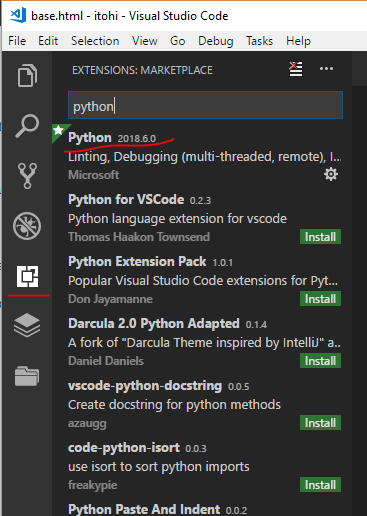
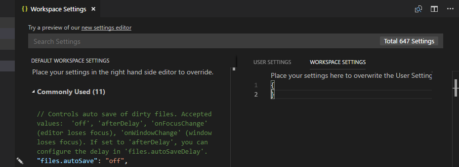
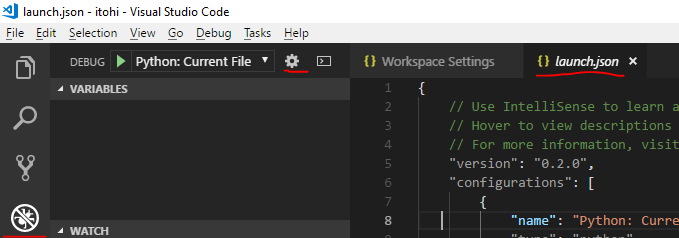

<a href="https://code.visualstudio.com/">VS Code</a> is an light but powerful editor developed by Microsoft. I have been using this editor for Python and embedded development(using PlatformIO) for a few months now.

Using PlatformIO with VSCode is rather simple - just install it through built in package manager and you're good to go. However python development needs a bit more work to setup properly. Especially if you want to develop Django apps with VSCode. That is what I'll be covering here in this post.

# Configure Python virtual environment
Of course you could use globally installed <a href="https://www.python.org">Python</a>, however having independent virtual environments for each project or experiment brings a lot of benefits. For example, you can always spin a fresh virtual environment, install required modules, test if your code works as expected and release it. Or you could just copy existing virtual environment, update modules to their newest versions and then test if your project still works as expected before upgrading those modules on your production environment. Even if you only want to experiment with python, it is always a good idea to start from a new virtual environment. At least I have acquired a habit of creating a new virtual python environment every time I start a project...

## virtualenv
So, if we want to work with virtual environments, we need to install [virtualenv](http://pypi.python.org/pypi/virtualenv) package first. [virtualenv](http://pypi.python.org/pypi/virtualenv) is a tool used to create isolated Python environments. virtualenv creates a folder which contains all the necessary executables to use the packages that a Python project would need.

``` 
pip install virtualenv
``` 
You can test your installation using this command:

``` 
virtualenv --version
``` 
To create a virtual environment inside your current directory:

``` 
virtualenv my_project
``` 

This will create a directory my_project inside your current directory with all the necessary executables, modules and so on using your current python installation. In case you have more than one python version installed, you can choose whatever python version you want like this:

``` 
virtualenv -p  /path/to/your/python/executable/python2.7 my_project
``` 

To activate your newly created virtual environment on Linux:

``` 
source my_project/bin/activate
``` 

or for Windows(You have to first enable it by configuring set-executionpolicy to e.g. remotesigned):

```
my_project\bin\activate.ps1
```

This will replace environment variables in such a way, that your current python interpreter along with all the installed modules will become the ones from your virtual environment.

## virtualenv wrapper
There is a wrapper around virtualenv, that allows for much more easier management of virtual environments. This tool is called [virtualenvwrapper](https://virtualenvwrapper.readthedocs.io/en/latest/)virtualenvwrapper and [virtualenvwrapper-win](https://github.com/davidmarble/virtualenvwrapper-win) for Linux and Windows environments respectively. Installation is easy using pip. Usage is also very easy. In order to create a virtual environment use:

``` 
mkvirtualenv my_project
``` 

Virtual environment will be automatically activated. When you want to exit the virtual environment:

``` 
deactivate
``` 

If you want to select another virtual environment:

``` 
workon my_project_1
``` 

There are other commands and I encourage you to go to the virtualenvwrapper page and learn about them.

## pipenv
There is another alternative to virtualenv or virtualenvwrapper that is called [pipenv](https://docs.pipenv.org/) which is a dependency manager for Python projects. Pipenv manages Python modules on a per-project basis. Before installing any packages pipenv creates a Pipfile, creates a virtual environment and installs the packages:

``` 
cd my_project<br />pipenv install requests
``` 

This will create a Pipfile which is used to track dependencies for your project, much like requirements.txt file that you populate with `pip freeze`.

I personally prefer virtualenvwrapper over other options.

# Configure VSCode for python
After you have your virtual environment, you can begin configuring VSCode. First of all you need to install [Python for VSCode](https://github.com/Microsoft/vscode-python). To do that, go to Extensions section and type "python" into search box. The very first entry reading Python will be the package we're looking for:



You can go to Settings->Settings and start configuring python from there, but that would setup python globally for every project. I would suggest having a settings file template somewhere and edit .vscode/settings.json file every time you create a new project. That would allow having independent virtual environments for each project. When you create a project, VSCode creates .vscode directory inside your project directory and creates settings.json file there which is empty. By the way, since I'm mainly developing from Windows, all my paths will be Windows-style. You should change the paths to the ones relevant for your installation. Linux paths are a bit different, but the principle remains.

So, after you've got your project in VSCode, go to Settings->Settings, and select Workspace Settings. You should see something like this:



Then copy&paste these values on the right:

```
{
    "python.pythonPath": "c:\\Users\\FoxIS\\Envs\\itohi\\Scripts\\python.exe", // virtual environment python binary
    "python.linting.pep8Enabled": true,
    "python.linting.pylintPath": "c:\\Users\\FoxIS\\Envs\\itohi\\Scripts\\pylint.exe", // virtual environment pylint binary
    "python.linting.pylintArgs": [
        "--load-plugins",
        "pylint_django"
    ],
    "python.linting.pylintEnabled": true,
    "editor.rulers": [
        80,
        120
    ],
    "launch": {
        "version": "0.2.0",
        "configurations": [
            {
                "name": "Django",
                "type": "python",
                "request": "launch",
                "stopOnEntry": true,
                "pythonPath": "${config:python.pythonPath}",
                "program": "${workspaceRoot}/manage.py",
                "cwd": "${workspaceRoot}",
                "args": [
                    "runserver",
                    "--noreload",
                    "--nothreading"
                ],
                "env": {},
                "envFile": "c:\\Users\\FoxIS\\Envs\\itohi", //virtualenv path, change to whatever suits your system
                "debugOptions": [
                    "WaitOnAbnormalExit",
                    "WaitOnNormalExit",
                    "RedirectOutput",
                    "DjangoDebugging"
                ]
            }
        ]
    }
}
``` 

Then of course change the paths to python that are valid on your machine.
In order to use pep8 and pylint, install those modules on your virtualenv:
``` 
pip install autopep8
pip install pylint
``` 

Now you should be ready to develop Python code and run Django development server from VSCode! :)

PS. You can enter launch configuration into a separate launch.json file instead of the workspace configuration ("launch" json key). Also it is possible to instruct VSCode to automatically create launch.json file for you with already predefined python configurations. Just go to Debug section and select cog icon and select Python:


