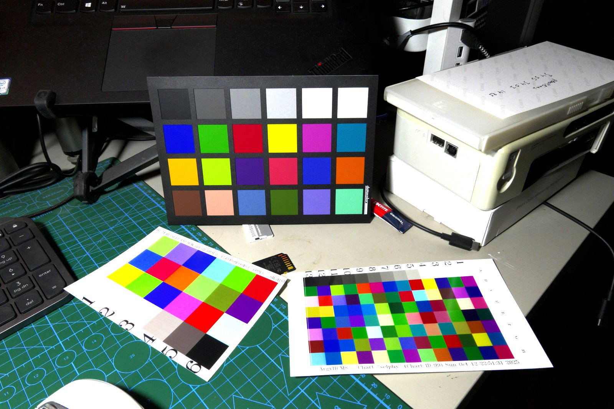
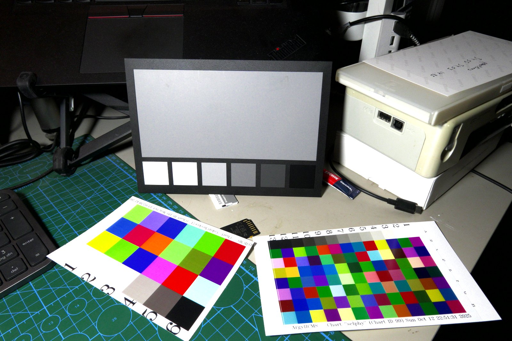
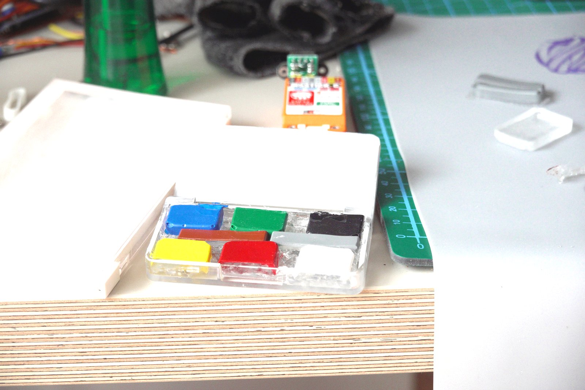
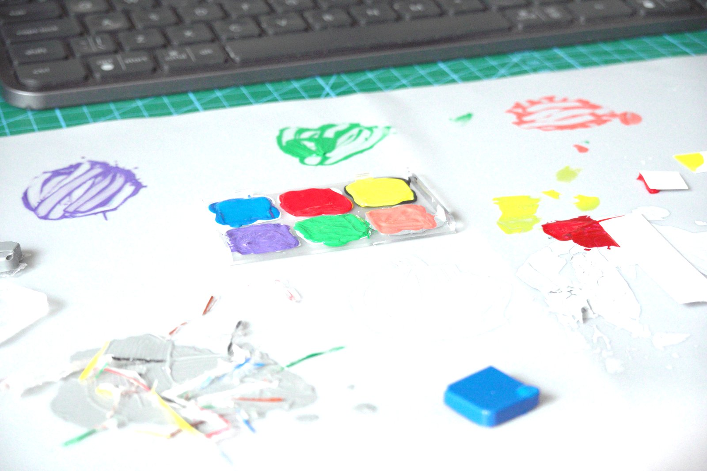
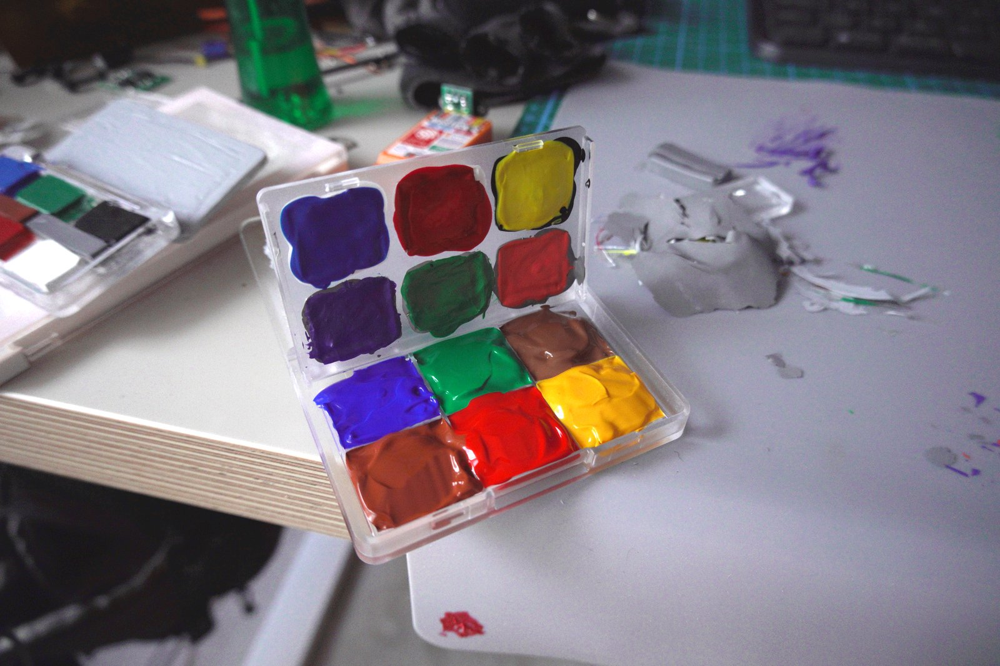
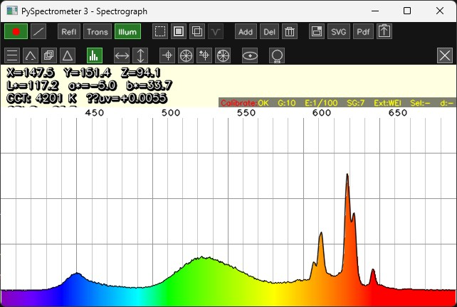

Planas iš [CR30 ardymo straipsnio](/colorimetry/reverse-engineering-cr30): atspausdinti žinomų spalvų lopų rinkinį, kiekvieną išmatuoti su CR30 ir naudoti ArgyllCMS profiliui sukurti. Teoriškai paprasta. Praktikoje prireikė dviejų visiškai skirtingų metodų, kol gavau ką nors tinkamo.

## Ko tikisi ArgyllCMS

ArgyllCMS gali sugeneruoti tikslinę lentelę — žinomų Lab reikšmių spalvų lopų tinklelį — o po to, kai išmatuoji kiekvieną lopą kolorimetru, apskaičiuoja deltą tarp to, ką atspausdinai, ir to, ką norėjai. Iš to sukuriamas ICC profilis arba Darktable spalvų kalibravimo korekcija.

Sugeneruota lentelė yra tik TIFF failas su gretutine `.cht` deskriptoriaus byla. Atspausdini, išmatuoji — viskas. Išskyrus tai, kad „tiksliai atspausdinti" pasirodė esanti sunkiausia dalis.

## Pirmas bandymas: sublimacinis spausdintuvas

Turiu seną sublimacinį spausdintuvą. Tik CMY — be juodos, be išplėsto gamuto. Spaudiniai atrodo neblogai akiai, tačiau CMY riboja tikslumą sodriai raudonoms ir tamsiai mėlynoms spalvoms.

Kairėje — ColorChecker24 dydžio taikinys, sugeneruotas ArgyllCMS. Dešinėje — tankesnis 96 lopų taikinys su skirtingu atsitiktiniu išdėstymu. Tikras SpyderChecker 24 fone — palyginimui.

Sublimacijos spaudiniai nėra blogi. Darktable integruotam spalvų kalibravimui 24 lopų lentelė iš tikrųjų pakanka. Tačiau matavimas CR30 atskleidė problemą: CMY gautas gerokai nukrypsta sodriai raudonomis ir geltonoms spalvoms. ΔE tose lopų vietose pakankamas, kad gautą profilį padarytų nepatikimu bet kam rimtesniam.

Tinkama grubiai korekcijai, bet ne CR30 programinės įrangos tikslumo patvirtinimui.

## Antras bandymas: akriliniai dažai

Jei spausdintuvas negali tiksliai atgaminti spalvų — pieškime jas ranka. Akriliniai dažai suteikia prieigą prie tikrų pirminių spalvų — įskaitant tas, kurių CMY spausdintuvas negali atkurti — ir CR30 gali išmatuoti kiekvieną lopą tiesiogiai ant dažytų paviršių.

Substratas: maži kvadratai, iškirpti iš kieto balto plastiko lapo, dažyti atskirai, kad kiekvieną lopą galima būtų permatuoti ir perdažyti keičiant visą lentelę.

Pirminės spalvos: mėlyna, žalia, juoda, geltona, raudona, pilka, balta. Lustai dėkle — išdžiovinti mėginiai, iškirpti iš plastiko lapo.

Maišymo procesas. Viršutinėje dėklo dalyje — bazinės pirminės spalvos; apatinėje — maišiau antrines ir reguliavau šviesumą balta.

Akriliniai dažai atskleidė visai kitą problemą: partijų nuoseklumas. Akrilas džiūdamas tampa šiek tiek tamsesnis nei atrodo šlapias, o ploni sluoksniai praleidžia baltą substratą, perstumiant išmatuotą spalvą link baltos. Mažiausiai du sluoksniai, idealiai trys, su CR30 matuojant po kiekvieno sluoksnio, kol spalva stabilizuosis.

Privalumas: išmatuotos spalvos iš tikrųjų yra ten, kur reikia. Ultramarine mėlyna duoda tikrą mėlyną — ne artimiausią spausdintuvo apytikslį. Taip pat su geltona, raudona ir neutraliais tonais.

## Kodėl tai svarbu Darktable

Darktable spalvų kalibravimo modulis veikia fotografuojant žinomą spalvų etaloną tomis pačiomis sąlygomis kaip ir fotografuojamas objektas, po to apskaičiuojant 3×3 matricą (su poslinkiais), kuri susieja kameros neapdorotą atsaką su etalono Lab reikšmėmis. Įprastai pirksi ColorChecker arba SpyderChecker. Šios savadarbės lentelės yra pigesnė alternatyva — jei etaloninės reikšmės, kurias paduodi Darktable, iš tikrųjų atitinka tai, kas yra ant fizinės lentelės.

Būtent tai CR30 ir suteikia: išmatuotas Lab reikšmes kiekvienam lopui D65 apšvietimo sąlygomis. Paduok jas į ArgyllCMS kartu su nuotraukos matavimais ir gausi korekciją, grindžiamą tikrais matavimais, o ne gamykliniu specifikacijų lapu.

Ar savadarbė lentelė yra *pakankamai tiksli* — dar atviras klausimas, ir kol kas neatsakomas: lopai niekada nebuvo sistemingai sunumeruoti. Išmačiau juos — arba kažką išmačiau — tačiau be žymėjimo sistemos dabar nebegaliu pasakyti, kuris fizinis lopas atitinka kurį matavimą. Planas buvo pažymėti kiekvieną, tada vykdyti mėnesinį senėjimo testą: akrilas bėgant laikui keičiasi, ir žinoti atspalvio dreifo greitį reikštų žinoti, kada lopą reikia perdažyti. Senėjimo testas reikalauja žmogaus, kuris laikosi grafiko. Aš nesilaikau, todėl taip ir neįvyko.

## Kalibratoriaus problema

Dauguma vartotojų monitoriaus kalibratorių — Datacolor Spyder X, X-Rite ColorMunki Display — matuoja tik RGB (arba kelis plačius juostos). Tai suteikia pakoreguotą gamos kreivę ir baltą tašką, kas tinka ekrano kalibravimui, bet neparodo tikrosios spektrinės galios paskirstymo tavo monitoriaus pirminių spalvų. Rimtam spalvų darbui — suprasti *kodėl* monitoriaus gamas turi tokią formą, arba patvirtinti, kad ekranas iš tikrųjų gali atkurti tavo kalibravimo darbo eigoje esančias spalvas — reikia spektrinių duomenų.

CR30 matuoja tik atspindėtą spektrą — emisiniai ekranai jam visiškai nepasiekiami. Žemiau pateikti ekrano spektrai užfiksuoti su savo rankomis sukurtu matomojo spektro spektrometru. Mėlynas ir žalias kanalai maždaug tokie, kokių tikėtumeis iš tipinio IPS skydelio. Raudonas kanalas įdomesnis.

*ThinkPad ekrano emisijos spektras. Žalias: platus kupstas centruotas apie 530 nm. Raudonas: du siauri fosforo smaigaliai — antrinis ties ~600 nm, pagrindinis ties ~635 nm. Tiek ThinkPad, tiek žaidimų monitorius rodo panašų padalintą raudoną. Palyginimui — mano OLED telefonas turi platesnį, lygesnį raudoną kanalą.*

Dvigubas smaigalys — tai, kas svarbu spalvų metrijai: antrinis ties 600 nm reiškia, kad ekrano raudonas neša reikšmingą oranžinį komponentą. Akiai tai nesvarbu — regėjimo sistema integruoja per visą kanalą. Kalibravimo darbui tai sisteminė klaida, kurią 3×3 matricos korekcija gali tik iš dalies kompensuoti.

Tinkamam monitoriaus charakterizavimui reikėtų spektrofotometro su emisiniu režimu — i1Display Pro Plus arba idealiai i1Pro 3. CR10 kolorimetras, kurį turiu, irgi galėtų tikti: jis veikia su ESP32 mikrovaldikliu, todėl programinė įranga turėtų būti įsilaužiama, norint pridėti emisinio matavimo režimą — nors dar neprisikasiau. Kainų skirtumas tarp paprasto kolorimetro ir tikro spektrofotometro bet kuriuo atveju yra nemažas, ir dar neišrinkau nė vieno.

Tai veda prie kitos problemos dalies: net turėdamas tobulą kalibratorių ir tobulą savadarbę lentelę, dabartinis monitorius tikriausiai nėra tinkamas įrankis nuotraukų ir vaizdo darbui. Tai atskiras pirkimo sprendimas, ir stengiuosi jo neimti tol, kol tiksliai nesuprantu, kokie iš tikrųjų yra dabartinio ekrano spektriniai apribojimai.

## Kur esame dabar

Akrilinė lentelė pastatyta. Ar ji pakankamai tiksli — vis dar nežinoma: tai priklausys nuo to, ar lopai bus tinkamai sunumeruoti ir patvirtinti prieš SpyderChecker 24 žinomas Lab reikšmes, ko kol kas neįvyko. Senėjimo testas taip pat neįvyko. Likusios užduotys yra labiau fundamentalios nei atrodė pradžioje: fotografuoti abi lenteles kontroliuojamoje šviesoje, paleisti per ArgyllCMS ir palyginti korekcijas, kai etaloninės reikšmės bus patikimos.

Sunkesnis klausimas pasirodė esantis monitorius. Lentelė gali jau būti tikslesnė už ekraną, kuriam ji skirta kalibruoti — o prietaisas, reikalingas tam ekranui tinkamai apibūdinti, kainuoja daugiau nei pats ekranas. Sublimacijos spaudiniai vis dar naudingi kaip greitas bazinis lygis. Akrilinė lentelė laukia patikimo kalibratoriaus kitame gale.
