So here I am, a physicist who got bitten by the color science bug. What started as innocent curiosity about how light works has turned into a full-blown obsession with spectrometers, colorimeters, and now... laser power meters. You know how it goes - you start with one simple question and before you know it, you're knee-deep in soot-covered copper plates and differential amplifiers at 3 AM.

The thing is, I'm building up to something bigger: a Raman spectrometer. And for that, I need a proper 785nm IR laser diode. But here's the catch — I'm coupling light through cheap TOSLINK optical fibers (yes, really), and I needed to know exactly how much laser power I'm losing along the way. Spoiler alert: it's a lot. That's why my cuvette holder has the laser embedded directly in it.

But you can't fix what you can't measure, right? So I built myself a calorimetric laser power meter.

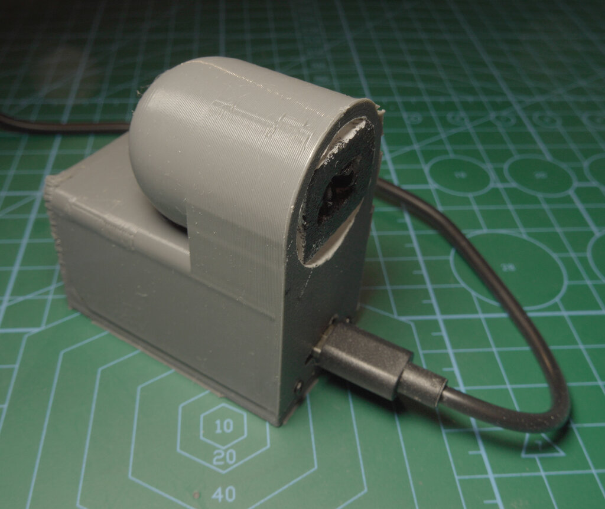

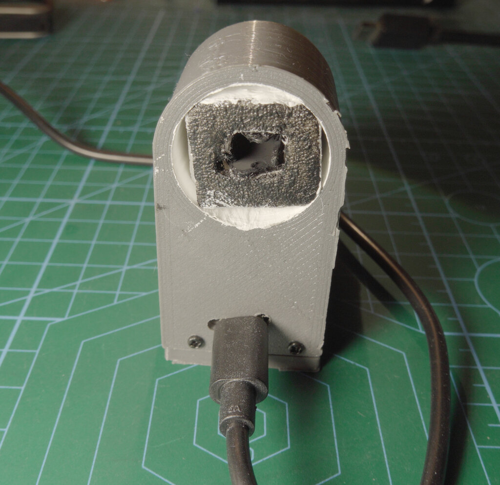

## Why Calorimetric? Why Not Just Buy One?

Let me tell you about thermoelectric (TEC) power meters — the standard commercial solution. They work beautifully... for lasers above ~100mW. Below that? Not so much. And forget about measuring white light or anything with significant spectral breadth.

The problem is the [Seebeck effect](https://en.wikipedia.org/wiki/Thermoelectric_effect#Seebeck_effect). TEC-based sensors generate voltage proportional to temperature difference, but at low power levels, the signal gets buried in noise.

For my sub-50mW world of fiber-coupled IR laser diodes and LED light sources, I needed something different. Enter the calorimetric approach: instead of measuring voltage directly from a thermoelectric junction, I measure how fast things heat up. The *rate* of temperature change tells me the power.

## The Principle: It's All About the Slope

Here's the beautiful physics behind this. When you shine light onto an absorber, it heats up. The rate of temperature increase $\frac{dT}{dt}$ is directly proportional to the absorbed power:

$$
P = m \cdot c_p \cdot \frac{dT}{dt}
$$

Where:
- $P$ is the optical power (what we want to measure)
- $m$ is the mass of the absorber
- $c_p$ is the specific heat capacity
- $\frac{dT}{dt}$ is the temperature rise rate (the slope!)

The key insight is that by differentiating the temperature signal, we get something proportional to power directly:

$$
\frac{dT}{dt} \propto P
$$

This means if I can measure the slope of the temperature curve accurately and calibrate it against known power values, I have myself a power meter!

```chart
{
  "type": "line",
  "data": {
    "labels": ["0s", "1s", "2s", "3s", "4s", "5s", "6s", "7s", "8s"],
    "datasets": [{
      "label": "Temperature (relative)",
      "data": [20, 25, 32, 41, 52, 65, 75, 83, 89],
      "borderColor": "rgba(255, 99, 132, 1)",
      "backgroundColor": "rgba(255, 99, 132, 0.2)",
      "fill": true,
      "tension": 0.4
    }]
  },
  "options": {
    "responsive": true,
    "plugins": {
      "title": {
        "display": true,
        "text": "Temperature Rise vs Time (Conceptual)"
      }
    },
    "scales": {
      "y": {
        "beginAtZero": true,
        "title": {
          "display": true,
          "text": "Temperature"
        }
      },
      "x": {
        "title": {
          "display": true,
          "text": "Time (seconds)"
        }
      }
    }
  }
}
```

The steeper the slope, the higher the power. Simple, elegant, and works down to milliwatt levels where TEC sensors give up.

## The Hardware Design

The device has two compartments: the measurement head on top (with the foam assembly and copper plates) and the electronics compartment below (housing the RP2040, differential amplifier, and trim potentiometers for the bridge).

### The Absorber Assembly

I built a two-plate differential design to reject common-mode thermal noise (room temperature fluctuations, drafts, your coffee breath...).

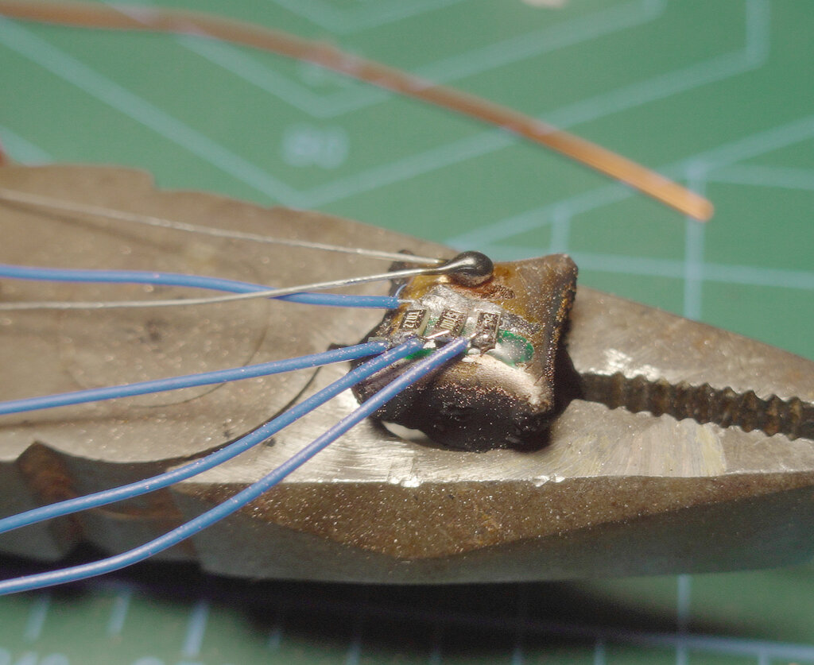

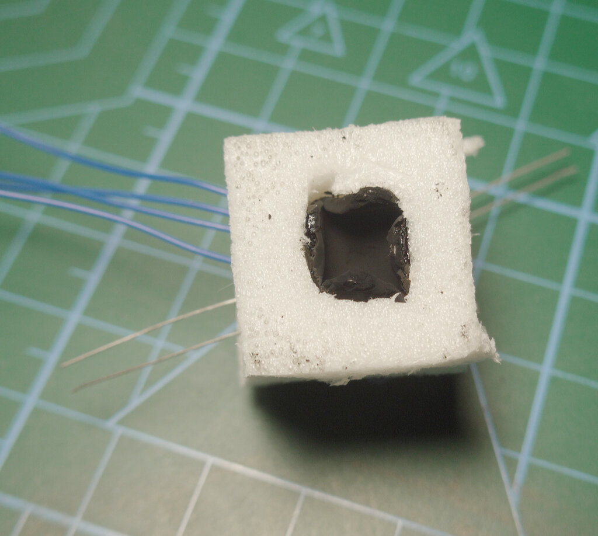

The absorber plate is a small copper piece that I folded — imagine folding all four corners of a square toward the center, then unfolding halfway. Since copper is thicker than paper, the folds curl naturally, creating an internal cavity. I coated the inside with candle soot. Light entering this cavity bounces around multiple times before escaping — and soot isn't 100% absorbent, so those extra bounces matter. More surface area + more bounces = better absorption.

The reference plate is flat copper that sits behind foam insulation, separated from the absorber by an air gap that houses the thermistors and calibration resistors.

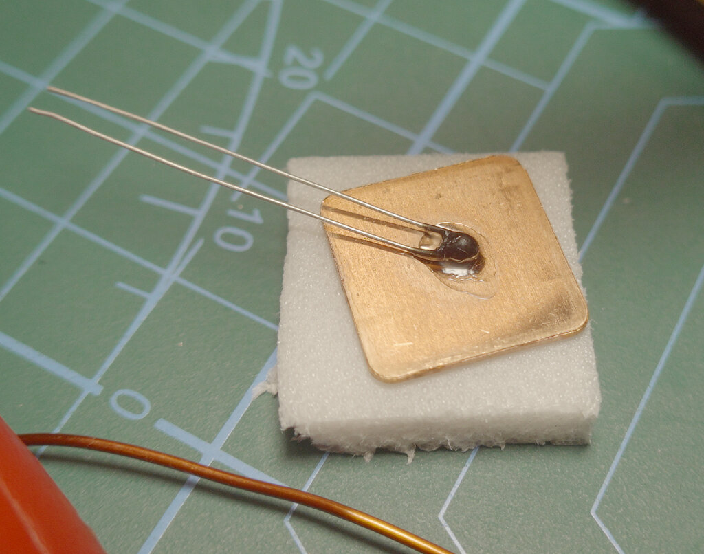

Both plates have matched 10K NTC thermistors attached. I tried to select thermistors with similar characteristics, but honestly? It's easier to just trim them electrically in the bridge circuit.

Both compartments have their inside walls coated with white acrylic paint containing TiO₂ pigment. This reflects IR radiation from the environment (warm hands, nearby equipment) while the measurement head opening lets visible and near-IR light through to the soot absorber.

### The Calibration System

Here's where it gets clever. I soldered three resistors directly to the absorber plate: approximately 10mW, 50mW, and 100mW calibration points. When I drive them with 5V through SMD MOSFETs (negligible on-resistance), I get precise, repeatable heat injection.

The actual power varies slightly with my 5V rail, so I measure the voltage across the resistors with an ADC divider. Yes, the RP2040's ADC is garbage at these voltages, but it's good enough for comparative measurements — which is all I need.

$$
P_{cal} = \frac{V^2}{R}
$$

<!-- TODO: Add board.jpg - photo of RP2040 board with wires and trim potentiometers -->

### The Circuit

I use a [Wheatstone bridge](https://en.wikipedia.org/wiki/Wheatstone_bridge) configuration with the two thermistors as variable resistors. The bridge converts the resistance difference (temperature difference) into a voltage difference.

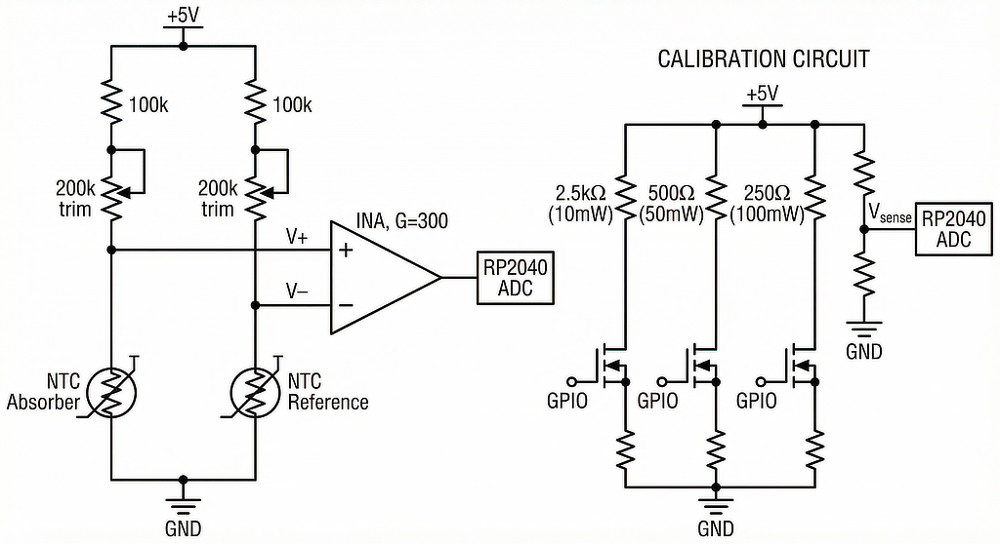

The 100kΩ series resistors and 200kΩ trim potentiometers keep the thermistor current low — self-heating would ruin our measurements. All bridge resistors are 1% tolerance for stability.

The bridge output feeds an instrumentation amplifier with about 300× gain. The trim pots let me balance the bridge so the baseline sits mid-scale, maximizing dynamic range. Too much baseline offset wastes ADC bits on DC that I don't care about.

The gain primarily limits the maximum measurable power. Too much gain and the 100mW calibration saturates the ADC. Not enough and the milliwatt-level signals drown in noise.

The calibration resistors (1% tolerance) are driven individually by MOSFETs controlled from the RP2040 GPIOs via gate resistors. I measure the actual 5V rail voltage through a divider because USB power isn't perfectly stable — the actual calibration power depends on $P = V^2/R$, so voltage matters.

### Thermal Management

The foam insulation between compartments and around the copper plates serves multiple purposes: it minimizes convection currents, provides thermal isolation between the measurement head and the warm electronics below, and dampens rapid temperature fluctuations from the environment.

The air gap in the foam assembly allows pressure equalization (thermal expansion would cause havoc otherwise) while the foam structure keeps air movement to a minimum.

## The Math: From Slope to Power

### The Temperature Response

When light hits the absorber, the temperature follows an exponential approach to equilibrium:

$$
T(t) = T_0 + \Delta T_{max} \cdot (1 - e^{-t/\tau})
$$

Where $\tau$ is the thermal time constant. The initial slope is:

$$
\left.\frac{dT}{dt}\right|_{t=0} = \frac{\Delta T_{max}}{\tau} = \frac{P}{m \cdot c_p}
$$

### Why the Differential Matters

The raw temperature signal is noisy. Really noisy. Thermistor self-heating, Johnson noise, ADC quantization, electromagnetic interference... it all adds up.

Taking the derivative of a noisy signal amplifies the noise. That's just how differentiation works:

$$
\frac{d}{dt}[T + noise] = \frac{dT}{dt} + \frac{d(noise)}{dt}
$$

And differentiated noise is *worse* noise. So I need a lot of samples and aggressive filtering to extract the slope reliably. This fundamentally limits how low/high I can go in power — at some point, the signal-to-noise ratio becomes too poor to fit a line to or the temperature difference becomes too large too quickly to fit the ADC range.

### The Calibration Process

I measure three calibration slopes using the known resistor powers:

```chart
{
  "type": "line",
  "data": {
    "labels": ["0s", "2s", "4s", "6s", "8s", "10s"],
    "datasets": [
      {
        "label": "10mW",
        "data": [0, 45, 85, 120, 150, 175],
        "borderColor": "rgba(75, 192, 192, 1)",
        "backgroundColor": "rgba(75, 192, 192, 0.2)",
        "tension": 0.3
      },
      {
        "label": "50mW",
        "data": [0, 180, 320, 420, 490, 540],
        "borderColor": "rgba(255, 159, 64, 1)",
        "backgroundColor": "rgba(255, 159, 64, 0.2)",
        "tension": 0.3
      },
      {
        "label": "100mW",
        "data": [0, 350, 620, 800, 920, 1000],
        "borderColor": "rgba(255, 99, 132, 1)",
        "backgroundColor": "rgba(255, 99, 132, 0.2)",
        "tension": 0.3
      }
    ]
  },
  "options": {
    "responsive": true,
    "plugins": {
      "title": {
        "display": true,
        "text": "Calibration Curves (Conceptual)"
      }
    },
    "scales": {
      "y": {
        "beginAtZero": true,
        "title": {
          "display": true,
          "text": "Differential Signal (mV)"
        }
      },
      "x": {
        "title": {
          "display": true,
          "text": "Time (seconds)"
        }
      }
    }
  }
}
```

Then I fit a polynomial to the relationship between slope and power:

$$
P = a_0 + a_1 \cdot s + a_2 \cdot s^2
$$

Where $s$ is the measured slope. The quadratic term accounts for nonlinearities in the thermistor response and heat loss mechanisms.

## The Software

I connected the RP2040 to my computer via USB serial. A Go application displays the differential signal in real-time and lets me trigger calibration measurements.

<!-- TODO: Add software-ui.jpg - screenshot of Go application interface -->


The software:
1. Captures the raw differential voltage
2. Detects when I trigger a calibration or measurement
3. Fits a line to the rising edge to extract the slope
4. Applies the calibration polynomial to calculate power

The tricky part is detecting the slope reliably. Too few samples and noise dominates. Too many and you're including the exponential rolloff that spoils the linear fit. I ended up using a sliding window approach with outlier rejection.

## Real Measurements

Calibration is a slow process — you heat up one calibration resistor, wait for the slope measurement, then wait for everything to cool back to baseline before the next point. Gathering 7 calibration points can take over 10 minutes!

Here are the calibration runs at different power levels:

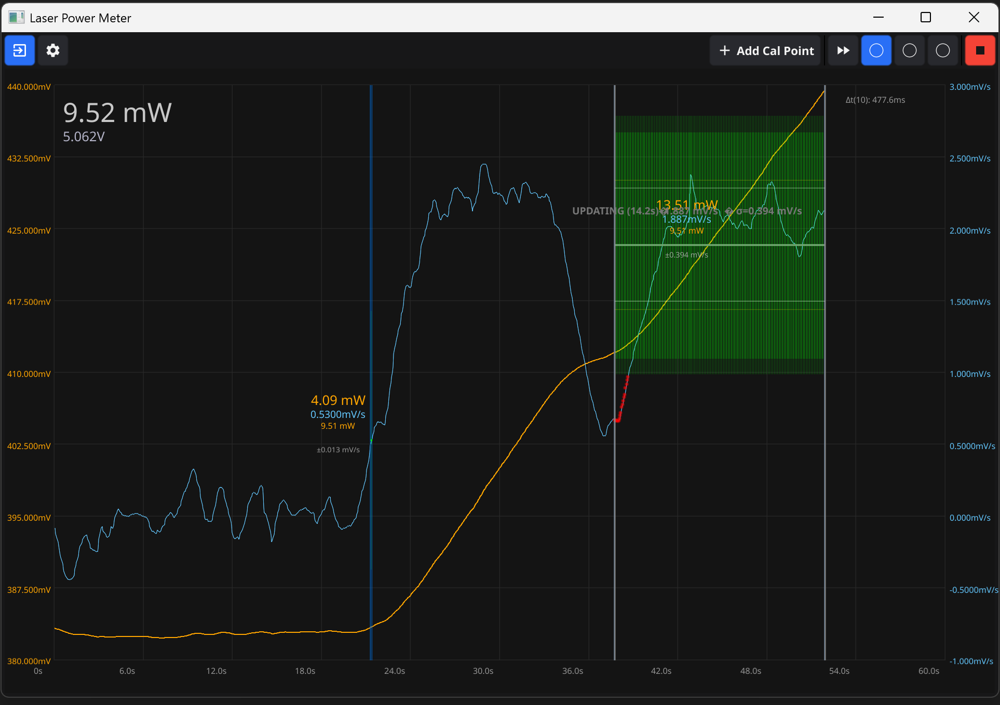

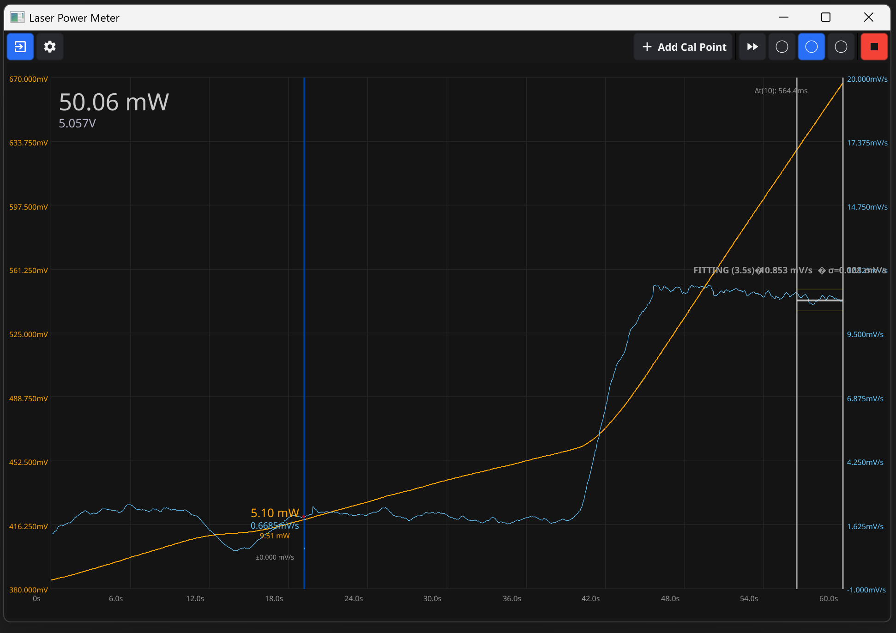

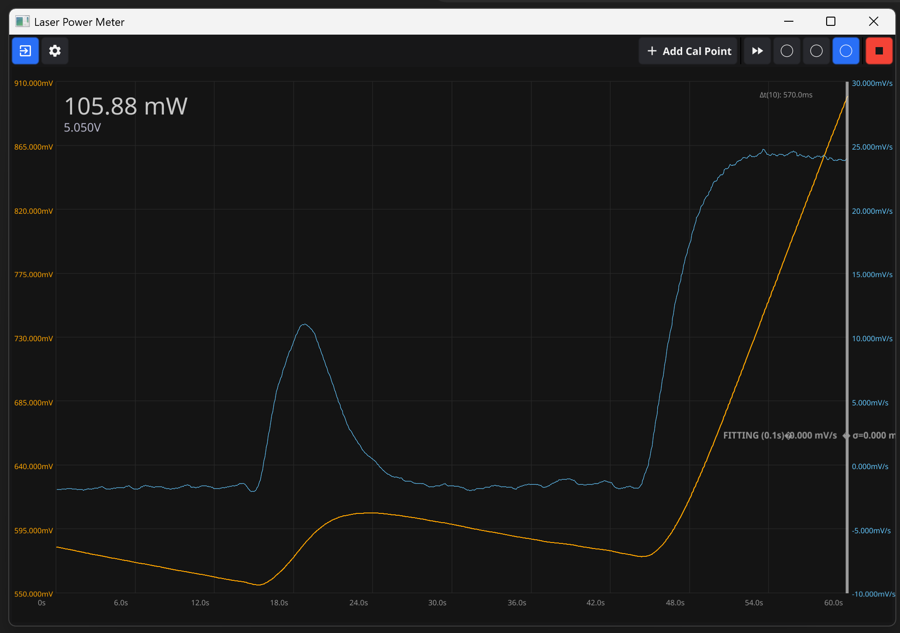

And here's my 785nm IR laser diode measurement alongside the 100mW calibration:

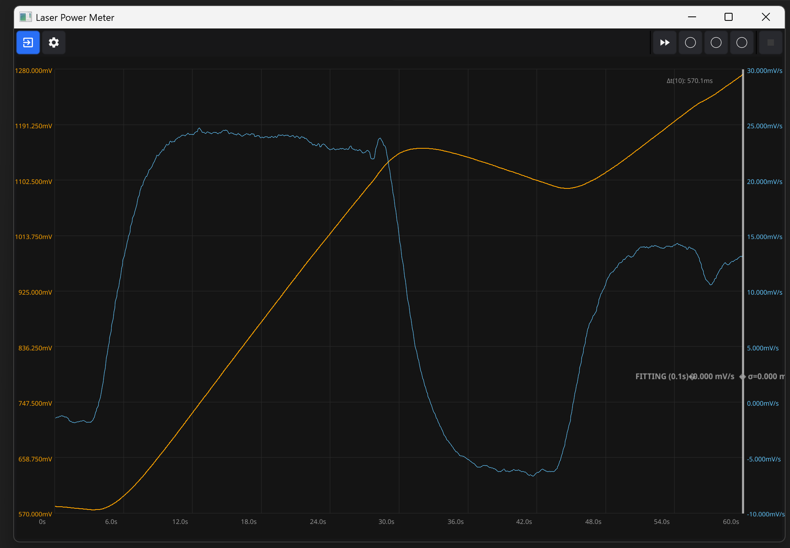

From the slopes I'm seeing:
- 10mW → ~2 mV/s
- 50mW → ~11 mV/s
- 100mW → ~25 mV/s
- Laser → ~15 mV/s

Quick back-of-envelope calculation: the laser shows roughly **60-65 mW** optical output. I'm feeding it 5V at 300mA (1.5W electrical including the current controller), so wall-plug efficiency is around 4% — pretty typical when you include the driver circuitry losses.

The slopes are consistent between runs, with repeatability within about 5% for powers above 20mW. Good enough for characterizing optical coupling efficiency!

## Why Am I Doing All This?

### The Grand Plan

I'm building a Raman spectrometer. Here's the roadmap:

1. **DVD Spectrometer** — A little gardener webcam mated with a DVD diffraction grating. Crude, but works for visible wavelengths.
2. **Prism Spectrometer** — Proper spectrometer using a glass prism and RPi Zero camera. Better resolution.
3. **Raman Spectrometer** — The ultimate goal, combining:
   - This power meter (for characterizing laser output)
   - TOSLINK fiber optics (cheap but lossy)
   - Custom cuvette holder (with embedded laser)
   - IR bandpass filter (to block excitation light)

### The Raman Rig

The whole setup lives inside a black ABS plastic box from the local hardware store. It's not glamorous, but it works.

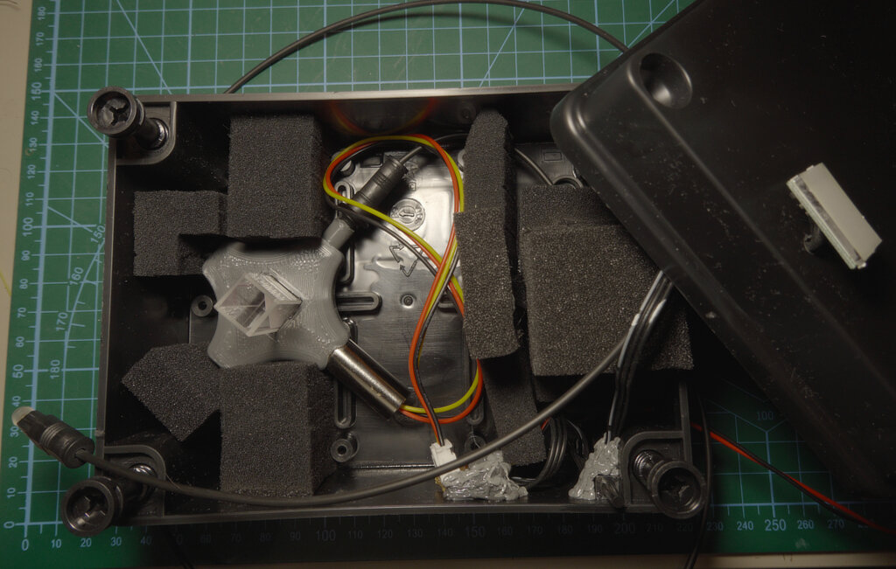

Inside the box:
- 3D printed cuvette and laser holder
- Coupling optics for collecting scattered light
- IR bandpass filter to block the excitation wavelength
- Touch button trigger for the laser
- Safety interlock switch — the laser won't fire if the box is open

That safety switch isn't paranoia. 785nm is invisible, and even 60mW can cause eye damage before you realize anything is wrong.

One thing I need to verify: **is this ABS plastic actually opaque at 785nm?** Many plastics that look black in visible light are surprisingly transparent in the near-IR. Black polycarbonate, for instance, is often used as an IR-pass filter! ABS should be mostly opaque due to its aromatic styrene content absorbing in the NIR, but I'll need to measure the actual transmittance with my spectrometer to be safe.

Future plans for this box:
- Coat the interior with white acrylic, then black acrylic on top — better IR blocking
- Add a UV laser for fluorescence experiments
- Upgrade to a more powerful laser for better signal
- Build a proper optical breadboard mount for other experiments

For Raman spectroscopy, you need to get as much excitation power as possible so that your Raman scattered signal is strong enough to detect with my camera setup. The signal intensity is proportional to laser power, so if I'm losing 60% in my fiber coupling (I am), I need to rethink how I feed laser light to the sample.

### The Fiber Coupling Problem

I'm using cheap TOSLINK cables and connectors for my optical path. Yes, they're designed for audio, not lasers. Yes, this is somewhat insane. But they're cheap, have good connectors, and work surprisingly well if you're careful.

The problem is that I lose significant laser power at every junction. The power meter lets me measure each connection individually and optimize the system. Plus, it's just fun to quantify exactly how much light I'm throwing away.

## Comparison: Calorimetric vs TEC Power Meters

| Property | Calorimetric (This Design) | Commercial TEC |
|----------|---------------------------|----------------|
| Min Power | ~1mW (with averaging) | ~50-100mW |
| Max Power | ~500mW (heat limited) | Several watts |
| Response Time | ~5-10 seconds | <1 second |
| Spectral Range | Broadband (soot absorbs everything) | Wavelength dependent |
| Cost | ~$5 in components | $200-2000 |
| Accuracy | ~5-10% | ~1-3% |

The commercial meters win on speed and precision, but for my use case — occasional measurements of low-power sources with no wavelength constraints — the DIY calorimetric approach is perfect. Plus I get to learn this stuff from hardware to software! Oh, good old university laboratory days! :)

## Lessons Learned

1. **Soot is amazing.** Don't underestimate a candle and some patience. The absorption is nearly wavelength-independent from UV to thermal IR.

2. **Differential measurement is essential.** Single-ended temperature measurement would be useless and would require insane ADC dynamic range!

3. **The ADC is the weak link.** The RP2040's ADC has terrible DNL and INL. A proper external ADC would improve things significantly, but it's good enough for relative measurements.

4. **Noise breeds noise.** Taking derivatives amplifies noise. I needed far more samples than I initially expected.

5. **Thermal isolation matters.** The white TiO₂ paint on the cavity walls made a noticeable difference in rejecting external IR radiation.

## What's Next?

This power meter is just one piece of the puzzle. Coming up:

- **DVD Spectrometer:** I have a little gardener webcam mated with a DVD diffraction grating. It's crude, but it works for visible wavelengths.

- **Prism Spectrometer:** Building a proper spectrometer using a glass prism and an RPi Zero camera. Better resolution, proper calibration.

- **The Raman Beast:** The ultimate goal. 785nm laser, proper notch filter, cooled CCD, and a custom cuvette holder that embeds the laser directly to minimize coupling losses.

The journey continues. Physics is fun, especially when you're building your own instruments. There's something deeply satisfying about measuring photons with copper plates and candle soot.

---

*All code for this project is available on [GitHub](https://github.com/itohio/golpm). The Go application handles serial communication with the RP2040, real-time signal display, calibration, and power calculation.*

*Stay tuned for more adventures in color science, spectroscopy, and questionable life choices involving cheap Chinese optics and overengineered DIY solutions.*

## References

- [golpm on GitHub](https://github.com/itohio/golpm) - The Go software for this laser power meter
- [Calorimetry](https://en.wikipedia.org/wiki/Calorimetry) - The science of measuring heat
- [Seebeck Effect](https://en.wikipedia.org/wiki/Thermoelectric_effect#Seebeck_effect) - How TEC power meters work
- [Raman Spectroscopy](https://en.wikipedia.org/wiki/Raman_spectroscopy) - What I'm building toward
- [Wheatstone Bridge](https://en.wikipedia.org/wiki/Wheatstone_bridge) - The sensing circuit
- [Carbon Black Absorption](https://en.wikipedia.org/wiki/Carbon_black) - Why soot is such a good absorber
