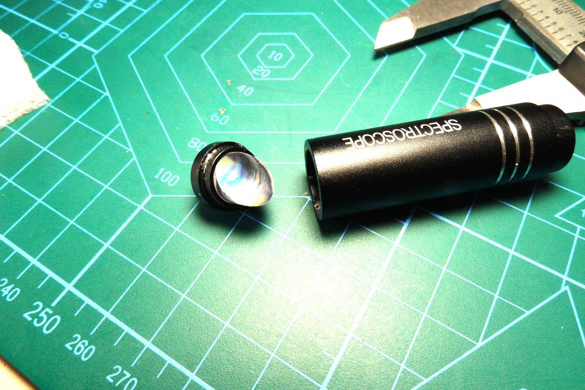
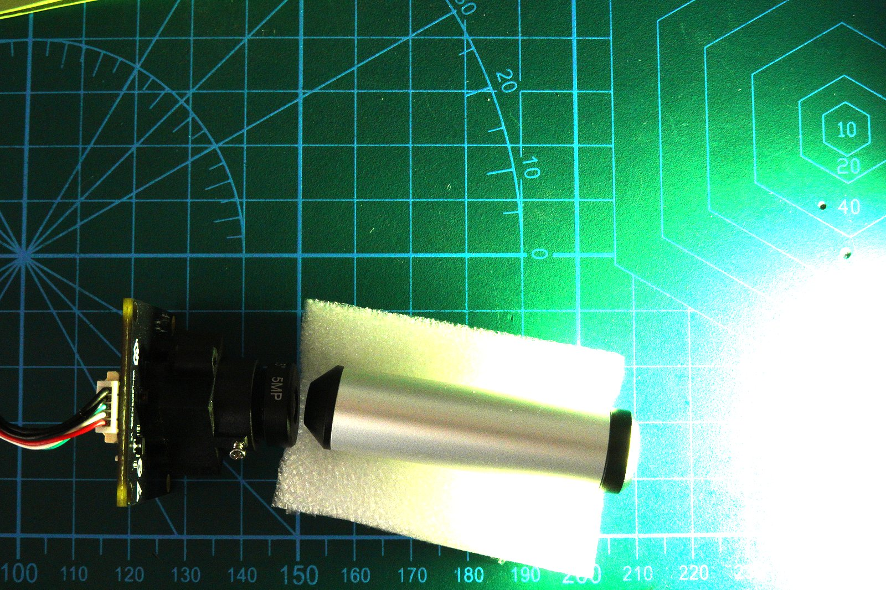
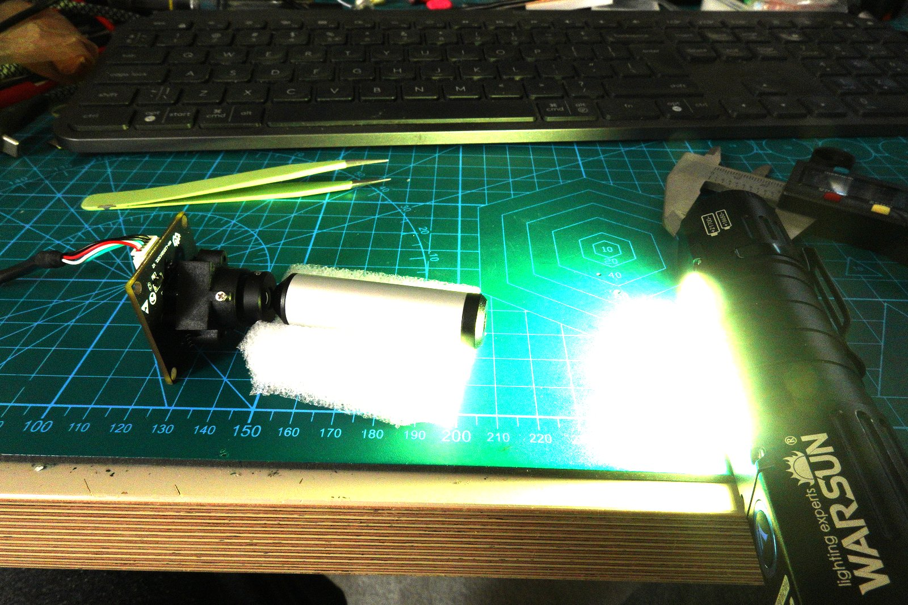
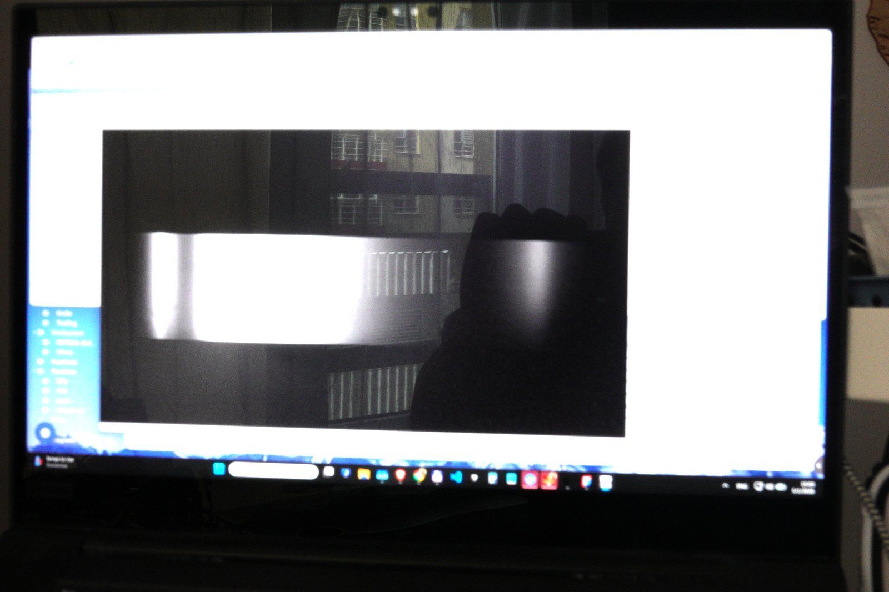

Still trying to solve the monitor calibration problem. The goal hasn't changed: measure the actual spectral output of my monitor's primaries, not just RGB. The CR30 held up to the screen gives something, but it's not designed for emissive sources and the numbers are suspect. What I need is a real spectrometer pointed at the screen.

I have one of those pocket gem inspection spectroscopes — the kind jewelers use to identify stones. Small cylindrical barrel, holds up to your eye, you look through it at a light source and see the absorption bands. Bought it ages ago. It's labeled "SPECTROSCOPE." I assumed it used a prism, because that's the traditional jeweler's instrument.

It doesn't. It's a diffraction grating.

## Disassembly

The front unscrews and the lens element pulls right out. Inside: a small grating, a slit, and an eyepiece. The grating is the dispersive element — not a prism at all. The lens I'm holding is just the front objective; the dispersive element is deeper in the barrel.

That's not necessarily bad. The instrument still works. But it changes the geometry: a grating disperses at a fixed angle relative to the incident light, and that angle is a function of the grating frequency and wavelength. For a prism you can rotate and tilt and find a wide range of workable camera positions. For a grating, the first-order diffraction is at a specific angle — you have to hit that angle with the camera sensor or you're not capturing the spectrum.

For a 3D printed holder, I need to know that angle precisely before I model anything.

## Finding the alignment angle

The approach: mount the camera module and spectroscope on the cutting mat, shine a broadband source into the slit, and physically rotate the camera while watching the live view until the spectrum is centered and in focus. The cutting mat's angle markings make it easy to read off the angle once found.

Camera module (OV9281 monochrome) on the left, spectroscope propped in a foam block roughly aligned with the camera, Warsun flashlight as a broadband white source on the right. The foam is a crude but effective way to hold the angle while adjusting.

## What the camera sees

This is the camera's live view aimed into the spectroscope exit while the flashlight illuminates the slit. The vertical lines are the grating ruling visible through the eyepiece. The bright horizontal band is the dispersed spectrum — you can see the rainbow smear across the center of the frame, with the grating structure overlaid.

This is enough to read the angle: rotate the camera on the mat until that spectral band is horizontal and fills as much of the frame as possible. Then read the angle between the spectroscope axis and the camera axis off the mat markings.

The measured alignment angle is approximately **20–22°** off the optical axis of the spectroscope barrel. That's the number that goes into the 3D model — the camera needs to be mounted at that angle relative to the slit, not straight ahead.

## Why this matters for the 3D model

A straight-ahead holder — camera coaxial with the spectroscope — wouldn't catch the spectrum at all. You'd get the zero-order (undiffracted) beam straight through, which is just the white light source, no spectral information.

The holder needs:
- A fixed slit-to-camera distance (affects focus and spectral resolution)
- A ~21° angle between the spectroscope axis and the camera mount axis
- A way to hold the camera rigidly at that angle without flex

Secondary constraint: the OV9281 module I'm using has a specific lens-to-sensor distance, and the spectroscope's eyepiece has its own exit pupil. The slit needs to be imaged through the grating onto the sensor at a 1:1-ish ratio for maximum spectral resolution. That sets the working distance, which also feeds into the 3D model.

## Next

Design and print the holder. Once the alignment is locked in mechanically, calibrate the wavelength axis using known spectral lines — a compact fluorescent bulb has mercury emission lines at 405, 436, 546, 578nm that are easy to identify. Then: point it at the monitor, measure the primaries.

That's the path to actually understanding the red channel problem without buying a €500 spectrophotometer.
