After successfully reverse engineering the CR30 colorimeter, I found myself wanting something more versatile - a device that could not only measure reflected light but also handle transmittance measurements with fiber optic coupling. The result is this compact, portable visible light spectrometer built around a Raspberry Pi Zero 2 W and some clever optical engineering.

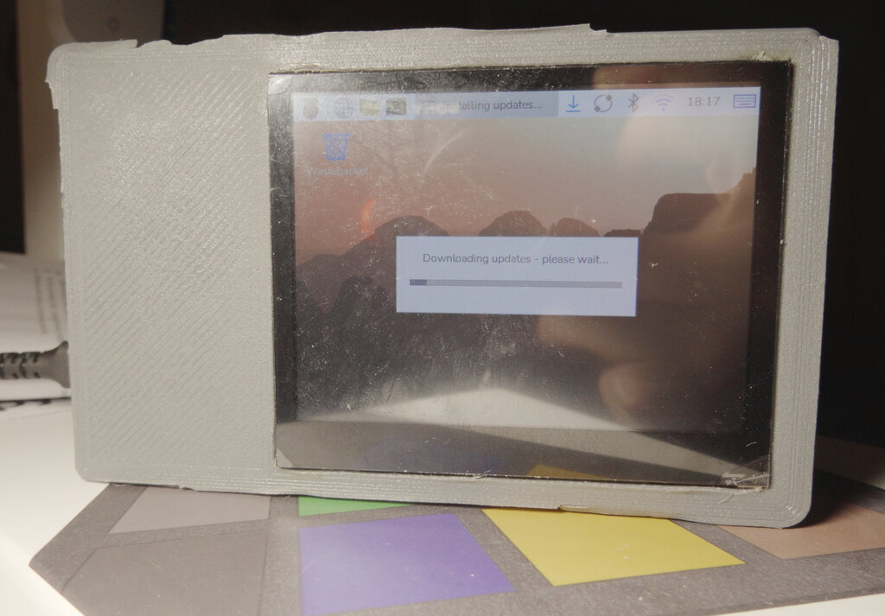

## The Motivation

While the [CR30 colorimeter](../reverse-engineering-cr30/) works great for surface measurements, it has limitations. I wanted a device that could:
- Measure both reflectance, transmittance, and fluorescence spectra
- Use fiber optic coupling for flexible sample positioning
- Be truly portable with built-in light source and display
- Have better control over the measurement process
- Explore the UV and near-IR ranges beyond typical colorimeters

Inspired by projects like [PySpectrometer2](https://github.com/leswright1977/PySpectrometer2) and "Little Garden Spectrometer," I set out to build something that combined the best aspects of DIY spectrometry with professional features. PySpectrometer2 in particular showed me that building a capable, portable spectrometer was achievable with modern components and proper optical design.

Of course, professional compact units exist from Ocean Optics, Thor Labs, and others—complete with proper SMA fiber optic terminations, assorted wavelength ranges, proper calibration, and optical breadboard compatibility. But even the lowest-priced UV-VIS-NIR units start around a couple thousand Euros, which puts them out of reach for hobbyists and small labs.

I'm giving away all the print designs and source code. The Go software version is being developed in the [github.com/itohio/EasyRobot](https://github.com/itohio/EasyRobot) repository. However, you'll have to find your own compact prism. I got mine on AliExpress - they advertise it for gem quality inspection.

## Design Philosophy: Prism vs. Diffraction Grating

Most DIY spectrometers use diffraction gratings—often repurposed DVDs. While these work, they have limitations. I chose to use a jeweler's gem inspection prism instead, which offers several advantages:

### Why a Prism?

**Advantages:**
- Higher light throughput (no diffraction efficiency losses)
- Cleaner spectral separation without diffraction orders
- More compact optical path
- Better for quantitative measurements

**Trade-offs:**
- Non-linear wavelength dispersion (requires more sophisticated calibration than what e.g. Theremino offers)
- Slightly more expensive than a DVD

The non-linearity is actually manageable with proper calibration, and the improved light collection makes a significant difference when measuring dim samples.

### The Physics: Diffraction Grating vs. Prism

Understanding the fundamental difference between these two approaches helps explain why the prism design offers advantages for this application.

#### Diffraction Grating: Multiple Orders, Lost Light

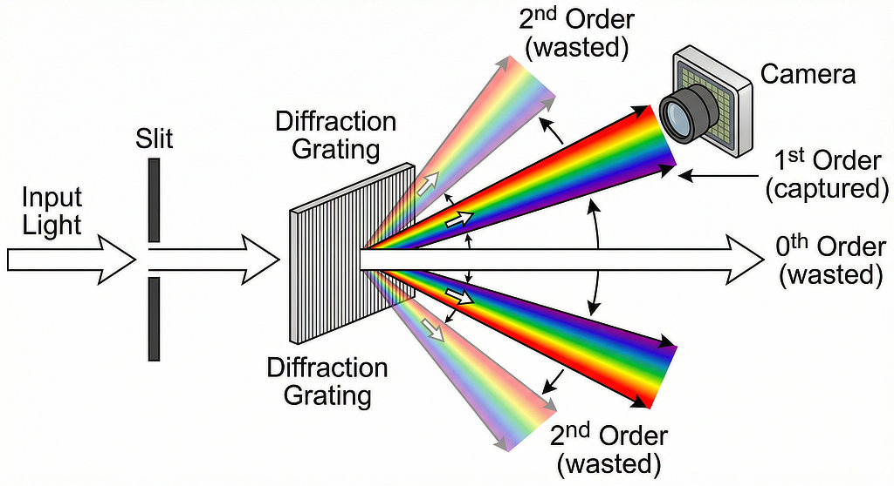

A diffraction grating works by interference, splitting incoming light into multiple diffraction orders. The problem is that light is distributed across **all** these orders simultaneously:

- **0th order**: Undiffracted beam (wasted - contains no spectral information)
- **1st order**: Primary dispersed spectrum (what we want to capture)
- **2nd order**: Higher diffraction (wasted - typically out of camera view)
- **-1st order**: Negative direction dispersion (wasted)
- **-2nd order**: Negative higher order (wasted)

Also, proper spectrometers using this type of monochromator redirect and filter out these unwanted diffraction orders. Otherwise you get artifacts in your measured spectrum—this is exactly what happens with cheap devices like the Little Garden Spectrometer that have the DVD glued directly to the lens without blocking unwanted diffraction orders.

**The Critical Problem:** Only one diffraction order is captured by the camera. The rest of the light—often 70-80% of the total—is simply **lost**. This dramatically reduces signal strength, especially problematic when measuring:
- Dim samples
- Transmittance through absorptive materials
- Weak fluorescence
- Light through long fiber optic cables

The grating equation `d sin(θ) = mλ` shows that each wavelength λ is diffracted into multiple angles for different orders (m = 0, ±1, ±2, ...). The intensity is distributed across all these orders according to the grating's diffraction efficiency curve, which varies with wavelength. You can never recover this lost light—it's a fundamental limitation of diffraction-based dispersion.

#### Prism: Continuous Spectrum, Maximum Throughput

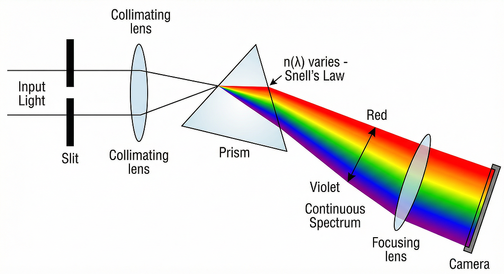

A prism works by refraction, bending light according to **Snell's Law**:

```
n₁ sin(θ₁) = n₂(λ) sin(θ₂)
```

The key insight is that the refractive index `n₂(λ)` is wavelength-dependent (dispersion). This means different wavelengths bend by different amounts:
- **Shorter wavelengths** (violet/blue): Higher refractive index → bend more
- **Longer wavelengths** (red): Lower refractive index → bend less

The Cauchy equation approximates this relationship:

```
n(λ) ≈ A + B/λ² + C/λ⁴
```

**The Critical Advantage:** All the light goes into a **single continuous spectrum**. There are no diffraction orders, no wasted light paths. Nearly 100% of the incoming light (minus reflection losses, which can be minimized with AR coatings) is dispersed and available for measurement.

#### Non-Linearity is a Feature, Not a Bug

The non-linear dispersion from Snell's Law means wavelengths are not evenly spaced across the camera sensor. This sounds like a disadvantage, but:

**In Practice:**
- Modern calibration handles non-linearity easily (polynomial fitting)
- The non-linearity is completely predictable and stable
- You calibrate once with known spectral lines, then it's done
- Software interpolation provides any desired wavelength sampling

**The Trade-off:**
- Diffraction gratings: Linear dispersion, but **lose 70-80% of your light**
- Prisms: Non-linear dispersion (easily calibrated), but **keep ~95% of your light**

For quantitative spectroscopy, having 5-10× more signal is far more valuable than having linear wavelength spacing. You can always correct for non-linearity in software, but you can never recover lost photons.

#### Why This Matters for This Project

With fiber optic coupling and potentially long light paths, maximizing throughput is essential:
- TOSLINK fibers have coupling losses
- Samples may have low transmittance or reflectance
- LED light source has finite power
- Longer integration times mean slower measurements

The prism design's superior light collection makes the difference between useful measurements and unusably noisy data.

## Hardware Architecture

The heart of the system consists of carefully selected components that balance performance, size, and power consumption:

### Core Components

**Optical System:**
- **Camera**: OV9281 monochrome sensor module
  - Native monochrome sensor (no Bayer filter to remove)
  - Potentially includes IR filter (needs verification)
  - Good sensitivity across visible range
- **Dispersive Element**: Jeweler's gem inspection prism
  - Provides reliable spectral separation
  - Compact form factor
- **Fiber Optic Coupling**: TOSLINK couplers and cables
  - Standard, readily available components
  - Easy to connect/disconnect samples
  - Could be upgraded to laser-grade fiber

**Light Source:**
- 3W white LED (nominally 6500K)
- Complex optical train for efficient coupling:
  - Heat sink → LED → LED lens → LED lens → 6mm lens → TOSLINK
- USB-C PD board for 12V power delivery
- Draws approximately 15W with light source active (camera not included)

**Computing Platform:**
- Raspberry Pi Zero 2 W
  - Runs Trixie OS with desktop environment
  - Sufficient processing power for real-time analysis
  - Native camera interface support
- 3.5" touch screen display
  - Integrated user interface
  - No external computer needed

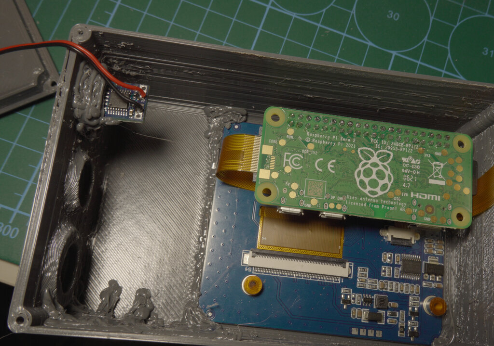

The LCD and Raspberry Pi are secured using 3D printing pen blobs with PETG. While PETG doesn't print cleanly on my printer (hence the stringy appearance), it's durable and works well for structural reinforcement.

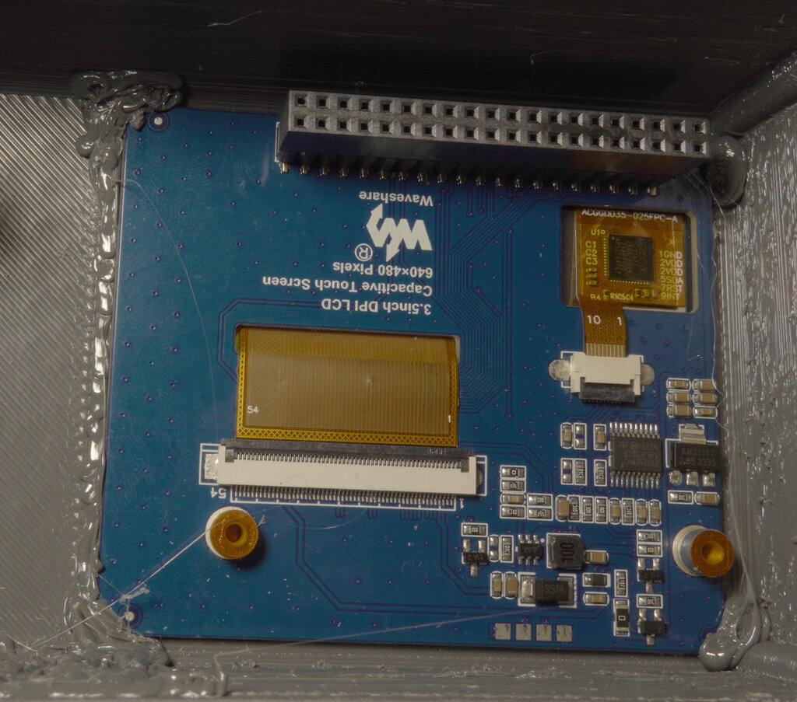

**Mechanical:**
- Custom 3D printed enclosure
- Total dimensions: 130×80×60mm
- Integrated mounting for optical components
- Modular design for easy assembly/maintenance

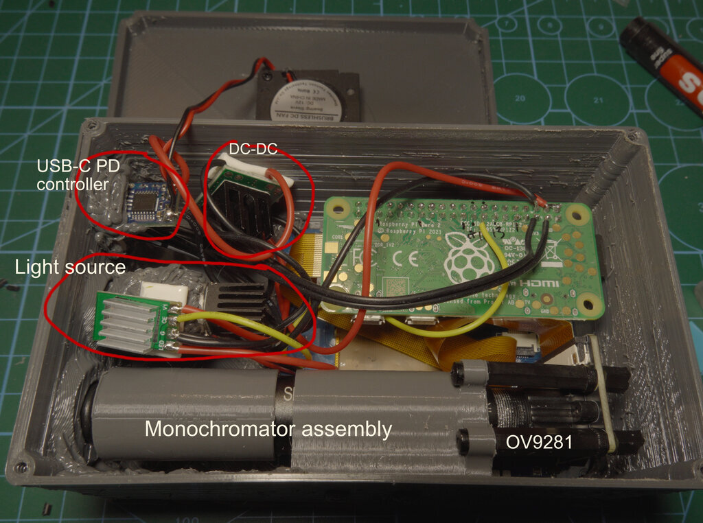

### Power Management

The entire system runs from USB-C with Power Delivery negotiation:
- Requires minimum 12V (15W recommended)
- PD negotiation board handles voltage conversion
- Separate power domains for LED and Raspberry Pi
- Can operate without light source for emission measurements

## Key Differences from Little Garden

While inspired by the Little Garden project, this design diverges in several important ways:

| Feature | Little Garden | This Project |
|---------|---------------|--------------|
| Dispersive element | DVD diffraction grating | Jeweler's prism |
| Camera | RGB with Bayer filter | Native monochrome |
| Light source | External | Integrated 3W LED |
| Fiber coupling | None | TOSLINK (upgradeable) |
| Form factor | Desktop | Portable, battery-capable |
| Measurement modes | Reflectance | Reflectance + Transmittance |
| Display | External computer | Integrated touch screen |

The integrated light source and fiber optic coupling make this particularly useful for field measurements and samples that are difficult to position directly at the aperture.

## Optical Train Design

### LED to Fiber Coupling

Getting sufficient light through the TOSLINK fiber required careful optical design:

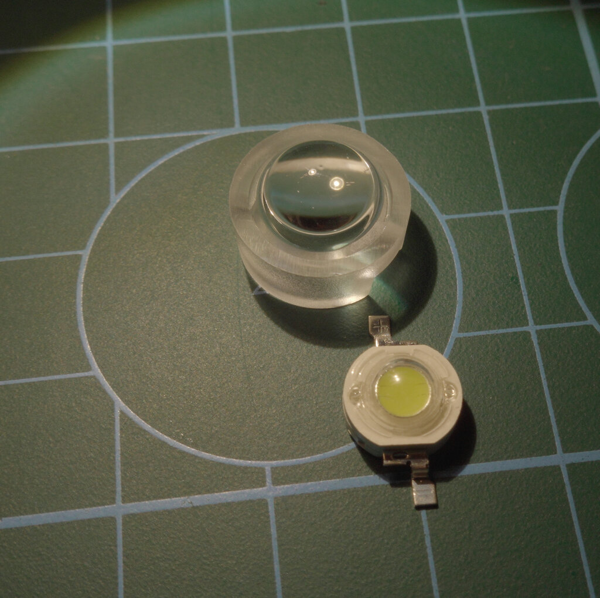

The optical path uses:
1. **Heat sink** - Critical for LED stability and lifespan
2. **3W LED die** - High power for maximum throughput
3. **Primary LED lens** - Collects light from the die
4. **Secondary LED lens** - Further collimates the beam
5. **6mm lens (6mm focal length)** - Images collimated beam onto TOSLINK fiber
6. **TOSLINK coupler** - Standard optical connection (1mm receptacle)

This multi-stage approach maximizes coupling efficiency while maintaining a reasonable working distance. The LED lenses are positioned carefully to balance beam size with numerical aperture matching to the fiber.

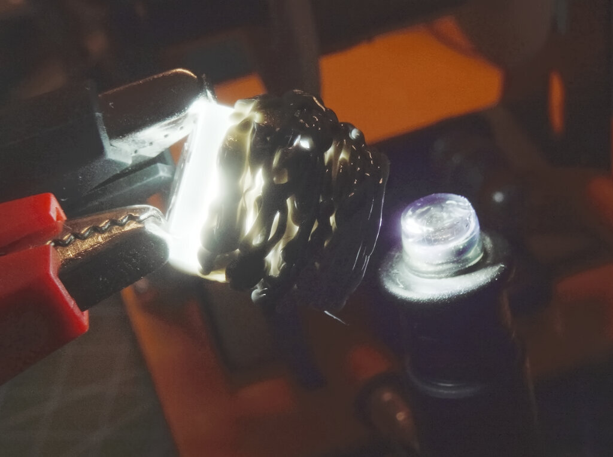

The LED is a standard 3W white chip paired with a matching lens. The first lens reduces the beam angle from 120° to 15°. A second lens further focuses the spot down to approximately 4–5 mm in diameter, producing an almost collimated beam. A 6mm lens (6mm focal length) then images this onto the 1mm TOSLINK receptacle.

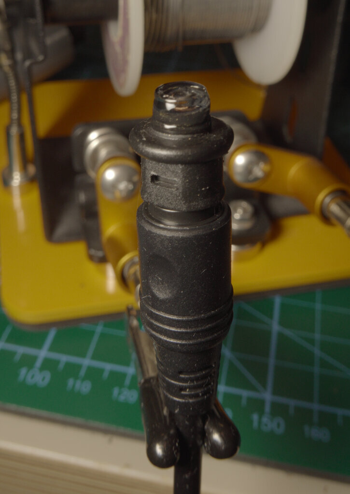

The alignment process was iterative and manual—I eyeballed the distances and used a 3D pen with UV-cured resin to align and fasten each element. It's not ideal, but this approach worked much better than my first iterations.

The 6mm coupling lens is glued using UV resin. While the resin may yellow over time, I positioned it such that the optical path impact should be minimal. I'll need to shine more UV through the lens to fully harden the resin.

### Future Light Source Plans

I'm working on a more versatile light source box that would house White LED, RGB LED, 380nm UV, 360nm UV, and even a laser. I intended to use this enclosure for the spectrometer, but ran into issues with laser coupling. So I built just the spectrometer with a white light source for now. Ideally there should be a halogen lamp light source for a true black body spectrum...

Anyway, I've exposed 5V and I2C pins to the outside so that any light accessory could be added in the future. I might even consider exposing USB host connection at some point so my CR30 could be plugged into it - software architecturally supports this.

### Prism and Camera Assembly

The dispersive section uses a compact arrangement:
- Fiber optics → Slit → Prism → 8mm camera lens → OV9281 camera
- Prism orientation optimized for visible range coverage
- Camera positioned to capture maximum spectral width
- Adjustable mounting for fine alignment

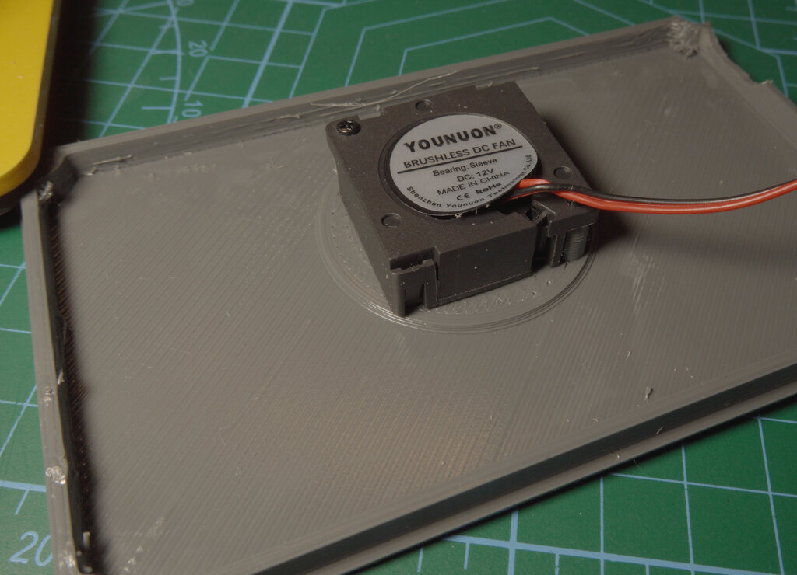

#### Camera Mounting Evolution

Getting the camera mount right required several design iterations:

**First iteration:** The entire camera lens was encapsulated in the 3D print. This proved very difficult to focus properly.

**Second iteration:** A somewhat modular design, but the camera was still fixed to the lens assembly. This was still hard to focus and align properly.

**Final iteration (shown in photos):** A fully modular sliding design:
- Fiber coupling on the left slides on the prism assembly
- Camera holder slides independently on the prism assembly
- Camera is fixed to the holder via nylon stand-offs
- The camera is intentionally skewed horizontally to capture more of the IR spectrum

This modular approach makes focusing much easier and allows for fine adjustments during calibration.

#### Focusing Procedure

Since the camera has a rather fast aperture and is focused on a very near object (the slit), the depth of field is extremely narrow. Even small camera adjustments make the image blurry.

For focusing, I point the whole assembly (via a 1m TOSLINK cable) at a small UV sterilization lamp - a simple mercury lamp without UV filter. This provides lots of distinguishable spectral peaks that I can use to achieve a sharp image.

The focusing process:
1. Rough focus at approximately where I thought the slit was
2. Assemble everything
3. Point at mercury lamp via TOSLINK cable
4. Adjust focus until the mercury peaks are sharpest at 640×480 resolution
5. Use the small screen and visual inspection (will use software analysis once complete)

Once I have the software fully operational and can see the spectrum in real-time, I'll be able to calculate the optimal focus mathematically rather than relying on my eyes and a small screen.

#### Design Compromise

I tried to decouple the camera from the input as much as possible, but couldn't completely avoid the coupling in this compact design. A previous design decoupled the prism input and the instrument input via a short TOSLINK cable, but that design had one huge issue: the enclosure was much bigger to keep the fiber bend radius within allowed limits. Perhaps in the next design I can address this issue.

## Software: The Procrastination Project

I'm developing a Golang application using Fyne for the UI and OpenCV for image processing. The software needs to handle:

**Core Functionality:**
- Real-time camera capture and processing
- Wavelength calibration management
- Spectral line extraction and analysis
- Support for multiple devices (this spectrometer + CR30)
- Measurement mode switching (reflectance/transmittance)

**Current Status:**
The software works for basic measurements, but I've been procrastinating on setting up a proper build pipeline. Cross-compiling Go with OpenCV for ARM isn't exactly my idea of fun. At this point, I'm seriously considering just setting up the build environment directly on the Pi rather than continuing to fight with cross-compilation dependencies.

**Why Golang?**
- Fast enough for real-time processing
- Clean concurrency model for camera handling
- Fyne provides a nice cross-platform UI
- Single binary deployment (once I solve the build issues)
- Good OpenCV bindings via GoCV
- I've already invested in porting most of my CV and ML libraries to Go in my EasyRobot mega-library, so I just want to continue on the Go path :)

## Calibration and Performance

### Wavelength Calibration

The prism's non-linear dispersion means careful calibration is essential. I've used known spectral lines from:
- Mercury vapor lamps (distinct UV/visible lines)
- Sodium vapor (589nm doublet)
- Halogen lamps (continuous spectrum with known emission features)

Initial calibration was done with the camera connected directly to a PC using a different module (same OV9281 sensor). This allowed rapid iteration on the calibration algorithm before integrating everything into the portable unit.

Another interesting possibility is using the Sun for calibration. Fraunhofer lines are remarkably stable and well-documented, making them excellent reference points. However, I'm still working out how this would interact with the sensor's non-linear sensitivity—if we calibrate at the lowest sensitivity wavelengths, that calibration won't necessarily translate to the higher sensitivity regions. It's an interesting problem to solve though.

### Spectral Range

**Confirmed:**
- **UV cutoff**: Approximately 350nm detected
  - Limited by sensor response and/or IR filter
  - Halogen UV lamp measurements show response
- **Visible range**: 380-750nm well characterized
- **Near-IR**: Extends beyond 785nm

**Uncertain:**
- **IR limit**: Not yet characterized properly
  - Halogen lamps show strong IR emission
  - Need to verify with calibrated IR diodes
  - Alignment issues prevent capturing full spectral window

The viewport alignment is currently the limiting factor—the full dispersed spectrum doesn't fit properly in the camera's field of view. This is mechanical, not optical, and should be fixable with better mounting adjustments.

### Accuracy and Repeatability

Early measurements show promising results:
- Good repeatability for identical samples
- Spectral features clearly resolved
- Quantitative comparison requires:
  - Full wavelength calibration against known sources
  - Intensity calibration with reference standards
  - Cross-validation with Little Garden spectrometer

The non-linear prism dispersion is visible in the data but correctable through proper calibration curves. Once calibrated, this should provide accurate spectral measurements across the full range.

## Comparison with Commercial Devices

How does this compare to commercial spectrometers?

**Advantages:**
- Significantly lower cost (~$200 vs $2000+)
- Integrated light source and display
- Fiber optic coupling (often an expensive add-on)
- Fully customizable software
- Portable and self-contained
- Open design for modifications

**Limitations:**
- Lower resolution (determined by sensor pixel count)
- Requires manual calibration
- Not yet validated against reference standards
- Software still in development
- Temperature sensitivity not characterized

For hobby, education, and many practical applications, this represents excellent value. It won't replace a research-grade spectrophotometer, but it's more than adequate for:
- Color science experiments
- Material identification
- Filter characterization
- LED/light source analysis
- Educational demonstrations

## Construction Challenges

### The 3D Printing Iteration Cycle

Getting the mechanical design right took several iterations:
- Optical path alignment is critical
- Heat management for the LED, drivers, DC-DC, Camera, and RPI required design changes
- Cable routing in the compact space
- Display mounting and viewing angle
- Access for assembly and maintenance

Each print cycle revealed new clearance issues or alignment problems. The compact space required careful tetris-like placement of components to avoid interference with the optical path.

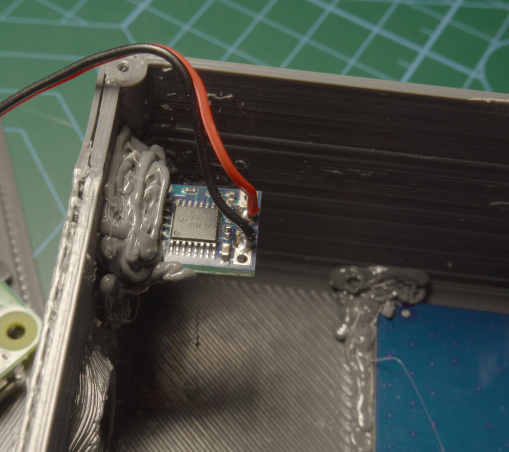 The final design uses a modular approach where individual optical sections can be adjusted or replaced without rebuilding everything. The compact space required careful placement of the USB-C PD board, DC-DC converter, and LED current controller to avoid interference with the optical path.

### TOSLINK: A Pragmatic Choice

Using TOSLINK couplers and cables was initially a cost-saving measure, but it turned out to be a great choice:
- Readily available and cheap
- Standard connectors (easy to swap)
- Reasonable transmission characteristics
- Easy to terminate (no fusion splicing)

For future versions, upgrading to proper multimode fiber (like 200µm core laser fiber) might improve throughput and reduce losses, but TOSLINK works surprisingly well for this application.

### Power Delivery Complexity

USB-C PD negotiation is wonderful when it works but can be finicky:
- Some power supplies don't properly support 12V
- Need proper decoupling for clean LED operation

Once properly configured, the PD board handles everything automatically, but getting there involved some debugging with a USB power analyzer and revealed incompatible power banks.

## Future Improvements

### Short Term
- Complete wavelength calibration across full range
- Verify IR response with calibrated sources
- Fix mechanical alignment for full spectral window
- Finalize Golang software (and actually build it for ARM)
- Create reference measurement library

### Long Term
- Characterize fluorescence response
- Add integration time control for dynamic range
- Implement automated calibration sequences
- Create spectral database for common materials
- Add absorbance/transmission coefficient calculations
- Explore time-resolved spectroscopy (LED pulsing)

### Hardware Enhancements
- Replace TOSLINK with proper multimode fiber
- Add temperature compensation
- Implement shutter for dark frame subtraction
- Consider adding reference channel for normalization
- Battery pack integration for true field use

## Applications

This spectrometer opens up many practical applications:

**Color Science:**
- Characterizing light sources
- Measuring filter transmission curves
- Validating color rendering properties
- Complementing CR30 colorimeter measurements

**Material Analysis:**
- Identifying materials by spectral signature
- Quality control for colored products
- Detecting coatings and surface treatments
- Analyzing gemstones and minerals

**Photography/Lighting:**
- Comparing LED color temperature accuracy
- Measuring gel filter properties
- Characterizing camera sensor response
- Evaluating light quality for photography
- Characterizing camera filters and lenses - I'll be able to answer long standing question - why Tamron feels cooler than Sigma and does my TTArtisan lens add any color :)

**Education:**
- Demonstrating spectral principles
- Laboratory experiments
- Student projects
- Citizen science applications

## Related Projects

This spectrometer complements my other color science tools and builds upon existing DIY spectrometer projects:

**My Projects:**
- **[CR30 Colorimeter](../reverse-engineering-cr30/)** - For surface color measurements
- **[Color Calibration Workflows](../darktable-color-calibration/)** - Practical applications

**Inspiration & Reference:**
- **[PySpectrometer2](https://github.com/leswright1977/PySpectrometer2)** - Les Wright's DIY spectrometer that proved Raspberry Pi could handle real-time spectral analysis
- **Little Garden** - Reference device for validation and comparison

Together, these tools form a complete color measurement and characterization system suitable for photography, printing, and general color science work.

## The Joy of Building

What makes this project particularly satisfying is the combination of disciplines:
- **Optics**: Understanding dispersion and light collection
- **Mechanical**: 3D printing and assembly
- **Electronics**: Power management and camera interfacing
- **Software**: Real-time image processing
- **Color Science**: Calibration and measurement theory

Each aspect presented unique challenges and learning opportunities. The fact that it actually works and produces sensible spectra is deeply gratifying.

## Conclusion

Building a portable spectrometer is an achievable project that provides powerful measurement capabilities. The combination of modern components (Raspberry Pi, monochrome camera modules, USB-C PD), clever optical design (prism dispersion, fiber coupling), and 3D printing makes it possible to create a device that would have been prohibitively expensive just a few years ago.

The prism-based approach offers advantages over diffraction grating designs, particularly for quantitative measurements where light throughput matters. While the non-linear dispersion requires more careful calibration, the results are worth it.

Is it perfect? No. The alignment needs refinement, the software needs completion, and full characterization is still ongoing. But it's functional, portable, and already providing useful measurements. Sometimes "good enough to be useful" is better than "perfect but never finished."

If you're interested in color science, spectroscopy, or just enjoy building instrumentation, I highly recommend diving into a project like this. The learning curve is steep but rewarding, and the ability to make spectral measurements opens up a whole new way of seeing the world.

Now, if only I could stop procrastinating on that ARM build environment...

---

*This project is ongoing. I'll update this post as I complete the calibration, finish the software, and gather more measurement data. If you're building something similar or have questions about the design choices, feel free to reach out.*

## Technical Specifications

**Optical System:**
- Dispersive element: Jeweler's gem inspection prism
- Camera: OV9281 monochrome (1280×800 pixels)
- Fiber coupling: TOSLINK (can upgrade to multimode laser fiber)
- Light source: 3W 6500K white LED
- Spectral range: ~350nm - >785nm (under characterization)

**Electronics:**
- Computer: Raspberry Pi Zero 2 W
- Display: 3.5" touch screen
- Power: USB-C PD, 12V minimum, ~15W with light source
- Camera interface: CSI

**Mechanical:**
- Dimensions: 130×80×60mm
- Construction: 3D printed enclosure
- Weight: TBD (once finalized)

**Software:**
- Language: Golang
- UI Framework: Fyne
- Image Processing: OpenCV (GoCV bindings)
- OS: Raspberry Pi OS Trixie with desktop

## References and Resources

### Inspiration Projects
- [PySpectrometer2](https://github.com/leswright1977/PySpectrometer2) - Les Wright's excellent DIY spectrometer project that demonstrated what's possible with Raspberry Pi
- [Little Garden Spectrometer](https://publiclab.org/wiki/spectral-workbench) - Public Lab's open-source spectrometer
- [Theremino Spectrometer](https://www.theremino.com/en/downloads/automation#spectrometer) - Software and calibration approaches

### Technical References
- [OV9281 Datasheet](https://www.ovt.com/) - Camera sensor specifications
- [Prism Spectroscopy](https://en.wikipedia.org/wiki/Prism) - Theoretical background
- [Fiber Optics Basics](https://en.wikipedia.org/wiki/Optical_fiber) - Understanding light transmission
- [Spectral Analysis](https://en.wikipedia.org/wiki/Spectroscopy) - Measurement principles

### Software Tools
- [GoCV](https://gocv.io/) - Go bindings for OpenCV
- [Fyne](https://fyne.io/) - Go UI framework

*All photos and designs are my own. The project files and software will be published on GitHub once the software reaches a more complete state.*
