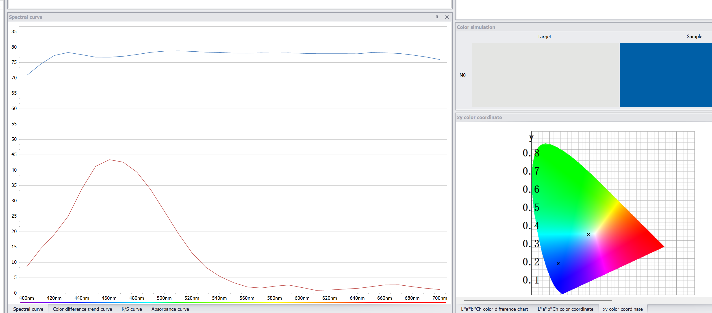

I've always been fascinated by the intersection of hardware and software, especially when it comes to understanding how devices communicate. Recently, I developed a need for monitor calibration as well as properly color correct my photos. I've been looking at X-Rite, Datacolor and other calibration devices and am on the path of acquiring one of those. However, in the meantime I got this idea of creating a simple color chart that could substitute one of those ColorChecker24 cards for simple color correction. For that I needed to print an accurate replica of one of those charts so that Darktable and/or Davinci Resolve would recognize it. Of course it is impossible to do due to various reasons, but it is possible to produce one close enough for regular use(not scientifically accurate at all). For that purpose I have an old sublimation printer that only has CMY colors. Clearly not enough to produce the full gamut, but close enough. Or so I thought...

The very first time I got into color science was when I was developing some software for accurate color 3d printing. Someone produced custom buttons from various plastics that are colorful and had internal texture. The idea was to produce 3D prints of those buttons with accurate colors(minus translusence). For that I had to scan the original button with a calibrated scanner, convert the images into true colors, and then print with 3d printer using that printer's color profile. However, there was no such profile! So, I had to print a color chart with as many colors as I could put into it without color bleed, scan, and create a color profile from it. This worked to a degree, but I digress.

Anyway, I don't have the calibrated scanner anymore. So I looked at printer calibration devices - and they are expensive! I did not want such a niche device if I only used it once for an experiment... So, I stumbled upon upon a cheap Chinese CR30 colorimeter on AliExpress and thought: "What if I could reverse engineer its protocol and build my own color measurement software?" Little did I know this would lead me down a rabbit hole into the fascinating world of [color science](https://en.wikipedia.org/wiki/Color_science) and [colorimetry](https://en.wikipedia.org/wiki/Colorimetry). All the observers, color spaces, and illuminants... Aghhrrrr...


## The Device

The CR30 is a very compact handheld colorimeter that measures color using [spectral analysis](https://en.wikipedia.org/wiki/Spectral_analysis). It's essentially a small spectrometer that can measure the [spectral power distribution](https://en.wikipedia.org/wiki/Spectral_power_distribution) of light reflected from or ~~transmitted through~~ a sample. The device communicates via serial port and provides measurements in various color spaces like [CIE XYZ](https://en.wikipedia.org/wiki/CIE_1931_color_space), [CIE LAB](https://en.wikipedia.org/wiki/CIELAB_color_space), and [sRGB](https://en.wikipedia.org/wiki/SRGB). Well, actually it does not - see later.

What makes this device interesting is that it's essentially a [spectrophotometer](https://en.wikipedia.org/wiki/Spectrophotometry) in a handheld form factor. It measures light across 31 wavelength bands from 400nm to 700nm in 10nm increments, which is sufficient for most color measurement applications. However, I was not able to find a small enough chip or device in the price range of this device that could measue 31 bands. So I guess it uses at least 11 bands, or maybe even 18 bands(including clear, Visible, and flicker) and calculates the spectrum from that! Even if it was only 6 bands - this is much better than most Datacolor devices that only measure RGB(Maybe actually LSM that can be directly transformed into XYZ, and then LAB)!

## The Protocol Discovery

The first challenge was understanding how the device communicates. Using a serial port sniffer, I captured the communication between the original software and the device. The protocol turned out to be surprisingly well-structured:


The neat, and most surprising thing was, I myself did not even look at the data! I simply fed the captured data during various operation modes to AI and it detected what commands there were and how the data was encoded. Although, I spent around 24h nudging the AI to properly detect XYZ measurements... And in fact there were none, as later I discovered when started writing the Jupyter Notebook that allowed me to experiment with the protocol in more detail.

The device uses a simple 60-byte packet format:
- **Start byte**: 0xAA or 0xBB
- **Command**: Various commands for different operations
- **Subcommand**: Specific operation within a command
- **Parameter**: Additional parameter data
- **Payload**: 52 bytes of data
- **Checksum**: Simple checksum validation

### Key Commands Discovered

```
# Device information queries
AA 0A 00 - Get device name
AA 0A 01 - Get serial number  
AA 0A 02 - Get firmware version

# Calibration commands
BB 10 00 - Black calibration
BB 11 00 - White calibration

# Measurement commands
BB 01 00 - Trigger measurement
BB 01 09 - Get measurement header
BB 01 10 - Get first SPD data chunk
BB 01 11 - Get second SPD data chunk
BB 01 12 - Get third SPD data chunk
BB 01 13 - Get final data with XYZ copy
```

## The Color Science Journey

This project opened my eyes to the incredible complexity of color science. I had to learn about:

### CIE Color Spaces
The [CIE 1931 color space](https://en.wikipedia.org/wiki/CIE_1931_color_space) was developed based on experiments with human observers. The [CIE 1964 color space](https://en.wikipedia.org/wiki/CIE_1964_color_space) uses a 10° observer angle, which is more representative of real-world viewing conditions. The angle is based on the portion of fovea involved in color-seeing. This comes from the fact that eyes dos not see the whole scene that average human can see - the brain actually constructs the scene from many small images collected by the eye during saccades - but that is yet another rabbit hole to dive in!

### Spectral Analysis
Converting spectral data to color values involves integrating the spectral power distribution with [color matching functions](https://en.wikipedia.org/wiki/Color_matching_functions). The math is surprisingly elegant:

```python
def spectrum_to_xyz(spd, cmf_x, cmf_y, cmf_z):
    # Calculate XYZ tristimulus values
    X = sum(spd * cmf_x * delta_lambda)
    Y = sum(spd * cmf_y * delta_lambda)  
    Z = sum(spd * cmf_z * delta_lambda)
    return X, Y, Z
```

### Observer Functions
The [CIE standard observer](https://en.wikipedia.org/wiki/CIE_1931_color_space#Color_matching_functions) represents the average human eye's response to different wavelengths. There are two main variants:
- **2° observer**: For small field viewing (like color matching)
- **10° observer**: For large field viewing (like real-world scenes)


*The CIE 1931 2° and 1964 10° color matching functions*

### Illuminants

If we want to measure color of a surface, we must first shine a light at it, and then measure the spectrum of whatever is reflected - this is basically what our brain interpret as color of an object. However, to precisely measure the color, we must know what spectrum the light we shine at the object with is. There come the definition of illuminants..

And there is plethora of illuminants... Most common are D65 (usually used for displays), and D50(usually used for printers). So, in order to calculate the color of an object we need to provide the spectrum of that illuminant too:

```python
def spectrum_to_xyz(spd, cmf_x, cmf_y, cmf_z, illuminant):
    # Calculate XYZ tristimulus values
    X = sum(illuminant * spd * cmf_x * delta_lambda)
    Y = sum(illuminant * spd * cmf_y * delta_lambda)  
    Z = sum(illuminant * spd * cmf_z * delta_lambda)
    return X, Y, Z
```

Incidentally, transmission color can be calculated the same way as reflectance color.

## Building the Software

With the help of AI I created a Python library called `cr30reader` that handles all the low-level communication and high-level color calculations. The architecture is modular:

```python
# Low-level protocol handling
from cr30reader.protocol import CR30Protocol

# High-level measurement interface  
from cr30reader.driver import CR30Reader

# Color science calculations
from cr30reader.color_science import ColorScienceImpl

# Chart reading capabilities
from cr30reader.file_handling import ChartReader
```

To my defense - I wrote the Jupyter notebook first and did various data captures and implemented protocol features. Then asked Cursor to implement cli program using code from that notebook. Kind of vibe-coding, but better I guess.

The software is supposed to be compatible with Aargyll chart formats and should be able to produce compatible readings as if using `chartread`.

### Measurement Results

The device produces surprisingly accurate results. Here's a sample measurement of a white patch:



**Measurement Results:**
- **XYZ**: (72.94, 77.43, 83.01)
- **LAB**: (90.52, -0.98, 0.06)  
- **RGB**: (255, 255, 255)
- **ΔE**: < 1.0 (excellent accuracy)

I've discovered that ΔE for some colors(especially dark) is somewhat high. And the amount of error depends on the way I integrate the data. I tried using only the 31 wavelengths, then tried upsampling by interpolation - got different results. Tried different integration methods - still different results... So I'm not sure what is more accurate - better integration method, or what the actual software and device itself is doing. I'll need to characterize this better and obtain some reference color patches to verify this. I do have SpyderChecker 24, but I don't have another colorimeter to validate results against. Here are the readings:

```
```

## The Fascinating World of Color

Working with this device taught me that color is far more complex than I imagined. Here are some mind-blowing facts:

### Metamerism
[Metamerism](https://en.wikipedia.org/wiki/Metamerism_(color)) occurs when two colors appear identical under one light source but different under another. This is why your clothes might look different in the store vs. at home! (Remember that weird gold-blue-green-gray dress that nobody agreed upon?)

### Color Constancy
The human visual system has [color constancy](https://en.wikipedia.org/wiki/Color_constancy) - we perceive colors as relatively stable despite changes in illumination. This is why a white piece of paper looks white both indoors and outdoors, even though the spectral composition is completely different.

### Spectral Locus
The [spectral locus](https://en.wikipedia.org/wiki/Spectral_locus) represents the colors of pure monochromatic light. It forms the boundary of the [chromaticity diagram](https://en.wikipedia.org/wiki/Chromaticity_diagram) - colors outside this boundary are "imaginary" and cannot be produced by any real light source.


## Practical Applications

This reverse engineering project has practical applications:
- I can now create [ICC profiles](https://en.wikipedia.org/wiki/ICC_profile) for my printer by measuring color patches and building a color management workflow.
- The device can be used for quality control in manufacturing in an automated way, ensuring consistent colors across production runs.
- It's a fantastic way to learn about color science hands-on, rather than just reading about it in textbooks.
- I love running around with the device and measuring stuff all around me learning about their LAB colors!
- When you try to paint the walls or select furniture or other stuff where color is important - you just measure the thing and know the color precisely and instantly!
- Most paintshops will be able to mix paint given your LAB values - so no more guessing and samples.

## The Technical Challenges

### Wavelength Resolution Mismatch
The device provides 10nm resolution data, but reference color matching functions are typically available at 1nm resolution. I had to implement proper interpolation and up/down-sampling algorithms. These "tiny" algorithm changes produce a couple of percent in absolute error. I wasn't able to replicate original software results exactly and I am not happy about it.

### Observer Angle Selection
Choosing between 2° and 10° observer functions affects the results. For most applications, the 10° observer is more appropriate. Although, as I've learned, printer calibration ICC profiles usually assume D50 illuminant and 2° observer. Wasted a few hours and printer papers trying to figure out why my color cast in neutral colors cannot be removed(actually, it is hard to remove that cast without black ink... Also, remember metamerism? Yeah... Gray looks different in different light)

### Illuminant Selection
Different [standard illuminants](https://en.wikipedia.org/wiki/Standard_illuminant) (D65, D50, A, etc.) produce different results. D65 is most common for general use. And this is what CR30 uses, although specs say it is D65-compatible LED, so there's that... Maybe this is the reason I don't get precise correspondence with the software since I don't have the exact illuminant spectrum?

## Future Possibilities

This project opens up many possibilities:
- The protocol structure could be extended to support other color measurement devices.
- I could implement [color difference formulas](https://en.wikipedia.org/wiki/Color_difference) like ΔE*94 and ΔE*00 for more accurate color comparisons.
- The device could be integrated into production lines for real-time color quality control.
- I could create interactive visualizations showing how different color spaces represent the same color.
- I am thinking about contributing to Argyll project!

### Hacking it further
I would like to measure with CR30 or similar from CR series:
- Emissivity spectrum
- Transmission spectrum

For that I've already ordered 14 bands spectrometer chip, and am looking at ordering another CR30 for disassembly. Maybe it could be possible to hack the actual firmware of this device to enable it measuring transmissivity and emissivity spectrums! Or maybe I can try random commands and discover hidden features?
It would be awesome to be able to hack this device to act as something similar to Datacolor Spyder monitor calibration tool - it would be better due to higher spectral resolution. Or be able to measure flashlight gel filter colors precisely.

## Conclusion

Reverse engineering this colorimeter has been an incredible learning experience. It taught me that color science is a fascinating intersection of physics, biology, and mathematics. The fact that we can measure and quantify something as subjective as color perception is truly remarkable.

The CR30, despite being a cheap Chinese device, is surprisingly capable. With proper software, it can perform color measurements that rival much more expensive professional equipment. This project demonstrates that sometimes the most interesting discoveries come from exploring the unexpected.

If you're interested in color science or reverse engineering, I highly recommend diving into this field. The mathematics can be challenging, but the insights into how we perceive and measure color are incredibly rewarding.

As for ColorChecker24 cheap "clone" - this is a topic for another time. There is just so much more science that goes into those patterns that I do have to write another blog post about it! And I'll have to order a few cheap knock-offs as well as a proper spectrometer.

---

*All code and documentation from this project is available on [GitHub](https://github.com/itohio/color-science). The cr30reader library is designed to be modular and extensible, making it easy to add support for other color measurement devices or implement additional color science algorithms.*

## References and Further Reading

The project files are hosted here.

- [CIE 1931 Color Space](https://en.wikipedia.org/wiki/CIE_1931_color_space)
- [Color Matching Functions](https://en.wikipedia.org/wiki/Color_matching_functions)
- [Spectral Power Distribution](https://en.wikipedia.org/wiki/Spectral_power_distribution)
- [Color Difference](https://en.wikipedia.org/wiki/Color_difference)
- [ICC Profile](https://en.wikipedia.org/wiki/ICC_profile)
- [ArgyllCMS](http://www.argyllcms.com/) - Open source color management system
- [Color Science](https://en.wikipedia.org/wiki/Color_science) - The study of color perception and measurement
- I don't remember where exactly I've got the CSV files for the color matching functions, but it was somewhere on the official CIE site...