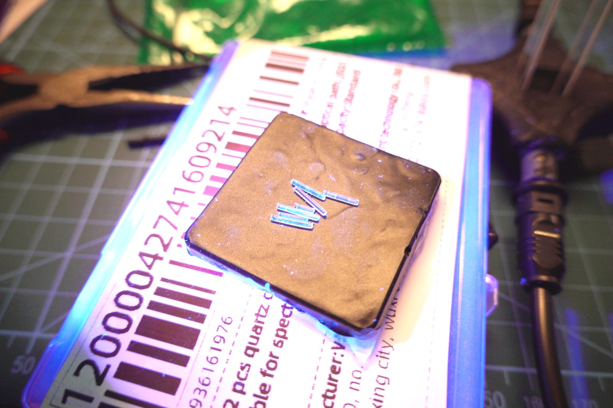
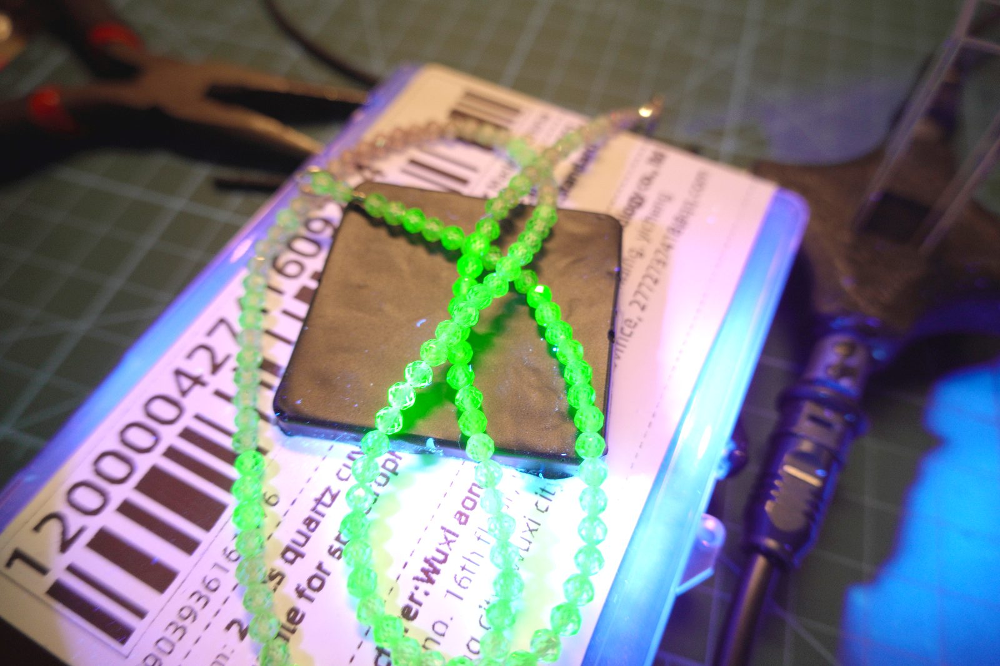
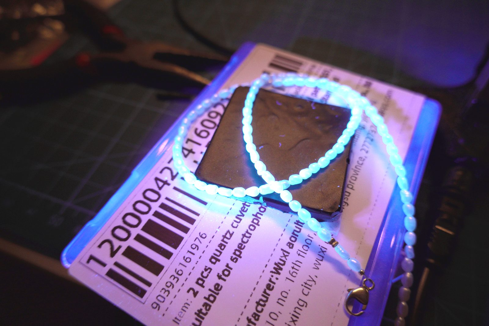
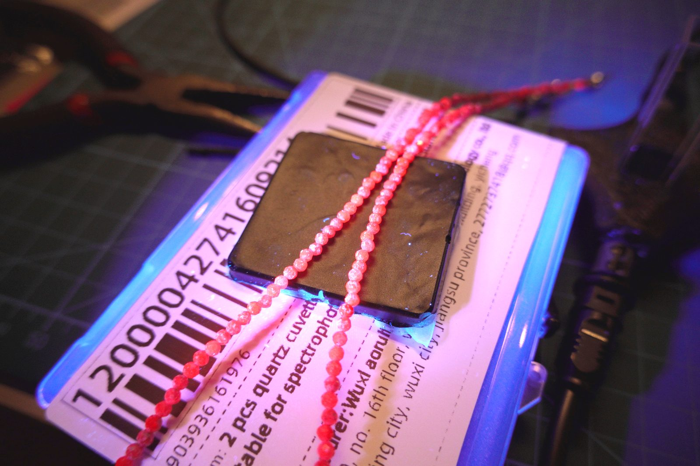
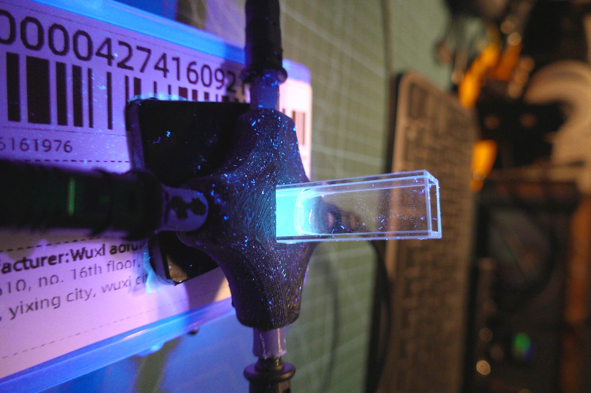
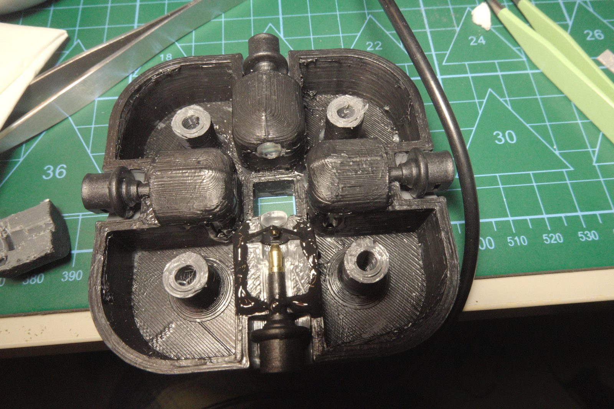
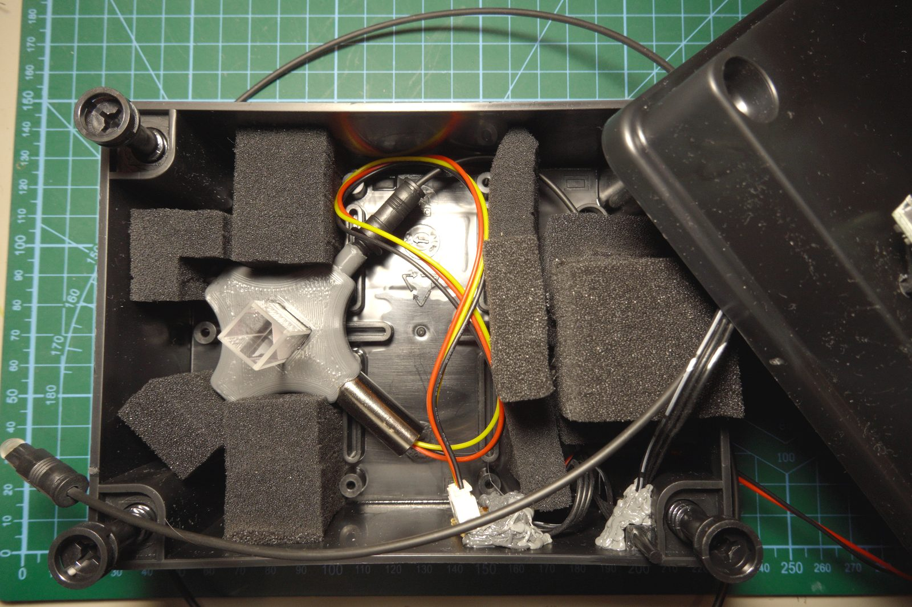
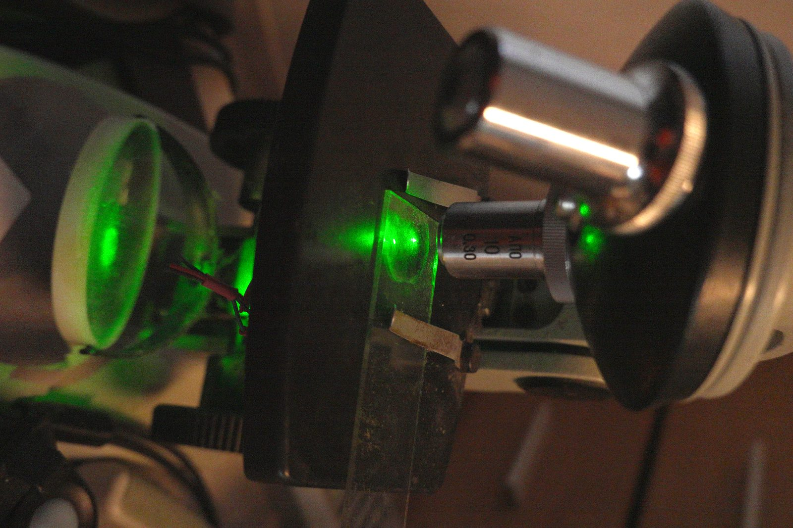

With the spectrometer alignment sorted and PySpectrometer3 taking shape, the obvious next experiment was UV fluorescence. Minerals, biological samples, gemstones — a lot of interesting chemistry shows up as emission spectra under UV excitation that you'd never see under white light. The setup is conceptually simple: illuminate the sample with UV, block the excitation from reaching the spectrometer, collect the fluorescence emission.

In practice the first problem appeared before I even built anything.

## TOSLINK fluoresces

I've been routing light from sources to samples via TOSLINK plastic optical fiber — it's cheap, has a standardized 1mm aperture, and the connectors are everywhere. The plan was to use the same fiber for UV excitation delivery.

Quick test first: take a handful of TOSLINK fiber cuts, put them under the UV lamp, see if they transmit cleanly.

They glow. Not faintly — visibly, unmistakably. The PMMA (polymethyl methacrylate) plastic that TOSLINK fiber is made from fluoresces under UV excitation, emitting in the blue-green region (~440–520nm). The very wavelengths a fluorescence experiment needs to measure clearly.

This is a fundamental material property, not a brand issue. All PMMA fiber will do this. The fiber itself becomes a broadband background emitter, and any fluorescence signal from the sample is riding on top of fiber-generated noise across the entire visible range.

TOSLINK is out as a UV excitation carrier. It works fine for visible-range transmission spectroscopy where the source wavelength is above ~450nm, but for anything involving UV excitation and visible emission collection, it contaminates the measurement.

There's a subtler version of the same problem. Even with a UV-cut longpass filter on the collection port, if there's a UV laser inside an enclosed box illuminating a sample directly, UV scatters off every surface — including the fiber body. The filter blocks UV from entering the fiber end, but the fiber jacket picks up excitation photons through the cladding. The PMMA re-emits across the visible. The filter doesn't help with that.

The only real fix is silica fiber, which doesn't have this problem. That's where this ends up — but not yet.

## What actually glows

With that sorted, the immediate experiment was qualitative: what fluoresces, and what color?

The short answer: more than you'd expect.

These plastic beads emit a strong vivid green. The dye is almost certainly a UV-reactive fluorescent polymer additive — the kind used deliberately in costume jewelry for black-light effects. Emission is so intense the beads look like they're self-illuminating.

A different bead necklace — softer blue-white emission. The beads have a milky translucent appearance in daylight. Under UV they emit broad-spectrum blue-white, consistent with the kind of fluorescence you see in certain glass types or synthetic opalite. Cooler and more diffuse than the green bead emission.

Red/pink beads with a warm orange-red emission. The emission color differs from the apparent daylight color — under white light these are red, under UV they fluoresce orange-red with a slightly different peak. The emission is less intense than the green beads, but clearly separate from the excitation.

None of these are scientifically interesting as samples — they're doped plastics engineered to fluoresce — but they're useful for checking that the setup works and that the different emission colors are distinguishable.

The more interesting sample:

Riboflavin (vitamin B₂) dissolved in water fluoresces strongly in the blue-green region under UV excitation — peak emission around 520nm with broad shoulders. The glow in the cuvette is cyan rather than the green you might expect because the camera's white balance is pulling toward the UV lamp's purple-blue ambient. Under the spectrometer this would show up as a clean emission band.

## The cuvette holder

Putting samples under a handheld UV lamp and photographing them is informative but not spectroscopy. What's needed is controlled coupling: UV in through one port, sample in the center, fluorescence emission out through another port, with the UV excitation blocked from reaching the collection fiber.

The holder is 3D-printed with four ports arranged symmetrically around a central cuvette aperture. Each port takes a TOSLINK connector directly. The geometry gives four independent channels: two for excitation/reference, two for collection — or in practice, one excitation input, one primary collection output, and the remaining two for filter insertion or secondary reference collection.

Each port has a short collimating tube molded in. Collimation with TOSLINK is forgiving: the 1mm fiber aperture accepts a reasonable cone angle without needing precision alignment. A sheet of paper as an alignment guide gets the fiber close enough for TOSLINK — the 1mm aperture is large enough that small angular errors don't kill throughput.

This is not true for small-core fiber. I tried the same 3D-print approach with 50µm multimode fiber: the alignment tolerance at that scale is tighter than a 3D printer can reliably produce. The coupling efficiency was terrible and not recoverable by hand-tweaking the mounts. TOSLINK's thick core is genuinely useful here — the whole setup becomes mechanically tolerant in a way that wouldn't work with laboratory fiber.

A small brass column in the center holds the cuvette. Standard 10mm × 45mm quartz cuvettes fit directly; the holder keeps the optical path centered on the cuvette's mid-height.

## The box

UV fluorescence experiments need the dark for the obvious reason — ambient light swamps the weak emission signal. But the box also exists for a second reason: the excitation sources aren't LEDs.

The setup uses two lasers: a UV laser for fluorescence excitation, and a 785nm NIR diode for Raman experiments. Both are direct-beam sources pointed at the sample, which means they need to be enclosed. The foam-lined box provides the dark environment, keeps the laser inside it, and makes the whole thing repeatable — same alignment every measurement.

The enclosure is a standard ABS project box with custom-cut black foam padding that holds the cuvette holder assembly rigidly in place. Inside: the UV laser and NIR laser mounts, the cuvette holder positioned at the convergence point, and wiring for the laser drivers. Fiber cables exit through the box sides via TOSLINK connectors in the box walls.

The foam cutouts matter: everything stays in position when the lid goes on. The cuvette can be swapped without realigning the fiber ports, which is the whole point of a standardized holder geometry.

One safety detail worth noting: the laser is activated via a touch button on the outside, but the activation circuit is gated by a mechanical interlock switch inside the box that only closes when the lid is firmly shut. Touch the button with the lid open — nothing happens. The interlock is purely mechanical, no firmware involved. It's the kind of thing that seems over-engineered until you've pointed a UV laser at your own retina by accident.

A TOSLINK switcher on the input side allows switching between measurement modes without opening the box:

- **Transmission**: UV source on one side, collection on the opposite side, direct transmission through the sample
- **Scattering**: 90° collection geometry, collection fiber at right angles to excitation
- **Fluorescence with UV cut filter**: excitation in, longpass filter on the collection port to block any scattered UV, collect only the Stokes-shifted emission

The switcher is a simple mechanical fiber switch — TOSLINK connectors on a rotating selector. No electronics, no software. Crude but reliable.

## What this setup actually measures

The output of the collection fiber goes to the jewel spectroscope + OV9281 camera described in the previous posts. With PySpectrometer3 running in measurement mode, a fluorescence spectrum from the riboflavin solution takes about 10 seconds: set up the sample, switch to fluorescence mode, trigger acquisition, get a wavelength-calibrated emission spectrum.

The UV fluorescence side works, with caveats. The TOSLINK cladding pickup problem described above means the measurement has a PMMA fluorescence background whenever the UV laser is on inside the box. Manageable for bright emitters like riboflavin; a real problem for weak fluorophores or mineral samples where the emission might be comparable in intensity to the fiber background.

### The 785nm problem

The 785nm NIR laser was supposed to enable Raman spectroscopy. Raman scattering is inelastic — the backscattered light is Stokes-shifted to longer wavelengths. At 785nm excitation, Raman peaks for typical organic compounds land at roughly 800–950nm.

Two things killed this immediately.

First: the IR cut filter. As described in [the previous post](../mini-spectrometer-grating/), there's an IR cut filter somewhere in the optical chain — cliff edge around 700–720nm, then nothing. The entire Raman spectrum at 785nm excitation sits beyond that cutoff. The spectrometer simply cannot see it.

Second: TOSLINK itself doesn't transmit NIR. PMMA has an intrinsic absorption edge — C-H overtone vibrations create strong absorption bands above ~700nm. I measured several cable lengths and found significant, length-dependent attenuation above 800nm. The longer the cable, the worse it gets. Even if the IR filter weren't there, any 785nm-excited Raman photons would be progressively swallowed by the collection fiber before reaching the spectrometer.

Both problems point at the same root cause: PMMA has the wrong transmission window for anything above ~700nm. It's not a design flaw in TOSLINK — TOSLINK is specified for 660nm links, and it does that well. The problem is trying to push it into NIR spectroscopy, where it was never intended to go.

The setup isn't publishing-quality for UV fluorescence either — the cuvette holder geometry isn't optimized for solid angle, the laser spectrum isn't calibrated, and the sensitivity correction assumes visible illumination. But it's functional enough to identify which samples fluoresce, characterize emission color and rough peak position, and distinguish overlapping emission bands in mixtures.

## What's next

This first version works but it's cramped and hard to reconfigure. The TOSLINK limitations — fluorescence under UV, NIR attenuation above 700nm — make it unsuitable for the next experiments. A second modular version is in progress using silica fiber, which solves both problems at the cost of much tighter alignment tolerances.

And there's a different kind of coupling problem that showed up while working on the fiber alignment question. A 200µm multimode fiber, an old microscope, a 532nm laser, and a crude 3D-printed backscattering coupler:

That's for the next post.
