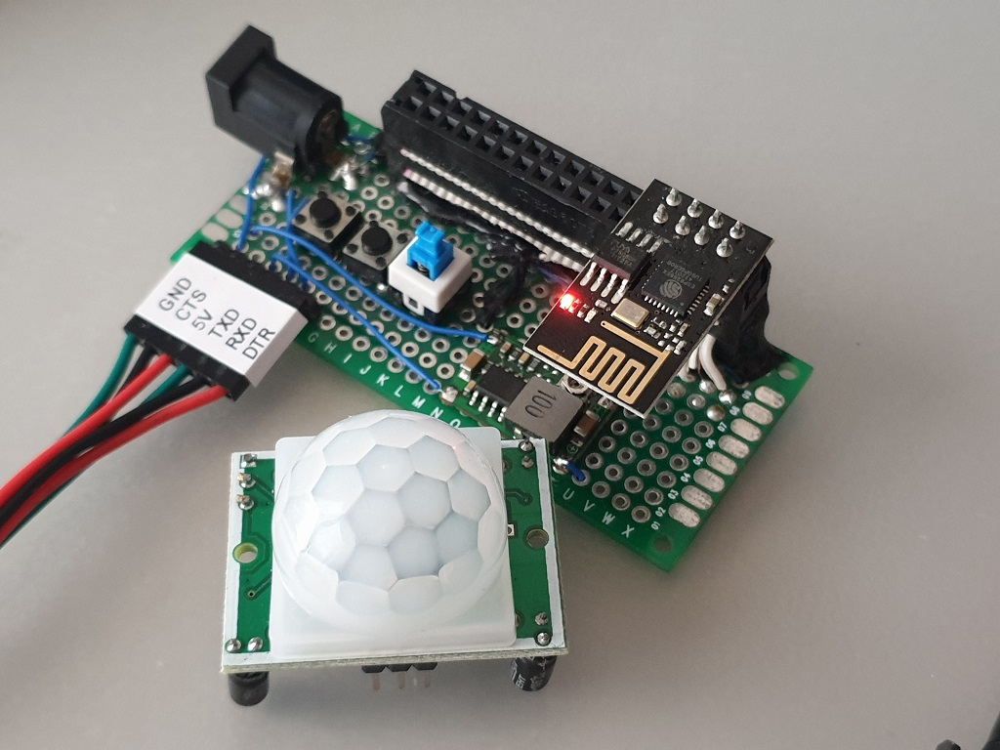
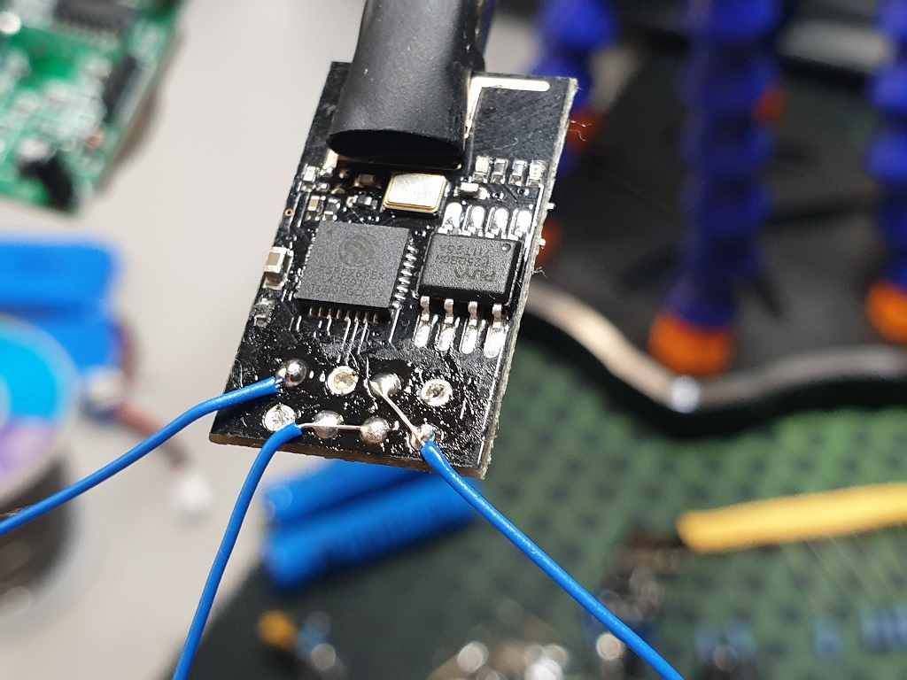
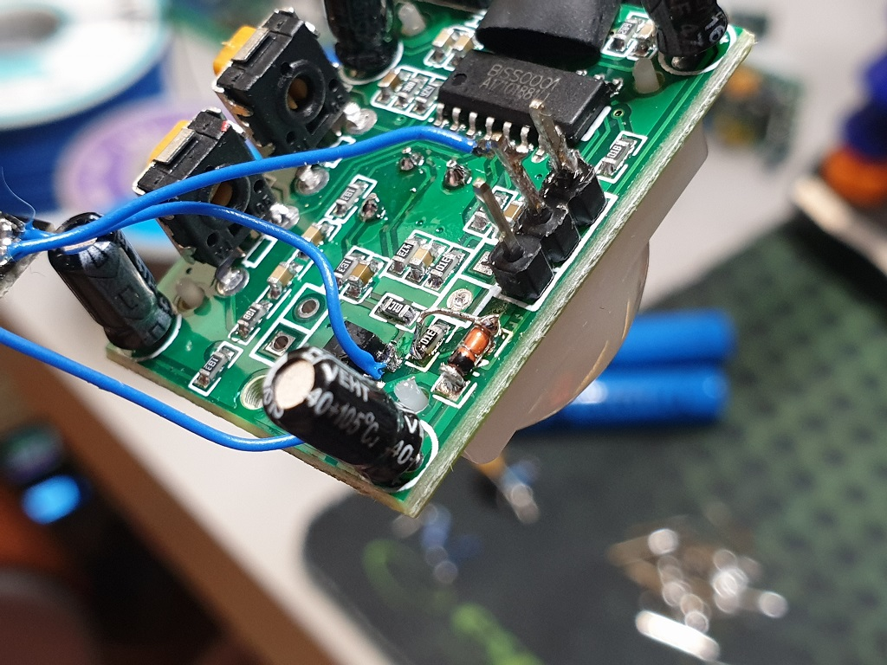
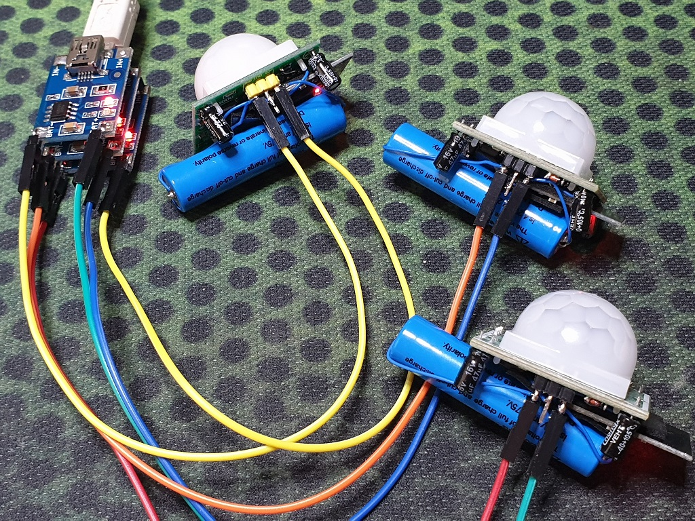

My son has a cat. And I've become very curious about the cat's feeding and toilet habits. Mainly I'm interested in how long does it take him to go to the toilet after eating as I've noticed a pattern: At first he goes to the kitchen, eats and then runs around the house wrecking havoc for some time and then goes to the toilet. So I'm curious whether this is his usual routine and moreover how many times during the day and night does he need to use his toilet. I might even build a collar for him to track the magnitude of his movements in the future :)

In order to accomplish this task at first I was thinking about using RFID tags that I have plenty. But that is rather crude... Then I remembered, that I have a couple of PIR motion sensors collecting dust. So I decided to clean that dust away, and go for a more interesting approach. So the idea is this: build a smart motion sensor, that would connect to the internet once the motion is detected and post some message somewhere. I would then gather those messages along with timestamps and analyze the data in some way later. It seemed that PIR sensor and ESP-1 module had the best chance of perfect partnership.

# Programming


I decided to use MQTT broker that I have already setup on some free service, so that I could get notifications of motion events at my phone. I was using PubSubClient Arduino Library for MQTT in my other projects, but this time I decided to try MQTT Arduino Library. Although I was considering building my own library, because neither of those two support additional data passing to message callbacks. But that's a story for another time. I'm glad that I didn't go that route, because I wouldn't be able to finish this project in half a day :)

So, The program itself is very simple - when ESP boots up, it connects to WiFi, then to MQTT broker, publish a message to "motion" topic with payload as ESP MAC address and then go to sleep indefinitely. Basicaly the whole code looks like this:

```
<pre>the code <br />bla <br />bla</pre>
```

You can find this code in this [github repository](https://github.com/foxis/ESPSmartPIR). Just keep in mind, that I'll be developing it further(Like adding web interface for configuration, OTA, etc.), thus it'll get more complicated.

Anyway, I flashed the code to an ESP-1 module using my custom programmer and started to experiment with how to make the PIR sensor interface with the ESP. The requirement was, that the ESP would be permanently in deep sleep mode until there was motion detected.

At first I tried to build a simple circuit consisting of NPN transistor, a couple of resistors and a capacitor to trigger RST pin of the ESP, but that was very unreliable, and, honestly, ugly. After several variants of the trigger circuit I came up with the following idea: What if the ESP is disabled altogether until the motion is detected ?

After first try it appeared to be working really well! Basically what I did, was connecting RST and EN pins together on the ESP, and connect those pins to the OUT of the PIR sensor. Also I've connected GPIO0 to VCC for good measure. Then I adjusted the ON time on the PIR sensor to about 10-20 seconds, since the ESP need at most 5 seconds to connect to WiFi and send MQTT message. That works, because normally the output of the PIR sensor is low, and it goes high when it detects motion. This high signal is enough to enable and boot the ESP chip. The signal should be high long enough for the ESP to finish publishing the message to MQTT. Luckily the PIR motion sensor I have has a potentiometer that allows to configure not only sensitivity, but the trigger timeout.



I desoldered the header pins from ESP-1 module so it would take much less space. Then the PIR sensor had to be modified a little bit. As you may know, the PIR sensor board has an inbuilt voltage regulator. That had to go, but I didn't want to mess with the board itself. Therefore what I did was solder a little jumper over a reverse protection diode and the regulator like so:



And that is basically it! Just connect a LiPo or LiIon battery and the Smart PIR sensor is ready! I've built three of these - two for the cat, and one for my roommate to check how often she goes to the balcony for a smoke despite a prominent NO SMOKING sign on the door :)



Additionally I wrapped the boards in shrink tubes cutting out windows for the pins and the sensor lens, stuck some double-sided tape and places the sensors at strategic locations :)

