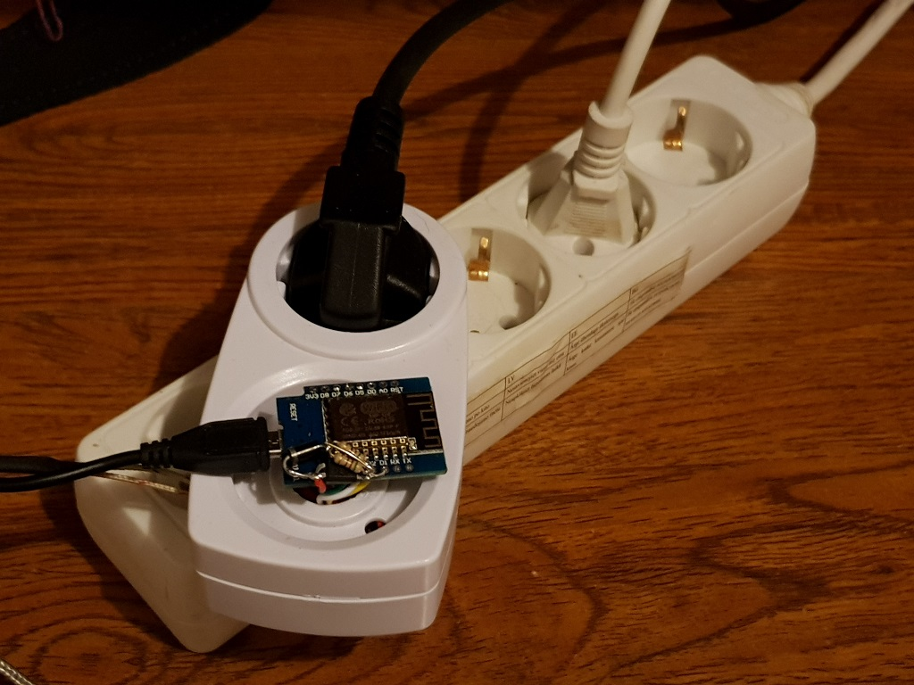
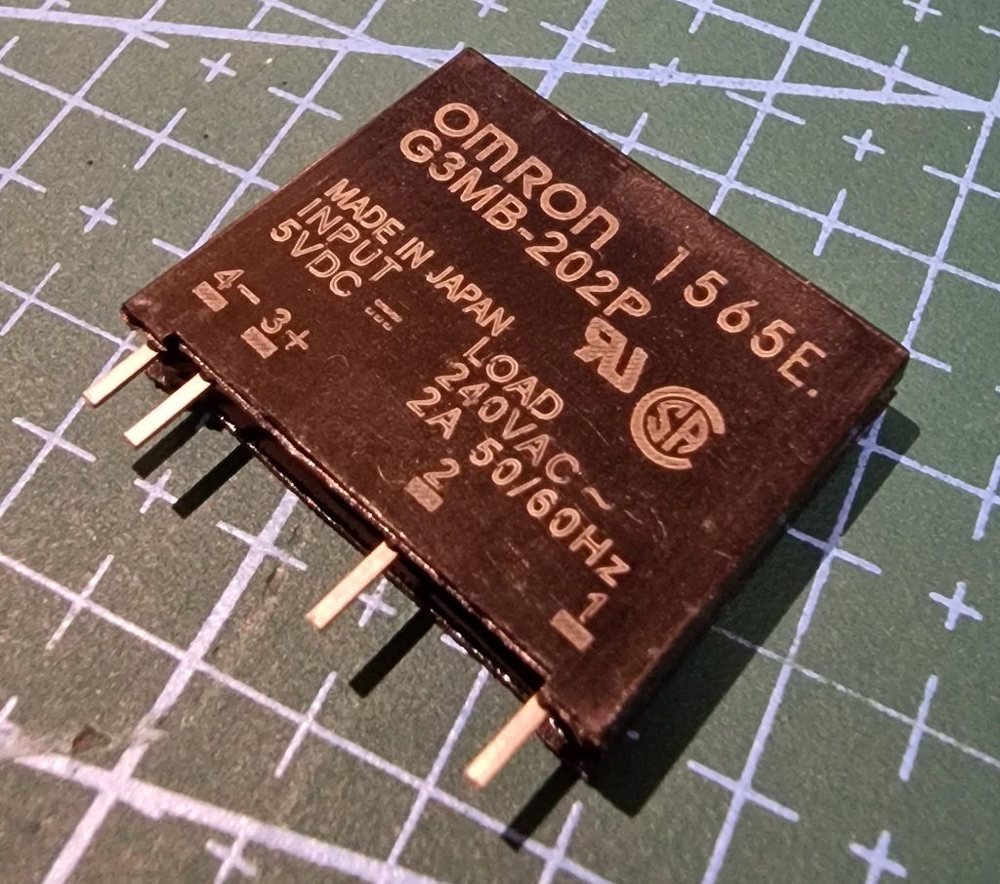
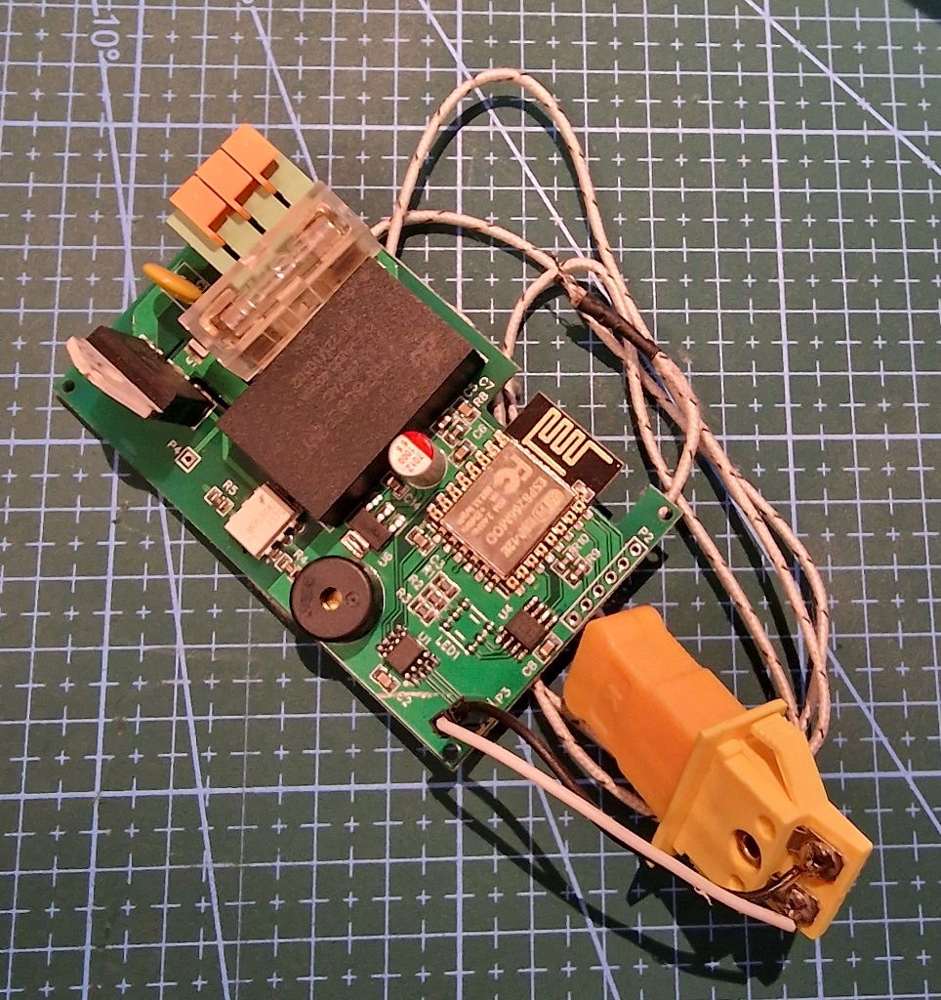
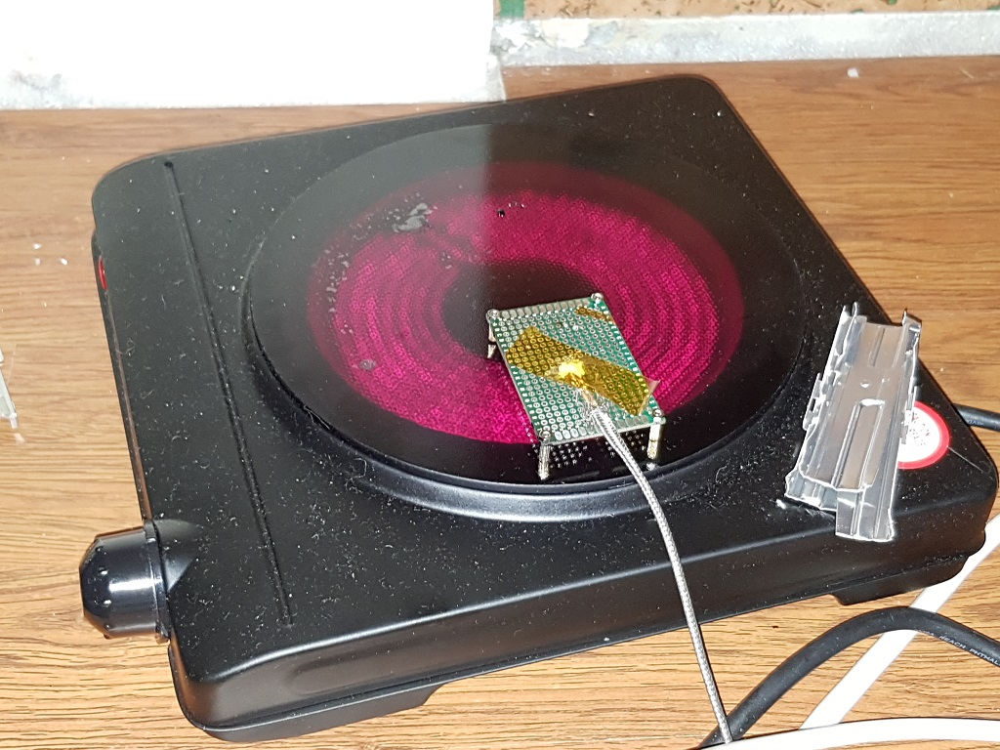
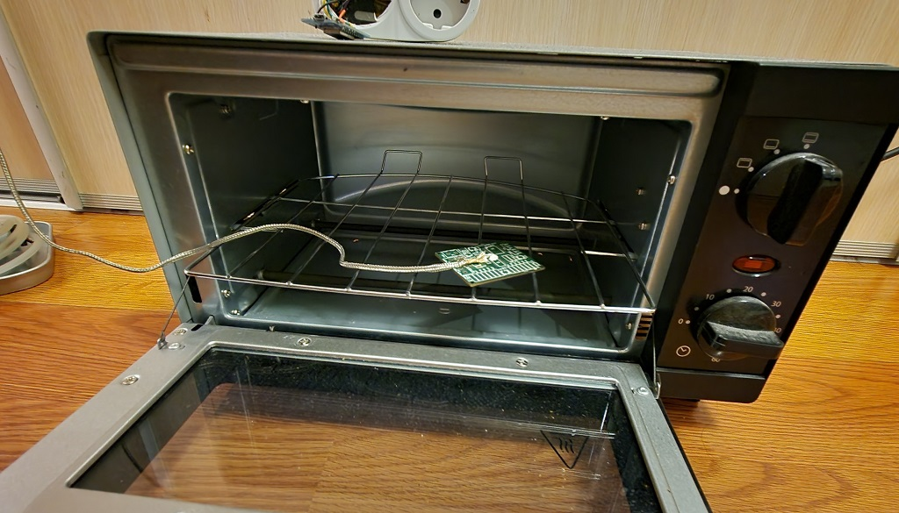

> **!!! WARNING: This project deals with mains power and high current !!!**
> Please be careful if you wish to replicate any of its functionality and never work on a PCB or any open wires that are connected to the mains !
> Author has no responsibility for your safety and wellbeing, so please take care of yourself.


# How it works
The purpose of this project is to control a heater of any sort to facilitate SMT reflow soldering utilizing a predefined temperature profile. Control of the heater is performed by ESP8266 or ESP32 chip via Web UI over WiFi.

To achieve that, readings from a thermocouple are used for closed loop temperature control of the target board. The controller does it's best to follow a preconfigured temperature profile for a particular SMT soldering. Of course the accuracy of the temperature profile achieved is heavily dependant on the thermal properties of the heating element, environment, the boards, etc. The controller tries to compensate for that by the means of a PID controller which has to be tuned to a particular setup.

## Prototype Hardware

At first I put everything into an old smart socket like so:



I quickly found that the relay introduces too many spikes into the mains by switching a high power inductive load in the middle of the cycle... I mean, the LCD monitor was flickering like crazy
and my audio amplifier was restarting randomly. That's when I found a few of these guys(SSR - a Solid State Relay) that have zero-crossing detection built in:



I simply connected them in parallel and had no more issues with EMI whatsoever. One of these is rated for about 2A, however, they rarely sustain that kind of power for a long period. So, three of them happened to be pretty happy with 2kW load I subjected them to - barely even warm even inside that tight space.
After I was satisfied with how everything works firmware-wise, I designed the following board:



* Some generic mechanical timer enclosure is used for the plug, socket and, well, enclosure.
* max6675 is used for interfacing with a thermocouple.
* Generic optopair is used for controlling a 10A relay (for the prototype).
* Weemos D1 mini is used for the brains.
* Some cheap 1200W IR Hotplate is used for the load
* a peace of prototype board is used for dummy board

## Schematics


EasyEDA project page: https://easyeda.com/andrius.mikonis/ESPReflow-f4c523157afa47758e46728248cdb19b

## Assigned pins

```
#define thermoDO 13 // D7
#define thermoCS 12 // D6
#define thermoCLK 14 // D5
#define relay 4 // D2
```

## Building
### Angular Frontend

Angular front end source is in `web-src-angular` folder and should be built using nodejs. After binaries are built,
they should be gzipped and copied into `data/web` folder before uploading.

### Backend

Backend is implemented using Arduino SDK and built using PlatformIO. Before building, please copy `src/sample_wificonfig.h`
to `src/wificonfig.h` and add default Wireless Network configuration. You will be able to edit this configuration via Web interface later.

## Modes of operation
### Reflow

In this mode the controller will perform reflow algorithm following selected reflow profile.
Controller will turn off the mode once the temperature reaches safe values after the profile is completed.

### Calibrate

In this mode a selected calibration algorithm will be used to find optimal PID controller parameters.
Controller will turn off the mode once the temperature reaches safe values after the calibration is completed.

### Keep Target

In this mode the controller will reach and maintain target temperature. Useful to check PID configuration. `default` PID configuration will be used in this mode.

# Flashing

There are two ways to flash the controller - via serial or via OTA.

## Serial

Find `RX/TX/GND` pins on the board, connect your serial adapter and flash either Arduino, PlatformIO or whatever flasher you like.
**NOTE: `RX/TX` pins are NOT 5V tolerant. Please use 3.3V serial adapter or level shifter from 5V**

## OTA

When the controller is first turned on it creates an AP with the name `ESPReflow` and the ip address `192.168.4.1`. Connect to the controller, wait until the page loads and go to `Setup`, enter WiFi SSID and credentials. Save the configuration and reboot.
After this is done it will connect to the specified WiFi AP and will register it's own domain as `ReflowControl.local`.
Tuning and operation of the controller can then be done.

## OTA HTTP upload

You can upload a firmware binary using `Setup` - just upload the new firmware on the WebUI.

# Usage

## Connect your hotplate/oven

One tip, though - instead of simply throwing the temperature probe into the oven or onto the heatplate, you should choose a PCB that is approximately the same size and the same number of layers
as a reference PCB and mount the probe to this PCB. Also, place this PCB in the approximately the same place/way as the PCB you are soldering.

That way you will achieve the best calibration as well as temperature profile.

### IR Hot plate


NOTE: It is best to leave a little bit of space between the hotplace and the PCB. This is due to the nature of heating - it is done by IR waves instead of direct heat transfer.
I had little success calibrating the controller, when the PCB and the reference PCB was directly on the hotplate.

### Oven


## K-type thermal probe

Thermocouple must be placed on a dummy board, that would approximately resemble the target boards. For best results that board must be placed in a similar matter as the target board. Furthermore, since hotplates do not heat evenly(even some ovens), care must be taken to allow dummy board be heated the same way as the target board(i.e. it must be placed approximately the same distance and orientation as the target board in respect to the heating elements). Otherwise you may burn the target board.

## PID tuning

PID tuning must be done for every heating device individually. You can do it by trial and error, or ESPReflow can do it for you. There are several auto tuning algorithms available (a slightly modified [PID-aTune library fork](https://github.com/t0mpr1c3/Arduino-PID-AutoTune-Library)):

*		ZIEGLER_NICHOLS_PI
*		ZIEGLER_NICHOLS_PID
*		TYREUS_LUYBEN_PI
*		TYREUS_LUYBEN_PID
*		CIANCONE_MARLIN_PI
*		CIANCONE_MARLIN_PID
*		AMIGOF_PI
*		PESSEN_INTEGRAL_PID
*		SOME_OVERSHOOT_PID
*		NO_OVERSHOOT_PID"

## Reflow profile

# Problem Solving

## Unable to properly tune IR Hot plate

During development a cheap IR hot plate was used. I found that if you place your temperature probe and the boards on the hot plate itself it would be very hard to control the temperature of the board properly. So, I used aluminium raisers, that raise the board around 5-10mm from the hot plate so that IR radiation would heat the boards instead of the glass plate.


The code can be found in this [repository](https://github.com/itohio/ESPReflow).