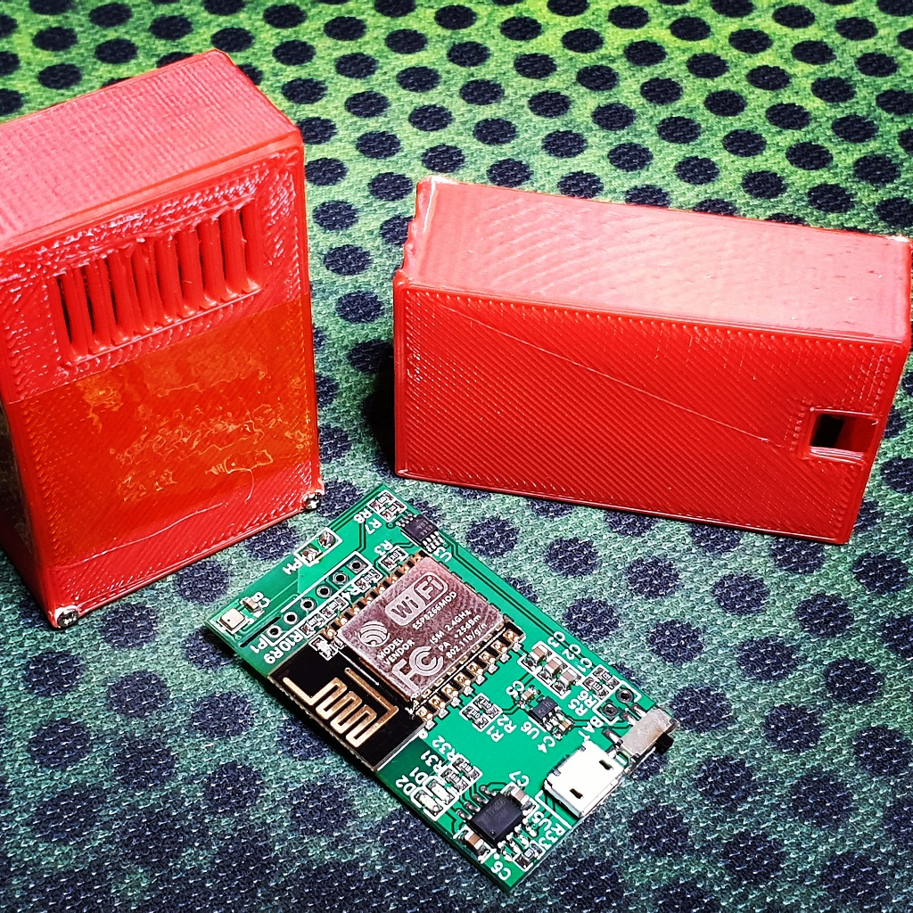
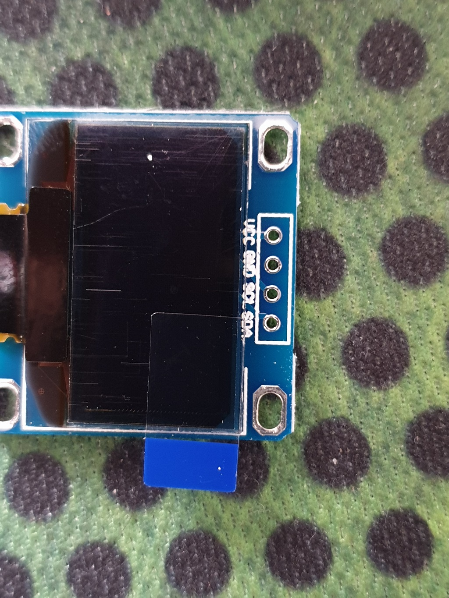
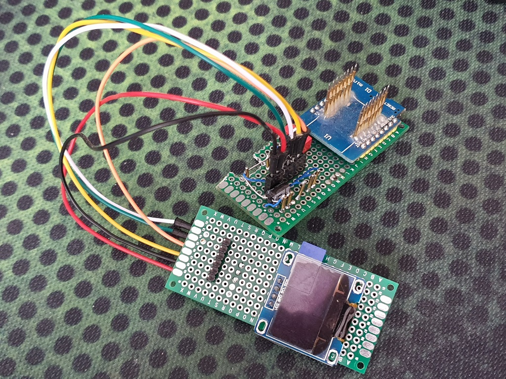

In a [previous post](/blog/building-esp8266-weather-station-part-i/)  I've described how to build a Weather Station based on ESP8266 chip and various breakout boards you can buy e.g. on Aliexpress. In this post, however I'll share with you how I built a standalone PCB boards containing all the required components.
To recap - this is a ESP8266 based Weather Station, that measures surrounding air temperature, humidity, pressure along with light and battery voltage. Connects to an MQTT broker and reports it's data there. There are three variants: bare board with no display, which can be connected to a lipo battery, solar panel and sit somewhere with plenty of sunlight for ages, or it can have either an ePaper display or 0.96" OLED display and sit on your desk.

My main motivation for this project was to build a network of sensors scattered around my house and city so that I could  monitor the  weather myself.
One of the use cases   involved a two room biology museum where people were concerned about air temperature and humidity, where I used two headless boards enclosed in 3D printed case and simple python MQTT client to gather all the data in a spreadsheet for further analysis.



OpenSCAD models for the cases as well as the firmware code are in the [git repository](https://github.com/itohio/ESPWeather).

# Designing circuit board
I decided to have three variants of the Weather Station: headless, with OLED  or ePaper displays. Headless can be flashed into OLED or ePaper board.
All the designs were done using  [EasyEDA](https://easyeda.com) software, all the parts and PCBs were ordered using their services.  

## Scematics


The schematics contains all the support components for ESP8266, LiPo/LiIon battery charger based on TP4056. Everything is being powered by low drop out voltage regulator  RT9013-33GB.
BME280 is connected to pins that usually serve as a Serial port. However in order to fit ePaper I run out of pins.  The sensor doesn't mind the initial bootup messages, that ESP spills into that port.
Light sensor and measurement of battery voltage is implemented using  MAX4544EUA+T analog switch. Battery voltage is read out using R5/R6 voltage divider and light sensor using R7 and R8. GPIO5 is used for changing sensitivity.
Basically there are two ranges for the light sensor due to limited ADC resolution and high dynamic range of the photo resistor used as a light sensor. So when there is little light GPIO5 is in High Z state(configured as input), and if there is a lot of light detected by the photo resistor, GPIO5 pin is driven LOW, so that R7 and R8 are connected in parallel.

## PCB
I tried to make the boards as small as possible keeping in mind ESP PCB antenna requirements and trying to minimize ESP heat influence on the BME sensor. Thus I made some cutouts on the pcb board and made as long traces to the chip as possible.
I ordered the PCBs along with stencils from JLCPCB and soldered them using my [ESPReflow](https://github.com/itohio/ESPReflow) project which I will disclose later some time :)

## Headless/OLED


You can run this board without an OLED. And if you wish to connect one, make sure your OLED screen has the following pinout:



Some variants on the market have VCC and GND pins reversed.
On some boards I have missed pin descriptions for the OLED pins. Here they are (from top to bottom. square pad is VCC):

- RST
- GPIO0
- TXD (SDA)
- RXD (SCL)
- GND
- VCC

## ePaper


This board includes connectors for both OLED and ePaper, which is WaveShare 2.13" ePaper HAT. The firmware assumes a RED+BLACK+WHITE variant. Like this:


One feature that ePaper variant has is the ability to listen for other stations and display them all on the screen. Also it is a really low power solution that lasts for a couple of months on a single 600mAh battery :)

# Building the firmware
For development I use Atom IDE with installed PlatformIO. If you don't have this setup, then you can refer to a post where I describe  [how to install Atom and PlatformIO](/blog/developing-with-atom-ide-and-platformio/).

First you need to obtain the latest sources:

```
git clone https://github.com/itohio/ESPWeather
```

Then open ESPWeather project with Atom  to build it. Alternatively, if you wish to work on the code and add features yourself, feel free to fork the repo and use it instead of the original one.
Before building it, you should copy  `sample_wificonfig.h`  file into  `wificonfig.h`  and edit WIFI as well as MQTT config values:

```
// Setup Wifi networks
#define WIFI_SSID "*ssid*"
#define WIFI_PASSWORD "*passwd*"
#define MQTT_ID "*mqtt-user*"
#define MQTT_PASSW "*mqtt-passw*"
#define MQTT_PORT *16769*
#define MQTT_URL "*m23.cloudmqtt.com*"
```

Second thing is to define proper variant defines which should be done in  `platformio.ini`  file. There you can find already predefined variants. You can either use one of them, or create your own. If you are using OTA, then you are gonna need to set proper ip address. Otherwise if you are flashing using USB to Serial converter platformio may detect the COM port for you. Just comment out  `upload_port`  variable.
You have two options on how to upload the firmware to your board: Either use OTA or connect GND/RX/TX/RST pins to the board using your favorite ESP8266 programmer. Note that your programmer(or USB to Serial converter) must be set to use 3.3V signals, otherwise you may kill the board.

## Note about PUYA
Some ESP-12 modules have a weird flash chip which causes errors with writing data to SPIFFS partition. That means, that you can flash SPIFFS data, you can read it in the code, but if you try to write to any file on that partition - the whole partition will be corrupted. This is known as PUYA issue. If you happen to have the ESP-12 with this troublesome flash chip, you should set  `build_flags = -D define PUYA_ISSUE`  in the  `platformio.ini`  file for the variant you are building.  
Unfortunately until PUYA issue is fixed in the ESP firmware,  SPIFFS will not be available and in turn UI interface is useless since you cannot save any configs to the SPIFFS partition.

## Upload using OTA
You can flash the board using OTA if it is connected to your WIFI network and you know it's IP address. Simply put it into `platformio.ini` file, power-cycle the board and click upload.
OTA flashing is only available after the power-cycle, since it will stay awake for at least 1 minute before going to sleep and normal operation.
Note: Keep track of the firmware size. The firmware size must be below half of the free flash memory(not used by SPIFFS), since the bootloader has to keep two versions of the firmware at the same time during flashing.

## Upload using a programmer
I have built a simple programmer along with an OLED display to develop the firmware and flash production firmware. It is basically based on a Weemos development board with ESP-12 module desoldered and attached to a breadboard with headers and OLED display using some jumper cables like so:

I simply stick the ESPWeather board onto the pins and click "Upload" in Atom IDE :)
You can use a different setup, just that I find this quite comfortable to work on my boards before I solder OLED screens. Previously I was using POGO pins and connected them directly to the soldered ESP-12 module which I find not only uncomfortable, but also unreliable.
In the future I am planning on designing a programming rig using 3D printed parts and specifically designed programmer for that purpose.
Just note, that for programming GPIO0 pin should be low. You may need to power cycle the device and/or reset it a couple of times to be able to flash it.

## Setting up  configuration using Web interface
By default I flash the boards with UI enabled.
When you first power up the board, ESP will go into AP mode with AP Name "ESPWeather". You can connect to this AP and connect to 192.168.4.1 IP address.
There you will be greeted with a welcome message and a configuration form, where you can input  Host Name for the Weather Station(it will be used as AP name once  you power it up again), WIFI connection details and MQTT details. You will also be able to see telemetry data in real time.
UI will only be activated after a power cycle, meaning every time you power up the board, and  the board will go into deep sleep after 5 minutes if no connection to the web server was made. This mode will not activate after the board wakes up from deep sleep, so you don't need to worry about somebody connecting to your Weather Station and changing/retrieving any settings.
Note:  UI interface  is only available if you build your firmware with  `ESP_WEATHER_VARIANT_UI`  defined.

# Links
- Schematics:  [Easyeda Project](https://easyeda.com/account/project?project=7eab5122a6f84e15a6e2534b3213e768)
- Sources:  [Github](https://github.com/itohio/ESPWeather)
- Tindie: [Store](https://www.tindie.com/stores/FoxIS)