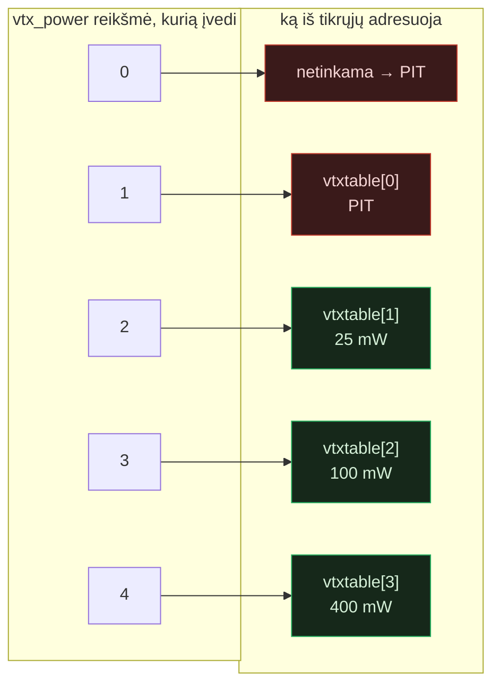

Kiekvienas programuotojas išmoksta skaičiuoti nuo nulio. Betaflight pritaria: AUX kanalai skaičiuojami nuo 0, tad AUX1 yra `0`, o AUX6 yra `5`. Surink kelias CLI eilutes ir pirštai nustoja apie tai galvoti. Skaičiuok nuo nulio. Tai taisyklė, ant kurios, atrodo, laikosi visas konfigūratorius.

Tada visą vakarą praradau su VTX'u, kuris kategoriškai atsisakė duoti 400 mW, ir radau tą vieną lauką, kur Betaflight tyliai skaičiuoja nuo *vieneto*. Niekas neįspėja. Gedimas atrodė kaip miręs VTX, o ne kaip rašybos klaida — būtent todėl jis ir surijo visą vakarą.

---

## Simptomas

Konstrukcija: 2 colių analoginis „ripper" ant **SUB250F411** su **Betaflight 4.5.4** ir **Emax TH3 V02** VTX (25 / 100 / 400 mW) per SmartAudio, aparatinis UART2. Norėjau galios ant sukamojo ratuko — **AUX6** valdymo pulte — kad galėčiau pasukti išvestį aukštyn nuotoliui ir atgal žemyn artimam skrydžiui neįlįsdamas į meniu.

Vietoj to gavau:

- Kiekviena ratuko padėtis duodavo galią **vienu lygiu žemesnę** nei sukonfigūravau.
- **400 mW buvo nepasiekiami.** Jokia ratuko padėtis per visą jo eigą jų neišrinkdavo.
- Ratuko kraštuose VTX nukrisdavo į tai, kas atrodė kaip **pit režimas** — beveik nulinė išvestis, klasikinis „kodėl draugas ant stalo nemato mano vaizdo" simptomas.

Pirma atlikau įprastą aparatinės įrangos „raganų medžioklę". Perrašiau SmartAudio nustatymus. Po lupa patikrinau UART2 litavimo taškus. Perkėliau VTX ant žinomai gero SmartAudio kanalo. Tarp kiekvieno pakeitimo išjungiau ir įjungiau maitinimą. Niekas nepajudėjo. Pats VTX visą laiką buvo tvarkingas — jis darė būtent tai, ką jam liepiau. Aš tiesiog nesuvokiau, ką jam liepiau.

---

## Spąstai

Štai `vtx` komandos formatas:

```
vtx <index> <aux_channel> <vtx_band> <vtx_channel> <vtx_power> <start_range> <end_range>
```

Du iš šių laukų naudoja **priešingas indeksavimo konvencijas**, ir niekas nei dokumentacijoje, nei `help vtx` išvestyje to nepasako:

| Laukas | Konvencija | Pavyzdys |
|--------|-----------|----------|
| `aux_channel` | **skaičiuojama nuo 0** | AUX6 → `5` |
| `vtx_power` | **skaičiuojama nuo 1** | pirmas vtxtable įrašas → `1` |

Perskaityk tai dar kartą, nes tame ir slypi visas straipsnis. *Vienoje komandoje* 2-as laukas skaičiuojamas nuo nulio, o 5-as — nuo vieneto. Jei perkeli „viskas nuo nulio" taisyklę per visą eilutę — o tai ir yra natūralu — kiekviena tavo įrašyta galios reikšmė nusėda vienu lizdu per žemai.

`vtx_power` yra indeksas į tavo `vtxtable`, ir tas indeksas prasideda nuo **1**:



Atvaizdavimas toks: `vtx_power = N` išrenka `vtxtable[N-1]`. Reikšmė `0` nėra „pirmas įrašas" — ji už diapazono ribų, o už ribų reiškia pit. Reikšmė `1` *yra* tinkama, bet standartinėje Emax tipo lentelėje `vtxtable[0]` yra **PIT** įrašas. Taigi dvi žemiausios reikšmės, kurias „natūraliai" pasiekiau, abi reiškė pit, o tikras 400 mW lizdas ties `vtxtable[3]` reikalavo `4`, kurio niekada neįvedžiau.

---

## `vtxtable`, į kurią jis indeksuoja

`vtx_power` yra indeksas, skaičiuojamas nuo 1 — bet indeksas į ką? Štai tikroji galios lentelė, kurią naudoju su Emax TH3 V02:

```
vtxtable powervalues 1 14 20 26
vtxtable powerlabels PIT 25 100 400
```

Ir čia išnyra *antra* skaičių sistema. `powervalues` reikšmės nėra indeksai ir nėra milivatai — tai **dBm**, vienetai, kuriais iš tikrųjų kalba SmartAudio v2. Perskaičiavimas: `dBm = 10·log10(mW)`:

| Nustatyta dBm | Galia | Kaip apskaičiuojama |
|--------------:|-------|---------------------|
| `1` | PIT (~1,3 mW) | pit / praktiškai išjungta |
| `14` | 25 mW | 10·log10(25) ≈ 13,98 |
| `20` | 100 mW | 10·log10(100) = 20 |
| `26` | 400 mW | 10·log10(400) ≈ 26,02 |

Taigi visa adresavimo grandinė turi du sluoksnius, ir kiekvienas sluoksnis skaičiuoja pagal skirtingą sistemą:

| `vtx_power` (indeksas nuo 1) | vtxtable lizdas | dBm reikšmė | Etiketė |
|:----------------------------:|:---------------:|:-----------:|:-------:|
| `1` | 1-as | `1` | PIT |
| `2` | 2-as | `14` | 25 mW |
| `3` | 3-ias | `20` | 100 mW |
| `4` | 4-as | `26` | 400 mW |

Būtent dėl to į šiuos spąstus taip lengva įkliūti. Kad *apibrėžtum* lygį, įvedi jo dBm (`26` – 400 mW). Kad tą lygį *išrinktum* iš aux jungiklio, įvedi jo indeksą, skaičiuojamą nuo 1 (`4`). Tas pats VTX, ta pati funkcija — du visiškai skirtingi skaičiai „400 mW", priklausomai nuo to, kurioje komandoje esi, ir nė vienas iš jų nėra ta „nuo 0" reikšmė, kurią pirštai nori įvesti.

---

## Ką iš tikrųjų įvedžiau, ir ką gavau

Mano klaidinga konfigūracija pernešė „nuo 0" prielaidą tiesiai per visą eilutę:

```
vtx 0 5 0 0 0 1000 1250
vtx 1 5 0 0 1 1250 1500
vtx 2 5 0 0 2 1500 1750
vtx 3 5 0 0 3 1750 2000
set vtx_power = 1
```

Atkreipk dėmesį, kad `5` 2-ame lauke yra *teisingas* — AUX6, skaičiuojama nuo 0. Klaida yra priešpaskutiniame lauke — galios indekse — kiekvienoje eilutėje. Štai žala, ratuko padėtis po padėties:

| Ratuko zona | Įvedžiau `vtx_power` | Adresuoja | Tikėjausi | Iš tikrųjų gavau |
|------------|---------------------:|-----------|-----------|------------------|
| žemiausia  | `0` | netinkama | PIT (gerai) | **PIT** |
| žema       | `1` | vtxtable[0] | 25 mW | **PIT** |
| vidurinė   | `2` | vtxtable[1] | 100 mW | **25 mW** |
| aukšta     | `3` | vtxtable[2] | 400 mW | **100 mW** |
| —          | `4` | vtxtable[3] | — | **400 mW (niekada neadresuota)** |

Viskas pasislinko žemyn tiksliai per vieną eilutę. Ir mano lentelės viršus baigėsi ties 100 mW, o įrašas, kurio iš tikrųjų norėjau, `vtxtable[3]` = 400 mW, liko nepasiekiamas, nes jokia mano konfigūracijos eilutė niekada nepaduodavo `4`.

Buvo ir antras, klastingesnis nukentėjęs: `set vtx_power`.

```
set vtx_power = 1
```

Tai **atsarginė** (fallback) galia, kurią Betaflight taiko, kai AUX reikšmė neatitinka jokio sukonfigūruoto diapazono. Nustačiau `1` galvodamas „žemiausia tikra galia". Bet `set vtx_power` *taip pat* skaičiuojamas nuo 1 ir rodo į tą pačią lentelę — tad `1` = `vtxtable[0]` = **PIT**. Štai kodėl bet kuri ratuko padėtis, prasprūdusi tarp mano diapazonų, nenukrisdavo į žemą galią; ji nukrisdavo į pit. Du atskiri „nuo 1" laukai, viena klaidinga prielaida, ir efektas susideda.

---

## Sprendimas

Pastumk kiekvieną galios indeksą vienu aukštyn ir, jau būdamas čia, sutvarkyk diapazonus:

```
vtx 0 5 0 0 2 900 1333
vtx 1 5 0 0 3 1333 1666
vtx 2 5 0 0 4 1666 2100
set vtx_power = 2
```

- **`2` / `3` / `4`** dabar teisingai išrenka 25 / 100 / 400 mW. 400 mW pagaliau pasiekiami ratuko viršuje.
- **`set vtx_power = 2`** paverčia atsarginę reikšmę tikrais 25 mW vietoj pit, tad neatitikusi ratuko padėtis nukrenta į žemą galią, o ne į mirusį vaizdą.
- **Diapazonai sutraukti į tris zonas** per visą ratuko eigą be tarpų tarp jų — kiekvieno diapazono `end` yra kito diapazono `start`.
- **`900` ir `2100`** kraštuose, o ne `1000`–`2000`, sąmoningai: per CRSF kanalų galiniai taškai šiek tiek peršoka — ratuko viršus rodo apie **~2012 µs**, ne švarų 2000, o apačia nukrenta žemiau 1000. Diapazonas, kuris baigiasi tiksliai ties `2000`, palieka patį ratuko viršų neatitiktą, o tai — dėka aukščiau aprašytų atsarginės reikšmės spąstų — mane ties maksimaliu ratuku įmesdavo tiesiai į pit. Praplėtimas iki `900`–`2100` sugeria peršokimą, tad galiniai taškai lieka pririšti prie zonų, kurių noriu.

Perkrauk, ir ratukas daro tai, ką siūlo fizinis pasukimas: apačia = žema, vidurys = vidutinė, viršus = 400 mW. Jokių pit netikėtumų.

---

## Dar viena siena: apribotas režimas

Sutvarkyk indeksavimą, ir 400 mW *turėtų* pasirodyti ratuko viršuje. Jei vis tiek nepasirodo, gali būti, kad juos laiko pats VTX. Daugelis SmartAudio VTX — tarp jų ir TH3 — parduodami su **apribotu (regionui užrakintu) režimu**, ribojančiu išvestį dėl reglamentų. Tokioje būsenoje aukštos galios įrašai tavo `vtxtable` yra apibrėžti teisingai, išrenkami teisingai — ir tiesiog atmetami aparatinės įrangos.

Apribotas režimas gyvena VTX'e, ne Betaflight'e, tad jokie CLI pakeitimai jo nepašalins. Jį išjungi ant paties įrenginio — paprastai palaikant VTX mygtuką (arba atitinkama SmartAudio „unlock" komanda), kad išeitum iš regionui užrakinto profilio. [TODO: prieš publikaciją patikrinti tikslią TH3 V02 atrakinimo seką.]

Požymis diagnostinis: jei žema ir vidutinė galia išrenkamos teisingai, bet vien viršutinis lygis lieka miręs po indekso pataisymo, įtark apribojimą, ne konfigūraciją.

---

## Ką verta įsiminti

Skaičiuok nuo nulio. Tai taisyklė, kurią tavo pirštai jau moka, taisyklė, kurios paklūsta beveik kiekvienas Betaflight CLI laukas — ir taisyklė, kurią `vtx_power` sulaužo. Tas laukas skaičiuojamas nuo vieneto, nes tai indeksas į `vtxtable`, prasidedančią nuo 1, ir `set vtx_power` lūžta lygiai taip pat dėl tos pačios priežasties. Ta pati komanda, per vieną eilutę, priešingos konvencijos, nulis įspėjimų.

Tad jei tavo VTX užstrigęs pit režime arba 400 mW nepasirodo, kad ir kaip suktum ratuką: nesigriebk lituoklio. Skaičiuok tą vieną lauką nuo **vieneto**, patikrink, ar `vtxtable[0]` yra PIT įrašas, ir „miręs" VTX atgyja. Aparatinė įranga niekada nebuvo sugedusi. Aš tiesiog vienu lauku per daug skaičiavau nuo nulio.
