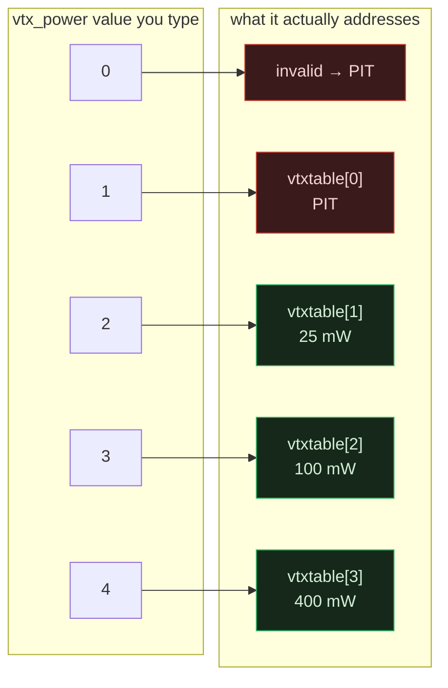

The Betaflight CLI has a reputation for being terse but internally consistent. AUX channels are 0-based: AUX1 is `0`, AUX2 is `1`, AUX6 is `5`. Modes, ranges, adjustment slots — you set them up a few times and your brain quietly files away a rule: *everything in here counts from zero.* So when I wired up VTX power switching on a wheel, I typed the config the way I've typed a hundred other CLI lines, expected it to just work, and moved on.

It did not just work. And the reason cost me an evening, because the failure looked like a hardware fault, not a typo.

---

## The Symptom

The build: a 2" analog ripper on a **SUB250F411** running **Betaflight 4.5.4**, with an **Emax TH3 V02** VTX (25 / 100 / 400 mW) on SmartAudio, hardware UART2. I wanted power on a rotary wheel — **AUX6** on the radio — so I could dial output up for range and back down for close-in without diving into a menu.

What I got instead:

- Every wheel position produced power **one level lower** than I'd configured.
- **400 mW was unreachable.** No wheel position, anywhere in its travel, would select it.
- At the extremes of the wheel, the VTX dropped into what looked like **pit mode** — near-zero output, the classic "why can't my buddy see my feed on the bench" symptom.

I did the usual hardware witch-hunt first. Re-flashed SmartAudio settings. Checked the UART2 solder joints under a loupe. Swapped the VTX onto a known-good SmartAudio line. Power-cycled between every change. Nothing moved. The VTX itself was fine the whole time — it was doing exactly what I told it to. I just didn't realise what I'd told it.

---

## The Trap

Here is the `vtx` command format:

```
vtx <index> <aux_channel> <vtx_band> <vtx_channel> <vtx_power> <start_range> <end_range>
```

Two of those fields use **opposite indexing conventions**, and nothing in the docs or in `help vtx` says so:

| Field | Convention | Example |
|-------|-----------|---------|
| `aux_channel` | **0-based** | AUX6 → `5` |
| `vtx_power` | **1-based** | first vtxtable entry → `1` |

Read that again, because it's the whole article. In *one command*, field 2 counts from zero and field 5 counts from one. If you carry the "everything is 0-based" rule across the whole line — which is the natural thing to do — every power value you write lands one slot too low.

`vtx_power` is an index into your `vtxtable`, and that index starts at **1**:



The mapping is `vtx_power = N` selects `vtxtable[N-1]`. Value `0` isn't "the first entry" — it's out of range, and out-of-range means pit. Value `1` *is* valid, but on a standard Emax-style table `vtxtable[0]` is the **PIT** entry. So the two lowest values I "naturally" reached both meant pit, and the real 400 mW slot at `vtxtable[3]` needed a `4` I never typed.

---

## What I Actually Typed vs What I Got

My wrong config carried the 0-based assumption straight through:

```
vtx 0 5 0 0 0 1000 1250
vtx 1 5 0 0 1 1250 1500
vtx 2 5 0 0 2 1500 1750
vtx 3 5 0 0 3 1750 2000
set vtx_power = 1
```

Note that the `5` in field 2 is *correct* — AUX6, 0-based. It's the last-but-two field, the power index, that's wrong on every line. Here's the damage, wheel position by wheel position:

| Wheel zone | I typed `vtx_power` | Addresses | I expected | I actually got |
|-----------|--------------------:|-----------|-----------|----------------|
| lowest    | `0` | invalid | PIT (fine) | **PIT** |
| low       | `1` | vtxtable[0] | 25 mW | **PIT** |
| mid       | `2` | vtxtable[1] | 100 mW | **25 mW** |
| high      | `3` | vtxtable[2] | 400 mW | **100 mW** |
| —         | `4` | vtxtable[3] | — | **400 mW (never addressed)** |

Everything shifted down exactly one row. And the top of my table topped out at 100 mW while the entry I actually wanted, `vtxtable[3]` = 400 mW, sat there unreachable because no line in my config ever passed a `4`.

There was a second, sneakier casualty: `set vtx_power`.

```
set vtx_power = 1
```

This is the **fallback** power Betaflight applies when the AUX value doesn't match any configured range. I set it to `1` thinking "lowest real power." But `set vtx_power` is *also* 1-based and points at the same table — so `1` = `vtxtable[0]` = **PIT**. That's why any wheel position that slipped between my ranges didn't fall back to a low power; it fell back to pit. Two separate 1-based fields, one wrong assumption, compounding.

---

## The Fix

Shift every power index up by one, and clean up the ranges while I'm in here:

```
vtx 0 5 0 0 2 900 1333
vtx 1 5 0 0 3 1333 1666
vtx 2 5 0 0 4 1666 2100
set vtx_power = 2
```

- **`2` / `3` / `4`** now correctly select 25 / 100 / 400 mW. 400 mW is finally reachable at the top of the wheel.
- **`set vtx_power = 2`** makes the fallback a real 25 mW instead of pit, so an unmatched wheel position drops to low power, not to a dead feed.
- **Ranges tightened to three zones** across the wheel's travel with no gaps between them — each range's `end` is the next range's `start`.
- **`900` and `2100`** at the extremes, not `1000`–`2000`, on purpose: on CRSF the channel endpoints overshoot slightly — the top of the wheel reports around **~2012 µs**, not a clean 2000, and the bottom dips below 1000. A range that ends at exactly `2000` leaves the very top of the wheel unmatched, which — thanks to the fallback trap above — used to dump me straight into pit at max wheel. Widening to `900`–`2100` swallows the overshoot so the endpoints stay locked to the zones I want.

Reload, and the wheel does what the physical rotation implies: bottom = low, middle = medium, top = 400 mW. No pit surprises.

---

## The One Thing to Remember

The Betaflight CLI *is* consistent — right up until it isn't, on one field, with no warning. `aux_channel` counts from zero like everything else you've internalised. `vtx_power` counts from one, because it's a `vtxtable` index and that table is 1-indexed. Same command, opposite conventions, one line apart.

If your VTX is stuck in pit mode, or 400 mW simply won't appear no matter how you turn the knob, don't reach for the soldering iron first. Count your power values from **1**, check whether `vtxtable[0]` is a PIT entry, and remember that `set vtx_power` is playing by the same 1-based rule. The hardware was never broken. The index was.
