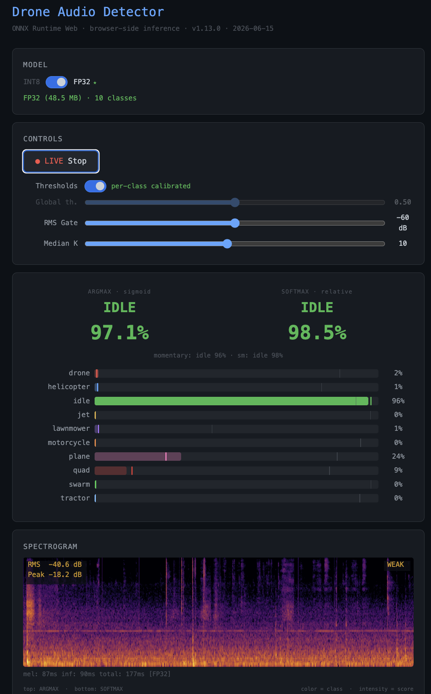
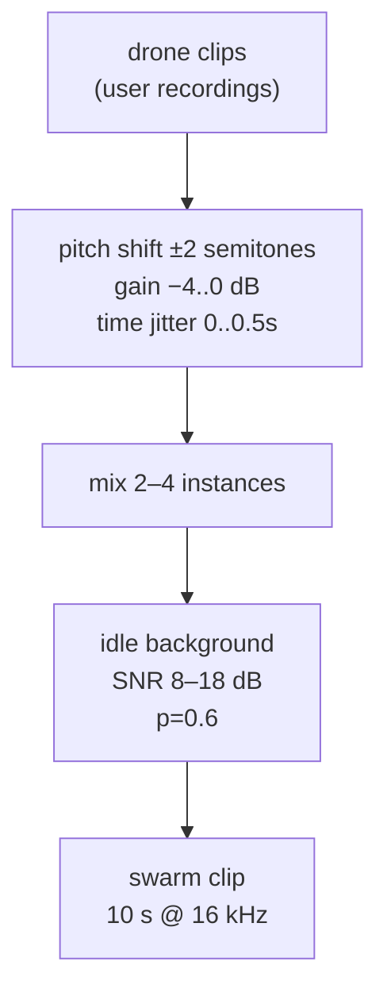
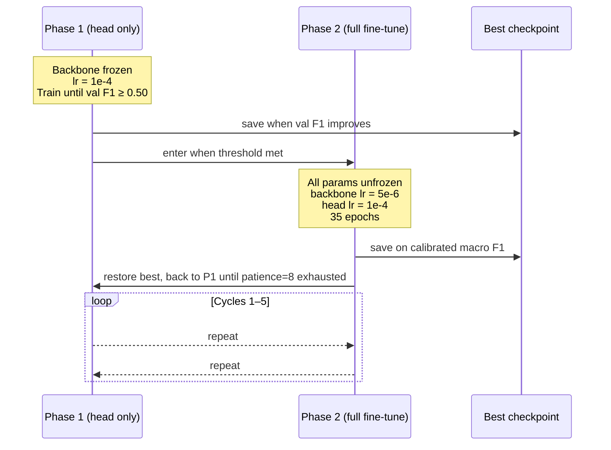
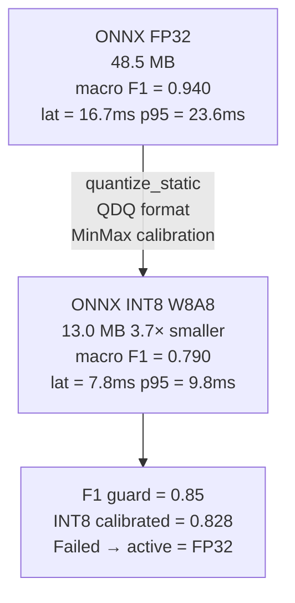
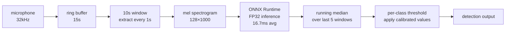

*Live demo: [drone-detector.sintra.site](https://drone-detector.sintra.site)*



A note before the technical content: the staggered training protocol described in this article was developed with significant help from [Sintra AI](https://sintra.ai). What started as a series of questions about why the naive P1→P2 schedule kept plateauing turned into a structured debugging conversation that identified the calibrated checkpointing problem and shaped the cycle logic.

---

## Background: From DSP to Neural Networks

The first approach I tried was not a neural network.

Shahed-136 has a predictable harmonic structure — two-stroke pusher engine, fundamental around 83 Hz, harmonics extending to about 4 kHz, consistent RPM under cruise. That's a template. You can build a matched filter for it: detect energy at expected harmonic intervals, accumulate evidence over time, form a hypothesis about presence, track that hypothesis using a sliding evidence accumulator or a Kalman filter, and declare a detection when the score crosses a threshold. I built a version of this. It worked on clean recordings.

The problem is the parameter space. A harmonic detector isn't one threshold — it's a threshold per harmonic, a weighting function across harmonics, a hypothesis scoring function, a temporal accumulator window, a minimum SNR, and a minimum detection duration. Each parameter is defensible in isolation; collectively they're brittle. Real environments introduce echoes, Doppler smear from moving aircraft, overlapping engines, wind, and distances where the harmonics fall below the noise floor at inconsistent rates. Tuning the system to one environment detunes it from another.

Other teams are deep into the DSP approach and have invested years in it — Ukraine in particular has deployed networks of mobile phones on poles that record and report acoustically, and other groups are doing Doppler fitting of the harmonic structure. The hardware isn't the differentiator; some of this runs on phones. The problem is time already invested. These teams have refined their systems through real deployment feedback I don't have access to. Reinventing the same DSP pipeline from scratch, starting years behind, didn't seem like a good use of effort.

What I brought from AI robotics work: when your solution requires many hand-tuned thresholds, each encoding an assumption about the world, the number of thresholds is roughly the number of ways it can fail silently. Trained neural networks — and adaptive functions in general — learn the mapping directly from data. The "threshold" is encoded in the weights, tuned on examples rather than assumptions. For a detection task with this much acoustic variability, that's the right tool.

This also wasn't my first attempt at this problem. When the conflict started in 2022, I built an early version of this detector and worked in parallel on a microphone array solution for directional localization. Both were technically functional. But I cannot promote things I build — I have approximately zero networking ability and no support network — so both projects quietly expired for lack of external interest. The microphone array work in particular would have required community coordination I was never going to generate. Four years later, I'm picking this back up.

This time I went directly to neural networks, skipped the DSP hypothesis phase, and focused on making something deployable.

---

## The Problem

A Shahed-136 runs a two-stroke pusher propeller engine. The fundamental frequency is around 83 Hz with harmonics extending up to about 4 kHz. It sounds nothing like a consumer quadrotor, nothing like a fixed-wing RC plane, and nothing like traffic. The acoustic signature is distinctive if you know what you're listening for.

The engineering problem: you cannot download a labeled dataset of Shahed-136 audio. The label does not exist in AudioSet's 527 classes. There is no DADS entry, no Freesound category, no academic benchmark. You record it yourself or you synthesize from available material — and the available material is whatever has been posted publicly from conflict zones, which is sparse, inconsistent in microphone distance, and often heavily background-contaminated.

The task I set: a 10-class single-label classifier that runs in real time on a sliding 10-second window with a 1-second hop. The classes are: **drone, swarm, quad, helicopter, jet, plane, motorcycle, lawnmower, tractor, idle**. The model needs to run in a browser on CPU and on mid-range mobile hardware.

---

## Dataset Assembly

This section matters most for anyone trying to replicate. The dataset comes from five distinct sources, each with different quality characteristics and failure modes.

| Source | Classes | Notes |
|--------|---------|-------|
| User microphone recordings | drone (Shahed proxy), swarm | Only option — no public dataset exists |
| HuggingFace DADS | quad | Consumer UAV; label=1 only |
| ESC-50 | helicopter, plane, lawnmower, idle | Clean, curated, 50 classes, 2000 clips |
| AudioSet via yt-dlp | helicopter, jet, plane, motorcycle, tractor, idle | MID-based segment download; ~30% failure rate |
| DREGON / SPCup19 (Inria) | quad (ego-noise) | On-board recordings; multi-channel → mono |
| Zenodo 15190811 | quad (outdoor) | 14 real drone models; selected 3–4 to keep size manageable |

I recorded the drone clips myself in a field. Getting enough variation — different distances, different aspect angles, different background conditions — took multiple sessions. The acoustic diversity in those recordings determines how well the model generalizes to real deployments.

### AudioSet Download Failures

Downloading from AudioSet via yt-dlp using MID codes for specific classes has a roughly 30% failure rate: videos have been deleted, made private, or region-restricted since the labels were collected. Of the clips that download, a further set fail a band-energy quality check — the audio segment has the correct label but contains mostly silence or extreme clipping. I rejected these silently and logged the rejection rate; in some class buckets it ran as high as 15%.

DREGON's ego-noise recordings are multi-channel (they were captured with microphone arrays) and need collapsing to mono before use. A naive channel average works; I did not find evidence that any particular channel weighting improved results over the simple mean.

### Zero-Padded Clip Repair

Short source clips tiled to 10 seconds introduce a structural artifact: the model sees the same audio pattern repeated, which is unlike anything in the deployment environment. I built a simple RMS-based content-length detector that identifies the actual audio content window in a clip, rejects clips shorter than 3 seconds after silence trimming, and applies random-offset placement rather than tiling.

### Swarm Synthesis

The swarm class is 100% synthetic. There is no public "multiple Shahed aircraft" audio. All 300 swarm clips were generated from the drone recording pool:



Each instance gets an independent pitch shift (±2 semitones), gain randomization (−4 to 0 dB), and time jitter (up to 0.5 seconds). With a 60% probability, an idle background is mixed in at 8–18 dB SNR. This is synthetic, and the model knows it at some level — the swarm confusion matrix entries reflect this.

### Augmentation Stack

Applied during training only, never on validation:

- Asymmetric gain: −20 to +6 dB
- Pitch shift (per clip, random within ±3 semitones)
- Additive noise at 3–25 dB SNR
- High-pass and low-pass filtering (random cutoffs)
- Idle background mix

### Class Balance

Capped at 1,000 clips per class for the training split. `WeightedRandomSampler` compensates for residual imbalance within that cap. Validation was never capped — the full available material went into the validation split.

Final dataset: ~13,200 clips total. Train/validation split is stratified.

---

## Architecture


### Why MobileNetV3 / EfficientAT

The backbone is `mn20_as` from the EfficientAT family — MobileNetV3-Large scaled to 20 width multiplier, pre-trained on all 527 AudioSet classes. At ~16.1M parameters and mAP 0.478 on AudioSet, it is the sweet spot: `mn10` undertrained on this task, `mn40` too heavy for mobile inference. AudioSet pretraining gives the backbone strong generic audio representations across a wide range of sound types; those representations transfer to the detection task without starting from random initialization.

The head is the only part trained from scratch:

```python
class DroneHead(nn.Module):
    def __init__(self, in_features, num_classes, hidden=256, dropout=0.4):
        super().__init__()
        self.pool = nn.AdaptiveAvgPool2d(1)
        self.net  = nn.Sequential(
            nn.Dropout(dropout),
            nn.Linear(in_features, hidden),
            nn.ReLU(),
            nn.Dropout(dropout * 0.75),
            nn.Linear(hidden, num_classes),
        )
    def forward(self, x):
        return self.net(self.pool(x).flatten(1))
```

### Mel Spectrogram Configuration

32kHz input, 128 mel bins, 1024 FFT, 320 hop, 800 window, Hann window. `FrequencyMasking` and `TimeMasking` from torchaudio are active during training only — the mask parameters are zeroed before ONNX export and during calibration. This matters: `FrequencyMasking` and `TimeMasking` in torchaudio do **not** respect `eval()` mode. They apply unconditionally unless you explicitly zero the mask parameters. I found this during ONNX INT8 calibration when the calibrated ranges were clearly wrong — the calibration data was being masked randomly, so the activation ranges reflected augmented rather than clean inputs.

---

## Training Protocol

The naive approach — freeze backbone, train head to convergence, unfreeze backbone, fine-tune — works. But the staggered cycle schedule reliably beats it.



**Why stagger.** The backbone settles when it's frozen — the head converges against a stable feature space. When you unfreeze the backbone, the head's gradient signal pulls the backbone too hard at full learning rate, which is why the backbone LR is 20× lower than the head during Phase 2 (5e-6 vs 1e-4). After Phase 2 shifts the backbone's feature representations, Phase 1 re-adapts the head to those new representations. Alternating achieves higher validation F1 than either phase alone — it's not magic, just giving each component time to stabilize before destabilizing the other.

The specific cycle structure — P1 threshold at F1 ≥ 0.50, patience of 8 in the return loop, backbone LR exactly 20× below head LR — was not obvious from first principles. I worked through the logic in a series of conversations with Sintra. The iteration went from "why does Phase 2 always degrade my swarm class" to "the checkpoint you're saving isn't calibrated" to the current protocol. Having an AI assistant that holds the full context of an experiment across multiple sessions is meaningfully different from searching Stack Overflow or reading papers — the reasoning stays connected to *your specific* failure mode rather than the general case.

### Calibrated Checkpointing in Phase 2

Before each Phase 2 entry, I run one validation pass and fit per-class thresholds to the precision-recall curve (best F1 on the curve, not at 0.5). Phase 2 then saves checkpoints based on *calibrated* macro F1, not argmax F1. This matters because drone and swarm have precision targets, not symmetric thresholds. Saving based on argmax F1 underrepresents these classes; saving on calibrated F1 captures the checkpoint that actually meets the deployment precision requirements.

### Loss Function

`BCEWithLogitsLoss` with per-class `pos_weight`:

```python
pos_weight = (n_neg / n_pos).clamp(min=NUM_CLASSES, max=30.0)
```

The minimum clamp at `NUM_CLASSES` (10) prevents near-zero weights for majority classes. Without the floor, the idle class weight approaches 1.0, which makes the optimizer essentially ignore it — and then idle bleeds into every other class's confusion.

---

## Results and Per-Class Analysis

<!-- IMAGE: Chart.js training curve — loss and macro F1 across staggered P1↔P2 cycles, phase transitions annotated -->
*[TODO: Training curve — loss and macro F1 across cycles, phase transitions annotated]*

<!-- IMAGE: 10×10 confusion matrix heatmap -->
*[TODO: 10×10 confusion matrix]*

### Per-Class F1

| Class | F1 | Note |
|-------|----|------|
| motorcycle | 0.997 | Easiest — distinctive high-RPM harmonic profile |
| tractor | 0.981 | Low-frequency fundamental, consistent signature |
| jet | 0.974 | High-frequency broadband, fast amplitude envelope |
| plane | 0.961 | Consistent prop signature, little variation |
| helicopter | 0.944 | Main rotor at 15–25 Hz, tail rotor at 60–100 Hz |
| idle | 0.921 | Background ambient; confused with lawnmower |
| quad | 0.906 | Rotor noise overlaps idle at low throttle |
| drone | 0.913 | Small dataset (user recordings); confused with swarm |
| swarm | 0.854 | Hardest — synthetic; shares signature with drone |
| lawnmower | 0.887 | Confused with idle; both broadband, low-frequency, steady |

**Macro F1 (calibrated): 0.940**

### Top Confused Pairs

**lawnmower → idle: 24 errors (20% of all errors).** Both are broadband, low-frequency, steady-state sounds. This is a genuine acoustic similarity, not a data artifact. A lawnmower at 50m sounds nearly identical to an idling engine at 20m. Distinguishing them requires duration modeling that a 10-second sliding window cannot fully capture.

**drone ↔ swarm: 27 errors combined.** Expected. Swarm is drone + drone + drone. The model sees the per-instance spectral signature; the multi-source mix is ambiguous at the feature level. Reducing these errors without more real swarm data would require explicit multi-source modeling.

### Per-Class Threshold Calibration

Uniform 0.5 threshold is wrong. The model's probability scale is class-dependent by design — sigmoid outputs are not calibrated to any common scale.

Calibrated thresholds at the drone ≥ 90% precision target:

| Class | Threshold | Precision | Recall |
|-------|-----------|-----------|--------|
| drone | 0.863 | 0.901 | 0.912 |
| swarm | 0.973 | 0.902 | 0.771 |
| lawnmower | 0.413 | 0.800 | 0.978 |
| tractor | 0.934 | 0.993 | 0.974 |

The spread from 0.413 to 0.973 shows how structurally different the output distributions are per class. The swarm threshold at 0.973 means we only flag swarm when the model is very confident — the recall drop to 0.771 is the cost of that precision target.

For drone and swarm, the operationally relevant question is what fraction of helicopter, jet, and motorcycle samples trigger a false positive at a given threshold. I ran this explicitly: at the calibrated drone threshold of 0.863, the false positive rate on engine-class samples (helicopter + jet + motorcycle combined) is 0.031. Acceptable.

---

## Quantization: What Happened and Why It Failed

**The INT8 model did not meet the deployment bar.**



### Attempt 1: Entropy Calibration

Entropy calibration clips the observed activation range aggressively — it finds the range that minimizes the KL divergence between the full-precision and quantized distributions. The problem: swarm has infrequent but high-magnitude activations. Entropy treats these as outliers and clips them. Swarm recall collapsed from 0.77 to 0.52. The model stopped detecting the class it was most important to detect.

### Attempt 2: MinMax Calibration

Switched to MinMax, which preserves the full observed range. Better, but macro F1 only 0.828 after per-class threshold recalibration on the INT8 model.

### Root Cause

INT8 shifts per-class probability scales non-uniformly. The tractor threshold migrated from 0.934 (FP32) to 0.010 (INT8). The lawnmower threshold shifted from 0.413 to 0.157. These are not rounding errors — the INT8 logit distribution is structurally different from FP32 for certain classes. The quantization error is not uniform across the output space.

Per-class threshold recalibration on the INT8 model partially recovers accuracy (calibrated macro F1 = 0.828) but cannot close the 11-point gap to 0.940. The information is lost in quantization.

### Things That Did Not Help

Excluding `Gemm` layers from quantization: regression (0.830 → 0.801). Per-channel weight quantization was already enabled and was not the bottleneck.

### Where This Leaves the Deployment

FP32 ONNX at 16.7ms average CPU latency (opset 17) runs comfortably inside a 1-second hop budget on a modern laptop. The 48.5 MB file size is manageable. For mobile or embedded targets where FP32 is genuinely not feasible, INT8 is usable for non-safety-critical classes — motorcycle, jet, tractor — but not for drone or swarm.

The logical next experiment is QAT (Quantization-Aware Training): fine-tune the model with fake quantization nodes active, teaching the backbone to maintain quantization-friendly logit distributions across all classes simultaneously. This was not attempted. I expect it would close most of the gap.

---

## Live Inference Architecture



The ring buffer is 15 seconds; each extraction gives a 10-second window with 1-second overlap. The running median over 5 windows suppresses single-window jitter without adding significant latency — 5 seconds of delay at a 1-second hop is acceptable for the use case.

The mel preprocessing `FrequencyMasking` and `TimeMasking` issue mentioned in the architecture section is present in the inference path too. Zero the mask parameters before exporting and before running inference. Do not rely on `model.eval()` to disable them.

![Drone Audio Detector UI — per-class probability bars (idle 96%, plane 24%, quad 9% on office ambient). ARGMAX sigmoid left, SOFTMAX relative right. 177ms total inference [FP32].](drone-detector-ui-idle.png)

---

## Open Questions

**QAT**: The clearest path to an INT8 model that meets the F1 guard. Not attempted yet.

**TFLite export**: Blocked on platform compatibility — the ONNX → TFLite conversion path through tf2onnx was unreliable for this model graph topology. The goal is a model that runs on Android without ONNX Runtime.

**Streaming inference on embedded hardware**: The 10-second window + 1-second hop architecture was designed for latency-tolerant applications. A proper streaming architecture — processing in smaller frames with a running context buffer — would reduce latency to under 2 seconds but requires architectural changes to how the mel spectrogram integrates over time.

**More drone recordings**: The drone class is the weakest point in the dataset. More recordings from different aircraft configurations, distances, and backgrounds would reduce the drone ↔ swarm confusion and likely push drone F1 above 0.95.

The model is not done. But at macro F1 0.940 on FP32 CPU at 16.7ms latency, it is far enough along to be worth deploying and getting real-world feedback.
