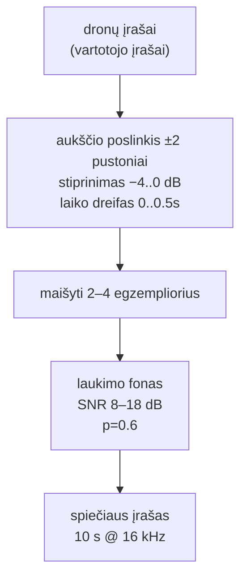
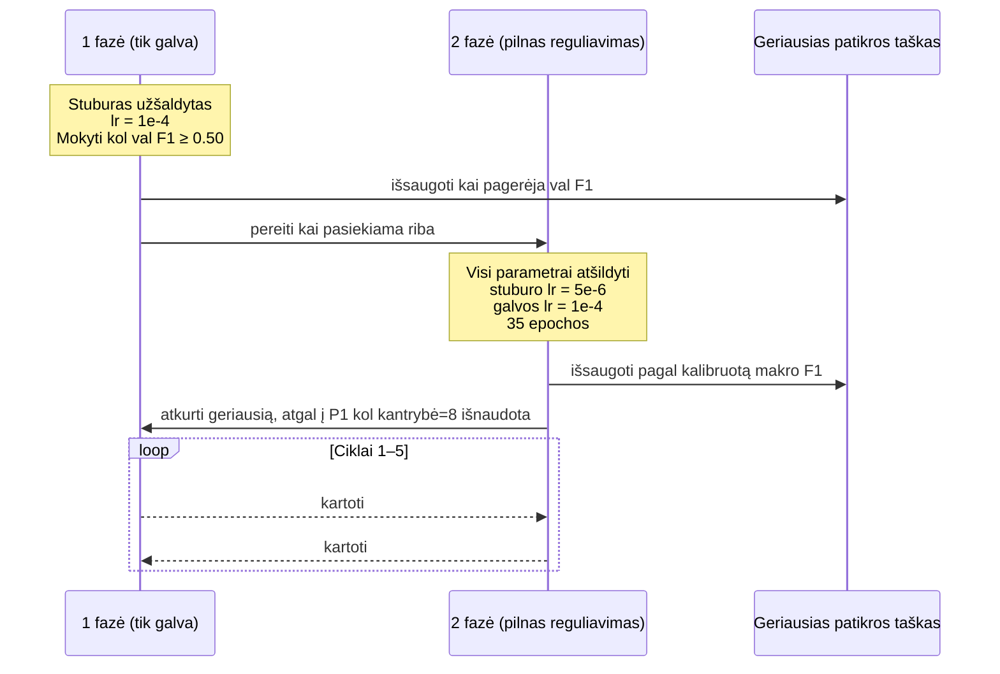
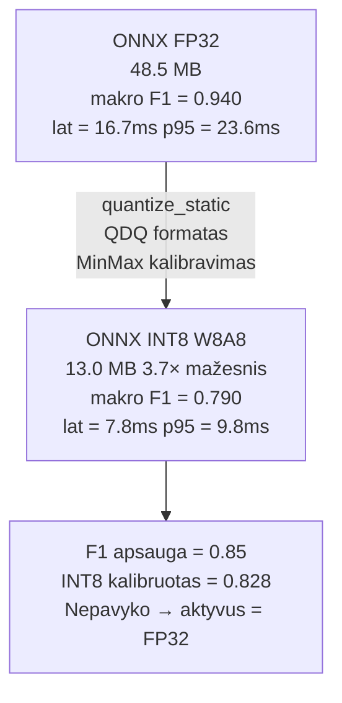
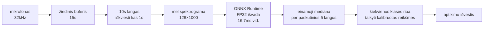

*Gyva demonstracija: [drone-detector.sintra.site](https://drone-detector.sintra.site)*


Pastaba prieš techninį turinį: pakaitomasis mokymo protokolas, aprašytas šiame straipsnyje, buvo sukurtas su reikšminga [Sintra AI](https://sintra.ai) pagalba. Tai, kas prasidėjo kaip eilė klausimų, kodėl paprastas P1→P2 grafikas vis sustingdavo, virto struktūrizuotu derinimo pokalbiu, kuris identifikavo kalibruoto patikros taško problemą ir suformavo ciklo logiką. Ta pati sistema dabar padeda man analizuoti FPV dronų juodosios dėžės žurnalus ir vykdyti PID derinimo protokolus. Trumpai tai aprašysiu pabaigoje.

---

## Problema

Shahed-136 veikia su dvitakčiu stumiamojo sraigto varikliu. Pagrindinis dažnis yra apie 83 Hz su harmoninėmis, besitęsiančiomis iki maždaug 4 kHz. Jis skamba nieko bendra neturinčiai su vartojimo kvadratoriu, fiksuotasparnio RC lėktuvu ar eismu. Akustinis parašas yra ryškus, jei žinai, ko klausai.

Inžinerinė problema: negalite atsisiųsti pažymėto Shahed-136 garso duomenų rinkinio. Ši etiketė neegzistuoja AudioSet 527 klasėse. Nėra DADS įrašo, jokios Freesound kategorijos, jokio akademinio etalono. Įrašote patys arba sintezuojate iš turimos medžiagos — o turima medžiaga yra tai, kas buvo viešai paskelbta iš konflikto zonų, o tai yra negausa, nesuderinama pagal mikrofono atstumą ir dažnai stipriai užteršta fono triukšmu.

Nustatyta užduotis: 10 klasių vienos etiketės klasifikatorius, veikiantis realiuoju laiku slenkančiame 10 sekundžių lange su 1 sekundės postūmiu. Klasės yra: **dronas, spiečius, kvadrotas, sraigtasparnis, reaktyvinis, lėktuvas, motociklas, vejos pjoviklis, traktorius, laukimas**. Modelis turi veikti naršyklėje ant procesoriaus ir vidutinės klasės mobiliojoje aparatinėje įrangoje.

---

## Duomenų rinkinio surinkimas

Šis skyrius svarbiausias visiems, kas bando pakartoti. Duomenų rinkinys gaunamas iš penkių skirtingų šaltinių, kiekvienas su skirtingomis kokybės charakteristikomis ir gedimų būdais.

| Šaltinis | Klasės | Pastabos |
|----------|--------|---------|
| Vartotojo mikrofono įrašai | dronas (Shahed proxy), spiečius | Vienintelė galimybė — viešo duomenų rinkinio nėra |
| HuggingFace DADS | kvadrotas | Vartojimo UAV; etiketė=1 tik |
| ESC-50 | sraigtasparnis, lėktuvas, vejos pjoviklis, laukimas | Švari, kuruota, 50 klasių, 2000 įrašų |
| AudioSet per yt-dlp | sraigtasparnis, reaktyvinis, lėktuvas, motociklas, traktorius, laukimas | MID pagrįstas segmentų atsisiuntimas; ~30% nesėkmių rodiklis |
| DREGON / SPCup19 (Inria) | kvadrotas (savojo triukšmo) | Laivo įrašai; kelių kanalų → mono |
| Zenodo 15190811 | kvadrotas (lauke) | 14 realių dronų modelių; pasirinkti 3–4 dydžiui valdyti |

Drono įrašus padariau pats lauke. Gauti pakankamai įvairovės — skirtingų atstumų, skirtingų kampų, skirtingų fono sąlygų — prireikė kelių seansų. Akustinė tų įrašų įvairovė lemia, kaip gerai modelis apibendrina realiam diegimui.

### AudioSet atsisiuntimo nesėkmės

Atsisiuntimas iš AudioSet per yt-dlp naudojant MID kodus konkrečioms klasėms turi maždaug 30% nesėkmės rodiklį: vaizdo įrašai buvo ištrinti, padaryti privatūs arba apriboti regionu nuo etikečių surinkimo. Iš atsisiųstų įrašų dar viena dalis neišlaiko juostos energijos kokybės patikrinimo — garso segmentas turi teisingą etiketę, bet daugiausia yra tyla arba ekstremalus iškraipymas. Šiuos atmetiau tyliai ir registravau atmetimo rodiklį; kai kuriose klasių grupėse jis siekė 15%.

### Nulinės reikšmės įrašų taisymas

Trumpi šaltinio įrašai, paplėtoti iki 10 sekundžių, įveda struktūrinį artefaktą: modelis mato tą patį garso šabloną kartojantį, kas nepanašu į bet ką diegimo aplinkoje. Sukūriau paprastą RMS pagrįstą turinio ilgio detektorių, kuris nustato faktinį garso turinio langą įraše, atmeta trumpesnius nei 3 sekundžių įrašus po tylos apkarpymo ir taiko atsitiktinę padėties nustatymą vietoj paplėtimo.

### Spiečiaus sintezė

Spiečiaus klasė yra 100% sintetinė. Nėra viešo "kelių Shahed orlaivių" garso. Visi 300 spiečiaus įrašų buvo sugeneruoti iš dronų įrašų baseino:



Kiekvienas egzempliorius gauna nepriklausomą aukščio poslinkį (±2 pustoniai), stiprinimo atsitiktinumą (−4 iki 0 dB) ir laiko dreifą (iki 0,5 sekundžių). Su 60% tikimybe primaišomas laukimo fonas ties 8–18 dB SNR.

### Augmentacijos rinkinys

Taikoma tik mokymo metu, niekada validavimo metu:

- Asimetrinis stiprinimas: −20 iki +6 dB
- Aukščio poslinkis (kiekvienam įrašui, atsitiktinis ±3 pustonių ribose)
- Priedinis triukšmas ties 3–25 dB SNR
- Aukštų dažnių ir žemų dažnių filtravimas (atsitiktiniai ribiniai dažniai)
- Laukimo fono mišinys

### Klasės balansas

Apribotas iki 1000 įrašų vienai klasei mokymo dalyje. `WeightedRandomSampler` kompensuoja likusį disbalansą. Validavimas niekada nebuvo ribojamas.

Galutinis duomenų rinkinys: ~13 200 įrašų iš viso. Mokymo/validavimo skirstymas yra sluoksniuotas.

---

## Architektūra


### Kodėl MobileNetV3 / EfficientAT

Stuburas yra `mn20_as` iš EfficientAT šeimos — MobileNetV3-Large, išmasteluotas iki 20 pločio dauginamojo, iš anksto apmokytas ant visų 527 AudioSet klasių. Ties ~16,1 mln. parametrų ir mAP 0,478 ant AudioSet, tai yra auksinė vidurį: `mn10` nepakankamai apmokytas šiai užduočiai, `mn40` per sunkus mobiliajam išvedimui.

```python
class DroneHead(nn.Module):
    def __init__(self, in_features, num_classes, hidden=256, dropout=0.4):
        super().__init__()
        self.pool = nn.AdaptiveAvgPool2d(1)
        self.net  = nn.Sequential(
            nn.Dropout(dropout),
            nn.Linear(in_features, hidden),
            nn.ReLU(),
            nn.Dropout(dropout * 0.75),
            nn.Linear(hidden, num_classes),
        )
    def forward(self, x):
        return self.net(self.pool(x).flatten(1))
```

---

## Mokymo protokolas



Kodėl pakaitomis: stuburas stabilizuojasi, kai užšaldytas. Kai jį atšildote, galvos gradiento signalas pernelyg stipriai traukia stuburą ties dideliu mokymosi greičiu — štai kodėl stuburo mokymosi greitis 2 fazėje yra 20× mažesnis nei galvos (5e-6 prieš 1e-4).

Specifinė ciklo struktūra — P1 riba ties F1 ≥ 0,50, kantrybė 8 grįžimo cikle, stuburo mokymosi greitis tiksliai 20× žemesnis nei galvos — nebuvo akivaizdi iš pirmųjų principų. Šią logiką išdirbau per eilę pokalbių su Sintra. Iteracija ėjo nuo „kodėl 2 fazė visada blogina spiečiaus klasę" iki „patikros taškas, kurį išsaugai, nėra kalibruotas" iki dabartinio protokolo. Turėti AI asistentą, kuris išlaiko visą eksperimento kontekstą keliuose seansuose, yra iš esmės kitaip nei ieškoti Stack Overflow arba skaityti straipsnius — samprotavimas lieka susietas su *jūsų konkrečiu* gedimo režimu, o ne bendru atveju.

### Nuostolių funkcija

`BCEWithLogitsLoss` su kiekvienos klasės `pos_weight`:

```python
pos_weight = (n_neg / n_pos).clamp(min=NUM_CLASSES, max=30.0)
```

---

## Rezultatai ir kiekvienos klasės analizė

<!-- IMAGE: mokymo kreivė — nuostoliai ir makro F1 per pakaitomuosius P1↔P2 ciklus, pažymėti fazių perėjimai -->
*[TODO: Mokymo kreivė — nuostoliai ir makro F1 per ciklus]*

<!-- IMAGE: 10×10 painiavos matricos šilumos žemėlapis -->
*[TODO: 10×10 painiavos matrica]*

### Kiekvienos klasės F1

| Klasė | F1 | Pastaba |
|-------|----|---------|
| motociklas | 0.997 | Lengviausia — ryškus aukšto RPM harmoninis profilis |
| traktorius | 0.981 | Žemo dažnio pagrindinis, nuoseklus parašas |
| reaktyvinis | 0.974 | Aukštų dažnių plačiajuostis |
| lėktuvas | 0.961 | Nuoseklus sraigto parašas |
| sraigtasparnis | 0.944 | Pagrindinis rotorius ties 15–25 Hz |
| laukimas | 0.921 | Fonas; painiojamas su vejapjove |
| kvadrotas | 0.906 | Rotoriaus triukšmas sutampa su laukimu mažame droslyje |
| dronas | 0.913 | Mažas duomenų rinkinys; painiojamas su spiečiumi |
| spiečius | 0.854 | Sunkiausia — sintetinis; dalinasi parašu su dronu |
| vejapjovė | 0.887 | Painiojama su laukimu; abu plačiajuosčiai, žemo dažnio |

**Makro F1 (kalibruotas): 0.940**

### Kiekvienos klasės ribos kalibravimas

Vienoda 0,5 riba yra neteisinga. Kalibruotos ribos ties drono ≥ 90% tikslumo tikslu:

| Klasė | Riba | Tikslumas | Atpaukimas |
|-------|------|----------|------------|
| dronas | 0.863 | 0.901 | 0.912 |
| spiečius | 0.973 | 0.902 | 0.771 |
| vejapjovė | 0.413 | 0.800 | 0.978 |
| traktorius | 0.934 | 0.993 | 0.974 |

---

## Kvantizacija: kas nutiko ir kodėl nepavyko

**INT8 modelis nepasiekė diegimo lygio.**



Entropija agresyviai apkerta aktyvacijos diapazoną. Spiečius turi retų, bet didelių aktyvacijų — entropija jas traktuoja kaip anormalijas. Spiečiaus atpaukimas nukrito nuo 0,77 iki 0,52.

MinMax kalibravimas išlaiko visą stebimą diapazoną. Geriau, bet makro F1 tik 0,828 po kiekvienos klasės ribų rekalibravimai ant INT8 modelio.

Pagrindinė priežastis: INT8 keičia kiekvienos klasės tikimybių skales netolygiai. Traktoriaus riba persikėlė nuo 0,934 (FP32) iki 0,010 (INT8). Vejapjovės riba persikėlė nuo 0,413 iki 0,157. Tai ne apvalinimo klaidos — INT8 logitų pasiskirstymas yra struktūriškai skirtingas nuo FP32 tam tikroms klasėms.

---

## Gyvosios išvados architektūra



---

## Sintra FPV Dronų Derinimui

Kuriant dronų detektorių pradėjau naudoti Sintra ir FPV darbui — konkrečiai juodosios dėžės žurnalų analizei ir PID derinimui. Tai verta paminėti, nes tai kitoks naudojimo atvejis nei kodo derinimas: tai yra struktūrizuoto, gerai dokumentuoto protokolo teisingas vykdymas, o ne naujojo kodo derinimas.

### Juodosios Dėžės Žurnalų Analizė

Betaflight registruoja skrydžio duomenis konfigūruojamu greičiu — giroskopo pėdsakus, PID išvestis, variklio komandas, nustatymo taškus. Žurnalai yra dvejetainiai `.bbl` failai. Prasmingai juos analizuoti reikia suprasti ryšį tarp giroskopo pėdsako, nustatymo taško ir variklio išvesčių dažnių srityje.

Derinimo metodologija, kurią naudoju, yra išvesta iš [PIDtoolbox](https://github.com/bw1129/PIDtoolbox) — Brian White MATLAB pagrįsto įrankio, kuris įgyvendina žingsnio atsako analizę, giroskopo ir variklio triukšmo spektrinę analizę bei PID klaidos suskaidymą. Pagrindinis supratimas — žingsnio atsakas (Wiener dekonvoliucija giroskopo atsako prieš nustatymo tašką) suteikia modeliui nepriklausomą vaizdą, kaip gerai kvadrotas seka komandas, nereikalaujant rankiniu būdu tikrinti triukšmingų laiko srities pėdsakų.

Sintra tvarko darbo eigą aplink šią analizę:

- CSV eksporto iš Blackbox Explorer analizavimas ir žurnalo sveikatos tikrinimas (kadrų praradimai, prisotinti varikliai, blogi vibracijos įvykiai)
- Žingsnio atsako skaičiavimo vykdymas ir rezultato interpretavimas pagal laukiamą formą (kilimo laikas, persovimas, nusistovėjimo laikas, stacionarios būsenos klaida)
- Spektrinės analizės rezultatų kryžminė nuoroda — propelerių plovimo dažnių juostų identifikavimas, notch filtro vietos nustatymas, RPM filtro veikimo tikrinimas
- Konkrečių parametrų koregavimų rekomendavimas pagal stebimą nukrypimą nuo tikslinio žingsnio atsako formos, laikantis nustatytos derinimo tvarkos (P → D → I → FF → patikrinti)
- Pastabų tarp seansų išlaikymas, kad kiekvieną kartą nereikėtų atkurti konteksto

### Derinimo Protokolas Praktikoje

Protokolas seka nusistovėjusią metodologiją iš PIDtoolbox ir panašių įrankių:

1. Įrašyti specialų žingsnio atsako skrydį — greiti lazdos įvestys kiekvienoje ašyje atskirai, laikant droselį pastovų sklandyme
2. Eksportuoti iš Blackbox Explorer, vykdyti žingsnio atsako analizę
3. Identifikuoti dominuojantį gedimo režimą: persovimas → P per didelis arba D per mažas; nepakankamai slopintas virpėjimas → D per mažas; lėtas vangus atsakas → P per mažas; ilgalaikis dreijavimas → I per mažas; uždelstas pradinis atsakas → FF per mažas
4. Koreguoti vieną ašį, vieną parametrą vienu metu
5. Perskristi, perkalibruoti, palyginti

Sintra padeda 2–4 žingsniuose: paima analizės išvestį, identifikuoja gedimo režimą ir siūlo konkretų parametro pokyčio žingsnį — remiantis tais pačiais principais, kuriuos MATLAB įrankiai koduoja, bet pokalbio formatu, kuris leidžia greičiau iteruoti.

Tai geras pavyzdys, kam AI pagalba iš tikrųjų naudinga aparatinės įrangos darbe: ne generuoti kodą nuo nulio, bet padėti teisingai ir sistemingai vykdyti žinomą protokolą, ypač per seansus, kur kontekstas kitaip būtų prarastas.

---

## Atviri klausimai

**QAT**: Aiškiausias kelias į INT8 modelį, atitinkantį F1 apsaugą. Dar nebandyta.

**TFLite eksportas**: Blokuojamas dėl platformos suderinamumo — ONNX → TFLite konvertavimo kelias per tf2onnx buvo nepatikimas šiam modelio grafiko topologijai.

**Srautinis išvedimas įterptinėje aparatinėje įrangoje**: 10 sekundžių langas + 1 sekundės postūmio architektūra buvo sukurta programoms, toleruojančioms delsą. Tinkama srautinė architektūra sumažintų delsą iki mažiau nei 2 sekundžių, tačiau reikalauja architektūros pakeitimų.

**Daugiau dronų įrašų**: Drono klasė yra silpniausia duomenų rinkinio vieta. Daugiau įrašų iš skirtingų orlaivio konfigūracijų, atstumų ir fonų sumažintų drono ↔ spiečiaus painiavą.

Modelis nėra baigtas. Tačiau ties makro F1 0,940 ant FP32 procesoriaus ties 16,7 ms delsa, jis yra pakankamai toli, kad verta diegti ir gauti realaus pasaulio atsiliepimų.
