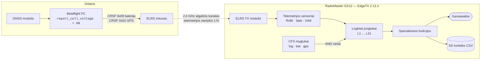

> **EdgeTX Cockpit Voice**, 3 dalis iš 9. Kaip priverčiau RadioMaster GX12 įgarsinti savo telemetriją, kad žema baterija būtų tai, ką išgirstu, o ne tai, ko pamiršau pažiūrėti.
>
> [‹ 2 dalis: kalibracija, ant kurios stovi kiekvienas baterijos įspėjimas](/fpv/edgetx-cockpit-voice-calibration/)  ·  [4 dalis: ką pultas iš tikrųjų pasako ›](/fpv/edgetx-cockpit-voice-callouts/)  ·  [Pradėti nuo 1 dalies](/fpv/edgetx-cockpit-voice-why/)

[1 dalis](/fpv/edgetx-cockpit-voice-why/) nustatė tikslą ir vieną skrydžio
valdiklio nustatymą, ant kurio viskas stovi. Ši dalis yra mechanizmas: kaip pultas
nusprendžia, kada kalbėti, ir kaip neleidžiu trims atskiroms įspėjimų sistemoms
kovoti tarpusavyje.

## Trys mygtukai, trys spalvos, trys posistemės

GX12 turi šešis papildomus mygtukus virš svirčių. Tai EdgeTX
**konfigūruojami funkciniai jungtukai** (CFS), kiekvieną galima pavadinti,
priskirti pradinę būseną ir RGB spalvą, kurią pultas tikrai užsidega.

Naudoju antrą trijų mygtukų grupę ir spalvas priskyriau taip, kad visos
įspėjimų sistemos būseną galėčiau patvirtinti vienu žvilgsniu į pultą, dar
prieš užsidėdamas akinius, nes tai vienintelė akimirka, kai į pultą iš tikrųjų
žiūriu.


| Mygtukas | Pavadinimas | Spalva | Pradinė būsena | Ką valdo |
|----------|-------------|--------|----------------|----------|
| SW4 | `log` | Raudona | **Išjungta** | Telemetrijos įrašymas į SD kortelę |
| SW5 | `bat` | Žalia | **Įjungta** | Visi baterijos įtampos įspėjimai |
| SW6 | `gps` | Mėlyna | **Išjungta** | Visi GPS / palydovų pranešimai |

Baterijos įspėjimai pagal nutylėjimą **įjungti**, būtent to niekada nenoriu
turėti prisiminti. GPS pranešimai išjungti, nes ant whoop'ų ir analoginių
riperių GNSS modulio nėra visai, ir nenoriu „GPS pamestas“ sirenos kiekvieno
skrydžio metu. Įrašymas išjungtas, nes jis pripildo SD kortelę.

Štai dalis, kurią teko išsiaiškinti: **GX12 pulte modeliui priklausantis CFS
blokas turi viršenybę prieš pulto lygio jungtukų konfigūraciją.** Abiejuose failuose yra
SW4/5/6 įrašai. Pulto lygio įrašas `radio.yml` faile yra atsarginis; realiai
veikia modelio YAML esantis `customSwitches` blokas.

```yaml
# model00.yml — būtent šis blokas nugali
customSwitches:
   SW4:
      name: "log"
      type: 2POS
      group: 0              # 0 = nepriklausomas perjungimas
      start: START_OFF
      onColor:  { r: 63, g:  0, b:  0 }   # raudona
      offColor: { r:  2, g:  2, b:  2 }
   SW5:
      name: "bat"
      type: 2POS
      group: 0
      start: START_ON       # baterijos įspėjimai aktyvūs iš karto
      onColor:  { r:  0, g: 40, b:  2 }   # žalia
      offColor: { r:  4, g:  0, b:  0 }
   SW6:
      name: "gps"
      type: 2POS
      group: 0
      start: START_OFF
      onColor:  { r:  0, g:  0, b: 63 }   # mėlyna
      offColor: { r:  2, g:  2, b:  2 }
```

`group: 0` reiškia nepriklausomą perjungimą. Mano SW1/SW2/SW3 yra `group: 1`,
todėl veikia kaip vienas kitą išjungiantys mygtukai, patogu, pavyzdžiui,
VTX galios lygiui rinkti, ir netinka trims nepriklausomoms įspėjimų posistemėms.

Kai mygtukai pavadinti, EdgeTX visur rodo *pavadinimus*, o ne `SW52`, ir loginių
jungtukų puslapis pasidaro įskaitomas:


## Signalo kelias

Prieš lenteles, visas kelias nuo celės iki garso:



Pagrindinė struktūrinė idėja yra **AND vartai**. Kiekvienas loginis jungtukas
turi `andsw` lauką, antrą sąlygą, kuri taip pat turi būti tenkinama. Būtent tai
vienuolika nepriklausomų slenksčio detektorių paverčia trimis perjungiamomis
posistemėmis. Slenksčių logika ir aktyvavimo logika yra aiškiai atskirtos, ir
man niekada nereikia redaguoti slenksčių, kad nutildyčiau posistemę.

## Loginiai jungtukai

Vienuolika. Pirma ekranai, tada YAML, tada kam kiekvienas skirtas.


Viena detalė, kuri sutaupys tau painiavos skaitant YAML: **`logicalSw` blokas
indeksuojamas nuo nulio, o sąsajos etiketės, nuo vieneto.** `logicalSw: 2:` yra
tas jungtukas, kurį pultas vadina `L3`. Lygiai taip pat `tele(14)` yra nuo nulio
skaičiuojamas indeksas `telemetrySensors` sąraše, mano faile tai `RxBt`.

```yaml
logicalSw:
   0:                              # = L1
      func: FUNC_VNEG              # a < x
      def: "tele(14),40"           # RxBt < 4,0 V   (prec:1, tad 40 = 4,0)
      andsw: "SW52"                # IR  bat mygtukas įjungtas
   1:                              # = L2
      func: FUNC_VNEG
      def: "tele(14),36"           # RxBt < 3,6 V
      andsw: "SW52"
   2:                              # = L3   <-- tas, kuris gelbsti skrydžius
      func: FUNC_VNEG
      def: "tele(14),38"           # RxBt < 3,8 V
      andsw: "SW62"                # IR  gps mygtukas įjungtas
   3:                              # = L4
      func: FUNC_VPOS              # a > x
      def: "tele(22),6"            # Sats > 6
      andsw: "SW62"
   4:                              # = L5
      func: FUNC_VPOS
      def: "tele(22),13"           # Sats > 13
      andsw: "SW62"
   5:                              # = L6
      func: FUNC_ADIFFEGREATER     # |delta| >= x   <-- žr. pastabą žemiau
      def: "tele(21),120"          # GAlt, 120 m
      andsw: "NONE"                # visada aktyvus
   6:                              # = L7
      func: FUNC_VNEG
      def: "tele(22),6"            # Sats < 6
      andsw: "SW62"
   7:                              # = L8
      func: FUNC_VNEG
      def: "tele(14),35"           # RxBt < 3,5 V
      andsw: "SW52"
   8:                              # = L9
      func: FUNC_VNEG
      def: "tele(14),38"           # RxBt < 3,8 V
      andsw: "SE1"                 # SE vidurys -- prearm vartai, žr. žemiau
   9:                              # = L10
      func: FUNC_VPOS
      def: "tele(14),42"           # RxBt > 4,2 V
      andsw: "SW52"
   10:                             # = L11
      func: FUNC_VNEG
      def: "tele(14),29"           # RxBt < 2,9 V
      andsw: "SW52"
```

Kiekvienas iš jų turi `delay: 0` ir `duration: 0`. Įsidėmėk tai.

Tokia visa struktūra. Vienuolika slenksčio detektorių, trys perjungiamos
posistemės, vienas AND laukas, kuris juos atskiria. Tik vieno visa tai dar nedaro: neskleidžia garso.


---

> **Serija:** EdgeTX Cockpit Voice, 3 dalis iš 9. Kaip priverčiau RadioMaster GX12 įgarsinti savo telemetriją, kad žema baterija būtų tai, ką išgirstu, o ne tai, ko pamiršau pažiūrėti.
>
> [‹ 2 dalis: kalibracija, ant kurios stovi kiekvienas baterijos įspėjimas](/fpv/edgetx-cockpit-voice-calibration/)  ·  [4 dalis: ką pultas iš tikrųjų pasako ›](/fpv/edgetx-cockpit-voice-callouts/)  ·  [Pradėti nuo 1 dalies](/fpv/edgetx-cockpit-voice-why/)
