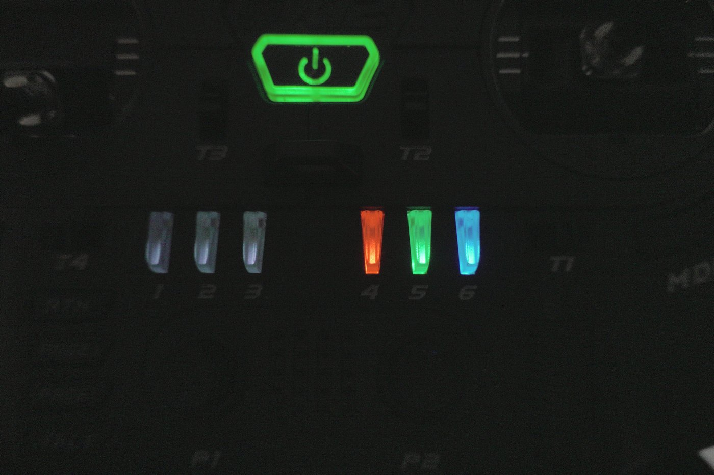
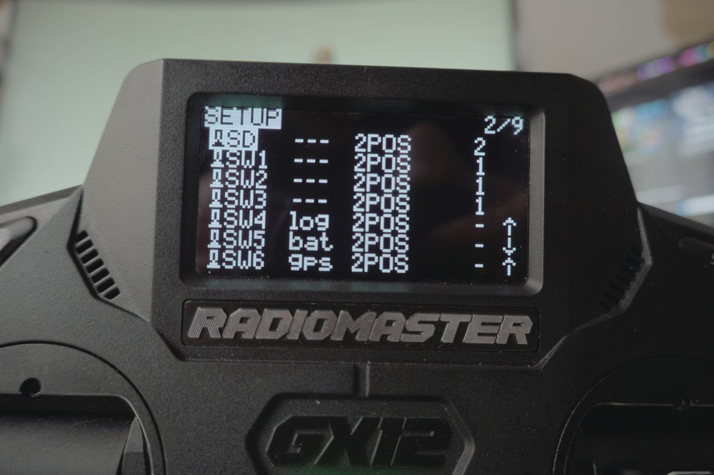
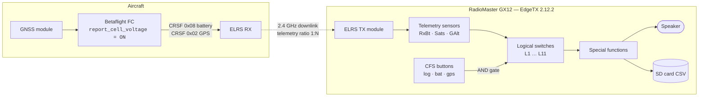
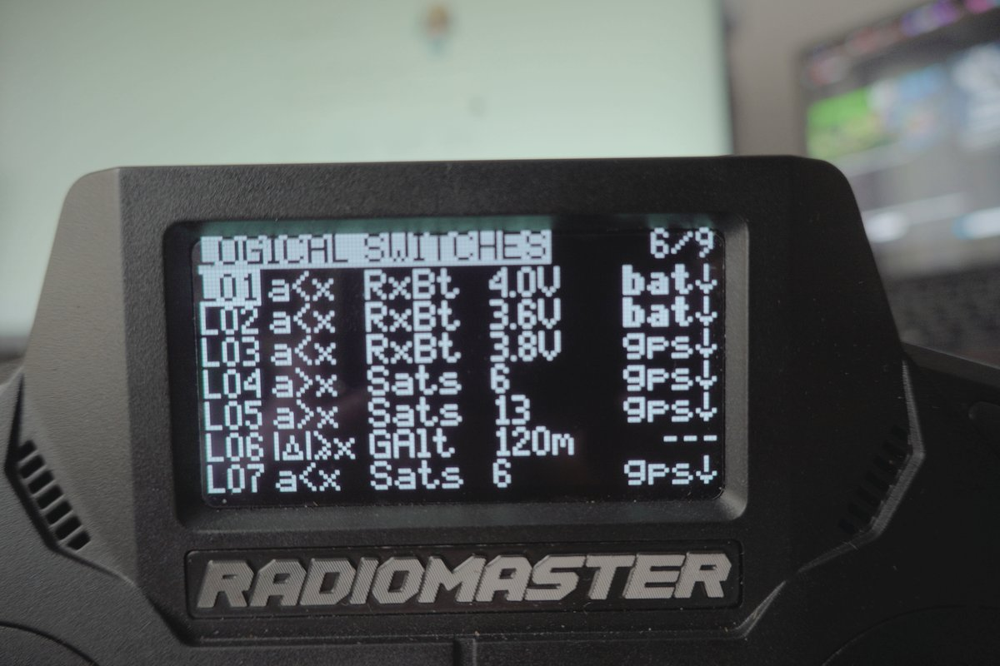
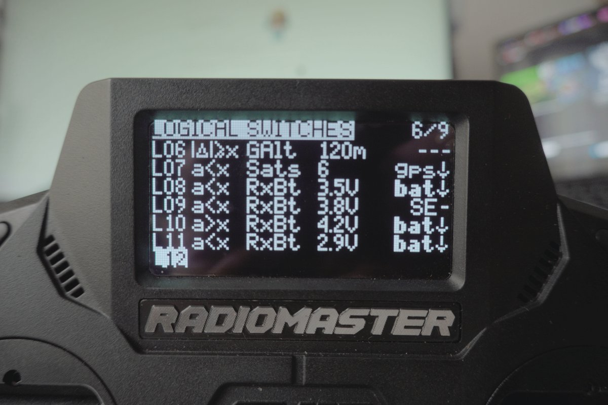

> **EdgeTX Cockpit Voice**, part 3 of 9. Making a RadioMaster GX12 speak its own telemetry, so a low battery is something I hear instead of something I forgot to look at.
>
> [‹ Part 2: The Calibration Every Battery Warning Rests On](/fpv/edgetx-cockpit-voice-calibration/)  ·  [Part 4: What the Radio Actually Says ›](/fpv/edgetx-cockpit-voice-callouts/)  ·  [Start at part 1](/fpv/edgetx-cockpit-voice-why/)

[Part 1](/fpv/edgetx-cockpit-voice-why/) established the goal and the one flight
controller setting the whole thing rests on. This part is the machinery: how the
radio decides when to speak, and how I keep three separate warning systems from
fighting each other.

## Three buttons, three colours, three subsystems

The GX12 has six extra buttons above the sticks. They are EdgeTX
**Customisable Function Switches** (CFS), which means each one can be named,
given a default state, and assigned an RGB colour that the radio actually
lights up.

I use the second group of three, and I colour-coded them so I can confirm the
state of the whole warning system with a glance at the radio, before I put the
goggles on, which is the only moment I am actually looking at the radio.



| Button | Name  | Colour | Default | What it gates                |
| ------ | ----- | ------ | ------- | ---------------------------- |
| SW4    | `log` | Red    | **Off** | SD card telemetry recording  |
| SW5    | `bat` | Green  | **On**  | All battery voltage warnings |
| SW6    | `gps` | Blue   | **Off** | All GPS / satellite callouts |

Battery warnings default to **on**, that is the one I never want to have to
remember. GPS callouts default to **off**, because on the whoops and the analog
rippers there is no GNSS module at all and I do not want a "GPS lost" siren on
every flight. Logging defaults to off because it fills the SD card.

Here is the part that took me a while to work out: **on the GX12, the per-model
CFS block overrides the radio-level switch config.** Both files have entries for
SW4/5/6. The radio-level one in `radio.yml` is the fallback; the per-model
`customSwitches` block in the model YAML is what actually runs.

```yaml
# model00.yml — this is the block that wins
customSwitches:
   SW4:
      name: "log"
      type: 2POS
      group: 0              # 0 = independent toggle
      start: START_OFF
      onColor:  { r: 63, g:  0, b:  0 }   # red
      offColor: { r:  2, g:  2, b:  2 }
   SW5:
      name: "bat"
      type: 2POS
      group: 0
      start: START_ON       # battery warnings armed by default
      onColor:  { r:  0, g: 40, b:  2 }   # green
      offColor: { r:  4, g:  0, b:  0 }
   SW6:
      name: "gps"
      type: 2POS
      group: 0
      start: START_OFF
      onColor:  { r:  0, g:  0, b: 63 }   # blue
      offColor: { r:  2, g:  2, b:  2 }
```

`group: 0` means independent toggle. My SW1/SW2/SW3 sit in `group: 1`, which
makes them behave like mutually-exclusive radio buttons, useful for things like
selecting a VTX power level, wrong for three independent warning subsystems.

Once the buttons are named, EdgeTX shows the _names_ everywhere instead of
`SW52`, which makes the logical switch page readable:



## The signal chain

Before the tables, here is the whole path from a cell to a sound:



The key structural idea is the **AND gate**. Every logical switch has an
`andsw` field, a second condition that must also be true. That is what turns
eleven independent threshold detectors into three switchable subsystems. The
threshold logic and the arming logic are cleanly separated, and I never have to
edit thresholds to silence a subsystem.

## The logical switches

Eleven of them. Screens first, then the YAML, then what each one is for.






One mapping detail that will save you confusion if you read the YAML: **the
`logicalSw` block is zero-indexed while the UI labels are one-indexed.**
`logicalSw: 2:` is the switch the radio calls `L3`. Likewise `tele(14)` is a
zero-based index into the `telemetrySensors` list, in my file that is `RxBt`.

```yaml
logicalSw:
   0:                              # = L1
      func: FUNC_VNEG              # a < x
      def: "tele(14),40"           # RxBt < 4.0 V   (prec:1, so 40 = 4.0)
      andsw: "SW52"                # AND  bat button on
   1:                              # = L2
      func: FUNC_VNEG
      def: "tele(14),36"           # RxBt < 3.6 V
      andsw: "SW52"
   2:                              # = L3   <-- the one that saves flights
      func: FUNC_VNEG
      def: "tele(14),38"           # RxBt < 3.8 V
      andsw: "SW62"                # AND  gps button on
   3:                              # = L4
      func: FUNC_VPOS              # a > x
      def: "tele(22),6"            # Sats > 6
      andsw: "SW62"
   4:                              # = L5
      func: FUNC_VPOS
      def: "tele(22),13"           # Sats > 13
      andsw: "SW62"
   5:                              # = L6
      func: FUNC_ADIFFEGREATER     # |delta| >= x   <-- read the note below
      def: "tele(21),120"          # GAlt, 120 m
      andsw: "NONE"                # always armed
   6:                              # = L7
      func: FUNC_VNEG
      def: "tele(22),6"            # Sats < 6
      andsw: "SW62"
   7:                              # = L8
      func: FUNC_VNEG
      def: "tele(14),35"           # RxBt < 3.5 V
      andsw: "SW52"
   8:                              # = L9
      func: FUNC_VNEG
      def: "tele(14),38"           # RxBt < 3.8 V
      andsw: "SE1"                 # SE middle -- prearm gate, see below
   9:                              # = L10
      func: FUNC_VPOS
      def: "tele(14),42"           # RxBt > 4.2 V
      andsw: "SW52"
   10:                             # = L11
      func: FUNC_VNEG
      def: "tele(14),29"           # RxBt < 2.9 V
      andsw: "SW52"
```

Every single one of these has `delay: 0` and `duration: 0`. Hold that thought.

That is the whole structure. Eleven threshold detectors, three switchable
subsystems, one AND slot doing the separating. What none of it does yet is make a
sound.


---

> **Series:** EdgeTX Cockpit Voice, part 3 of 9. Making a RadioMaster GX12 speak its own telemetry, so a low battery is something I hear instead of something I forgot to look at.
>
> [‹ Part 2: The Calibration Every Battery Warning Rests On](/fpv/edgetx-cockpit-voice-calibration/)  ·  [Part 4: What the Radio Actually Says ›](/fpv/edgetx-cockpit-voice-callouts/)  ·  [Start at part 1](/fpv/edgetx-cockpit-voice-why/)
