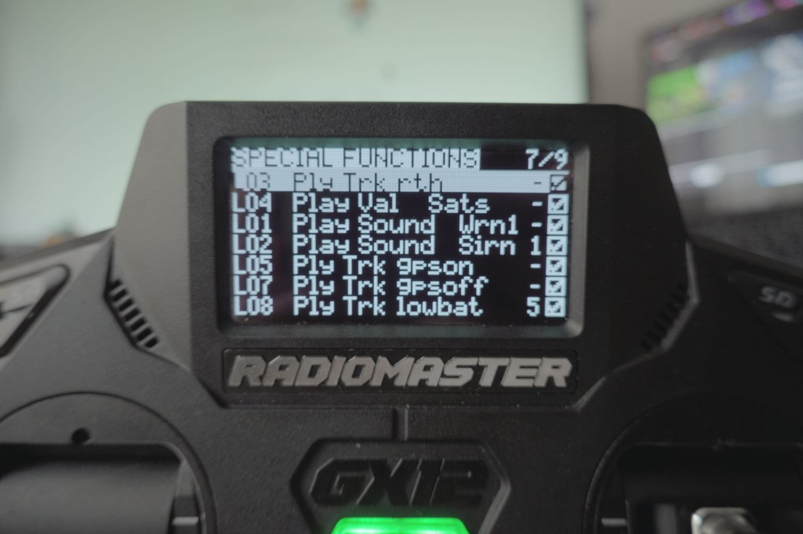

> **EdgeTX Cockpit Voice**, part 4 of 9. Making a RadioMaster GX12 speak its own telemetry, so a low battery is something I hear instead of something I forgot to look at.
>
> [‹ Part 3: Three Buttons, Three Colours, and the AND Gate](/fpv/edgetx-cockpit-voice-buttons/)  ·  [Part 5: Where the Callouts Come From ›](/fpv/edgetx-cockpit-voice-audio-and-sharing/)  ·  [Start at part 1](/fpv/edgetx-cockpit-voice-why/)

The switches from [Part 3](/fpv/edgetx-cockpit-voice-buttons/) are just booleans
until something turns them into sound. That something is EdgeTX special functions,
and this is where the config stops being structure and starts being a voice in my
ear.

## The special functions

This is where a boolean becomes a sound.




```yaml
customFn:
   0:  { swtch: "L3",   func: PLAY_TRACK, def: "rth,1,1x"     }
   1:  { swtch: "L4",   func: PLAY_VALUE, def: "tele(22),1,1x" }
   2:  { swtch: "L1",   func: PLAY_SOUND, def: "Wrn1,1,1x"    }
   3:  { swtch: "L2",   func: PLAY_SOUND, def: "Sirn,1,1"     }
   4:  { swtch: "L5",   func: PLAY_TRACK, def: "gpson,1,1x"   }
   5:  { swtch: "L7",   func: PLAY_TRACK, def: "gpsoff,1,1x"  }
   6:  { swtch: "L8",   func: PLAY_TRACK, def: "lowbat,1,5"   }
   7:  { swtch: "L9",   func: PLAY_SOUND, def: "Sirn,1,2"     }
   8:  { swtch: "L6",   func: PLAY_TRACK, def: "warnng,1,1x"  }
   9:  { swtch: "SW42", func: LOGS,       def: "3,1"          }
   10: { swtch: "L10",  func: PLAY_TRACK, def: "ready,1,1x"   }
   11: { swtch: "L11",  func: PLAY_SOUND, def: "Alrm,1,1x"    }
```

The third field in `def` is the repeat interval. `1x` means play once per
trigger. `1` means every second, `5` means every five seconds. That distinction
matters more than it looks, see below.

Put together, the behaviour is this:

### The battery ladder — green button

| Per-cell    | Switch | Sound    | Repeat | Meaning                                        |
| ----------- | ------ | -------- | ------ | ---------------------------------------------- |
| **> 4.2 V** | L10    | `ready`  | once   | Fresh pack detected — system armed and talking |
| **< 4.0 V** | L1     | `Wrn1`   | once   | You are flying now, clock is running           |
| **< 3.8 V** | L3     | `rth`    | once   | _Roughly half capacity — turn around_          |
| **< 3.6 V** | L2     | `Sirn`   | 1 s    | Get home                                       |
| **< 3.5 V** | L8     | `lowbat` | 5 s    | Land, wherever you are                         |
| **< 2.9 V** | L11    | `Alrm`   | once   | You have hurt the pack                         |

The `ready` callout at > 4.2 V is not a warning at all. It is a **self-test**. When I plug a battery in and the radio says "ready", I
have just confirmed, in one word, that: telemetry is flowing, the RxBt sensor is
alive, `report_cell_voltage` is actually set on _this_ aircraft, and the audio
path works. All four failure modes of the entire system, verified by one word,
before I take off. If the radio stays quiet when I plug in, something in the
chain is broken and I want to know _now_, not at 800 metres.

Caveat on LiHV: a 4.35 V/cell pack sails past 4.2 V, so `ready` fires reliably.
A LiPo that has been sitting on the shelf for a week self-discharges toward
4.15 V and may never trip it. That is arguably correct behaviour, it is telling
me the pack is not actually full.

**The `rth` callout at 3.8 V is the one that has genuinely saved flights.** It
is a crude approximation of half capacity, made from voltage rather than
coulombs, and I am not going to pretend it is accurate. But it does not need to
be accurate. It needs to arrive _while I still have the energy budget to act on
it_, which a coulomb counter that I am not looking at does not achieve. Note
that it is gated on the **gps** button, not the battery button, it is a
long-range-mission warning, and on a whoop in a hotel room it would just be
noise.

And to be explicit about the other half of long range, because it is not
optional and no amount of telemetry replaces it: my wife maintains visual line
of sight on the aircraft through binoculars the entire time. The audio warnings
tell me about the _aircraft's_ state. They tell me nothing about the airspace.

### The GPS callouts — blue button

Satellite count is a genuinely bad thing to monitor visually, because the moment
it matters most is the moment you are least able to look.

| Condition | Switch | Sound               | Meaning                                |
| --------- | ------ | ------------------- | -------------------------------------- |
| Sats > 6  | L4     | _speaks the number_ | Approaching usable — how close are we? |
| Sats > 13 | L5     | `gpson`             | Solid fix, rescue is trustworthy       |
| Sats < 6  | L7     | `gpsoff`            | **Fix degraded mid-flight**            |

`PLAY_VALUE` on L4 is the nice one, instead of a fixed tone it speaks the
actual satellite count. So while I am waiting on the ground I get "seven",
"nine", "eleven" as the fix builds, and I know whether to keep waiting or give
up, without unlocking the radio screen.

The threshold that actually matters is **6**, because that is roughly where
GPS Rescue becomes something you can trust, and the exact number depends
entirely on your own rescue configuration in Betaflight or INAV. Set it to
match _your_ `gps_rescue_min_sats`, not mine.

The `gpsoff` warning at Sats < 6 is the one I did not expect to need and now
consider essential. **Acrobatics drop satellites.** Roll the aircraft
inverted and the patch antenna is pointing at the ground; hard flips and
power loops routinely knock the count down. If that happens on a long-range
flight and I do not know about it, I am flying with a rescue function that
will not work, believing that I have a safety net. One word in my ear fixes
that.

### The altitude alarm — always armed

L6 has `andsw: "NONE"`, it is armed on every flight, on every aircraft. I fly
under EASA A1/A3, and the 120 m AGL limit is not a preference.

But here is where I have to be honest about my own config, because reading the
YAML back taught me something about it:

```yaml
   5:
      func: FUNC_ADIFFEGREATER    # |delta| >= x
      def: "tele(21),120"
```

`FUNC_ADIFFEGREATER` is `|Δ| ≥ x`, the **delta** function. It does not fire
when altitude _exceeds_ 120 m. It fires when altitude has _changed by_ 120 m
from its reference point.

I could pretend I planned that. What I will say is that it turns out to be the
more defensible choice, for a reason worth understanding:

**`GAlt` on CRSF is GPS altitude, not height above your launch point.** If I had
used the obvious `a > x` on `GAlt` with a 120 m threshold, it would scream at me
constantly and permanently, because I fly in Lithuania, where the ground itself
sits around 70–150 m above sea level. The alarm would be true before the
aircraft left my hand.

The delta function sidesteps that entirely: it measures _change_, so the
reference is wherever I started, and 120 m of climb is 120 m of climb regardless
of the elevation of the field. That is much closer to AGL than absolute GPS
altitude is.

It is not perfect, and I want to name the imperfections rather than paper over
them:

* It also fires on a 120 m **descent**, since it is absolute-value delta. Fly
  off the edge of a valley and it will warn you.
* After it fires, the reference updates, so it re-arms and fires again on the
  _next_ 120 m change rather than staying latched above the limit.
* It is a warning, not a limit. It tells me I have climbed a long way. Staying
  legal is still my job.

**This is the part I would most like to improve, and I have not measured a
better version yet.** The right answer is probably to derive a true
launch-relative altitude, which the barometer already provides in the OSD but
which is not what lands in the `GAlt` telemetry sensor. If you have solved this
cleanly in EdgeTX, I want to hear about it.

That is the system as I fly it. Six spoken tracks, three satellite states, one
altitude alarm that turned out to measure something other than what I thought.


---

> **Series:** EdgeTX Cockpit Voice, part 4 of 9. Making a RadioMaster GX12 speak its own telemetry, so a low battery is something I hear instead of something I forgot to look at.
>
> [‹ Part 3: Three Buttons, Three Colours, and the AND Gate](/fpv/edgetx-cockpit-voice-buttons/)  ·  [Part 5: Where the Callouts Come From ›](/fpv/edgetx-cockpit-voice-audio-and-sharing/)  ·  [Start at part 1](/fpv/edgetx-cockpit-voice-why/)
