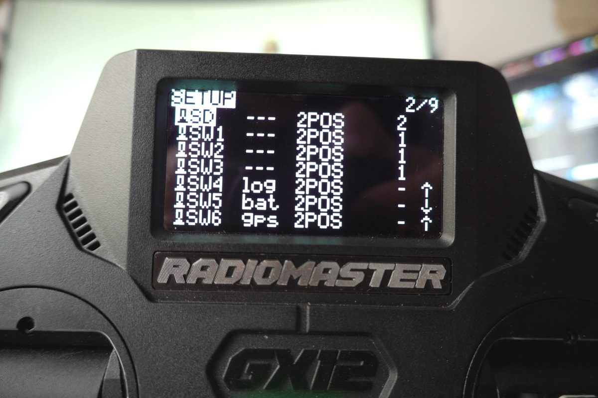
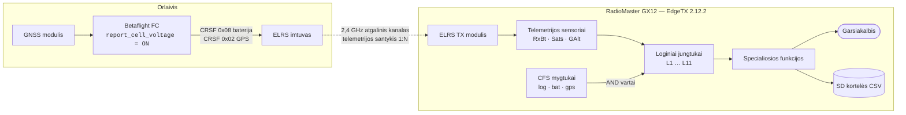
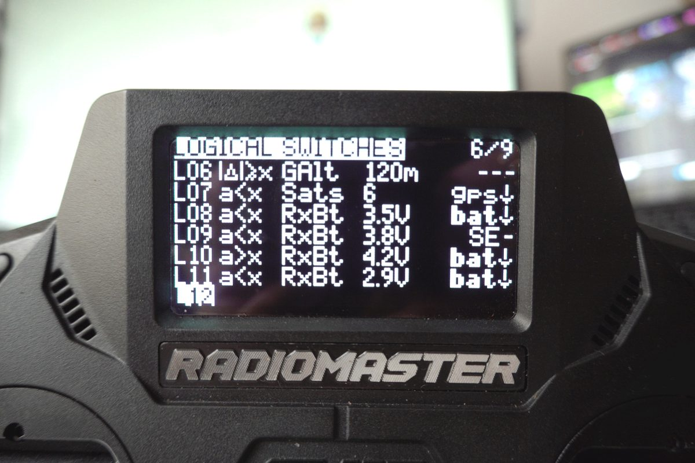
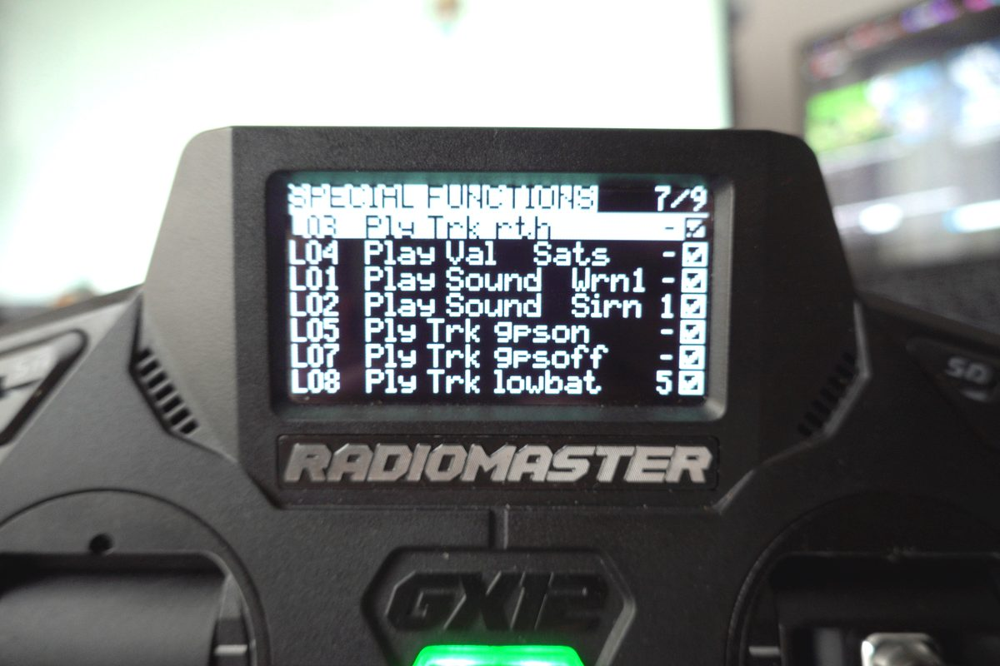
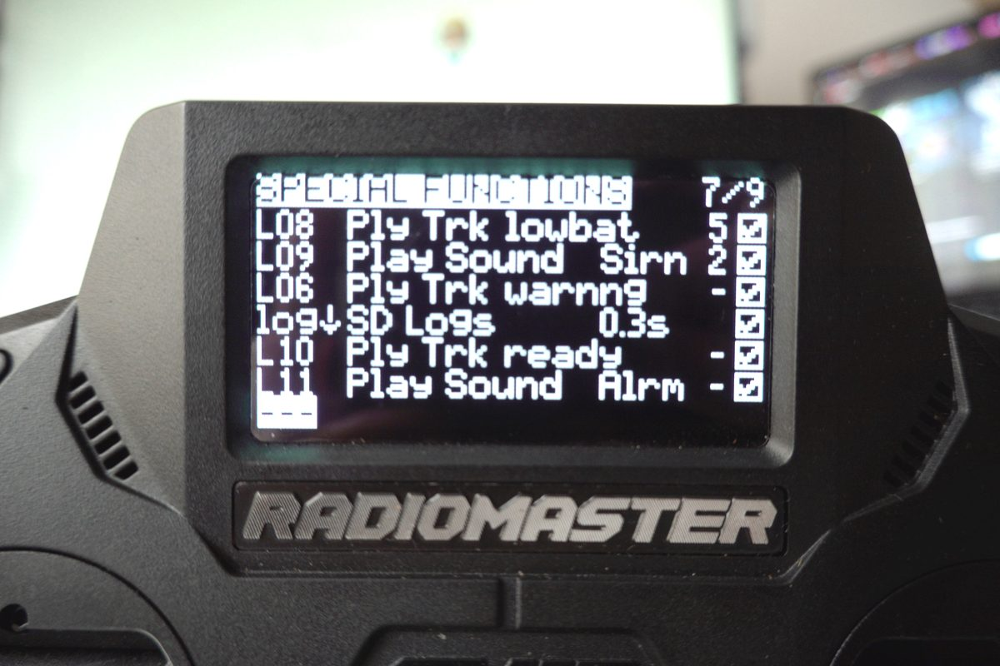

Tą skrydį žinai. Esi gerokai nuskridęs, reljefas geras, linijos plaukia, o tu
visas esi akiniuose. Kažkur OSD kamputyje įtampos skaičius jau pusantros minutės
tyliai leidžiasi, ir tu į jį nė karto nepažiūrėjai — nes buvai užsiėmęs skridimu.
Tada OSD pradeda mirksėti, ir tu suskaičiuoji: atstumas iki namų, priešpriešinis
vėjas, likęs įtampos kritimas. Ir skaičiai atsako: ne.

Tas skrydis baigiasi pasivaikščiojimu. Kartais — pasivaikščiojimu su maišeliu.

Labiausiai mane šiame gedimo scenarijuje visada trikdė tai, kad tai yra
**tik** sąsajos problema. Duomenys buvo visą laiką. Pultas žinojo. Dronas žinojo.
Vienintelė sulūžusi grandies vieta buvo ta, kad informacija buvo pateikta
mažais švytinčiais skaitmenimis periferiniame lauke žmogui, kuris tuo metu
koncentravosi į visai kitą dalyką.

## Tikras orlaivis su tavimi taip nepasielgtų

Štai kas man pasirodė absurdiška. Pasodink pilotą į „Cessną“ ir orlaivis
neleis, kad mažo kuro būklė būtų vizualinė detalė, kurią gali praleisti. Jis
pasakys. Garsiai. Ir pakartos. Įspėjimai apie neišleistą važiuomenę, apie
kritinį atakos kampą, aukščio pranešimai, įspėjimai apie reljefą — visas
šimtmetis aviacijos žmogiškųjų faktorių inžinerijos susivedė į vieną išvadą:
**laiko atžvilgiu kritinėms būsenos kaitoms garsas nugali vaizdą, nes garsui
nereikia, kad pilotas kur nors pažiūrėtų.**

Ir vis dėlto standartinė FPV konfigūracija 250 gramų orlaiviui, kurio skrydžio
laikas keturios minutės, yra... skaičius ekrano kampe.

Tai aš tai sutvarkiau. Mano GX12 dabar su manimi kalba. Ne Lua skriptu, ne kažkuo
egzotišku — tiesiog EdgeTX loginiais jungtukais ir specialiosiomis funkcijomis,
kurios programinėje įrangoje sėdėjo visą laiką.

Tai pirmas kartas, kai tai susikonfigūravau, ir noriu pasakyti atvirai:
**kai kurias dalis galima padaryti kur kas mažiau nerangiai.** Parodysiu
konkrečiai, kur mano variantas nerangus ir kodėl — nes tai naudingiau nei
apsimesti, kad viską padariau teisingai iš pirmo karto. Bet esmė veikia, ir
vienas konkretus įspėjimas — pranešimas „grįžk namo“ maždaug prie pusės
talpos — man tikrai išgelbėjo skrydžius tolimose misijose. Jis duoda signalą
pradėti planuoti kelią atgal, kol dar turiu energijos biudžetą tai padaryti, o
ne atrasti problemą tada, kai biudžetas jau išleistas.


## Nulinis žingsnis: tegu visi dronai kalba ta pačia kalba

Tai vienintelis pakeitimas, dėl kurio visa sistema tampa įmanoma, ir jis
atliekamas skrydžio valdiklyje, ne pulte.

Pagal nutylėjimą CRSF baterijos kadras praneša **paketo įtampą**. Kaip visai
flotilei bendras slenkstis tai yra nenaudinga, nes mano flotilė apima nuo 1S
iki 4S. Slenkstis „3,5 V“ nieko nereiškia, kai vienas aparatas skrenda su vienu
18650 elementu, o kitas — su 4S LiHV paketu. Man reikėtų atskiro slenksčių
rinkinio kiekvienam modeliui, palaikomo ranka, amžinai.

Todėl visiems aparatams nustačiau pranešti **vidutinę celės įtampą**.
Betaflight'e tai vienas parametras:

```text
set report_cell_voltage = ON
save
```

Tas pats yra ir Betaflight konfigūratoriuje, skirtuke *Power & Battery* —
„Report cell voltage instead of pack voltage in telemetry“. Skrydžio valdiklis
padalija paketo įtampą iš savo nustatyto celių skaičiaus dar prieš tai, kai
reikšmė pasiekia telemetrijos kadrą.

Dabar `3,5 V` reiškia tą patį fizinį dalyką ir ant 1S whoop'o, ir ant 2S
riperių, ir ant 4S trijų colių. Vienas slenksčių laiptų rinkinys visai flotilei.

> **Dėl INAV atitikmens:** visi čia aktualūs aparatai pas mane skrenda su
> Betaflight, tad patikrinta tik Betaflight'e. Jei naudoji INAV — pasitikrink
> parametro pavadinimą, o nedaryk prielaidos, kad jis identiškas. Aš to
> neišmatavau.

### Kodėl nedalinti EdgeTX pusėje?

Galima. EdgeTX leidžia telemetrijos sensoriui nustatyti savą **Ratio** koeficientą,
tad galėtum leisti valdikliui pranešti paketo įtampą ir dalinti iš celių
skaičiaus jau pulte.

Aš to sąmoningai nedariau, ir tai matosi konfigūracijoje — RxBt sensoriui
netaikoma jokia korekcija:

```yaml
telemetrySensors:
   14:
      id1:
         id: 8              # CRSF kadras 0x08, BATTERY_SENSOR
      id2:
         instance: 0
      label: "RxBt"
      unit: 1               # voltai
      prec: 1               # vienas skaičius po kablelio
      cfg:
         custom:
            ratio: 0        # be mastelio
            offset: 0       # be poslinkio
```

Dvi priežastys daryti tai orlaivyje:

1. **Pulte koeficientas yra vienam modeliui, o celių skaičius — vienam
   paketui.** Dalyba iš keturių pulto pusėje tampa neteisinga tą pačią
   sekundę, kai tą patį aparatą paskraidinu su 3S paketu.
2. **LiHV sugriauna fiksuotą spėjimą.** Mano trijų colių skrenda su 4S LiHV —
   4,35 V celei pilnai įkrautas, tai yra 17,4 V pakete. Pultas, kuriam pasakyta
   „laikyk, kad 4S“, susitvarko, bet pultas, kuris *bando nustatyti* celių
   skaičių iš jau padalintos reikšmės — ne. Skrydžio valdiklis savo celių skaičių
   jau žino iš tikros nustatymo logikos. Tegu skaičiuoja tas, kuris žino.

Kompromisas atviras: darant tai valdiklio pusėje, kiekvienam naujam aparatui
reikia tos CLI eilutės, ir jei pamirši, įspėjimai suveiks absurdišku momentu.
Man taip nutiko lygiai vieną kartą — to pakako, kad tai atsirastų paruošimo
sąraše.

## Visi laiptai stovi ant kalibracijos, kurios tu tikriausiai nepadarei

Šį skyrių turiu įterpti iškart po ankstesniojo, nes visa, kas seka, nuo jo
priklauso, ir nenoriu, kad kas nors tai statytų ant blogo pamato.

**Tavo baterijos įspėjimai yra būtent tokie geri, kokia yra tavo įtampos
kalibracija.**

Užrašyta tai skamba akivaizdžiai. Praktikoje neakivaizdu, nes blogai
sukalibruotas įtampos rodmuo neatrodo sugedęs. Jis atrodo kaip visiškai
tikėtinas skaičius, kuris tiesiog klysta 200 mV, ir kiekvienas aukščiau esančių
laiptų slenkstis tą klaidą tyliai paveldi.

Turiu du aparatus, kurie šiuo metu yra blogai sukalibruoti — vadinasi, **jų
įspėjimai suveikia per vėlai.** Ne „šiek tiek netiksliai“, o per vėlai, ta
kryptimi, kuri kainuoja paketą. Aš tai žinau ir dar nesutvarkiau — būtent tokiems
prisipažinimams šis blogas ir egzistuoja.

Reguliavimo parametras yra `vbat_scale` Betaflight'e. Jis pataiso ADC daliklio
santykį pagal realius tavo plokštės rezistorius, kurie tarp plokščių skiriasi, o
nustatytas jis yra į bendrą numatytąją reikšmę, kuri tinka niekam konkrečiai.

### 3S → 4S spąstai

Konkretus būdas, kuriuo tai mane pagavo, vertas išvardijimo, nes tai natūralus
veiksmas ir jokio įspėjimo nėra.

Turėjau aparatus, sukonfigūruotus ir skraidančius su **3S**, o tada perkėliau
juos į **4S** testams. Niekas tame perėjime nepasako, kad tavo kalibracija dabar
kainuoja daugiau. Bet kainuoja — dėl kaupiamosios priežasties.

`report_cell_voltage = ON` reiškia, kad valdiklis dalija paketo įtampą iš savo
**nustatyto** celių skaičiaus. Ir tas nustatymas pats yra išvestas iš išmatuotos
paketo įtampos įjungimo metu — valdiklis dalija tai, ką perskaito, iš
maksimalios celės įtampos konstantos ir apvalina. Tad įtampos klaida
propaguojasi **du kartus**:

1. Tiesiogiai — į pranešamą vienos celės reikšmę.
2. Galimai dar kartą — nustumdama nustatytą celių skaičių į neteisingą sveikąjį
   skaičių.

Antrasis kelias yra bjaurusis, nes jis suklysta *tyliai ir tikėtinai*. Jei
blogai sumastelintas 4S paketas perskaitomas pakankamai žemai, kad valdiklis
nuspręstų, jog žiūri į 3S, tai jis dalija iš trijų, o ne iš keturių — ir pultui
atiduoda vienos celės reikšmę, kuri patogiai sėdi normaliame diapazone, būdama
visiškai fiktyvi. Tada kiekvienas mano laiptų slenkstis matuotų dydį, kurio
nėra, o `ready` savitikra puikiai suveiktų, nes neteisingas skaičius virš 4,2 V
vis tiek yra skaičius virš 4,2 V.

Savitikra, kuria taip džiaugiausi anksčiau šiame įraše, patikrina, ar veikia
signalo kelias. **Ji nepatikrina, ar skaičius yra tikras.** Tai skirtingi
teiginiai, ir noriu būti aiškus, kurį iš jų turiu.

### Regresija naujame konfigūratoriuje

Štai praktinis nepatogumas, ir būtent dėl jo tai gaus atskirą įrašą, o ne
pastraipą.

Anksčiau kalibruodavau taip: pakeldavau motorus iki nedidelės apkrovos —
maždaug 2 A iš paketo — ir tada perjungdavau į kalibracijos skirtuką **motorams
vis dar veikiant**, kad kalibruotų realiame darbo taške, o ne tuščiąja eiga. Tai
svarbu: nori, kad rodmuo būtų patikimas ten, kur jį realiai naudoji — po
apkrova, ne tik ramybėje ant stalo.

Dabartiniame Betaflight konfigūratoriuje taip nebegalima. **Išėjus iš skirtuko
motorai išsijungia.** Tos darbo sekos tiesiog nebėra.

Teisingos pakeičiančios procedūros dar neišsiaiškinau, tad jos čia neišradinėsiu.
Tai bus sekantis įrašas: tinkama įtampos kalibracija su dabartiniu
konfigūratoriumi, kas pasikeitė, ir kaip gauti patikimą rodmenį po apkrova be
senojo triuko.

### Viena atvira pastaba apie skaičių, esantį toliau šiame įraše

3,065 V celei įtampos kritimo reikšmė, kurią cituoju toliau — iš 83 A
akceleravimo mano trijų colių aparate — turi tą pačią priklausomybę. Tai yra tai,
ką skrydžio valdiklis *užrašė*, ir jos tikslumas stovi ant to, kad to aparato
įtampos kalibracija yra tvarkinga. To konkretaus aparato `vbat_scale` prieš
etaloninį matuoklį nepatikrinau nepriklausomai. Traktuok tai kaip stiprų
problemos formos rodiklį, o ne kaip metrologiškai švarų matavimą.

Jei sukursi šiame įraše aprašytą įspėjimų sistemą ir praleisi kalibraciją,
sukūrei kažką, kas ramiu balsu užtikrintai pasakys tau neteisingą dalyką. Tai,
ko gero, blogiau nei skaičius ekrano kampe.

## Trys mygtukai, trys spalvos, trys posistemės

GX12 turi šešis papildomus mygtukus virš svirčių. Tai EdgeTX
**konfigūruojami funkciniai jungtukai** (CFS) — kiekvieną galima pavadinti,
priskirti pradinę būseną ir RGB spalvą, kurią pultas tikrai užsidega.

Naudoju antrą trijų mygtukų grupę ir spalvas priskyriau taip, kad visos
įspėjimų sistemos būseną galėčiau patvirtinti vienu žvilgsniu į pultą — dar
prieš užsidėdamas akinius, nes tai vienintelė akimirka, kai į pultą iš tikrųjų
žiūriu.


| Mygtukas | Pavadinimas | Spalva | Pradinė būsena | Ką valdo |
|----------|-------------|--------|----------------|----------|
| SW4 | `log` | Raudona | **Išjungta** | Telemetrijos įrašymas į SD kortelę |
| SW5 | `bat` | Žalia | **Įjungta** | Visi baterijos įtampos įspėjimai |
| SW6 | `gps` | Mėlyna | **Išjungta** | Visi GPS / palydovų pranešimai |

Baterijos įspėjimai pagal nutylėjimą **įjungti** — būtent to niekada nenoriu
turėti prisiminti. GPS pranešimai išjungti, nes ant whoop'ų ir analoginių
riperių GNSS modulio nėra visai, ir nenoriu „GPS pamestas“ sirenos kiekvieno
skrydžio metu. Įrašymas išjungtas, nes jis pripildo SD kortelę.

Štai dalis, kurią teko išsiaiškinti: **GX12 pulte modeliui priklausantis CFS
blokas viršija pulto lygio jungtukų konfigūraciją.** Abiejuose failuose yra
SW4/5/6 įrašai. Pulto lygio įrašas `radio.yml` faile yra atsarginis; realiai
veikia modelio YAML esantis `customSwitches` blokas.

```yaml
# model00.yml — būtent šis blokas nugali
customSwitches:
   SW4:
      name: "log"
      type: 2POS
      group: 0              # 0 = nepriklausomas perjungimas
      start: START_OFF
      onColor:  { r: 63, g:  0, b:  0 }   # raudona
      offColor: { r:  2, g:  2, b:  2 }
   SW5:
      name: "bat"
      type: 2POS
      group: 0
      start: START_ON       # baterijos įspėjimai aktyvūs iš karto
      onColor:  { r:  0, g: 40, b:  2 }   # žalia
      offColor: { r:  4, g:  0, b:  0 }
   SW6:
      name: "gps"
      type: 2POS
      group: 0
      start: START_OFF
      onColor:  { r:  0, g:  0, b: 63 }   # mėlyna
      offColor: { r:  2, g:  2, b:  2 }
```

`group: 0` reiškia nepriklausomą perjungimą. Mano SW1/SW2/SW3 yra `group: 1`,
todėl veikia kaip vienas kitą išjungiantys mygtukai — patogu, pavyzdžiui,
VTX galios lygiui rinkti, ir netinka trims nepriklausomoms įspėjimų posistemėms.

Kai mygtukai pavadinti, EdgeTX visur rodo *pavadinimus*, o ne `SW52`, ir loginių
jungtukų puslapis pasidaro įskaitomas:



## Signalo kelias

Prieš lenteles — visas kelias nuo celės iki garso:



Pagrindinė struktūrinė idėja yra **AND vartai**. Kiekvienas loginis jungtukas
turi `andsw` lauką — antrą sąlygą, kuri taip pat turi būti tenkinama. Būtent tai
vienuolika nepriklausomų slenksčio detektorių paverčia trimis perjungiamomis
posistemėmis. Slenksčių logika ir aktyvavimo logika yra aiškiai atskirtos, ir
man niekada nereikia redaguoti slenksčių, kad nutildyčiau posistemę.

## Loginiai jungtukai

Vienuolika. Pirma ekranai, tada YAML, tada kam kiekvienas skirtas.




Viena detalė, kuri sutaupys tau painiavos skaitant YAML: **`logicalSw` blokas
indeksuojamas nuo nulio, o sąsajos etiketės — nuo vieneto.** `logicalSw: 2:` yra
tas jungtukas, kurį pultas vadina `L3`. Lygiai taip pat `tele(14)` yra nuo nulio
skaičiuojamas indeksas `telemetrySensors` sąraše — mano faile tai `RxBt`.

```yaml
logicalSw:
   0:                              # = L1
      func: FUNC_VNEG              # a < x
      def: "tele(14),40"           # RxBt < 4,0 V   (prec:1, tad 40 = 4,0)
      andsw: "SW52"                # IR  bat mygtukas įjungtas
   1:                              # = L2
      func: FUNC_VNEG
      def: "tele(14),36"           # RxBt < 3,6 V
      andsw: "SW52"
   2:                              # = L3   <-- tas, kuris gelbsti skrydžius
      func: FUNC_VNEG
      def: "tele(14),38"           # RxBt < 3,8 V
      andsw: "SW62"                # IR  gps mygtukas įjungtas
   3:                              # = L4
      func: FUNC_VPOS              # a > x
      def: "tele(22),6"            # Sats > 6
      andsw: "SW62"
   4:                              # = L5
      func: FUNC_VPOS
      def: "tele(22),13"           # Sats > 13
      andsw: "SW62"
   5:                              # = L6
      func: FUNC_ADIFFEGREATER     # |delta| >= x   <-- žr. pastabą žemiau
      def: "tele(21),120"          # GAlt, 120 m
      andsw: "NONE"                # visada aktyvus
   6:                              # = L7
      func: FUNC_VNEG
      def: "tele(22),6"            # Sats < 6
      andsw: "SW62"
   7:                              # = L8
      func: FUNC_VNEG
      def: "tele(14),35"           # RxBt < 3,5 V
      andsw: "SW52"
   8:                              # = L9
      func: FUNC_VNEG
      def: "tele(14),38"           # RxBt < 3,8 V
      andsw: "SE1"                 # <-- liekana, žr. „Kas čia nerangu“
   9:                              # = L10
      func: FUNC_VPOS
      def: "tele(14),42"           # RxBt > 4,2 V
      andsw: "SW52"
   10:                             # = L11
      func: FUNC_VNEG
      def: "tele(14),29"           # RxBt < 2,9 V
      andsw: "SW52"
```

Kiekvienas iš jų turi `delay: 0` ir `duration: 0`. Įsidėmėk tai.

## Specialiosios funkcijos

Čia loginė reikšmė tampa garsu.




```yaml
customFn:
   0:  { swtch: "L3",   func: PLAY_TRACK, def: "rth,1,1x"     }
   1:  { swtch: "L4",   func: PLAY_VALUE, def: "tele(22),1,1x" }
   2:  { swtch: "L1",   func: PLAY_SOUND, def: "Wrn1,1,1x"    }
   3:  { swtch: "L2",   func: PLAY_SOUND, def: "Sirn,1,1"     }
   4:  { swtch: "L5",   func: PLAY_TRACK, def: "gpson,1,1x"   }
   5:  { swtch: "L7",   func: PLAY_TRACK, def: "gpsoff,1,1x"  }
   6:  { swtch: "L8",   func: PLAY_TRACK, def: "lowbat,1,5"   }
   7:  { swtch: "L9",   func: PLAY_SOUND, def: "Sirn,1,2"     }
   8:  { swtch: "L6",   func: PLAY_TRACK, def: "warnng,1,1x"  }
   9:  { swtch: "SW42", func: LOGS,       def: "3,1"          }
   10: { swtch: "L10",  func: PLAY_TRACK, def: "ready,1,1x"   }
   11: { swtch: "L11",  func: PLAY_SOUND, def: "Alrm,1,1x"    }
```

Trečias `def` laukas yra pakartojimo intervalas. `1x` reiškia „paleisti vieną
kartą per suveikimą“. `1` reiškia kas sekundę, `5` — kas penkias sekundes. Tas
skirtumas svarbesnis, nei atrodo — žr. žemiau.

Bendra elgsena yra tokia:

### Baterijos laiptai — žalias mygtukas

| Vienai celei | Jungtukas | Garsas | Kartojimas | Reikšmė |
|--------------|-----------|--------|------------|---------|
| **> 4,2 V** | L10 | `ready` | vieną kartą | Šviežias paketas — sistema aktyvi ir kalba |
| **< 4,0 V** | L1 | `Wrn1` | vieną kartą | Jau skrendi, laikrodis tiksi |
| **< 3,8 V** | L3 | `rth` | vieną kartą | *Maždaug pusė talpos — apsisuk* |
| **< 3,6 V** | L2 | `Sirn` | 1 s | Grįžk namo |
| **< 3,5 V** | L8 | `lowbat` | 5 s | Leiskis, kur bebūtum |
| **< 2,9 V** | L11 | `Alrm` | vieną kartą | Paketą jau sugadinai |

`ready` pranešimas prie > 4,2 V yra mano mėgstamiausias mažas triukas. Tai ne
įspėjimas — tai **savitikra**. Kai įjungiu bateriją ir pultas pasako „ready“,
vienu žodžiu ką tik patvirtinau, kad: telemetrija teka, RxBt sensorius gyvas,
`report_cell_voltage` tikrai nustatytas *šiame* aparate ir garso kelias veikia.
Visi keturi visos sistemos gedimo scenarijai patikrinti vienu žodžiu, dar prieš
pakylant. Jei įjungus bateriją pultas tyli — kažkas grandinėje sugedę, ir noriu
tai žinoti *dabar*, o ne 800 metrų atstumu.

Išlyga dėl LiHV: 4,35 V celei paketas 4,2 V slenkstį pralekia lengvai, tad
`ready` suveikia patikimai. Tuo tarpu LiPo, savaitę pastovėjęs lentynoje,
savaime išsikrauna maždaug iki 4,15 V ir slenksčio gali niekada nepasiekti. Tai,
tiesą sakant, teisinga elgsena — jis man pasako, kad paketas nėra pilnas.

**`rth` pranešimas prie 3,8 V yra tas, kuris tikrai išgelbėjo skrydžius.** Tai
grubus pusės talpos apytikslis vertinimas, sudarytas iš įtampos, o ne iš
kulonų, ir nesiruošiu apsimesti, kad jis tikslus. Bet jam ir nereikia būti
tiksliam. Jam reikia atvykti *tada, kai dar turiu energijos biudžetą į jį
sureaguoti* — o to kulonų skaitiklis, į kurį nežiūriu, nepasiekia. Atkreipk
dėmesį, kad jis pririštas prie **gps** mygtuko, o ne prie baterijos mygtuko: tai
tolimų misijų įspėjimas, o ant whoop'o viešbučio kambaryje jis būtų tik triukšmas.

Ir dar viena dalis apie tolimus skrydžius, nes ji nėra pasirenkama ir jokia
telemetrija jos nepakeičia: mano žmona visą laiką binokliu palaiko vizualų
kontaktą su orlaiviu. Garsiniai įspėjimai pasako apie *orlaivio* būklę. Apie
oro erdvę jie nepasako nieko.

### GPS pranešimai — mėlynas mygtukas

Palydovų skaičius yra tikrai netinkamas dalykas stebėti vizualiai, nes
akimirka, kai jis svarbiausias, yra ta pati akimirka, kai mažiausiai gali
pažiūrėti.

| Sąlyga | Jungtukas | Garsas | Reikšmė |
|--------|-----------|--------|---------|
| Sats > 6 | L4 | *įgarsina skaičių* | Artėja prie naudojamo — kiek dar? |
| Sats > 13 | L5 | `gpson` | Tvirtas fiksavimas, gelbėjimu galima tikėtis |
| Sats < 6 | L7 | `gpsoff` | **Fiksavimas pablogėjo skrydžio metu** |

`PLAY_VALUE` ant L4 yra maloniausia dalis — vietoj fiksuoto tono jis įgarsina
tikrą palydovų skaičių. Tad kol laukiu ant žemės, girdžiu „septyni“,
„devyni“, „vienuolika“, kai fiksavimas kaupiasi, ir žinau, ar laukti dar, ar
mesti — neatblokavęs pulto ekrano.

Realiai svarbus slenkstis yra **6**, nes maždaug ties tuo GPS Rescue tampa
kažkuo, kuo galima pasitikėti — ir tikslus skaičius visiškai priklauso nuo tavo
gelbėjimo konfigūracijos Betaflight'e arba INAV'e. Nustatyk jį pagal *savo*
`gps_rescue_min_sats`, ne pagal manąjį.

`gpsoff` įspėjimas prie Sats < 6 yra tas, kurio nesitikėjau, o dabar laikau
būtinu. **Akrobatika mažina palydovų skaičių.** Apversk aparatą — ir plokštelinė
antena nukreipta į žemę; stiprūs flipai bei power loop'ai skaičių numuša
reguliariai. Jei taip nutinka tolimo skrydžio metu ir aš apie tai nežinau,
skrendu su neveiksiančia gelbėjimo funkcija tikėdamas, kad turiu apsaugą. Vienas
žodis ausyje tai išsprendžia.

### Aukščio signalas — visada aktyvus

L6 turi `andsw: "NONE"` — jis aktyvus kiekvieno skrydžio metu, kiekviename
aparate. Skraidau pagal EASA A1/A3, ir 120 m nuo žemės riba nėra pageidavimas.

Bet čia turiu būti atviras dėl savo konfigūracijos, nes YAML perskaitymas man
apie ją kai ką atskleidė:

```yaml
   5:
      func: FUNC_ADIFFEGREATER    # |delta| >= x
      def: "tele(21),120"
```

`FUNC_ADIFFEGREATER` yra `|Δ| ≥ x` — **skirtumo** funkcija. Ji suveikia ne tada,
kai aukštis *viršija* 120 m. Ji suveikia, kai aukštis *pasikeitė* 120 m nuo savo
atskaitos taško.

Galėčiau apsimesti, kad taip ir suplanavau. Pasakysiu kitką: pasirodo, tai
labiau pagrįstas pasirinkimas, ir priežastis verta suprasti.

**`GAlt` CRSF telemetrijoje yra GPS aukštis, o ne aukštis virš pakilimo taško.**
Jei būčiau panaudojęs akivaizdų `a > x` su `GAlt` ir 120 m slenksčiu, jis rėktų
nuolat ir nuolatos — nes skraidau Lietuvoje, kur pati žemė yra maždaug
70–150 m virš jūros lygio. Signalas būtų teisingas dar prieš aparatui pakylant
iš rankos.

Skirtumo funkcija tai visiškai apeina: ji matuoja *pokytį*, tad atskaita yra
ten, kur pradėjau, ir 120 m pakilimo yra 120 m pakilimo nepriklausomai nuo
lauko aukščio. Tai gerokai artimiau AGL nei absoliutus GPS aukštis.

Tai nėra tobula, ir noriu netobulumus pavadinti, o ne užglaistyti:

- Jis suveikia ir nusileidus 120 m, nes tai absoliutus skirtumas. Nuskrisk nuo
  slėnio krašto — ir jis įspės.
- Suveikęs jis atnaujina atskaitą, tad vėl užsiveda ir suveikia po *sekančio*
  120 m pokyčio, o ne lieka užfiksuotas virš ribos.
- Tai įspėjimas, o ne riba. Jis pasako, kad pakilau aukštai. Laikytis
  reikalavimų vis tiek yra mano darbas.

**Būtent šią dalį labiausiai norėčiau pagerinti, ir geresnio varianto dar
neišmatavau.** Tikras atsakymas tikriausiai būtų išvesti realų aukštį nuo
pakilimo taško, kurį barometras jau duoda OSD, bet kuris nepasiekia `GAlt`
telemetrijos sensoriaus. Jei tai išsprendei EdgeTX'e gražiai — noriu išgirsti.

## Telemetrijos įrašymas ir tas skaičius, kurį turi išmatuoti pats

Raudonas mygtukas valdo `LOGS` su `def: "3,1"` — **0,3 sekundės** įrašymo
periodu, rašant CSV į SD kortelę. Čia turiu nustoti teigti ir pradėti rodyti
namų darbus, nes atviras atsakymas yra tas, kad svarbiausio dalyko neišmatavau.

Įrašo tikslumo nenustato įrašymo periodas. Jį riboja du dalykai iš eilės, ir
įrašymo periodas yra *antrasis*:

1. **ELRS telemetrijos santykis** — kaip dažnai radijo kanalas apskritai skiria
   laiko tarpą atgaliniam ryšiui.
2. **CRSF kadrų ciklinė eilė** — valdiklis turi kelis skirtingus kadrų tipus, ir
   kiekviena telemetrijos galimybė nuveža vieną iš jų.
3. **EdgeTX įrašymo periodas** — kaip dažnai pultas nuskaito paskutinę gautą
   reikšmę.

Mano paties sensorių sąrašas antrą punktą padaro konkrečiu. Sugrupavus sensorius
pagal jų CRSF kadro ID:

| CRSF ID | Kadro tipas | Kokius sensorius nuveža |
|---------|-------------|-------------------------|
| `0x02` | GPS | `GPS`, `GSpd`, `Hdg`, `GAlt`, `Sats` |
| `0x08` | BATTERY_SENSOR | `RxBt`, `Curr`, `Capa`, `Bat%` |
| `0x1E` | ATTITUDE | `Ptch`, `Roll`, `Yaw` |
| `0x21` | FLIGHT_MODE | `FM` |
| `0x14` | LINK_STATISTICS | `1RSS`, `2RSS`, `RQly`, `RSNR`, `ANT`, `RFMD`, `TPWR`, `TRSS`, `TQly`, `TSNR` |

Atkreipk dėmesį, kad `Sats` ir `GAlt` atkeliauja **kartu**, tame pačiame kadre —
jie niekada negali būti nesinchronizuoti tarpusavyje. Bet `RxBt` gyvena visai
kitame kadre, todėl atsinaujina nepriklausomai ir lėčiau nei grynas telemetrijos
tarpų greitis.

```wave
{ "signal": [
  { "name": "RF paketai",        "wave": "p................" },
  { "name": "telem. tarpas 1:4", "wave": "0..10..10..10..10" },
  { "name": "CRSF kadras",       "wave": "x..3x..4x..5x..6x",
    "data": ["GPS 0x02", "BATT 0x08", "ATT 0x1E", "FM 0x21"] },
  { "name": "RxBt naujas",       "wave": "0.....1.........." }
],
  "head": { "text": "Telemetrijos tarpai cikliškai keičia CRSF kadrų tipus" }
}
```

Naivi aritmetika: esant 500 Hz paketų greičiui ir 1:4 telemetrijos santykiui
gauni 125 atgalinius tarpus per sekundę, o cikliškai kaitaliojant keturis
skrydžio duomenų kadrų tipus `RxBt` atsinaujintų maždaug 31 kartą per sekundę.
Tokiu atveju 0,3 s įrašymo periodas *stipriai* per retai imtų reikšmes — įrašyčiau
vieną tašką iš dešimties ir praleisčiau kiekvieną įtampos kritimo momentą.

**Bet aš tuo skaičiumi netikiu, ir tu irgi neturėtum.** Tai aritmetika iš kadrų
struktūros, o ne matavimas. Ji ignoruoja tai, kad ELRS telemetrijos tarpai
neveža daug duomenų, o CRSF GPS kadras yra palyginti didelis, tad vienas kadras
suskaidomas per kelis tarpus. Realus vieno sensoriaus greitis yra mažesnis nei
31 Hz, galbūt gerokai, ir kiek — nenustačiau.

Bet štai kas — **matavimas jau guli mano SD kortelėje, ir tavo taip pat.**
Įrašymo periodas yra 0,3 s. Jei sensorius tikrai atkeliauja dažniau, kiekviena
eilutė turi naują reikšmę. Jei rečiau — CSV faile bus *iš eilės pasikartojančių
identiškų reikšmių serijos*, o vidutinis serijos ilgis yra būtent santykis tarp
tikro atvykimo intervalo ir įrašymo periodo.

Taigi: suskaičiuok pasikartojančių reikšmių serijas kiekviename stulpelyje. Tai
duoda tikrą kiekvieno sensoriaus atsinaujinimo greitį — kiekvienam aparatui,
kiekvienam telemetrijos santykiui, be jokių prielaidų. Tada nustatyk įrašymo
periodą pagal tai, o telemetrijos santykį rinkis sąmoningai, žinodamas, kad
mažas santykis nupirks ryšio tvirtumą tiesiogine įrašo skiriamosios gebos
kaina.

Būtent tai ir yra sekantis dalykas, kurį tikrai padarysiu, ir jis gaus atskirą
įrašą su tikrais skaičiais.

Dar viena išmatuota detalė, kurią verta pažymėti: ELRS telemetrijos santykio
**modelio YAML faile nėra**. Mano `moduleData` blokas turi tik tai:

```yaml
moduleData:
   0:
      type: TYPE_CROSSFIRE
      subType: 0
      channelsStart: 0
      channelsCount: 16
      failsafeMode: NOT_SET
      mod:
         crsf:
            telemetryBaudrate: 0
```

Santykio lauko nėra, nes santykis gyvena pačiame TX modulyje ir konfigūruojamas
per ELRS Lua skriptą. Vadinasi, **dalinantis modelio YAML failu telemetrijos
santykiu nepasidalinama.** Jei nusikopijuosi mano konfigūraciją, o įrašai
atrodys kitaip nei mano — pirmiausia žiūrėk būtent čia.

## Kas čia nerangu

Sakiau, kad būsiu konkretus. Perskaitęs savo konfigūraciją šviežiomis akimis,
štai kas joje ne taip.

### 1. Slenksčiai sluoksniuojasi, ir sirenos kraunasi vienas ant kito

`a < x` yra **lygio**, o ne krašto tikrinimas. Nukritęs žemiau 3,5 V, tuo pačiu
esi ir žemiau 3,6 V, ir žemiau 4,0 V, ir žemiau 3,8 V. Visi tie loginiai
jungtukai yra teisingi vienu metu.

Prie 3,4 V celei mano pultas vykdo:

| Jungtukas | Būsena | Garsas | Kartojimas |
|-----------|--------|--------|------------|
| L1 (< 4,0) | teisinga | `Wrn1` | vieną kartą — jau suveikė, tyli |
| L3 (< 3,8) | teisinga | `rth` | vieną kartą — jau suveikė, tyli |
| L2 (< 3,6) | teisinga | `Sirn` | **kas 1 s, be galo** |
| L8 (< 3,5) | teisinga | `lowbat` | **kas 5 s, be galo** |

Taigi žemiau 3,5 V girdžiu sireną kas sekundę *ir* ištartą „low battery“ kas
penkias sekundes, vienas ant kito. Tuo momentu tai turbūt net gerai — dėmesį
tikrai atkreipia — bet tai nėra *informatyvu*. Sirena, kuri niekada nenustoja,
neperduoda daugiau informacijos nei sirena, kuri suveikia vieną kartą.

Sprendimas — padaryti kiekvieną laiptelį išskirtinį, sujungiant kiekvieną
slenkstį su žemiau esančio slenksčio negacija: „žemiau 3,6 **ir ne** žemiau
3,5“. EdgeTX tai gali antru loginių jungtukų sluoksniu. Aš dar neperdariau.

### 2. Nulinis atkirtimo laikas, visur

Kiekvienas loginis jungtukas turi `delay: 0, duration: 0`. Filtravimo nėra
jokio, o tai reiškia, kad **bet koks trumpalaikis įtampos kritimas sukelia
nuolatinį įspėjimą.**

Man tai nėra teorija. Mano trijų colių 4S aparate juodosios dėžės įrašas iš
staigaus akceleravimo parodė paketo įtampos kritimą iki **3,065 V celei** prie
83 A srovės — momentinis įvykis, visiškai atsistatęs po sekundės dalies. Tai yra
165 mV atsargos iki mano 2,9 V „paketą sugadinai“ signalo suveikimo — ir tai
pakete, kuriam viskas buvo gerai.

Įtampos kritimas nėra įkrovos lygis. Įtampos slenkstis be laiko kriterijaus
skirtumo pamatyti negali. 3,5 V ir 2,9 V laipteliai yra pažeidžiami, nes būtent
tokias reikšmes praeini po apkrova gerokai anksčiau, nei jas pasiekiam ramybėje.

EdgeTX įrankius turi: **Duration** reikalauja, kad sąlyga išsilaikytų N
sekundžių prieš jungtukui tampant teisingu, o **Delay** atideda perėjimą.
Uždėjus sekundės ar dviejų trukmę žemiesiems laipteliams, netikri signalai dėl
įtampos kritimo išnyktų beveik visiškai.

Neskelbsiu konkrečių skaičių, nes jų dar neišvedžiau iš savo įrašų, o rinktis
juos iš nuojautos būtų būtent tas spėjimas, prieš kurį visas šis įrašas ir
argumentuoja. Teisingas būdas — pasižiūrėti į savo juodosios dėžės įtampos
kritimų trukmių pasiskirstymą ir pasirinkti trukmę, ilgesnę už ilgiausią savo
akceleravimą. Tai matavimas, ir įrašus jam turiu.

### 3. Užsilikęs jungtukas

L9 yra `RxBt < 3,8 V IR SE1` — tas pats slenkstis kaip L3, bet pririštas prie
fizinio jungtuko SE, o ne prie gps mygtuko, ir paleidžia 2 sekundžių intervalu
pasikartojančią sireną. Į trijų mygtukų schemą jis netelpa, ir nebeatsimenu,
kam jis buvo. Tai ankstesnės iteracijos fosilija.

Paskelbtoje konfigūracijoje jį palieku, o ne tyliai išbraukiu, nes naudinga
pamoka yra ta, kad **taip nutinka.** Loginių jungtukų konfigūracijos kaupiasi.
Jei tokią sistemą susikursi — kur nors tekstiniame faile užsirašyk, *kam*
kiekvienas jungtukas skirtas, nes EdgeTX tam vietos neturi, o po pusės metų ir
tu neatsiminsi.

### 4. Jokio ryšio kokybės įspėjimo

Tai didžiausia reali spraga. Mano modelyje yra:

```yaml
rssiSource: none
rfAlarms:
   warning: 65
   critical: 35
```

Radijo signalo slenksčiai sukonfigūruoti, bet `rssiSource` yra `none` — tad
niekas nėra prijungta, kad juos paleistų. Tuo tarpu `RQly`, `RSNR`, `ANT` ir abu
`1RSS`/`2RSS` sensoriai sėdi sensorių sąraše, pilnai užpildyti, su `logs: 1`
kiekvienam iš jų, ir visiškai nenaudojami nė vieno loginio jungtuko.

Turint galvoje, kad visas šis projektas egzistuoja tam, kad nebeprašvilptum ribos,
į kurią nežiūrėjau, tai, kad nepritaikiau jo **ryšio kokybei** — ribai, kuri
skrydžius realiai baigia, krūme, toli nuo mašinos — yra praleidimas, kurį
pastebėjau rašydamas šį įrašą. `RQly < 70 → PLAY_TRACK "link"` yra maždaug
keturios minutės darbo ir tai sekantis punktas sąraše.

Ir yra dar blogiau — dėl to, kas būtent tie sensoriai yra. Žr. žemiau.

## Dalijimasis konfigūracija: kas perkeliama ir ką ištrinti

Noriu, kad tai būtų atkartojama, tad: taip, skelbk savo YAML. Bet du įspėjimai.

### Šiuos laukus ištrink prieš skelbdamas

EdgeTX nuo 2.9 versijos pulto konfigūraciją SD kortelėje saugo YAML formatu —
`radio.yml` pultui ir po vieną failą kiekvienam modeliui `/MODELS/` kataloge.
Abiejuose manuose yra registracijos ID:

```yaml
# radio.yml
ownerRegistrationID: " 24P42P-"

# model00.yml
modelRegistrationID: " 24P42P-"
```

Prieš skelbdamas konfigūraciją, patikrink ir ištrink:

- `ownerRegistrationID` / `modelRegistrationID`
- `bluetoothName`
- Savo **ELRS binding frazę** — jos modelio YAML faile nėra, ji gyvena TX
  modulyje, bet jei dalinsi ir modulio atsarginę kopiją, ta frazė iš esmės yra
  raktas į tavo orlaivius
- Modelių pavadinimus, jei jie tave identifikuoja
- Svirčių kalibraciją (`calib:`) — nekenksminga, bet niekam kitam nieko
  nereiškianti, o nukopijavus manąją tavo svirtys jausis netaisyklingai

### YAML perkeliamas mažiau, nei atrodo

Štai spąstai, ir jie tikri. Loginiai jungtukai į telemetrijos sensorius kreipiasi
**pagal poziciją**, ne pagal pavadinimą:

```yaml
def: "tele(14),40"     # sensoriaus vieta 14 — kuri *mano faile* yra RxBt
```

`tele(14)` nėra „RxBt“. Tai „kas atsitiktinai atsidūrė 14-oje vietoje sensorių
atradimo metu“. Vietų tvarka priklauso nuo to, kurie kadrai atėjo pirmi, kai
atradai sensorius, o tai priklauso nuo tavo valdiklio konfigūracijos ir nuo
eiliškumo, kuriuo viską įjungei. **Tavo pulte 14-oje vietoje gali būti visai
kas kita** — ir jei taip, mano loginiai jungtukai tyliai lygins įtampos slenkstį
su tavo kursu, o visa sistema elgsis taip, kad atrodys kaip magija.

Mano vietų tvarka, kad būtų su kuo lyginti:

```text
0  1RSS   1  2RSS   2  RQly   3  RSNR   4  ANT    5  RFMD
6  TPWR   7  TRSS   8  TQly   9  TSNR  10  FM    11  Ptch
12 Roll  13  Yaw   14  RxBt  15  Curr  16  Capa  17  Bat%
18 GPS   19  GSpd  20  Hdg   21  GAlt  22  Sats
```

Tad atviras patarimas, pageidaujamumo tvarka:

1. **Perskaityk šio įrašo lenteles ir suvesk viską ranka**, naudodamas savo
   sensorių pavadinimus. Tai penkiolika minučių, ir rezultatą tikrai suprasi —
   o tai svarbu tada, kai lauke norėsi pakeisti slenkstį.
2. Jei vis tiek įmesi mano YAML: ištrink savo atrastus sensorius, atrask juos iš
   naujo, o tada **patikrink vietą po vietos**, ar loginių jungtukų puslapio
   skaičiai rodo į tuos sensorius, į kuriuos manai, kad rodo. Sąsaja rodo
   pavadinimus, tad tai lengva — tik nepraleisk.
3. `radio.yml` yra pririštas prie plokštės (manasis sako `board: gx12`) ir prie
   versijos (`semver: 2.12.2`). Nekopijuok jo į kitą pultą.

## Individualūs garso failai: rth, gpson, gpsoff, lowbat, warnng, ready

Ištarti pranešimai yra individualūs WAV failai, ne integruoti garsai. Jų šeši:
`rth`, `gpson`, `gpsoff`, `lowbat`, `warnng`, `ready`.

Jie gyvena kalbai skirtame garsų kataloge SD kortelėje, kartu su balso paketu —
angliškam pultui tai `/SOUNDS/en/`. Failo pavadinimas be `.wav` galūnės yra tai,
ką renkiesi specialiojoje funkcijoje, ir būtent todėl visi jie sutrumpinti:
**EdgeTX rodomą pavadinimą apkerpa iki šešių simbolių**, todėl `warnng`, o ne
`warning`.

Savuosius sugeneravau tekstą-į-kalbą įrankiu ir konvertavau į formatą, kurio
EdgeTX reikalauja. Jei tavo failai groja, bet skamba ne taip — apkirpti,
pagreitinti ar tylūs — pirmiausia tikrink formatą, nes EdgeTX groja WAV failus
tiesiogiai, be perskaičiavimo.

Vienas dalykas, kurį verta patikrinti `radio.yml` faile, jei pranešimai skamba
apkirpti pradžioje — priežasties savajame pulte galutinai nepatvirtinau:

```yaml
audioMuteEnable: 1      # stiprintuvas nutildomas tarp garsų
wavVolume: 4
beepVolume: 0
```

`audioMuteEnable: 1` tarp garsų išjungia stiprintuvą, kad būtų mažiau šnypštimo.
Kaina ta, kad stiprintuvui reikia akimirkos atsigauti, o tai gali suvalgyti pirmą
trumpo pranešimo skiemenį. Nustatymas į `0` yra testas. Minau tai kaip
kandidatą, ne kaip diagnozę.

Taip pat atkreipk dėmesį į `beepVolume: 0` — pypsėjimus nuleidau iki galo, o WAV
garsą pakėliau. Jei jau viskas su manimi kalbės, nenoriu, kad tas pats dar ir
pypsėtų.

## Kita priežastis, kodėl pirkau šį pultą: dvi antenos, dvi juostos

Papildomi mygtukai yra tai, dėl ko šis projektas buvo malonus. Bet ne dėl jų
pirkau pultą. Pirkau jį dėl **dviejų juostų veikimo su dviem antenomis**, ir tas
sprendimas atsirado praradus aparatą.

### Dronas, nukritęs į žolę

Su Pocket pultu man pasitaikė **poliarizacijos neatitikimas** tarp pulto ir
imtuvo antenos, ir nuotoliu dronas tiesiog nukrito iš oro į žolę.

Mechanizmą verta pasakyti tiksliai, nes FPV žmonės apie poliarizaciją įpratę
mąstyti *vaizdo* kontekste, kur konvencija yra apskritiminė — LHCP abiejuose
galuose, o LHCP su RHCP sumaišymas kainuoja apie 20 dB. Valdymo kanalas yra
kitas žvėris. **ELRS antenos yra tiesinės poliarizacijos** — dipoliai ir
monopoliai, ne spiralinės. O dvi tiesinės antenos 90° kampu viena kitos atžvilgiu
yra kryžminės poliarizacijos, o tai yra tos pačios brutalios eilės nuostolis.

Tiesinės antenos turi antrą problemą, kurią turi ir apskritiminės, bet kurią
lengviau užmiršti: dipolis spinduliuoja toru su **giliais nuliais išilgai savo
ašies**. Nukreipk antenos galą į kitą stotį — ir ten praktiškai nieko nebus. Ant
žemės to lengva išvengti. Nardymo viduryje, kai aparatas rotuoja per visas
įmanomas orientacijas, išvengti negali — gali tik pasiekti, kad nulis niekada
nebūtų toje pačioje vietoje abiejose antenose vienu metu.

### Viena horizontaliai, viena vertikaliai

Todėl naujausiame aparate — sulankstomame, kuris gaus savo atskirą įrašą, kai jį
paskraidysiu tiek, kad galėčiau ką nors atvirai pasakyti — naudoju **tikro
diversiteto imtuvą su dviem dviejų juostų antenomis: viena sumontuota
horizontaliai, kita vertikaliai.**

Tas statmenas derinys yra visas triukas, ir iš vienos konstrukcijos jis nupirks
du nepriklausomus dalykus:

- **Poliarizacijos aprėptis.** Kokia tuo momentu būtų pulto poliarizacija, viena
  iš dviejų priėmimo antenų yra pakankamai su ja sulygiuota. Nėra tokios
  orientacijos, kurioje abi būtų kryžminės poliarizacijos.
- **Nulių aprėptis.** Dviejų antenų nuliai nukreipti statmenomis kryptimis, tad
  jokia viena aparato orientacija negali abiejų vienu metu įstatyti į nulį.

„Tikras diversitetas“ yra ta dalis, dėl kurios tai veikia, o ne tik gerai
skamba. Tikro diversiteto imtuvas turi dvi nepriklausomas priėmimo grandines, po
vieną kiekvienai antenai, ir renkasi geresnę **kiekvienam paketui**. Tai nėra
pasyvus sumatorius ir tai nėra vienas imtuvas su jungtuku, kurį retkarčiais
perverčia.

Rezultatas ore: nardant Norvegijos vandenpuolius, kai rotuoju per orientacijas
prie didelio šlapios uolos gabalo, jis tarp antenų perjungia nepriekaištingai, ir
negaunu to ryšio nutrūkimo, kurį geometrija sako, kad turėčiau gauti.

Pažymėtina, kad tai veikia **net kai aparate Gemini nėra.** ELRS Gemini režimas
siunčia abiem juostomis vienu metu ir reikalauja Gemini gebančio imtuvo kitame
gale. Be jo pultas vis tiek turi dvi antenas ir vis tiek tarp jų renkasi — tad
pulto diversiteto naudą gaunu ir tuose aparatuose, kurie viso Gemini negali.

### Tavo telemetrija tai jau matuoja — o manoji to nenaudoja

Štai dalis, dėl kurios rašydamas šį skyrių šiek tiek pyktelėjau ant savęs, ir ji
tiesiogiai siejasi su neegzistuojančiu ryšio kokybės įspėjimu.

Trys sensoriai, jau sėdintys mano modelyje, yra būtent diversiteto
instrumentacija:

| Sensorius | Kas tai iš tikrųjų yra |
|-----------|------------------------|
| `1RSS` | RSSI **imtuvo antenoje 1** |
| `2RSS` | RSSI **imtuvo antenoje 2** |
| `ANT`  | Kurią anteną imtuvas šiuo metu **naudoja** |

Būk tikslus, kieno tai antenos: `1RSS`, `2RSS` ir `ANT` ateina iš CRSF ryšio
statistikos kadro ir aprašo **diversiteto imtuvą aparate**, o ne dvi pulto
antenas. Aukščiau aprašyta pulto pusės nauda yra atskiras mechanizmas, ir jo
neinstrumentavau — turimi atgalinio kanalo rodikliai (`TRSS`, `TQly`, `TSNR`)
matuojami pulte, bet nėra išskirti pagal anteną.

Visi trys turi `logs: 1`, tad **jie jau rašomi į CSV kas 0,3 s.** Vadinasi,
teiginys, kurį ką tik pasakiau — „tarp antenų perjungia nepriekaištingai“ — šiuo
metu yra lauko įspūdis, o ne matavimas, ir turiu duomenis jį matavimu paversti.
Suskaičiuok `ANT` perjungimus prieš `1RSS`/`2RSS` skirtumą ir gausi realų
perjungimo elgesį: kaip dažnai keičia, ar viena antena sistemiškai atlieka visą
darbą, ir ar perjungimai sutampa su orientacijos kaita juodojoje dėžėje.

Jei vieną anteną ryšys neša, o kita neduoda nieko — tai montavimo problema, ir iš
akinių ji nematoma. Savo telemetrijos rinkinyje turiu Lua skriptą antenų
diversiteto balansui; ko dar neturiu — **girdimos** versijos. Loginis jungtukas
ant `1RSS` ir `2RSS` skirtumo pasakytų apie mirusią ar blogai nuvestą anteną dar
ant stalo, prieš tai, kai ji taps pasivaikščiojimu žolėje.

Tai antras dalykas sąraše, iškart po ryšio kokybės pranešimo — ir tai ta pati
pamoka kaip ir visame šiame įraše. Informacija jau atkeliaudavo. Tik niekas jos
neklausė.

## Trumpa pastaba apie patį pultą

GX12 yra mano trečias pultas, ir pastraipą būsiu neprofesionaliai entuziastingas.

Įsimylėjau jį tą pačią akimirką, kai pamačiau. Jis yra tarp RadioMaster Pocket ir
Boxer — ne toks kompaktiškas kaip Pocket, bet *gerokai* ergonomiškesnis, ir
rankose jaučiasi tikrai gerai, kaip Pocket nesijaučia. Šeši papildomi mygtukai
viršuje su atskirai adresuojama RGB yra tai, dėl ko visas šis projektas buvo
malonus, o ne varginantis.

Trumpai paskraidžiau kolegos 5 colių aparatą su Boxer, ir Boxer yra geresnis.
Geresni gimbalai, geresnė ergonomika, čia nėra ko diskutuoti. Mano pirmas
skrydis su juo baigėsi iškart, tiesiai ir vertikaliai medyje — jo savininkui
gerokai pralinksminus. Vėliau kiek atsipirkau keliais power loop'ais per vartus,
bet medis yra ta dalis, kurią jis atsimena.

Priežastis, kodėl Boxer neturiu, yra proziška: jis netelpa. Didžioji dalis mano
skrydžių būna motociklo išvykose, o į GS Adventure bagažinę jau dabar vos
sutalpinu du dronus, akinius, baterijas ir pultą. DJI Mini 3 pakavimosi era —
kai visas komplektas dar palikdavo vietos sumuštiniams ir vandens buteliui —
jau seniai baigėsi. Ilgesnėms išvykoms teks pakuotis dar nuožmiau, o Boxer
dydžio pultas yra būtent neteisinga kryptis.

GX12 yra tas kompromisas, kuris nustojo jaustis kaip kompromisas.

## Esmė

Kiekvienas šio įrašo įspėjimas sudėtas iš telemetrijos, kuri į pultą jau
atkeliaudavo, iš sensorių, kurie jau buvo atrasti, naudojant programinės
įrangos funkcijas, kurios jau buvo įdiegtos. Prie nė vieno orlaivio nieko
nepridėta. Jokio Lua, jokios papildomos aparatūros, nė vieno gramo kilimo masės.

Pasikeitė tik tai, kad informacija dabar keliauja į mano ausis, o ne į ekrano
kampą, į kurį nežiūriu.

Tai žemesnė riba, nei skamba, ir kartu tai didžioji dalis vertės. Mano
konfigūracija nerangi bent keturiais konkrečiais būdais, kuriuos dabar
užsirašiau ir galiu eiti tvarkyti. Slenksčiai sluoksniuojasi. Nėra atkirtimo
laiko. Yra fosilinis jungtukas. Nėra ryšio kokybės įspėjimo — o būtent šis mane
kada nors ir pagaus — ir nėra antenų balanso įspėjimo, pulte, kurį pirkau būtent
dėl jo antenų, kai matavimas jau guli žurnalo faile.

Ir du mano aparatai vis dar sako tiesą per vėlai, nes jų įtampos kalibracija yra
neteisinga. Įspėjimų sistema yra matavimo sistema su prisukta balso funkcija. Jei
matavimas neteisingas, balsas tik padaro tave dėl to užtikrintu.

Bet tas skrydis, kai įtampa tyliai praslydo pro negrįžimo tašką, o aš buvau
užsiėmęs malonumu — tas nebepasikartoja. Kažkur apie pusę talpos balsas ausyje
pasako „grįžk namo“, ir aš apsisuku dar turėdamas kuro bake, o tai ir yra visas
skirtumas tarp skrydžio ir pasivaikščiojimo.

Orlaivis žinojo visą laiką. Jam tik reikėjo duoti būdą tai pasakyti.

---

*Jei sukursi tvarkingesnę bet kurios šios dalies versiją — ypač normalų aukščio
nuo pakilimo taško įspėjimą arba nesluoksniuojamus slenksčių laiptus —
labai norėčiau tai pamatyti.*
