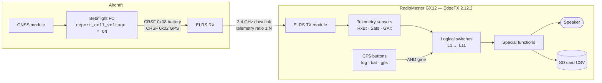

You know the flight. You are a long way out, the terrain is good, the lines are
flowing, and you are entirely inside the goggles. Somewhere in the corner of the
OSD a voltage number has been quietly dropping for the last ninety seconds and
you have not looked at it once, because you were busy flying. Then the OSD starts
blinking at you, and you do the arithmetic: distance home, headwind, remaining
sag. And the arithmetic says no.

That flight ends in a walk. Sometimes it ends in a walk with a bag.

The thing that always bothered me about this failure mode is that it is _purely_
an interface problem. The data was there the whole time. The radio knew. The
quad knew. The only broken link in the chain was that the information was
rendered as small glowing digits in the periphery of a human who was
concentrating on something else.

## An aircraft would never do this to you

Here is the part that struck me as absurd. Put a pilot in a Cessna and the
aircraft will not let a low-fuel state be a visual detail you might miss. It
will say so. Out loud. Repeatedly. Gear-up warnings, stall warnings, altitude
callouts, terrain warnings — an entire century of aviation human-factors
engineering converged on one conclusion: **for time-critical state changes,
audio beats vision, because audio does not require the pilot to look
somewhere.**

And yet the default FPV configuration for a 250-gram aircraft with a four-minute
endurance is... a number in the corner of the screen.

So I fixed it. My GX12 now talks to me. Not with a Lua script, not with anything
exotic — just EdgeTX logical switches and special functions, which have been
sitting in the firmware the whole time.

This is the first time I have built this, and I want to be upfront: **there are
less clumsy ways to do parts of it.** I will show you exactly where mine is
clumsy and why, because that is more useful than pretending I got it right
first time. But the core of it works, and one specific warning — the
half-capacity "return home" callout — has genuinely saved flights for me on long
range missions. It gives me the cue to start planning the trip back while I
still have the budget to make it, instead of discovering the problem when the
budget is already spent.


## Step zero: make every drone speak the same language

This is the single change that makes the whole system possible, and it happens
on the flight controller, not on the radio.

By default, the CRSF battery frame reports **pack voltage**. That is useless as
a fleet-wide trigger, because my fleet spans 1S to 4S. A "3.5 V" threshold means
nothing when one aircraft runs a single 18650 and another runs a 4S LiHV pack.
I would need a different threshold set per model, maintained by hand, forever.

So I set every aircraft to report **average cell voltage** instead. In
Betaflight this is a single parameter:

```text
set report_cell_voltage = ON
save
```

It is also exposed in the Betaflight configurator under _Power & Battery_ as
"Report cell voltage instead of pack voltage in telemetry". The FC divides pack
voltage by its detected cell count before it ever reaches the telemetry frame.

Now `3.5 V` means the same physical thing on the 1S whoop, the 2S rippers and
the 4S 3-inch. One threshold ladder, whole fleet.

> **Note on the INAV equivalent:** I run Betaflight on everything relevant here,
> so I have only verified this on Betaflight. If you are on INAV, check the
> parameter name before assuming it is identical — I have not measured it.

### Why not do the division in EdgeTX instead?

You can. EdgeTX lets you set a custom **Ratio** on a telemetry sensor, so you
could leave the FC reporting pack voltage and divide by cell count in the radio.

I deliberately did not, and you can see the decision in my config — the RxBt
sensor has no correction applied at all:

```yaml
telemetrySensors:
   14:
      id1:
         id: 8              # CRSF frame 0x08, BATTERY_SENSOR
      id2:
         instance: 0
      label: "RxBt"
      unit: 1               # volts
      prec: 1               # one decimal place
      cfg:
         custom:
            ratio: 0        # no scaling
            offset: 0       # no offset
```

Two reasons for doing it on the aircraft instead:

1. **The ratio is per-model in the radio, but the cell count is per-battery.**
   A radio-side divide-by-four is wrong the moment I fly the same airframe on a
   3S pack.
2. **LiHV breaks a hardcoded guess.** My 3-inch runs 4S LiHV at 4.35 V/cell
   fully charged — 17.4 V on the pack. A radio that has been told "assume 4S"
   copes fine, but a radio doing cell-count _detection_ from a divided number
   does not. The FC already knows its own cell count from the actual detection
   logic. Let the thing that knows do the maths.

The trade-off is honest: doing it FC-side means every new aircraft needs that
CLI line, and if you forget it, your warnings fire at absurd times. That has
happened to me exactly once, which was enough to make it part of the setup
checklist.

## The whole ladder rests on a calibration you have probably skipped

I need to put this immediately after the previous section, because everything
that follows depends on it and I do not want anyone building this on a bad
foundation.

**Your battery warnings are exactly as good as your voltage calibration.**

That sounds obvious written down. It is not obvious in practice, because a
miscalibrated voltage reading does not look broken. It looks like a perfectly
plausible number that happens to be wrong by 200 mV, and every threshold in the
ladder above inherits that error silently.

I have two aircraft that are miscalibrated right now, which means **my warnings
on those two fire too late.** Not "slightly imprecisely" — too late, in the
direction that costs you a pack. I know this and I have not fixed it yet, which
is the kind of admission this blog exists for.

The knob is `vbat_scale` in Betaflight. It corrects the ADC divider ratio for
the actual resistors on your board, which vary between boards, and it is set to
a generic default that is right for nobody in particular.

### The 3S-to-4S trap

The specific way this bit me is worth spelling out, because it is a natural
thing to do and there is no warning.

I had aircraft set up and flying on **3S**, then moved them to **4S** for
testing. Nothing in that transition tells you your calibration is now costing
you more. But it is, for a compounding reason.

`report_cell_voltage = ON` means the FC divides pack voltage by its **detected**
cell count. And that detection is itself derived from the measured pack voltage
at power-on — the FC divides what it reads by a maximum-cell-voltage constant
and rounds. So a voltage error propagates **twice**:

1. Directly, into the reported per-cell figure.
2. Potentially again, by pushing the detected cell count to the wrong integer.

That second path is the nasty one, because it fails *silently and plausibly*. If
a badly-scaled 4S pack reads low enough that the FC decides it is looking at 3S,
then it divides by three instead of four — and hands the radio a per-cell number
that sits comfortably in the normal range while being completely fictional. Every
threshold in my ladder would then be measuring a quantity that does not exist,
and the `ready` self-test would happily fire, because a wrong number above 4.2 V
is still a number above 4.2 V.

The self-test I was so pleased with earlier in this post checks that the signal
path works. **It does not check that the number is true.** Those are different
claims and I want to be clear about which one I have.

### The regression in the new configurator

Here is the practical annoyance, and it is the reason this is getting its own
post rather than a paragraph.

The way I used to calibrate was to spin the motors up to a modest load —
something drawing on the order of 2 A from the pack — and then switch to the
calibration tab **with the motors still running**, so I was calibrating at a
realistic operating point rather than at idle. That matters: you want the reading
trustworthy where you actually use it, under load, not just at rest on the bench.

In the current Betaflight configurator you cannot do that any more. **Leaving the
tab cuts the motors.** The workflow is simply gone.

I have not yet worked out the right replacement procedure, so I am not going to
invent one here. That is the next post: proper voltage calibration with the
current configurator, what changed, and how to get a trustworthy reading under
load without the old trick.

### One honesty note about a number earlier in this post

The 3.065 V/cell sag figure I quote further down — from an 83 A punch-out on my
3-inch — carries this same dependency. It is what the flight controller
*recorded*, and its accuracy rests on that aircraft's voltage calibration being
sound. I have not independently verified that particular airframe's `vbat_scale`
against a reference meter. Treat it as a strong indication of the shape of the
problem rather than a metrologically clean measurement.

If you build the warning system in this post and skip the calibration, you have
built something that will confidently tell you the wrong thing in a calm voice.
That is arguably worse than a number in the corner of the screen.

## Three buttons, three colours, three subsystems

The GX12 has six extra buttons above the sticks. They are EdgeTX
**Customisable Function Switches** (CFS), which means each one can be named,
given a default state, and assigned an RGB colour that the radio actually
lights up.

I use the second group of three, and I colour-coded them so I can confirm the
state of the whole warning system with a glance at the radio — before I put the
goggles on, which is the only moment I am actually looking at the radio.


| Button | Name  | Colour | Default | What it gates                |
| ------ | ----- | ------ | ------- | ---------------------------- |
| SW4    | `log` | Red    | **Off** | SD card telemetry recording  |
| SW5    | `bat` | Green  | **On**  | All battery voltage warnings |
| SW6    | `gps` | Blue   | **Off** | All GPS / satellite callouts |

Battery warnings default to **on** — that is the one I never want to have to
remember. GPS callouts default to **off**, because on the whoops and the analog
rippers there is no GNSS module at all and I do not want a "GPS lost" siren on
every flight. Logging defaults to off because it fills the SD card.

Here is the part that took me a while to work out: **on the GX12, the per-model
CFS block overrides the radio-level switch config.** Both files have entries for
SW4/5/6. The radio-level one in `radio.yml` is the fallback; the per-model
`customSwitches` block in the model YAML is what actually runs.

```yaml
# model00.yml — this is the block that wins
customSwitches:
   SW4:
      name: "log"
      type: 2POS
      group: 0              # 0 = independent toggle
      start: START_OFF
      onColor:  { r: 63, g:  0, b:  0 }   # red
      offColor: { r:  2, g:  2, b:  2 }
   SW5:
      name: "bat"
      type: 2POS
      group: 0
      start: START_ON       # battery warnings armed by default
      onColor:  { r:  0, g: 40, b:  2 }   # green
      offColor: { r:  4, g:  0, b:  0 }
   SW6:
      name: "gps"
      type: 2POS
      group: 0
      start: START_OFF
      onColor:  { r:  0, g:  0, b: 63 }   # blue
      offColor: { r:  2, g:  2, b:  2 }
```

`group: 0` means independent toggle. My SW1/SW2/SW3 sit in `group: 1`, which
makes them behave like mutually-exclusive radio buttons — useful for things like
selecting a VTX power level, wrong for three independent warning subsystems.

Once the buttons are named, EdgeTX shows the _names_ everywhere instead of
`SW52`, which makes the logical switch page readable:


## The signal chain

Before the tables, here is the whole path from a cell to a sound:



The key structural idea is the **AND gate**. Every logical switch has an
`andsw` field — a second condition that must also be true. That is what turns
eleven independent threshold detectors into three switchable subsystems. The
threshold logic and the arming logic are cleanly separated, and I never have to
edit thresholds to silence a subsystem.

## The logical switches

Eleven of them. Screens first, then the YAML, then what each one is for.


One mapping detail that will save you confusion if you read the YAML: **the
`logicalSw` block is zero-indexed while the UI labels are one-indexed.**
`logicalSw: 2:` is the switch the radio calls `L3`. Likewise `tele(14)` is a
zero-based index into the `telemetrySensors` list — in my file that is `RxBt`.

```yaml
logicalSw:
   0:                              # = L1
      func: FUNC_VNEG              # a < x
      def: "tele(14),40"           # RxBt < 4.0 V   (prec:1, so 40 = 4.0)
      andsw: "SW52"                # AND  bat button on
   1:                              # = L2
      func: FUNC_VNEG
      def: "tele(14),36"           # RxBt < 3.6 V
      andsw: "SW52"
   2:                              # = L3   <-- the one that saves flights
      func: FUNC_VNEG
      def: "tele(14),38"           # RxBt < 3.8 V
      andsw: "SW62"                # AND  gps button on
   3:                              # = L4
      func: FUNC_VPOS              # a > x
      def: "tele(22),6"            # Sats > 6
      andsw: "SW62"
   4:                              # = L5
      func: FUNC_VPOS
      def: "tele(22),13"           # Sats > 13
      andsw: "SW62"
   5:                              # = L6
      func: FUNC_ADIFFEGREATER     # |delta| >= x   <-- read the note below
      def: "tele(21),120"          # GAlt, 120 m
      andsw: "NONE"                # always armed
   6:                              # = L7
      func: FUNC_VNEG
      def: "tele(22),6"            # Sats < 6
      andsw: "SW62"
   7:                              # = L8
      func: FUNC_VNEG
      def: "tele(14),35"           # RxBt < 3.5 V
      andsw: "SW52"
   8:                              # = L9
      func: FUNC_VNEG
      def: "tele(14),38"           # RxBt < 3.8 V
      andsw: "SE1"                 # <-- leftover, see "what's clumsy"
   9:                              # = L10
      func: FUNC_VPOS
      def: "tele(14),42"           # RxBt > 4.2 V
      andsw: "SW52"
   10:                             # = L11
      func: FUNC_VNEG
      def: "tele(14),29"           # RxBt < 2.9 V
      andsw: "SW52"
```

Every single one of these has `delay: 0` and `duration: 0`. Hold that thought.

## The special functions

This is where a boolean becomes a sound.


```yaml
customFn:
   0:  { swtch: "L3",   func: PLAY_TRACK, def: "rth,1,1x"     }
   1:  { swtch: "L4",   func: PLAY_VALUE, def: "tele(22),1,1x" }
   2:  { swtch: "L1",   func: PLAY_SOUND, def: "Wrn1,1,1x"    }
   3:  { swtch: "L2",   func: PLAY_SOUND, def: "Sirn,1,1"     }
   4:  { swtch: "L5",   func: PLAY_TRACK, def: "gpson,1,1x"   }
   5:  { swtch: "L7",   func: PLAY_TRACK, def: "gpsoff,1,1x"  }
   6:  { swtch: "L8",   func: PLAY_TRACK, def: "lowbat,1,5"   }
   7:  { swtch: "L9",   func: PLAY_SOUND, def: "Sirn,1,2"     }
   8:  { swtch: "L6",   func: PLAY_TRACK, def: "warnng,1,1x"  }
   9:  { swtch: "SW42", func: LOGS,       def: "3,1"          }
   10: { swtch: "L10",  func: PLAY_TRACK, def: "ready,1,1x"   }
   11: { swtch: "L11",  func: PLAY_SOUND, def: "Alrm,1,1x"    }
```

The third field in `def` is the repeat interval. `1x` means play once per
trigger. `1` means every second, `5` means every five seconds. That distinction
matters more than it looks — see below.

Put together, the behaviour is this:

### The battery ladder — green button

| Per-cell    | Switch | Sound    | Repeat | Meaning                                        |
| ----------- | ------ | -------- | ------ | ---------------------------------------------- |
| **> 4.2 V** | L10    | `ready`  | once   | Fresh pack detected — system armed and talking |
| **< 4.0 V** | L1     | `Wrn1`   | once   | You are flying now, clock is running           |
| **< 3.8 V** | L3     | `rth`    | once   | _Roughly half capacity — turn around_          |
| **< 3.6 V** | L2     | `Sirn`   | 1 s    | Get home                                       |
| **< 3.5 V** | L8     | `lowbat` | 5 s    | Land, wherever you are                         |
| **< 2.9 V** | L11    | `Alrm`   | once   | You have hurt the pack                         |

The `ready` callout at > 4.2 V is my favourite small trick. It is not a warning
— it is a **self-test**. When I plug a battery in and the radio says "ready", I
have just confirmed, in one word, that: telemetry is flowing, the RxBt sensor is
alive, `report_cell_voltage` is actually set on _this_ aircraft, and the audio
path works. All four failure modes of the entire system, verified by one word,
before I take off. If the radio stays quiet when I plug in, something in the
chain is broken and I want to know _now_, not at 800 metres.

Caveat on LiHV: a 4.35 V/cell pack sails past 4.2 V, so `ready` fires reliably.
A LiPo that has been sitting on the shelf for a week self-discharges toward
4.15 V and may never trip it. That is arguably correct behaviour — it is telling
me the pack is not actually full.

**The `rth` callout at 3.8 V is the one that has genuinely saved flights.** It
is a crude approximation of half capacity, made from voltage rather than
coulombs, and I am not going to pretend it is accurate. But it does not need to
be accurate. It needs to arrive _while I still have the energy budget to act on
it_, which a coulomb counter that I am not looking at does not achieve. Note
that it is gated on the **gps** button, not the battery button — it is a
long-range-mission warning, and on a whoop in a hotel room it would just be
noise.

And to be explicit about the other half of long range, because it is not
optional and no amount of telemetry replaces it: my wife maintains visual line
of sight on the aircraft through binoculars the entire time. The audio warnings
tell me about the _aircraft's_ state. They tell me nothing about the airspace.

### The GPS callouts — blue button

Satellite count is a genuinely bad thing to monitor visually, because the moment
it matters most is the moment you are least able to look.

| Condition | Switch | Sound               | Meaning                                |
| --------- | ------ | ------------------- | -------------------------------------- |
| Sats > 6  | L4     | _speaks the number_ | Approaching usable — how close are we? |
| Sats > 13 | L5     | `gpson`             | Solid fix, rescue is trustworthy       |
| Sats < 6  | L7     | `gpsoff`            | **Fix degraded mid-flight**            |

`PLAY_VALUE` on L4 is the nice one — instead of a fixed tone it speaks the
actual satellite count. So while I am waiting on the ground I get "seven",
"nine", "eleven" as the fix builds, and I know whether to keep waiting or give
up, without unlocking the radio screen.

The threshold that actually matters is **6**, because that is roughly where
GPS Rescue becomes something you can trust — and the exact number depends
entirely on your own rescue configuration in Betaflight or INAV. Set it to
match _your_ `gps_rescue_min_sats`, not mine.

The `gpsoff` warning at Sats < 6 is the one I did not expect to need and now
consider essential. **Acrobatics drop satellites.** Roll the aircraft
inverted and the patch antenna is pointing at the ground; hard flips and
power loops routinely knock the count down. If that happens on a long-range
flight and I do not know about it, I am flying with a rescue function that
will not work, believing that I have a safety net. One word in my ear fixes
that.

### The altitude alarm — always armed

L6 has `andsw: "NONE"` — it is armed on every flight, on every aircraft. I fly
under EASA A1/A3, and the 120 m AGL limit is not a preference.

But here is where I have to be honest about my own config, because reading the
YAML back taught me something about it:

```yaml
   5:
      func: FUNC_ADIFFEGREATER    # |delta| >= x
      def: "tele(21),120"
```

`FUNC_ADIFFEGREATER` is `|Δ| ≥ x` — the **delta** function. It does not fire
when altitude _exceeds_ 120 m. It fires when altitude has _changed by_ 120 m
from its reference point.

I could pretend I planned that. What I will say is that it turns out to be the
more defensible choice, for a reason worth understanding:

**`GAlt` on CRSF is GPS altitude, not height above your launch point.** If I had
used the obvious `a > x` on `GAlt` with a 120 m threshold, it would scream at me
constantly and permanently — because I fly in Lithuania, where the ground itself
sits around 70–150 m above sea level. The alarm would be true before the
aircraft left my hand.

The delta function sidesteps that entirely: it measures _change_, so the
reference is wherever I started, and 120 m of climb is 120 m of climb regardless
of the elevation of the field. That is much closer to AGL than absolute GPS
altitude is.

It is not perfect, and I want to name the imperfections rather than paper over
them:

* It also fires on a 120 m **descent**, since it is absolute-value delta. Fly
  off the edge of a valley and it will warn you.
* After it fires, the reference updates, so it re-arms and fires again on the
  _next_ 120 m change rather than staying latched above the limit.
* It is a warning, not a limit. It tells me I have climbed a long way. Staying
  legal is still my job.

**This is the part I would most like to improve, and I have not measured a
better version yet.** The right answer is probably to derive a true
launch-relative altitude, which the barometer already provides in the OSD but
which is not what lands in the `GAlt` telemetry sensor. If you have solved this
cleanly in EdgeTX, I want to hear about it.

## Telemetry logging, and the number you have to measure yourself

The red button drives `LOGS` with `def: "3,1"` — a **0.3 second** log period,
writing a CSV to the SD card. This is where I have to stop making claims and
start pointing at homework, because the honest answer is that I have not
measured the thing that matters.

Log fidelity is not set by the log period. It is bounded by two things in
series, and the log period is the _second_ one:

1. **The ELRS telemetry ratio** — how often the RF link gives the downlink a
   slot at all.
2. **CRSF frame round-robin** — the FC has several different frame types to
   send, and each telemetry opportunity carries one.
3. **The EdgeTX log period** — how often the radio samples whatever value it
   most recently received.

My own sensor list makes point 2 concrete. Grouping my sensors by their CRSF
frame ID:

| CRSF ID | Frame type       | Sensors it carries                                                            |
| ------- | ---------------- | ----------------------------------------------------------------------------- |
| `0x02`  | GPS              | `GPS`, `GSpd`, `Hdg`, `GAlt`, `Sats`                                          |
| `0x08`  | BATTERY\_SENSOR  | `RxBt`, `Curr`, `Capa`, `Bat%`                                                |
| `0x1E`  | ATTITUDE         | `Ptch`, `Roll`, `Yaw`                                                         |
| `0x21`  | FLIGHT\_MODE     | `FM`                                                                          |
| `0x14`  | LINK\_STATISTICS | `1RSS`, `2RSS`, `RQly`, `RSNR`, `ANT`, `RFMD`, `TPWR`, `TRSS`, `TQly`, `TSNR` |

Note that `Sats` and `GAlt` arrive **together**, in the same frame — they can
never be out of sync with each other. But `RxBt` lives in a different frame
entirely, so it updates independently, and slower than the raw telemetry slot
rate.

```wave
{ "signal": [
  { "name": "RF packets",        "wave": "p................" },
  { "name": "downlink slot 1:4", "wave": "0..10..10..10..10" },
  { "name": "CRSF frame",        "wave": "x..3x..4x..5x..6x",
    "data": ["GPS 0x02", "BATT 0x08", "ATT 0x1E", "FM 0x21"] },
  { "name": "RxBt fresh",        "wave": "0.....1.........." }
],
  "head": { "text": "Telemetry slots round-robin between CRSF frame types" }
}
```

The naive arithmetic: at a 500 Hz packet rate with a 1:4 telemetry ratio you get
125 downlink slots per second, and with four flight-data frame types
round-robining, `RxBt` would refresh about 31 times a second. Against that, a
0.3 s log period is _massively_ undersampling — I would be logging one sample in
ten and would miss every sag transient.

**But I do not believe that number, and neither should you.** It is arithmetic
from the frame structure, not a measurement. It ignores the fact that ELRS
telemetry slots carry a small payload while a CRSF GPS frame is comparatively
large, so a single frame is fragmented across multiple slots. The real
per-sensor rate is lower than 31 Hz, possibly by a lot, and I have not
established by how much.

Here is the thing though — **the measurement is sitting on my SD card already,
and on yours.** The log period is 0.3 s. If a sensor is genuinely arriving
faster than that, every row has a fresh value. If it is arriving slower, the CSV
contains _runs of identical consecutive values_, and the mean run length is
exactly the ratio between the true arrival interval and the log period.

So: count the duplicate runs per column. That gives you the real update rate of
every sensor, per aircraft, per telemetry ratio, with no assumptions. Then set
your log period to match — and set your telemetry ratio deliberately, knowing
that a low ratio buys you link robustness at the direct cost of log resolution.

That is the next thing I am going to actually do, and it will get its own post
with real numbers in it.

### I built a thing that reads these logs

Since the whole point of the red button is producing a CSV, I should mention that
I have written a browser tool that eats exactly this file:

**[RX Blind-Spot Viewer](https://rxmap-viewer.sintra.site/rxmap/)** — load an
EdgeTX SD-Logs CSV and it renders your **control link** in 3D. It runs entirely in
the browser: nothing is uploaded, there is no account, and the log never leaves
your machine.

[TODO: Screenshot — RX Blind-Spot Viewer, Sphere view with a real flight log loaded]

Three views:

- **Cloud** — true 3D flight positions, coloured by whatever link metric you pick
- **Sphere** — samples projected by azimuth and elevation, in the **airframe's own
  reference frame** (nose / starboard / tail / port). This is the one I actually
  built it for: it is an empirically measured antenna pattern. Overlapping samples
  read as coverage density, so a dent in the sphere is a real blind spot in a real
  orientation.
- **Path** — the trajectory, with marker size and colour inversely proportional to
  link quality, so bad moments are literally bigger and redder

The metric list is data-driven — it detects which sensors are actually in your log
and offers those: worst-of-`1RSS`/`2RSS`, `RSNR`, `RQly`, `TRSS`, `TSNR`, and
`TPWR` (treated as *higher = worse*, since ELRS ramps transmit power up as the link
degrades). Any raw column is selectable too. It also splits multiple flights out of
a single log file automatically.

It closes the loop on this whole post. The radio tells me about a limit in the
moment, in one word, while I am flying. The viewer tells me *why* afterwards, with
the geometry attached. Same telemetry stream, two ends of the same problem.

Two details in it are worth calling out, because they are the analysis-side
solutions to problems I hit earlier in this post.

**It has a robust ground reference for altitude** — and that exists precisely
because of the `GAlt` problem from the L6 section above. `GAlt` is metres above
MSL, and its *first* samples are its worst, because the fix is fresh. Zero the
whole flight on one fresh-fix sample and the entire log reads negative. So the
viewer offers Auto / at-start / lowest / manual referencing, with an optional
median filter for GPS altitude spikes, and it treats exact zeros in a `GAlt`
column as "no fix" rather than as sea level. Same physics as the altitude warning
problem, attacked from the other end.

**It has a current-sensor correction factor** — which is the calibration section
of this post, made actionable. If the FC current sensor is mis-scaled then every
mAh figure in the log is wrong by a fixed multiplier, and so is every derived
number. You set the correction to `actual ÷ logged` and the whole battery model
rescales with it. (In Betaflight the knob is `ibata_scale`, and note the direction:
*lower* scale means *higher* reported current.) On top of that it computes
**return-to-home radius rings at the tightest moment of the flight**, given pack
capacity, usable percentage, and a reserve you declare safe.

Which is the rigorous version of the `rth` callout at the top of this post. The
radio gives me a crude voltage proxy for half capacity while I am airborne, in one
word, with no maths. The viewer tells me afterwards whether that word arrived early
enough — and on which part of the flight it would not have.

One more measured detail worth flagging: the ELRS telemetry ratio is **not in
the model YAML**. My `moduleData` block contains only this:

```yaml
moduleData:
   0:
      type: TYPE_CROSSFIRE
      subType: 0
      channelsStart: 0
      channelsCount: 16
      failsafeMode: NOT_SET
      mod:
         crsf:
            telemetryBaudrate: 0
```

No ratio field, because the ratio lives on the TX module itself, configured
through the ELRS Lua script. Which means **sharing a model YAML does not share
your telemetry ratio.** If you copy my config and your logs look different to
mine, that is the first place to look.

## What's clumsy about this

I said I would be specific. Reading my own config back with fresh eyes, here is
what is wrong with it.

### 1. The thresholds stack, and the sirens pile up

`a < x` is a **level** test, not an edge test. Once you drop below 3.5 V, you are
also still below 3.6 V, and below 4.0 V, and below 3.8 V. Every one of those
logical switches is true simultaneously.

At 3.4 V/cell my radio is running:

| Switch     | State | Sound    | Repeat                      |
| ---------- | ----- | -------- | --------------------------- |
| L1 (< 4.0) | true  | `Wrn1`   | once — already fired, quiet |
| L3 (< 3.8) | true  | `rth`    | once — already fired, quiet |
| L2 (< 3.6) | true  | `Sirn`   | **every 1 s, forever**      |
| L8 (< 3.5) | true  | `lowbat` | **every 5 s, forever**      |

So below 3.5 V I get a siren every second _and_ a spoken "low battery" every
five seconds, layered on top of each other. In the moment that is arguably fine
— it is certainly attention-getting — but it is not _informative_. A siren that
never stops carries no more information than a siren that fires once.

The fix is to make each rung exclusive, by ANDing each threshold with the
negation of the one below it: "below 3.6 **and not** below 3.5". EdgeTX can do
this with a second logical switch layer. I have not rebuilt it yet.

### 2. Zero debounce, everywhere

Every logical switch has `delay: 0, duration: 0`. There is no filtering at all,
which means **any transient sag triggers a permanent warning.**

This is not theoretical for me. On my 3-inch 4S build, a blackbox log of a hard
punch-out showed the pack collapse to **3.065 V/cell** under an 83 A draw — a
momentary event, fully recovered a fraction of a second later. That is 165 mV
of margin from tripping my 2.9 V "you have damaged the pack" alarm, on a pack
that was completely fine.

Sag is not state of charge. A voltage threshold with no time qualifier cannot
tell the difference. The 3.5 V and 2.9 V rungs are the exposed ones, because
those are the values you transit under load long before you reach them at rest.

EdgeTX gives you the tools: **Duration** requires the condition to hold for N
seconds before the switch goes true, and **Delay** postpones the transition.
Putting a duration of a second or two on the low rungs would eliminate
sag-triggered false alarms almost entirely.

I am not going to publish numbers for this, because I have not derived them from
my own logs yet, and picking them by feel would be exactly the kind of guess
this whole post is arguing against. The right way to set them is to look at the
sag duration distribution in your own blackbox and choose a duration longer than
your longest punch. That is a measurement, and I have the logs to do it.

### 3. A leftover switch

L9 is `RxBt < 3.8 V AND SE1` — the same threshold as L3, but gated on physical
switch SE instead of the gps button, firing a 2-second repeating siren. It does
not fit the three-button scheme and I no longer remember what it was for. It is
a fossil from an earlier iteration.

I am leaving it in the published config rather than quietly deleting it, because
the useful lesson is that **this happens.** Logical switch configurations
accumulate. If you build one of these, put a comment in a text file somewhere
describing what each switch is _for_, because EdgeTX has nowhere to store that
and in six months you will not remember either.

### 4. No link-quality warning at all

This is the biggest actual gap. My model has:

```yaml
rssiSource: none
rfAlarms:
   warning: 65
   critical: 35
```

There are RF alarm thresholds configured, but `rssiSource` is `none` — so
nothing is wired up to trigger them. Meanwhile I have `RQly`, `RSNR`, `ANT` and
both `1RSS`/`2RSS` sensors sitting right there in the sensor list, fully
populated, `logs: 1` on every one of them, and completely unused by any logical
switch.

Given that this whole project exists to stop me flying past a limit I was not
looking at, the fact that I have not applied it to **link quality** — the limit
that actually ends flights, in a hedge, a long way from the car — is an
oversight I noticed while writing this post. `RQly < 70 → PLAY_TRACK "link"` is
about four minutes of work and it is next on the list.

And it is worse than that, because of what those particular sensors are. See
below.

The irony is not lost on me: those same sensors are the ones my
[RX Blind-Spot Viewer](https://rxmap-viewer.sintra.site/rxmap/) reads to build a
3D antenna pattern. I will happily spend an evening analysing link quality in
three dimensions after the flight, and I have not spent four minutes making the
radio say "link" during it.

## Sharing the config: what is portable and what to scrub

I want to make this replicable, so: yes, publish your YAML. But two warnings.

### Scrub these fields before you publish

EdgeTX 2.9 and later store the radio config as YAML on the SD card —
`radio.yml` for the radio and one file per model in `/MODELS/`. Both of mine
contain a registration ID:

```yaml
# radio.yml
ownerRegistrationID: " 24P42P-"

# model00.yml
modelRegistrationID: " 24P42P-"
```

Before publishing a config, check for and scrub:

* `ownerRegistrationID` / `modelRegistrationID`
* `bluetoothName`
* Your **ELRS binding phrase** — this one is not in the model YAML, it lives on
  the TX module, but if you are also sharing a module backup, that phrase is
  effectively the key to your aircraft
* Model names, if they identify you
* Stick calibration (`calib:`) — harmless but meaningless to anyone else, and
  copying mine will make your sticks feel wrong

### The YAML is less portable than it looks

Here is the trap, and it is a real one. Logical switches reference telemetry
sensors **by position**, not by name:

```yaml
def: "tele(14),40"     # sensor slot 14 — which is RxBt *in my file*
```

`tele(14)` is not "RxBt". It is "whatever ended up in slot 14 during sensor
discovery". The slot order depends on which frames arrived first when you
discovered sensors, which depends on your FC configuration and the order you
powered things up. **On your radio, slot 14 may well be something else** — and
if it is, my logical switches will silently compare a voltage threshold against
your heading, and the whole thing will misbehave in ways that look like magic.

For reference, my slot order is:

```text
0  1RSS   1  2RSS   2  RQly   3  RSNR   4  ANT    5  RFMD
6  TPWR   7  TRSS   8  TQly   9  TSNR  10  FM    11  Ptch
12 Roll  13  Yaw   14  RxBt  15  Curr  16  Capa  17  Bat%
18 GPS   19  GSpd  20  Hdg   21  GAlt  22  Sats
```

So my honest advice, in order of preference:

1. **Read the tables in this post and re-enter them by hand**, using your own
   sensor names. It is fifteen minutes and you will actually understand the
   result, which matters when you want to change a threshold at a field.
2. If you drop in my YAML wholesale: delete your discovered sensors, re-discover
   them, then **verify slot-by-slot** that the numbers in the logical switch
   page point at the sensors you think they do. The UI shows names, so this is
   easy to check — just do not skip it.
3. `radio.yml` is board-specific (mine says `board: gx12`) and version-tagged
   (`semver: 2.12.2`). Do not copy it to a different radio.

## Custom audio: rth, gpson, gpsoff, lowbat, warnng, ready

The spoken callouts are custom WAV files, not built-in sounds. Six of them:
`rth`, `gpson`, `gpsoff`, `lowbat`, `warnng`, `ready`.

They live in the language-specific sounds directory on the SD card, alongside
the voice pack — for an English radio, `/SOUNDS/en/`. The filename minus the
`.wav` extension is what you select in the special function, which is why they
are all abbreviated: **EdgeTX truncates the display to six characters**, hence
`warnng` rather than `warning`.

I generated mine with text-to-speech and converted them to the format EdgeTX
expects. If your tracks play but sound wrong — clipped, sped up, or silent —
the format is the first thing to check, because EdgeTX plays WAVs directly with
no resampling.

One thing worth checking in `radio.yml` if your tracks sound truncated at the
start, which I have not conclusively verified as the cause on mine:

```yaml
audioMuteEnable: 1      # amplifier muted between sounds
wavVolume: 4
beepVolume: 0
```

`audioMuteEnable: 1` powers the amplifier down between sounds to reduce hiss.
The trade-off is that the amp needs a moment to come back up, which can eat the
first syllable of a short track. Setting it to `0` is the test. I mention it as
a candidate, not a diagnosis.

Also note `beepVolume: 0` — I have the beeps turned all the way down and the
WAV volume up. If everything is going to talk to me, I do not also want it
beeping at me.

## The other reason I bought this radio: two antennas, two bands

The extra buttons are what made this project pleasant. They are not why I bought
the radio. I bought it for **dual-band operation with two antennas**, and that
decision came out of losing an aircraft.

### The quad that fell into the weeds

On the Pocket I ended up with a **polarisation mismatch** between the radio's
antenna and the receiver's, and at distance the drone simply dropped out of the
sky into the weeds.

The mechanism is worth being precise about, because FPV people are used to
thinking about polarisation in the *video* context, where the convention is
circular — LHCP on both ends, and mixing LHCP with RHCP costs you around 20 dB.
The control link is a different animal. **ELRS antennas are linearly
polarised** — dipoles and monopoles, not helicals. And two linear antennas at
90° to each other are cross-polarised, which is a loss of the same brutal order.

Linear antennas have a second problem that circular ones share but which is
easier to forget: a dipole radiates in a torus with **deep nulls along its own
axis**. Point the end of the antenna at the other station and there is
essentially nothing there. On the ground that is easy to avoid. Mid-dive, with
the aircraft rotating through every attitude it has, you cannot avoid it — you
can only make sure the null is never in the same place on both antennas at once.

### One horizontal, one vertical

So on my newest build — a foldable, which is getting its own post once I have
flown it enough to say anything honest about it — I run a **true diversity
receiver with two dual-band antennas, one mounted horizontal and one vertical.**

That orthogonal pairing is the whole trick, and it buys two independent things
from one arrangement:

- **Polarisation coverage.** Whatever the radio's polarisation is at that
  instant, one of the two receive antennas is reasonably aligned with it. There
  is no orientation where both are cross-polarised.
- **Null coverage.** The two antennas' nulls point in orthogonal directions, so
  no single aircraft attitude can put both of them in a null simultaneously.

"True diversity" is the part that makes this work rather than just sound good. A
true diversity receiver has two independent receive chains, one per antenna, and
picks the better one **per packet**. It is not a passive combiner and it is not a
single receiver with a switch it flips occasionally.

The result, in the air: diving Norwegian waterfalls, where I am rotating through
attitudes next to a large chunk of wet rock, it switches between antennas
perfectly and I do not get the dropout that the geometry says I should.

Notably this works **even when Gemini is not available on the aircraft.** ELRS
Gemini mode transmits on both bands simultaneously and needs a Gemini-capable
receiver at the other end. Without that, the radio still has two antennas and
still selects between them — so I get the benefit of the radio's diversity on
builds that cannot do full Gemini.

### Your telemetry already measures this — and mine is not using it

Here is the part that made me slightly annoyed at myself while writing this
section, and it connects straight back to the missing link-quality warning.

Three of the sensors already sitting in my model are exactly the diversity
instrumentation:

| Sensor | What it actually is |
|--------|--------------------|
| `1RSS` | RSSI at the **receiver's antenna 1** |
| `2RSS` | RSSI at the **receiver's antenna 2** |
| `ANT`  | Which antenna the receiver is currently **using** |

Be precise about whose antennas those are: `1RSS`, `2RSS` and `ANT` come from
the CRSF link-statistics frame and describe the **diversity receiver on the
aircraft**, not the two antennas on the radio. The radio-side benefit I
described above is a separate mechanism, and I have not instrumented it — the
downlink figures I do have (`TRSS`, `TQly`, `TSNR`) are measured at the radio
but do not break out per-antenna.

All three have `logs: 1`, so **they are already being written to the CSV every
0.3 s.** Which means the claim I just made — "it switches between antennas
perfectly" — is currently a field impression, not a measurement, and I have the
data to turn it into one. The Sphere view in the
[RX Blind-Spot Viewer](https://rxmap-viewer.sintra.site/rxmap/) is built for
exactly this: it plots the worst of `1RSS`/`2RSS` by azimuth and elevation in the
airframe's own frame, so an orthogonal antenna pair that is genuinely working
should show up as a rounder sphere with fewer dents than a single antenna would. Count the `ANT` transitions against the `1RSS`/`2RSS`
difference and you get the real switching behaviour: how often it swaps, whether
one antenna is systematically doing all the work, and whether the swaps line up
with the attitude changes in the blackbox.

If one antenna is carrying the link and the other is contributing nothing, that
is a mounting problem, and it is invisible from the goggles. I have a Lua script
in my telemetry suite for antenna diversity balance; what I do not yet have is
an **audible** version. A logical switch on the difference between `1RSS` and
`2RSS` would tell me about a dead or badly-routed antenna on the bench, before
it becomes a walk in the weeds.

That is the second thing going on the list, right after the link-quality
callout — and it is the same lesson as the rest of this post. The information
was already arriving. Nobody was listening to it.

## A short aside on the radio itself

The GX12 is my third radio, and I am going to be unprofessionally enthusiastic
about it for a paragraph.

I fell for it the moment I saw it. It sits between the RadioMaster Pocket and
the Boxer — not as compact as the Pocket, but _far_ more ergonomic, and it feels
genuinely good in the hands in a way the Pocket does not. The six extra
top-mounted buttons with individually addressable RGB are what made this entire
project pleasant instead of tedious.

I did briefly fly a colleague's 5-inch on a Boxer, and the Boxer is better.
Better gimbals, better ergonomics, no argument. My first flight with it went
directly, immediately and vertically into a tree, to considerable amusement from
its owner. I redeemed myself somewhat with a few power loops through gates
afterwards, but the tree is the part he remembers.

The reason I do not own a Boxer is prosaic: it does not fit. Most of my flying
happens on motorcycle trips, and I already barely fit two drones, goggles,
batteries and the radio into the GS Adventure's top box. The DJI Mini 3 era of
packing — where the whole kit left room for sandwiches and a bottle of water —
is long gone. For long trips I am going to have to pack even more ruthlessly,
and a Boxer-sized radio is exactly the wrong direction.

The GX12 is the compromise that stopped feeling like a compromise.

## The point

Every warning in this post is built from telemetry that was already arriving at
the radio, from sensors that were already discovered, using firmware features
that were already installed. Nothing was added to any aircraft. No Lua, no
extra hardware, not one gram of takeoff weight.

The only thing that changed is that the information now goes into my ears
instead of into a corner of a screen I am not looking at.

That is a lower bar than it sounds like, and it is also most of the value. My
build is clumsy in at least four specific ways that I have now written down and
can go fix. The thresholds stack. There is no debounce. There is a fossil
switch. There is no link-quality warning, which is the one that will actually
bite me — and no antenna-balance warning either, on a radio I specifically
bought for its antennas, with the measurement already sitting in the log file.

And two of my aircraft are still telling me the truth late, because their
voltage calibration is wrong. A warning system is a measurement system with a
voice bolted on. If the measurement is wrong, the voice just makes you confident
about it.

But the flight where the voltage quietly slid past the point of no return while
I was busy enjoying myself — that one does not happen any more. Somewhere around
half capacity a voice in my ear says "return home", and I turn around with fuel
in the tank, which is the entire difference between a flight and a walk.

The aircraft knew all along. It just needed to be given a way to say so.

***

_If you build a cleaner version of any of this — particularly a proper
launch-relative altitude warning, or an exclusive threshold ladder that does not
stack — I would genuinely like to see it._