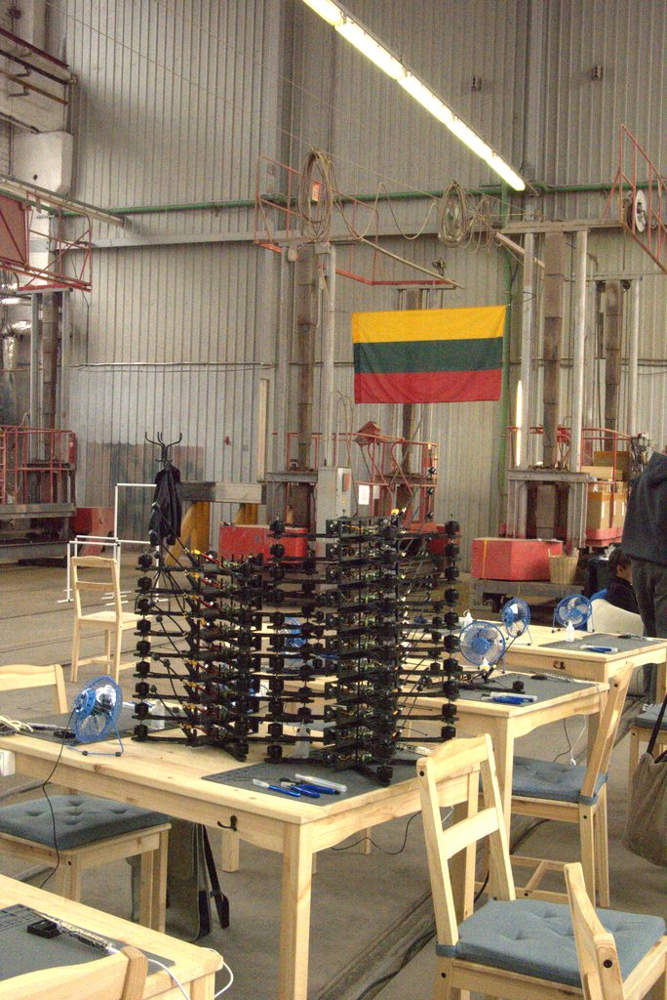
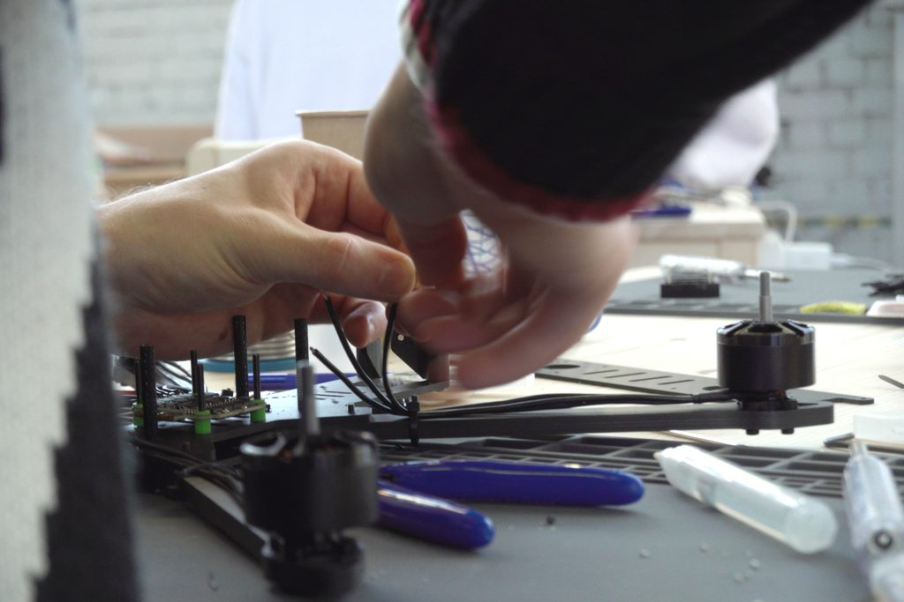
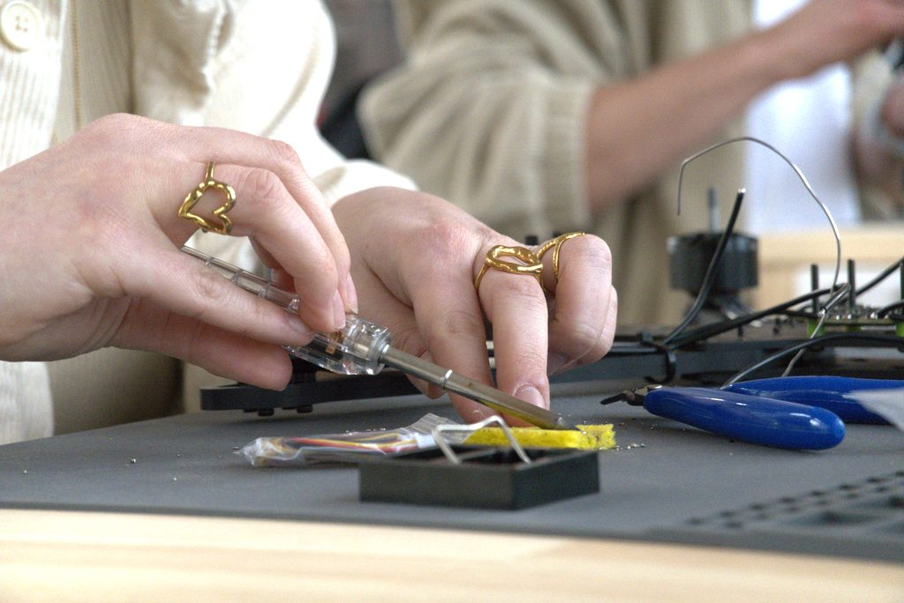
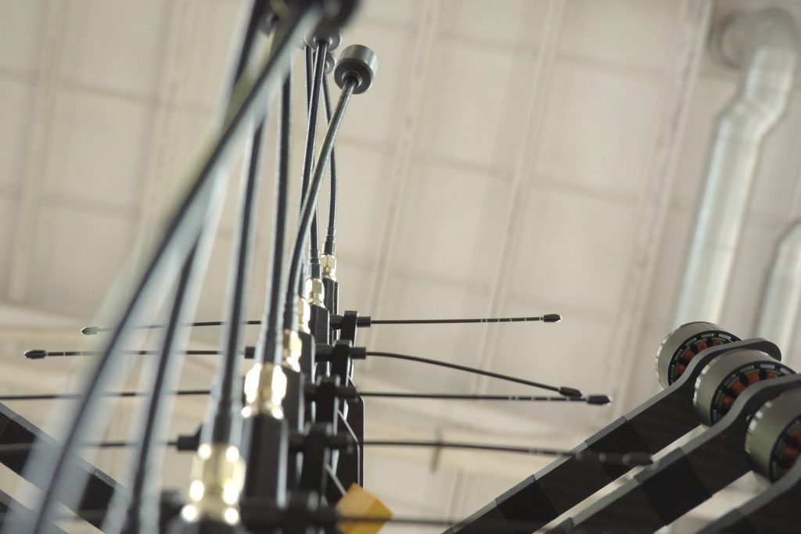
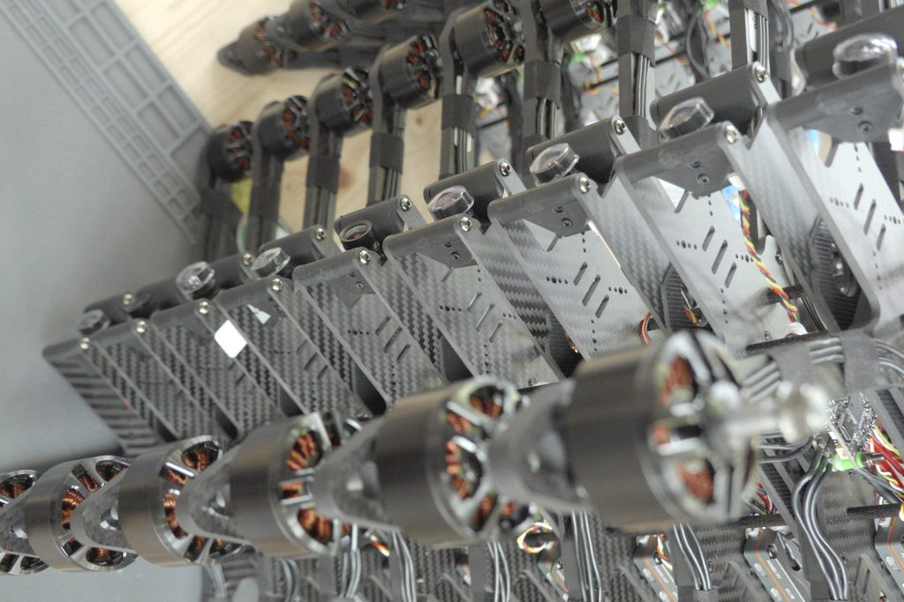
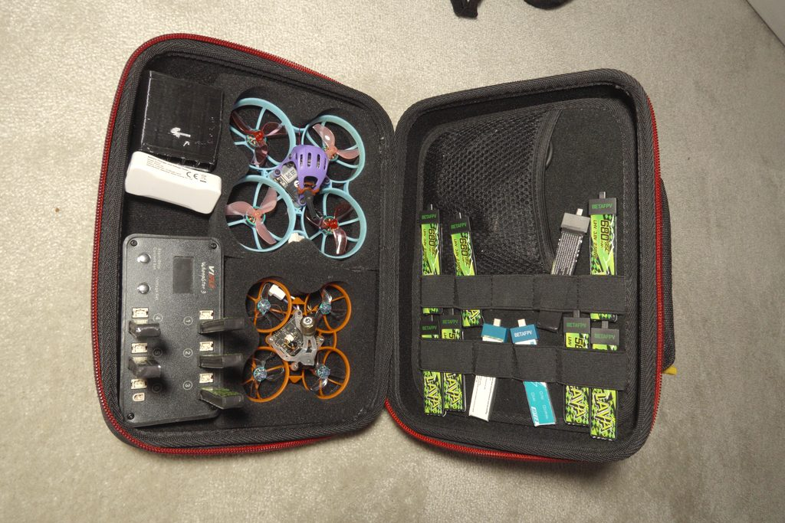
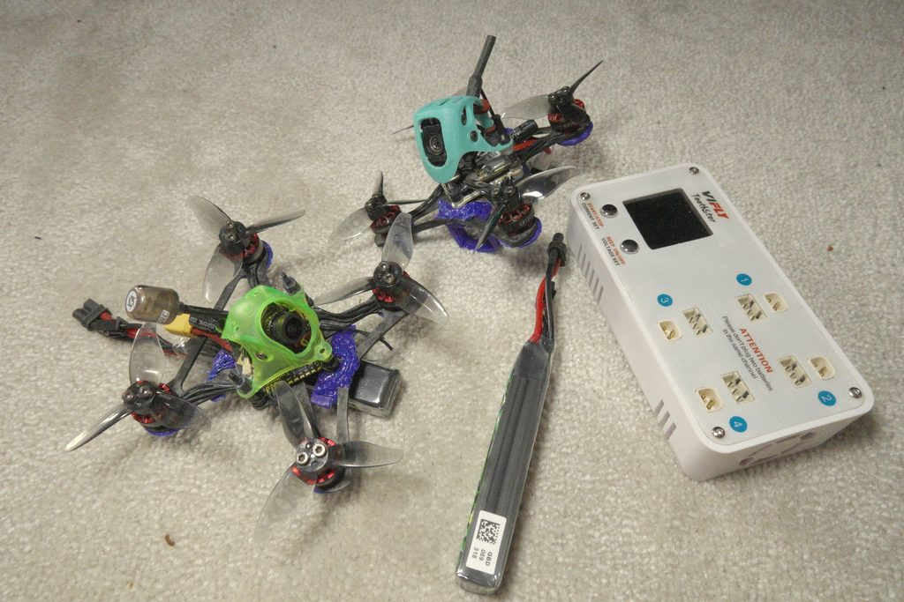
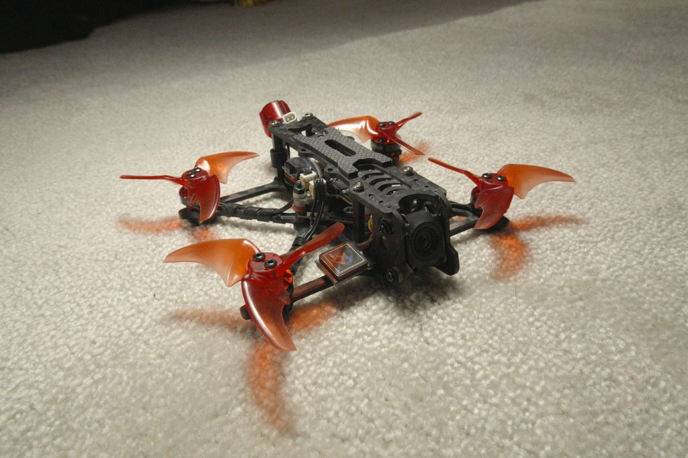
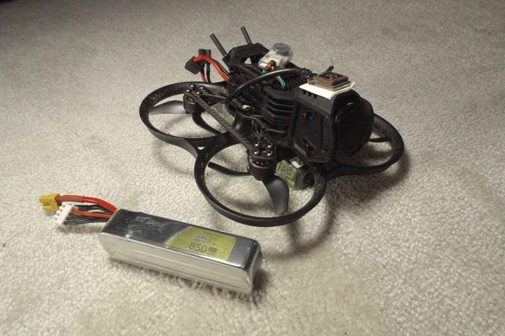

Metų metus mano dronai keliaudavo kartu su manimi. Iš pradžių DJI Air, vėliau Mini 3 — kameros platformos, kurios keliaudavo kiekvienoje išvykoje, sudėtos šalia kitos įrangos. Jie mokėjo daryti tik vieną dalyką: kyboti kur nors leistinoje vietoje ir padaryti švarią nuotrauką.

Būtent tai ir buvo problema. Kybojimas leistiname aukštyje, kadruojant kalną iš pagarbaus atstumo, kaskart atrodė neįkvepiantis. Vaizdai buvo neblogi. Bet ir negyvi — dronas stebėjo iš mandagaus atstumo ir parnešdavo atvirukus. Galiausiai visai nustojau jį imtis. Ypač motociklo kelionėse Mini 3 likdavo namie; svoris ir vargas nebuvo verti dar vienos kybojimo kadrų partijos.

Iš tikrųjų norėjau priešingo nei tai, kam tie dronai buvo sukurti: nardymo žemyn palei uolą, veržimosi pro ankštus tarpus, greitų praskridimų vos virš vandens, ruožų palei kalnagūbrį. Judesio ir buvimo. Skrydžio, o ne filmavimo pojūčio.

Kelerius metus žiūrėjau FPV turinį, puikiai žinodamas, kad tai yra atsakymas, ir nieko nedarydamas. Konstrukcijos atrodė brangios, mokymosi kreivė — staigi, o aš jau turėjau nebaigtų aparatinės įrangos projektų laukimo eilę. Spektrometras. DARP tinklo ryšio darbas. Dronų detektoriaus mokymo duomenų surinkimo kanalo, kuriam vis reikėjo daugiau duomenų.

Tada užsiregistravau į [Dronefix.lt](https://dronumokykla.lt/) mokymo programą ir viskas pasikeitė.

---

## [Dronefix.lt](https://dronumokykla.lt/)

Dronefix.lt vykdo struktūrizuotus FPV pilotų mokymus Lietuvoje. Ne „štai dronas, eik sudaužyk jį" — tikra programa: simuliatoriaus valandos, taisyklių ir oro erdvės teorija, praktika su realiais dronais, pirmųjų pirkimų gairės.

*Dronefix.lt erdvė — pramoninis sandėlis, paruošti darbo stalai, akademijos rėmai sukrauti viduryje.*

*Praktinė konstravimo sesija. Variklio laidai, rėmo stovai, replės. Kaip visada.*

*Litavimo praktika. Kas sugeba palit' droną, tas sugeba palit' viską.*

*Vienas iš akademijos dronų. Žemo kampo kadras — variklių kojos ir antenų išvedimas.*

*Rėmų siena. Akademija turi pakankamai įrangos visai grupei.*

Akademijoje buvo visokiausių dronų, bet mano akį patraukė mažieji — 2 colių, net keli 3 colių. Mane sužavėjo, kad kažkas toks mažas ir toks lengvas gali turėti tiek galios. Fausto ir Karolio rankose tie mažyčiai kvadrotai atrodė nuostabiai, ir būtent tą akimirką man viskas ir „susidėliojo".

Acro režimas yra nuolankumo mokykla. Atėjau manydamas, kad turiu gerą erdvinį mąstymą ir elektronikos išsilavinimą — kiek sudėtinga gali būti? Sudėtinga. Simuliatorius yra ten, kur pradedi, ir ankstyvosios valandos to vertos — nors, kaip paaiškėjo, tikras kvadrotas man galiausiai tiko kur kas labiau nei simuliatorius.

Ką programa padarė, ko nebūčiau galėjęs padaryti vienas:

- **Neleido man per daug skubėti.** Iš karto nieko nekonstruavau — tiesiog nusipirkau Air65 freestyle versiją, kad įgaučiau nuovoką. Pirma mokytis skristi, o konstruoti vėliau — tai buvo teisinga tvarka.
- **Suteikė pagrindą pasirenkant įrangą.** FPV rinkoje pilna konkuruojančių standartų, nesuderinami ekosistemų ir produktų, kurie buvo geri prieš dvejus metus. Instruktoriai, skrendantys kasdien, supjaustė daug triukšmo.
- **Sujungė mane su kitais pilotais.** Bendruomenės aspektas buvo netikėtas. Kiti pilotai yra greičiausias būdas išspręsti problemas, rasti skrydžių vietas ir suprasti, kas iš tikrųjų svarbu, palyginti su tuo, kas ginčijama internete.

---

## Flotas

Po Dronefix.lt nesustojau ties vienu kvadrotu. Vieną nusipirkau, kad išmokčiau skristi, o tada pradėjau kaupti variklius, rėmus ir skrydžio valdiklius bei konstruoti likusius.

*Kelioninis rinkinys. Air65 II su Ratel Baby Nano kamera (viršuje), Meteor75 O4 Lite konversija (apačioje). Abu 1S.*

*Du 2 colių riperiai — skaitmeninis O4 Lite kairėje, analoginis 2S dešinėje.*

*Eksperimentinė tolimojo skrydžio platforma. Šiuo metu 1S — tas eksperimentas nepasisekė, planuojama konversija į 2S/3S.*

*Pavo20 Pro II su ekranuotu GPS kabeliu ir VCC žemų dažnių filtru. GPS triukšmo problema vis dar neišspręsta.*

Dabartinis sąrašas, maždaug tokia tvarka, kokia viskas vyko:

**Air65 (freestyle)** — pirktas, ne statytas. Mano treniruoklis ir tas, ant kurio išmokau skristi, kol dar nepasitikėjau savimi su lituokliu ir dalių krūva.

**Mano pirmas tolimojo skrydžio eksperimentinis rėmas** — sunkus, ambicingas ir dingęs per pirmąjį skrydį. Pameciau jį tiesiogine prasme trys metrai į šoną nuo tos vietos, kur sėdėjau. Dėl inercijos ir per mažos traukos negalėjau jo sugrąžinti, kliudžiau medį, ir jis tiesiog dingo. Ieškojau tris dienas — tiesiogine prasme tris dienas. Peržiūrėjau paskutines milisekundes prieš nutrūkstant vaizdui akiniuose ir peržiūrėjau 360 įrašą bandydamas nustatyti, kur jis nukrito po to, kai atsitrenkė į šaką. Nieko. Jis vis dar kažkur ten.

**Du 2 colių riperiai (analoginis ir skaitmeninis)** — tie, kurie pateisina pavadinimą. 2 colių tiesiog plėšia: geros šešios minutės su 2S 580mAh bateriją. Kas keista, nuo tada, kai pradėjau skraidyti šiuos, simuliatoriuje beveik nebemoku skristi — simuliatorius jaučiasi keistai ir nepatogiai, net su identiškais rate'ais, net Air65 Liftoff'e. Tiesiog ne tas pats.

**2,5 colio tolimojo skrydžio eksperimentinė platforma** — kitas žingsnis nuotolio ir ištvermės link.

**Pavo20 Pro II** — 2,5 colio GPS burbulinis, pagrindinis GPS konfigūracijų testavimo įrankis ir [atskiro straipsnio apie GPS sunkumus](../pavo20-gps-struggles/) tema. Ne gabiausias mano turimas kvadrotas, bet jis mane labiausiai išmokė apie RF trikdžius ir ESC triukšmą.

**4 colių sulankstomas „BabyApe" tolimojo skrydžio dronas** — vis dar ant stalo, galbūt mano kelioninis dronas. Ar jis pelnys tą vaidmenį, visiškai priklauso nuo to, ar jo skrydžio valdiklis tvarkosi su GPS geriau nei Pavo20 — Pavo20 GPS trikdymo problema yra kartelė, kurią jis turi peršokti.

Kiekviena konstrukcija išmokė ko nors specifinio — variklio krypties gedimų, ESC protokolo nesuderinamumų, blackbox analizės, PID derinimo. Hobis yra tikrai edukacinis būdu, kuris jaučiasi labiau praktiškas nei dauguma programinės įrangos darbų.

---

## Ką Atidėjau

Spektrometro projektas buvo nebaigtas, kai atradau FPV. Turėjau veikiantį regimosios šviesos spektrometrą ant Raspberry Pi su TOSLINK optinio pluošto jungtimi, kalibruotą duomenų apdorojimo kanalą ir planus optinio pluošto priekinio galo atgaliniam sklaidymui eksperimentuoti.

Tas projektas vis dar laboratorijoje. Optinio pluošto darbas lėtai juda į priekį, 405 nm ir 535 nm lazerio eksperimentai vyksta, ir programinė įranga žymiai išsivystė — bet tempas sumažėjo, kai atsirado FPV. Neturiu dėl to jokio apgailestavimo. Galima būti apsėstu tik vienu dalyku vienu metu, ir šiuo metu tas dalykas yra FPV.

Planuojamas papildomas straipsnis apie spektrometrą. Trumpa versija: TOSLINK plastikinis pluoštas stipriai fluorescuoja ties 405 nm UV, kas panaikina fluorescencijos spektroskopiją per tą kanalą, o Windows neatskleidžia 10 bitų vaizdo iš fotoaparato su tinkama ekspozicijos valdymu, todėl rankinis prietaisas turi būti perprojektuotas tinkamai optinio pluošto priekiniam galui, prieš tęsiant fluorescencijos darbus.

---

## Kodėl FPV Prisijungia

Aš visų pirma nesu suinteresuotas FPV kaip filmavimo priemone ar sportu. Kas mane laiko įsitraukusį — tai sistemų darbas: RF ryšio dizainas, triukšmo analizė, GPS signalo vientisumas, variklio laiko valdymas, PID teorija. Kiekviena konstrukcija yra mažas įterptinių sistemų projektas su realaus pasaulio fizika.

Pavo20 GPS problema yra tikra RF inžinerijos problema. ELRS ryšio atsargos klausimas yra antenų teorija. Blackbox analizė yra signalų apdorojimas. Bendruomenėje pilna žmonių, kurie taiso dalykus empiriškai, kas yra greičiausia inžinerijos rūšis.

O skrydis yra tikrai malonus. Ta dalis mane nustebino labiausiai.

---

## Kas Artėja

Spektrometro straipsnis bus tikras techninis įrašas — optiniai pluoštai, spindulių skirstuvo geometrija, atgalinio sklaidymo eksperimentai, kodėl TOSLINK buvo netinkamas pasirinkimas, ką geriau daro 300 µm pluošto skirstytuvai. Prie jo grįšiu, kai bus išspręsta GPS problema arba kai pritrūks naujų dalykų laužyti.

Tuo tarpu: Pavo20 vis dar negali patikimai rasti GPS palydovų, BabyApe laukia skrydžio valdiklio, kuriuo galėčiau pasitikėti lauke, o aš baigiu pasiteisinimų nebandyti INAV.
