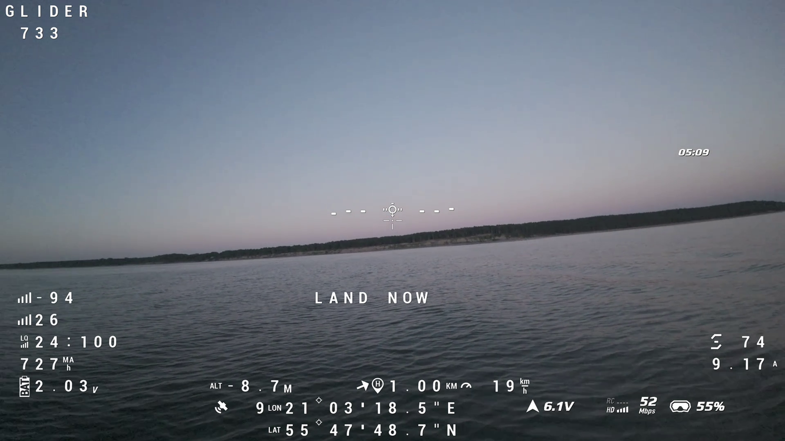
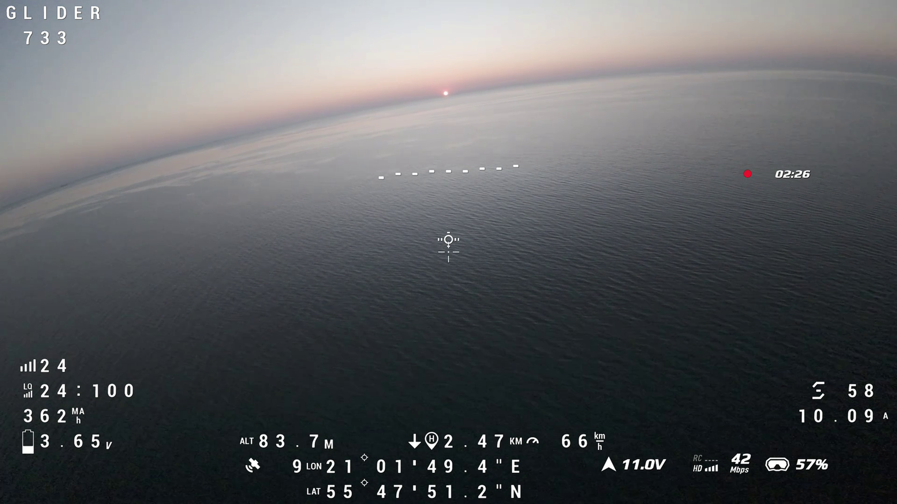
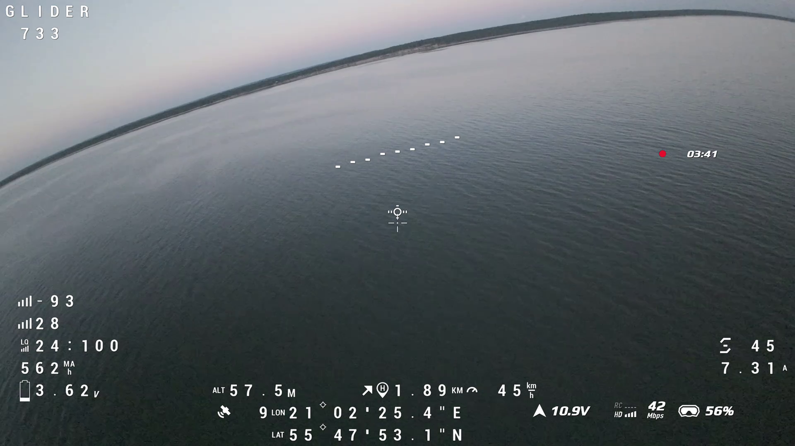
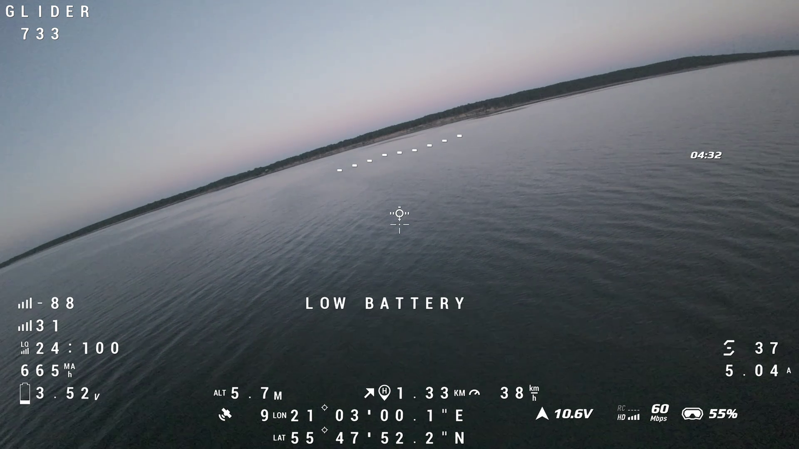
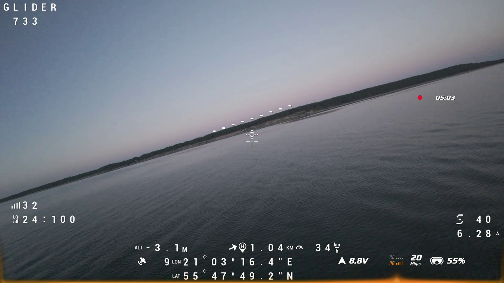

That is the Pavo20 Pro II, 1.04 km from home, pack at 2.03 V per cell, the OSD
reading LAND NOW, and the sea right there. You wonder how I got there.

Here is how.

## The Decision

Earlier the same day I had flown a 2 km round trip in heavy field winds and
landed with 20% remaining. The link held, the battery held, the drone came back.
I wanted to know what clear-horizon ELRS range looked like over open water. No
turbulence, no obstructions, just the Baltic Sea at dusk. It seemed like the
easier version of what I had already done.

It was not.

## The Flight

The outbound leg was easy. 2.47 km, 66 km/h, 11 V pack. The horizon was flat,
the link was clean, the battery was barely moving. There was a tailwind I did
not specifically register as a tailwind. I registered it as good conditions.



I turned back. Climbed a bit for a better view. The speed dropped. The battery
started moving faster. The return leg, the same airspeed into the same wind,
cost 183 mAh/km: 1.45 times more expensive per kilometre than the outbound.
The tailwind is a headwind now and every metre home costs half again what
getting out did.



## The Blackout

Telemetry went dark at t = 79 s, altitude 0 m, roughly 920 m outbound. It did
not come back for 150 seconds. During that gap the pack crossed 3.8 V per cell,
crossed 3.6 V, crossed 3.5 V. The radio was silent for all of it. EdgeTX logical
switches sourced from telemetry sensors are forced FALSE during a blackout. A
level-comparison switch cannot fire while the link is down.

When telemetry restored at t = 230 s the drone had climbed to 75 m.
Two-ray multipath over seawater at grazing incidence: the sea is a near-perfect
RF reflector, and at low altitude the direct and reflected paths arrive nearly
equal in amplitude and opposite in phase. Climbing breaks the cancellation.
0 m: silent. 75 m: restored.



By the time the radio could see anything, 555 mAh had been consumed. 266 mAh
remained. The point of no return, at the measured return rate with a 10% margin,
was 1323 m from home. The drone was 1946 m from home. Already 623 m past it.

The `rth` callout fired at t = 229.8 s. Correct, in the sense that it fired.
Useless, in the sense that it fired 150 seconds after the decision had already
been made by physics.

## What the Telemetry Shows


```chart
{"type":"scatter","data":{"datasets":[{"label":"Telemetry OK","data":[{"x":0.0,"y":0.0},{"x":6.0,"y":1.0},{"x":6.0,"y":1.0},{"x":6.0,"y":1.0},{"x":12.0,"y":9.0},{"x":12.0,"y":9.0},{"x":15.0,"y":12.0},{"x":15.0,"y":12.0},{"x":15.0,"y":12.0},{"x":16.0,"y":11.0},{"x":16.0,"y":11.0},{"x":7.0,"y":11.0},{"x":7.0,"y":11.0},{"x":7.0,"y":11.0},{"x":-18.0,"y":14.0},{"x":-18.0,"y":14.0},{"x":-18.0,"y":14.0},{"x":-54.0,"y":28.0},{"x":-54.0,"y":28.0},{"x":-105.0,"y":46.0},{"x":-105.0,"y":46.0},{"x":-105.0,"y":46.0},{"x":-157.0,"y":61.0},{"x":-157.0,"y":61.0},{"x":-157.0,"y":61.0},{"x":-222.0,"y":79.0},{"x":-222.0,"y":79.0},{"x":-282.0,"y":96.0},{"x":-282.0,"y":96.0},{"x":-282.0,"y":96.0},{"x":-355.0,"y":113.0},{"x":-355.0,"y":113.0},{"x":-355.0,"y":113.0},{"x":-355.0,"y":113.0},{"x":-425.0,"y":133.0},{"x":-425.0,"y":133.0},{"x":-425.0,"y":133.0},{"x":-425.0,"y":133.0},{"x":-544.0,"y":163.0},{"x":-544.0,"y":163.0},{"x":-544.0,"y":163.0},{"x":-544.0,"y":163.0},{"x":-652.0,"y":189.0},{"x":-652.0,"y":189.0},{"x":-652.0,"y":189.0},{"x":-652.0,"y":189.0},{"x":-652.0,"y":189.0},{"x":-758.0,"y":216.0},{"x":-758.0,"y":216.0},{"x":-758.0,"y":216.0},{"x":-758.0,"y":216.0},{"x":-886.0,"y":248.0},{"x":-886.0,"y":248.0},{"x":-886.0,"y":248.0},{"x":-886.0,"y":248.0},{"x":-886.0,"y":248.0},{"x":-1818.0,"y":694.0},{"x":-1770.0,"y":699.0},{"x":-1770.0,"y":699.0},{"x":-1770.0,"y":699.0},{"x":-1721.0,"y":696.0},{"x":-1721.0,"y":696.0},{"x":-1673.0,"y":692.0},{"x":-1673.0,"y":692.0},{"x":-1673.0,"y":692.0},{"x":-1626.0,"y":685.0},{"x":-1626.0,"y":685.0},{"x":-1626.0,"y":685.0},{"x":-1580.0,"y":679.0},{"x":-1580.0,"y":679.0},{"x":-1531.0,"y":673.0},{"x":-1531.0,"y":673.0},{"x":-1531.0,"y":673.0},{"x":-1476.0,"y":664.0},{"x":-1476.0,"y":664.0},{"x":-1476.0,"y":664.0},{"x":-1426.0,"y":670.0},{"x":-1426.0,"y":670.0},{"x":-1426.0,"y":670.0},{"x":-1381.0,"y":674.0},{"x":-1381.0,"y":674.0},{"x":-1335.0,"y":679.0},{"x":-1335.0,"y":679.0},{"x":-1335.0,"y":679.0},{"x":-1286.0,"y":680.0},{"x":-1286.0,"y":680.0},{"x":-1286.0,"y":680.0},{"x":-1235.0,"y":678.0},{"x":-1235.0,"y":678.0},{"x":-1235.0,"y":678.0},{"x":-1193.0,"y":676.0},{"x":-1193.0,"y":676.0},{"x":-1147.0,"y":672.0},{"x":-1147.0,"y":672.0},{"x":-1147.0,"y":672.0},{"x":-1107.0,"y":662.0},{"x":-1107.0,"y":662.0},{"x":-1107.0,"y":662.0},{"x":-1067.0,"y":651.0},{"x":-1067.0,"y":651.0},{"x":-1031.0,"y":641.0},{"x":-1031.0,"y":641.0},{"x":-1031.0,"y":641.0},{"x":-989.0,"y":628.0},{"x":-989.0,"y":628.0},{"x":-989.0,"y":628.0},{"x":-956.0,"y":618.0},{"x":-956.0,"y":618.0},{"x":-924.0,"y":604.0},{"x":-924.0,"y":604.0},{"x":-924.0,"y":604.0},{"x":-890.0,"y":589.0},{"x":-890.0,"y":589.0},{"x":-890.0,"y":589.0},{"x":-858.0,"y":576.0},{"x":-858.0,"y":576.0},{"x":-858.0,"y":576.0},{"x":-858.0,"y":576.0}],"backgroundColor":"rgba(41,128,185,0.7)","pointRadius":3,"showLine":true,"borderColor":"rgba(41,128,185,0.5)","borderWidth":1},{"label":"Dark / dead-reckoned","data":[{"x":-886.0,"y":248.0},{"x":-886.0,"y":248.0},{"x":-886.0,"y":248.0},{"x":-886.0,"y":248.0},{"x":-886.0,"y":248.0},{"x":-886.0,"y":248.0},{"x":-886.0,"y":248.0},{"x":-886.0,"y":248.0},{"x":-886.0,"y":248.0},{"x":-886.0,"y":248.0},{"x":-886.0,"y":248.0},{"x":-886.0,"y":248.0},{"x":-886.0,"y":248.0},{"x":-886.0,"y":248.0},{"x":-886.0,"y":248.0},{"x":-1275.0,"y":346.0},{"x":-1275.0,"y":346.0},{"x":-1275.0,"y":346.0},{"x":-1275.0,"y":346.0},{"x":-1275.0,"y":346.0},{"x":-1275.0,"y":346.0},{"x":-1275.0,"y":346.0},{"x":-1275.0,"y":346.0},{"x":-1275.0,"y":346.0},{"x":-1275.0,"y":346.0},{"x":-1275.0,"y":346.0},{"x":-1275.0,"y":346.0},{"x":-1275.0,"y":346.0},{"x":-1275.0,"y":346.0},{"x":-1275.0,"y":346.0},{"x":-1275.0,"y":346.0},{"x":-1275.0,"y":346.0},{"x":-1275.0,"y":346.0},{"x":-1275.0,"y":346.0},{"x":-1275.0,"y":346.0},{"x":-1275.0,"y":346.0},{"x":-1275.0,"y":346.0},{"x":-1275.0,"y":346.0},{"x":-1275.0,"y":346.0},{"x":-1275.0,"y":346.0},{"x":-1275.0,"y":346.0},{"x":-1275.0,"y":346.0},{"x":-1275.0,"y":346.0},{"x":-1275.0,"y":346.0},{"x":-1275.0,"y":346.0},{"x":-1275.0,"y":346.0},{"x":-1275.0,"y":346.0},{"x":-1275.0,"y":346.0},{"x":-1275.0,"y":346.0},{"x":-1275.0,"y":346.0},{"x":-1275.0,"y":346.0},{"x":-1275.0,"y":346.0},{"x":-1275.0,"y":346.0},{"x":-1275.0,"y":346.0},{"x":-1275.0,"y":346.0},{"x":-1275.0,"y":346.0},{"x":-1275.0,"y":346.0},{"x":-1275.0,"y":346.0},{"x":-1275.0,"y":346.0},{"x":-1275.0,"y":346.0},{"x":-1275.0,"y":346.0},{"x":-1275.0,"y":346.0},{"x":-1275.0,"y":346.0},{"x":-1275.0,"y":346.0},{"x":-1275.0,"y":346.0},{"x":-1275.0,"y":346.0},{"x":-1275.0,"y":346.0},{"x":-1275.0,"y":346.0},{"x":-1275.0,"y":346.0},{"x":-1275.0,"y":346.0},{"x":-1275.0,"y":346.0},{"x":-1275.0,"y":346.0},{"x":-1275.0,"y":346.0},{"x":-1275.0,"y":346.0},{"x":-1275.0,"y":346.0},{"x":-1275.0,"y":346.0},{"x":-1275.0,"y":346.0},{"x":-1275.0,"y":346.0},{"x":-1275.0,"y":346.0},{"x":-1275.0,"y":346.0},{"x":-1275.0,"y":346.0},{"x":-1275.0,"y":346.0},{"x":-1275.0,"y":346.0},{"x":-1275.0,"y":346.0},{"x":-1275.0,"y":346.0},{"x":-1275.0,"y":346.0},{"x":-1275.0,"y":346.0},{"x":-1275.0,"y":346.0},{"x":-1275.0,"y":346.0},{"x":-1275.0,"y":346.0},{"x":-1275.0,"y":346.0},{"x":-1275.0,"y":346.0},{"x":-1275.0,"y":346.0},{"x":-1275.0,"y":346.0},{"x":-1275.0,"y":346.0},{"x":-1275.0,"y":346.0},{"x":-1275.0,"y":346.0},{"x":-1818.0,"y":694.0},{"x":-858.0,"y":576.0},{"x":-858.0,"y":576.0},{"x":-858.0,"y":576.0},{"x":-858.0,"y":576.0},{"x":-858.0,"y":576.0},{"x":-858.0,"y":576.0},{"x":-858.0,"y":576.0},{"x":-858.0,"y":576.0},{"x":-858.0,"y":576.0},{"x":-858.0,"y":576.0},{"x":-858.0,"y":576.0},{"x":-858.0,"y":576.0},{"x":-858.0,"y":576.0},{"x":-858.0,"y":576.0},{"x":-858.0,"y":576.0},{"x":-858.0,"y":576.0},{"x":-858.0,"y":576.0},{"x":-858.0,"y":576.0}],"backgroundColor":"rgba(192,57,43,0.5)","pointRadius":3,"showLine":true,"borderColor":"rgba(192,57,43,0.4)","borderWidth":1}]},"options":{"responsive":true,"maintainAspectRatio":true,"aspectRatio":2.2,"plugins":{"title":{"display":true,"text":"Flight path  (GPS + dead-reckoned)"},"legend":{"position":"bottom"}},"scales":{"x":{"title":{"display":true,"text":"East \u2190 0 \u2192 West  [m]"},"grid":{"color":"rgba(0,0,0,0.08)"}},"y":{"title":{"display":true,"text":"South \u2190 0 \u2192 North  [m]"},"grid":{"color":"rgba(0,0,0,0.08)"}}}}}
```

Flight path from GPS coordinates, dead-reckoned through the dark periods (red).
The turnaround at 2.47 km is visible; the return track overlaps the outbound
because the drone flew the same corridor back.

```chart
{"type":"scatter","data":{"datasets":[{"label":"Measured","data":[{"x":0.0,"y":2.0},{"x":0.006,"y":2.0},{"x":0.006,"y":2.0},{"x":0.006,"y":2.0},{"x":0.016,"y":2.0},{"x":0.016,"y":3.0},{"x":0.02,"y":3.0},{"x":0.02,"y":3.0},{"x":0.02,"y":3.0},{"x":0.021,"y":3.0},{"x":0.021,"y":8.0},{"x":0.031,"y":8.0},{"x":0.031,"y":8.0},{"x":0.031,"y":13.0},{"x":0.056,"y":13.0},{"x":0.056,"y":18.0},{"x":0.056,"y":18.0},{"x":0.094,"y":18.0},{"x":0.094,"y":23.0},{"x":0.148,"y":23.0},{"x":0.148,"y":29.0},{"x":0.148,"y":29.0},{"x":0.202,"y":29.0},{"x":0.202,"y":36.0},{"x":0.202,"y":36.0},{"x":0.27,"y":36.0},{"x":0.27,"y":43.0},{"x":0.333,"y":43.0},{"x":0.333,"y":43.0},{"x":0.333,"y":51.0},{"x":0.408,"y":51.0},{"x":0.408,"y":61.0},{"x":0.408,"y":61.0},{"x":0.408,"y":61.0},{"x":0.48,"y":61.0},{"x":0.48,"y":61.0},{"x":0.48,"y":76.0},{"x":0.48,"y":76.0},{"x":0.603,"y":76.0},{"x":0.603,"y":76.0},{"x":0.603,"y":92.0},{"x":0.603,"y":92.0},{"x":0.714,"y":92.0},{"x":0.714,"y":106.0},{"x":0.714,"y":106.0},{"x":0.714,"y":106.0},{"x":0.714,"y":106.0},{"x":0.824,"y":106.0},{"x":0.824,"y":106.0},{"x":0.824,"y":126.0},{"x":0.824,"y":126.0},{"x":0.955,"y":126.0},{"x":0.955,"y":126.0},{"x":0.955,"y":156.0},{"x":0.955,"y":156.0},{"x":0.955,"y":156.0},{"x":2.001,"y":555.0},{"x":2.05,"y":555.0},{"x":2.05,"y":563.0},{"x":2.05,"y":563.0},{"x":2.099,"y":563.0},{"x":2.099,"y":571.0},{"x":2.148,"y":571.0},{"x":2.148,"y":579.0},{"x":2.148,"y":579.0},{"x":2.194,"y":579.0},{"x":2.194,"y":588.0},{"x":2.194,"y":588.0},{"x":2.241,"y":588.0},{"x":2.241,"y":596.0},{"x":2.291,"y":596.0},{"x":2.291,"y":604.0},{"x":2.291,"y":604.0},{"x":2.346,"y":604.0},{"x":2.346,"y":604.0},{"x":2.346,"y":614.0},{"x":2.397,"y":614.0},{"x":2.397,"y":621.0},{"x":2.397,"y":621.0},{"x":2.441,"y":621.0},{"x":2.441,"y":630.0},{"x":2.488,"y":630.0},{"x":2.488,"y":630.0},{"x":2.488,"y":639.0},{"x":2.537,"y":639.0},{"x":2.537,"y":648.0},{"x":2.537,"y":648.0},{"x":2.588,"y":648.0},{"x":2.588,"y":655.0},{"x":2.588,"y":655.0},{"x":2.63,"y":655.0},{"x":2.63,"y":662.0},{"x":2.676,"y":662.0},{"x":2.676,"y":668.0},{"x":2.676,"y":668.0},{"x":2.717,"y":668.0},{"x":2.717,"y":676.0},{"x":2.717,"y":676.0},{"x":2.759,"y":676.0},{"x":2.759,"y":682.0},{"x":2.797,"y":682.0},{"x":2.797,"y":682.0},{"x":2.797,"y":690.0},{"x":2.84,"y":690.0},{"x":2.84,"y":696.0},{"x":2.84,"y":696.0},{"x":2.875,"y":696.0},{"x":2.875,"y":703.0},{"x":2.909,"y":703.0},{"x":2.909,"y":709.0},{"x":2.909,"y":709.0},{"x":2.947,"y":709.0},{"x":2.947,"y":715.0},{"x":2.947,"y":715.0},{"x":2.982,"y":715.0},{"x":2.982,"y":722.0},{"x":2.982,"y":722.0},{"x":2.982,"y":722.0}],"backgroundColor":"rgba(41,128,185,0.7)","pointRadius":3,"showLine":true,"borderColor":"rgba(41,128,185,0.5)","borderWidth":1},{"label":"Estimated (telemetry dark)","data":[{"x":0.955,"y":126.0},{"x":0.955,"y":126.0},{"x":0.955,"y":126.0},{"x":0.955,"y":126.0},{"x":0.955,"y":126.0},{"x":0.955,"y":156.0},{"x":0.955,"y":156.0},{"x":0.955,"y":156.0},{"x":0.955,"y":156.0},{"x":0.955,"y":156.0},{"x":0.955,"y":156.0},{"x":0.955,"y":156.0},{"x":0.955,"y":156.0},{"x":0.955,"y":156.0},{"x":0.955,"y":156.0},{"x":1.356,"y":156.0},{"x":1.356,"y":156.0},{"x":1.356,"y":156.0},{"x":1.356,"y":156.0},{"x":1.356,"y":156.0},{"x":1.356,"y":156.0},{"x":1.356,"y":156.0},{"x":1.356,"y":156.0},{"x":1.356,"y":156.0},{"x":1.356,"y":156.0},{"x":1.356,"y":156.0},{"x":1.356,"y":156.0},{"x":1.356,"y":156.0},{"x":1.356,"y":156.0},{"x":1.356,"y":156.0},{"x":1.356,"y":156.0},{"x":1.356,"y":156.0},{"x":1.356,"y":156.0},{"x":1.356,"y":156.0},{"x":1.356,"y":156.0},{"x":1.356,"y":156.0},{"x":1.356,"y":156.0},{"x":1.356,"y":156.0},{"x":1.356,"y":156.0},{"x":1.356,"y":156.0},{"x":1.356,"y":156.0},{"x":1.356,"y":156.0},{"x":1.356,"y":156.0},{"x":1.356,"y":156.0},{"x":1.356,"y":156.0},{"x":1.356,"y":156.0},{"x":1.356,"y":156.0},{"x":1.356,"y":156.0},{"x":1.356,"y":156.0},{"x":1.356,"y":156.0},{"x":1.356,"y":156.0},{"x":1.356,"y":156.0},{"x":1.356,"y":156.0},{"x":1.356,"y":156.0},{"x":1.356,"y":156.0},{"x":1.356,"y":156.0},{"x":1.356,"y":156.0},{"x":1.356,"y":156.0},{"x":1.356,"y":156.0},{"x":1.356,"y":156.0},{"x":1.356,"y":156.0},{"x":1.356,"y":156.0},{"x":1.356,"y":156.0},{"x":1.356,"y":156.0},{"x":1.356,"y":156.0},{"x":1.356,"y":156.0},{"x":1.356,"y":156.0},{"x":1.356,"y":156.0},{"x":1.356,"y":156.0},{"x":1.356,"y":156.0},{"x":1.356,"y":156.0},{"x":1.356,"y":156.0},{"x":1.356,"y":156.0},{"x":1.356,"y":156.0},{"x":1.356,"y":156.0},{"x":1.356,"y":156.0},{"x":1.356,"y":156.0},{"x":1.356,"y":156.0},{"x":1.356,"y":156.0},{"x":1.356,"y":156.0},{"x":1.356,"y":156.0},{"x":1.356,"y":156.0},{"x":1.356,"y":156.0},{"x":1.356,"y":156.0},{"x":1.356,"y":156.0},{"x":1.356,"y":156.0},{"x":1.356,"y":156.0},{"x":1.356,"y":156.0},{"x":1.356,"y":156.0},{"x":1.356,"y":156.0},{"x":1.356,"y":156.0},{"x":1.356,"y":156.0},{"x":1.356,"y":156.0},{"x":1.356,"y":156.0},{"x":1.356,"y":156.0},{"x":1.356,"y":156.0},{"x":1.356,"y":156.0},{"x":2.001,"y":156.0},{"x":2.982,"y":722.0},{"x":2.982,"y":722.0},{"x":2.982,"y":722.0},{"x":2.982,"y":722.0},{"x":2.982,"y":722.0},{"x":2.982,"y":722.0},{"x":2.982,"y":722.0},{"x":2.982,"y":722.0},{"x":2.982,"y":722.0},{"x":2.982,"y":722.0},{"x":2.982,"y":722.0},{"x":2.982,"y":722.0},{"x":2.982,"y":722.0},{"x":2.982,"y":722.0},{"x":2.982,"y":722.0},{"x":2.982,"y":722.0},{"x":2.982,"y":722.0},{"x":2.982,"y":722.0}],"backgroundColor":"rgba(192,57,43,0.5)","pointRadius":3,"showLine":true,"borderColor":"rgba(192,57,43,0.4)","borderWidth":1,"borderDash":[4,3]}]},"options":{"responsive":true,"maintainAspectRatio":true,"aspectRatio":2.2,"plugins":{"title":{"display":true,"text":"Consumed capacity vs distance flown  (odometer \u2014 always increases)"},"legend":{"position":"bottom"}},"scales":{"x":{"title":{"display":true,"text":"Cumulative distance flown  [km]"},"grid":{"color":"rgba(0,0,0,0.08)"}},"y":{"title":{"display":true,"text":"Consumed  [mAh]"},"grid":{"color":"rgba(0,0,0,0.08)"}}}}}
```

Consumed capacity on the x-axis is cumulative distance flown (odometer), which
always increases. The first dark gap is short (t = 79–86 s). The main blackout
(t = 92–230 s) spans from ~1 km to the turnaround at ~2.5 km odometer —
the drone covered ~1.5 km of outbound distance while the radio saw nothing.
After restore the slope is steeper: headwind, 183 mAh/km vs 126 mAh/km outbound.

```chart
{"type":"scatter","data":{"datasets":[{"label":"Current  [A]","data":[{"x":0.0,"y":0.3},{"x":0.006,"y":0.3},{"x":0.006,"y":0.2},{"x":0.006,"y":0.2},{"x":0.016,"y":0.2},{"x":0.016,"y":0.5},{"x":0.02,"y":0.5},{"x":0.02,"y":0.8},{"x":0.02,"y":0.8},{"x":0.021,"y":0.8},{"x":0.021,"y":3.0},{"x":0.031,"y":3.0},{"x":0.031,"y":3.0},{"x":0.031,"y":4.4},{"x":0.056,"y":4.4},{"x":0.056,"y":3.5},{"x":0.056,"y":3.5},{"x":0.094,"y":3.5},{"x":0.094,"y":6.2},{"x":0.148,"y":6.2},{"x":0.148,"y":5.9},{"x":0.148,"y":5.9},{"x":0.202,"y":5.9},{"x":0.202,"y":6.0},{"x":0.202,"y":6.0},{"x":0.27,"y":6.0},{"x":0.27,"y":5.7},{"x":0.333,"y":5.7},{"x":0.333,"y":5.7},{"x":0.333,"y":7.2},{"x":0.408,"y":7.2},{"x":0.408,"y":7.9},{"x":0.408,"y":7.9},{"x":0.408,"y":7.9},{"x":0.48,"y":7.9},{"x":0.48,"y":7.9},{"x":0.48,"y":9.5},{"x":0.48,"y":9.5},{"x":0.603,"y":9.5},{"x":0.603,"y":9.5},{"x":0.603,"y":10.0},{"x":0.603,"y":10.0},{"x":0.714,"y":10.0},{"x":0.714,"y":9.0},{"x":0.714,"y":9.0},{"x":0.714,"y":9.0},{"x":0.714,"y":9.0},{"x":0.824,"y":9.0},{"x":0.824,"y":9.0},{"x":0.824,"y":9.2},{"x":0.824,"y":9.2},{"x":0.955,"y":9.2},{"x":0.955,"y":9.2},{"x":0.955,"y":9.2},{"x":0.955,"y":9.2},{"x":0.955,"y":9.2},{"x":2.001,"y":6.7},{"x":2.05,"y":6.7},{"x":2.05,"y":6.7},{"x":2.05,"y":6.7},{"x":2.099,"y":6.7},{"x":2.099,"y":7.7},{"x":2.148,"y":7.7},{"x":2.148,"y":6.7},{"x":2.148,"y":6.7},{"x":2.194,"y":6.7},{"x":2.194,"y":7.3},{"x":2.194,"y":7.3},{"x":2.241,"y":7.3},{"x":2.241,"y":6.3},{"x":2.291,"y":6.3},{"x":2.291,"y":8.2},{"x":2.291,"y":8.2},{"x":2.346,"y":8.2},{"x":2.346,"y":8.2},{"x":2.346,"y":6.7},{"x":2.397,"y":6.7},{"x":2.397,"y":8.0},{"x":2.397,"y":8.0},{"x":2.441,"y":8.0},{"x":2.441,"y":8.4},{"x":2.488,"y":8.4},{"x":2.488,"y":8.4},{"x":2.488,"y":8.7},{"x":2.537,"y":8.7},{"x":2.537,"y":7.6},{"x":2.537,"y":7.6},{"x":2.588,"y":7.6},{"x":2.588,"y":6.0},{"x":2.588,"y":6.0},{"x":2.63,"y":6.0},{"x":2.63,"y":5.5},{"x":2.676,"y":5.5},{"x":2.676,"y":5.7},{"x":2.676,"y":5.7},{"x":2.717,"y":5.7},{"x":2.717,"y":5.8},{"x":2.717,"y":5.8},{"x":2.759,"y":5.8},{"x":2.759,"y":6.8},{"x":2.797,"y":6.8},{"x":2.797,"y":6.8},{"x":2.797,"y":6.4},{"x":2.84,"y":6.4},{"x":2.84,"y":6.2},{"x":2.84,"y":6.2},{"x":2.875,"y":6.2},{"x":2.875,"y":5.8},{"x":2.909,"y":5.8},{"x":2.909,"y":7.1},{"x":2.909,"y":7.1},{"x":2.947,"y":7.1},{"x":2.947,"y":4.9},{"x":2.947,"y":4.9},{"x":2.982,"y":4.9},{"x":2.982,"y":7.2},{"x":2.982,"y":7.2},{"x":2.982,"y":7.2}],"backgroundColor":"rgba(39,174,96,0.7)","pointRadius":3,"showLine":true,"borderColor":"rgba(39,174,96,0.5)","borderWidth":1}]},"options":{"responsive":true,"maintainAspectRatio":true,"aspectRatio":2.2,"plugins":{"title":{"display":true,"text":"Current draw vs distance flown"},"legend":{"position":"bottom"}},"scales":{"x":{"title":{"display":true,"text":"Cumulative distance flown  [km]"},"grid":{"color":"rgba(0,0,0,0.08)"}},"y":{"title":{"display":true,"text":"Current  [A]"},"min":0,"grid":{"color":"rgba(0,0,0,0.08)"}}}}}
```

Current draw scattered across the flight. Higher scatter on the return leg
reflects the drone working harder into the headwind.

```chart
{"type":"scatter","data":{"datasets":[{"label":"1RSS  [dBm]","data":[{"x":0.0,"y":-36.0},{"x":6.0,"y":-38.0},{"x":6.0,"y":-36.0},{"x":6.0,"y":-38.0},{"x":15.0,"y":-40.0},{"x":15.0,"y":-40.0},{"x":19.0,"y":-42.0},{"x":19.0,"y":-42.0},{"x":19.0,"y":-34.0},{"x":20.0,"y":-50.0},{"x":20.0,"y":-57.0},{"x":13.0,"y":-67.0},{"x":13.0,"y":-75.0},{"x":13.0,"y":-77.0},{"x":23.0,"y":-81.0},{"x":23.0,"y":-75.0},{"x":23.0,"y":-84.0},{"x":61.0,"y":-84.0},{"x":61.0,"y":-92.0},{"x":114.0,"y":-85.0},{"x":114.0,"y":-82.0},{"x":114.0,"y":-82.0},{"x":168.0,"y":-83.0},{"x":168.0,"y":-83.0},{"x":168.0,"y":-84.0},{"x":235.0,"y":-85.0},{"x":235.0,"y":-87.0},{"x":298.0,"y":-89.0},{"x":298.0,"y":-90.0},{"x":298.0,"y":-89.0},{"x":373.0,"y":-89.0},{"x":373.0,"y":-91.0},{"x":373.0,"y":-93.0},{"x":373.0,"y":-98.0},{"x":445.0,"y":-94.0},{"x":445.0,"y":-92.0},{"x":445.0,"y":-91.0},{"x":445.0,"y":-91.0},{"x":568.0,"y":-93.0},{"x":568.0,"y":-90.0},{"x":568.0,"y":-91.0},{"x":568.0,"y":-92.0},{"x":679.0,"y":-91.0},{"x":679.0,"y":-92.0},{"x":679.0,"y":-92.0},{"x":679.0,"y":-90.0},{"x":679.0,"y":-93.0},{"x":789.0,"y":-90.0},{"x":789.0,"y":-90.0},{"x":789.0,"y":-93.0},{"x":789.0,"y":-91.0},{"x":920.0,"y":-91.0},{"x":920.0,"y":-91.0},{"x":920.0,"y":-91.0},{"x":920.0,"y":-91.0},{"x":920.0,"y":-91.0},{"x":1946.0,"y":-94.0},{"x":1903.0,"y":-93.0},{"x":1903.0,"y":-92.0},{"x":1903.0,"y":-92.0},{"x":1857.0,"y":-92.0},{"x":1857.0,"y":-92.0},{"x":1810.0,"y":-91.0},{"x":1810.0,"y":-91.0},{"x":1810.0,"y":-91.0},{"x":1765.0,"y":-91.0},{"x":1765.0,"y":-92.0},{"x":1765.0,"y":-92.0},{"x":1720.0,"y":-91.0},{"x":1720.0,"y":-90.0},{"x":1672.0,"y":-91.0},{"x":1672.0,"y":-90.0},{"x":1672.0,"y":-90.0},{"x":1618.0,"y":-93.0},{"x":1618.0,"y":-92.0},{"x":1618.0,"y":-92.0},{"x":1576.0,"y":-91.0},{"x":1576.0,"y":-91.0},{"x":1576.0,"y":-91.0},{"x":1537.0,"y":-90.0},{"x":1537.0,"y":-90.0},{"x":1497.0,"y":-90.0},{"x":1497.0,"y":-90.0},{"x":1497.0,"y":-90.0},{"x":1455.0,"y":-90.0},{"x":1455.0,"y":-90.0},{"x":1455.0,"y":-89.0},{"x":1409.0,"y":-89.0},{"x":1409.0,"y":-89.0},{"x":1409.0,"y":-89.0},{"x":1371.0,"y":-89.0},{"x":1371.0,"y":-88.0},{"x":1330.0,"y":-88.0},{"x":1330.0,"y":-89.0},{"x":1330.0,"y":-89.0},{"x":1290.0,"y":-88.0},{"x":1290.0,"y":-88.0},{"x":1290.0,"y":-87.0},{"x":1250.0,"y":-87.0},{"x":1250.0,"y":-87.0},{"x":1214.0,"y":-87.0},{"x":1214.0,"y":-87.0},{"x":1214.0,"y":-87.0},{"x":1172.0,"y":-87.0},{"x":1172.0,"y":-87.0},{"x":1172.0,"y":-87.0},{"x":1138.0,"y":-86.0},{"x":1138.0,"y":-87.0},{"x":1104.0,"y":-87.0},{"x":1104.0,"y":-87.0},{"x":1104.0,"y":-87.0},{"x":1068.0,"y":-87.0},{"x":1068.0,"y":-89.0},{"x":1068.0,"y":-92.0},{"x":1033.0,"y":-90.0},{"x":1033.0,"y":-93.0},{"x":1033.0,"y":-93.0},{"x":1033.0,"y":-93.0}],"backgroundColor":"rgba(41,128,185,0.65)","pointRadius":3,"showLine":true,"borderColor":"rgba(41,128,185,0.4)","borderWidth":1,"yAxisID":"y"},{"label":"Link Quality  [%]","data":[{"x":0.0,"y":100.0},{"x":6.0,"y":100.0},{"x":6.0,"y":100.0},{"x":6.0,"y":100.0},{"x":15.0,"y":100.0},{"x":15.0,"y":100.0},{"x":19.0,"y":100.0},{"x":19.0,"y":100.0},{"x":19.0,"y":100.0},{"x":20.0,"y":99.0},{"x":20.0,"y":100.0},{"x":13.0,"y":99.0},{"x":13.0,"y":100.0},{"x":13.0,"y":100.0},{"x":23.0,"y":99.0},{"x":23.0,"y":100.0},{"x":23.0,"y":100.0},{"x":61.0,"y":100.0},{"x":61.0,"y":100.0},{"x":114.0,"y":100.0},{"x":114.0,"y":100.0},{"x":114.0,"y":99.0},{"x":168.0,"y":99.0},{"x":168.0,"y":100.0},{"x":168.0,"y":100.0},{"x":235.0,"y":100.0},{"x":235.0,"y":100.0},{"x":298.0,"y":100.0},{"x":298.0,"y":99.0},{"x":298.0,"y":100.0},{"x":373.0,"y":100.0},{"x":373.0,"y":99.0},{"x":373.0,"y":100.0},{"x":373.0,"y":100.0},{"x":445.0,"y":100.0},{"x":445.0,"y":100.0},{"x":445.0,"y":100.0},{"x":445.0,"y":100.0},{"x":568.0,"y":100.0},{"x":568.0,"y":100.0},{"x":568.0,"y":99.0},{"x":568.0,"y":100.0},{"x":679.0,"y":100.0},{"x":679.0,"y":99.0},{"x":679.0,"y":100.0},{"x":679.0,"y":99.0},{"x":679.0,"y":100.0},{"x":789.0,"y":100.0},{"x":789.0,"y":100.0},{"x":789.0,"y":100.0},{"x":789.0,"y":98.0},{"x":920.0,"y":98.0},{"x":920.0,"y":98.0},{"x":920.0,"y":100.0},{"x":920.0,"y":100.0},{"x":920.0,"y":100.0},{"x":1946.0,"y":100.0},{"x":1903.0,"y":100.0},{"x":1903.0,"y":99.0},{"x":1903.0,"y":100.0},{"x":1857.0,"y":100.0},{"x":1857.0,"y":100.0},{"x":1810.0,"y":100.0},{"x":1810.0,"y":100.0},{"x":1810.0,"y":100.0},{"x":1765.0,"y":100.0},{"x":1765.0,"y":100.0},{"x":1765.0,"y":100.0},{"x":1720.0,"y":100.0},{"x":1720.0,"y":100.0},{"x":1672.0,"y":100.0},{"x":1672.0,"y":97.0},{"x":1672.0,"y":100.0},{"x":1618.0,"y":100.0},{"x":1618.0,"y":100.0},{"x":1618.0,"y":99.0},{"x":1576.0,"y":99.0},{"x":1576.0,"y":100.0},{"x":1576.0,"y":100.0},{"x":1537.0,"y":100.0},{"x":1537.0,"y":100.0},{"x":1497.0,"y":100.0},{"x":1497.0,"y":100.0},{"x":1497.0,"y":100.0},{"x":1455.0,"y":100.0},{"x":1455.0,"y":100.0},{"x":1455.0,"y":100.0},{"x":1409.0,"y":100.0},{"x":1409.0,"y":99.0},{"x":1409.0,"y":100.0},{"x":1371.0,"y":100.0},{"x":1371.0,"y":100.0},{"x":1330.0,"y":98.0},{"x":1330.0,"y":98.0},{"x":1330.0,"y":100.0},{"x":1290.0,"y":100.0},{"x":1290.0,"y":100.0},{"x":1290.0,"y":100.0},{"x":1250.0,"y":100.0},{"x":1250.0,"y":99.0},{"x":1214.0,"y":100.0},{"x":1214.0,"y":100.0},{"x":1214.0,"y":100.0},{"x":1172.0,"y":100.0},{"x":1172.0,"y":100.0},{"x":1172.0,"y":100.0},{"x":1138.0,"y":100.0},{"x":1138.0,"y":100.0},{"x":1104.0,"y":100.0},{"x":1104.0,"y":100.0},{"x":1104.0,"y":99.0},{"x":1068.0,"y":100.0},{"x":1068.0,"y":100.0},{"x":1068.0,"y":100.0},{"x":1033.0,"y":100.0},{"x":1033.0,"y":100.0},{"x":1033.0,"y":100.0},{"x":1033.0,"y":100.0}],"backgroundColor":"rgba(39,174,96,0.5)","pointRadius":3,"showLine":true,"borderColor":"rgba(39,174,96,0.3)","borderWidth":1,"yAxisID":"y2"}]},"options":{"responsive":true,"maintainAspectRatio":true,"aspectRatio":2.2,"plugins":{"title":{"display":true,"text":"1RSS (dBm) and link quality vs distance from home"},"annotation":{"annotations":{"warn":{"type":"line","yMin":-85,"yMax":-85,"yScaleID":"y","borderColor":"orange","borderWidth":1.5,"label":{"content":"warn \u221285 dBm","display":true,"position":"start"}},"crit":{"type":"line","yMin":-92,"yMax":-92,"yScaleID":"y","borderColor":"red","borderWidth":1.5,"label":{"content":"crit \u221292 dBm","display":true,"position":"start"}}}},"legend":{"position":"bottom"}},"scales":{"x":{"title":{"display":true,"text":"Distance from home  [m]"},"grid":{"color":"rgba(0,0,0,0.08)"}},"y":{"title":{"display":true,"text":"1RSS  [dBm]"},"position":"left","grid":{"color":"rgba(0,0,0,0.08)"}},"y2":{"title":{"display":true,"text":"Link Quality  [%]"},"position":"right","min":0,"max":110,"grid":{"drawOnChartArea":false}}}}}
```

RSSI (dBm) and link quality vs distance from home. The story is in the
asymmetry: RSSI was at −84 dBm at 60 m outbound, already 48 dB below the
launch value. RQly held 100% throughout until total blackout. There was no RF
alarm wired. If there had been, it would have fired at 235 m outbound.


The pack was a LAVA II 680 mAh 3S LiHV. The flight controller had it configured
for 821 mAh, which overstates capacity by 20% and silently inflates every SoC
reading. Battery SoC read 85% remaining when the link first went dark.

Outbound: 126 mAh/km. Return: 183 mAh/km. Total telemetry dark: 171 s out of
350 s. 49% of the flight, invisible to the radio.



## What I Am Changing

Each row below is a failure mode the telemetry identified. The implementation
comes in a separate post.

| Condition | Old behaviour | New behaviour |
|---|---|---|
| Battery voltage crosses 4.2 / 4.0 / 3.8 V/cell on descent | Single voltage-threshold logical switch, fires once on the first crossing, gated on the battery button | Spoken number ("one", "two", "three") on each 0.1 V crossing below 3.8 V; no tone (beep volume is 0 on this radio) |
| Battery < 3.6 V/cell | `lowbat` track via logical switch | Same, but also from the background script — first line of defence even through a blackout |
| Return leg costs more than 1.3× the outbound per km | No callout existed | Wind asymmetry warning after ≥30 s outbound + ≥15 s return: "warning close {ratio}%" |
| Specific power elevated + specific speed normal (internal fault: motor, prop, bearing) | No callout existed | "warning power {ratio}%" once, after a cruise baseline is established |
| Specific power elevated + specific speed depressed (external: headwind, drag) | No callout existed | "warning speed {ratio}%" once |
| Link RSSI below −92 dBm | `rssiSource: none` — no RF alarm wired at all. RQly held 100% until total loss | `siglow` + dBm value; `sigcrt` at −100 dBm. RSSI is the ramp; LQ is the cliff |
| Link RSSI degrading + altitude < 25 m | Nothing | "tolow" — climb. Measured: link died at 0 m, restored at 75 m, two-ray multipath over water |
| Telemetry dark for > 4 s | Logical switches frozen FALSE; all battery callouts silenced | Background Lua script continues dead-reckoning distance and SoC, re-announces state on restore |
| Point of no return approaching (outbound, GPS available) | Nothing | "close {metres remaining}" counting down while PNR − dHome < 400 m |
| Arming with GPS rescue not ready (FC says "?") | Satellite count against a hardcoded threshold in the script | FC's own verdict: Betaflight appends `?` to the CRSF flight-mode string when `numSat < gps_rescue_min_sats`. Script reads that directly. |
| Impedance rises beyond what depth-of-discharge explains (excess ≥ 1.4×) | No callout | "warning bad {mΩ}" once, while SoC > 25% |

The drone is on the sea floor. The telemetry is not. One of those is more useful
for not repeating the experiment.
