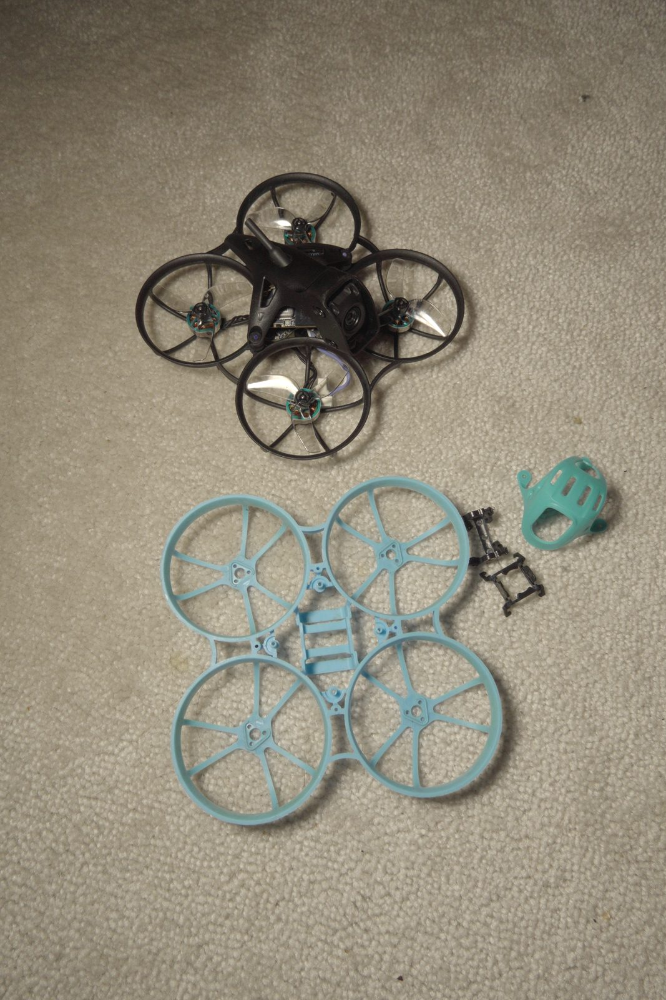
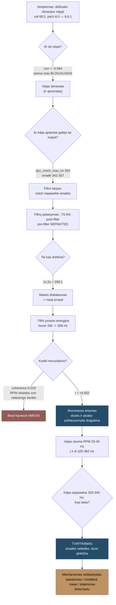
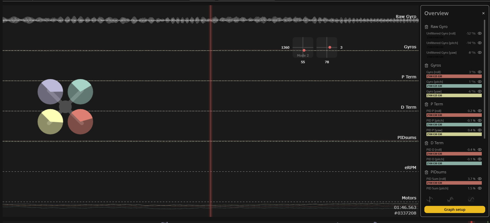
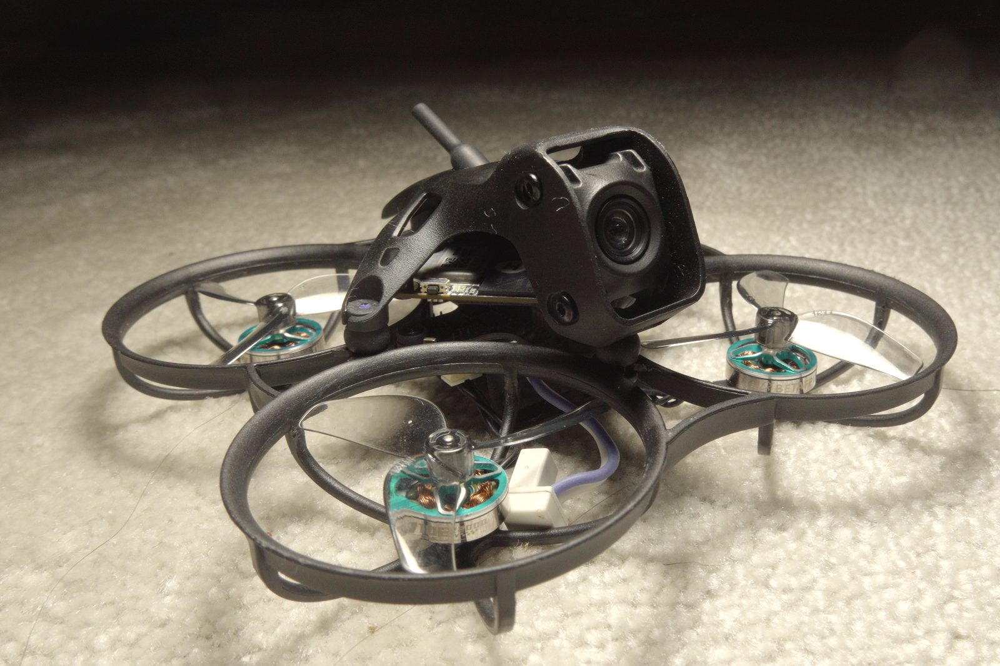
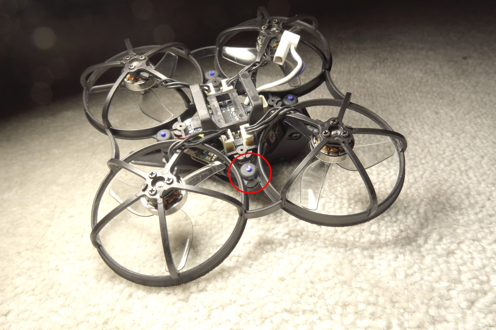
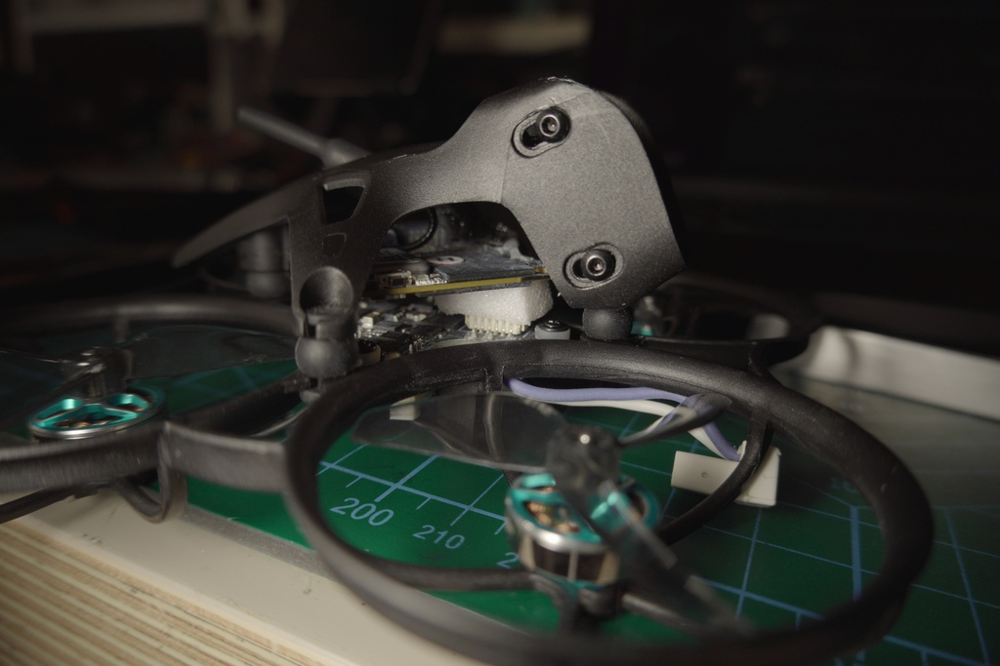
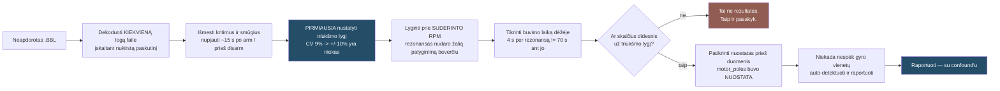

Craft name **Snake**. Pradžioje tai buvo Meteor75 Pro, dabar — Meteor75 Pro II: rėmas ir
gaubtas iš AliExpress, viskas, kas kainuoja, perkelta be pakeitimų. Tas pats
**Matrix 1S 3-in-1 FC**. Tas pats **narrow-FOV DJI O4** air unit. Naujas kiautas, seni viduriai,
ir kai baigiau — 169 skrydžiai bei 15 574 sekundės logų, su kuriais teko ginčytis.

Planuota buvo penkiolikos minučių perstatymas. Gavau savaitę rezonanso vaikymosi, tris
atšaukimus, vieną tvarkingą hipotezę, kuri buvo visiškai neteisinga, vieną tuning pakeitimą,
kurį teko atsukti atgal, ir vieną metriką, kuri man kelias iteracijas melavo, kol pastebėjau.

Viso šio įrašo tezė: **gaubtas, kuris išsprendė jello problemą, yra tas pats gaubtas, su kuriuo
dabar kovoja flight controller'is.** Atskirti kamerą nuo rėmo yra gerai. Atskirti ją *minkštai* —
nėra be kainos.

## Konstrukcija ir neatitikimas, kuris pasirodė svarbus



*Kairėje: senas Pro rėmas ir gaubtas, išmontuoti. Dešinėje: sumontuotas Pro II. Tas pats skraidymo valdiklis, tas pats oro modulis, tie patys varikliai — pasikeitė tik konstrukcija.*

- **Rėmas + gaubtas:** Meteor75 Pro II, dalys iš AliExpress
- **Viduriai:** perkelti iš Meteor75 Pro — tas pats Matrix 1S 3-in-1 FC, tas pats narrow-FOV
  DJI O4 air unit
- FC target `BETAFPVG473` (STM32G473), manufacturer id `BEFH`
- Betaflight **4.5.1** (2025 12 11, `77d01ba3b`)
- 1S LiHV — `vbat_max_cell_voltage = 435`, `auto_profile_cell_count = 1`
- DSHOT300, `dshot_bidir = ON`, `motor_poles = 12`
- 3,2 kHz gyro ir PID kilpa — `looptime 312`, `pid_process_denom 1`
- `blackbox_sample_rate = 1/2` → 1582 Hz įrašymas, **791 Hz Nyquist**
- Digital VTX per MSP DisplayPort, serial 3
- `yaw_motors_reversed = ON` (props out)

O štai dalis, kuri pasirodė centrinė ir apie kurią pirkdamas nė nepagalvojau: **Pro II gaubtas
perprojektuotas O4 Wide moduliui.** Snake skraido su narrow-FOV O4, tad gaubtas neša ne tą masę,
kuriai buvo suprojektuotas, o FC/gaubto sąsaja nėra ta pora, kuriai rėmas buvo suprojektuotas.
Stačiau hibridą ir vadinau tai upgrade'u.

Du dalykai, kuriuos patikrinau, o ne priėmiau kaip savaime suprantamus. **`motor_poles = 12` yra nuostata, o
ne matavimas**, todėl patikrinau pagal duomenis: išmatuotas dominuojantis roll ašies dažnis,
padalyta iš apskaičiuotos 1×, davė **1,008–1,020**. Jei fizinis polių skaičius būtų 14, santykis
būtų apie 1,17. RPM filtras visą laiką buvo sutinkintas teisingiems dažniams.

**Ir mano PID slankiukai nieko nedarė.** Profile 0 buvo `simplified_pids_mode = OFF`, taigi
sukonfigūruotos slankiukų vertės (master multiplier 120, d_gain 120, pi_gain 120) buvo
**neaktyvios**. Profile 0 visą laiką skraidė su Betaflight 4.5 standartinėmis vertėmis:
roll 45/80/40, pitch 47/84/46, yaw 45/80/0. Verta žinoti prieš praleidžiant vakarą
teoretizuojant apie savo tune'ą.

## Simptomas

> „Skraidant kieme, esant šiek tiek vėjo, gavau didžiules vibracijas.“

Pirmas logas, seni propai. Roll ašies pre-filter HF energija (80–780 Hz) — **68,5 °/s** RMS.
Pitch: **8,0**. Yaw: **11,4**. Tai **8,6 : 1 roll/pitch santykis**, o tai nėra triukšmo
problema — tai vienos ašies mechaninė problema, apsirengusi triukšmo kostiumu.

Po filtrų ta pati ašis rodė **1,38 °/s** — RPM filtras slopino maždaug **34 dB** ir mandagiai
slėpė nuo flight controller'io didelį mechaninį defektą. Dronas skraidė normaliai. Gyro rėkė.

Harmonikų struktūra pasakė, kokio tipo tai defektas: **1× ir 2× santykis buvo apie 200:1**
(53:1 iki 212:1, priklausomai nuo motoro), o tai vadovėlinis masės disbalansas. Sulankstyta
mentė ar tikra aerodinaminė apkrova įneštų realios energijos į aukštesnes harmonikas;
čia jos praktiškai nebuvo.

*Išlyga, kurios tyliai nepraleisiu:* apie 341 Hz 3-ioji harmonika atsiduria 1023 Hz, o tai virš
šio logo **791 Hz Nyquist**, tad blade-pass turinio įvertinti buvo neįmanoma. 2× apie 682 Hz
buvo diapazone ir švari, ir būtent ji yra diagnostinė — tad išvada grindžiama 2×, o ne
pilnu harmonikų vaizdu.

## Daugiau vėjo — mažiau vibracijų, o taip būti negali

Pirmoji mano nuojauta buvo, kad tai vėjo problema. Taip ir parašyta mano paties pastaboje. Todėl
lyginau atkarpas ties **suderintu propelerio dažniu** (330–350 Hz), kad rezonansas liktų
fiksuotas, o kistų tik oras.

```chart
{
  "type": "bar",
  "data": {
    "labels": [
      "lauke, gūsingiausia (LF over 18)",
      "lauke, visa",
      "lauke, ramiausia",
      "vidus, švari atkarpa",
      "vidus, ramiausias oras"
    ],
    "datasets": [
      {
        "label": "roll HF RMS",
        "data": [
          54.9,
          63.1,
          67.7,
          78.1,
          80.9
        ],
        "borderColor": "#244d68",
        "backgroundColor": "#244d68",
        "borderWidth": 1
      }
    ]
  },
  "options": {
    "responsive": true,
    "plugins": {
      "legend": {
        "display": false,
        "position": "bottom"
      }
    },
    "scales": {
      "y": {
        "title": {
          "display": true,
          "text": "roll pre-filter HF RMS (°/s)"
        }
      }
    }
  }
}
```

| atkarpa | roll HF (°/s) | turbulencija | trukmė |
|---|---|---|---|
| lauke, gūsingiausia (LF>18) | **54,9** | 30,7 | 7,3 s |
| lauke, visa | 63,1 | 12,5 | 35,1 s |
| lauke, ramiausia | 67,7 | 5,0 | 18,8 s |
| **viduje, švari atkarpa** | 78,1 | 11,8 | 12,0 s |
| **viduje, ramiausias oras** | **80,9** | 4,2 | 5,9 s |

`corr(turbulencija, vibracija)` ties fiksuotu RPM = **−0,584**.

Daugiau vėjo — *mažiau* vibracijų. Visiškai nejudantis oras patalpoje buvo **blogiausias**
atvejis, kokį pavyko sukurti.

Tai vienas naudingiausių savaitės rezultatų, nes jis nužudo akivaizdų paaiškinimą pirmą dieną, o ne
penktą, ir dar todėl, kad priežastis, kodėl taip nutinka, ir *yra* mechanizmas. Jai užsidirbti
reikės dar kelių skyrių.

## Du dalykai, kuriuos mano konfigūracija darė neteisingai

Prieš vaikantis fizikos, normaliai perskaičiau savo filtrų nuostatas, o tai reikėjo padaryti
pirmiausia:

```
dyn_notch_count   = 1     (default 3)
dyn_notch_q       = 400   (labai siauras)
dyn_notch_min_hz  = 150
dyn_notch_max_hz  = 350   <-- ŽEMIAU išmatuotos 342-357 Hz smailės
gyro_lpf1_static_hz   = 0 (LPF1 visiškai išjungtas)
gyro_lpf1_dyn_min_hz  = 0
```

Vienas notch'as, `q = 400` padarytas plonas kaip adata, su viršutine riba **žemiau tikrosios
smailės** — vienintelis filtras, nukreiptas į šią problemą, fiziškai negalėjo jos pasiekti.
LPF1 buvo visiškai išjungtas. Pataisymas:

```
set dyn_notch_count = 3
set dyn_notch_q = 300
set dyn_notch_min_hz = 100
set dyn_notch_max_hz = 600
set gyro_lpf1_dyn_min_hz = 250
```

Išmatuota ties suderintu propelerio RPM:

```chart
{
  "type": "bar",
  "data": {
    "labels": [
      "post-filter roll HF",
      "D-term roll RMS",
      "D-term pitch RMS",
      "motorų jitter"
    ],
    "datasets": [
      {
        "label": "pokytis (%)",
        "data": [
          -70.6,
          -51.0,
          -49.0,
          -42.0
        ],
        "borderColor": "#244d68",
        "backgroundColor": "#244d68",
        "borderWidth": 1
      }
    ]
  },
  "options": {
    "responsive": true,
    "plugins": {
      "legend": {
        "display": false,
        "position": "bottom"
      }
    },
    "scales": {
      "y": {
        "title": {
          "display": true,
          "text": "pokytis (%)"
        }
      }
    }
  }
}
```

| metrika | prieš | po | pokytis |
|---|---|---|---|
| post-filter roll HF RMS | 1,71 | 0,58 | **−70,6%** |
| bendras slopinimas | 32,8 dB | 43,6 dB | +10,8 dB |
| D-term roll RMS | 6,7 | 3,3 | −51% |
| D-term pitch RMS | 4,3 | 2,2 | −49% |
| motorų išvesties jitter | 1,37 | 0,80 | **−42%** |

Pre-filter nepasikeitė, ir tai visa esmė: **filtrai apsaugo kilpą, jie netaiso konstrukcijos.**
Dronas po to drebėjo lygiai taip pat stipriai. Tiesiog flight controller'is nustojo į tai
reaguoti.

## Matavimo riba — skaičius, kurį reikėjo nustatyti pirmą

Viskas po šio taško priklauso nuo vieno nuobodaus klausimo: kokio dydžio turi būti pokytis, kad
man būtų leista jį pavadinti tikru? Todėl išmatavau pre-filter roll HF RMS sklaidą *viename
skrydyje*, prie **fiksuoto** RPM, ir laikiau tai savo triukšmo lygiu:

```
CV = 9,0%,  max/min = 1,38   (n = 21 langas po 3 s)
koreliacija su paketo įtampa    = +0,04
koreliacija su laiku/temperatūra = -0,05
```

**Bet kuris pokytis, mažesnis nei maždaug ±10%, yra neatskiriamas nuo triukšmo.** Ne
„tikriausiai triukšmas“ — neatskiriamas. Tai nėra dėl paketo įtampos kritimo ir nėra terminis
dreifas; abi koreliacijos plokščios. Tai tiesiog tiek, kiek šis matavimas blaškosi, kai niekas
nesikeičia, ir tas skaičius vėliau tą pačią savaitę nužudė kelias išvadas, kurias norėjau
pasilikti. Nustatyk triukšmo lygį prieš patikėdamas bet kokiu rezultatu — ypač tuo, kuris tau
patinka.

## Propai: pirma tikra mechaninė pergalė

Nauji propai iš karto pakeitė tris dalykus — bloga eksperimentinė higiena, labai geras vakaras:

- RPM-per-output sklaida tarp keturių motorų sumažėjo nuo **9,2 iki 4,4 procentinio punkto**
- 1× amplitudės susilygino — m1 108,7 → 56,7 °/s, m4 107,1 → 56,8
- hover propelerio dažnis nukrito **330 → 308 Hz**

Lauke, pilnas RPM sweep'as, tas pats aparatas, taigi čia kinta *sužadinimas*:

```chart
{
  "type": "line",
  "data": {
    "labels": [
      275,
      300,
      325,
      350,
      375,
      400,
      425
    ],
    "datasets": [
      {
        "label": "seni propai",
        "data": [
          42,
          55,
          62,
          55,
          43,
          32,
          25
        ],
        "borderColor": "#244d68",
        "backgroundColor": "transparent",
        "borderWidth": 2,
        "pointRadius": 3,
        "tension": 0.25,
        "spanGaps": true,
        "fill": false
      },
      {
        "label": "nauji propai",
        "data": [
          42,
          43,
          34,
          24,
          25,
          22,
          15
        ],
        "borderColor": "#915d52",
        "backgroundColor": "transparent",
        "borderWidth": 2,
        "pointRadius": 3,
        "tension": 0.25,
        "spanGaps": true,
        "fill": false
      }
    ]
  },
  "options": {
    "responsive": true,
    "plugins": {
      "legend": {
        "display": true,
        "position": "bottom"
      }
    },
    "scales": {
      "y": {
        "title": {
          "display": true,
          "text": "roll pre-filter HF RMS (°/s)"
        }
      },
      "x": {
        "title": {
          "display": true,
          "text": "propelerio 1x dažnis (Hz)"
        }
      }
    }
  }
}
```

| prop Hz | 275 | 300 | 325 | 350 | 375 | 400 | 425 |
|---|---|---|---|---|---|---|---|
| seni propai | 42 | 55 | **62** | 55 | 43 | 32 | 25 |
| nauji propai | 42 | 43 | **34** | 24 | 25 | 22 | 15 |

*Sweep'as sąmoningai nukirstas ties 425 Hz. 450 ir 475 Hz krepšeliai duomenyse yra, bet juose
tik 1,1–3,0 s dwell'o prieš 32–53 s tuose krepšeliuose, kurie svarbūs, o 4 s prašvilpimas per
rezonansą negali sukelti tokios pačios amplitudės kaip 50 s stovėjimas ant jo. Visi parodyti
krepšeliai abiejuose skrydžiuose viršija 4 s.*

−45% smailėje, −56% ties 350–375 Hz. Fiksuotos juostos 325–365 Hz energija:
**1185 → 263 — 78% mažiau.**

Atkreipk dėmesį, kur abi kreivės pradeda: ties 275 Hz jos **identiškos — 42 °/s**. Žemiau
rezonanso propai nesukuria jokio išmatuojamo skirtumo. Viską, ką nauji propai davė, jie davė
juostos viduje — ir tai pirma užuomina, kad tai iš tikrųjų niekada nebuvo propelerių
balansavimo istorija.

Tuo metu maniau, kad išsprendžiau viską propų rinkiniu ir notch konfigūracija. Net teisingai
neaprašiau, *kokia* buvo problema.

## Kodėl drebėjo tik kartais — ir viena tvarkinga hipotezė, kuri buvo klaidinga

Pastebėjimas, kuris viską atvėrė, yra tas, kurį beveik ignoravau, nes buvau jį užsirašęs ir
palikęs kaip miglotą: *drebėjimas ne visada yra, tik kai kuriose orientacijose vėjo atžvilgiu.*

Nenuolatinis. Priklausantis nuo orientacijos. Taigi pirma mano idėja buvo **beat dažniai**:
keturi motorai, besisukantys 343 / 313 / 337 / 332 Hz, prognozuoja beat'us prie 5,2, 6,1, 11,3,
19,7, 24,9 ir 31,0 Hz — būtent toje juostoje, kur mačiau judantį aparatą. Tvarkinga, patikrinama,
maloni ir neteisinga:

```
coherence(beat gaubtinė, matomas 8-45 Hz judesys) = 0,019 vidurkis, 0,063 maks.
corr(RPM sklaida, gaubtinė)                        = -0,287    (neteisinga kryptis)
išmatuota moduliacija 1,9 Hz vs artimiausia prognozuota pora 5,2 Hz
```

0,019 coherence nėra silpnas signalas, tai *nėra* signalas. Ir RPM sklaidos koreliacija išėjo
**neigiama** — priešinga tam, ko reikalauja beat modelis. Numirė per vieną popietę.

Tai, kas realiai prognozavo drebėjimą, buvo daug nuobodesnė idėja:

| modelis | koreliacija su vibracijos gaubtine |
|---|---|
| **rezonanso artumas (Lorentzian @ 343 Hz)** | **+0,652** |
| motorų skaičius 325–365 Hz juostoje | +0,583 |
| vidutinis propelerio dažnis | +0,308 |
| motorų RPM sklaida | −0,287 |
| throttle | +0,182 |

Ir tada dozės ir atsako priklausomybė, kuri yra maždaug tokia vadovėlinė, kokia lauko duomenys tik gali būti:

```chart
{
  "type": "bar",
  "data": {
    "labels": [
      "0",
      "1",
      "2",
      "3",
      "4"
    ],
    "datasets": [
      {
        "label": "vibracijos gaubtinė",
        "data": [
          55.46,
          78.38,
          95.41,
          108.71,
          111.64
        ],
        "borderColor": "#244d68",
        "backgroundColor": "#244d68",
        "borderWidth": 1
      }
    ]
  },
  "options": {
    "responsive": true,
    "plugins": {
      "legend": {
        "display": false,
        "position": "bottom"
      }
    },
    "scales": {
      "y": {
        "title": {
          "display": true,
          "text": "vibracijos gaubtinė (°/s)"
        }
      },
      "x": {
        "title": {
          "display": true,
          "text": "motorų 325-365 Hz juostoje"
        }
      }
    }
  }
}
```

| motorų 325–365 Hz juostoje | gaubtinė | % skrydžio |
|---|---|---|
| 0 | **55 °/s** | 21% |
| 1 | 78 | 13% |
| 2 | 95 | 17% |
| 3 | 109 | 38% |
| 4 | **112 °/s** | 11% |

**Ji padvigubėja.** Suskaičiuok, kiek propų sėdi rezonanso lange, ir gali prognozuoti drebėjimą.

Tai paaiškina ir nenuolatinumą, ir priklausomybę nuo orientacijos, *ir* atbulą vėjo koreliaciją.
Vėjo apkrova perskirsto trauką tarp kampų, o tai pastumia atskirų motorų RPM 20–40 Hz,
įslysdama ir išslysdama iš lango — gūsiai **išsklaido** propus nuo rezonanso. Patalpoje dronas
kybo kaip prilipęs ir pastato visus keturis tiksliai ant jo, tiek, kiek leisi. **Nejudantis oras
yra blogiausias atvejis, nes nejudantis oras yra *tiksliausias*.** Šis sakinys sugrįžta kiekvieną
kartą, kai lyginu skrydį patalpoje su skrydžiu lauke.

Tai perrėmina ir propelerių pergalę:

| | hover | atsarga iki 325 Hz | ≥1 motoras juostoje | ≥3 juostoje | gaubtinė |
|---|---|---|---|---|---|
| seni propai, viduje | 328 Hz | **−3** | 79% | 49% | 91,7 |
| nauji propai, viduje | 307 Hz | **+18** | 25% | 4% | 68,8 |
| nauji propai, lauke | 363 Hz | −38 (virš) | 63% | 6% | 35,4 |

Seni propai kybo **tiesiai rezonanso juostoje** — trys hercai atsargos. Mažesnis disbalansas
buvo mažesnė pergalės dalis; darbo taško patraukimas nuo rezonanso — didesnė. Atsitiktinai
padariau teisingą dalyką dėl priežasties, kurios nesupratau.



## Dvi problemos, ne viena — ir spąstai frazėje „Gyroflow sutvarkys“

Šį atskyrimą prikalti užėmė didžiąją savaitės dalį, ir būtent jis nusprendžia, nuo ko programinė
įranga gali ir negali išgelbėti.

**(a) ~320–345 Hz struktūrinė moda.** Roll dominuoja, 8:1. Tai jello šaltinis. Ji sėdi **eile
aukščiau už valdymo kilpos naudingą pralaidumą 20–40 Hz.** Jokia PID korekcija, jokia TPA
nuostata, jokia filtro pakaita jos nepasiekia. Filtrai neleidžia jai pasiekti kilpos; jie
neuždraudžia aparatui drebėti. Ir **nei Gyroflow, nei RockSteady negali pašalinti jello** — tai
iškraipymas kadro *vidyje*, pažeidimas įvyksta rolling shutter'io ribose dar prieš tai, kai
stabilizatorius apskritai pamato vaizdą.

**(b) Plačiajuostis 10–25 Hz turbulencijos sekimas.** Išmatuotas **Q ≈ 1,9–2,2**. Smailė
15,8–17,8 Hz roll ašyje, 10,6–12,9 Hz pitch, amplitudė 4,4–5,3 °/s. Valdymo kilpos ribinis
ciklas rodytų Q = 10–100; Q ≈ 2 yra silpnai slopinamas aparatas, kurį tikrai stumdo
turbulentiškas oras.

```chart
{
  "type": "bar",
  "data": {
    "labels": [
      "vėjo drebėjimas, roll",
      "vėjo drebėjimas, pitch",
      "48,5 Hz moda"
    ],
    "datasets": [
      {
        "label": "Q faktorius",
        "data": [
          2.2,
          2.2,
          83.7
        ],
        "borderColor": "#244d68",
        "backgroundColor": "#244d68",
        "borderWidth": 1
      }
    ]
  },
  "options": {
    "responsive": true,
    "plugins": {
      "legend": {
        "display": false,
        "position": "bottom"
      }
    },
    "scales": {
      "y": {
        "title": {
          "display": true,
          "text": "Q faktorius"
        }
      }
    }
  }
}
```

Ten *yra* ir tikrai aštri moda — 48,5 Hz prie **Q = 83,7** — kurios amplitudė **0,24 °/s**, t. y.
visiškai nereikšminga. Aukštas Q nėra tas pats kaip svarbus.

Tai kur gyvena tas judesys, kurį realiai *matai*?

```chart
{
  "type": "bar",
  "data": {
    "labels": [
      "1-5 Hz",
      "5-10 Hz",
      "10-20 Hz",
      "200-790 Hz"
    ],
    "datasets": [
      {
        "label": "seni propai, seni filtrai",
        "data": [
          3.84,
          2.66,
          1.45,
          1.68
        ],
        "borderColor": "#244d68",
        "backgroundColor": "#244d68",
        "borderWidth": 1
      },
      {
        "label": "seni propai, nauji filtrai",
        "data": [
          1.92,
          1.58,
          1.05,
          0.38
        ],
        "borderColor": "#915d52",
        "backgroundColor": "#915d52",
        "borderWidth": 1
      },
      {
        "label": "nauji propai, nauji filtrai",
        "data": [
          1.29,
          0.93,
          0.91,
          0.26
        ],
        "borderColor": "#bd9361",
        "backgroundColor": "#bd9361",
        "borderWidth": 1
      }
    ]
  },
  "options": {
    "responsive": true,
    "plugins": {
      "legend": {
        "display": true,
        "position": "bottom"
      }
    },
    "scales": {
      "y": {
        "title": {
          "display": true,
          "text": "roll gyro RMS, post-filter (°/s)"
        }
      },
      "x": {
        "title": {
          "display": true,
          "text": "juosta"
        }
      }
    }
  }
}
```

| | 1–5 Hz | 5–10 Hz | 10–20 Hz | 200–790 Hz |
|---|---|---|---|---|
| seni propai, seni filtrai | 3,84 | 2,66 | 1,45 | 1,68 |
| seni propai, nauji filtrai | 1,92 | 1,58 | 1,05 | 0,38 |
| nauji propai, nauji filtrai | **1,29** | **0,93** | **0,91** | **0,26** |

Vien filtrai nutraukė aukštą juostą 1,68 → 0,38, propai patraukė dar toliau: −66% ties 1–5 Hz,
−85% aukštai. Ir įsidėmėkite santykį: maždaug **penkis kartus daugiau energijos yra Gyroflow
taisomoje juostoje nei ten, kur rolling shutter vibraciją paverčia jello.** Būtent todėl vaizdas
atrodė priimtinai, kol gyro rėkė.



*Tai, su kuo iš tikrųjų kariauju. Viršuje neapdorotas giroskopas: tolydi juosta, kuri auga ir traukiasi, o ne švari linija. Viskas žemiau - filtruotas giroskopas, P, D, PID sumos - plokščia, t. y. filtrai dirba savo darbą. Kamerai iš to nieko.*

Pati savaime ta juosta yra tik skaičius loge. Problema — kas nutinka toliau: **tam tikromis
aplinkybėmis kilpa į ją reaguoja, varo variklius ja, ir rėmas tikrai pradeda judėti.** Tada tai
nebėra giroskopo rodmuo — tai drebėjimas vaizdo sraute. Ir tai nėra stipraus vėjo reiškinys; jis
pasireiškia sąlygomis, kurias pavadinčiau ramiomis.

Dabar spąstai, ir tai svarbiausias praktinis dalykas, kurį išmokau:

> **Vaizdo stabilizavimas išgelbsti tik tada, kai yra daug šviesos.**

Šviesią dieną ekspozicijos laikai trumpi, kiekvienas kadras aiškus, drebėjimas pasireiškia kaip
kadro-į-kadrą *poslinkis*, ir Gyroflow gali kadrus sulygiuoti ir tai pašalinti. Apniukusią dieną
kamera laiko užraktą atidarytą ilgiau. Dabar drebėjimas įvyksta *ekspozicijos metu*, o ne tarp
kadrų, ir įsirašo kaip **judesio suliejimas, įspaustas į pikselius**. Stabilizavimas gali
idealiai sulygiuoti sulietą kadrą — jis vis tiek sulietas. Visas klipas minkštas.

Taigi patogus rėminimas — jello nepataisomas, žemų dažnių drebėjimas pataisomas — yra per
dosnus. Sąžininga versija turi tris lygius:

| simptomas | ar pataisoma po skrydžio? |
|---|---|
| jello (rolling-shutter iškraipymas) | **ne** — nei Gyroflow, nei RockSteady |
| drebėjimas, ryški šviesa, trumpa ekspozicija | **taip** |
| drebėjimas, prieblanda, ilga ekspozicija | **ne** — tai suliejimas, ne poslinkis |

Du iš trijų neatkuriami, o kurį gausi tą dieną, sprendžia oras, ne tune. Todėl ir kabinausi į
mechaninę pusę dar ilgai po to, kai skraidymo valdiklis nustojo skųstis.

## Tuning eksperimentas, kuris nepavyko ir buvo atsuktas

D-term'as vėlavo po klaidos **16,4 ms** 8–45 Hz juostoje — beveik pusė ciklo ties 17 Hz — todėl
`dterm_lpf1_static_hz` pakėlimas iš 75 į 90 atrodė kaip nemokami pinigai. Suderintas hover
patalpoje, tie patys propai, 307 vs 309 Hz:

```chart
{
  "type": "bar",
  "data": {
    "labels": [
      "post-filter triukšmas",
      "D-term RMS",
      "D-term HF triukšmas",
      "motorų jitter",
      "14 Hz virpesys"
    ],
    "datasets": [
      {
        "label": "pokytis (%)",
        "data": [
          171,
          242,
          283,
          370,
          168
        ],
        "borderColor": "#244d68",
        "backgroundColor": "#244d68",
        "borderWidth": 1
      }
    ]
  },
  "options": {
    "responsive": true,
    "plugins": {
      "legend": {
        "display": false,
        "position": "bottom"
      }
    },
    "scales": {
      "y": {
        "title": {
          "display": true,
          "text": "pokytis (%)"
        }
      }
    }
  }
}
```

| | lpf1 = 75 | lpf1 = 90 | pokytis |
|---|---|---|---|
| post-filter roll triukšmas | 0,34 | 0,92 | **+171%** |
| D-term RMS | 2,06 | 7,04 | **+242%** |
| D-term HF triukšmas | 1,06 | 4,06 | **+283%** |
| **motorų jitter** | 0,555 | 2,606 | **+370%** |
| 14 Hz roll virpesys | 1,01 | 2,71 | **+168%** |

Tai nupirko **1,9 ms** vėlinimo už 370% didesnį motorų jitter'į, o spektras buvo blogesnis
*kiekviename* dažnyje nuo 2 iki 400 Hz. Atsukta.

Airmode buvo įjungtas tą pačią sesiją (logas patvirtina: feature mask delta lygiai 4194304) ir
liko — 3,3 s žemiau 1250 throttle su minimalia motorų išvestimi 201, jokio valdymo autoriteto (angl. *control authority*) praradimo.
**Confound'as:** pasikeitė du kintamieji vienu metu, todėl 14 Hz augimo negalima aiškiai
priskirti nei filtrui, nei airmode. Kitos keturios eilutės pakankamai didelės, kad tai išgyventų;
14 Hz skaičius nėra švarus.

### Kodėl negalėjau išmatuoti savo step response

Kartotinai bandžiau iš šių logų išpešti tikrą step response ir kartotinai buvau užblokuotas
įvesties:

```
setpoint energija: roll 95% žemiau 1,7 Hz | pitch 1,4 Hz | yaw 1,5 Hz
staigių stick reversal: 0
slew įvykių >4000 deg/s^2: 3
```

Drono kilpa gyvena 20–40 Hz. Sklandūs, tolydūs roll'ai neturi aukšto dažnio turinio,
taigi step response yra **apribotas įvesties pralaidumo, o ne drono**. „173 ms rise time“, kurį
apskaičiavau pradžioje, buvo tikslus matavimas — mano stick'ų.

Vienas skrydis su 39 staigiais reversal'ais ir 26 aštriais slew'ais galiausiai davė tikrą
skaičių: **roll overshoot +10,4% prie 133 ms, rise(90%) 77,7 ms, 50% delay 32,9 ms** — su n = 6
žingsniais, nes logas baigėsi 9,6 G kritimu. Orientacinis, neužbaigtas.

## Blogas motoras, kuris pasirodė esąs oras

Didžiąją savaitės dalį vienas motoras nuosekliai atrodė kaltas:

```
m2 RPM-per-output:  -4,2% iki -6,1%    (blogiausias KIEKVIENAME loge)
m1 hover output:    +6,7% iki +11,1%   (dirba sunkiausiai, ir VIENINTELIS clipping'antis)
```

m1 clipping'o 0,789% kadrų, kai m2 ir m3 sėdėjo lygiai prie 0,000%, o drebėjimas buvo **1,59×
blogesnis**, kai motorai buvo prie viršutinės ribos. Diagnozė: užsikirtęs guolis m2 ir
pervargęs m1. Dvi aparatinės diagnozės, abi užtikrintos.

Tada pasukau gaubtą 180° ir eiliškumas **apsivertė**:

```chart
{
  "type": "bar",
  "data": {
    "labels": [
      "m1",
      "m2",
      "m3",
      "m4"
    ],
    "datasets": [
      {
        "label": "prieš gaubto pasukimą",
        "data": [
          -0.1,
          -5.3,
          5.0,
          0.4
        ],
        "borderColor": "#244d68",
        "backgroundColor": "#244d68",
        "borderWidth": 1
      },
      {
        "label": "po gaubto pasukimo",
        "data": [
          3.1,
          5.0,
          -3.4,
          -4.7
        ],
        "borderColor": "#915d52",
        "backgroundColor": "#915d52",
        "borderWidth": 1
      }
    ]
  },
  "options": {
    "responsive": true,
    "plugins": {
      "legend": {
        "display": true,
        "position": "bottom"
      }
    },
    "scales": {
      "y": {
        "title": {
          "display": true,
          "text": "RPM vienam išvesties vienetui, nuokrypis nuo vidurkio (%)"
        }
      },
      "x": {
        "title": {
          "display": true,
          "text": "motoras"
        }
      }
    }
  }
}
```

```
prieš pasukimą:  m2 = -4,2% iki -6,1%   (blogiausias)
po pasukimo:     m2 = +4,3% iki +8,0%   (laisviausias)
```

Motoro defektas negali apsiversti ženklu, kai pasuki gaubtą. **Šablonas yra aerodinaminis —
gaubtas aerodinamiškai užstoja tuos propus, kurie atsiduria po juo.** Abi diagnozės atšauktos. Tai buvo
sumontavimas, ne aparatūra, ir vienintelė priežastis, kodėl tai išsiaiškinau, yra ta, kad
pakeičiau kažką nesusijusio ir vis tiek toliau mačiau.

Pasukimas realiai padarė darbą su CoG:

```chart
{
  "type": "bar",
  "data": {
    "labels": [
      "m1",
      "m2",
      "m3",
      "m4"
    ],
    "datasets": [
      {
        "label": "prieš pasukimą (15:53, lauke)",
        "data": [
          12.5,
          -5.8,
          -3.2,
          -3.4
        ],
        "borderColor": "#244d68",
        "backgroundColor": "#244d68",
        "borderWidth": 1
      },
      {
        "label": "po pasukimo (20:40)",
        "data": [
          -3.3,
          -13.8,
          11.8,
          5.3
        ],
        "borderColor": "#915d52",
        "backgroundColor": "#915d52",
        "borderWidth": 1
      }
    ]
  },
  "options": {
    "responsive": true,
    "plugins": {
      "legend": {
        "display": true,
        "position": "bottom"
      }
    },
    "scales": {
      "y": {
        "title": {
          "display": true,
          "text": "hover išvestis, nuokrypis nuo vidurkio (%)"
        }
      },
      "x": {
        "title": {
          "display": true,
          "text": "motoras"
        }
      }
    }
  }
}
```

Sunkiausiai dirbantis motoras persikėlė iš m1 į m3/m4, o m1 clipping'as nukrito
**0,812% → 0,000%**. **Vien pasukimas sumažino priekio/užpakalio poros skirtumą nuo +9,5% iki
+3,6%.**

Dvi pastabos apie apimtį, nes šiuos skaičius lengva neteisingai sudėti. **+12,5% ant m1
diagramoje yra konkrečiai 15:53 lauko skrydis**, o aukščiau cituotas `+6,7% iki +11,1%`
intervalas apima 14:26, 15:20 ir 16:28 logus — vienas skrydis prieš intervalą per tris, ir nė
vienas nepakeičia kito. Ir **pasukimas su putplasčiu yra atskiros intervencijos, kurių CoG
rezultatai nesigrandina**: pasukimas perkėlė poros skirtumą +9,5% → +3,6%, putplastis, vėliau ir
nepriklausomai, perkėlė jį +3,4% → +2,0%. Skaityti tai kaip vieną tęstinį pagerėjimą nuo +9,5%
iki +2,0% būtų klaida.

Ši modifikacija ne mano — gaubto pasukimą 180 laipsnių pasiūlė Oscar Liang savo Pro II apžvalgos
[Improvements You Can Make](https://oscarliang.com/betafpv-meteor75-pro-dji-o4-wide/#Improvements-You-Can-Make)
dalyje.

### Baterija, pasverta iš logo failo

Mažas šalutinis nuotykis, įtrauktas, nes man patiko. Du paketai, skraidyti vienas po kito;
hover RPM yra tinkamas masės pakaitinis rodiklis, kai propas ir konfigūracija fiksuoti:

```
log1: ore 70 s, hover 330 Hz, 966 rodomo krūvio
log2: ore 95 s, hover 340 Hz, 1585 rodomo krūvio
hover RPM santykis 1,0612 -> masės santykis 1,126 -> log2 yra 12,6% sunkesnis
```

Identifikuota vien iš logo, be jokios mano įvesties apie tai, kuris paketas buvo kuris.

Baterijos yra ir praktinė priežastis, kodėl gaubtas apsivertė: pasuktas jis duoda geresnį masės
paskirstymą su **LAVA 2 680 mAh** paketais, kuriais realiai skraidau, tad priekio/užpakalio
skirtumo perpus sumažėjimas buvo tikslas, o ne laiminga atsitiktinybė. Tie paketai duoda **apie
3 minutes, kai spaudžiu, ir 5–6 minutes kreiseriniu tempu.** Verta skaityti kartu su
sunkesnės/lengvesnės baterijos svarstymu žemiau — sunkesnė davė 36% ilgesnį skraidymo laiką ir 4×
daugiau motorų clipping'o.

## Tvirtinimas yra svertas, ne tune'as



*Gaubtas, apie kurį visas šis tekstas — suprojektuotas O4 Wide, o nešasi siauro vaizdo kampo O4. Kamerą jis izoliuoja kur kas geriau nei senasis. Bet tuo pačiu davė skraidymo valdikliui su kuo grumtis.*

Kilpa nepasiekia 320–345 Hz. Propai jau geri. Lieka konstrukcija — ir viso įrašo tezė: **rėmo ir
gaubto atskyrimas yra geras ir blogas tuo pačiu metu.**

Senas gaubtas per stipriai perdavė vibracijas į kamerą: jello, kurio vėliau niekas nebepataisys.
Naujasis izoliuotas gerokai geriau, tad tai, ką kamera dar mato, yra žemas dažnis ir Gyroflow
formos — sąlyginai. Bet tas pats atskyrimas sukūrė minkštą, silpnai slopinamą kelią tarp
FC/gaubto mazgo ir rėmo, ir FC dabar **kovoja su gaubtu**. Stipresniame vėjyje pralošia, nes
vėjas pastumia motorų RPM į rezonanso langą, ir moda būna sužadinama.

Pirmą savaitės pusę praleidau reguliuodamas valdymo kilpą, veikiančią 20–40 Hz, tikėdamasis
paveikti struktūrinę modą ties 320–345 Hz. Tai niekada nebūtų suveikę, ir mane įtikinti prireikė
dozės ir atsako priklausomybės kreivės. Toliau — penkios tvirtinimo konfigūracijos ta tvarka, kuria jas nuskraidžiau,
o išvada pasislenka du kartus.

### Vienas: didelis putplasčio gabalas, ir stiprinimas sugriuvo

Standus putplastis įterptas tarp FC ir VTX, ištempiant gummy ball tvirtinimus ir sustandinant
gaubto fiksaciją. Tas pats paketas (hover 345 vs 347 Hz), **nulis konfigūracijos pakeitimų** —
švarus mechaninis A/B.

Atsako dozė, kuri apibrėžė visą problemą, **sugriuvo**:

```chart
{
  "type": "bar",
  "data": {
    "labels": [
      "0",
      "2",
      "4"
    ],
    "datasets": [
      {
        "label": "prieš putplastį",
        "data": [
          35,
          52,
          57
        ],
        "borderColor": "#244d68",
        "backgroundColor": "#244d68",
        "borderWidth": 1
      },
      {
        "label": "po putplasčio",
        "data": [
          29,
          33,
          33
        ],
        "borderColor": "#915d52",
        "backgroundColor": "#915d52",
        "borderWidth": 1
      }
    ]
  },
  "options": {
    "responsive": true,
    "plugins": {
      "legend": {
        "display": true,
        "position": "bottom"
      }
    },
    "scales": {
      "y": {
        "title": {
          "display": true,
          "text": "vibracijos gaubtinė (°/s)"
        }
      },
      "x": {
        "title": {
          "display": true,
          "text": "motorų 325-365 Hz juostoje"
        }
      }
    }
  }
}
```

| | 0 motorų juostoje | 2 juostoje | 4 juostoje |
|---|---|---|---|
| prieš | 35 | 52 | **57** |
| **po** | **29** | **33** | **33** |

Vibracija anksčiau kildavo 45–63%, kai motorai įeidavo į juostą. Dabar ji plokščia: motorai,
sėdintys rezonanso juostoje, **nustojo turėti reikšmės**, o tai daug geresnis rezultatas nei juos
sumažinti.

Rezonanso kreivė sako tą patį:

```chart
{
  "type": "line",
  "data": {
    "labels": [
      250,
      275,
      300,
      325,
      350,
      375,
      400,
      425,
      450,
      475,
      500
    ],
    "datasets": [
      {
        "label": "prieš putplastį (sunkus paketas)",
        "data": [
          35,
          43,
          49,
          39,
          32,
          26,
          17,
          15,
          15,
          9,
          5
        ],
        "borderColor": "#244d68",
        "backgroundColor": "transparent",
        "borderWidth": 2,
        "pointRadius": 3,
        "tension": 0.25,
        "spanGaps": true,
        "fill": false
      },
      {
        "label": "po putplasčio (sunkus paketas)",
        "data": [
          30,
          27,
          26,
          28,
          25,
          25,
          27,
          27,
          22,
          15,
          12
        ],
        "borderColor": "#915d52",
        "backgroundColor": "transparent",
        "borderWidth": 2,
        "pointRadius": 3,
        "tension": 0.25,
        "spanGaps": true,
        "fill": false
      }
    ]
  },
  "options": {
    "responsive": true,
    "plugins": {
      "legend": {
        "display": true,
        "position": "bottom"
      }
    },
    "scales": {
      "y": {
        "title": {
          "display": true,
          "text": "roll pre-filter HF RMS (°/s)"
        }
      },
      "x": {
        "title": {
          "display": true,
          "text": "vidutinis propelerio 1x dažnis (Hz)"
        }
      }
    }
  }
}
```

| metrika | prieš | po | pokytis |
|---|---|---|---|
| rezonanso kreivės forma | **ryški smailė prie 48,8 °/s** | **iš esmės plokščia, 25–30 °/s** | smailės nebeliko |
| pre-filter roll RMS | 37,0 | 25,9 | **−30%** |
| post-filter roll | 0,65 | 0,50 | −23% |
| vibracijos gaubtinė | 40,6 | 30,8 | −24% |
| motorų clipping | m4 1,94%, m3 0,33% | **visi 0,00%** | — |
| priekio/užpakalio poros skirtumas (tik putplastis) | +3,4% | **+2,0%** | geriausias užfiksuotas |

Rezultatas čia yra **smailės išnykimas, o ne jos aukščio sumažėjimas** — ir šis skirtumas yra
sąmoningas. Prieš putplastį yra neabejotina stiprinimo smailė prie 48,8 °/s. Po putplasčio
smailės visai nėra: kreivė laikosi tarp 25 ir 30 °/s per visą 250–425 Hz sweep'ą, o „maksimumas“
yra tiesiog ten, kur tą kartą atsitiktinai nusėdo triukšmas. Cituojant vieną skaičių „po“,
gaunamas procentas, kuris iš tikrųjų yra rezonanso ir tiesios linijos palyginimas, todėl jo
necituosiu. Kreivė nustojo turėti formą. Tai ir yra rezultatas.

Ir energija neišnyko, ji persikėlė:

```chart
{
  "type": "bar",
  "data": {
    "labels": [
      "280-325",
      "325-365",
      "365-420",
      "420-500"
    ],
    "datasets": [
      {
        "label": "prieš putplastį",
        "data": [
          714,
          313,
          20,
          16
        ],
        "borderColor": "#244d68",
        "backgroundColor": "#244d68",
        "borderWidth": 1
      },
      {
        "label": "po putplasčio",
        "data": [
          181,
          135,
          104,
          77
        ],
        "borderColor": "#915d52",
        "backgroundColor": "#915d52",
        "borderWidth": 1
      }
    ]
  },
  "options": {
    "responsive": true,
    "plugins": {
      "legend": {
        "display": true,
        "position": "bottom"
      }
    },
    "scales": {
      "y": {
        "title": {
          "display": true,
          "text": "pre-filter roll energija"
        }
      },
      "x": {
        "title": {
          "display": true,
          "text": "dažnių juosta (Hz)"
        }
      }
    }
  }
}
```

| juosta | prieš | po |
|---|---|---|
| 280–325 Hz | 714 | **181** (−75%) |
| 325–365 Hz | 313 | **135** (−57%) |
| 365–420 Hz | 20 | 104 |
| 420–500 Hz | 16 | 77 |

**Išlyga:** throttle p99 buvo 1751 prieš 1968, taigi dalis to nulinio clipping'o rezultato yra
mano mažiau agresyvus skraidymas — silpniausia eilutė toje lentelėje, ir taip ją reikia skaityti.
Poros skirtumo eilutė yra **putplasčio** rezultatas, nepriklausomas nuo gaubto pasukimo rezultato
ankstesnėje įrašo dalyje.

### Du: TPU gummy viduje, nes putplastis šildo plokštę

Putplastis veikė, bet jis yra antklodė ant karščiausios plokštės vietos, todėl išėmiau. Jį
pakeitė **du** pakeitimai toje pačioje sesijoje:

1. **VTX dabar tvirtinamas tiesiai prie gaubto, silikonines įvores išėmiau.** Tai pašalina
   lankstų elementą kelyje tarp oro modulio masės ir gaubto — gaubtas ir VTX dabar faktiškai
   vienas kūnas.
2. **TPU siūlas įdėtas į gummy ball'us**, gerokai padidinant jų standumą ir sustandinant kelią
   nuo skraidymo valdiklio iki rėmo.

Du standumo padidinimai, dviejuose skirtinguose apkrovos keliuose, vienu metu. Todėl kad ir ką
rodytų skaičiai žemiau, **negaliu paskirstyti nuopelnų tarp jų** — pačiam sau sukurta atribucijos
problema, ir sąžininga ją pažymėti, o ne pasirinkti laimėtoją.



*TPU siūlas, įstumtas į gumines įvores. Raudonas apskritimas žymi vieną iš jų. Du darbai, ne vienas: standesnis susietumas ir gaubtas, kuris kur kas mažiau tikėtinai atsiskirs nuo rėmo.*

Antrajam TPU darbui matavimų nereikia: su siūlu viduje guminės įvorės kur kas mažiau linkusios
**atsiskirti** — o whoop'ui, kuris gyvena atsimušdamas į durų staktas, vien to jau verta. Oscar
Liang naudoja klijus; aš panaudojau siūlą, nes klijai yra vienpusės durys, o siūlą galima
ištraukti — ir tai svarbu, kai visa esmė yra A/B testuoti patį tvirtinimą.

Vertinimo planas buvo užrašytas **prieš** skrydį, nes nebepatikiu palyginimu, sugalvotu jau
pamačius duomenis. Pagrindinis kriterijus — kad **variklių-juostoje atsako kreivė** liktų
plokščia.

Ji liko plokščia. 84 s tvarkingo skrydžio patalpoje, antras armas, jokių smūgių, **`0`
konfigūracijos pakeitimų.** Rezonanso kreivėje patikima tik viena juosta — 79,6 s prie
300–325 Hz, prieš 0,5–1,8 s visur kitur — todėl brėžiu **tik tą tašką**, o ne liniją per triukšmą:

```chart
{
  "type": "line",
  "data": {
    "labels": [
      250,
      275,
      300,
      325,
      350,
      375,
      400,
      425,
      450,
      475,
      500
    ],
    "datasets": [
      {
        "label": "be putplasčio (lauke)",
        "data": [
          35,
          43,
          49,
          39,
          32,
          26,
          17,
          15,
          15,
          9,
          5
        ],
        "borderColor": "#244d68",
        "backgroundColor": "transparent",
        "borderWidth": 2,
        "pointRadius": 3,
        "tension": 0.25,
        "spanGaps": true,
        "fill": false
      },
      {
        "label": "+ putplastis (lauke)",
        "data": [
          30,
          27,
          26,
          28,
          25,
          25,
          27,
          27,
          22,
          15,
          12
        ],
        "borderColor": "#915d52",
        "backgroundColor": "transparent",
        "borderWidth": 2,
        "pointRadius": 3,
        "tension": 0.25,
        "spanGaps": true,
        "fill": false
      },
      {
        "label": "be įvorių + TPU (patalpoje, 79,6 s)",
        "data": [
          null,
          null,
          39,
          null,
          null,
          null,
          null,
          null,
          null,
          null,
          null
        ],
        "pointRadius": 8,
        "showLine": false,
        "borderColor": "#bd9361",
        "backgroundColor": "transparent",
        "borderWidth": 2,
        "tension": 0.25,
        "spanGaps": true,
        "fill": false
      }
    ]
  },
  "options": {
    "responsive": true,
    "plugins": {
      "legend": {
        "display": true,
        "position": "bottom"
      }
    },
    "scales": {
      "y": {
        "title": {
          "display": true,
          "text": "roll pre-filter HF RMS (deg/s)"
        }
      },
      "x": {
        "title": {
          "display": true,
          "text": "vidutinis propelerio 1x dažnis (Hz)"
        }
      }
    }
  }
}
```

39 °/s — tarp 49 be putplasčio ir 26 su putplasčiu, tik kad tos dvi kreivės nuskraidytos lauke, o
tas taškas — patalpoje, o tai, pagal patį pirmą šio teksto atradimą, yra **blogiausias** atvejis
šiam rezonansui. Atotrūkis padidintas nežinomu dydžiu. Būtent todėl kriterijus buvo atsako
kreivė, o ne rezonanso kreivė: ji lygina kvadrą su *pačiu savimi* prie skirtingų RPM viename
skrydyje, tad jai oras nesvarbus.

```chart
{
  "type": "bar",
  "data": {
    "labels": [
      "0 variklių",
      "1 variklis",
      "2 varikliai",
      "3 varikliai",
      "4 varikliai"
    ],
    "datasets": [
      {
        "label": "pasuktas, BE putplasčio",
        "data": [
          35,
          41,
          52,
          55,
          57
        ],
        "borderColor": "#244d68",
        "backgroundColor": "#244d68",
        "borderWidth": 1
      },
      {
        "label": "pasuktas, + putplastis",
        "data": [
          29,
          31,
          33,
          33,
          33
        ],
        "borderColor": "#915d52",
        "backgroundColor": "#915d52",
        "borderWidth": 1
      },
      {
        "label": "be įvorių + TPU (patalpoje)",
        "data": [
          49,
          52,
          52,
          null,
          null
        ],
        "borderColor": "#bd9361",
        "backgroundColor": "#bd9361",
        "borderWidth": 1
      }
    ]
  },
  "options": {
    "responsive": true,
    "plugins": {
      "legend": {
        "display": true,
        "position": "bottom"
      }
    },
    "scales": {
      "y": {
        "title": {
          "display": true,
          "text": "vibracijos gaubtinė (deg/s)"
        }
      },
      "x": {
        "title": {
          "display": true,
          "text": "variklių 325-365 Hz rezonanso lange"
        }
      }
    }
  }
}
```

Nuolydis per juostą, o tai ir yra tas skaičius, kuris svarbus:

| tvirtinimas | atsako nuolydis | verdiktas |
|---|---|---|
| pasuktas, be putplasčio | **+66%** | rezonansas pilnai stiprina |
| pasuktas, + putplastis | +15% | beveik nuslopintas |
| **be įvorių + TPU gummy viduje** | **+6%** | **nuslopintas** |

Buvimas rezonanso lange nebeturi reikšmės. Kriterijus įvykdytas. Dar du dalykai tame pačiame loge
pasirodė geresni nei putplasčio skrydyje: **po filtrų roll triukšmas 0,34 °/s prie 41,2 dB
slopinimo**, geriausias per visą sesiją, prieš 0,67 °/s ir 31,8 dB su putplasčiu; ir
**plokščiausias variklių balansas, kokį esu užfiksavęs** — −0,1 / −4,2 / +2,5 / +1,7 procento,
6,7 punkto sklaida, kai visi ankstesni skrydžiai turėjo 17–25, priekio/užpakalio skirtumas +1,7%
ir nulis įsisotinimo.

Ko šis logas **negali** pasakyti: jis buvo patalpoje ir surinko vieną RPM juostą, 80 iš 84
tvarkingų sekundžių ties 300–325 Hz. Pats sau nurodžiau 3–4 lėtus gazo perbėgimus, o nuskridau
hoverį, todėl struktūrinės *kreivės* čia nėra ir modos dažniai iš vieno RPM griežinėlio
nenustatysiu. Neapdoroto signalo skaičius taip pat atrodo blogesnis nei su putplasčiu — 39,1 °/s
prieš 26,0 — bet putplasčio skrydis buvo lauke prie 4,71 °/s vėjo, o šis patalpoje prie 1,99, o
ramus oras yra blogiausias atvejis, tad tas palyginimas nesąžiningas ramiajam. Vienintelis tikrai
lygiavertis skaičius yra patalpa prieš patalpą: prieš putplastį ir prieš gaubto pasukimą patalpoje
buvo **54 °/s** ties 300–325 Hz, o dabar **39** — maždaug **28% geriau**. Tikra, bet viena juosta.

### Trys: lauke, kur kompromisas apsivertė

121 s tvarkingo skrydžio lauke, 5,51 °/s vėjo, **nulis konfigūracijos pakeitimų** ir pagaliau
normalus RPM padengimas: **8 iš 12 juostų** po 4 s ar daugiau, prieš 5 visuose ankstesniuose
skrydžiuose. Geriausias viso šio darbo duomenų rinkinys.

Užrašytas kriterijus išsilaikė, dabar patvirtintas ir lauke:

| tvirtinimas | atsako nuolydis |
|---|---|
| be putplasčio | +66% |
| + putplastis | +15% |
| be įvorių + TPU, patalpoje | +6% |
| **be įvorių + TPU, lauke** | **+7%** |

Struktūrai fiksuota ypatybė tam neprieštarauja: su TPU ji yra **363 Hz**, su putplasčiu —
**368 Hz**, be nieko — **255 Hz**. Abu standūs sprendimai atsiduria toje pačioje vietoje —
standinimas tą ypatybę pakėlė, ir ji taip ir liko pakelta.

Bet putplastis vis tiek tylesnis mount'as. Lauke prieš lauką, prie sutapatinto propelerių RPM —
sąžiningas palyginimas, kurio laukiau dvi dienas:

```chart
{
  "type": "line",
  "data": {
    "labels": [
      275,
      300,
      325,
      350,
      375,
      400,
      425
    ],
    "datasets": [
      {
        "label": "be putplasčio",
        "data": [
          43,
          49,
          39,
          32,
          26,
          null,
          null
        ],
        "borderColor": "#244d68",
        "backgroundColor": "transparent",
        "borderWidth": 2,
        "pointRadius": 3,
        "tension": 0.25,
        "spanGaps": true,
        "fill": false
      },
      {
        "label": "+ putplastis",
        "data": [
          27,
          26,
          28,
          25,
          25,
          27,
          27
        ],
        "borderColor": "#915d52",
        "backgroundColor": "transparent",
        "borderWidth": 2,
        "pointRadius": 3,
        "tension": 0.25,
        "spanGaps": true,
        "fill": false
      },
      {
        "label": "be įvorių + TPU",
        "data": [
          44,
          38,
          35,
          32,
          31,
          23,
          21
        ],
        "borderColor": "#bd9361",
        "backgroundColor": "transparent",
        "borderWidth": 2,
        "pointRadius": 3,
        "tension": 0.25,
        "spanGaps": true,
        "fill": false
      }
    ]
  },
  "options": {
    "responsive": true,
    "plugins": {
      "legend": {
        "display": true,
        "position": "bottom"
      }
    },
    "scales": {
      "y": {
        "title": {
          "display": true,
          "text": "roll pre-filter HF RMS (deg/s)"
        }
      },
      "x": {
        "title": {
          "display": true,
          "text": "vidutinis propelerio 1x dažnis (Hz)"
        }
      }
    }
  }
}
```

Vidurkis per patikimas juostas: **26,2 °/s putplasčiui, 33,0 TPU** — apie 26% blogiau. Ir kreivė
mažiau plokščia: 1,13 putplasčiui, **2,14** TPU — blogiau net už 1,85 be jokio tvirtinimo
gerinimo — su piku vėl žemajame gale, 44 °/s ties 275–300 Hz, nukrentančiu iki 21 prie 425.

Taigi stiprinimo *mechanizmas* miręs, bet bendras vibracijos lygis pakilo. Du skirtingi teiginiai,
abu teisingi.

### Ir tada kamera vėl gavo jello

Šios dalies nenumačiau, ir tai visa šio teksto tezė, atėjusi iš priešingos pusės. Energija
250–450 Hz juostoje — būtent ją rolling shutter paverčia jello:

| tvirtinimas | 250–450 Hz RMS |
|---|---|
| be putplasčio | 34,8 |
| **+ putplastis** | **24,6** |
| **be įvorių + TPU** | **31,0** — +26% |

Žemų dažnių drebėjimas ore dabar beveik nejuntamas, o jello grįžo į vaizdą.

**Ir pirmasis mano paaiškinimas buvo neteisingas.** Parašiau, kad VTX įvorių išėmimas „standžiai
sujungė kamerą su gaubtu". Nesujungė: VTX yra plika plokštė, o **kamera tvirtinama ant gaubto**, ne
ant VTX. Tos įvorės kabino plokštę, ant kurios nieko nėra — negyva masė ir dar viena pakabinta
masė, laisva rezonuoti. Jų išėmimas nebuvo jello mechanizmas.

Mechanizmas yra **gaubto–rėmo** kelias, nes būtent ant jo jojasi kamera. TPU tuose gummy jį
sustandino, o standesnis kelias perduoda daugiau rėmo vibracijos tiesiai į kamerą. Kitaip nei
putplastis, siūlas prideda standumo be reikšmingo slopinimo — susieja nesugerdamas. Taigi jello
rizika yra sandauga, o ne lygis:

> jello ≈ (vibracija ant rėmo) × (gaubto tvirtinimo pralaidumas tuose dažniuose)

FC giroskopas matuoja tik pirmą narį. Antrojo blackbox loge nėra visai, o tai turi pasekmių
vienai mano paties lentelei žemiau.

Viena išlyga apie patį matavimą: sustandinus paties giroskopo tvirtinimą, pasikeičia ne tik tai,
ką rėmas *daro*, bet ir tai, ką giroskopas *praneša*. Standžiai pritvirtintas giroskopas tiksliau
susietas su tikruoju rėmo judesiu, tad dalis šio prieaugio yra geresnis susietumas su tiesa, o ne
blogesnis rėmas. Šių dviejų negaliu atskirti giroskopu, kuris pats yra eksperimento dalis.

### Keturi ir penki: visos ant vienos diagramos, ir mažas gabalėlis

Akivaizdus kitas žingsnis buvo VTX įvores **grąžinti**, o TPU gummy viduje palikti —
skirtingi keliai, skirtingi simptomai, ir nėra priežasties aukoti kameros izoliatoriaus dėl
standesnio valdiklio tvirtinimo. Išėmus tik **priekinį** TPU — tą vieną gummy, kuris priekyje
sieja gaubtą su rėmu — struktūrai fiksuota ypatybė nusileido nuo 363 Hz iki 280 Hz, o
dominavimas beveik perpus. Vienas gummy. Tiek lokalu tai pasirodė esą.

Visos kreivės — lauke, suskirstytos pagal vidutinį propelerių dažnį, ir įtrauktos tik juostos su
**4 s ar daugiau** išbūto laiko:

```chart
{
  "type": "line",
  "data": {
    "labels": [
      250,
      275,
      300,
      325,
      350,
      375,
      400,
      425
    ],
    "datasets": [
      {
        "label": "originalūs gummy, be putplasčio",
        "data": [
          null,
          43,
          49,
          39,
          32,
          26,
          null,
          null
        ],
        "borderColor": "#244d68",
        "backgroundColor": "transparent",
        "borderWidth": 2,
        "pointRadius": 3,
        "tension": 0.25,
        "spanGaps": true,
        "fill": false
      },
      {
        "label": "standus putplastis FC to VTX",
        "data": [
          null,
          27,
          26,
          28,
          25,
          25,
          null,
          null
        ],
        "borderColor": "#915d52",
        "backgroundColor": "transparent",
        "borderWidth": 2,
        "pointRadius": 3,
        "tension": 0.25,
        "spanGaps": true,
        "fill": false
      },
      {
        "label": "visi TPU gummy viduje",
        "data": [
          40,
          44,
          38,
          35,
          32,
          31,
          23,
          21
        ],
        "borderColor": "#bd9361",
        "backgroundColor": "transparent",
        "borderWidth": 2,
        "pointRadius": 3,
        "tension": 0.25,
        "spanGaps": true,
        "fill": false
      },
      {
        "label": "priekinis TPU išimtas",
        "data": [
          null,
          45,
          31,
          32,
          28,
          24,
          22,
          null
        ],
        "borderColor": "#95b0c1",
        "backgroundColor": "transparent",
        "borderWidth": 2,
        "pointRadius": 3,
        "tension": 0.25,
        "spanGaps": true,
        "fill": false
      }
    ]
  },
  "options": {
    "responsive": true,
    "plugins": {
      "legend": {
        "display": true,
        "position": "bottom"
      }
    },
    "scales": {
      "y": {
        "title": {
          "display": true,
          "text": "roll pre-filter HF RMS (deg/s)"
        }
      },
      "x": {
        "title": {
          "display": true,
          "text": "vidutinis propelerio 1x dažnis (Hz)"
        }
      }
    }
  }
}
```

| tvirtinimas | vidurkis °/s | FC išmatuota 250–450 Hz | **stiprinimo nuolydis** | struktūros ypatybė |
|---|---|---|---|---|
| originalūs gummy, be putplasčio | 37,7 | 34,5 | **+65%** | 255 Hz (6,0×) |
| didelis putplastis FC↔VTX | 26,2 | 24,5 | +15% | 368 Hz (5,4×) |
| visi TPU gummy viduje | 33,0 | 31,0 | **+7%** | 363 Hz (8,2×) |
| priekinis TPU išimtas | 30,1 | 25,4 | +16% | 280 Hz (4,4×) |

Tada konfigūracija, prie kurios nusėdau, jello būnant sprendžiamuoju faktoriumi: visi TPU išimti,
sugrąžinti originalūs gummy, o prie jungties priklijuotas **mažas** putplasčio gabalėlis — taip,
kad slopintų, bet neuždengtų karštosios plokštės pusės:



*Sugrąžinti originalūs gummy ir vienas mažas putplasčio gabalėlis prie jungties. Atkreipk dėmesį į dydį: tas putplastis, kuris realiai nužudė rezonansą, buvo kur kas didesnis ir sėdėjo tarp plokščių.*

Atkreipk dėmesį į dydį. Putplastis, kuris rezonansą praktiškai nuslopino, buvo **didelis**
gabalas tarp plokščių, gerokai didesnis už šį. Mažas gabalėlis buvo sąmoningas kompromisas:
pakankamai slopinimo, kad būtų verta, ir pakankamai mažas, kad ESC pusė kvėpuotų.

Tai buvo blogiausia iš penkių konfigūracijų, ir verta pasakyti atvirai, kaip blogai:

```chart
{
  "type": "line",
  "data": {
    "labels": [
      275,
      300,
      325,
      350,
      375,
      400
    ],
    "datasets": [
      {
        "label": "originalūs gummy, be nieko",
        "data": [
          43,
          49,
          39,
          32,
          26,
          null
        ],
        "borderColor": "#244d68",
        "backgroundColor": "transparent",
        "borderWidth": 2,
        "pointRadius": 3,
        "tension": 0.25,
        "spanGaps": true,
        "fill": false
      },
      {
        "label": "DIDELIS putplastis tarp plokščių",
        "data": [
          27,
          26,
          28,
          25,
          25,
          null
        ],
        "borderColor": "#915d52",
        "backgroundColor": "transparent",
        "borderWidth": 2,
        "pointRadius": 3,
        "tension": 0.25,
        "spanGaps": true,
        "fill": false
      },
      {
        "label": "visi TPU gummy viduje",
        "data": [
          44,
          38,
          35,
          32,
          31,
          23
        ],
        "borderColor": "#bd9361",
        "backgroundColor": "transparent",
        "borderWidth": 2,
        "pointRadius": 3,
        "tension": 0.25,
        "spanGaps": true,
        "fill": false
      },
      {
        "label": "priekinis TPU išimtas",
        "data": [
          45,
          31,
          32,
          28,
          24,
          22
        ],
        "borderColor": "#95b0c1",
        "backgroundColor": "transparent",
        "borderWidth": 2,
        "pointRadius": 3,
        "tension": 0.25,
        "spanGaps": true,
        "fill": false
      },
      {
        "label": "MAŽAS putplasčio gabalėlis",
        "data": [
          48,
          52,
          48,
          37,
          37,
          24
        ],
        "borderColor": "#244d68",
        "backgroundColor": "transparent",
        "borderWidth": 2,
        "pointRadius": 3,
        "tension": 0.25,
        "spanGaps": true,
        "fill": false
      }
    ]
  },
  "options": {
    "responsive": true,
    "plugins": {
      "legend": {
        "display": true,
        "position": "bottom"
      }
    },
    "scales": {
      "y": {
        "title": {
          "display": true,
          "text": "roll pre-filter HF RMS (deg/s)"
        }
      },
      "x": {
        "title": {
          "display": true,
          "text": "vidutinis propelerio 1x dažnis (Hz)"
        }
      }
    }
  }
}
```

| tvirtinimas | vidurkis °/s | stiprinimas | moda | **dominavimas** |
|---|---|---|---|---|
| originalūs gummy, be nieko | 37,7 | +65% | 255 Hz | 6,0× |
| **DIDELIS putplastis** | **26,2** | +15% | 368 Hz | 5,4× |
| visi TPU gummy viduje | 33,0 | **+7%** | 363 Hz | 8,2× |
| priekinis TPU išimtas | 30,1 | +16% | 280 Hz | **4,4×** |
| **MAŽAS putplasčio gabalėlis** | **41,0** | **+66%** | 311 Hz | **81,1×** |

Didžiausia vidutinė vibracija iš visų — blogiau nei nedaryti nieko — ir stiprinimas vėl +66%. Bet
labiausiai išsiskiria paskutinis stulpelis: struktūrai fiksuota moda yra **81× virš fono**, kai
visos kitos konfigūracijos yra tarp 4,4× ir 8,2×. Eile aštriau. Pitch sako tą patį — 9,4 °/s
pre-filter, blogiausia iš penkių.

Mažas gabalėlis modos neslopina — jis tik prideda menkai slopintą spyruoklę vienoje vietoje.
Didysis veikė todėl, kad buvo pakankamai didelis sugerti per visą sąlyties plokštumą. Ir ta aštri
311 Hz moda paaiškina retkarčiais matomą jello net su sugrąžintais lanksčiais originaliais gummy:
izoliacija nėra absoliuti, o tokio dominavimo moda kartais prasispaudžia ir per minkštą
tvirtinimą. Būtent tai ir mačiau — ne nuolatinį jello, o jello *kartais*.

**Verdiktas: mažas gabalėlis išimamas.** Sąžiningi variantai yra didelis gabalas, kuris
išmatuojamai veikė ir šildo ESC pusę, arba pliki originalūs gummy, kurie jello niekada nedavė,
bet palieka modą laisvai veikti aparate. Vieno rankenėlės čia nėra: standu perduoda vibraciją
kamerai, minkšta palieka modą laisvą, o vienintelis dalykas, kuris sutvarkė abu iš karto, yra
**slopinimas**.

## Trys išgąsčiai, kurie buvo ne tai, kuo atrodė

Vėlai priekinio-TPU skrydyje dariau split-S ir kvadras trūktelėjo, tarsi būtų į kažką atsitrenkęs.
Nebuvo į ką, ir logas sutinka: **smailė 3,8 G**, prieš 9,8 G žinomo atsitrenkimo į grindis ir
9,6 G žinomo kritimo toje pačioje sesijoje. Tai ir ne radijas — `rxSignalReceived` bei
`rxFlightChannelsValid` nenukrito nė karto, `failsafePhase` visą skrydį 0, o mažiausias RSSI yra
prie t≈39 s, visai ne prie įvykio.

Kas realiai nutiko, prie t = 86,2–86,5 s:

```
85,95  variklis 2 nuvestas į apatinę ribą (248 -> 128), jo RPM krenta 6450 -> 2700
86,20  yaw I narys prisisotina prie -230 ir ten užstringa
86,20  varikliai 3 ir 4 atsitrenkia į 2047 lubas, KAI variklis 2 sėdi prie 128
86,40  gyro roll -637, pitch -295, yaw +278 deg/s ... komanduotas yaw = 0
86,45  yaw pasiekia 346 deg/s, visiškai be komandos
```

Intervale 85,5–87,0 s **17,6% kadrų turėjo variklį prie lubų, o 30,4% — prie apatinės ribos.**
Mikseriui *vienu metu abiejuose galuose* neliko atsargos, tad diferencinio valdymo autoriteto atsakyti
pagaliukams nebeliko. Komanduotas yaw p99 buvo 19 °/s; kvadras atidavė 370. Priežastis:
didelio gazo split-S ant krentančio 1S paketo, kai yaw I narys jau prispaustas prie ribos ir
kovoja su anksčiau išmatuotu pastoviu yaw disbalansu. Trauka ir valdymo autoritetas pasibaigė tą pačią
sekundę.

**Blogo kontakto teorija, patikrinta.** Pirma mintis buvo trumpai atsijungęs baterijos kontaktas.
Logas sako ne:

- Pritaikius `Vbat = V0 − I·R` per visą skrydį, gaunama apie **35 mΩ** — sveikas 1S paketo su
  laidais galas.
- **Nulis kadrų** rodo įtampos deficitą, nepaaiškinamą srove — būtent tokį pėdsaką paliktų
  atsileidžiantis kontaktas, ir jo nėra.
- RPM kritimas smogė **vienam varikliui, ne keturiems**: blogiausią akimirką variklis 2 buvo prie
  2600 RPM, kai varikliai 1, 3 ir 4 buvo prie 21 417, 14 617 ir 23 033. Atsijungus baterijai
  badauja visi keturi.
- Tą akimirką variklio 2 **komanda buvo 238 iš 2047**. Mikseris pats jį ten nuvedė. Jam netrūko
  srovės — jam buvo pasakyta sustoti.

Dvi išlygos: srovės daviklio skalė šioje plokštėje nepatikrinta, tad 35 mΩ yra orientacinis, o
regresija neatskiria apkrovos kritimo nuo baterijos išsikrovimo per skrydį, todėl jos R² tik
0,28 — aštraus nepaaiškinamo šuolio nebuvimas yra tvirtas nepaisant to. Nuojauta dėl žemų
apsisukimų vis dėlto teisinga: 2600 RPM pakanka desync rizikai įsibėgėjant. Tik šįkart neišdegė.
dyn_idle laikėsi — po 3000 RPM riba buvo vos **0,04%** skrydžio laiko, ilgiausias tęstinis
epizodas **4 ms**.

**Paskui dar du trūktelėjimai, ir tai ne tune.** Vienas posūkyje, vienas nardant, plius trečias
pačioje pabaigoje. Patikrinau tune pirmiausia, nes pats taip įtariau: **konfigūracija baitas į
baitą identiška ankstesniam skrydžiui.** Radijas vėl tvarkoje — nė vieno kadro netekta,
`failsafePhase` 0, mažiausias RSSI 329 ir nieko šalia nė vieno įvykio.

| | t = 78,7 s (posūkis) | t = 88,7 s (nusileidimas) |
|---|---|---|
| variklis apatinėje riboje | m2 prie **202** | m4 prie **218** |
| variklis prie lubų | m4 prie 1757 | m2 prie 1734 |
| kadrų apačioje | **49,2%** | **61,4%** |
| kadrų prie lubų | 3,0% | **39,0%** |
| min RPM | 2717 | 2600 |

Pirmojo priartinimas nedviprasmiškas: variklis 2 nuvestas 293 → 146 → 124 ir prilaikytas apie
150 maždaug 400 ms, kol variklis 4 joja ant 2027 lubų. Paketas krenta 3,81 → 3,51 V. Yaw
išeina iki 86 °/s prieš roll komandą 47 ir jokios yaw komandos. Tada variklis 2 vėl įsibėgėja —
433, 562, 735, 917 — ir vėl skrenda. Tas pats gedimas kaip split-S. Per visą skrydį 2,74% kadrų
turi variklį prie lubų, ir beveik viską tai daro varikliai 3 ir 4 (1,60% ir 1,30%).

Vienas su tune susijęs radinys tikras: **yaw I narys svyruoja tarp −255 ir +271**, atsitrenkdamas
į ribą abiem kryptimis. Tai pastovus yaw disbalansas, suvartojantis valdymo autoritetą dar prieš manevrą, o
jo pataisymas atlaisvina daugiau atsargos nei bet koks koeficiento pakeitimas. dyn_idle problemos
ir čia nėra — **0,076%** skrydžio laiko žemiau 3000 RPM tikslo, ilgiausias epizodas **4 ms**.

**Ir smūgis, kurio tuomet nepaminėjau.** Prie t = 109,83 s yra **12,9 G** šuolis, pitch 2000 °/s,
ir logas baigiasi. Žinomas atsitrenkimas į grindis buvo 9,8 G, kritimas — 9,6 G; šis stipresnis už
abu. Verta apžiūrėti rėmą ir propus, kas tai bebuvo.

## Visos mano klaidos

Atšaukimai yra naudingiausias šio įrašo turinys, tad štai jie vienoje vietoje. Beveik kiekvienas
iš jų yra tikras, kompetentingai atliktas matavimas, nukreiptas į neteisingą dydį — būtent tokio
gedimo dabar tykau labiausiai.

### „Standumas, ne masė“ yra klaidinga dichotomija

Pirmiausia putplasčio rezultatą aprašiau kaip „standumas, ne masė“, pagrįsdamas hover-RPM masės
patikra (−0,8%), modos poslinkiu iš ~325 Hz į ~395 Hz ir užtikrintu „≈48% standesnis“. Visos trys
dalys buvo neteisingos arba nepagrįstos. Anksčiau nepriklausomų kūnų sujungimas kartu pakeičia
efektyvų standumą, modalinę masę *ir* slopinimą, ir iš šių duomenų jų atskirti neįmanoma.
Suformulavau klausimą, į kurį eksperimentas negalėjo atsakyti, ir vis tiek į jį atsakiau.

### Hover-RPM masės testas atsakė į neteisingą klausimą

Hover RPM matuoja **bendrą AUW**. Gaubto sujungimas nekeičia bendro AUW — jis keičia **modalinę
masę**, tą masės dalį, kuri dalyvauja būtent toje modoje. Vieno naudojimas kito atmetimui yra
kategorijos klaida, ir tai klaida, dėl kurios mažiausiai patenkintas, nes tai tokio tipo klaida,
kuri ją darant atrodo kaip griežtumas.

Ką *galiu* parodyti, tai tinkamai kontroliuotą palyginimą: lengvas paketas prieš sunkų,
putplasčio nėra nei viename, pakeistas tik paketas.

```chart
{
  "type": "bar",
  "data": {
    "labels": [
      "lengvas paketas",
      "sunkus paketas"
    ],
    "datasets": [
      {
        "label": "hover RPM (sužadinimas)",
        "data": [
          327,
          347
        ],
        "borderColor": "#244d68",
        "backgroundColor": "#244d68",
        "borderWidth": 1
      },
      {
        "label": "struktūrai fiksuota ypatybė",
        "data": [
          302,
          255
        ],
        "borderColor": "#915d52",
        "backgroundColor": "#915d52",
        "borderWidth": 1
      }
    ]
  },
  "options": {
    "responsive": true,
    "plugins": {
      "legend": {
        "display": true,
        "position": "bottom"
      }
    },
    "scales": {
      "y": {
        "title": {
          "display": true,
          "text": "Hz"
        }
      }
    }
  }
}
```

| | hover (sužadinimas) | struktūrai fiksuota ypatybė |
|---|---|---|
| lengvas paketas | 327 Hz | **302 Hz** |
| sunkus paketas | 347 Hz | **255 Hz** |
| pokytis | **+6,1%** | **−15,6%** |

Pridėta prisukta masė nuleido struktūrinę ypatybę **žemiau**, kai sužadinimas pakilo **aukščiau**.
Tai √(k/m) elgiasi kaip pridera. Sujungimo (coupling) modelis — kad gaubto pririšimas prie rėmo
pašalina reliatyvų laisvės laipsnį, o ne vien pastumia spyruoklės konstantą — yra bent jau taip
pat gerai pagrįstas kaip standumo aiškinimas, o masės pusėje — geriau pagrįstas.

Praktinė pasekmė: gummy ball'ai sujungia *FC su rėmu*, o putplastis sujungė *gaubtą su FC ir
rėmu*. Vien standesni ball'ai to neatkurtų — būtent todėl kitas eksperimentas standino
gummy'us iš vidaus, o ne tiesiog keitė durometrą.

### 325 → 395 Hz poslinkis ir 48% skaičius atšaukiami

Dvi to paties „struktūrai fiksuoto dažnio“ detektoriaus realizacijos stipriai nesutarė su
identiškais duomenimis: viena sakė 322–329 Hz prie 120× dominavimo, kita — 255 Hz prie 6×.
Priežastis matoma, kai pažiūri — kai keturi motorai išsibarstę ~30 Hz, į 40 Hz RPM griežinėlį
įsimeta lėčiausias motoras, tad „vidutinis RPM“ yra prastas pavadinimas tam, kas patenka į tą
dėžę. Abu skaičiai atšaukti.

Amplitudžių rezultatai išgyvena nepriklausomai nuo metodo; jie visai nepriklauso nuo modos
lokalizavimo. Putplastis davė didelį, tikrą sumažėjimą — tai niekada nebuvo ginčas.

### Metrika, kuri man kelias iteracijas melavo

Kelias iteracijas vėjo drebėjimo verdiktą vertinau vienu globaliu santykiu `drebėjimas / vėjas`
ir gavau 0,777 → 0,798 → 0,791 → 0,754. Perskaityta kaip: **„−4,4%, triukšmo ribose, tikro
pagerėjimo nėra."** Vos nenurašiau putplasčio tuo pagrindu.

Artefaktas. **Drebėjimas prieš vėją nėra proporcingas**, todėl globalus santykis visiškai
priklauso nuo to, kurioje vėjo diapazono vietoje pasitaikė paimti duomenis. Suskirsk į dėžes
pagal momentinį vėjo lygį ir lygink tik tas dėžes, kurias abu skrydžiai tikrai apėmė:

```chart
{
  "type": "line",
  "data": {
    "labels": [
      3,
      5,
      7.5,
      11,
      16.5
    ],
    "datasets": [
      {
        "label": "originalus",
        "data": [
          2.29,
          4.47,
          6.26,
          8.74,
          11.48
        ],
        "borderColor": "#244d68",
        "backgroundColor": "transparent",
        "borderWidth": 2,
        "pointRadius": 3,
        "tension": 0.25,
        "spanGaps": true,
        "fill": false
      },
      {
        "label": "sunkus paketas, be putplasčio",
        "data": [
          2.27,
          3.89,
          5.71,
          8.18,
          10.99
        ],
        "borderColor": "#915d52",
        "backgroundColor": "transparent",
        "borderWidth": 2,
        "pointRadius": 3,
        "tension": 0.25,
        "spanGaps": true,
        "fill": false
      },
      {
        "label": "sunkus paketas, + putplastis",
        "data": [
          2.56,
          3.66,
          4.98,
          6.72,
          8.52
        ],
        "borderColor": "#bd9361",
        "backgroundColor": "transparent",
        "borderWidth": 2,
        "pointRadius": 3,
        "tension": 0.25,
        "spanGaps": true,
        "fill": false
      }
    ]
  },
  "options": {
    "responsive": true,
    "plugins": {
      "legend": {
        "display": true,
        "position": "bottom"
      }
    },
    "scales": {
      "y": {
        "title": {
          "display": true,
          "text": "drebėjimo gaubtinė, 8-45 Hz (°/s)"
        }
      },
      "x": {
        "title": {
          "display": true,
          "text": "vėjo / trikdžio lygis, 0,5-15 Hz gaubtinė (°/s)"
        }
      }
    }
  }
}
```

| | w 2–4 | w 4–6 | w 6–9 | w 9–13 | w 13–20 |
|---|---|---|---|---|---|
| originalus | 2,29 | 4,47 | 6,26 | 8,74 | 11,48 |
| sunkus paketas, be putplasčio | 2,27 | 3,89 | 5,71 | 8,18 | 10,99 |
| **sunkus paketas, + putplastis** | 2,56 | **3,66** | **4,98** | **6,72** | **8,52** |

```
sunkus be putplasčio -> +putplastis : 6,21 -> 5,29  = -14,8%   (5 bendros dėžės)
originalus           -> +putplastis : 6,65 -> 5,29  = -20,4%   (5 bendros dėžės)
```

**Apie 15% mažiau vėjo drebėjimo prie suderinto vėjo, ne 4%.** Ir pažiūrėkite į formą: visi
keturi skrydžiai sutampa žemiausioje vėjo dėžėje (2,27–2,56) ir išsiskiria tik vėjui augant. Tas
sutapimas apačioje yra kalibruoto matavimo požymis — skrydžiai nėra vienas nuo kito paslinkti,
jie turi tikrai skirtingus nuolydžius.

Tuo pačiu auditavau, ir tai daug ką paaiškina apie ankstesnį blaškymąsi: kiekvienas skrydis iki
šiol pasiekė ≥4 s buvimo laiką tik **5 iš 12 arba 7 iš 12** RPM dėžių.

### Stulpelis, kurį pavadinau „jello juosta“

Ankstesnė šio įrašo versija tą 250–450 Hz stulpelį naudojo rikiuoti, kuris tvirtinimas duoda
daugiausia jello. **Tai buvo klaida, ir ji apvertė tikrovę.** Tą skaičių matuoja giroskopas ant
skraidymo valdiklio — jis aprašo, ką patiria *valdiklis*. Kamera yra ant gaubto, už atskiro
tvirtinimo, tad valdiklio vibracija tampa jello tik tiek, kiek gaubto kelias ją perduoda.

Kas tikrai nutiko — pastebėta vaizde, o ne išvesta iš giroskopo:

| tvirtinimas | rėmo rezonansas giroskope | jello vaizde |
|---|---|---|
| originalūs nemodifikuoti gummy | aiškiai matomas | **nėra** |
| didelis putplasčio gabalas tarp plokščių | **beveik visiškai nuslopintas** | nėra |
| TPU sustandinti gummy | šiek tiek mažesnis | **atsiranda jello** |

Visiškai nuoseklu, ir priešinga tam, ką numanė mano lentelė. Su lanksčiais originaliais gummy
rėmas gali smarkiai virpėti — 34,5 tame stulpelyje — o kamera to nemato, nes gaubto tvirtinimas
neperduoda. Sustandink tą tvirtinimą, ir ta pati vibracija atvyksta į sensorių. **Lankstūs gummy
yra geriausias, o ne blogiausias atvejis jello atžvilgiu.** Vaizdas čia buvo vienintelis tinkamas
prietaisas, ir reikėjo jo klausyti anksčiau.

### Bug'as mano paties analizatoriuje

Pirmasis mano step response raportas išdidžiai paskelbė „overshoot 0,0%“ visose trijose ašyse.
Lygiai nulis, visose trijose. Funkcija normalizavo kiekvieną atsaką pagal jo **smailę**, o tai
pačia konstrukcija prikala overshoot prie tiksliai nulio kiekvieną kartą. Pataisyta normalizuoti
pagal nusistovėjusią vertę. Jei metrika išeina įtartinai švari visose ašyse vienu metu, metrika
sugedusi.

### Painiava, kurią reikėjo pažymėti daug anksčiau

Tai nėra Meteor75 Pro II. Tai Pro II korpusas su **Pro vidumi**, įskaitant variklius: pasilikau
originalius **22 000 KV**, o serijinis Pro II turi **21 000 KV**.

Būnu tikslus, nes čia lengva persistengti. **Tai nekeičia hoverio sužadinimo dažnio** — hoverio
RPM nustato reikalinga trauka, ne KV, tad mažesnio KV variklis hoveriuoja tais pačiais
apsisukimais, tik prie kiek didesnės gazo padėties, ir 325–365 Hz langas nėra KV artefaktas. **Bet
tai keičia RPM-vienam-gazui**, momento konstantą ir srovę, tad pagaliuko–RPM atvaizdavimas ir
įsisotinimo atsarga už to split-S išsišokimo yra paveikti.

Didesnis dalykas laikosi: serijinis Pro II su O4 **Wide** nuo šio aparato skiriasi varikliais,
gaubto apkrova ir masės paskirstymu vienu metu. Visos tvirtinimo išvados išmatuotos ant hibrido,
ir negaliu tvirtinti, kad jos perkeliamos serijiniam aparatui.

## Ir didžioji: savaitę matavau ne tą juostą

Dabar korekcija, kuri naudingesnė už bet kurį atskirą aukščiau esantį rezultatą.

Savaitę tyriau struktūrinį rezonansą ties 320–345 Hz, ir išmatavau jį gerai. Propelerių pakaita,
gaubto pasukimas, putplastis, TPU gummy viduje, penkios tvirtinimo konfigūracijos, dozės ir atsako priklausomybės
kreivės, modų dažniai, pralaidumas. Viskas tikra ir pakartojama.

**Ir nė vienas iš tų dalykų nebuvo tai, ką iš tikrųjų buvau nusistatęs pataisyti.**

Savo pastabose vis rašiau tą patį: kvadras dreba, kartais, ilgai, ir tai daro skrisdamas tiesiai
lygiai taip pat kaip posūkyje. Jei tai būtų rezonansas — drebėtų *visą laiką*. Tas prieštaravimas
buvo mano pačio, jis buvo teisingas, o aš kelias dienas kalbėjau ne apie tai, nes rezonansą buvo
kur kas smagiau matuoti.

Tad nuėjau pažiūrėti, kur realiai gyvena nekomanduotas judesys — nekomanduotas reiškia gyro minus
setpoint, tai, ką kvadras daro neprašius:

```chart
{
  "type": "bar",
  "data": {
    "labels": [
      "1-4 Hz",
      "4-8 Hz",
      "8-15 Hz",
      "15-25 Hz",
      "25-40 Hz",
      "40-70 Hz",
      "70-120 Hz"
    ],
    "datasets": [
      {
        "label": "nekomanduoto judesio galios dalis (%)",
        "data": [
          58.6,
          9.4,
          16.5,
          12.7,
          2.2,
          0.4,
          0.1
        ],
        "borderColor": "#244d68",
        "backgroundColor": "#244d68",
        "borderWidth": 1
      }
    ]
  },
  "options": {
    "responsive": true,
    "plugins": {
      "legend": {
        "display": false,
        "position": "bottom"
      }
    },
    "scales": {
      "y": {
        "title": {
          "display": true,
          "text": "nekomanduoto judesio galios dalis (%)"
        }
      },
      "x": {
        "title": {
          "display": true,
          "text": "juosta"
        }
      }
    }
  }
}
```

**Devyniasdešimt septyni procentai yra žemiau 25 Hz.** Visa mano analizė gyveno 80–780 Hz. Mačiau
tą juostą, kurioje mano įrankiai aštriausi, o ne tą, kurioje buvo simptomas.

### Kaip tai atrodo būtent tame kadre, kurį pažymėjau

Stabilus greitas skridimas, gazas 1568, propeleriai 447 Hz, pagaliukai beveik nejudinami:

| | roll | pitch |
|---|---|---|
| dominuojantis dažnis | **14,7 Hz** | 33,2 Hz |
| aštrumas | Q = 6,3 | Q = 10,7 |
| giroskopo amplitudė | **7,79 °/s** | 0,93 °/s |
| setpoint toje pačioje juostoje | 0,10 °/s | 0,04 °/s |
| **giro / setpoint** | **77×** | 24× |
| variklių įsisotinimas | **0,00%** | — |

Septyniasdešimt septynis kartus daugiau judesio nei prašė pagaliukas, ir **nė vieno įsisotinusio
kadro.**

Du dalykai, kurie atmeta ankstesnius mano paaiškinimus:

- **To nedaro filtrai.** 14–23 Hz juostoje nefiltruotas giroskopas rodo 6,38 °/s, filtruotas
  6,37 — santykis **1,00**. Filtrai to nei sukuria, nei pašalina, nes ta juosta specialiai
  praleidžiama, kad kilpa galėtų valdyti aparatą. Filtravimas čia nesvarbus, todėl ir kiekvienas
  mano filtrų pakeitimas šito nepajudino.
- **Tai ne 320–345 Hz moda.** Ji neseka RPM taip, kaip propelerio žadinimas, jos Q per mažas tai
  struktūrinei ypatybei, kurią matavau, o matoma smailė blaškosi tarp 10 ir 30 Hz per RPM dėžes
  su silpnu išryškėjimu.

### Tai bent dvi skirtingos problemos, atskirtos pagal režimą

Būtent čia klydau, bandydamas visą laiką sulipdyti vieną istoriją:

| režimas | kas vyksta | įrodymas |
|---|---|---|
| **didelis poreikis, atsargos nebeliko** | mikseris įsisotina, kilpa negali pateikti komanduoto momento, 1–4 Hz ciklas ir stiprūs trūktelėjimai | įsisotinimas **aplenkia** drebėjimą 63–419 ms trijuose skrydžiuose; drebėjimas **7,5× stipresnis**, kai atsargos mažiau nei 150 |
| **stabilus greitas skridimas, atsargos yra** | 10–20 Hz nekomanduotas judesys, be įsisotinimo, trikdžių atmetimui tiesiog nebeužtenka valdymo autoriteto toje juostoje | 77× giro/setpoint, 0,00% įsisotinimo, identiška prieš ir po filtrų |

Trūktelėjimai ir tęstinis drebėjimas susiję, bet nėra tas pats: trūktelėjimas yra įsisotinimo
atvejis blogiausiu variantu, o kasdienis drebėjimas greitame skridime yra atmetimo problema, kai
mikseris net nepriartėja prie savo ribų.

Rezonansą gaudyti patrauklu. Jis turi dažnį, reaguoja į mechaninius pakeitimus, iš jo išeina
gražios diagramos, ir kiekvienas veiksmas duoda išmatuojamą pokytį — todėl *atrodo* kaip
progresas. Prireikė, kad tą pačią frazę — „jei tai būtų rezonansas, drebėtų visą laiką“ — savo
pastabose užsirašyčiau tris atskirus kartus, kol nustojau ginti savo susikurtą paaiškinimą ir
nuėjau pažiūrėti neapdoroto nekomanduoto judesio. Prietaisas, kuriuo labiausiai tikėjau —
blackbox giroskopo spektras — ir buvo priežastis, kodėl užstrigau. Jis puikus aukščiau 80 Hz, ir
skaičiau jį nuolat. Atsakymas visą laiką buvo po juo.

## Kodėl putplastis vis dėlto padėjo

Lieka vienas nepaaiškintas dalykas: **jei drebėjimas yra žemų dažnių valdymo autoriteto problema,
kodėl putplasčio gabalas tarp dviejų plokščių taip padėjo?** Putplastis nepriduoda traukos.
Neišplečia mikserio diapazono. Jis turėtų būti nesvarbus.

Nėra nesvarbus. Išmatuota sutapatintomis sąlygomis — stabilus skridimas, gazas 1380–1560, smūgiai
išmesti, tad agresyvumo skirtumai to nevaro:

```chart
{
  "type": "bar",
  "data": {
    "labels": [
      "originalūs gummy",
      "DIDELIS putplastis",
      "visi TPU",
      "priekinis TPU išimtas",
      "MAŽAS putplastis"
    ],
    "datasets": [
      {
        "label": "vibracija, prieš filtrus 80-780 Hz (deg/s)",
        "data": [
          38.3,
          26.0,
          31.0,
          26.6,
          42.5
        ],
        "borderColor": "#244d68",
        "backgroundColor": "#244d68",
        "borderWidth": 1
      },
      {
        "label": "1-8 Hz NEKOMANDUOTAS judesys (deg/s)",
        "data": [
          4.81,
          2.79,
          2.97,
          3.58,
          6.1
        ],
        "borderColor": "#915d52",
        "backgroundColor": "#915d52",
        "borderWidth": 1
      }
    ]
  },
  "options": {
    "responsive": true,
    "plugins": {
      "legend": {
        "display": true,
        "position": "bottom"
      }
    },
    "scales": {
      "y": {
        "title": {
          "display": true,
          "text": "deg/s"
        }
      },
      "x": {
        "title": {
          "display": true,
          "text": "tvirtinimo konfigūracija"
        }
      }
    }
  }
}
```

| konfigūracija | vibracija | **1–8 Hz nekomanduota** | mikserio atsarga |
|---|---|---|---|
| originalūs gummy, be putplasčio | 38,3 | 4,81 | 639 |
| **DIDELIS putplastis** | **26,0** | **2,79** | **673** |
| visi TPU | 31,0 | 2,97 | 666 |
| priekinis TPU išimtas | 26,6 | 3,58 | 660 |
| **MAŽAS gabalėlis** | **42,5** | **6,10** | **598** |

**corr(vibracija, 1–8 Hz nekomanduota) = +0,92. corr(vibracija, atsarga) = −0,92.** Didelis
putplastis laimi pagal abu rodiklius, mažas gabalėlis pralošia pagal abu, su **2,2× didesniu žemų
dažnių siūbavimu nei didysis.** Taigi tvirtinimas tikrai pasiekia tai, kas man realiai
svarbu — tik ne taip, kaip maniau.

Ne per variklių virpėjimą, kuris buvo pirmas mano spėjimas: vibracija patenka į D narį, varikliai
virpa, virpėjimas suvartoja mikserio diapazoną. Išmatavau — neatlaiko. Variklių virpėjimas yra
**5,3–7,1 vienetai RMS, maždaug 1,6–2,1% diapazono** — tikras, ir gerokai per mažas, kad
paaiškintų valdymo autoriteto praradimą.

Paaiškinimas, kuris tinka: O4 ir gaubtas yra nemaža masė, o ant lanksčių gummy ta masė gali judėti
**rėmo atžvilgiu.** Tai padaro aparatą dviejų kūnų sistema — kilpa komanduoja rėmui, o gaubtas
seka vėluodamas ir persisuka. **Tas tarpusavio judesys iš principo nevaldomas.** Jokie PID
koeficientai jo nepasiekia, nes giroskopas yra ant kito kūno. Ir jis pasireiškia būtent ten, kur
gyvena simptomas: lėtas, nekomanduotas, 1–8 Hz siūbavimas, kurį matau akiniuose ir kurio tune
nepasiekia.

Putplastis to sujungimo nesustandina, jis jį **slopina.** Nuslopinti, abi masės juda kaip viena, ir
kilpa pagaliau valdo visą aparatą, o ne vieną kūną, prisuktą prie siūbuojančio. Tai atgaline data
paaiškina visą eksperimentų seką:

- **Didysis putplastis geriausias** — slopina reliatyvią modą per visą sąlyties plokštumą
- **TPU blogiau už putplastį** — standumas be slopinimo vis tiek leidžia rezonansinį apsikeitimą,
  tik pakeičia dažnį
- **Mažas gabalėlis blogiausias** — per mažas ką nors slopinti, ir įvedė skustuvo aštrumo modą su
  81× dominavimu, kai visos kitos konfigūracijos sėdėjo tarp 4,4× ir 8,2×
- **Jokie tune pakeitimai nepadėjo** — nes tai niekada nebuvo koeficientų problema

Taigi tvirtinimo tyrimas vis dėlto nebuvo kiškis. Savaitę raportavau teisingą intervenciją su
neteisinga priežastimi prilipinta prie jos.

**Sąžiningos ribos.** Penkios konfigūracijos, dvi dienos, skirtingi paketai, skirtingas oras,
skirtingas agresyvumas. r = +0,92 ant penkių susietų taškų yra **užuomina, ne įrodymas.** Ir
*skrydžio vidaus* koreliacija tarp vibracijos ir drebėjimo yra apie nulį arba šiek tiek neigiama
(−0,02 iki −0,27) — tai reiškia, kad tai **konfigūracijos** savybė, o ne momentinis
priežastingumas; nuoseklu su struktūrinės dinamikos paaiškinimu ir nenuoseklu su triukšmo.

## Drebėjimas, kurio nemačiau, ir narys, kuris jį varė

Viskas iki šios vietos matavo 80–780 Hz. Bet tą drebėjimą mačiau savo akimis, o 350 Hz niekas
akimis nepamatys — sujungtas su kamera jis pasireiškia kaip jello, visai kitas simptomas. Buvau
teisus dėl to, ką mačiau, ir neteisus dėl to, kur to ieškoti, o skaičius visą laiką buvo mano
paties juostų lentelėje: **58,6% nekomanduoto judesio yra 1–4 Hz juostoje.** Tad apribojau
originalų logą iki 0,5–3 Hz būtent tame kadre, kurį buvau pažymėjęs, ir jis ten yra:

| ašis | giro RMS | **iš viršaus į apačią** | periodas | **dažnis** | setpoint RMS | santykis |
|---|---|---|---|---|---|---|
| **roll** | 8,31 | **47,1 °/s** | 0,90 s | **1,11 Hz** | 5,00 | 2× |
| **pitch** | 2,88 | 16,6 °/s | 0,56 s | **1,78 Hz** | 1,05 | **3×** |

Vienas kablelis vienas herco ant roll: pilnas ciklas per mažiau nei sekundę, gyro **+21,9 °/s**
prie t=45,11 nusviręs iki **−21,2 °/s** prie t=45,91, kai pagaliukas beveik nieko neprašo. Tai
banga, kurią gali matyti akimis, ir būtent tai, ką aprašinėjau nuo pirmo skrydžio.

### Kuris narys tai daro

Išskaidžius osciliuojančią roll komandą 0,5–3 Hz viduje:

```chart
{
  "type": "bar",
  "data": {
    "labels": [
      "P",
      "I",
      "D",
      "feedforward"
    ],
    "datasets": [
      {
        "label": "amplitudė 0.5-3 Hz juostoje, roll ašis",
        "data": [
          8.0,
          16.81,
          1.42,
          0.81
        ],
        "borderColor": "#244d68",
        "backgroundColor": "#244d68",
        "borderWidth": 1
      }
    ]
  },
  "options": {
    "responsive": true,
    "plugins": {
      "legend": {
        "display": false,
        "position": "bottom"
      }
    },
    "scales": {
      "y": {
        "title": {
          "display": true,
          "text": "nario RMS 0.5-3 Hz juostoje"
        }
      },
      "x": {
        "title": {
          "display": true,
          "text": "PID narys"
        }
      }
    }
  }
}
```

| narys | RMS | dalis osciliuojančios komandos |
|---|---|---|
| P | 8,00 | 44% |
| **I** | **16,81** | **93%** |
| D | 1,42 | 8% |
| feedforward | 0,81 | 4% |
| SUMA | 18,04 | — |

Integratorius sudaro 93% — ir jis *didesnis už sumą*, t. y. P jį dalinai kompensuoja, o ne padeda.
Fazė yra įrodymas:

```
I nario fazė vs giro:   roll +105 deg    pitch +90 deg
I nario periodas:       roll 0,97 s      pitch 0,83 s
drebėjimo periodas:     roll 0,90 s      pitch 0,56 s
```

Sveikas integratorius **priešinasi** klaidai — apie 180°. Šis yra prie **+90…+105°**, t. y.
kvadratūroje: sinchroniškai su klaidos *greičiu*, o ne prieš pačią klaidą. Kvadratūroje esantis
integratorius nebekoreguoja — jis pumpuoja: susisuka, kol klaida dar auga, pasiekia smailę jau po
to, kai klaida apsivertė, ir atiduoda energiją sekančiam pusciklui. Jo periodas sutampa su
drebėjimo periodu abiejose ašyse.

Varikliai patvirtina, kad tai komanduojama, o ne patiriama: roll diferencialas **123,4 vienetai
RMS** 0,5–3 Hz juostoje, koherencija su giroskopu 0,84.

### Kodėl tai atitinka tai, ką realiai mačiau, o ankstesnės mano versijos – ne

- **Mačiau tai, bet nematavau** — 1 Hz yra matomas rėmo judesys; 350 Hz yra jello. Du simptomai,
  ir kelias dienas juos maišiau.
- **Šviežias paketas, dreba iš karto** — integratoriui įtampa nesvarbi, o tai nužudė mano
  sag-kompensacijos teoriją.
- **Tiesiai ir posūkiuose vienodai** — I kaupiasi prieš bet kokią nuolatinę klaidą, įskaitant tą
  patį pastovų disbalansą, išmatuotą anksčiau šiame tekste.
- **Tęsiasi sekundes** — ribinis ciklas užsifiksavęs laikosi.
- **Jokie mechaniniai pakeitimai nepadėjo** — tai gyvena valdiklyje, ne rėme.
- **Putplastis vis tiek atrodė padedantis** — plokštės slopinimas didina fazės atsargą, o tai
  pakelia slenkstį ciklui išsilaikyti. Tvirtinimas niekada nebuvo priežastis, bet atsargą jis
  pajudino.

Ir koeficientai atitinka ašis: **`i_roll` yra 80 prieš serijinį 67, `i_yaw` tas pats +19%** —
būtent tos dvi ašys ir osciliuoja. Pitch yra *žemiau* serijinio ir osciliuoja maždaug trigubai
mažiau (2,88 prieš 8,31).

## Kur dabar viskas stovi, ir testas, kuris tai išsprendžia

Mažas gabalėlis išimamas. Toliau, tvarka:

1. **Grąžinsiu didelį putplasčio gabalą.** Geriausias išmatuotas rezultatas pagal abu rodiklius —
   80–780 Hz vibraciją ir 1–8 Hz nekomanduotą judesį — ir jello jis niekada nedavė.
2. **Šilumą spręsiu kitaip, o ne mažindamas slopintuvą.** Didelis *plonas* slopinimo sluoksnis per
   visą sąlytį — slopinanti lipni juosta, o ne storas kamštis tarpe — išlaiko slopinamą plotą
   nebūdamas šiluminis kamštis. Arba palikti didelį gabalą ir nukreipti jį šalia ESC FET'ų, kurie
   ir yra karštoji dalis, o ne MCU.
3. **Nustosiu vaikytis standumo.** Slopinimas nugali standumą, ir tai išmatuota, o ne priimta.
4. **Pritvirtinsiu O4 prie rėmo, ne tik prie gaubto.** Mažiau savarankiškai judančios masės yra
   šaknies pataisymas; visa kita — tik mažinimas.
5. **Gausiu serijinį Pro II su Wide moduliu.** Visos išvados čia išmatuotos ant hibrido, ir tai
   sąžiningas būdas išsiaiškinti, kas perkeliama.

Ir tada tas vienas testas, kuris išsprendžia diagnozę, o jis yra CLI įklijavimas, ne atsuktuvas:

```
profile 0
set i_roll = 50
set i_yaw = 50
save
```

Tyčia gerokai žemiau gamyklinio 67, nes noriu nedviprasmiško atsakymo, o ne subtilaus. Jei 1 Hz
banga sugriūva — diagnozė laikosi, ir tada keliu I atgal aukštyn, kol randu ribą. Jei ji išgyvena
prie 50 — integratorius nekaltas, ir aš klystu vėl.

Verta pasakyti atvirai: **tai trečias mechanizmas, kurį pasiūliau tam pačiam simptomui.**
Rezonanso vaikymasis matavo ne tą juostą; įsisotinimo istorija paaiškina smarkius trūktelėjimus,
bet ne šito, nes pažymėtoje vietoje nėra nė vieno įsisotinusio kadro. Abu palikti šiame tekste, su
klaidingomis dalimis, nes seka yra sąžiningas įrašas, kaip diagnozė realiai klostėsi.

## Metodo pastabos, kurias verta pasilikti

**Kaip skaityti skaičius.** Šio teksto skaičiai gauti iš dviejų skirtingų analizės langų ir nėra
tarpusavyje keičiami. Dauguma lentelių naudoja **skrydį lauke, suskirstytą pagal vidutinį propelerio
dažnį, įtraukiant tik juostas su 4 s ar daugiau** — tai rinkinys 37,7 / 26,2 / 33,0 / 30,1 / 41,0 °/s.
Vibracijos ir siūbavimo palyginimas naudoja **stabilų skridimą prie gazo 1380–1560, be smūgių** — tai
rinkinys 38,3 / 26,0 / 31,0 / 26,6 / 42,5. Tas pats dydis, kitas pjūvis. Kur du skaičiai tam pačiam
dalykui skiriasi truputį — 34,8 prieš 34,5, +66% prieš +65%, 0,789% prieš 0,812% — skirtumą sudaro
smūgių atmetimo intervalas arba kitas logas, o ne pataisymas. Po filtrų roll triukšmas nurodytas ir
0,50, ir 0,67 °/s, nes viena reikšmė yra Welch integracija aukščiau 60 Hz, o kita — 80–780 Hz
juostinis RMS; tai du skirtingi rodikliai, ne du atsakymai.

Praktikos, kurios kartotinai pakeitė išvadą — ne bendri patarimai, o dalykai, kurie realiai
apvertė atsakymą būtent šią savaitę:



- **Dekoduoti kiekvieną logą faile**, ir bandyti paskutinį net jei jis nukirstas. Baterijos
  atjungimai ir kritimai reguliariai nukerpa paskutinį logą, o jis dažnai ir yra įdomiausias.
- **Išmesti kritimus ir smūgius**, ir nupjauti ~15 s po arm bei prieš disarm, prieš darant bet
  kokią išvadą.
- **Pirmiausia nustatyti triukšmo lygį.** CV 9% reiškė, kad kelios „pagerėjimo“ vertės buvo
  niekas.
- **Lyginti prie suderinto RPM**, visada, ir **sekti buvimo laiką** — 4 s išvyka per rezonansą
  negali sukaupti tokios pačios amplitudės kaip 70 s pastovėjimas ant jo, tad plonos dėžės
  klaidina ta kryptimi, kuri atrodo kaip rezultatas.
- **Užrašyta vertė gali būti nuostata, o ne matavimas.** `motor_poles` buvo patikrintas prieš
  duomenis, o ne priimtas patikliai. Ir niekada nespėti gyro vienetų — auto-detektuoti ir
  raportuoti.
- **Patikrinti, kurioje juostoje yra simptomas, prieš charakterizuojant juostą.** Būtent šis
  kainavo man savaitę.

## Kur viską palieku ir kas toliau

Putplastis išimtas. TPU įdėklai išimti. Vietoje jų — šiek tiek **B7000 klijų gummy ivorių viduje**,
kad būtų kiek standesni, bet be filamento įdėklo ir be šiluminės antklodės ant ESC pusės. Tai
visas mechaninis pakeitimas, ir prieš ką nors kita darydamas paskraidysiu jį įvairiu oru.

Ir vieno iš dviejų simptomų nusprendžiau nebekovoti.

**Priimu drebėjimą vėjyje.** Ne todėl, kad jis išspręstas — neišspręstas, ir 1 Hz integratoriaus
klausimas dar atviras — o todėl, kad jis *atstatomas*. Drebėjimą galiu stabilizuoti DaVinci. Jello
negaliu. Nėra filtro, nėra Gyroflow, nėra RockSteady nustatymo, kuris iš kadro išimtų į pikselius
įrašytą rolling-shutter iškraipymą. Todėl iš šių dviejų aš atsisakau jello.

Šis kompromisas ne teorinis. Neseniai filmavau projektą, kur žmonės žaidė tinklinį, ir aš juos
apskridau. **Ankstesnis gaubto variantas taip pat drebėjo smarkiai — ir davė tiek jello, kad
neturėjau nė vieno naudojamo kadro.** Nieko taisyti, nieko stabilizuoti, nieko pasilikti. Šis
plevėsuojantis gaubtas tomis pačiomis sąlygomis irgi drebės, bet duos kadrus, kurie pakankamai
aiškūs, kad juos būtų galima sutvarkyti. Drebantis ir atstatomas nugali stabilų ir sugadintą.

Yra ir paprastesnis atsakymas, kurį reikia pripažinti: **jei noriu kinematografiškų kadrų, kaip
žmonės sportuoja, turėčiau skraidinti Pavo20, o ne 75 mm whoop.** Snake beveik nieko nesveria, o
būtent beveik nieko vėjas ir nešioja.

### Atvirų darbų sąrašas

- **Atlikti `i_roll` / `i_yaw` = 50 testą ir užrašyti logą.** Vienas CLI įklijavimas išspręs, ar
  1,1 Hz banga yra integratorius, ar kažkas kita.
- **Užrašyti 60 s logą su tikru pagaliukų judesiu.** Viskas, ką žinau apie šio kvadro atsaką,
  grindžiama šešiais tinkamais žingsniais iš logo, kuris baigėsi kritimu.
- **Stebėti B7000 ivorius kelias baterijas** — ar standumas laikosi ir ar jello nesugrįžta.
- **Išbandyti serijinį Meteor75 Pro II su O4 Wide.** Visos išvados išmatuotos ant hibrido: Pro
  vidus, Pro varikliai 22 000 KV, Pro II korpuse.

Skaičius paskelbsiu bet kuriuo atveju, įskaitant tuos, dėl kurių atrodau kvailai. Tokių jau buvo
nemažai.

## Ką iš tikrųjų nusipirkau

Tai, ką ruošiausi pataisyti, buvo jello, ir aš jį pataisiau — nusipirkdamas rėmą, kurio gaubtas
laiko kamerą atokiau nuo drebėjimo. Tai, ko nesitikėjau nusipirkti kartu, buvo minkšta spyruoklė
tarp flight controller'io ir aparato, atsitiktinai suderinta į dažnį, per kurį keturi
motorai pralekia kiekvieną kartą, kai vėjas stumia droną į šoną.

Geresnė izoliacija davė man vaizdą, kurį Gyroflow gali išgelbėti šviesią dieną, ir gyro trace'ą,
kuris atrodo kaip avarija. Tai tas pats pakeitimas. O tas drebėjimas, kurį visą laiką mačiau ir
nuo kurio viskas prasidėjo, tame trace'e nebuvo visai. Jis buvo hercas su trupučiu, po viskuo, ką
matavau, varomas integratoriaus, kuris susisuka prieš disbalansą, kurį irgi buvau išmatavęs ir
padėjęs į šalį kaip nesusijusį.

Po savaitės logų, kelių atšaukimų ir vieno labai gėdingo analizatoriaus bug'o vienintelis svertas,
kuris pajudino struktūrinę problemą, buvo putplasčio gabalas. Jis veikia slopindamas — tą dalį
dabar galiu pasakyti. Ar 1 Hz banga priklauso tai pačiai istorijai, ar vien integratoriui, yra
vienas CLI įklijavimas nuo atsakymo, ir skaičius paskelbsiu bet kuriuo atveju.

---

*Craft: Snake — Meteor75 Pro II rėmas ir gaubtas, Matrix 1S 3-in-1 FC, narrow-FOV DJI O4.
Betaflight 4.5.1, 3,2 kHz kilpa, blackbox 1582 Hz. Visi skaičiai išmatuoti iš blackbox logų;
tik švarios atkarpos, kritimai ir smūgiai išmesti. Analizės metu: 169 skrydžiai / 15 574 s
logų.*
