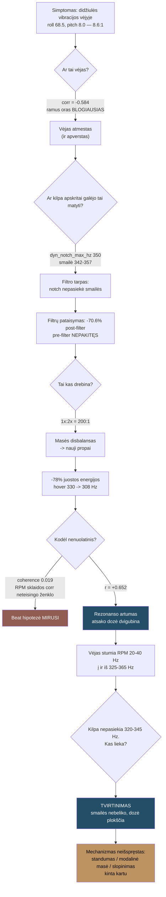
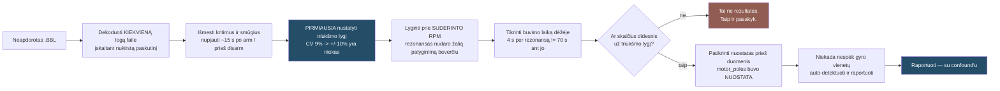

<!--
VERTIMO PASTABA / DRAFT NOTE — pašalinti prieš publikavimą.
Tai vertimo juodraštis. Betaflight parametrų pavadinimai, FPV terminai ir
matavimų žymėjimai palikti angliškai — jie tokie ir naudojami (sąmoningas
sprendimas, ne apsileidimas).

ANDRIUI PERŽIŪRĖTI — penki terminai, kurių negaliu patvirtinti:
  1. "vibracijos gaubtinė"          <- vibration envelope
  2. "struktūrinė moda"             <- structural mode
  3. "atsako dozė"                  <- dose-response
  4. "prisukta masė"                <- sprung mass
  5. "struktūrai fiksuota ypatybė"  <- structure-fixed feature
Jei kuris nors iš jų lietuviškame FPV/virpesių žargone skamba ne taip —
pakeisk, ir aš atnaujinsiu visus pasikartojimus abiejose versijose.

Pilnas atvirų klausimų sąrašas (Hugo unsafe konfigas, pavadinimas, data,
serija) — anglų versijos DRAFT NOTES bloke (index.md).
-->

<script src="https://cdn.jsdelivr.net/npm/chart.js@4"></script>
<script>
window.SNAKE_PALETTE = ['#244d68', '#915d52', '#bd9361', '#95b0c1'];
function snakeChart(id, type, data, yLabel, xLabel) {
  data.datasets.forEach(function (ds, i) {
    var c = window.SNAKE_PALETTE[i % 4];
    ds.borderColor = c;
    ds.backgroundColor = (type === 'line') ? 'transparent' : c;
    ds.borderWidth = (type === 'line') ? 2.5 : 0;
    ds.pointRadius = (type === 'line') ? 3 : 0;
    ds.tension = 0.25;
    ds.spanGaps = true;
  });
  new Chart(document.getElementById(id), {
    type: type,
    data: data,
    options: {
      responsive: true,
      maintainAspectRatio: false,
      interaction: { mode: 'index', intersect: false },
      plugins: {
        legend: { display: data.datasets.length > 1, position: 'bottom' }
      },
      scales: {
        y: {
          title: { display: true, text: yLabel },
          grid: { color: 'rgba(36,77,104,0.15)' }
        },
        x: {
          title: { display: !!xLabel, text: xLabel || '' },
          grid: { display: false }
        }
      }
    }
  });
}
</script>

Craft name **Snake**. Pradžioje tai buvo Meteor75 Pro, dabar — Meteor75 Pro II: rėmas ir
gaubtas iš AliExpress, viskas, kas kainuoja, perkelta be pakeitimų. Tas pats
**Matrix 1S 3-in-1 FC**. Tas pats **narrow-FOV DJI O4** air unit. Naujas kiautas, seni vidūriai,
ir kai baigiau — 169 skrydžiai bei 15 574 sekundės logų, su kuriais teko ginčytis.

Planuota buvo penkiolikos minučių perstatymas. Gavau savaitę rezonanso vaikymosi, tris
atšaukimus, vieną tvarkingą hipotezę, kuri buvo visiškai neteisinga, vieną tuning pakeitimą,
kurį teko atsukti atgal, ir vieną metriką, kuri man kelias iteracijas melavo, kol pastebėjau.

Trumpai — ir tai viso šio įrašo tezė: **gaubtas, kuris išsprendė jello problemą, yra tas pats
gaubtas, su kuriuo dabar kovoja flight controller'is.** Atskirti kamerą nuo rėmo yra gerai.
Atskirti ją *minkštai* — ne veltui.

## Konstrukcija ir neatitikimas, kuris pasirodė svarbus



- **Rėmas + gaubtas:** Meteor75 Pro II, dalys iš AliExpress
- **Vidūriai:** perkelti iš Meteor75 Pro — tas pats Matrix 1S 3-in-1 FC, tas pats narrow-FOV
  DJI O4 air unit
- FC target `BETAFPVG473` (STM32G473), manufacturer id `BEFH`
- Betaflight **4.5.1** (2025 12 11, `77d01ba3b`)
- 1S LiHV — `vbat_max_cell_voltage = 435`, `auto_profile_cell_count = 1`
- DSHOT300, `dshot_bidir = ON`, `motor_poles = 12`
- 3,2 kHz gyro ir PID kilpa — `looptime 312`, `pid_process_denom 1`
- `blackbox_sample_rate = 1/2` → 1582 Hz įrašymas, **791 Hz Nyquist**
- Digital VTX per MSP DisplayPort, serial 3
- `yaw_motors_reversed = ON` (props out)

O štai dalis, kuri pasirodė centrinė ir apie kurią pirkdamas nė nepagalvojau: **Pro II gaubtas
perprojektuotas O4 Wide.** Snake skraido su narrow-FOV O4. Vadinasi, gaubtas neša ne tą masę,
apie kurią buvo nubraižytas, o FC/gaubto sąsaja nėra ta pora, kuriai rėmas buvo suprojektuotas.
Stačiau hibridą ir vadinau tai upgrade'u.

Du dalykai, kuriuos patikrinau, o ne priėmiau kaip duotybę, prieš tikėdamas bet kuo toliau:

**`motor_poles = 12` yra nuostata, o ne matavimas.** Todėl patikrinau pagal duomenis: išmatuota
dominuojanti roll ašies frekvencija, padalinta iš apskaičiuotos 1×, davė **1,008–1,020**. Jei
fizinis polių skaičius būtų 14, santykis būtų apie 1,17. RPM filtras visą laiką nusiteikęs į
teisingą frekvenciją.

**Mano PID slankiukai nieko nedarė.** Profile 0 buvo `simplified_pids_mode = OFF`, taigi
sukonfigūruotos slankiukų vertės (master multiplier 120, d_gain 120, pi_gain 120) buvo
**neaktyvios**. Profile 0 visą laiką skraidė su Betaflight 4.5 standartinėmis vertėmis:
roll 45/80/40, pitch 47/84/46, yaw 45/80/0. Verta žinoti prieš praleidžiant vakarą
teoretizuojant apie savo tune'ą.

## Simptomas

> „Skraidant kieme, esant šiek tiek vėjo, gavau didžiules vibracijas."

Pirmas logas, seni propai. Roll ašies pre-filter HF energija (80–780 Hz) — **68,5 °/s** RMS.
Pitch: **8,0**. Yaw: **11,4**. Tai **8,6 : 1 roll/pitch santykis**, o tai nėra triukšmo
problema — tai vienos ašies mechaninė problema, apsirengusi triukšmo kostiumu.

Po filtrų ta pati ašis rodė **1,38 °/s**. RPM filtras nešė maždaug **34 dB** ir mandagiai
slėpė nuo flight controller'io didelį mechaninį defektą. Dronas skraidė normaliai. Gyro rėkė.

Harmonikų struktūra pasakė, kokio tipo tai defektas: **1× ir 2× santykis buvo apie 200:1**
(53:1 iki 212:1, priklausomai nuo motoro). Tai vadovėlinis masės disbalansas. Sulankstyta
mentė ar tikras aerodinaminis apkrovimas įneštų realios energijos į aukštesnes harmonikas;
čia jos praktiškai nebuvo.

*Išlyga, kurią užsirašiau tada ir kurios dabar tyliai nenumesiu:* apie 341 Hz 3-ioji harmonika
atsiduria 1023 Hz, o tai virš šio logo **791 Hz Nyquist**. Blade-pass turinio įvertinti buvo
neįmanoma. 2× apie 682 Hz buvo diapazone ir švari, ir būtent ji yra diagnostinė, tad išvada
laikosi — bet laikosi ant 2×, o ne ant pilno harmonikų vaizdo.

## Kabliukas: daugiau vėjo — mažiau vibracijų

Visų, įskaitant mano, pirmoji nuojauta buvo, kad tai vėjo problema. Taip ir parašyta
skunde. Todėl lyginau atkarpas prie **suderintos propelerio frekvencijos** (330–350 Hz), kad
rezonansas liktų fiksuotas, o kistų tik oras.

<div style="height:360px"><canvas id="c1"></canvas></div>
<script>
snakeChart('c1', 'bar',
  { labels: ['lauke, gūsingiausia\n(LF>18)', 'lauke, visa', 'lauke, ramiausia', 'vidus, švari atkarpa', 'vidus, ramiausias oras'],
    datasets: [{ label: 'roll HF RMS', data: [54.9, 63.1, 67.7, 78.1, 80.9] }] },
  'roll pre-filter HF RMS (°/s)');
</script>

| atkarpa | roll HF (°/s) | turbulencija | trukmė |
|---|---|---|---|
| lauke, gūsingiausia (LF>18) | **54,9** | 30,7 | 7,3 s |
| lauke, visa | 63,1 | 12,5 | 35,1 s |
| lauke, ramiausia | 67,7 | 5,0 | 18,8 s |
| **viduje, švari atkarpa** | 78,1 | 11,8 | 12,0 s |
| **viduje, ramiausias oras** | **80,9** | 4,2 | 5,9 s |

`corr(turbulencija, vibracija)` prie fiksuoto RPM = **−0,584**.

Daugiau vėjo — *mažiau* vibracijų. Visiškai nejudantis oras patalpoje buvo **blogiausias**
atvejis, kokį pavyko sukurti.

Kurį laiką į tai spoksojau. Tai vienas naudingiausių dalykų visame šiame darbe, nes akivaizdų
paaiškinimą nužudo pirmą dieną, o ne penktą, ir dar todėl, kad priežastis, kodėl taip
nutinka, ir *yra* mechanizmas. Palaikykite tą mintį — jai užsidirbti reikės dar kelių skyrių.

## Du dalykai, kuriuos mano konfigūracija darė neteisingai

Prieš vaikantis fizikos, normaliai perskaičiau savo filtrų nuostatas, ką reikėjo padaryti
pirmiausia:

```
dyn_notch_count   = 1     (default 3)
dyn_notch_q       = 400   (labai siauras)
dyn_notch_min_hz  = 150
dyn_notch_max_hz  = 350   <-- ŽEMIAU išmatuotos 342-357 Hz smailės
gyro_lpf1_static_hz   = 0 (LPF1 visiškai išjungtas)
gyro_lpf1_dyn_min_hz  = 0
```

Vienas notch'as, `q = 400` padarytas plonas kaip adata, su viršutine riba **žemiau tikrosios
smailės**. Vienintelis filtras, nukreiptas į šią problemą, fiziškai negalėjo jos pasiekti.
LPF1 buvo visiškai išjungtas.

Pataisymas:

```
set dyn_notch_count = 3
set dyn_notch_q = 300
set dyn_notch_min_hz = 100
set dyn_notch_max_hz = 600
set gyro_lpf1_dyn_min_hz = 250
```

Išmatuota prie suderinto propelerio RPM:

<div style="height:340px"><canvas id="c4"></canvas></div>
<script>
snakeChart('c4', 'bar',
  { labels: ['post-filter roll HF', 'D-term roll RMS', 'D-term pitch RMS', 'motorų jitter'],
    datasets: [{ label: 'pokytis (%)', data: [-70.6, -51.0, -49.0, -42.0] }] },
  'pokytis (%)');
</script>

| metrika | prieš | po | pokytis |
|---|---|---|---|
| post-filter roll HF RMS | 1,71 | 0,58 | **−70,6%** |
| bendras slopinimas | 32,8 dB | 43,6 dB | +10,8 dB |
| D-term roll RMS | 6,7 | 3,3 | −51% |
| D-term pitch RMS | 4,3 | 2,2 | −49% |
| motorų išvesties jitter | 1,37 | 0,80 | **−42%** |

Pre-filter nepasikeitė, ir tai visiškai teisinga bei verta pasakyti garsiai, nes būtent to
žmonės tikisi iš filtrų, o filtrai to niekada nedaro: **filtrai apsaugo kilpą, jie netaiso
konstrukcijos.** Dronas po to drebėjo lygiai taip pat stipriai. Tiesiog flight controller'is
nustojo į tai reaguoti.

## Matavimo riba — skaičius, kurį reikėjo nustatyti pirmą

Viskas po šio taško priklauso nuo vieno nuobodaus klausimo: kokio dydžio turi būti pokytis,
kad man būtų leista jį pavadinti tikru?

Todėl išmatavau pre-filter roll HF RMS sklaidą *viename skrydyje*, prie **fiksuoto** RPM, ir
laikiau tai savo triukšmo lygiu:

```
CV = 9,0%,  max/min = 1,38   (n = 21 langas po 3 s)
koreliacija su paketo įtampa    = +0,04
koreliacija su laiku/temperatūra = -0,05
```

**Bet kuris pokytis, mažesnis nei maždaug ±10%, yra neatskiriamas nuo triukšmo.** Ne
„tikriausiai triukšmas" — neatskiriamas. Tai nėra dėl paketo įtampos kritimo ir nėra terminis
dreifas; abi koreliacijos plokščios. Tai tiesiog tiek, kiek šis matavimas blaškosi, kai
niekas nesikeičia.

Šis vienas skaičius vėliau tą pačią savaitę nužudė kelias išvadas, kurias norėjau pasilikti.
Jei iš šio įrašo pasiimsite vieną dalyką ir jis nebus apie whoop'us, pasiimkite šį: nustatykite
triukšmo lygį prieš patikėdami bet kokiu rezultatu — ypač tuo, kuris jums patinka.

## Propai: pirma tikra mechaninė pergalė

Nauji propai iš karto pakeitė tris dalykus, o tai bloga eksperimentinė higiena, bet labai geras
vakaras:

- RPM-per-output sklaida tarp keturių motorų sumažėjo iš **9,2 iki 4,4 procentinio punkto**
- 1× amplitudės susilygino — m1 108,7 → 56,7 °/s, m4 107,1 → 56,8
- hover propelerio frekvencija nukrito **330 → 308 Hz**

Lauke, pilnas RPM sweep'as, tas pats aparatas, taigi čia kinta *sužadinimas*:

<div style="height:360px"><canvas id="c2"></canvas></div>
<script>
snakeChart('c2', 'line',
  { labels: [275, 300, 325, 350, 375, 400, 425],
    datasets: [
      { label: 'seni propai', data: [42, 55, 62, 55, 43, 32, 25] },
      { label: 'nauji propai', data: [42, 43, 34, 24, 25, 22, 15] }
    ] },
  'roll pre-filter HF RMS (°/s)', 'propelerio 1x frekvencija (Hz)');
</script>

| prop Hz | 275 | 300 | 325 | 350 | 375 | 400 | 425 |
|---|---|---|---|---|---|---|---|
| seni propai | 42 | 55 | **62** | 55 | 43 | 32 | 25 |
| nauji propai | 42 | 43 | **34** | 24 | 25 | 22 | 15 |

*Sweep'as sąmoningai nukirstas prie 425 Hz. 450 ir 475 Hz krepšeliai duomenyse yra, bet juose
tik 1,1–3,0 s dwell'o prieš 32–53 s tuose krepšeliuose, kurie svarbūs, o 4 s prašvilpimas per
rezonansą negali sukelti tokios pačios amplitudės kaip 50 s stovėjimas ant jo. Nubrėžus tuos
krepšelius vienodu svoriu, uodega atrodytų kaip rezultatas. Visi parodyti krepšeliai abiejuose
skrydžiuose viršija 4 s.*

−45% smailėje, −56% prie 350–375 Hz. Fiksuotos juostos 325–365 Hz energija:
**1185 → 263 — 78% mažiau.**

Atkreipkite dėmesį, kur abi kreivės pradeda: prie 275 Hz jos **identiškos — 42 °/s**. Žemiau
rezonanso propai nesukuria jokio išmatuojamo skirtumo. Viską, ką nauji propai davė, jie davė
juostos viduje — ir tai pirma užuomina, kad tai iš tikrųjų niekada nebuvo propelerių
balansavimo istorija.

Tuo metu maniau, kad išsprendžiau viską propų rinkiniu ir notch konfigūracija. Neišsprendžiau.
Net teisingai neaprašiau, *kokia* buvo problema.

## Mechanizmas — ir tvarkinga hipotezė, kuri buvo neteisinga

Piloto pastebėjimas, kuris viską atvėrė, buvo tas, kurį beveik ignoravau: *„drebėjimas ne
visada yra, tik kai kuriose orientacijose vėjo atžvilgiu."*

Nenuolatinis. Priklausantis nuo orientacijos. Taigi pirma mano idėja buvo **beat frekvencijos**.
Keturi motorai, besisukantys 343 / 313 / 337 / 332 Hz, prognozuoja beat'us prie 5,2, 6,1, 11,3,
19,7, 24,9 ir 31,0 Hz — būtent toje juostoje, kur mačiau judantį aparatą. Tvarkinga teorija.
Patikrinama. Maloni.

Neteisinga:

```
coherence(beat gaubtinė, matomas 8-45 Hz judesys) = 0,019 vidurkis, 0,063 maks.
corr(RPM sklaida, gaubtinė)                        = -0,287    (neteisinga kryptis)
išmatuota moduliacija 1,9 Hz vs artimiausia prognozuota pora 5,2 Hz
```

0,019 coherence nėra silpnas signalas, tai *nėra* signalas. Ir RPM sklaidos koreliacija išėjo
**negatyvi** — priešinga tam, ko reikalauja beat modelis. Numirė per vieną popietę.

Tai, kas realiai prognozavo drebėjimą, buvo daug nuobodesnė idėja:

| modelis | koreliacija su vibracijos gaubtine |
|---|---|
| **rezonanso artumas (Lorentzian @ 343 Hz)** | **+0,652** |
| motorų skaičius 325–365 Hz juostoje | +0,583 |
| vidutinė propelerio frekvencija | +0,308 |
| motorų RPM sklaida | −0,287 |
| throttle | +0,182 |

Ir tada atsako dozė, kuri yra maždaug tokia vadovėlinė, kokia lauko duomenys tik gali būti:

<div style="height:360px"><canvas id="c3"></canvas></div>
<script>
snakeChart('c3', 'bar',
  { labels: ['0', '1', '2', '3', '4'],
    datasets: [{ label: 'vibracijos gaubtinė', data: [55.46, 78.38, 95.41, 108.71, 111.64] }] },
  'vibracijos gaubtinė (°/s)', 'motorų 325-365 Hz juostoje');
</script>

| motorų 325–365 Hz juostoje | gaubtinė | % skrydžio |
|---|---|---|
| 0 | **55 °/s** | 21% |
| 1 | 78 | 13% |
| 2 | 95 | 17% |
| 3 | 109 | 38% |
| 4 | **112 °/s** | 11% |

**Ji padvigubėja.** Suskaičiuok, kiek propų sėdi rezonanso lange, ir gali prognozuoti drebėjimą.

Tai paaiškina ir nenuolatinumą, ir priklausomybę nuo orientacijos, *ir* atbulą vėjo
koreliaciją. Vėjo apkrova perskirsto trauką tarp kampų, o tai pastumia atskirų motorų RPM
20–40 Hz, įslysdama ir išslysdama iš lango. Gūsiai **išsklaido** propus nuo rezonanso.
Patalpoje dronas kybo kaip prilipęs ir pastato visus keturis tiksliai ant jo — nenutrūkstamai,
tiek, kiek leisi. Nejudantis oras yra blogiausias atvejis, nes nejudantis oras yra
*tiksliausias*.

### Kodėl propai padėjo — normaliai suformuluota

| | hover | atsarga iki 325 Hz | ≥1 motoras juostoje | ≥3 juostoje | gaubtinė |
|---|---|---|---|---|---|
| seni propai, viduje | 328 Hz | **−3** | 79% | 49% | 91,7 |
| nauji propai, viduje | 307 Hz | **+18** | 25% | 4% | 68,8 |
| nauji propai, lauke | 363 Hz | −38 (virš) | 63% | 6% | 35,4 |

Seni propai kybo **tiesiai rezonanso juostoje** — trys hercai atsargos. Mažesnis disbalansas
buvo mažesnė pergalės dalis. Darbo taško patraukimas nuo rezonanso — didesnė. Atsitiktinai
padariau teisingą dalyką dėl priežasties, kurios nesupratau.

<div class="mermaid-wrap">



</div>



## Dvi atskiros problemos, ne viena — ir kodėl tai yra Gyroflow argumentas

Šį atskyrimą prikalti užėmė didžiąją savaitės dalį, ir tai yra techninis viso, kas man čia
svarbu, stuburas — nes jis nusprendžia, nuo ko programinė įranga gali ir negali išgelbėti.

**(a) ~320–345 Hz struktūrinė moda.** Roll dominuoja, 8:1. Tai jello šaltinis. Ji sėdi
**eile aukščiau už valdymo kilpos naudingą pralaidumą 20–40 Hz.** Jokia PID korekcija, jokia
TPA nuostata, jokia filtro pakaita jos nepasiekia. Filtrai neleidžia jai pasiekti kilpos; jie
neuždraudžia aparatui drebėti. Ir **nei Gyroflow, nei RockSteady negali pašalinti jello** —
tai iškraipymas kadro *vidyje*, pažeidimas įvyksta rolling shutter'io ribose dar prieš tai,
kai stabilizatorius apskritai pamato vaizdą.

**(b) Plačiajuostis 10–25 Hz turbulencijos sekimas.** Išmatuotas **Q ≈ 1,9–2,2**. Smailė
15,8–17,8 Hz roll ašyje, 10,6–12,9 Hz pitch, amplitudė 4,4–5,3 °/s. Valdymo kilpos ribinis
ciklas rodytų Q = 10–100; Q ≈ 2 yra silpnai slopinamas aparatas, kurį tikrai stumdo
turbulentiškas oras. **Būtent šią juostą Gyroflow taiso gerai.**

<div style="height:340px"><canvas id="c11"></canvas></div>
<script>
snakeChart('c11', 'bar',
  { labels: ['vėjo drebėjimas, roll', 'vėjo drebėjimas, pitch', '48,5 Hz moda'],
    datasets: [{ label: 'Q faktorius', data: [2.2, 2.2, 83.7] }] },
  'Q faktorius');
</script>

Dėl pilnumo: ten *yra* tikrai aštri moda, prie 48,5 Hz su **Q = 83,7**. Jos amplitudė —
**0,24 °/s**, t. y. visiškai nereikšminga. Aukštas Q nėra tas pats kaip svarbus, ir tai bus
pavyzdys, į kurį parodysiu kitą kartą, kai mane sugundys aukšta plona smailė.

Tai kur gyvena tas judesys, kurį realiai *matai*?

<div style="height:380px"><canvas id="c10"></canvas></div>
<script>
snakeChart('c10', 'bar',
  { labels: ['1-5 Hz', '5-10 Hz', '10-20 Hz', '200-790 Hz'],
    datasets: [
      { label: 'seni propai, seni filtrai', data: [3.84, 2.66, 1.45, 1.68] },
      { label: 'seni propai, nauji filtrai', data: [1.92, 1.58, 1.05, 0.38] },
      { label: 'nauji propai, nauji filtrai', data: [1.29, 0.93, 0.91, 0.26] }
    ] },
  'roll gyro RMS, post-filter (°/s)', 'juosta');
</script>

| | 1–5 Hz | 5–10 Hz | 10–20 Hz | 200–790 Hz |
|---|---|---|---|---|
| seni propai, seni filtrai | 3,84 | 2,66 | 1,45 | 1,68 |
| seni propai, nauji filtrai | 1,92 | 1,58 | 1,05 | 0,38 |
| nauji propai, nauji filtrai | **1,29** | **0,93** | **0,91** | **0,26** |

Vien filtrai nutraukė aukštą juostą 1,68 → 0,38, propai patraukė dar toliau. Iš viso −66% prie
1–5 Hz, −85% aukštai. Ir įsidėmėkite santykį: maždaug **penkis kartus daugiau energijos yra
Gyroflow taisomoje juostoje nei jello juostoje.** Būtent todėl vaizdas atrodė priimtinai, kol
gyro rėkė — matomas judesys daugiausia buvo tos rūšies, kurią programinė įranga gali atsukti.

Šis asimetriškumas ir yra visa priežastis, kodėl atskyrimo kompromisas svarbus. Žemos
frekvencijos drebėjimą galima atkurti post-produkcijoje. Jello negalima atkurti niekuo. Taigi
pakeitimas, kuris iškeičia *mažiau jello* į *daugiau žemos frekvencijos drebėjimo*, yra geras
pakeitimas — net kai gyro logai atrodo blogiau.

## Tuning eksperimentas, kuris nepavyko ir buvo atsuktas

Buvau išmatavęs, kad D-term'as vėluoja po klaidos **16,4 ms** 8–45 Hz juostoje — beveik pusė
ciklo prie 17 Hz — todėl `dterm_lpf1_static_hz` pakėlimas iš 75 į 90 atrodė kaip nemokami
pinigai.

Suderintas hover patalpoje, tie patys propai, 307 vs 309 Hz:

<div style="height:340px"><canvas id="c5"></canvas></div>
<script>
snakeChart('c5', 'bar',
  { labels: ['post-filter triukšmas', 'D-term RMS', 'D-term HF triukšmas', 'motorų jitter', '14 Hz virpesys'],
    datasets: [{ label: 'pokytis (%)', data: [171, 242, 283, 370, 168] }] },
  'pokytis (%)');
</script>

| | lpf1 = 75 | lpf1 = 90 | pokytis |
|---|---|---|---|
| post-filter roll triukšmas | 0,34 | 0,92 | **+171%** |
| D-term RMS | 2,06 | 7,04 | **+242%** |
| D-term HF triukšmas | 1,06 | 4,06 | **+283%** |
| **motorų jitter** | 0,555 | 2,606 | **+370%** |
| 14 Hz roll virpesys | 1,01 | 2,71 | **+168%** |

Tai nupirko **1,9 ms** vėlinimo. Už 370% didesnį motorų jitter'į. Spektras buvo blogesnis
*kiekvienoje* frekvencijoje nuo 2 iki 400 Hz. Atsukta, ir atgal negrįžtu.

Airmode buvo įjungtas tą pačią sesiją (logas patvirtina: feature mask delta lygiai 4194304) ir
liko — 3,3 s žemiau 1250 throttle su minimalia motorų išvestimi 201, jokio valdymo praradimo.

**Confound'as, užrašytas sąžiningai:** pasikeitė du kintamieji vienu metu, todėl 14 Hz
augimo negalima aiškiai priskirti nei filtrui, nei airmode. Kitos keturios eilutės pakankamai
didelės, kad tai išgyventų, bet 14 Hz skaičius nėra švarus, ir apsimetinėti nesiruošiu.

## Kodėl didžiąją savaitės dalį negalėjau išmatuoti savo step response

Kartotinai bandžiau iš šių logų išpešti tikrą step response. Kartotinai užblokuotas įvesties:

```
setpoint energija: roll 95% žemiau 1,7 Hz | pitch 1,4 Hz | yaw 1,5 Hz
staigių stick reversal: 0
slew įvykių >4000 deg/s^2: 3
```

Drono kilpa gyvena 20–40 Hz. Sklandūs, tolydūs roll'ai neturi aukštos frekvencijos turinio,
taigi step response yra **apribotas įvesties pralaidumo, o ne drono**. „173 ms rise time",
kurį apskaičiavau pradžioje, buvo tikslus matavimas — mano stick'ų.

Vienas skrydis su 39 staigiais reversal'ais ir 26 aštriais slew'ais galiausiai davė tikrą
skaičių: **roll overshoot +10,4% prie 133 ms, rise(90%) 77,7 ms, 50% delay 32,9 ms.** Su
n = 6 žingsniais, nes logas baigėsi 9,6 G kritimu. Orientacinis. Neužbaigtas.

### Ir bug'as mano paties analizatoriuje

Pirmasis mano raportas išdidžiai paskelbė „overshoot 0,0%" visose trijose ašyse. Visose
trijose. Lygiai nulis.

Step response funkcija normalizavo kiekvieną atsaką pagal jo **smailę**, o tai pačia
konstrukcija prikala overshoot prie tiksliai nulio kiekvieną kartą. Pataisyta normalizuoti
pagal nusistovėjusią vertę. Jei metrika išeina įtartinai švari visose ašyse vienu metu,
metrika sugedusi — tai ne cinizmas, tiesiog taip bug'as atrodo iš išorės.

## Blogas motoras, kuris pasirodė esąs oras

Didžiąją savaitės dalį vienas motoras nuosekliai atrodė kaltas:

```
m2 RPM-per-output:  -4,2% iki -6,1%    (blogiausias KIEKVIENAME loge)
m1 hover output:    +6,7% iki +11,1%   (dirba sunkiausiai, ir VIENINTELIS clipping'antis)
```

m1 clipping'o 0,789% kadrų, kai m2 ir m3 sėdėjo lygiai prie 0,000%, o drebėjimas buvo
**1,59× blogesnis**, kai motorai buvo prie viršutinės ribos. Turėjau užsikirtusį guolį m2 ir
pervargusį m1. Dvi aparatinės diagnozės, abi užtikrintos.

Tada pasukau gaubtą 180° ir eiliškumas **apsivertė**:

<div style="height:340px"><canvas id="c12"></canvas></div>
<script>
snakeChart('c12', 'bar',
  { labels: ['m1', 'm2', 'm3', 'm4'],
    datasets: [
      { label: 'prieš gaubto pasukimą', data: [-0.1, -5.3, 5.0, 0.4] },
      { label: 'po gaubto pasukimo', data: [3.1, 5.0, -3.4, -4.7] }
    ] },
  'RPM vienam išvesties vienetui, nuokrypis nuo vidurkio (%)', 'motoras');
</script>

```
prieš pasukimą:  m2 = -4,2% iki -6,1%   (blogiausias)
po pasukimo:     m2 = +4,3% iki +8,0%   (laisviausias)
```

Motoro defektas negali apsiversti ženklu, kai pasuki gaubtą. **Šablonas yra aerodinaminis —
gaubtas šešiuoja tuos propus, kurie atsiduria po juo.** Abi diagnozės atšauktos. Tai buvo
sumontavimas, ne aparatūra, ir vienintelė priežastis, kodėl tai išsiaiškinau, yra ta, kad
pakeičiau kažką nesusijusio ir vis tiek toliau mačiau.

Pasukimas realiai padarė darbą su CoG:

<div style="height:340px"><canvas id="c13"></canvas></div>
<script>
snakeChart('c13', 'bar',
  { labels: ['m1', 'm2', 'm3', 'm4'],
    datasets: [
      { label: 'prieš pasukimą (15:53, lauke)', data: [12.5, -5.8, -3.2, -3.4] },
      { label: 'po pasukimo (20:40)', data: [-3.3, -13.8, 11.8, 5.3] }
    ] },
  'hover išvestis, nuokrypis nuo vidurkio (%)', 'motoras');
</script>

Sunkiausiai dirbantis motoras persikėlė iš m1 į m3/m4, o m1 clipping'as nukrito
**0,812% → 0,000%**. **Vien pasukimas sumažino priekio/užpakalio poros skirtumą nuo +9,5% iki
+3,6%.**

Dvi pastabos apie apimtį, nes šiuos skaičius lengva neteisingai sudėti:

**+12,5% ant m1 diagramoje yra konkrečiai 15:53 lauko skrydis.** Aukščiau cituotas
`+6,7% iki +11,1%` intervalas apima 14:26, 15:20 ir 16:28 logus. Abu yra teisingi savo
apimtyje — vienas yra vienas skrydis, kitas — intervalas per tris. Nė vienas nepakeičia kito.

**Pasukimas ir putplastis yra atskiros intervencijos, ir jų CoG rezultatai nesigrandina.**
Pasukimas perkėlė poros skirtumą +9,5% → +3,6%. Putplastis, vėliau ir nepriklausomai, perkėlė
jį +3,4% → +2,0% (ta eilutė yra tvirtinimo lentelėje žemiau). Skaityti tai kaip vieną tęstinį
pagerėjimą nuo +9,5% iki +2,0% būtų klaida — skirtingos sesijos, skirtingi pakeitimai, o +3,6%
ir +3,4% pradiniai taškai nėra tas pats matavimas.

### Baterija, pasverta iš logo failo

Mažas šalutinis nuotykis, įtrauktas, nes man patiko. Du paketai, skraidyti vienas po kito.
Hover RPM yra tinkamas masės pakaitinis rodiklis prie fiksuoto propo ir konfigūracijos:

```
log1: ore 70 s, hover 330 Hz, 966 rodomo krūvio
log2: ore 95 s, hover 340 Hz, 1585 rodomo krūvio
hover RPM santykis 1,0612 -> masės santykis 1,126 -> log2 yra 12,6% sunkesnis
```

Identifikuota vien iš logo, be jokios mano įvesties apie tai, kuris paketas buvo kuris.


Yra ir praktine priezastis, kodel gaubtas apsiverte, ir tai - baterijos. Pasukus ji, mases
paskirstymas su **LAVA 2 680 mAh** baterijomis, kuriomis realiai skraidau, tampa geresnis - todel
priekio/uzpakalio skirtumo perpus sumazejimas buvo tikslas, o ne laiminga atsitiktinybe. Ka tos
baterijos duoda ore: **apie 3 minutes, kai spaudziu, ir 5-6 minutes kreiseriniu tempu.** Verta
laikyti kartu su sunkesnes/lengvesnes baterijos siula auksciau - sunkesne davė 36% ilgesni skraidymo
laika ir 4x daugiau variklio isisotinimo, ir nei vienas is tu dalyku nera nemokamas.

## Tvirtinimas: didžiausia atskira pergalė

Kilpa nepasiekia 320–345 Hz. Propai jau geri. Lieka konstrukcija.

Taigi: standus putplastis įterptas tarp FC ir VTX, ištempiant gummy ball tvirtinimus ir
sustandinant gaubto fiksaciją. Tas pats paketas (hover 345 vs 347 Hz), **nulis konfigūracijos
pakeitimų.** Švarus mechaninis A/B, kas šiame hobyje pasitaiko rečiau, nei turėtų.

Atsako dozė, kuri apibrėžė visą problemą, **sugriuvo**:

<div style="height:360px"><canvas id="c6"></canvas></div>
<script>
snakeChart('c6', 'bar',
  { labels: ['0', '2', '4'],
    datasets: [
      { label: 'prieš putplastį', data: [35, 52, 57] },
      { label: 'po putplasčio', data: [29, 33, 33] }
    ] },
  'vibracijos gaubtinė (°/s)', 'motorų 325-365 Hz juostoje');
</script>

| | 0 motorų juostoje | 2 juostoje | 4 juostoje |
|---|---|---|---|
| prieš | 35 | 52 | **57** |
| **po** | **29** | **33** | **33** |

Vibracija anksčiau kildavo 45–63%, kai motorai įeidavo į juostą. Dabar ji plokščia. Motorai,
sėdintys rezonanso juostoje, **nustojo turėti reikšmės**, o tai daug geresnis rezultatas nei
juos sumažinti.

Rezonanso kreivė sako tą patį:

<div style="height:380px"><canvas id="c8"></canvas></div>
<script>
snakeChart('c8', 'line',
  { labels: [250, 275, 300, 325, 350, 375, 400, 425, 450, 475, 500],
    datasets: [
      { label: 'prieš putplastį (sunkus paketas)', data: [35, 43, 49, 39, 32, 26, 17, 15, 15, 9, 5] },
      { label: 'po putplasčio (sunkus paketas)', data: [30, 27, 26, 28, 25, 25, 27, 27, 22, 15, 12] }
    ] },
  'roll pre-filter HF RMS (°/s)', 'vidutinė propelerio 1x frekvencija (Hz)');
</script>

| metrika | prieš | po | pokytis |
|---|---|---|---|
| rezonanso kreivės forma | **ryški smailė prie 48,8 °/s** | **iš esmės plokščia, 25–30 °/s** | smailės nebeliko |
| pre-filter roll RMS | 37,0 | 25,9 | **−30%** |
| post-filter roll | 0,65 | 0,50 | −23% |
| vibracijos gaubtinė | 40,6 | 30,8 | −24% |
| motorų clipping | m4 1,94%, m3 0,33% | **visi 0,00%** | — |
| priekio/užpakalio poros skirtumas (tik putplastis) | +3,4% | **+2,0%** | geriausias užfiksuotas |

Rezultatas čia yra **smailės išnykimas, o ne jos aukščio sumažėjimas** — ir šis skirtumas yra
sąmoningas. Prieš putplastį yra neabejotina stiprinimo smailė prie 48,8 °/s. Po putplasčio
smailės nėra visai: kreivė laikosi tarp 25 ir 30 °/s per visą 250–425 Hz sweep'ą, o
„maksimumas" yra tiesiog ten, kur tą kartą atsitiktinai nusėdo triukšmas. Cituojant vieną
skaičių „po", gaunamas procentas, kuris iš tikrųjų yra rezonanso ir tiesios linijos
palyginimas, todėl jo necituosiu. Kreivė nustojo turėti formą. Tai ir yra rezultatas.

Poros skirtumo eilutė yra **putplasčio** rezultatas ir yra nepriklausoma nuo gaubto pasukimo
rezultato ankstesnėje posto dalyje — ta pati metrika, kita intervencija, kita sesija.

Ir energija neišnyko, ji persikėlė:

<div style="height:360px"><canvas id="c7"></canvas></div>
<script>
snakeChart('c7', 'bar',
  { labels: ['280-325', '325-365', '365-420', '420-500'],
    datasets: [
      { label: 'prieš putplastį', data: [714, 313, 20, 16] },
      { label: 'po putplasčio', data: [181, 135, 104, 77] }
    ] },
  'pre-filter roll energija', 'frekvencijų juosta (Hz)');
</script>

| juosta | prieš | po |
|---|---|---|
| 280–325 Hz | 714 | **181** (−75%) |
| 325–365 Hz | 313 | **135** (−57%) |
| 365–420 Hz | 20 | 104 |
| 420–500 Hz | 16 | 77 |

**Išlyga:** throttle p99 buvo 1751 prieš 1968, taigi dalis to nulinio clipping'o rezultato yra
mano mažiau agresyvus skraidymas, o ne vien pataisymas. Clipping'o eilutė yra silpniausia toje
lentelėje ir taip ją reikia skaityti.

## Trys atšaukimai dėl mechanizmo

Pirmiausia tai aprašiau kaip „standumas, ne masė", pagrįsdamas hover-RPM masės patikra
(−0,8%), modos poslinkiu iš ~325 Hz į ~395 Hz ir užtikrintu „≈48% standesnis".

Visi trys buvo neteisingi arba nepagrįsti. Man tai buvo užginčyta, ir užginčijimas buvo
teisingas.

**1. „Standumas, ne masė" yra klaidinga dichotomija.** Anksčiau nepriklausomų kūnų sujungimas
kartu pakeičia efektyvų standumą, modalinę masę *ir* slopinimą. Iš šių duomenų jų atskirti
neįmanoma. Suformulavau klausimą, į kurį eksperimentas negalėjo atsakyti, ir vis tiek į jį
atsakiau.

**2. Hover-RPM masės testas atsakė į neteisingą klausimą.** Hover RPM matuoja **bendrą AUW**.
Gaubto sujungimas nekeičia bendro AUW — jis keičia **modalinę masę**, tą masės dalį, kuri
dalyvauja būtent toje modoje. Vieno naudojimas kito atmetimui yra kategorijos klaida, ir tai
klaida, dėl kurios mažiausiai patenkintas, nes tai tokio tipo klaida, kuri ją darant atrodo
kaip griežtumas. Tikras matavimas, teisingai atliktas, nukreiptas į neteisingą dydį.

**3. Modos frekvencijos skaičiai nebuvo patikimi.** Dvi to paties „struktūrai fiksuotos
frekvencijos" detektoriaus realizacijos stipriai nesutarė su identiškais duomenimis: viena
sakė 322–329 Hz prie 120× dominavimo, kita — 255 Hz prie 6×. Priežastis matoma, kai
pažiūri — kai keturi motorai išsibarstę ~30 Hz, į 40 Hz RPM griežinėlį įsimeta lėčiausias
motoras, tad „vidutinis RPM" yra prastas pavadinimas tam, kas patenka į tą dėžę. 325 → 395 Hz
poslinkis ir 48% skaičius abu atšaukti.

Ką *galiu* parodyti, tai tinkamai kontroliuotą palyginimą: lengvas paketas prieš sunkų,
putplasčio nėra nei viename, pakeistas tik paketas.

<div style="height:340px"><canvas id="c14"></canvas></div>
<script>
snakeChart('c14', 'bar',
  { labels: ['lengvas paketas', 'sunkus paketas'],
    datasets: [
      { label: 'hover RPM (sužadinimas)', data: [327, 347] },
      { label: 'struktūrai fiksuota ypatybė', data: [302, 255] }
    ] },
  'Hz');
</script>

| | hover (sužadinimas) | struktūrai fiksuota ypatybė |
|---|---|---|
| lengvas paketas | 327 Hz | **302 Hz** |
| sunkus paketas | 347 Hz | **255 Hz** |
| pokytis | **+6,1%** | **−15,6%** |

Pridėta prisukta masė nuleido struktūrinę ypatybę **žemiau**, kai sužadinimas pakilo
**aukščiau**. Tai √(k/m) elgiasi kaip pridera.

**Kas išgyvena nepriklausomai nuo metodo:** amplitudžių rezultatai. Jie visai nepriklauso nuo
modos lokalizavimo. Putplastis davė didelį, tikrą sumažėjimą — tai neginčijama.

**Mechanizmas neišspręstas, ir tokį jį ir palieku.** Sujungimo (coupling) modelis — kad gaubto
pririšimas prie rėmo pašalina reliatyvų laisvės laipsnį, o ne vien pastumia spyruoklės
konstantą — yra bent jau taip pat gerai pagrįstas kaip standumo aiškinimas, o masės pusėje —
geriau pagrįstas. Eksperimento, kuris juos atskirtų, dar neturiu.

**Praktinė išvada pataisymui:** gummy ball'ai sujungia *FC su rėmu*. Putplastis sujungė
*gaubtą su FC ir rėmu*. Vien standesni ball'ai to mechanizmo neatkurtų. Būtent todėl sekantis
eksperimentas standina gummy'us iš vidaus, o ne tiesiog keičia durometrą.

## Metrika, kuri man kelias iteracijas melavo

Kelias iteracijas vėjo drebėjimo verdiktą vertinau vienu globaliu santykiu `drebėjimas / vėjas`
ir gavau 0,777 → 0,798 → 0,791 → 0,754. Perskaityta kaip: **„−4,4%, triukšmo ribose, tikro
pagerėjimo nėra."** Vos nenurašiau putplasčio tuo pagrindu.

Tai buvo artefaktas. **Drebėjimas prieš vėją nėra proporcingas**, todėl globalus santykis
visiškai priklauso nuo to, kurioje vėjo diapazono vietoje pasitaikė paimti duomenis. Suskirsk
į dėžes pagal momentinį vėjo lygį ir lygink tik tas dėžes, kurias abu skrydžiai tikrai
apėmė:

<div style="height:380px"><canvas id="c9"></canvas></div>
<script>
snakeChart('c9', 'line',
  { labels: [3, 5, 7.5, 11, 16.5],
    datasets: [
      { label: 'originalus', data: [2.29, 4.47, 6.26, 8.74, 11.48] },
      { label: 'sunkus paketas, be putplasčio', data: [2.27, 3.89, 5.71, 8.18, 10.99] },
      { label: 'sunkus paketas, + putplastis', data: [2.56, 3.66, 4.98, 6.72, 8.52] }
    ] },
  'drebėjimo gaubtinė, 8-45 Hz (°/s)', 'vėjo / trikdžio lygis, 0,5-15 Hz gaubtinė (°/s)');
</script>

| | w 2–4 | w 4–6 | w 6–9 | w 9–13 | w 13–20 |
|---|---|---|---|---|---|
| originalus | 2,29 | 4,47 | 6,26 | 8,74 | 11,48 |
| sunkus paketas, be putplasčio | 2,27 | 3,89 | 5,71 | 8,18 | 10,99 |
| **sunkus paketas, + putplastis** | 2,56 | **3,66** | **4,98** | **6,72** | **8,52** |

```
sunkus be putplasčio -> +putplastis : 6,21 -> 5,29  = -14,8%   (5 bendros dėžės)
originalus           -> +putplastis : 6,65 -> 5,29  = -20,4%   (5 bendros dėžės)
```

**Apie 15% mažiau vėjo drebėjimo prie suderinto vėjo, ne 4%.** Ir pažiūrėkite į formą: visi
keturi skrydžiai sutampa žemiausioje vėjo dėžėje (2,27–2,56) ir išsiskiria tik vėjui augant.
Tas sutapimas apačioje yra kalibruoto matavimo požymis — skrydžiai nėra vienas nuo kito
paslinkti, jie turi tikrai skirtingus nuolydžius.

Taip pat auditavau, ir tai daug ką paaiškina apie ankstesnį blaškymąsi: kiekvienas skrydis iki
šiol pasiekė ≥4 s buvimo laiką tik **5 iš 12 arba 7 iš 12** RPM dėžių. Būtent todėl rezonanso
kreivė vis išeidavo nepatikima.

## Kur dabar viskas stovi — kokį kompromisą realiai padariau

Taigi štai tezė, dabar kai visi matavimai ant stalo.

**Rėmo ir gaubto atskyrimas yra geras ir blogas tuo pačiu metu.**

- **Senas** gaubtas per stipriai perdavė vibracijas į kamerą ir į savo gyro. Jello. Ir nei
  Gyroflow, nei RockSteady negali pašalinti jello — būtent tas asimetriškumas visą šį
  kompromisą padaro svarbų.
- **Naujas** gaubtas izoliuotas gerokai geriau. Kamera mato daug mažiau aukštos frekvencijos
  turinio. Kas lieka matoma, yra žema frekvencija, o **su ja Gyroflow susitvarko gerai.**
- Bet tas pats atskyrimas sukūrė minkštą, silpnai slopinamą kelią tarp FC/gaubto mazgo ir rėmo.
  FC dabar **kovoja su gaubtu** — ir stipresniame vėjyje pralošia. Nes vėjas pastumia motorų
  RPM į rezonanso langą, ir moda būna sužadinama.

Būtent todėl **tvirtinimas**, o ne tune'as, pasirodė esąs svertas. Pirmą savaitės pusę
praleidau reguliuodamas valdymo kilpą, veikiančią 20–40 Hz, tikėdamasis paveikti struktūrinę
modą prie 320–345 Hz. Tai niekada nebūtų suveikę, ir mane įtikinti prireikė atsako dozės
kreivės.

## Tvirtinimo standinimas kaip reikia — pirmi duomenys patalpoje

Putplastis buvo greitas testas, ne sprendimas. Jis veikė, bet tai antklodė ant karščiausios
plokštės vietos, todėl išėmiau. Jį pakeitė **du** pakeitimai, ir turiu iš karto pasakyti, kad
padariau juos toje pačioje sesijoje:

1. **VTX dabar tvirtinamas tiesiai prie gaubto, silikoninius įvorius išėmiau.** Jie buvo
   nereikalingi, o jų išėmimas pašalina lankstų elementą kelyje tarp oro modulio masės ir
   gaubto — gaubtas ir VTX dabar faktiškai vienas kūnas.
2. **TPU siūlas įdėtas į gummy ball'us**, gerokai padidinant jų standumą ir sustandinant
   kelią nuo skraidymo valdiklio iki rėmo.

Abu yra standumo padidinimai, dviejuose skirtinguose apkrovos keliuose, tuo pačiu metu. Todėl
kad ir ką rodytų skaičiai žemiau, **negaliu paskirstyti nuopelnų tarp jų.** Tai pačiam sau
sukurta atribucijos problema, ir sąžininga ją pažymėti, o ne pasirinkti laimėtoją.


Planas: TPU filamentas įterptas gummy ball tvirtinimų vidun, kad gerokai pakeltų jų standumą,
pakeičiant putplastį — kad FC ESC pusė vėl gautų oro pratekėjimą. Putplastis veikia, bet jis
kartu yra ir antklodė ant karštos dalies.



Jis atlieka du darbus, ir tik vienas is ju nepatikrintas. **Standumo** efekto grafikas dar
laukia duomenu. Bet antrasis darbas veikia is karto ir jam nereikia jokiu matavimu: su siulu
viduje guminiai ivoriai kur kas maziau linke **atsiskirti** - o whoop'ui, kuris gyvena
atsimusdamas i durų staktas, vien to jau verta.

Si modifikacija ne mano. Gaubto pasukima 180 laipsniu pasiule Oscar Liang savo Pro II apzvalgos
[Improvements You Can Make](https://oscarliang.com/betafpv-meteor75-pro-dji-o4-wide/#Improvements-You-Can-Make)
dalyje. Mano vienintelis pakeitimas - medziaga: **jis naudoja klijus, kad ivoriai neatsiskirtu,
o as panaudojau TPU siula.** Klijai yra vienpusiai durys. Siula galima istraukti, tad tvirtinimas
lieka aptarnaujamas ir galiu toliau bandyti skirtinga kietuma nedarydamas detaliu nenaudojamomis -
o tai labai svarbu, kai visa esme yra A/B testuoti pati tvirtinima.
Vertinimo planas buvo užrašytas **prieš** skrydį, nes visa ankstesnio skyriaus esmė ta, kad
nebepatikiu palyginimu, sugalvotu jau pamačius duomenis. Pagrindinis kriterijus — kad
**variklių-juostoje atsako kreivė** liktų plokščia. Būtent ji parodo, ar rezonansas dar
stiprinamas.

Ji liko plokščia. 84 s tvarkingo skrydžio patalpoje, antras armas, jokių smūgių, **`0`
konfigūracijos pakeitimų** — taigi tai grynai mechaniška, tik ne vieno kintamojo:

Štai kur tai atsiduria rezonanso kreivėje. Tik viena juosta yra patikima — 79,6 s prie
300–325 Hz, prieš 0,5–1,8 s visur kitur — todėl brėžiu **tik tą tašką**, o ne liniją per triukšmą:

<div style="height:400px"><canvas id="c18"></canvas></div>
<script>
snakeChart('c18', 'line',
  { labels: [250, 275, 300, 325, 350, 375, 400, 425, 450, 475, 500],
    datasets: [
      { label: 'be putplasčio (lauke)', data: [35, 43, 49, 39, 32, 26, 17, 15, 15, 9, 5] },
      { label: '+ putplastis (lauke)', data: [30, 27, 26, 28, 25, 25, 27, 27, 22, 15, 12] },
      { label: 'be įvorių + TPU (patalpoje, 79,6 s)', data: [null, null, 39, null, null, null, null, null, null, null, null], pointRadius: 8, showLine: false }
    ] },
  'roll pre-filter HF RMS (deg/s)', 'vidutinis propelerio 1x dažnis (Hz)');
</script>

39 °/s — tarp 49 be putplasčio ir 26 su putplasčiu. Tik kad tos dvi kreivės nuskraidytos lauke, o
tas taškas — patalpoje, o tai, pagal patį pirmą šio teksto atradimą, yra **blogiausias** atvejis
šiam rezonansui: stabilus RPM pastato propelerius tiesiai ant modos. Taigi atotrūkis iki
putplasčio kreivės yra padidintas nežinomu dydžiu, ir nesidėsiu, kad žinau kokiu.

Būtent todėl kriterijus buvo atsako kreivė, o ne rezonanso kreivė: ji lygina kvadrą su *pačiu
savimi* prie skirtingų RPM viename skrydyje, tad jai oras nesvarbus.

<div style="height:360px"><canvas id="c17"></canvas></div>
<script>
snakeChart('c17', 'bar',
  { labels: ['0 variklių', '1 variklis', '2 varikliai', '3 varikliai', '4 varikliai'],
    datasets: [
      { label: 'pasuktas, BE putplasčio', data: [35, 41, 52, 55, 57] },
      { label: 'pasuktas, + putplastis', data: [29, 31, 33, 33, 33] },
      { label: 'be įvorių + TPU (patalpoje)', data: [49, 52, 52, null, null] }
    ] },
  'vibracijos gaubtinė (deg/s)', 'variklių 325-365 Hz rezonanso lange');
</script>

| tvirtinimas | atsako nuolydis | verdiktas |
|---|---|---|
| pasuktas, be putplasčio | **+66%** | rezonansas pilnai stiprina |
| pasuktas, + putplastis | +15% | beveik nuslopintas |
| **be įvorių + TPU gummy viduje** | **+6%** | **nuslopintas** |

Buvimas rezonanso lange nebeturi reikšmės. Tai ir buvo kriterijus, ir jis įvykdytas.

Dar du dalykai pasirodė geresni nei putplasčio skrydyje, abu išmatuoti tame pačiame loge:

- **Po filtrų roll triukšmas 0,34 °/s prie 41,2 dB slopinimo** — geriausias per visą sesiją,
  prieš 0,67 °/s ir 31,8 dB su putplasčiu.
- **Variklių balansas — plokščiausias, kokį esu užfiksavęs:** −0,1 / −4,2 / +2,5 / +1,7
  procento, 6,7 punkto sklaida, kai visi ankstesni skrydžiai turėjo 17–25, priekio/užpakalio
  skirtumas +1,7% ir **nulis įsisotinimo**.

### Ko šis logas negali pasakyti, ir aš nesidėsiu, kad gali

**Skrydis buvo patalpoje ir surinkau tik vieną RPM juostą.** 80 iš 84 tvarkingų sekundžių
praleista 300–325 Hz, po sekundę kitą į abi puses. Pats sau nurodžiau 3–4 lėtus gazo
perbėgimus, o nuskridau hoverį — todėl struktūrinės *kreivės* čia nėra, o vieno taško kreive
nepavadinsi.

**Neapdoroto signalo skaičius atrodo blogesnis nei su putplasčiu, ir tas palyginimas
nesąžiningas.** TPU patalpoje rodo 39,1 °/s prieš putplasčio 26,0. Bet putplasčio skrydis buvo
lauke prie 4,71 °/s vėjo, o šis — patalpoje prie 1,99. Ir vienas ankstyviausių šio teksto
atradimų yra tas, kad **ramus oras yra blogiausias atvejis**: stabilus RPM pastato propelerius
tiesiai ant modos, o ne išsklaido nuo jos.

Vienintelis tikrai lygiavertis palyginimas — patalpa prieš patalpą: prieš putplastį ir prieš
gaubto pasukimą patalpoje buvo **54 °/s** prie 300–325 Hz, o dabar **39** — maždaug **28%
geriau**. Tai tikra, bet tai viena juosta.

Taigi: stiprinimas miręs, triukšmo lygis ir variklių balansas geriausi, kokius matavau, o ESC
pusė vėl kvėpuoja. Ar ši pora pilnai atitinka putplastį *struktūrinėje kreivėje* — dar atviras
klausimas, ir jam reikia skrydžio lauke su tikrais perbėgimais. Tai rytojaus darbas.


## Metodo pastabos, kurias verta pasilikti

Praktikos, kurios kartotinai pakeitė išvadą — ne bendri patarimai, o dalykai, kurie realiai
apvertė atsakymą būtent šią savaitę:

<div class="mermaid-wrap">



</div>

- **Dekoduoti kiekvieną logą faile**, ir bandyti paskutinį net jei jis nukirstas. Baterijos
  atjungimai ir kritimai reguliariai nukerpa paskutinį logą, o jis dažnai ir yra
  įdomiausias.
- **Išmesti kritimus ir smūgius**, ir nupjauti ~15 s po arm bei prieš disarm, prieš darant bet
  kokią išvadą.
- **Pirmiausia nustatyti triukšmo lygį.** CV 9% reiškė, kad kelios „pagerėjimo" vertės buvo
  niekas.
- **Lyginti prie suderinto RPM**, visada. Rezonansas žalius palyginimus padaro beverčiais.
- **Užrašyta vertė gali būti nuostata, o ne matavimas.** `motor_poles` buvo patikrintas prieš
  duomenis, o ne priimtas patikliai.
- **Niekada nespėti gyro vienetų** — auto-detektuoti ir raportuoti.
- **Sekti buvimo laiką.** 4 s išvyka per rezonansą negali sukaupti tokios pačios amplitudės
  kaip 70 s pastovėjimas ant jo, tad plonos dėžės klaidina ta kryptimi, kuri atrodo kaip
  rezultatas.

## Atgarsis

Tai, ką ruošiausi pataisyti, buvo jello, ir aš jį pataisiau — nusipirkdamas rėmą, kurio
gaubtas laiko kamerą atokiau nuo drebėjimo. Tai, ko nesitikėjau nusipirkti kartu, buvo minkšta
spyruoklė tarp flight controller'io ir aparato, atsitiktinai suderinta į frekvenciją, per kurią
keturi motorai pralekia kiekvieną kartą, kai vėjas stumia droną į šoną.

Geresnė izoliacija davė man vaizdą, kurį Gyroflow gali išgelbėti, ir gyro trace'ą, kuris
atrodo kaip avarija. Tai tas pats pakeitimas. Po savaitės logų, trijų atšaukimų ir vieno labai
gėdingo analizatoriaus bug'o vienintelis svertas, kuris pajudino struktūrinę problemą, buvo
putplasčio gabalas — ir vis dar negaliu pasakyti, ar jis suveikė pridėdamas standumo, pridėdamas
modalinės masės, ar pridėdamas slopinimo.

Toliau propai. Paskui TPU. Skaičius paskelbsiu bet kuriuo atveju.

---

*Craft: Snake — Meteor75 Pro II rėmas ir gaubtas, Matrix 1S 3-in-1 FC, narrow-FOV DJI O4.
Betaflight 4.5.1, 3,2 kHz kilpa, blackbox 1582 Hz. Visi skaičiai išmatuoti iš blackbox logų;
tik švarios atkarpos, kritimai ir smūgiai išmesti. Analizės metu: 169 skrydžiai / 15 574 s
logų.*
