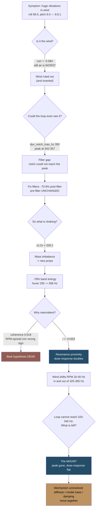
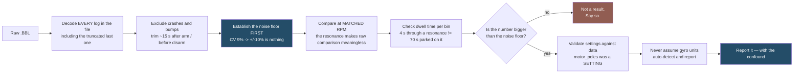

<!--
DRAFT NOTES FOR ANDRIUS — delete this comment block before publishing.

1. TITLE / DATE — still yours to confirm. series is [FPV Builds] to match the
   other FPV posts, thumbnail is meteor75-pro-vs-pro-ii.jpg. Both language
   files match on series and thumbnail.
2. LITHUANIAN TERMINOLOGY — needs your review. Five coinages I could not
   validate, all in index.lt.md:
     - "vibracijos gaubtinė"          (vibration envelope)
     - "struktūrinė moda"             (structural mode)
     - "atsako dozė"                  (dose-response)
     - "prisukta masė"                (sprung mass)
     - "struktūrai fiksuota ypatybė"  (structure-fixed feature)
   Betaflight parameter names and metric labels are deliberately left in
   English throughout — intentional, not an oversight.
3. NUMBERS STATED TWO WAYS — RESOLVED. Rather than silently picking one value,
   the opening of "Method notes worth keeping" now names the two analysis
   windows and explains every apparent disagreement:
     - 34.8/24.6 vs 34.5/24.5, +66% vs +65%, 0.789% vs 0.812%, 0.04% vs 0.076%
       -> different impact-exclusion pad or a different log, not a correction
     - foam post-filter roll 0.50 vs 0.67 deg/s -> two different metrics
       (Welch above 60 Hz vs an 80-780 Hz bandpass RMS)
     - the two five-mount sets (37.7/26.2/33.0/30.1/41.0 and
       38.3/26.0/31.0/26.6/42.5) -> outdoor RPM-binned vs steady-flight
       throttle-banded windows
   The intro now says "seven of them, itemised later" and matches the seven H3s
   under "Everything I got wrong". The stray "wrong for the fifth time" is gone.
4. chart8 in snake-chart-data.json (outside this folder) had a stale
   "Peak 48.8 -> 28.0 deg/s (-43%)" annotation. Already corrected there; the
   retired figure survives only in a _retracted metadata field as an audit
   trail, so regenerating from the JSON will not reintroduce it.
5. EXIF — GPS IFD removed from all five photos, remaining tags kept per the
   GPS-only rule. Verified before committing.
6. TONE — all four photographs were rebuilt from the originals with anchored
   monotone L-channel curves, not brightness multiplication. Every one passes
   the verification gate. The screenshot is deliberately uncurved.
-->

Craft name **Snake**. It started life as a Meteor75 Pro, and it is now a Meteor75 Pro II —
frame and canopy ordered off AliExpress, everything expensive carried straight over. Same
**Matrix 1S 3-in-1 FC**. Same **narrow-FOV DJI O4** air unit. New shell, old guts, and by the
time I was done, 169 flights and 15,574 seconds of logs to argue with.

The plan was a fifteen-minute swap. What I got was a week of chasing a resonance, three
retractions — seven of them, itemised later — one clean hypothesis that was completely wrong, one tuning change I had to revert, and
a metric that lied to me for several rounds before I noticed.

The thesis of the whole post: **the canopy that fixed my jello is the canopy the flight controller
now has to fight.** Decoupling the camera from the frame is good. Decoupling it *softly* is not
free.

## The build, and the mismatch that matters


*Left: the old Pro frame and canopy, stripped. Right: the Pro II, built up. Same flight controller, same air unit, same motors — everything that changed is structural.*

- **Frame + canopy:** Meteor75 Pro II, AliExpress parts
- **Guts:** carried over from the Meteor75 Pro — same Matrix 1S 3-in-1 FC, same narrow-FOV
  DJI O4 air unit
- FC target `BETAFPVG473` (STM32G473), manufacturer id `BEFH`
- Betaflight **4.5.1** (Dec 11 2025, `77d01ba3b`)
- 1S LiHV — `vbat_max_cell_voltage = 435`, `auto_profile_cell_count = 1`
- DSHOT300, `dshot_bidir = ON`, `motor_poles = 12`
- 3.2 kHz gyro and PID loop — `looptime 312`, `pid_process_denom 1`
- `blackbox_sample_rate = 1/2` → 1582 Hz logging, **791 Hz Nyquist**
- Digital VTX over MSP DisplayPort on serial 3
- `yaw_motors_reversed = ON` (props out)

The central part, which I did not think about at all while clicking "buy": **the Pro II canopy was
redesigned around the O4 Wide.** Snake runs the narrow-FOV O4, so the canopy is not carrying the
mass it was drawn around and the FC/canopy interface is not the pairing the frame was designed for.
I was building a hybrid and calling it an upgrade.

Two things I checked rather than assumed. **`motor_poles = 12` is a setting, not a measurement**,
so I validated it: measured dominant roll frequency over computed 1× came to **1.008–1.020**. At a
physical pole count of 14 that ratio would land near 1.17. The RPM filter was targeting the right
frequency all along.

**And my PID sliders were doing nothing.** `simplified_pids_mode = OFF` in profile 0 means the
configured slider values (master multiplier 120, d_gain 120, pi_gain 120) were **inactive**.
Profile 0 flew stock Betaflight 4.5 defaults the whole time: roll 45/80/40, pitch 47/84/46, yaw
45/80/0. Worth knowing before you spend an evening theorising about your tune.

## The symptom

> "Flying in the yard with some wind, I got huge vibrations."

First log, old props. Roll axis pre-filter HF energy (80–780 Hz) came in at **68.5 °/s** RMS.
Pitch: **8.0**. Yaw: **11.4**. That is an **8.6 : 1 roll-to-pitch ratio**, which is not a
noise problem, that is a single-axis mechanical problem wearing a noise costume.

Post-filter the same axis read **1.38 °/s** — the RPM filter carrying roughly **34 dB** and
politely hiding a large mechanical fault from the flight controller. The quad flew fine. The gyro
was screaming.

The harmonic structure named the fault type: the **1× to 2× ratio was around 200:1** (53:1 to
212:1 depending on the motor), which is textbook mass imbalance. A bent blade or real aerodynamic
loading puts energy into the higher harmonics; this put essentially none.

*Caveat I am not going to quietly drop:* at roughly 341 Hz the 3rd harmonic lands at 1023 Hz,
above this log's **791 Hz Nyquist**, so blade-pass content could not be assessed at all. The 2× at
~682 Hz was in range, clean, and the diagnostic one — so the conclusion holds on 2×, not on a full
harmonic picture.

## The hook: more wind made it better

My first instinct was that this was a wind problem. It said so right there in my own note. So
I compared sections at **matched prop frequency** (330–350 Hz), to hold the resonance constant
and let only the air change.

```chart
{
  "type": "bar",
  "data": {
    "labels": [
      [
        "outdoor gustiest",
        "(LF>18)"
      ],
      "outdoor, all",
      "outdoor calmest",
      "indoor clean",
      "indoor calmest air"
    ],
    "datasets": [
      {
        "label": "roll HF RMS",
        "data": [
          54.9,
          63.1,
          67.7,
          78.1,
          80.9
        ],
        "borderColor": "#244d68",
        "backgroundColor": "#244d68",
        "borderWidth": 1
      }
    ]
  },
  "options": {
    "responsive": true,
    "maintainAspectRatio": false,
    "plugins": {
      "legend": {
        "display": false,
        "position": "bottom"
      }
    },
    "scales": {
      "y": {
        "title": {
          "display": true,
          "text": "roll pre-filter HF RMS (deg/s)"
        }
      },
      "x": {
        "title": {
          "display": false,
          "text": ""
        }
      }
    }
  }
}
```

| section | roll HF (°/s) | turbulence | duration |
|---|---|---|---|
| outdoor, gustiest (LF>18) | **54.9** | 30.7 | 7.3 s |
| outdoor, all | 63.1 | 12.5 | 35.1 s |
| outdoor, calmest | 67.7 | 5.0 | 18.8 s |
| **indoor, clean** | 78.1 | 11.8 | 12.0 s |
| **indoor, calmest air** | **80.9** | 4.2 | 5.9 s |

`corr(turbulence, vibration)` at fixed RPM = **−0.584**.

More wind, *less* vibration. Dead-still indoor air was the **worst** case I could produce.

That is the single most useful result of the week, because it kills the obvious explanation on
day one and because the reason it happens turns out to *be* the mechanism. It takes a few more
sections to earn.

## Two things my config was getting wrong

Before chasing physics I read my own filter settings properly, which I should have done first:

```
dyn_notch_count   = 1     (default 3)
dyn_notch_q       = 400   (very narrow)
dyn_notch_min_hz  = 150
dyn_notch_max_hz  = 350   <-- BELOW the measured 342-357 Hz peak
gyro_lpf1_static_hz   = 0 (LPF1 fully disabled)
gyro_lpf1_dyn_min_hz  = 0
```

One notch, made needle-thin by `q = 400`, with a ceiling **below the actual peak** — the one
filter aimed at this problem physically could not reach it. LPF1 was off entirely. The fix:

```
set dyn_notch_count = 3
set dyn_notch_q = 300
set dyn_notch_min_hz = 100
set dyn_notch_max_hz = 600
set gyro_lpf1_dyn_min_hz = 250
```

Measured at matched prop RPM:

```chart
{
  "type": "bar",
  "data": {
    "labels": [
      "post-filter roll HF",
      "D-term roll RMS",
      "D-term pitch RMS",
      "motor jitter"
    ],
    "datasets": [
      {
        "label": "change (%)",
        "data": [
          -70.6,
          -51.0,
          -49.0,
          -42.0
        ],
        "borderColor": "#244d68",
        "backgroundColor": "#244d68",
        "borderWidth": 1
      }
    ]
  },
  "options": {
    "responsive": true,
    "maintainAspectRatio": false,
    "plugins": {
      "legend": {
        "display": false,
        "position": "bottom"
      }
    },
    "scales": {
      "y": {
        "title": {
          "display": true,
          "text": "change (%)"
        }
      },
      "x": {
        "title": {
          "display": false,
          "text": ""
        }
      }
    }
  }
}
```

| metric | before | after | change |
|---|---|---|---|
| post-filter roll HF RMS | 1.71 | 0.58 | **−70.6%** |
| total attenuation | 32.8 dB | 43.6 dB | +10.8 dB |
| D-term roll RMS | 6.7 | 3.3 | −51% |
| D-term pitch RMS | 4.3 | 2.2 | −49% |
| motor output jitter | 1.37 | 0.80 | **−42%** |

Pre-filter was unchanged, which is the whole point: **filters protect the loop, they do not fix
the airframe.** The quad shook just as hard afterwards. The flight controller simply stopped
reacting to it.

## The measurement bar — the number I should have established first

Everything after this depends on one boring question: how big does a change have to be before I
am allowed to call it real? So I measured the scatter of pre-filter roll HF RMS *within a single flight*, at **fixed**
RPM, and treated that as my noise floor:

```
CV = 9.0%,  max/min = 1.38   (n = 21 windows of 3 s)
corr with pack voltage      = +0.04
corr with time/temperature  = -0.05
```

**Any change smaller than about ±10% is indistinguishable from noise.** Not "probably noise" —
indistinguishable. Not pack sag, not thermal drift; both correlations are flat. It is just how
much this measurement wanders when nothing changes, and it killed several conclusions I wanted
to keep later in the week. Establish the noise floor before you believe any result — especially
one you like.

## Props: the first real mechanical win

New props changed three things at once — bad experimental hygiene, good evening:

- RPM-per-output spread across the four motors collapsed from **9.2 to 4.4 percentage points**
- 1× amplitudes evened out — m1 108.7 → 56.7 °/s, m4 107.1 → 56.8
- hover prop frequency dropped **330 → 308 Hz**

Outdoor, full RPM sweep, same airframe, so what changes here is the *forcing*:

```chart
{
  "type": "line",
  "data": {
    "labels": [
      275,
      300,
      325,
      350,
      375,
      400,
      425
    ],
    "datasets": [
      {
        "label": "old props",
        "data": [
          42,
          55,
          62,
          55,
          43,
          32,
          25
        ],
        "borderColor": "#244d68",
        "backgroundColor": "transparent",
        "borderWidth": 2,
        "pointRadius": 3,
        "tension": 0.25,
        "spanGaps": true,
        "fill": false
      },
      {
        "label": "new props",
        "data": [
          42,
          43,
          34,
          24,
          25,
          22,
          15
        ],
        "borderColor": "#915d52",
        "backgroundColor": "transparent",
        "borderWidth": 2,
        "pointRadius": 3,
        "tension": 0.25,
        "spanGaps": true,
        "fill": false
      }
    ]
  },
  "options": {
    "responsive": true,
    "maintainAspectRatio": false,
    "plugins": {
      "legend": {
        "display": true,
        "position": "bottom"
      }
    },
    "scales": {
      "y": {
        "title": {
          "display": true,
          "text": "roll pre-filter HF RMS (deg/s)"
        }
      },
      "x": {
        "title": {
          "display": true,
          "text": "prop 1x frequency (Hz)"
        }
      }
    }
  }
}
```

| prop Hz | 275 | 300 | 325 | 350 | 375 | 400 | 425 |
|---|---|---|---|---|---|---|---|
| old props | 42 | 55 | **62** | 55 | 43 | 32 | 25 |
| new props | 42 | 43 | **34** | 24 | 25 | 22 | 15 |

*Cut at 425 Hz on purpose: the 450 and 475 Hz bins carry 1.1–3.0 s of dwell against 32–53 s in
the bins that matter, and a 4 s excursion through a resonance cannot build the amplitude that
50 s parked on it does. Every bin shown clears 4 s on both flights.*

−45% at the peak, −56% at 350–375 Hz. Fixed-band energy across 325–365 Hz went
**1185 → 263 — a 78% cut.**

Note where the curves start: at 275 Hz they are **identical at 42 °/s**. Below the resonance the
props make no measurable difference at all. Everything they bought, they bought inside the band —
the first hint that this was never really a prop-balance story.

At this point I thought props and a notch config had solved it. I had not even correctly
described what the problem *was*.

## The mechanism — and a clean hypothesis that was wrong

The observation that cracked it is one I nearly ignored, because I had written it down and
then filed it as vague: *the shaking is not always present, only in some orientations relative
to wind.*

Intermittent. Orientation-dependent. My first idea was **beat frequencies**: four motors at
343 / 313 / 337 / 332 Hz predict beats at 5.2, 6.1, 11.3, 19.7, 24.9 and 31.0 Hz, right in the
band where I could see the airframe moving. Clean, testable, satisfying, and wrong:

```
coherence(beat envelope, visible 8-45 Hz motion) = 0.019 mean, 0.063 max
corr(RPM spread, envelope)                       = -0.287    (wrong direction)
measured modulation 1.9 Hz vs nearest predicted pair 5.2 Hz
```

Coherence of 0.019 is not a weak signal, it is *no* signal, and the RPM-spread correlation came
out **negative** — the opposite of what a beat model requires. Dead in one afternoon.

What did predict the shake was duller:

| model | correlation with vibration envelope |
|---|---|
| **resonance proximity (Lorentzian @ 343 Hz)** | **+0.652** |
| number of motors inside 325–365 Hz | +0.583 |
| mean prop frequency | +0.308 |
| motor RPM spread | −0.287 |
| throttle | +0.182 |

And the dose-response, about as textbook as field data gets:

```chart
{
  "type": "bar",
  "data": {
    "labels": [
      "0",
      "1",
      "2",
      "3",
      "4"
    ],
    "datasets": [
      {
        "label": "vibration envelope",
        "data": [
          55.46,
          78.38,
          95.41,
          108.71,
          111.64
        ],
        "borderColor": "#244d68",
        "backgroundColor": "#244d68",
        "borderWidth": 1
      }
    ]
  },
  "options": {
    "responsive": true,
    "maintainAspectRatio": false,
    "plugins": {
      "legend": {
        "display": false,
        "position": "bottom"
      }
    },
    "scales": {
      "y": {
        "title": {
          "display": true,
          "text": "vibration envelope (deg/s)"
        }
      },
      "x": {
        "title": {
          "display": true,
          "text": "motors inside 325-365 Hz"
        }
      }
    }
  }
}
```

| motors inside 325–365 Hz | envelope | % of flight |
|---|---|---|
| 0 | **55 °/s** | 21% |
| 1 | 78 | 13% |
| 2 | 95 | 17% |
| 3 | 109 | 38% |
| 4 | **112 °/s** | 11% |

**It doubles.** Count how many props sit inside the resonance window and you can predict the
shake.

That explains the intermittency, the orientation dependence *and* the backwards wind
correlation in one go. Wind redistributes thrust between the corners, shifting individual motor
RPMs by 20–40 Hz and sliding them in and out of the window — gusts **scatter** the props off the
resonance. Indoors the quad hovers rock-steady and parks all four of them on it for as long as
you let it. **Still air is the worst case because still air is the most precise.** That sentence
comes back every time I compare an indoor flight to an outdoor one.

It also reframes the prop win:

| | hover | margin to 325 Hz | ≥1 motor in band | ≥3 in band | envelope |
|---|---|---|---|---|---|
| old props, indoor | 328 Hz | **−3** | 79% | 49% | 91.7 |
| new props, indoor | 307 Hz | **+18** | 25% | 4% | 68.8 |
| new props, outdoor | 363 Hz | −38 (above) | 63% | 6% | 35.4 |

The old props hovered **dead inside** the resonance band, three hertz of margin. Less imbalance
was the smaller part of the win; moving the operating point off the resonance was the larger
part. I had done the right thing for a reason I did not understand.



## Two problems, not one — and the catch in "Gyroflow fixes it"

This distinction took most of the week to nail down, and it decides what software can save you
from.

**(a) The ~320–345 Hz structural mode.** Roll-dominant, 8:1. This is the jello source. It
sits **an order of magnitude above the control loop's usable bandwidth of 20–40 Hz.** No PID
change, no TPA setting, no filter tweak can touch it. Filters stop it reaching the loop; they
cannot stop the airframe shaking. And **neither Gyroflow nor RockSteady can remove jello** —
it is intra-frame distortion, the damage is inside the rolling shutter before any
stabiliser sees the image.

**(b) Broadband 10–25 Hz turbulence following.** Measured **Q ≈ 1.9–2.2**. Peak 15.8–17.8 Hz
on roll, 10.6–12.9 Hz on pitch, amplitude 4.4–5.3 °/s. A control-loop limit cycle would show
Q = 10–100; Q ≈ 2 is a lightly-damped airframe genuinely being pushed around by turbulent air.

```chart
{
  "type": "bar",
  "data": {
    "labels": [
      "wind shake, roll",
      "wind shake, pitch",
      "48.5 Hz mode"
    ],
    "datasets": [
      {
        "label": "Q factor",
        "data": [
          2.2,
          2.2,
          83.7
        ],
        "borderColor": "#244d68",
        "backgroundColor": "#244d68",
        "borderWidth": 1
      }
    ]
  },
  "options": {
    "responsive": true,
    "maintainAspectRatio": false,
    "plugins": {
      "legend": {
        "display": false,
        "position": "bottom"
      }
    },
    "scales": {
      "y": {
        "title": {
          "display": true,
          "text": "Q factor"
        }
      },
      "x": {
        "title": {
          "display": false,
          "text": ""
        }
      }
    }
  }
}
```

There *is* a genuinely sharp mode in there — 48.5 Hz at **Q = 83.7** — with an amplitude of
**0.24 °/s**, i.e. completely irrelevant. High Q is not the same as important.

Where does the motion you can actually *see* live?

```chart
{
  "type": "bar",
  "data": {
    "labels": [
      "1-5 Hz",
      "5-10 Hz",
      "10-20 Hz",
      "200-790 Hz"
    ],
    "datasets": [
      {
        "label": "old props, old filters",
        "data": [
          3.84,
          2.66,
          1.45,
          1.68
        ],
        "borderColor": "#244d68",
        "backgroundColor": "#244d68",
        "borderWidth": 1
      },
      {
        "label": "old props, new filters",
        "data": [
          1.92,
          1.58,
          1.05,
          0.38
        ],
        "borderColor": "#915d52",
        "backgroundColor": "#915d52",
        "borderWidth": 1
      },
      {
        "label": "new props, new filters",
        "data": [
          1.29,
          0.93,
          0.91,
          0.26
        ],
        "borderColor": "#bd9361",
        "backgroundColor": "#bd9361",
        "borderWidth": 1
      }
    ]
  },
  "options": {
    "responsive": true,
    "maintainAspectRatio": false,
    "plugins": {
      "legend": {
        "display": true,
        "position": "bottom"
      }
    },
    "scales": {
      "y": {
        "title": {
          "display": true,
          "text": "roll gyro RMS, post-filter (deg/s)"
        }
      },
      "x": {
        "title": {
          "display": true,
          "text": "band"
        }
      }
    }
  }
}
```

| | 1–5 Hz | 5–10 Hz | 10–20 Hz | 200–790 Hz |
|---|---|---|---|---|
| old props, old filters | 3.84 | 2.66 | 1.45 | 1.68 |
| old props, new filters | 1.92 | 1.58 | 1.05 | 0.38 |
| new props, new filters | **1.29** | **0.93** | **0.91** | **0.26** |

Filters alone took the high band 1.68 → 0.38, props took it further: −66% at 1–5 Hz, −85% up
high. Note the ratio — roughly **five times more energy sits in the Gyroflow-correctable band
than up where a rolling shutter turns vibration into jello.** Which is why the footage looked
acceptable while the gyro was screaming.


*The thing I am actually fighting. Top trace is raw gyro: a continuous band that swells and fades rather than a clean line. Everything below it - filtered gyro, P, D, PID sums - is flat, which is the filters doing their job. None of that helps the camera.*

On its own that trace is just a number in a log. The problem is what happens next: **under some
conditions the loop reacts to it, drives the motors with it, and the airframe genuinely moves.**
Then it stops being a gyro reading and starts being shake in the video feed — and not only in
heavy wind, in conditions I would call mild.

Now the catch, and the most useful practical thing I learned all week:

> **Video stabilisation only rescues this if there is plenty of light.**

On a bright day exposure times are short, each frame is crisp, the shake shows up as
frame-to-frame *displacement*, and Gyroflow can re-align frames and take it out. On a cloudy day
the camera holds the shutter open longer. Now the shake happens *during* each exposure rather
than between frames, and it is recorded as **motion blur baked into the pixels**. Stabilisation
can align a blurred frame perfectly and it is still blurred. The whole clip is soft.

So the comfortable framing — jello unfixable, low-frequency shake fixable — is too generous. The
honest version has three tiers:

| symptom | can it be fixed after the flight? |
|---|---|
| jello (rolling-shutter distortion) | **no** — not Gyroflow, not RockSteady |
| shake, bright light, short exposure | **yes** — this is what stabilisation is for |
| shake, low light, long exposure | **no** — it is motion blur, not displacement |

Two of the three are unrecoverable, and which one you get is decided by the weather rather than
by anything in the tune. That is why I kept after the mechanical side long after the flight
controller had stopped complaining.

## A tuning experiment that failed and got reverted

The D-term lagged the error by **16.4 ms** in the 8–45 Hz band, most of a half-cycle at 17 Hz, so
raising `dterm_lpf1_static_hz` from 75 to 90 looked like free money. Matched indoor hover, same
props, 307 vs 309 Hz:

```chart
{
  "type": "bar",
  "data": {
    "labels": [
      "post-filter noise",
      "D-term RMS",
      "D-term HF noise",
      "motor jitter",
      "14 Hz oscillation"
    ],
    "datasets": [
      {
        "label": "change (%)",
        "data": [
          171,
          242,
          283,
          370,
          168
        ],
        "borderColor": "#244d68",
        "backgroundColor": "#244d68",
        "borderWidth": 1
      }
    ]
  },
  "options": {
    "responsive": true,
    "maintainAspectRatio": false,
    "plugins": {
      "legend": {
        "display": false,
        "position": "bottom"
      }
    },
    "scales": {
      "y": {
        "title": {
          "display": true,
          "text": "change (%)"
        }
      },
      "x": {
        "title": {
          "display": false,
          "text": ""
        }
      }
    }
  }
}
```

| | lpf1 = 75 | lpf1 = 90 | change |
|---|---|---|---|
| post-filter roll noise | 0.34 | 0.92 | **+171%** |
| D-term RMS | 2.06 | 7.04 | **+242%** |
| D-term HF noise | 1.06 | 4.06 | **+283%** |
| **motor jitter** | 0.555 | 2.606 | **+370%** |
| 14 Hz roll oscillation | 1.01 | 2.71 | **+168%** |

It bought **1.9 ms** of lag reduction for 370% more motor jitter, and the spectrum was worse at
*every* frequency from 2 to 400 Hz. Reverted.

Airmode went on in the same session (feature mask delta exactly 4194304 in the log) and stayed —
3.3 s below 1250 throttle at minimum motor output 201, no authority dropout. **Confound:** two
variables changed at once, so the 14 Hz growth cannot be cleanly split between the filter and
airmode. The other four rows are large enough to survive that; the 14 Hz number is not clean.

### Why I could not measure my own step response

I tried repeatedly to get a real step response out of these logs and was blocked by the input:

```
setpoint energy: roll 95% below 1.7 Hz | pitch 1.4 Hz | yaw 1.5 Hz
hard stick reversals: 0
slew events >4000 deg/s^2: 3
```

A quad's loop lives at 20–40 Hz. Smooth continuous rolls contain no high-frequency content, so
the step response is **input-bandwidth limited, not quad-limited**. The "173 ms rise time" I
computed early on was a faithful measurement of my sticks.

One flight with 39 hard reversals and 26 sharp slews finally gave a real number: **roll overshoot
+10.4% at 133 ms, rise(90%) 77.7 ms, 50% delay 32.9 ms** — n = 6 steps, because the log ended in
a 9.6 G crash. Indicative, not settled.

## The bad motor that turned out to be air

For most of the week one motor looked guilty:

```
m2 RPM-per-output:  -4.2% to -6.1%    (worst in EVERY log)
m1 hover output:    +6.7% to +11.1%   (works hardest, and the ONLY motor clipping)
```

m1 clipped 0.789% of frames while m2 and m3 sat at exactly 0.000%, and the shake was **1.59×
worse** with motors near the ceiling. Diagnosis: a draggy bearing on m2 and an overworked m1.
Two hardware faults, both confidently called.

Then I rotated the canopy 180° and the ordering **reversed**:

```chart
{
  "type": "bar",
  "data": {
    "labels": [
      "m1",
      "m2",
      "m3",
      "m4"
    ],
    "datasets": [
      {
        "label": "before canopy rotation",
        "data": [
          -0.1,
          -5.3,
          5.0,
          0.4
        ],
        "borderColor": "#244d68",
        "backgroundColor": "#244d68",
        "borderWidth": 1
      },
      {
        "label": "after canopy rotation",
        "data": [
          3.1,
          5.0,
          -3.4,
          -4.7
        ],
        "borderColor": "#915d52",
        "backgroundColor": "#915d52",
        "borderWidth": 1
      }
    ]
  },
  "options": {
    "responsive": true,
    "maintainAspectRatio": false,
    "plugins": {
      "legend": {
        "display": true,
        "position": "bottom"
      }
    },
    "scales": {
      "y": {
        "title": {
          "display": true,
          "text": "RPM per unit output, deviation from mean (%)"
        }
      },
      "x": {
        "title": {
          "display": true,
          "text": "motor"
        }
      }
    }
  }
}
```

```
before rotation:  m2 = -4.2% to -6.1%   (worst)
after rotation:   m2 = +4.3% to +8.0%   (freest)
```

A motor defect cannot flip sign when you rotate a canopy. **The pattern is aerodynamic — the
canopy shadows whichever props sit under it.** Both diagnoses retracted. Installation, not
hardware, and I only found out because I changed something unrelated and kept measuring.

The rotation did real work on CoG:

```chart
{
  "type": "bar",
  "data": {
    "labels": [
      "m1",
      "m2",
      "m3",
      "m4"
    ],
    "datasets": [
      {
        "label": "before rotation (15:53 outdoor)",
        "data": [
          12.5,
          -5.8,
          -3.2,
          -3.4
        ],
        "borderColor": "#244d68",
        "backgroundColor": "#244d68",
        "borderWidth": 1
      },
      {
        "label": "after rotation (20:40)",
        "data": [
          -3.3,
          -13.8,
          11.8,
          5.3
        ],
        "borderColor": "#915d52",
        "backgroundColor": "#915d52",
        "borderWidth": 1
      }
    ]
  },
  "options": {
    "responsive": true,
    "maintainAspectRatio": false,
    "plugins": {
      "legend": {
        "display": true,
        "position": "bottom"
      }
    },
    "scales": {
      "y": {
        "title": {
          "display": true,
          "text": "hover output, deviation from mean (%)"
        }
      },
      "x": {
        "title": {
          "display": true,
          "text": "motor"
        }
      }
    }
  }
}
```

Hardest-working motor moved from m1 to m3/m4, and m1's clipping went **0.812% → 0.000%**.
**The rotation alone took the front/rear pair split from +9.5% to +3.6%.**

Two notes on scope, because these numbers are easy to mis-stack. **The +12.5% on m1 is the 15:53
outdoor flight specifically**, while the `+6.7% to +11.1%` range above spans the 14:26, 15:20 and
16:28 logs — one flight versus a range across three, neither superseding the other. And **the
rotation and the foam are separate interventions whose CoG results do not chain**: rotation moved
the pair split +9.5% → +3.6%, the foam later and independently moved it +3.4% → +2.0%. Reading
those as one run from +9.5% to +2.0% would be wrong.

The mod is not mine — rotating the canopy 180° comes from Oscar Liang's
[Improvements You Can Make](https://oscarliang.com/betafpv-meteor75-pro-dji-o4-wide/#Improvements-You-Can-Make)
section.

### A battery weighed from a log file

Small side-quest, included because I enjoyed it. Two packs flown back to back; hover RPM is a
valid mass proxy at fixed prop and config:

```
log1: airborne 70 s, hover 330 Hz, 966 indicated charge
log2: airborne 95 s, hover 340 Hz, 1585 indicated charge
hover RPM ratio 1.0612 -> mass ratio 1.126 -> log2 is 12.6% heavier
```

Identified purely from the log, with no other input about which pack was which.

The packs are also the practical reason the canopy went round the other way: rotated, it gives
better mass distribution with the **LAVA 2 680 mAh** batteries I actually fly, so the front/rear
split halving was design intent rather than luck. Those packs buy **about 3 minutes ripping, 5–6
cruising.** Worth holding next to the heavy-versus-light thread further down — the heavier pack
bought 36% more airborne time and 4× more motor clipping.

## The mount is the lever, not the tune


*The canopy the whole argument is about — drawn around the O4 Wide, carrying a narrow-FOV O4. It isolates the camera far better than the old one. It also gave the flight controller something to fight.*

The loop cannot reach 320–345 Hz. The props were already good. That leaves the structure, and
the thesis of the post: **frame-and-canopy decoupling is good and bad at the same time.**

The old canopy coupled too much vibration into the camera: jello, unfixable downstream. The new
one is far better isolated, so what the camera still sees is low-frequency and Gyroflow-shaped —
conditionally. But that same decoupling created a soft, lightly-damped path between the FC/canopy
assembly and the frame, and the FC now **fights the canopy**. In higher winds it loses, because
wind shifts motor RPMs into the resonance window and the mode gets driven.

I spent the first half of the week adjusting a 20–40 Hz control loop in the hope of influencing a
320–345 Hz structural mode. That was never going to work, and it took a dose-response curve to
convince me. What follows is five mount configurations in the order I flew them, with the
conclusion moving twice.

### One: a large foam pad, and the amplification collapsed

Stiff foam between FC and VTX, stretching the gummy-ball mounts and stiffening the canopy
fixation. Same pack (hover 345 vs 347 Hz), **zero config changes** — a clean mechanical A/B.

The dose-response that had defined the entire problem **collapsed**:

```chart
{
  "type": "bar",
  "data": {
    "labels": [
      "0",
      "2",
      "4"
    ],
    "datasets": [
      {
        "label": "before foam",
        "data": [
          35,
          52,
          57
        ],
        "borderColor": "#244d68",
        "backgroundColor": "#244d68",
        "borderWidth": 1
      },
      {
        "label": "after foam",
        "data": [
          29,
          33,
          33
        ],
        "borderColor": "#915d52",
        "backgroundColor": "#915d52",
        "borderWidth": 1
      }
    ]
  },
  "options": {
    "responsive": true,
    "maintainAspectRatio": false,
    "plugins": {
      "legend": {
        "display": true,
        "position": "bottom"
      }
    },
    "scales": {
      "y": {
        "title": {
          "display": true,
          "text": "vibration envelope (deg/s)"
        }
      },
      "x": {
        "title": {
          "display": true,
          "text": "motors inside 325-365 Hz"
        }
      }
    }
  }
}
```

| | 0 motors in band | 2 in band | 4 in band |
|---|---|---|---|
| before | 35 | 52 | **57** |
| **after** | **29** | **33** | **33** |

Vibration used to climb 45–63% as motors entered the band. Now it is flat: motors sitting in the
resonance band **stopped mattering**, which is a better outcome than making them smaller.

The resonance curve says the same thing:

```chart
{
  "type": "line",
  "data": {
    "labels": [
      250,
      275,
      300,
      325,
      350,
      375,
      400,
      425,
      450,
      475,
      500
    ],
    "datasets": [
      {
        "label": "before foam (heavy pack)",
        "data": [
          35,
          43,
          49,
          39,
          32,
          26,
          17,
          15,
          15,
          9,
          5
        ],
        "borderColor": "#244d68",
        "backgroundColor": "transparent",
        "borderWidth": 2,
        "pointRadius": 3,
        "tension": 0.25,
        "spanGaps": true,
        "fill": false
      },
      {
        "label": "after foam (heavy pack)",
        "data": [
          30,
          27,
          26,
          28,
          25,
          25,
          27,
          27,
          22,
          15,
          12
        ],
        "borderColor": "#915d52",
        "backgroundColor": "transparent",
        "borderWidth": 2,
        "pointRadius": 3,
        "tension": 0.25,
        "spanGaps": true,
        "fill": false
      }
    ]
  },
  "options": {
    "responsive": true,
    "maintainAspectRatio": false,
    "plugins": {
      "legend": {
        "display": true,
        "position": "bottom"
      }
    },
    "scales": {
      "y": {
        "title": {
          "display": true,
          "text": "roll pre-filter HF RMS (deg/s)"
        }
      },
      "x": {
        "title": {
          "display": true,
          "text": "mean prop 1x frequency (Hz)"
        }
      }
    }
  }
}
```

| metric | before | after | change |
|---|---|---|---|
| resonance-curve shape | **pronounced peak at 48.8 °/s** | **essentially flat, 25–30 °/s** | peak gone |
| pre-filter roll RMS | 37.0 | 25.9 | **−30%** |
| post-filter roll | 0.65 | 0.50 | −23% |
| vibration envelope | 40.6 | 30.8 | −24% |
| motor clipping | m4 1.94%, m3 0.33% | **all 0.00%** | — |
| front/rear pair split (foam only) | +3.4% | **+2.0%** | best recorded |

The result is **the disappearance of the peak, not a reduction in its height**, and the
distinction is deliberate. Before the foam there is an unmistakable amplification peak at
48.8 °/s. After, there is no peak: the curve sits between 25 and 30 °/s across the whole
250–425 Hz sweep and the "maximum" is wherever the noise lands that run. Quoting a single
after-peak number invites a percentage that is really a resonance compared against a flat line,
so I am not quoting one. The curve stopped having a shape. That is the finding.

And the energy did not vanish, it moved:

```chart
{
  "type": "bar",
  "data": {
    "labels": [
      "280-325",
      "325-365",
      "365-420",
      "420-500"
    ],
    "datasets": [
      {
        "label": "before foam",
        "data": [
          714,
          313,
          20,
          16
        ],
        "borderColor": "#244d68",
        "backgroundColor": "#244d68",
        "borderWidth": 1
      },
      {
        "label": "after foam",
        "data": [
          181,
          135,
          104,
          77
        ],
        "borderColor": "#915d52",
        "backgroundColor": "#915d52",
        "borderWidth": 1
      }
    ]
  },
  "options": {
    "responsive": true,
    "maintainAspectRatio": false,
    "plugins": {
      "legend": {
        "display": true,
        "position": "bottom"
      }
    },
    "scales": {
      "y": {
        "title": {
          "display": true,
          "text": "pre-filter roll energy"
        }
      },
      "x": {
        "title": {
          "display": true,
          "text": "frequency band (Hz)"
        }
      }
    }
  }
}
```

| band | before | after |
|---|---|---|
| 280–325 Hz | 714 | **181** (−75%) |
| 325–365 Hz | 313 | **135** (−57%) |
| 365–420 Hz | 20 | 104 |
| 420–500 Hz | 16 | 77 |

**Caveat:** throttle p99 was 1751 versus 1968, so part of that zero-clipping result is me flying
less aggressively — the weakest row in the table, and it should be read as such. The pair-split
row is the **foam** result, independent of the canopy-rotation result earlier.

### Two: TPU in the gummies, because foam cooks the board

The foam worked, but it is a blanket over the hot part of the board, so it came out. What
replaced it was **two** changes in the same session:

1. **The VTX mounted directly to the canopy, silicone grommets removed.** That deletes a
   compliant element from the path between the air unit's mass and the canopy — canopy and VTX
   are now effectively one body.
2. **TPU filament inserted inside the gummy balls**, raising their stiffness substantially and
   stiffening the FC-to-frame path.

Two stiffness increases, on two different load paths, at once. So whatever the numbers show,
**I cannot split the credit between them** — a self-inflicted attribution problem, and the honest
move is to label it rather than pick a winner.


*TPU filament pushed inside the rubber gummies. The red circle marks one of them. Two jobs, not one: stiffer coupling, and a canopy far less likely to part company with the frame.*

The TPU's second job needs no measurement: with filament inside them the gummies are far less
inclined to **separate**, worth having on its own for a whoop that spends its life bouncing off
door frames. Oscar Liang uses glue; I used filament, because glue is a one-way door and filament
comes back out — which matters when the point of the exercise is A/B testing the mount.

The scoring plan was written down **before** the flight, because I no longer trust a comparison I
designed after seeing the data. The primary criterion was the **motors-in-band dose-response**
staying flat.

It stayed flat. 84 s of clean indoor hover, second arm, zero impacts, **`0` config changes.** On
the resonance curve only one bin is trustworthy — 79.6 s of dwell at 300–325 Hz against 0.5–1.8 s
everywhere else — so I am plotting that point alone rather than drawing a line through noise:

```chart
{
  "type": "line",
  "data": {
    "labels": [
      250,
      275,
      300,
      325,
      350,
      375,
      400,
      425,
      450,
      475,
      500
    ],
    "datasets": [
      {
        "label": "no foam (outdoor)",
        "data": [
          35,
          43,
          49,
          39,
          32,
          26,
          17,
          15,
          15,
          9,
          5
        ],
        "borderColor": "#244d68",
        "backgroundColor": "transparent",
        "borderWidth": 2,
        "pointRadius": 3,
        "tension": 0.25,
        "spanGaps": true,
        "fill": false
      },
      {
        "label": "+ foam (outdoor)",
        "data": [
          30,
          27,
          26,
          28,
          25,
          25,
          27,
          27,
          22,
          15,
          12
        ],
        "borderColor": "#915d52",
        "backgroundColor": "transparent",
        "borderWidth": 2,
        "pointRadius": 3,
        "tension": 0.25,
        "spanGaps": true,
        "fill": false
      },
      {
        "label": "grommets out + TPU (indoor, 79.6 s dwell)",
        "data": [
          null,
          null,
          39,
          null,
          null,
          null,
          null,
          null,
          null,
          null,
          null
        ],
        "pointRadius": 8,
        "showLine": false,
        "borderColor": "#bd9361",
        "backgroundColor": "transparent",
        "borderWidth": 2,
        "tension": 0.25,
        "spanGaps": true,
        "fill": false
      }
    ]
  },
  "options": {
    "responsive": true,
    "maintainAspectRatio": false,
    "plugins": {
      "legend": {
        "display": true,
        "position": "bottom"
      }
    },
    "scales": {
      "y": {
        "title": {
          "display": true,
          "text": "roll pre-filter HF RMS (deg/s)"
        }
      },
      "x": {
        "title": {
          "display": true,
          "text": "mean prop 1x frequency (Hz)"
        }
      }
    }
  }
}
```

39 °/s, between the 49 of no foam and the 26 of foam — except the two curves are outdoor and that
point is indoor, which per the first finding in this post is the *worst* case for this resonance.
The gap is inflated by an unknown amount. Which is exactly why the dose-response, not the curve,
was the pre-registered criterion: it compares the quad against *itself* at different RPMs within
one flight, so it does not care about the weather.

```chart
{
  "type": "bar",
  "data": {
    "labels": [
      "0 motors",
      "1 motor",
      "2 motors",
      "3 motors",
      "4 motors"
    ],
    "datasets": [
      {
        "label": "rotated, NO foam",
        "data": [
          35,
          41,
          52,
          55,
          57
        ],
        "borderColor": "#244d68",
        "backgroundColor": "#244d68",
        "borderWidth": 1
      },
      {
        "label": "rotated, + foam",
        "data": [
          29,
          31,
          33,
          33,
          33
        ],
        "borderColor": "#915d52",
        "backgroundColor": "#915d52",
        "borderWidth": 1
      },
      {
        "label": "grommets out + TPU (indoor)",
        "data": [
          49,
          52,
          52,
          null,
          null
        ],
        "borderColor": "#bd9361",
        "backgroundColor": "#bd9361",
        "borderWidth": 1
      }
    ]
  },
  "options": {
    "responsive": true,
    "maintainAspectRatio": false,
    "plugins": {
      "legend": {
        "display": true,
        "position": "bottom"
      }
    },
    "scales": {
      "y": {
        "title": {
          "display": true,
          "text": "vibration envelope (deg/s)"
        }
      },
      "x": {
        "title": {
          "display": true,
          "text": "motors inside the 325-365 Hz resonance window"
        }
      }
    }
  }
}
```

Slope across the band, which is the number that matters:

| mount | dose-response slope | verdict |
|---|---|---|
| rotated, no foam | **+66%** | resonance fully amplifying |
| rotated, + foam | +15% | mostly killed |
| **grommets out + TPU in gummies** | **+6%** | **killed** |

Sitting in the resonance window has stopped mattering. The criterion passed. Two more things beat
the foam flight on the same log: **post-filter roll noise 0.34 °/s at 41.2 dB attenuation**, the
cleanest of the session against 0.67 °/s and 31.8 dB for the foam; and **the flattest motor
balance I have recorded on this quad** — deviations of −0.1 / −4.2 / +2.5 / +1.7 percent, a
6.7-point spread where every earlier flight ran 17–25, front/rear split +1.7%, zero clipping.

What that log **cannot** tell me: it was indoors and it sampled one RPM bin, 80 of the 84 clean
seconds at 300–325 Hz. I had asked myself for 3–4 slow throttle sweeps and flew a hover instead,
so there is no structural *curve* and I cannot locate the mode frequency from one RPM slice. The
raw pre-filter number also looks worse than the foam — 39.1 °/s against 26.0 — but the foam
flight was outdoors in 4.71 °/s of wind and this one indoors at 1.99, and still air is the worst
case, so that comparison loads the dice against the calm one. The only like-for-like number I
have is indoor against indoor: the pre-foam, pre-rotation indoor flight read **54 °/s** at
300–325 Hz and this one reads **39**, about **28% better**. Real, but one bin.

### Three: outdoors, where the trade-off flipped

121 s clean, outdoors, 5.51 °/s of wind, **zero config changes**, and finally proper RPM coverage:
**8 of 12 bins** at 4 s or more against 5 for every previous flight. Best dataset of the exercise.

The pre-registered criterion held, now outdoors:

| mount | dose-response slope |
|---|---|
| no foam | +66% |
| + foam | +15% |
| grommets out + TPU, indoor | +6% |
| **grommets out + TPU, outdoor** | **+7%** |

The structure-fixed feature agrees: **363 Hz** with the TPU, **368 Hz** with the foam, **255 Hz**
with neither. Both stiff solutions land in the same place — stiffening moved that feature up by
about 110 Hz and it stayed moved.

But the foam is still the quieter mount. Outdoor against outdoor at matched prop RPM, the fair
comparison I had been waiting two days for:

```chart
{
  "type": "line",
  "data": {
    "labels": [
      275,
      300,
      325,
      350,
      375,
      400,
      425
    ],
    "datasets": [
      {
        "label": "no foam",
        "data": [
          43,
          49,
          39,
          32,
          26,
          null,
          null
        ],
        "borderColor": "#244d68",
        "backgroundColor": "transparent",
        "borderWidth": 2,
        "pointRadius": 3,
        "tension": 0.25,
        "spanGaps": true,
        "fill": false
      },
      {
        "label": "+ foam",
        "data": [
          27,
          26,
          28,
          25,
          25,
          27,
          27
        ],
        "borderColor": "#915d52",
        "backgroundColor": "transparent",
        "borderWidth": 2,
        "pointRadius": 3,
        "tension": 0.25,
        "spanGaps": true,
        "fill": false
      },
      {
        "label": "grommets out + TPU",
        "data": [
          44,
          38,
          35,
          32,
          31,
          23,
          21
        ],
        "borderColor": "#bd9361",
        "backgroundColor": "transparent",
        "borderWidth": 2,
        "pointRadius": 3,
        "tension": 0.25,
        "spanGaps": true,
        "fill": false
      }
    ]
  },
  "options": {
    "responsive": true,
    "maintainAspectRatio": false,
    "plugins": {
      "legend": {
        "display": true,
        "position": "bottom"
      }
    },
    "scales": {
      "y": {
        "title": {
          "display": true,
          "text": "roll pre-filter HF RMS (deg/s)"
        }
      },
      "x": {
        "title": {
          "display": true,
          "text": "mean prop 1x frequency (Hz)"
        }
      }
    }
  }
}
```

Mean across reliable bins: **26.2 °/s for the foam, 33.0 for the TPU**, about 26% worse. The
curve is less flat too — flatness 1.13 for the foam, **2.14** for the TPU, worse even than the
1.85 of no mount treatment at all — with a peak back at the low end, 44 °/s at 275–300 Hz falling
to 21 by 425.

So the amplification *mechanism* is dead, but the overall vibration level is up. Different
statements, both true.

### And then the camera got jello back

The part I did not predict, and the thesis of this post arriving from the opposite direction.
Energy in the 250–450 Hz band, which is what a rolling shutter turns into jello:

| mount | 250–450 Hz RMS |
|---|---|
| no foam | 34.8 |
| **+ foam** | **24.6** |
| **grommets out + TPU** | **31.0** — up 26% |

Low-frequency shake is now largely imperceptible in the air, and jello is back on the footage.

**And my first explanation was wrong.** I claimed removing the VTX grommets had "rigidly bonded
the camera to the canopy." It had not: the VTX is a bare board and the **camera is mounted on the
canopy**, not on the VTX. Those grommets were suspending a board with nothing on it — dead weight
and one more suspended mass free to resonate. Removing them was not the jello mechanism.

The mechanism is the **canopy-to-frame** path, because that is what the camera rides on. TPU in
those gummies stiffened it, and a stiffer path transmits more frame vibration straight into the
camera. Unlike foam, filament adds stiffness without meaningful damping — it couples without
absorbing. So jello risk is a product, not a level:

> jello ≈ (vibration at the frame) × (transmissibility of the canopy mount at those frequencies)

The FC gyro measures only the first term. Nothing in a blackbox log measures the second, which
has consequences for one of my own tables further down.

One caveat about the measurement itself: stiffening the gyro's own mount changes what the gyro
*reports*, not only what the airframe *does*. A rigidly mounted gyro couples more faithfully to
the frame's real motion, so part of the increase in these pre-filter numbers is better coupling to
the truth rather than a worse airframe. I cannot separate those two using a gyro that is itself
part of the experiment.

### Four and five: all of them on one chart, and the small pad

The obvious next move was to put the VTX grommets **back** and keep the TPU in the gummies —
different paths, different symptoms, no reason to sacrifice the camera's isolator to stiffen the FC
mount. Removing just the **front** TPU, the one gummy joining canopy to frame at the nose, pulled
the structure-fixed feature from 363 Hz back down to 280 Hz and nearly halved its dominance. One
gummy. That is how localised this turned out to be.

Every curve outdoor, binned by mean prop frequency, only bins with **4 s or more of dwell**:

```chart
{
  "type": "line",
  "data": {
    "labels": [
      250,
      275,
      300,
      325,
      350,
      375,
      400,
      425
    ],
    "datasets": [
      {
        "label": "original gummies, no foam",
        "data": [
          null,
          43,
          49,
          39,
          32,
          26,
          null,
          null
        ],
        "borderColor": "#244d68",
        "backgroundColor": "transparent",
        "borderWidth": 2,
        "pointRadius": 3,
        "tension": 0.25,
        "spanGaps": true,
        "fill": false
      },
      {
        "label": "stiff foam FC<->VTX",
        "data": [
          null,
          27,
          26,
          28,
          25,
          25,
          null,
          null
        ],
        "borderColor": "#915d52",
        "backgroundColor": "transparent",
        "borderWidth": 2,
        "pointRadius": 3,
        "tension": 0.25,
        "spanGaps": true,
        "fill": false
      },
      {
        "label": "all TPU in gummies",
        "data": [
          40,
          44,
          38,
          35,
          32,
          31,
          23,
          21
        ],
        "borderColor": "#bd9361",
        "backgroundColor": "transparent",
        "borderWidth": 2,
        "pointRadius": 3,
        "tension": 0.25,
        "spanGaps": true,
        "fill": false
      },
      {
        "label": "front TPU removed",
        "data": [
          null,
          45,
          31,
          32,
          28,
          24,
          22,
          null
        ],
        "borderColor": "#95b0c1",
        "backgroundColor": "transparent",
        "borderWidth": 2,
        "pointRadius": 3,
        "tension": 0.25,
        "spanGaps": true,
        "fill": false
      }
    ]
  },
  "options": {
    "responsive": true,
    "maintainAspectRatio": false,
    "plugins": {
      "legend": {
        "display": true,
        "position": "bottom"
      }
    },
    "scales": {
      "y": {
        "title": {
          "display": true,
          "text": "roll pre-filter HF RMS (deg/s)"
        }
      },
      "x": {
        "title": {
          "display": true,
          "text": "mean prop 1x frequency (Hz)"
        }
      }
    }
  }
}
```

| mount | mean °/s | FC-measured 250–450 Hz | **amplification slope** | structure feature |
|---|---|---|---|---|
| original gummies, no foam | 37.7 | 34.5 | **+65%** | 255 Hz (6.0×) |
| stiff foam FC↔VTX (large pad) | 26.2 | 24.5 | +15% | 368 Hz (5.4×) |
| all TPU in gummies | 33.0 | 31.0 | **+7%** | 363 Hz (8.2×) |
| front TPU removed | 30.1 | 25.4 | +16% | 280 Hz (4.4×) |

Then the configuration I settled on, jello being the deciding factor: all TPU removed, original
gummies back, and a **small** foam pad glued near the connector so it damps without sitting over
the hot side of the board:


*Original gummies back in, plus one small foam pad near the connector. Note the size: the pad that actually killed the resonance was much larger and sat between the boards.*

Note the size. The foam that damped the resonance essentially away was a **large** piece between
the boards, considerably bigger than this. The small pad was a deliberate compromise: enough
damping to be worth having, small enough that the ESC side keeps breathing.

It was the worst configuration of the five, and worth being blunt about how badly:

```chart
{
  "type": "line",
  "data": {
    "labels": [
      275,
      300,
      325,
      350,
      375,
      400
    ],
    "datasets": [
      {
        "label": "original gummies, no treatment",
        "data": [
          43,
          49,
          39,
          32,
          26,
          null
        ],
        "borderColor": "#244d68",
        "backgroundColor": "transparent",
        "borderWidth": 2,
        "pointRadius": 3,
        "tension": 0.25,
        "spanGaps": true,
        "fill": false
      },
      {
        "label": "LARGE foam between boards",
        "data": [
          27,
          26,
          28,
          25,
          25,
          null
        ],
        "borderColor": "#915d52",
        "backgroundColor": "transparent",
        "borderWidth": 2,
        "pointRadius": 3,
        "tension": 0.25,
        "spanGaps": true,
        "fill": false
      },
      {
        "label": "all TPU in gummies",
        "data": [
          44,
          38,
          35,
          32,
          31,
          23
        ],
        "borderColor": "#bd9361",
        "backgroundColor": "transparent",
        "borderWidth": 2,
        "pointRadius": 3,
        "tension": 0.25,
        "spanGaps": true,
        "fill": false
      },
      {
        "label": "front TPU removed",
        "data": [
          45,
          31,
          32,
          28,
          24,
          22
        ],
        "borderColor": "#95b0c1",
        "backgroundColor": "transparent",
        "borderWidth": 2,
        "pointRadius": 3,
        "tension": 0.25,
        "spanGaps": true,
        "fill": false
      },
      {
        "label": "SMALL foam pad, gummies stock",
        "data": [
          48,
          52,
          48,
          37,
          37,
          24
        ],
        "borderColor": "#244d68",
        "backgroundColor": "transparent",
        "borderWidth": 2,
        "pointRadius": 3,
        "tension": 0.25,
        "spanGaps": true,
        "fill": false
      }
    ]
  },
  "options": {
    "responsive": true,
    "maintainAspectRatio": false,
    "plugins": {
      "legend": {
        "display": true,
        "position": "bottom"
      }
    },
    "scales": {
      "y": {
        "title": {
          "display": true,
          "text": "roll pre-filter HF RMS (deg/s)"
        }
      },
      "x": {
        "title": {
          "display": true,
          "text": "mean prop 1x frequency (Hz)"
        }
      }
    }
  }
}
```

| mount | mean °/s | amplification | mode | **dominance** |
|---|---|---|---|---|
| original gummies, no treatment | 37.7 | +65% | 255 Hz | 6.0× |
| **LARGE foam between boards** | **26.2** | +15% | 368 Hz | 5.4× |
| all TPU in gummies | 33.0 | **+7%** | 363 Hz | 8.2× |
| front TPU removed | 30.1 | +16% | 280 Hz | **4.4×** |
| **SMALL foam pad, gummies stock** | **41.0** | **+66%** | 311 Hz | **81.1×** |

Highest mean vibration of any configuration — worse than doing nothing at all — with the
amplification right back at +66%. And the last column stands out: the structure-fixed mode is
**81× above background** where every other configuration sits between 4.4× and 8.2×. An order of
magnitude sharper. Pitch says the same at 9.4 °/s pre-filter, the worst of the five.

A small pad does not damp a mode, it adds a lightly-damped spring in one spot. The large pad
worked because it was large enough to absorb across the whole interface. And that sharp 311 Hz
mode explains the occasional jello even with soft stock gummies back in: isolation is not
absolute, and a mode this dominant pushes through a soft mount some of the time. Which is exactly
what I saw — not constant jello, jello *sometimes*.

**Verdict: the small pad comes out.** The honest options are the large pad, which measurably
worked and cooks the ESC side, or bare stock gummies, which never gave jello but leave the mode
running in the airframe. There is no single dial: stiff transmits vibration to the camera, soft
leaves the mode free to run, and the only thing that fixed both at once was **damping**.

## Three scares that were not what they looked like

Late in the front-TPU flight I pulled a split-S and the quad snapped as if it had hit something.
There was nothing to hit, and the log agrees: **peak 3.8 G** against 9.8 G for a known floor bump
and 9.6 G for a known crash in the same session. Not the radio either — `rxSignalReceived` and
`rxFlightChannelsValid` never dropped, `failsafePhase` stayed 0 all flight, and the RSSI minimum
sits at t≈39 s, nowhere near the event.

What actually happened, at t = 86.2–86.5 s:

```
85.95  motor2 driven to the floor (248 -> 128), its RPM falls 6450 -> 2700
86.20  yaw I-term saturates at -230 and pins there
86.20  motors 3 and 4 hit the 2047 ceiling WHILE motor2 sits at 128
86.40  gyro roll -637, pitch -295, yaw +278 deg/s ... commanded yaw = 0
86.45  yaw reaches 346 deg/s, entirely uncommanded
```

Across 85.5–87.0 s, **17.6% of frames had a motor at the ceiling and 30.4% had a motor at the
floor.** The mixer ran out of range at *both ends simultaneously*, leaving no differential
authority to answer the sticks. Commanded yaw p99 was 19 °/s; the quad delivered 370. Cause: a
high-throttle split-S on a sagging 1S pack with the yaw I-term already pinned fighting the
standing yaw bias measured earlier. Thrust and authority running out at the same moment.

**The loose-connector theory, tested.** My first instinct was a battery connection briefly dropping
out. The log says no:

- Fitting `Vbat = V0 − I·R` over the flight gives about **35 mΩ**, the healthy end of normal for a
  1S pack plus wiring.
- **Zero frames** show a voltage deficit unexplained by current draw — exactly the signature a
  connector letting go would produce, and it is absent.
- The RPM collapse hit **one motor, not four**: at the worst instant motor 2 was at 2600 RPM while
  motors 1, 3 and 4 were at 21 417, 14 617 and 23 033. A pack disconnect starves all four.
- At that instant motor 2's **commanded output was 238 of 2047**. The mixer put it there. It was
  not power-starved, it was told to stop.

Two caveats: the current sensor scale on this board is unverified, so treat the 35 mΩ as
indicative, and the regression cannot separate load sag from pack depletion over the flight, which
is why its R² is only 0.28 — the absence of any sharp unexplained step is robust regardless. The
instinct that low RPM is dangerous is right, though: 2600 RPM is low enough to risk desync on
spool-up. It just did not get the chance. dyn_idle held, with only **0.04%** of airborne time
under its 3000 RPM target and the longest continuous excursion lasting **4 ms**.

**Then two more jerks, and it was not the tune.** One turning, one diving, plus a third at the
very end. I checked the tune first because that was my own suspicion: **the configuration is
byte-identical to the previous flight.** Radio clear again — no dropped frames, `failsafePhase` 0,
RSSI minimum 329 with nothing near either event.

| | t = 78.7 s (turning) | t = 88.7 s (diving) |
|---|---|---|
| motor at the idle floor | m2 at **202** | m4 at **218** |
| motor near the ceiling | m4 at 1757 | m2 at 1734 |
| frames at the floor | **49.2%** | **61.4%** |
| frames at the ceiling | 3.0% | **39.0%** |
| minimum RPM | 2717 | 2600 |
| throttle | 1559 | 1451 |

The zoom on the first is unambiguous: motor 2 driven down 293 → 146 → 124 and pinned near 150 for
roughly 400 ms while motor 4 rides the 2027 ceiling. Pack sags 3.81 → 3.51 V. Yaw walks out to
86 °/s against a roll command of 47 and a yaw command of nothing. Then motor 2 spools back — 433,
562, 735, 917 — and it flies again. Same failure as the split-S. Flight-wide, 2.74% of frames have
a motor at the ceiling, and motors 3 and 4 do almost all of it (1.60% and 1.30%).

One tune-adjacent finding is real: **yaw I-term swings between −255 and +271**, railing in both
directions. That is the standing yaw bias consuming authority before a maneuver even starts, and
fixing the imbalance frees more headroom than any gain change will. No dyn_idle problem here
either — **0.076%** of airborne time below the 3000 RPM target, longest excursion **4 ms**.

**And an impact I did not report at the time.** At t = 109.83 s there is a **12.9 G** spike with
pitch hitting 2000 °/s, and the log ends. The known floor bump was 9.8 G, the known crash 9.6 G;
this was harder than both. Worth a close look at the frame and props, whatever it was.

## Everything I got wrong

The retractions are the most useful content in this post, so here they are in one place. Almost
every one is a real measurement, competently executed, aimed at the wrong quantity — the failure
mode I now watch for hardest.

### "Stiffness, not mass" was a false dichotomy

I first wrote the foam result up as "stiffness, not mass," backed by a hover-RPM mass check
(−0.8%), a mode shift from ~325 Hz to ~395 Hz, and a confident "≈48% stiffer." All three parts
were wrong or unjustified. Coupling two previously-independent bodies changes effective stiffness,
modal mass *and* damping simultaneously, and there is no way to separate them from this data. I
framed a question the experiment could not answer and then answered it anyway.

### The hover-RPM mass test answered the wrong question

Hover RPM measures **total AUW**. Coupling the canopy does not change total AUW, it changes
**modal mass** — the mass participating in that particular mode. Using one to dismiss the other is
a category error, and it is the mistake I am least happy about, because it is the kind that feels
like rigour while you are making it.

What I *can* show is a controlled comparison: light pack versus heavy pack, foam absent in both,
only the pack swapped.

```chart
{
  "type": "bar",
  "data": {
    "labels": [
      "light pack",
      "heavy pack"
    ],
    "datasets": [
      {
        "label": "hover RPM (forcing)",
        "data": [
          327,
          347
        ],
        "borderColor": "#244d68",
        "backgroundColor": "#244d68",
        "borderWidth": 1
      },
      {
        "label": "structure-fixed feature",
        "data": [
          302,
          255
        ],
        "borderColor": "#915d52",
        "backgroundColor": "#915d52",
        "borderWidth": 1
      }
    ]
  },
  "options": {
    "responsive": true,
    "maintainAspectRatio": false,
    "plugins": {
      "legend": {
        "display": true,
        "position": "bottom"
      }
    },
    "scales": {
      "y": {
        "title": {
          "display": true,
          "text": "Hz"
        }
      },
      "x": {
        "title": {
          "display": false,
          "text": ""
        }
      }
    }
  }
}
```

| | hover (forcing) | structure-fixed feature |
|---|---|---|
| light pack | 327 Hz | **302 Hz** |
| heavy pack | 347 Hz | **255 Hz** |
| change | **+6.1%** | **−15.6%** |

Added sprung mass moved the structural feature **down** while the forcing went **up** — √(k/m)
behaving itself. The coupling model, that tying the canopy to the frame removes a relative degree
of freedom rather than merely shifting a spring constant, is at least as well supported as the
stiffness framing and better supported on the mass side.

Practical consequence: gummy balls couple *FC to frame*, the foam coupled *canopy to FC and
frame*. Harder balls alone would not reproduce that, which is why the next experiment stiffened
the gummies from the inside rather than swapping durometer.

### The 325 → 395 Hz shift and the 48% figure are withdrawn

Two implementations of the same "structure-fixed frequency" detector disagreed badly on identical
data: one said 322–329 Hz at 120× dominance, the other 255 Hz at 6×. The cause is visible once you
look — with four motors spread ~30 Hz apart, a 40 Hz RPM slice gets contaminated by whichever
motor is slowest, so "mean RPM" is a poor label for what is in the bin. Both numbers are gone.

The amplitude results survive method-independently; they do not depend on locating the mode at
all. The foam produced a large, real reduction — that was never in question.

### A metric that lied to me for several rounds

For several rounds I scored the wind-shake verdict as a single global ratio, `shake / wind`, and
got 0.777 → 0.798 → 0.791 → 0.754. Read as **"−4.4%, within noise, no real improvement,"** and I
nearly wrote off the foam on that basis.

Artifact. **Shake versus wind is not proportional**, so a global ratio depends entirely on where
in the wind range you happened to sample. Bin by instantaneous wind level instead and compare only
the bins both flights actually sampled:

```chart
{
  "type": "line",
  "data": {
    "labels": [
      3,
      5,
      7.5,
      11,
      16.5
    ],
    "datasets": [
      {
        "label": "original",
        "data": [
          2.29,
          4.47,
          6.26,
          8.74,
          11.48
        ],
        "borderColor": "#244d68",
        "backgroundColor": "transparent",
        "borderWidth": 2,
        "pointRadius": 3,
        "tension": 0.25,
        "spanGaps": true,
        "fill": false
      },
      {
        "label": "heavy pack, no foam",
        "data": [
          2.27,
          3.89,
          5.71,
          8.18,
          10.99
        ],
        "borderColor": "#915d52",
        "backgroundColor": "transparent",
        "borderWidth": 2,
        "pointRadius": 3,
        "tension": 0.25,
        "spanGaps": true,
        "fill": false
      },
      {
        "label": "heavy pack, + foam",
        "data": [
          2.56,
          3.66,
          4.98,
          6.72,
          8.52
        ],
        "borderColor": "#bd9361",
        "backgroundColor": "transparent",
        "borderWidth": 2,
        "pointRadius": 3,
        "tension": 0.25,
        "spanGaps": true,
        "fill": false
      }
    ]
  },
  "options": {
    "responsive": true,
    "maintainAspectRatio": false,
    "plugins": {
      "legend": {
        "display": true,
        "position": "bottom"
      }
    },
    "scales": {
      "y": {
        "title": {
          "display": true,
          "text": "shake envelope, 8-45 Hz (deg/s)"
        }
      },
      "x": {
        "title": {
          "display": true,
          "text": "wind / disturbance level, 0.5-15 Hz envelope (deg/s)"
        }
      }
    }
  }
}
```

| | w 2–4 | w 4–6 | w 6–9 | w 9–13 | w 13–20 |
|---|---|---|---|---|---|
| original | 2.29 | 4.47 | 6.26 | 8.74 | 11.48 |
| heavy pack, no foam | 2.27 | 3.89 | 5.71 | 8.18 | 10.99 |
| **heavy pack, + foam** | 2.56 | **3.66** | **4.98** | **6.72** | **8.52** |

```
heavy no foam -> +foam : 6.21 -> 5.29  = -14.8%   (5 shared bins)
original      -> +foam : 6.65 -> 5.29  = -20.4%   (5 shared bins)
```

**About 15% less wind shake at matched wind, not 4%.** And look at the shape: all four flights
agree in the lowest wind bin (2.27–2.56) and diverge only as wind rises. That agreement at the
bottom is the signature of a calibrated measurement — the flights are not offset from each other,
they have genuinely different slopes.

Audited at the same time, which explains a lot of earlier flailing: every flight up to that point
reached ≥4 s dwell in only **5 to 7 of 12** RPM bins.

### The column I called the "jello band"

An earlier version of this post used the 250–450 Hz column to rank which mount gave the worst
jello. **That was wrong, and it inverted reality.** That number comes from the gyro on the flight
controller — it describes what the *FC* experiences. The camera is on the canopy behind a separate
mount, so FC vibration only becomes jello to the extent the canopy path transmits it.

What actually happened, observed on the footage rather than inferred from a gyro:

| mount | frame resonance in the gyro | jello on the video |
|---|---|---|
| original unmodified gummies | clearly present | **none** |
| large foam pad between the boards | **damped essentially away** | none |
| TPU-stiffened gummies | slightly reduced | **jello appears** |

Entirely consistent, and the opposite of what my table implied. With soft original gummies the
frame can shake hard — 34.5 in that column — and the camera never sees it, because the canopy
mount is not transmitting. Stiffen that mount and the same vibration arrives at the sensor. **Soft
gummies are the best case for jello, not the worst.** The footage was the only valid instrument
here and I should have deferred to it sooner.

### A bug in my own analyser

My first step-response report proudly announced "overshoot 0.0%" on all three axes. Exactly zero,
all three. The function normalised each response by its **peak**, which pins overshoot at zero
every time, by construction. Fixed to normalise by steady state. If a metric comes out
suspiciously clean on every axis at once, the metric is broken.

### The confound I should have flagged much earlier

This is not a Meteor75 Pro II. It is a Pro II shell with **Pro internals**, and that includes
the motors: I kept the original **22,000 KV** units, where a stock Pro II ships **21,000 KV**.

Being precise, because this is easy to overclaim. **It does not move the hover excitation
frequency** — hover RPM is set by the thrust the airframe needs, not by KV, so a lower-KV motor
hovers at the same RPM at a slightly higher throttle position and the 325–365 Hz window is not a
KV artifact. **It does change RPM-per-throttle**, torque constant and current draw, so
stick-to-RPM mapping and the saturation headroom behind that split-S departure are both affected.

The larger point stands: a stock Pro II with the O4 **Wide** differs from this build in motors,
canopy loading and mass distribution at once. Every mount conclusion here is measured on a hybrid
and I cannot claim it transfers to a factory unit.

## And the big one: I spent a week measuring the wrong band

Now the correction that is more useful than any individual result above.

I spent a week characterising a structural resonance at 320–345 Hz, and I measured it well. Prop
changes, canopy rotation, foam, TPU in the gummies, five mount configurations, dose-response
curves, mode frequencies, transmissibility. All real, all repeatable.

**None of it was the thing I had actually set out to fix.**

What I kept writing in my own notes was this: the quad shakes, sometimes, for a long time, flying
straight as well as turning. If it were a resonance it would do it *all the time*. That objection
was mine, it was correct, and I talked past it for days because the resonance was so much more fun
to measure.

So I went and looked at where the uncommanded motion actually lives — uncommanded meaning gyro
minus setpoint, what the quad does that I did not ask for:

```chart
{
  "type": "bar",
  "data": {
    "labels": [
      "1-4 Hz",
      "4-8 Hz",
      "8-15 Hz",
      "15-25 Hz",
      "25-40 Hz",
      "40-70 Hz",
      "70-120 Hz"
    ],
    "datasets": [
      {
        "label": "share of uncommanded motion power (%)",
        "data": [
          58.6,
          9.4,
          16.5,
          12.7,
          2.2,
          0.4,
          0.1
        ],
        "borderColor": "#244d68",
        "backgroundColor": "#244d68",
        "borderWidth": 1
      }
    ]
  },
  "options": {
    "responsive": true,
    "maintainAspectRatio": false,
    "plugins": {
      "legend": {
        "display": false,
        "position": "bottom"
      }
    },
    "scales": {
      "y": {
        "title": {
          "display": true,
          "text": "share of uncommanded motion power (%)"
        }
      },
      "x": {
        "title": {
          "display": true,
          "text": "band"
        }
      }
    }
  }
}
```

**Ninety-seven percent of it is below 25 Hz.** My entire analysis lived at 80–780 Hz. I was
measuring the band my tools were sharpest in, not the band the symptom was in.

### What it looks like at the exact frame I marked

Steady fast flight, throttle 1568, props at 447 Hz, sticks essentially still:

| | roll | pitch |
|---|---|---|
| dominant frequency | **14.7 Hz** | 33.2 Hz |
| sharpness | Q = 6.3 | Q = 10.7 |
| gyro amplitude | **7.79 °/s** | 0.93 °/s |
| setpoint amplitude in the same band | 0.10 °/s | 0.04 °/s |
| **gyro / setpoint** | **77×** | 24× |
| motor saturation in the window | **0.00%** | — |

Seventy-seven times more motion than the stick asked for, and **not one saturated frame.**

Two things that rule out my earlier explanations:

- **The filters are not doing this.** Band-limited 14–23 Hz, unfiltered gyro reads 6.38 °/s and
  filtered reads 6.37 — a ratio of **1.00**. The filters neither create nor remove it, because
  that band is deliberately passed through so the loop can control the aircraft. Filtering is
  irrelevant here, which is why every filter change I made left it untouched.
- **It is not the 320–345 Hz mode.** It does not track RPM the way a prop-order forcing does,
  its Q is far too low for the structural feature I had been measuring, and its apparent peak
  wanders between 10 and 30 Hz across RPM bins with weak prominence.

### It is at least two different problems, split by regime

That is the part I got wrong by trying to force one story:

| regime | what happens | evidence |
|---|---|---|
| **high demand, headroom gone** | mixer saturates, loop cannot deliver the commanded torque, 1–4 Hz limit cycle and the hard "jerks" | saturation **leads** shake by 63–419 ms across three flights; shake **7.5× worse** with under 150 counts of headroom left |
| **steady fast flight, headroom to spare** | 10–20 Hz uncommanded motion, no saturation, disturbance rejection simply running out of authority in that band | 77× gyro-to-setpoint ratio, 0.00% saturated, identical pre- and post-filter |

The jerks and the sustained shake are related but not identical: the jerk is the saturation case at
its worst, the everyday shake in fast flight is a rejection problem with the mixer nowhere near its
limits.

A resonance is satisfying to chase — it has a frequency, it responds to mechanical changes, it
makes clean charts, and every intervention produces a measurable delta, so it *feels* like
progress. It took me writing "if it were resonance it would shake all the time" in my own notes
three separate times before I stopped defending the frame I had built and went to look at the raw
uncommanded motion. The instrument I trusted most, the blackbox gyro spectrum, is why I got stuck.
It is excellent above 80 Hz and I read it constantly. The answer was underneath it the whole time.

## Why the foam helped after all

That leaves one thing unexplained: **if the shake is a low-frequency authority problem, why did a
lump of foam between two boards help so much?** Foam adds no thrust and no mixer range. It should
be irrelevant.

It is not. Matched conditions — steady flight, throttle 1380–1560, impacts excluded, so aggression
differences are not driving it:

```chart
{
  "type": "bar",
  "data": {
    "labels": [
      "stock gummies",
      "LARGE foam",
      "all TPU",
      "front TPU out",
      "SMALL foam"
    ],
    "datasets": [
      {
        "label": "vibration, pre-filter 80-780 Hz (deg/s)",
        "data": [
          38.3,
          26.0,
          31.0,
          26.6,
          42.5
        ],
        "borderColor": "#244d68",
        "backgroundColor": "#244d68",
        "borderWidth": 1
      },
      {
        "label": "1-8 Hz UNCOMMANDED motion (deg/s)",
        "data": [
          4.81,
          2.79,
          2.97,
          3.58,
          6.1
        ],
        "borderColor": "#915d52",
        "backgroundColor": "#915d52",
        "borderWidth": 1
      }
    ]
  },
  "options": {
    "responsive": true,
    "maintainAspectRatio": false,
    "plugins": {
      "legend": {
        "display": true,
        "position": "bottom"
      }
    },
    "scales": {
      "y": {
        "title": {
          "display": true,
          "text": "deg/s"
        }
      },
      "x": {
        "title": {
          "display": true,
          "text": "mount configuration"
        }
      }
    }
  }
}
```

| config | vibration | **1–8 Hz uncommanded** | mixer headroom |
|---|---|---|---|
| stock gummies, no foam | 38.3 | 4.81 | 639 |
| **LARGE foam** | **26.0** | **2.79** | **673** |
| all TPU | 31.0 | 2.97 | 666 |
| front TPU out | 26.6 | 3.58 | 660 |
| **SMALL foam pad** | **42.5** | **6.10** | **598** |

**corr(vibration, 1–8 Hz uncommanded) = +0.92. corr(vibration, headroom) = −0.92.** The large foam
wins on both counts, the small pad loses on both with **2.2× more low-frequency wobble than the
large pad.** So the mount does reach the thing I actually care about — just not the way I assumed.

Not via motor jitter, which was my first guess: vibration into the D term, motors jitter, jitter
eats mixer range. Measured, it does not carry the weight. Motor jitter runs **5.3–7.1 counts RMS,
roughly 1.6–2.1% of the available range** — real, and far too small to explain a loss of authority.

The explanation that fits: the O4 and the canopy are a significant mass, and on soft gummies that
mass can move **relative to the frame.** That makes the aircraft a two-body system — the loop
commands the frame, and the canopy follows late and overshoots. **That relative motion is
uncontrolled by definition.** No PID gain reaches it, because the gyro is on the other body. And it
shows up exactly where the symptom lives: slow, uncommanded, 1–8 Hz wobble I can see in the goggles
and the tune cannot touch.

Foam does not stiffen that interface, it **damps** it. Damped, the two masses move as one and the
loop is finally controlling the whole aircraft rather than one body bolted to a swinging one. Which
retro-fits the whole sequence of experiments:

- **Large foam best** — it damps the relative mode across the whole interface
- **TPU worse than foam** — stiffness without damping still permits resonant exchange, it only
  moves the frequency
- **Small pad worst** — too small to damp anything, and it introduced a razor-sharp mode at 81×
  dominance where every other configuration sat between 4.4× and 8.2×
- **No tune change ever helped** — because it was never a gain problem

So the mount investigation was not a rabbit after all. For a week I was reporting the right
intervention with the wrong reason attached.

**Honest limits.** Five configurations across two days with different packs, weather and
aggression. An r of +0.92 on five confounded points is **suggestive, not proven.** And the
*within-flight* correlation between vibration and shake is near zero or slightly negative (−0.02 to
−0.27), which says this is a property of the **configuration** rather than moment-to-moment cause
and effect — consistent with a structural-dynamics explanation, inconsistent with a noise one.

## The shake I could not see, and the term that was driving it

Everything above measured 80–780 Hz. But I could see the shake with my own eyes, and nobody can
see 350 Hz — coupled to the camera it shows up as jello, a different symptom entirely. I was right
about what I was watching and wrong about where to look for it, and the number was in my own band
table the whole time: **58.6% of the uncommanded motion sits in 1–4 Hz.** So I band-limited the
original log to 0.5–3 Hz at the exact frame I had marked, and it is there:

| axis | gyro RMS | **peak-to-peak** | period | **frequency** | setpoint RMS | ratio |
|---|---|---|---|---|---|---|
| **roll** | 8.31 | **47.1 °/s** | 0.90 s | **1.11 Hz** | 5.00 | 2× |
| **pitch** | 2.88 | 16.6 °/s | 0.56 s | **1.78 Hz** | 1.05 | **3×** |

One-point-one hertz on roll: a full cycle in under a second, gyro **+21.9 °/s** at t=45.11 swinging
to **−21.2 °/s** at t=45.91 while the stick asks for almost nothing. That is a wave you can watch
with your eyes, and exactly the thing I had been describing since the first flight.

### Which term is doing it

Decomposing the oscillating roll command inside 0.5–3 Hz:

```chart
{
  "type": "bar",
  "data": {
    "labels": [
      "P",
      "I",
      "D",
      "feedforward"
    ],
    "datasets": [
      {
        "label": "amplitude inside 0.5-3 Hz, roll axis",
        "data": [
          8.0,
          16.81,
          1.42,
          0.81
        ],
        "borderColor": "#244d68",
        "backgroundColor": "#244d68",
        "borderWidth": 1
      }
    ]
  },
  "options": {
    "responsive": true,
    "maintainAspectRatio": false,
    "plugins": {
      "legend": {
        "display": false,
        "position": "bottom"
      }
    },
    "scales": {
      "y": {
        "title": {
          "display": true,
          "text": "RMS of the term inside 0.5-3 Hz"
        }
      },
      "x": {
        "title": {
          "display": true,
          "text": "PID term"
        }
      }
    }
  }
}
```

| term | RMS | share of the oscillating command |
|---|---|---|
| P | 8.00 | 44% |
| **I** | **16.81** | **93%** |
| D | 1.42 | 8% |
| feedforward | 0.81 | 4% |
| SUM | 18.04 | — |

The integrator is 93% of it, and *larger than the sum*, which means P is partly cancelling it
rather than working with it. The phase is the proof:

```
I-term phase vs gyro:   roll +105 deg    pitch +90 deg
I-term own period:      roll 0.97 s      pitch 0.83 s
shake period:           roll 0.90 s      pitch 0.56 s
```

A healthy integrator **opposes** the error, near 180°. This one sits at **+90 to +105°** —
quadrature, in step with the error's *rate* rather than against the error itself. An integrator in
quadrature has stopped correcting and started pumping: it winds up while the error is still
growing, peaks after the error has already reversed, and hands energy to the next half-cycle. Its
own period matches the shake period on both axes.

The motors confirm it is being commanded rather than suffered: roll differential **123.4 counts
RMS** inside 0.5–3 Hz, coherence 0.84 with the gyro.

### Why this fits what I was actually seeing, and my earlier stories did not

- **I could see it and could not measure it** — 1 Hz is visible airframe motion; 350 Hz is
  jello. Two symptoms, and I conflated them for days.
- **Fresh pack, shaking immediately** — integrator dynamics do not care about voltage, which
  killed my sag-compensation theory outright.
- **Straight flight and turns alike** — the I term winds up against any sustained error,
  including the standing imbalance measured earlier in this post.
- **Sustained for seconds** — a limit cycle persists once it locks.
- **No mechanical change ever fixed it** — it lives in the controller, not the airframe.
- **The foam still appeared to help** — damping the plant adds phase margin, which raises the
  threshold for the cycle to sustain. The mount was never the cause, but it did move the margin.

And the gains line up with the axes: **`i_roll` is 80 against stock's 67, `i_yaw` the same
+19%** — the two axes that oscillate. Pitch sits *below* stock and oscillates roughly a third as
hard (2.88 versus 8.31).

## Where it stands, and the test that settles it

The small pad comes out. Beyond that, in order:

1. **Go back to the large foam pad.** Best measured result on both metrics — the 80–780 Hz
   vibration and the 1–8 Hz uncommanded motion — and it never gave jello.
2. **Solve the heat differently instead of shrinking the damper.** A large *thin* damping layer
   spanning the interface — viscoelastic tape rather than a thick block plugging the gap — keeps
   the damped area without being an insulating bung. Or keep the large pad and route it clear of
   the ESC FETs, which are the hot part, not the MCU.
3. **Stop chasing stiffness.** Damping beats stiffness here, measured rather than assumed.
4. **Secure the O4 to the frame, not only to the canopy.** Less independently-moving mass is the
   root fix; everything else is mitigation.
5. **Get hold of a stock Pro II with the Wide unit.** Every conclusion here is measured on a
   hybrid, and that is the honest way to find out what transfers.

And then the one test that settles the diagnosis, which is a CLI paste rather than a screwdriver:

```
profile 0
set i_roll = 50
set i_yaw = 50
save
```

Deliberately well below the factory 67, because I want an unambiguous answer rather than a subtle
one. If the 1 Hz wave collapses the diagnosis holds and I walk I back up to find the ceiling. If it
survives at 50, the integrator is innocent and I am wrong again.

Worth stating plainly: **this is the third mechanism I have proposed for the same symptom.** The
resonance chase was measuring the wrong band; the saturation story explains the violent jerks but
not this, since at the marker there is not one saturated frame. Both are still in this post, wrong
parts included, because the sequence is the honest record of how the diagnosis actually went.

## Method notes worth keeping

**How to read the numbers first.** Figures in this post come from two different analysis windows,
and they are not interchangeable. Most tables use **outdoor flight binned by mean prop frequency,
counting only bins with 4 s or more of dwell** — that is the set that reads 37.7 / 26.2 / 33.0 /
30.1 / 41.0 °/s across the five mounts. The vibration-versus-wobble comparison instead uses
**steady flight at throttle 1380–1560 with impacts excluded**, which is the set that reads 38.3 /
26.0 / 31.0 / 26.6 / 42.5. Same quantity, different slice, so the two sets disagree by a few
percent and neither is wrong. Where two figures for the same thing differ slightly — 34.8 against
34.5 in the 250–450 Hz column, +66% against +65% for the untreated slope, 0.789% against 0.812%
for m1 clipping, 0.04% against 0.076% under the dyn_idle target — the difference is the
impact-exclusion pad or the log being different, not a correction. Post-filter roll noise appears
as both 0.50 and 0.67 °/s for the foam because one is a Welch integration above 60 Hz and the
other an 80–780 Hz bandpass RMS; they are two metrics, not two answers.


Practices that repeatedly changed the conclusion — not general advice, things that actually
flipped an answer in this specific week:



- **Decode every log in the file**, including the last one even if truncated. Battery pulls and
  crashes routinely truncate the final log, and that is often the interesting one.
- **Exclude crashes and bumps** and trim ~15 s after arm and before disarm, before drawing any
  conclusion at all.
- **Establish the noise floor first.** CV 9% meant several "improvements" were nothing.
- **Compare at matched RPM**, always, and **watch dwell time** — a 4 s excursion through a
  resonance cannot build the amplitude 70 s parked on it does, so thin bins mislead you in a
  direction that looks like a result.
- **A logged value can be a setting, not a measurement.** `motor_poles` was validated against
  the data rather than trusted. And never assume gyro units — auto-detect and report.
- **Check which band the symptom is in before characterising a band.** This is the one that cost
  me the week.

## Where I leave it, and what is next

The foam is out. The TPU inserts are out. What is in instead is a little **B7000 inside the
grommets** — enough to stiffen them a bit without going back to a filament shim or a thermal
blanket over the ESC side. That is the whole mechanical change, and I am going to fly it in a
range of weather before I touch anything else.

And I have decided to stop fighting one of the two symptoms.

**I accept the shake in wind.** Not because it is solved — it is not, and the 1 Hz integrator
question is still open — but because it is the *recoverable* one. Shake I can stabilise in
DaVinci. Jello I cannot. There is no filter, no Gyroflow pass and no RockSteady setting that
un-bakes rolling-shutter distortion out of a frame, so between the two, the one I refuse to ship
is jello.

That trade is not theoretical. I flew a project shoot recently where people were playing
volleyball and I orbited around them. **The previous canopy setup shook violently too — and it
produced so much jello that I came away with no usable footage at all.** Nothing to grade,
nothing to stabilise, nothing to keep. This floaty canopy will shake in the same conditions, but
it will hand me frames that are sharp enough to fix. Wobbly and recoverable beats steady and
ruined.

There is also a simpler answer I should admit to: **if I want cinematic footage of people playing
sport, I should be flying the Pavo20, not a 75 mm whoop.** Snake weighs almost nothing, and almost
nothing is exactly what wind pushes around. Choosing the right airframe would have saved me most
of this week.

### The open list

- **Fly the `i_roll` / `i_yaw` = 50 test and log it.** One CLI paste settles whether the 1.1 Hz
  wave is the integrator or something else, and I have been putting it off in favour of
  mechanical changes that were never going to reach it.
- **Log a 60 s flight with real stick movement.** Flick-and-hold, hard reversals, a few punches.
  Everything I know about this quad's step response rests on six usable steps from a log that
  ended in a crash.
- **Watch the B7000 grommets over a few packs** — does the stiffening hold, and does jello stay
  away as the glue cures and settles.
- **Try a stock Meteor75 Pro II with the O4 Wide.** Every conclusion here is measured on a
  hybrid: Pro internals, Pro motors at 22,000 KV, in a Pro II shell. I cannot claim any of it
  transfers to a factory unit, and a stock airframe would tell me which half of this was the
  build and which half was me.

I will post the numbers either way, including the ones that make me look silly. There have been
plenty of those already.

## The echo

The thing I set out to fix was jello, and I fixed it — by buying a frame whose canopy holds the
camera away from the shaking. The thing I did not expect to buy along with it was a soft spring
between the flight controller and the airframe, tuned by accident to a frequency four motors
pass through every time the wind pushes the quad sideways.

Better isolation gave me footage Gyroflow can rescue on a bright day and a gyro trace that looks
like an emergency. Those are the same change. And the shake I could see the whole time — the one
that started this — was never in that trace at all. It was a hertz and a bit, underneath
everything I was measuring, driven by an integrator winding up against an imbalance I had also
measured and filed as unrelated.

A week of logs, several retractions and one very embarrassing analyser bug later, the only lever
that moved the structural problem was a piece of foam. It works by damping — that part I can now
say. Whether the 1 Hz wave belongs to the same story or to the integrator alone is one CLI paste
away, and I will post the numbers either way.

---

*Craft: Snake — Meteor75 Pro II frame and canopy, Matrix 1S 3-in-1 FC, narrow-FOV DJI O4.
Betaflight 4.5.1, 3.2 kHz loop, blackbox at 1582 Hz. All figures measured from blackbox logs;
clean sections only, crashes and bumps excluded. 169 flights / 15,574 s logged at time of
analysis.*
