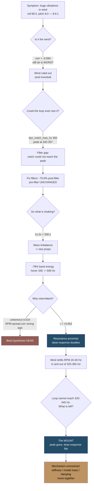
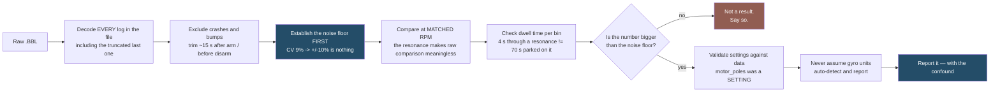

<!--
DRAFT NOTES FOR ANDRIUS — delete this comment block before publishing.

OPEN — YOURS TO DECIDE (not resolved in this draft):

1. HUGO CONFIG — RESOLVED. markup.goldmark.renderer.unsafe = true is already
   set in blog/config/_default/markup.toml, so the Chart.js blocks will render.
   Verified against the repo, no action needed.
2. TITLE / DATE. Still yours to confirm. series is now [FPV Builds] to match the
   other FPV posts, and thumbnail is set to meteor75-pro-vs-pro-ii.jpg.
3. LITHUANIAN TERMINOLOGY — needs your review. Five coinages I could not
   validate, all in index.lt.md:
     - "vibracijos gaubtinė"          (vibration envelope)
     - "struktūrinė moda"             (structural mode)
     - "atsako dozė"                  (dose-response)
     - "prisukta masė"                (sprung mass)
     - "struktūrai fiksuota ypatybė"  (structure-fixed feature)
   Betaflight parameter names and metric labels are deliberately left in
   English throughout — that is intentional, not an oversight.

DELIBERATELY LEFT EMPTY — do not fill in:

4. TPU: first indoor log is IN (dose-response slope +6%, i.e. flat). Outdoor
   verification with slow RPM sweeps still pending - may or may not be added.
5. EXIF - DONE. All three photos verified at 0 EXIF tags before committing.

RESOLVED — no action needed (kept for audit trail):

6. chart2_resonance_curve_props: the old/new props swap and the one-step x
   offset were fixed at source in snake-chart-data.json and verified against raw
   analyser output. Chart rebuilt from the corrected data. Prose was already
   correct (built from the section-4 table) so it did not change. The sweep is
   now cut at 425 Hz because the 450/475 Hz bins carry only 1.1-3.0 s dwell.
7. chart13_cog_rotation: rotation (+9.5% -> +3.6%) and foam (+3.4% -> +2.0%) are
   now stated as two separate interventions in both language versions, and the
   series labels name the specific flights (15:53 outdoor / 20:40). The +12.5%
   vs "+6.7% to +11.1%" scope difference is explained inline.
8. chart8: single-peak framing dropped. Now stated as a pronounced peak at
   48.8 deg/s before, essentially flat 25-30 deg/s after, no amplification peak
   left. The -43% figure and the 28.0 after-peak value are gone from the post.
   NOTE: chart8's annotation inside snake-chart-data.json still reads
   "Peak 48.8 -> 28.0 deg/s (-43%)". The post no longer uses it, but that JSON
   line will be inconsistent with the post if you regenerate figures from it.
-->

<script src="https://cdn.jsdelivr.net/npm/chart.js@4"></script>
<script>
window.SNAKE_PALETTE = ['#244d68', '#915d52', '#bd9361', '#95b0c1'];
function snakeChart(id, type, data, yLabel, xLabel) {
  data.datasets.forEach(function (ds, i) {
    var c = window.SNAKE_PALETTE[i % 4];
    ds.borderColor = c;
    ds.backgroundColor = (type === 'line') ? 'transparent' : c;
    ds.borderWidth = (type === 'line') ? 2.5 : 0;
    ds.pointRadius = (type === 'line') ? 3 : 0;
    ds.tension = 0.25;
    ds.spanGaps = true;
  });
  new Chart(document.getElementById(id), {
    type: type,
    data: data,
    options: {
      responsive: true,
      maintainAspectRatio: false,
      interaction: { mode: 'index', intersect: false },
      plugins: {
        legend: { display: data.datasets.length > 1, position: 'bottom' }
      },
      scales: {
        y: {
          title: { display: true, text: yLabel },
          grid: { color: 'rgba(36,77,104,0.15)' }
        },
        x: {
          title: { display: !!xLabel, text: xLabel || '' },
          grid: { display: false }
        }
      }
    }
  });
}
</script>

Craft name **Snake**. It started life as a Meteor75 Pro, and it is now a Meteor75 Pro II —
frame and canopy ordered off AliExpress, everything expensive carried straight over. Same
**Matrix 1S 3-in-1 FC**. Same **narrow-FOV DJI O4** air unit. New shell, old guts, and by the
time I was done, 169 flights and 15,574 seconds of logs to argue with.

The plan was a fifteen-minute swap. What I actually got was a week of chasing a resonance,
three retractions, one clean hypothesis that was completely wrong, one tuning change I had to
revert, and a metric that lied to me for several rounds before I noticed.

The short version, which is also the thesis of this whole post: **the canopy that fixed my
jello is the canopy the flight controller now has to fight.** Decoupling the camera from the
frame is good. Decoupling it *softly* is not free.

## The build, and the mismatch that matters



- **Frame + canopy:** Meteor75 Pro II, AliExpress parts
- **Guts:** carried over from the Meteor75 Pro — same Matrix 1S 3-in-1 FC, same narrow-FOV
  DJI O4 air unit
- FC target `BETAFPVG473` (STM32G473), manufacturer id `BEFH`
- Betaflight **4.5.1** (Dec 11 2025, `77d01ba3b`)
- 1S LiHV — `vbat_max_cell_voltage = 435`, `auto_profile_cell_count = 1`
- DSHOT300, `dshot_bidir = ON`, `motor_poles = 12`
- 3.2 kHz gyro and PID loop — `looptime 312`, `pid_process_denom 1`
- `blackbox_sample_rate = 1/2` → 1582 Hz logging, **791 Hz Nyquist**
- Digital VTX over MSP DisplayPort on serial 3
- `yaw_motors_reversed = ON` (props out)

Here is the part that turned out to be central, and I did not think about it at all when I
was clicking "buy": **the Pro II canopy was redesigned around the O4 Wide.** Snake runs the
narrow-FOV O4. So the canopy is not carrying the mass it was drawn around, and the FC/canopy
interface is not the pairing the frame was designed for. I was building a hybrid and calling
it an upgrade.

Two things I checked rather than assumed, before believing anything downstream:

**`motor_poles = 12` is a setting, not a measurement.** So I validated it against the data:
measured dominant roll frequency divided by computed 1× came to **1.008–1.020**. If the
physical pole count were 14, that ratio would have landed around 1.17. The RPM filter was
targeting the right frequency all along.

**My PID sliders were doing nothing.** `simplified_pids_mode = OFF` in profile 0, which means
the configured slider values (master multiplier 120, d_gain 120, pi_gain 120) were
**inactive**. Profile 0 was flying stock Betaflight 4.5 defaults the whole time: roll
45/80/40, pitch 47/84/46, yaw 45/80/0. Worth knowing before you spend an evening theorising
about your tune.

## The symptom

> "Flying in the yard with some wind, I got huge vibrations."

First log, old props. Roll axis pre-filter HF energy (80–780 Hz) came in at **68.5 °/s** RMS.
Pitch: **8.0**. Yaw: **11.4**. That is an **8.6 : 1 roll-to-pitch ratio**, which is not a
noise problem, that is a single-axis mechanical problem wearing a noise costume.

Post-filter, the same axis read **1.38 °/s**. The RPM filter was carrying roughly **34 dB**
and politely hiding a large mechanical fault from the flight controller. The quad flew fine.
The gyro was screaming.

The harmonic structure told me what kind of fault: the **1× to 2× ratio was around 200:1**
(53:1 to 212:1 depending on the motor). That is textbook mass imbalance. A bent blade or
genuine aerodynamic loading puts real energy into the higher harmonics; this put essentially
none.

*Caveat I wrote down at the time and am not going to quietly drop:* at roughly 341 Hz the 3rd
harmonic lands at 1023 Hz, which is above the **791 Hz Nyquist** of this log. Blade-pass
content could not be assessed at all. The 2× at ~682 Hz was in range and clean, and that is
the diagnostic one, so the conclusion holds — but it holds on 2×, not on a full harmonic
picture.

## The hook: more wind made it better

Everyone's first instinct, including mine, was that this was a wind problem. It said so right
there in the complaint. So I compared sections at **matched prop frequency** (330–350 Hz), to
hold the resonance constant and let only the air change.

<div style="height:360px"><canvas id="c1"></canvas></div>
<script>
snakeChart('c1', 'bar',
  { labels: ['outdoor gustiest\n(LF>18)', 'outdoor, all', 'outdoor calmest', 'indoor clean', 'indoor calmest air'],
    datasets: [{ label: 'roll HF RMS', data: [54.9, 63.1, 67.7, 78.1, 80.9] }] },
  'roll pre-filter HF RMS (deg/s)');
</script>

| section | roll HF (°/s) | turbulence | duration |
|---|---|---|---|
| outdoor, gustiest (LF>18) | **54.9** | 30.7 | 7.3 s |
| outdoor, all | 63.1 | 12.5 | 35.1 s |
| outdoor, calmest | 67.7 | 5.0 | 18.8 s |
| **indoor, clean** | 78.1 | 11.8 | 12.0 s |
| **indoor, calmest air** | **80.9** | 4.2 | 5.9 s |

`corr(turbulence, vibration)` at fixed RPM = **−0.584**.

More wind, *less* vibration. Dead-still indoor air was the **worst** case I could produce.

I stared at that for a while. It is the single most useful thing in the whole exercise,
because it kills the obvious explanation on the first day instead of the fifth, and because
the reason it happens turns out to *be* the mechanism. Hold that thought — it takes another
few sections to earn.

## Two things my config was getting wrong

Before chasing physics, I read my own filter settings properly, which I should have done
first:

```
dyn_notch_count   = 1     (default 3)
dyn_notch_q       = 400   (very narrow)
dyn_notch_min_hz  = 150
dyn_notch_max_hz  = 350   <-- BELOW the measured 342-357 Hz peak
gyro_lpf1_static_hz   = 0 (LPF1 fully disabled)
gyro_lpf1_dyn_min_hz  = 0
```

One notch, made needle-thin by `q = 400`, with a ceiling **below the actual peak**. The one
filter aimed at this problem physically could not reach it. LPF1 was switched off entirely.

The fix:

```
set dyn_notch_count = 3
set dyn_notch_q = 300
set dyn_notch_min_hz = 100
set dyn_notch_max_hz = 600
set gyro_lpf1_dyn_min_hz = 250
```

Measured at matched prop RPM:

<div style="height:340px"><canvas id="c4"></canvas></div>
<script>
snakeChart('c4', 'bar',
  { labels: ['post-filter roll HF', 'D-term roll RMS', 'D-term pitch RMS', 'motor jitter'],
    datasets: [{ label: 'change (%)', data: [-70.6, -51.0, -49.0, -42.0] }] },
  'change (%)');
</script>

| metric | before | after | change |
|---|---|---|---|
| post-filter roll HF RMS | 1.71 | 0.58 | **−70.6%** |
| total attenuation | 32.8 dB | 43.6 dB | +10.8 dB |
| D-term roll RMS | 6.7 | 3.3 | −51% |
| D-term pitch RMS | 4.3 | 2.2 | −49% |
| motor output jitter | 1.37 | 0.80 | **−42%** |

Pre-filter was unchanged, which is exactly right and worth saying out loud because it is the
thing people expect filters to do and they never do it: **filters protect the loop, they do
not fix the airframe.** The quad was shaking just as hard afterwards. The flight controller
simply stopped reacting to it.

## The measurement bar — the number I should have established first

Everything after this point depends on one boring question: how big does a change have to be
before I am allowed to call it real?

So I measured the scatter of pre-filter roll HF RMS *within a single flight*, at **fixed**
RPM, and treated that as my noise floor:

```
CV = 9.0%,  max/min = 1.38   (n = 21 windows of 3 s)
corr with pack voltage      = +0.04
corr with time/temperature  = -0.05
```

**Any change smaller than about ±10% is indistinguishable from noise.** Not "probably noise" —
indistinguishable. It is not caused by the pack sagging and it is not thermal drift; both
correlations are flat. It is just how much this measurement wanders when nothing changes.

This one number killed several conclusions I wanted to keep later in the week. If you take one
thing from this post and it is not about whoops at all, take this: establish the noise floor
before you believe any result, including — especially — a result you like.

## Props: the first real mechanical win

New props changed three things at once, which is bad experimental hygiene but a very good
evening:

- RPM-per-output spread across the four motors collapsed from **9.2 to 4.4 percentage points**
- 1× amplitudes evened out — m1 108.7 → 56.7 °/s, m4 107.1 → 56.8
- hover prop frequency dropped **330 → 308 Hz**

Outdoor, full RPM sweep, same airframe, so what is changing here is the *forcing*:

<div style="height:360px"><canvas id="c2"></canvas></div>
<script>
snakeChart('c2', 'line',
  { labels: [275, 300, 325, 350, 375, 400, 425],
    datasets: [
      { label: 'old props', data: [42, 55, 62, 55, 43, 32, 25] },
      { label: 'new props', data: [42, 43, 34, 24, 25, 22, 15] }
    ] },
  'roll pre-filter HF RMS (deg/s)', 'prop 1x frequency (Hz)');
</script>

| prop Hz | 275 | 300 | 325 | 350 | 375 | 400 | 425 |
|---|---|---|---|---|---|---|---|
| old props | 42 | 55 | **62** | 55 | 43 | 32 | 25 |
| new props | 42 | 43 | **34** | 24 | 25 | 22 | 15 |

*The sweep is cut at 425 Hz on purpose. The 450 and 475 Hz bins exist in the data but carry
1.1–3.0 s of dwell against 32–53 s in the bins that matter, and a 4 s excursion through a
resonance cannot build the same amplitude as 50 s parked on it. Plotting those bins at equal
weight would make the tail look like a result. Every bin shown clears 4 s on both flights.*

−45% at the peak, −56% at 350–375 Hz. Fixed-band energy across 325–365 Hz went
**1185 → 263 — a 78% cut.**

Note where the two curves start: at 275 Hz they are **identical at 42 °/s**. Below the
resonance the props make no measurable difference at all. Everything the new props bought,
they bought inside the band — which is the first hint that this was never really a
prop-balance story.

At this point I thought I had solved it with a set of props and a notch config. I had not. I
had not even correctly described what the problem *was*.

## The mechanism — and a clean hypothesis that was wrong

The pilot observation that cracked it was one I nearly ignored: *"the shaking is not always
present, only in some orientations relative to wind."*

Intermittent. Orientation-dependent. So my first idea was **beat frequencies**. Four motors
running at 343 / 313 / 337 / 332 Hz predict beats at 5.2, 6.1, 11.3, 19.7, 24.9 and 31.0 Hz —
right in the band where I could see the airframe moving. Clean theory. Testable. Satisfying.

Wrong:

```
coherence(beat envelope, visible 8-45 Hz motion) = 0.019 mean, 0.063 max
corr(RPM spread, envelope)                       = -0.287    (wrong direction)
measured modulation 1.9 Hz vs nearest predicted pair 5.2 Hz
```

Coherence of 0.019 is not a weak signal, it is *no* signal. And the RPM-spread correlation
came out **negative** — the opposite of what a beat model requires. Dead in one afternoon.

What actually predicted the shake was a much duller idea:

| model | correlation with vibration envelope |
|---|---|
| **resonance proximity (Lorentzian @ 343 Hz)** | **+0.652** |
| number of motors inside 325–365 Hz | +0.583 |
| mean prop frequency | +0.308 |
| motor RPM spread | −0.287 |
| throttle | +0.182 |

And then the dose-response, which is about as textbook as field data ever gets:

<div style="height:360px"><canvas id="c3"></canvas></div>
<script>
snakeChart('c3', 'bar',
  { labels: ['0', '1', '2', '3', '4'],
    datasets: [{ label: 'vibration envelope', data: [55.46, 78.38, 95.41, 108.71, 111.64] }] },
  'vibration envelope (deg/s)', 'motors inside 325-365 Hz');
</script>

| motors inside 325–365 Hz | envelope | % of flight |
|---|---|---|
| 0 | **55 °/s** | 21% |
| 1 | 78 | 13% |
| 2 | 95 | 17% |
| 3 | 109 | 38% |
| 4 | **112 °/s** | 11% |

**It doubles.** Count how many props are sitting inside the resonance window and you can
predict the shake.

That is the whole explanation for the intermittency, the orientation dependence, *and* the
backwards wind correlation. Wind loading redistributes thrust between the corners, which
shifts individual motor RPMs by 20–40 Hz, sliding them in and out of the window. Gusts
**scatter** the props off the resonance. Indoors, the quad hovers rock-steady and parks all
four of them on it, continuously, for as long as you let it. Still air is the worst case
because still air is the most *precise*.

### Why the props helped, restated properly

| | hover | margin to 325 Hz | ≥1 motor in band | ≥3 in band | envelope |
|---|---|---|---|---|---|
| old props, indoor | 328 Hz | **−3** | 79% | 49% | 91.7 |
| new props, indoor | 307 Hz | **+18** | 25% | 4% | 68.8 |
| new props, outdoor | 363 Hz | −38 (above) | 63% | 6% | 35.4 |

The old props hovered **dead inside** the resonance band — three hertz of margin. Less
imbalance was the smaller part of the win. Moving the operating point off the resonance was
the larger part. I had accidentally done the right thing for a reason I did not understand.

<div class="mermaid-wrap">



</div>

## Two separate problems, not one — and why this is the Gyroflow argument

This distinction took most of the week to nail down, and it is the technical spine of
everything I care about here, because it decides what software can and cannot save you from.

**(a) The ~320–345 Hz structural mode.** Roll-dominant, 8:1. This is the jello source. It
sits **an order of magnitude above the control loop's usable bandwidth of 20–40 Hz.** No PID
change, no TPA setting, no filter tweak can touch it. Filters stop it reaching the loop; they
cannot stop the airframe shaking. And **neither Gyroflow nor RockSteady can remove jello** —
it is intra-frame distortion, the damage is inside the rolling shutter before any
stabiliser sees the image.

**(b) Broadband 10–25 Hz turbulence following.** Measured **Q ≈ 1.9–2.2**. Peak 15.8–17.8 Hz
on roll, 10.6–12.9 Hz on pitch, amplitude 4.4–5.3 °/s. A control-loop limit cycle would show
Q = 10–100; Q ≈ 2 is a lightly-damped airframe genuinely being pushed around by turbulent air.
**This is the band Gyroflow corrects well.**

<div style="height:340px"><canvas id="c11"></canvas></div>
<script>
snakeChart('c11', 'bar',
  { labels: ['wind shake, roll', 'wind shake, pitch', '48.5 Hz mode'],
    datasets: [{ label: 'Q factor', data: [2.2, 2.2, 83.7] }] },
  'Q factor');
</script>

For completeness: there *is* a genuinely sharp mode in there, at 48.5 Hz with **Q = 83.7**.
Its amplitude is **0.24 °/s**, i.e. completely irrelevant. High Q is not the same as
important, and this is the example I will point at next time I am tempted by a tall thin peak.

Where does the motion you can actually *see* live?

<div style="height:380px"><canvas id="c10"></canvas></div>
<script>
snakeChart('c10', 'bar',
  { labels: ['1-5 Hz', '5-10 Hz', '10-20 Hz', '200-790 Hz'],
    datasets: [
      { label: 'old props, old filters', data: [3.84, 2.66, 1.45, 1.68] },
      { label: 'old props, new filters', data: [1.92, 1.58, 1.05, 0.38] },
      { label: 'new props, new filters', data: [1.29, 0.93, 0.91, 0.26] }
    ] },
  'roll gyro RMS, post-filter (deg/s)', 'band');
</script>

| | 1–5 Hz | 5–10 Hz | 10–20 Hz | 200–790 Hz |
|---|---|---|---|---|
| old props, old filters | 3.84 | 2.66 | 1.45 | 1.68 |
| old props, new filters | 1.92 | 1.58 | 1.05 | 0.38 |
| new props, new filters | **1.29** | **0.93** | **0.91** | **0.26** |

Filters alone took the high band 1.68 → 0.38, props took it further. Total −66% at 1–5 Hz,
−85% up high. And note the ratio: roughly **five times more energy sits in the
Gyroflow-correctable band than in the jello band.** Which is exactly why the footage looked
acceptable while the gyro was screaming — the visible motion was mostly the kind software can
undo.

That asymmetry is the whole reason the decoupling trade-off matters. Low-frequency shake is
recoverable in post. Jello is not recoverable by anything. So a change that trades *less
jello* for *more low-frequency shake* is a good trade, even when the gyro logs look worse.

## A tuning experiment that failed and got reverted

I had measured that the D-term lagged the error by **16.4 ms** in the 8–45 Hz band — most of a
half-cycle at 17 Hz — so raising `dterm_lpf1_static_hz` from 75 to 90 looked like free money.

Matched indoor hover, same props, 307 vs 309 Hz:

<div style="height:340px"><canvas id="c5"></canvas></div>
<script>
snakeChart('c5', 'bar',
  { labels: ['post-filter noise', 'D-term RMS', 'D-term HF noise', 'motor jitter', '14 Hz oscillation'],
    datasets: [{ label: 'change (%)', data: [171, 242, 283, 370, 168] }] },
  'change (%)');
</script>

| | lpf1 = 75 | lpf1 = 90 | change |
|---|---|---|---|
| post-filter roll noise | 0.34 | 0.92 | **+171%** |
| D-term RMS | 2.06 | 7.04 | **+242%** |
| D-term HF noise | 1.06 | 4.06 | **+283%** |
| **motor jitter** | 0.555 | 2.606 | **+370%** |
| 14 Hz roll oscillation | 1.01 | 2.71 | **+168%** |

It bought **1.9 ms** of lag reduction. For 370% more motor jitter. The spectrum was worse at
*every* frequency from 2 to 400 Hz. Reverted, and I am not going back.

Airmode went on in the same session (confirmed in the log: feature mask delta exactly
4194304) and stayed — 3.3 s below 1250 throttle with minimum motor output 201, no authority
dropout.

**Confound, recorded honestly:** two variables changed at once, so the 14 Hz growth cannot be
cleanly attributed between the filter and airmode. The other four rows are large enough to
survive that, but the 14 Hz number is not clean and I am not going to pretend otherwise.

## Why I could not measure my own step response for most of the week

I tried repeatedly to get a real step response out of these logs. Repeatedly blocked by the
input:

```
setpoint energy: roll 95% below 1.7 Hz | pitch 1.4 Hz | yaw 1.5 Hz
hard stick reversals: 0
slew events >4000 deg/s^2: 3
```

A quad's loop lives at 20–40 Hz. Smooth continuous rolls contain no high-frequency content, so
the step response is **input-bandwidth limited, not quad-limited**. The "173 ms rise time" I
computed early on was a faithful measurement — of my sticks.

One flight with 39 hard reversals and 26 sharp slews finally gave me a real number: **roll
overshoot +10.4% at 133 ms, rise(90%) 77.7 ms, 50% delay 32.9 ms.** With n = 6 steps, because
the log ended in a 9.6 G crash. Indicative. Not settled.

### And a bug in my own analyser

My first report proudly announced "overshoot 0.0%" on all three axes. All three. Exactly zero.

The step-response function normalised each response by its **peak**, which pins overshoot at
exactly zero every single time, by construction. Fixed to normalise by steady state. If a
metric comes out suspiciously clean on every axis at once, the metric is broken — that is not
cynicism, that is just what a bug looks like from the outside.

## The bad motor that turned out to be air

For most of the week, one motor consistently looked guilty:

```
m2 RPM-per-output:  -4.2% to -6.1%    (worst in EVERY log)
m1 hover output:    +6.7% to +11.1%   (works hardest, and the ONLY motor clipping)
```

m1 clipped 0.789% of frames while m2 and m3 sat at exactly 0.000%, and the shake was
**1.59× worse** when motors were near the ceiling. I had a draggy bearing on m2 and an
overworked m1. Two hardware diagnoses, both confident.

Then I rotated the canopy 180° and the ordering **reversed**:

<div style="height:340px"><canvas id="c12"></canvas></div>
<script>
snakeChart('c12', 'bar',
  { labels: ['m1', 'm2', 'm3', 'm4'],
    datasets: [
      { label: 'before canopy rotation', data: [-0.1, -5.3, 5.0, 0.4] },
      { label: 'after canopy rotation', data: [3.1, 5.0, -3.4, -4.7] }
    ] },
  'RPM per unit output, deviation from mean (%)', 'motor');
</script>

```
before rotation:  m2 = -4.2% to -6.1%   (worst)
after rotation:   m2 = +4.3% to +8.0%   (freest)
```

A motor defect cannot flip sign when you rotate a canopy. **The pattern is aerodynamic — the
canopy shadows whichever props sit under it.** Both diagnoses retracted. It was installation,
not hardware, and the only reason I found out is that I changed something unrelated and kept
measuring anyway.

The rotation did do real work on CoG:

<div style="height:340px"><canvas id="c13"></canvas></div>
<script>
snakeChart('c13', 'bar',
  { labels: ['m1', 'm2', 'm3', 'm4'],
    datasets: [
      { label: 'before rotation (15:53 outdoor)', data: [12.5, -5.8, -3.2, -3.4] },
      { label: 'after rotation (20:40)', data: [-3.3, -13.8, 11.8, 5.3] }
    ] },
  'hover output, deviation from mean (%)', 'motor');
</script>

Hardest-working motor moved from m1 to m3/m4, and m1's clipping went **0.812% → 0.000%**.
**The rotation alone took the front/rear pair split from +9.5% to +3.6%.**

Two notes on scope, because these numbers are easy to mis-stack:

**The +12.5% on m1 in the chart is the 15:53 outdoor flight specifically.** The
`+6.7% to +11.1%` range I quoted above spans the 14:26, 15:20 and 16:28 logs. Both are correct
for their own scope — one is a single flight, the other is a range across three. Neither
supersedes the other.

**The rotation and the foam are separate interventions and their CoG results do not chain.**
The rotation moved the pair split +9.5% → +3.6%. The foam, later and independently, moved it
+3.4% → +2.0% (that row appears in the mount table further down). Reading those as one
continuous improvement from +9.5% to +2.0% would be wrong — different sessions, different
changes, and the +3.6% and +3.4% start points are not the same measurement.

### A battery weighed from a log file

Small side-quest, included because I enjoyed it. Two packs flown back to back. Hover RPM is a
valid mass proxy at fixed prop and config:

```
log1: airborne 70 s, hover 330 Hz, 966 indicated charge
log2: airborne 95 s, hover 340 Hz, 1585 indicated charge
hover RPM ratio 1.0612 -> mass ratio 1.126 -> log2 is 12.6% heavier
```

Identified purely from the log, with no input from me about which pack was which.

There is a practical reason the canopy went round the other way, and it is the packs. Rotating
it gives better mass distribution with the **LAVA 2 680 mAh** batteries I actually fly, which
is why the front/rear split halving was a design intent rather than a happy accident. What
those packs buy in the air: **about 3 minutes if I am ripping, 5–6 minutes cruising.** Worth
holding next to the heavy-versus-light thread above — the heavier pack bought 36% more airborne
time and 4× more motor clipping, and neither of those is free.

## The mount: the biggest single win

The loop cannot reach 320–345 Hz. The props were already good. That leaves the structure.

So: stiff foam inserted between FC and VTX, stretching the gummy-ball mounts and stiffening
the canopy fixation. Same pack (hover 345 vs 347 Hz), **zero config changes.** A clean
mechanical A/B, which is rarer than it should be in this hobby.

The dose-response that had defined the entire problem **collapsed**:

<div style="height:360px"><canvas id="c6"></canvas></div>
<script>
snakeChart('c6', 'bar',
  { labels: ['0', '2', '4'],
    datasets: [
      { label: 'before foam', data: [35, 52, 57] },
      { label: 'after foam', data: [29, 33, 33] }
    ] },
  'vibration envelope (deg/s)', 'motors inside 325-365 Hz');
</script>

| | 0 motors in band | 2 in band | 4 in band |
|---|---|---|---|
| before | 35 | 52 | **57** |
| **after** | **29** | **33** | **33** |

Vibration used to climb 45–63% as motors entered the band. Now it is flat. Motors sitting in
the resonance band **stopped mattering**, which is a much better outcome than making them
smaller.

The resonance curve says the same thing:

<div style="height:380px"><canvas id="c8"></canvas></div>
<script>
snakeChart('c8', 'line',
  { labels: [250, 275, 300, 325, 350, 375, 400, 425, 450, 475, 500],
    datasets: [
      { label: 'before foam (heavy pack)', data: [35, 43, 49, 39, 32, 26, 17, 15, 15, 9, 5] },
      { label: 'after foam (heavy pack)', data: [30, 27, 26, 28, 25, 25, 27, 27, 22, 15, 12] }
    ] },
  'roll pre-filter HF RMS (deg/s)', 'mean prop 1x frequency (Hz)');
</script>

| metric | before | after | change |
|---|---|---|---|
| resonance-curve shape | **pronounced peak at 48.8 °/s** | **essentially flat, 25–30 °/s** | peak gone |
| pre-filter roll RMS | 37.0 | 25.9 | **−30%** |
| post-filter roll | 0.65 | 0.50 | −23% |
| vibration envelope | 40.6 | 30.8 | −24% |
| motor clipping | m4 1.94%, m3 0.33% | **all 0.00%** | — |
| front/rear pair split (foam only) | +3.4% | **+2.0%** | best recorded |

The result here is **the disappearance of the peak, not a reduction in its height** — and that
distinction is deliberate. Before the foam there is an unmistakable amplification peak at
48.8 °/s. After the foam there is no peak at all: the curve sits between 25 and 30 °/s across
the entire 250–425 Hz sweep and the "maximum" is just wherever the noise happens to land that
run. Quoting a single after-peak number invites a percentage that is really a comparison
between a resonance and a flat line, so I am not going to quote one. The curve stopped having
a shape. That is the finding.

The pair-split row is the **foam** result and is independent of the canopy-rotation result
earlier in the post — same metric, different intervention, different session.

And the energy did not vanish, it moved:

<div style="height:360px"><canvas id="c7"></canvas></div>
<script>
snakeChart('c7', 'bar',
  { labels: ['280-325', '325-365', '365-420', '420-500'],
    datasets: [
      { label: 'before foam', data: [714, 313, 20, 16] },
      { label: 'after foam', data: [181, 135, 104, 77] }
    ] },
  'pre-filter roll energy', 'frequency band (Hz)');
</script>

| band | before | after |
|---|---|---|
| 280–325 Hz | 714 | **181** (−75%) |
| 325–365 Hz | 313 | **135** (−57%) |
| 365–420 Hz | 20 | 104 |
| 420–500 Hz | 16 | 77 |

**Caveat:** throttle p99 was 1751 versus 1968, so part of that zero-clipping result is me
flying less aggressively, not the fix alone. The clipping row is the weakest row in that
table and it should be read as such.

## Three retractions on the mechanism

I first wrote this up as "stiffness, not mass," backed by a hover-RPM mass check (−0.8%), a
mode shift from ~325 Hz to ~395 Hz, and a confident "≈48% stiffer."

All three were wrong or unjustified. I was pushed back on and the pushback was correct.

**1. "Stiffness, not mass" is a false dichotomy.** Coupling two previously-independent bodies
changes effective stiffness, modal mass *and* damping simultaneously. There is no way to
separate them from this data. I framed a question that the experiment could not answer and
then answered it anyway.

**2. The hover-RPM mass test answered the wrong question.** Hover RPM measures **total AUW**.
Coupling the canopy does not change total AUW — it changes **modal mass**, the mass
participating in that particular mode. Using one to dismiss the other is a category error,
and it is the mistake I am least happy about, because it is the kind that feels like rigour
while you are making it. Real measurement, correctly executed, aimed at the wrong quantity.

**3. The mode-frequency numbers were not reliable.** Two implementations of the same
"structure-fixed frequency" detector disagreed badly on identical data: one said 322–329 Hz at
120× dominance, the other 255 Hz at 6×. The cause is visible once you look — with four motors
spread ~30 Hz apart, a 40 Hz RPM slice gets contaminated by whichever motor is slowest, so
"mean RPM" is a poor label for what is in the bin. The 325 → 395 Hz shift and the 48% figure
are both withdrawn.

What I *can* show is a properly controlled comparison: light pack versus heavy pack, foam
absent in both, only the pack swapped.

<div style="height:340px"><canvas id="c14"></canvas></div>
<script>
snakeChart('c14', 'bar',
  { labels: ['light pack', 'heavy pack'],
    datasets: [
      { label: 'hover RPM (forcing)', data: [327, 347] },
      { label: 'structure-fixed feature', data: [302, 255] }
    ] },
  'Hz');
</script>

| | hover (forcing) | structure-fixed feature |
|---|---|---|
| light pack | 327 Hz | **302 Hz** |
| heavy pack | 347 Hz | **255 Hz** |
| change | **+6.1%** | **−15.6%** |

Added sprung mass moved the structural feature **down** while the forcing went **up**.
That is √(k/m) behaving itself.

**What survives, method-independently:** the amplitude results. Those do not depend on
locating the mode at all. The foam produced a large, real reduction — that is not in question.

**The mechanism is unresolved, and I am leaving it that way.** The coupling model — that tying
the canopy to the frame removes a relative degree of freedom, rather than merely shifting a
spring constant — is at least as well supported as the stiffness framing, and better supported
on the mass side. I do not have an experiment that separates them yet.

**Consequence for the fix, which is the practical bit:** gummy balls couple *FC to frame*. The
foam coupled *canopy to FC and frame*. Harder balls alone would not reproduce that mechanism.
Which is why the next experiment stiffens the gummies from the inside rather than just
swapping durometer.

## A metric that lied to me for several rounds

For several rounds I scored the wind-shake verdict as a single global ratio, `shake / wind`,
and got 0.777 → 0.798 → 0.791 → 0.754. Read as: **"−4.4%, within noise, no real
improvement."** I nearly wrote off the foam on that basis.

It was an artifact. **Shake versus wind is not proportional**, so a global ratio depends
entirely on where in the wind range you happened to sample. Bin by instantaneous wind level
instead, and compare only the bins both flights actually sampled:

<div style="height:380px"><canvas id="c9"></canvas></div>
<script>
snakeChart('c9', 'line',
  { labels: [3, 5, 7.5, 11, 16.5],
    datasets: [
      { label: 'original', data: [2.29, 4.47, 6.26, 8.74, 11.48] },
      { label: 'heavy pack, no foam', data: [2.27, 3.89, 5.71, 8.18, 10.99] },
      { label: 'heavy pack, + foam', data: [2.56, 3.66, 4.98, 6.72, 8.52] }
    ] },
  'shake envelope, 8-45 Hz (deg/s)', 'wind / disturbance level, 0.5-15 Hz envelope (deg/s)');
</script>

| | w 2–4 | w 4–6 | w 6–9 | w 9–13 | w 13–20 |
|---|---|---|---|---|---|
| original | 2.29 | 4.47 | 6.26 | 8.74 | 11.48 |
| heavy pack, no foam | 2.27 | 3.89 | 5.71 | 8.18 | 10.99 |
| **heavy pack, + foam** | 2.56 | **3.66** | **4.98** | **6.72** | **8.52** |

```
heavy no foam -> +foam : 6.21 -> 5.29  = -14.8%   (5 shared bins)
original      -> +foam : 6.65 -> 5.29  = -20.4%   (5 shared bins)
```

**About 15% less wind shake at matched wind, not 4%.** And look at the shape: all four flights
agree in the lowest wind bin (2.27–2.56) and diverge only as wind rises. That agreement at the
bottom is the signature of a calibrated measurement — the flights are not offset from each
other, they have genuinely different slopes.

Also audited, and it explains a lot of earlier flailing: every flight so far reached ≥4 s
dwell in only **5 to 7 of 12** RPM bins. That is precisely why the resonance curve kept
coming out unreliable.

## Where it stands — the trade I actually made



So here is the thesis, now that all the measurements are on the table.

**Frame-and-canopy decoupling is good and bad at the same time.**

- The **old** canopy coupled vibration into the camera and its own gyro too heavily. Jello.
  And neither Gyroflow nor RockSteady can remove jello — that is the asymmetry that makes
  this whole trade-off matter.
- The **new** canopy is much better isolated. The camera sees far less high-frequency content.
  What remains visible is low-frequency, which **Gyroflow handles well.**
- But that same decoupling created a soft, lightly-damped path between the FC/canopy assembly
  and the frame. The FC now **fights the canopy** — and in higher winds, it loses. Because
  wind shifts motor RPMs into the resonance window, and the mode gets driven.

Which is the whole reason the **mount**, not the tune, turned out to be the lever. I spent the
first half of the week adjusting a control loop that operates at 20–40 Hz in the hope of
influencing a structural mode at 320–345 Hz. That was never going to work, and it took a
dose-response curve to convince me.

## Stiffening the mount properly — first indoor data

The foam was a quick test, not a solution. It worked, but it is a blanket over the hot part of
the board, so it came out. What replaced it was **two** changes, and I have to be upfront that
I made them in the same session:

1. **The VTX is now mounted directly to the canopy, silicone grommets removed.** They were
   unnecessary, and taking them out deletes a compliant element from the path between the air
   unit's mass and the canopy — the canopy and the VTX are now effectively one body.
2. **TPU filament inserted inside the gummy balls**, raising their stiffness substantially and
   stiffening the FC-to-frame path.

Both are stiffness increases, on two different load paths, at the same time. So whatever the
numbers below show, **I cannot split the credit between them.** That is a self-inflicted
attribution problem and the honest move is to label it rather than pick a winner. A cleaner
experiment would have changed one at a time.



The TPU does two jobs. The second is immediate and needs no measurement: with filament inside
them, the gummies are much less inclined to **separate** — which on a whoop that spends its
life bouncing off door frames is worth having on its own. The **stiffness** effect is the one
that needed a log, and there is now a first one.

This mod is not mine. Rotating the canopy 180° is a suggestion from Oscar Liang, in the
[Improvements You Can Make](https://oscarliang.com/betafpv-meteor75-pro-dji-o4-wide/#Improvements-You-Can-Make)
section of his Pro II review. My only variation is the material: **he uses glue to stop the
gummies separating, I used TPU filament instead.** Glue is a one-way door. Filament comes back
out, so the mount stays serviceable and I can keep testing durometer without destroying parts —
which matters a lot when the whole point of the exercise is A/B testing the mount.

The scoring plan was written down **before** the flight, because the whole point of the last
section is that I no longer trust a comparison I designed after seeing the data. The primary
criterion was the **motors-in-band dose-response** staying flat — that is the thing that
defines whether the resonance is still being amplified.

It stayed flat. 84 s of clean indoor hover, second arm, zero impacts, **`0` config changes** —
so this is purely mechanical, just not a single-variable one:

Here is where it lands on the resonance curve. Only one bin is trustworthy — 79.6 s of dwell at
300–325 Hz, against 0.5–1.8 s everywhere else — so I am plotting **only that point** rather than
drawing a line through noise:

<div style="height:400px"><canvas id="c18"></canvas></div>
<script>
snakeChart('c18', 'line',
  { labels: [250, 275, 300, 325, 350, 375, 400, 425, 450, 475, 500],
    datasets: [
      { label: 'no foam (outdoor)', data: [35, 43, 49, 39, 32, 26, 17, 15, 15, 9, 5] },
      { label: '+ foam (outdoor)', data: [30, 27, 26, 28, 25, 25, 27, 27, 22, 15, 12] },
      { label: 'grommets out + TPU (indoor, 79.6 s dwell)', data: [null, null, 39, null, null, null, null, null, null, null, null], pointRadius: 8, showLine: false }
    ] },
  'roll pre-filter HF RMS (deg/s)', 'mean prop 1x frequency (Hz)');
</script>

39 °/s, between the 49 of no foam and the 26 of foam. Except the two curves were flown outdoors
and that point was flown indoors, which — per the very first finding in this post — is the
**worst** case for this resonance, because steady RPM parks the props on the mode instead of
scattering them off it. So that gap to the foam curve is inflated by an unknown amount, and I am
not going to pretend I know by how much.

Which is exactly why the dose-response, not the curve, was the pre-registered criterion: it
compares the quad against *itself* at different RPMs within one flight, so it does not care
about the weather.

<div style="height:360px"><canvas id="c17"></canvas></div>
<script>
snakeChart('c17', 'bar',
  { labels: ['0 motors', '1 motor', '2 motors', '3 motors', '4 motors'],
    datasets: [
      { label: 'rotated, NO foam', data: [35, 41, 52, 55, 57] },
      { label: 'rotated, + foam', data: [29, 31, 33, 33, 33] },
      { label: 'grommets out + TPU (indoor)', data: [49, 52, 52, null, null] }
    ] },
  'vibration envelope (deg/s)', 'motors inside the 325-365 Hz resonance window');
</script>

Slope across the band, which is the number that matters:

| mount | dose-response slope | verdict |
|---|---|---|
| rotated, no foam | **+66%** | resonance fully amplifying |
| rotated, + foam | +15% | mostly killed |
| **grommets out + TPU in gummies** | **+6%** | **killed** |

Sitting in the resonance window has stopped mattering. That is the criterion, and it passed.

Two more things came out better than the foam flight, both measured on the same log:

- **Post-filter roll noise 0.34 °/s at 41.2 dB attenuation** — the cleanest of the entire
  session, against 0.67 °/s and 31.8 dB for the foam.
- **Motor balance is the flattest I have recorded on this quad:** deviations of −0.1 / −4.2 /
  +2.5 / +1.7 percent, a 6.7-point spread where every earlier flight ran 17–25 points, with a
  front/rear split of +1.7% and **zero clipping**.

### What this log cannot tell me, and I am not going to pretend otherwise

**It was indoors, and I only sampled one RPM bin.** 80 of the 84 clean seconds sat at
300–325 Hz, with one or two seconds either side. I asked myself for 3–4 slow throttle sweeps
and then flew a hover instead, so there is no structural *curve* here — one point is not a
curve, and I cannot locate the mode frequency from a single RPM slice.

**The raw pre-filter number looks worse than the foam and that comparison is not fair.** TPU
indoor reads 39.1 °/s against the foam flight's 26.0. But the foam flight was outdoors in
4.71 °/s of wind and this one is indoors at 1.99 — and one of the earliest findings in this
whole post is that **still air is the worst case**, because steady RPM parks the props on the
mode instead of scattering them off it. Comparing a dead-calm hover against a breezy outdoor
flight loads the dice against the calm one.

The only genuinely like-for-like comparison I have is indoor against indoor: the pre-foam,
pre-rotation indoor flight read **54 °/s** at 300–325 Hz, and this one reads **39** — about
**28% better**. That is real, but it is one bin.

So: the amplification is dead, the noise floor and the motor balance are the best I have
measured, and the ESC side is breathing again. Whether this pair fully matches foam on the
*structural curve* is still open, and it needs an outdoor flight with actual sweeps. That is
tomorrow's job. If the peak comes back, the foam was doing something the TPU is not, and I will
say so here.

## The outdoor verification — and the trade-off flips the other way

121 s clean, outdoors, 5.51 °/s of wind, **zero config changes**, and finally proper RPM
coverage: **8 of 12 bins** at 4 s or more, against 5 for every previous flight. This is the
best dataset of the whole exercise.

The pre-registered criterion held. Amplification is dead, and now confirmed outdoors:

| mount | dose-response slope |
|---|---|
| no foam | +66% |
| + foam | +15% |
| grommets out + TPU, indoor | +6% |
| **grommets out + TPU, outdoor** | **+7%** |

The structure-fixed feature agrees with that. It sits at **363 Hz** with the TPU, against
**368 Hz** with the foam and **255 Hz** with neither. Both stiff solutions land in the same
place — stiffening moved that feature up by about 110 Hz, and it stayed moved.

### But the foam is still the quieter mount

Outdoor against outdoor, at matched prop RPM, which is the fair comparison I have been waiting
two days for:

<div style="height:400px"><canvas id="c19"></canvas></div>
<script>
snakeChart('c19', 'line',
  { labels: [275, 300, 325, 350, 375, 400, 425],
    datasets: [
      { label: 'no foam', data: [43, 49, 39, 32, 26, null, null] },
      { label: '+ foam', data: [27, 26, 28, 25, 25, 27, 27] },
      { label: 'grommets out + TPU', data: [44, 38, 35, 32, 31, 23, 21] }
    ] },
  'roll pre-filter HF RMS (deg/s)', 'mean prop 1x frequency (Hz)');
</script>

Mean across reliable bins: **26.2 °/s for the foam, 33.0 for the TPU** — about 26% worse. And
the curve is less flat: flatness 1.13 for the foam, **2.14** for the TPU, which is worse even
than the 1.85 of no mount treatment at all. There is a peak again at the low end, 44 °/s at
275–300 Hz, falling to 21 by 425.

So the amplification *mechanism* is dead — sitting in the resonance window no longer costs you
anything — but the overall vibration level is up. Those are different statements and both are
true.

### And then the camera got jello back

This is the part I did not predict, and it is the whole thesis of this post arriving from the
opposite direction.

Energy in the 250–450 Hz band, which is what a rolling shutter turns into jello:

| mount | 250–450 Hz RMS |
|---|---|
| no foam | 34.8 |
| **+ foam** | **24.6** |
| **grommets out + TPU** | **31.0** — up 26% |

Low-frequency shake is now largely imperceptible in the air. Jello is back on the footage. And
that combination points straight at which of my two changes did what:

- **TPU in the gummies** stiffened the **FC-to-frame** path. That is the path that governed the
  amplification, and the dose-response says it worked.
- **Removing the VTX grommets** rigidly bonded the **camera to the canopy**. That is the path
  that governed what the camera sees — and it is why jello returned.

I wrote earlier that those grommets "were unnecessary anyway." That was wrong, and the jello is
the evidence. They were not isolating the flight controller, which is why removing them looked
harmless on the gyro. **They were isolating the camera.** Different component, different job,
and I removed it while looking at the wrong instrument.

Which lands exactly where this post started: jello cannot be fixed in post. Neither Gyroflow nor
RockSteady will touch it. Low-frequency shake can. So of the two symptoms I have been trading
against each other all week, **I have just traded the fixable one for the unfixable one** — a
straight downgrade in video terms, even though the gyro trace and the dose-response both
improved.

### One honest caveat about the measurement itself

Stiffening the gyro's own mount changes what the gyro *reports*, not only what the airframe
*does*. A rigidly mounted gyro is coupled more faithfully to the frame's real motion, so part of
the increase in these pre-filter numbers is better coupling to the truth rather than a worse
airframe. I cannot separate those two from a gyro that is itself part of the experiment, and I
am not going to pretend the numbers are pure.

### Next

Put the VTX grommets **back**, keep the TPU in the gummies. The two act on different paths with
different symptoms, so there is no obvious reason the camera's isolator has to be sacrificed to
stiffen the FC mount. If that gives a flat dose-response *and* a quiet jello band, it is the
answer. If jello persists, the grommets were not the whole story and the canopy itself is
transmitting.

## Method notes worth keeping

Practices that repeatedly changed the conclusion — not general advice, things that actually
flipped an answer in this specific week:

<div class="mermaid-wrap">



</div>

- **Decode every log in the file**, and attempt the last one even if it is truncated. Battery
  pulls and crashes routinely truncate the final log, and that is often the interesting one.
- **Exclude crashes and bumps**, and trim ~15 s after arm and before disarm, before drawing
  any conclusion at all.
- **Establish the noise floor first.** CV 9% meant several "improvements" were nothing.
- **Compare at matched RPM**, always. The resonance makes raw comparisons meaningless.
- **A logged value can be a setting, not a measurement.** `motor_poles` was validated against
  the data rather than trusted.
- **Never assume gyro units** — auto-detect and report.
- **Watch dwell time.** A 4 s excursion through a resonance cannot build the same amplitude as
  70 s parked on it, so thin bins mislead you in a direction that looks like a result.

## The echo

The thing I set out to fix was jello, and I fixed it — by buying a frame whose canopy holds
the camera away from the shaking. The thing I did not expect to buy along with it was a soft
spring between the flight controller and the airframe, tuned by accident to a frequency four
motors pass through every time the wind pushes the quad sideways.

Better isolation gave me footage Gyroflow can rescue and a gyro trace that looks like an
emergency. Those are the same change. A week of logs, three retractions and one very
embarrassing analyser bug later, the only lever that moved the structural problem was a piece
of foam — and I still cannot tell you whether it worked by adding stiffness, adding modal
mass, or adding damping.

The props are next. Then the TPU. I will post the numbers either way.

---

*Craft: Snake — Meteor75 Pro II frame and canopy, Matrix 1S 3-in-1 FC, narrow-FOV DJI O4.
Betaflight 4.5.1, 3.2 kHz loop, blackbox at 1582 Hz. All figures measured from blackbox logs;
clean sections only, crashes and bumps excluded. 169 flights / 15,574 s logged at time of
analysis.*
