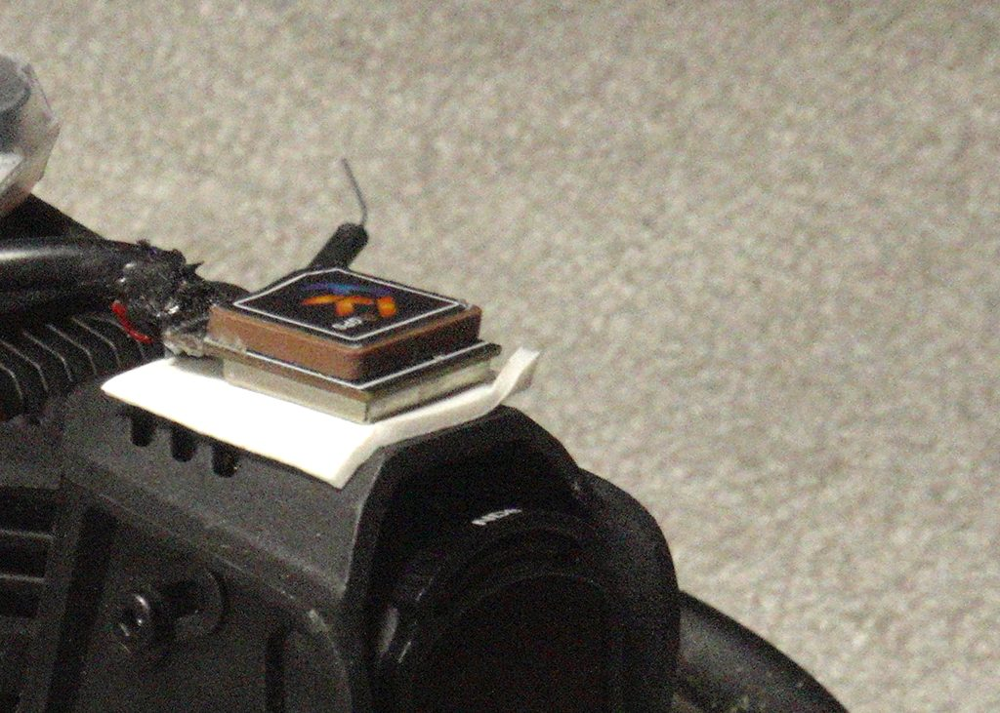

The Pavo20 Pro II is a capable 2.5" whoop — compact, powerful, with a good camera and a surprisingly solid video link even on linear whip antennas. I wanted it as a mountain trip quad: something that fits in a jacket pocket, dives canyons, and has GPS Rescue as a genuine safety net. GPS is not included; I added a module myself, soldered and configured it. That's when the problems started.

In practice the GPS is nearly useless in most flying conditions: I watch the satellite count sit at 2 or 3 while a different quad on the same field, at the same time, locks onto 20+. This is the story of what I found and where I am with it.

---

## The Symptom

First flight of the day. Field is open, sky is clear, no buildings. I power up both quads and wait:

| Quad | Time to first fix | Satellites at fix |
|------|------------------|------------------|
| 1S Matrix 3-in-1 digital build | ~90s | 20–22 |
| Pavo20 Pro II | >5min | 2–4 |

The 1S build also runs an integrated FC/ESC/VTX board — the BetaFPV Matrix 3-in-1, the same board family used in the Meteor whoops. It is not less integrated than the Pavo20. What differs: it runs on a single 18650 cell, so the BEC is stepping down from 3.7V rather than from a multi-cell pack. Different BEC operating point, different harmonic profile, different noise floor in the GPS band.

A whoop chassis has almost no space between an aftermarket GPS module and everything else generating noise.

---

## First Look: Physical Setup

Before touching a spectrum analyser I did the obvious checks.

*The GPS module on top of the O4 Pro camera — the only viable mounting position. The ceramic patch antenna must face the sky with nothing above it. Below the camera sits the integrated FC/ESC/VTX board with its 5V BEC. Even at this elevation above the stack, the BEC's near-field radiation still reaches the LNA.*

The GPS module mounts on top of the O4 Pro camera — the ceramic patch antenna must have a clear, unobstructed view of the sky, so this is the only practical position on the frame. Below the camera is the integrated FC/ESC/VTX board. The GPS LNA is elevated above the stack, but not by much — and the BEC's near-field extends further than the camera height provides.

I added a ferrite bead on the GPS VCC line and 1 µF + 0.1 µF SMD caps in parallel at the module's power pins. This is the standard low-frequency conducted noise fix. It made no measurable difference to satellite count.

---

## Spectrum Analysis — 1S Build vs Pavo20

Time to actually measure the noise floor where GPS operates. GPS L1 band is at **1575.42 MHz**. The constellation signals arriving at the antenna are extraordinarily weak — typically around −130 dBm. Any local interference in the 1.5–1.6 GHz range drowns them out.

I connected a TinySA to a short wire antenna positioned near the stack on each quad, with the quads on battery only — no motors running, no props. To isolate the FC/ESC stack noise from the VTX, I ran the initial Pavo20 measurement with the VTX removed entirely.

*Pavo20 with VTX removed. The TinySA short-wire probe sits next to the FC/ESC stack. No VTX means any noise measured here is purely from the FC, ESC, and GPS module itself.*

*Baseline measurement. TinySA probe in position, everything powered off. Flat noise floor around −105 dBm across the entire 1.2–1.8 GHz span — this is the reference.*

The 1S build measured essentially flat across the same span — noise at or below the baseline floor, nothing worth screenshotting. The Pavo20 tells a different story:

*Pavo20 on battery (no VTX). Noise floor elevated well above the −105 dBm baseline. A sharp spur at approximately 1.34 GHz reaches −89 dBm — 16 dB above baseline. The GPS band at 1575 MHz is already noticeably raised.*

The contrast is stark. The 1S build shows a clean noise floor in the GPS band with only the expected atmospheric background. The Pavo20 shows a raised noise floor across the entire 1.2–1.8 GHz range, with several distinct spurs in the 1.4–1.6 GHz region.

---

## The Switching Harmonic Problem

The dominant noise source here is not what most people assume. The quad was sitting on a bench — no motors spinning, no props, no flight. Motor PWM was never in the picture.

The actual culprit is the **5V BEC** (Battery Eliminator Circuit) on the integrated FC/ESC board. BECs are switching regulators, and on a compact integrated stack like the Pavo20's they switch at a few MHz. That sounds harmless — a few MHz is nowhere near 1575 MHz. But fast-edge switching currents produce harmonics and intermodulation products that radiate across a wide spectrum. In practice the BEC spills noise nastily up to several GHz, and those spurs land at unpredictable frequencies depending on the specific regulator design, PCB layout, and load.

With the GPS module above the camera, which sits above the FC/ESC stack, the LNA is still only a few centimetres from the BEC. At 1.5 GHz the near-field boundary (λ/2π) is roughly 3 cm — the GPS module sits at or within that boundary. The coupling is near-field, not radiated: it is not traveling via the power line, it is coupling directly from the PCB traces into the GPS LNA.

I also tested the VTX as a variable: 5.8 GHz transmitters can produce sub-harmonics and mixing products across a wide frequency range. With the VTX physically removed from the stack, the TinySA noise profile in the GPS band was unchanged. The VTX is not a meaningful contributor. The BEC is the source.

I confirmed this in a different environment — the basement, for lower ambient RF:

*MAX HOLD scan after several minutes accumulation in the basement. Multiple spurs spread through the 1.2–1.6 GHz range. The spurs are not fixed-frequency harmonics — they drift and shift with BEC load and temperature, which is characteristic of switching regulator intermodulation products rather than clean integer harmonics.*

Outside, GPS antenna pointing at open sky, the actual GPS signal context becomes visible:

*Measurement taken outside with clear sky. The GPS L1 signal at 1575.42 MHz produces a broad plateau-like elevation across the GPS band — the entire constellation arriving at once. The aggregate GPS signal sits about 20 dB above the baseline noise floor. The BEC spurs visible on the Pavo20 measurements are 10–15 dB above that same baseline — not as dramatic in absolute level, but enough to degrade the SNR that the LNA needs to recover individual satellite signals.*

The problem isn't that the spurs overpower the aggregate GPS band — it's that they raise the local noise floor. Individual satellite signals, which the GPS module has to pull out separately, don't survive that kind of noise floor elevation. The LNA is fighting an elevated baseline, not a clean sky.

---

## What I Have Tried

### 1. Ferrite Bead and Decoupling Caps on GPS Power

Ferrite bead on the GPS VCC line, plus 1 µF and 0.1 µF SMD caps in parallel at the module's power pins. Effective for conducted noise on the power rail at lower frequencies. No effect on the BEC's radiated RF in the GPS band.

**Result: No improvement in satellite count.**

### 2. Removing the VTX

Removed the VTX entirely from the stack — not just powered down, physically absent. If VTX sub-harmonics at 1450 MHz were the primary source, this should have shown a clear improvement.

**Result: No improvement.** The noise profile on the TinySA was unchanged with the VTX removed. The BEC is the dominant source, not the VTX.

### 3. Shielded Cable and Decoupling on the GPS Module

Replaced the stock GPS wiring with a shielded balanced audio cable (4-conductor with braid shield). The shield connects to FC ground **at the FC end only** — the module end of the shield is left unconnected (floating). Internal conductors carry power (VCC and GND) and data (RX/TX). Added 1 µF and 0.1 µF capacitors in parallel directly on the GPS module's power pins.

**Result: Partial improvement.** Satellite count sometimes reaches 8 instead of the previous maximum of 5. Lock is still unreliable and sometimes fails entirely. Better, but not solved.

---

## Root Cause Assessment

The Pavo20 Pro II's integrated stack design prioritizes compactness over RF isolation. This is a deliberate trade-off for a 2.5" chassis — there is simply no room for the separation that would make a difference.

The interference source is the **5V BEC** — the switching regulator on the integrated FC/ESC board. It runs at a few MHz, but fast switching edges produce harmonics and intermodulation products that spread into the GHz range and land in the GPS band. This was confirmed by removing every other variable: VTX physically removed, motors off, just the stack on battery — the noise profile was unchanged.

Ferrite beads address conducted noise on the power rail only — they have no effect on the BEC's radiated RF. Physical separation is the only lever that actually matters.

The GPS module is a standard nano M10 with a metal shield can over the LNA. That the can doesn't prevent this interference is telling: the BEC coupling is severe enough to penetrate the module's own RF shielding — arriving through the power pins and coupling directly into the antenna aperture at camera-top height. The can is sized and tuned for far-field isolation; near-field coupling at a few centimetres bypasses it.

---

## Where I Am Now

Still searching for a reliable noise isolation solution. Shielded cable + decoupling gave partial improvement; the BEC's near-field clearly extends to the GPS LNA even at camera-top height above the stack. More physical separation is the only remaining lever.

What's left to try:

- **Longer cable to an arm**: routing the GPS module to the front or rear arm maximises the distance from the FC/ESC board. Camera-top height is the starting point — arm-level separation would be a different order of magnitude in near-field attenuation.
- **Active re-radiation (GPS repeater)**: external active GPS antenna with its own LNA, mounted well outside the aircraft envelope, connected via thin coax. Definitively answers whether it's a proximity problem. Total overkill for a whoop, but would confirm the root cause.

---

### While I Was at It: ELRS UFL Antenna Mod

Not GPS-related, but done during the same round of cable work: I added a UFL connector for the ELRS receiver antenna. The stock internal antenna on the Pavo20 stack is functional for close-in flying but nothing more.

With the UFL mod and an external antenna, the link held clean at 1 km. The limiting factor at that range was battery capacity in 15 m/s wind — not the radio link. That mod worked first time and gave an immediate, measurable result. A useful contrast to the GPS work, which has not.

---

## The Safety Net That Actually Works

GPS Rescue was the whole point — mountain quad, fits in a jacket pocket, catches you in a canyon. In practice it has never triggered successfully in a real field scenario.

I've lost the Pavo20 several times because of it. The clearest case: a motor fault mid-flight dropped the quad from somewhere around 500m away. The O4 Pro link stayed live. In the goggles I caught a glimpse of my own shadow on the grass below the falling quad — enough to get my bearings before video cut. Found it with the buzzer. Without the ELRS locator script and a loud buzzer, none of those quads would have come home.

GPS Rescue is still the goal. ELRS locator and buzzer are the fallback that actually works right now.

Setting up failsafe, beeper, and locator properly deserves its own article — probably once there's something better to report on GPS itself. I'll update this one as experiments continue.
