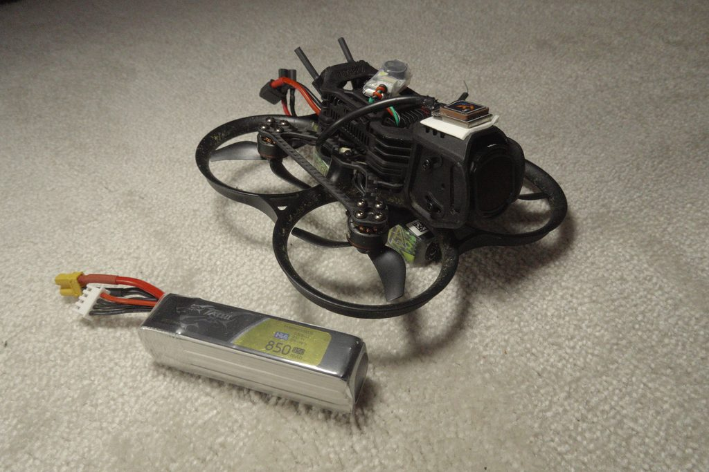
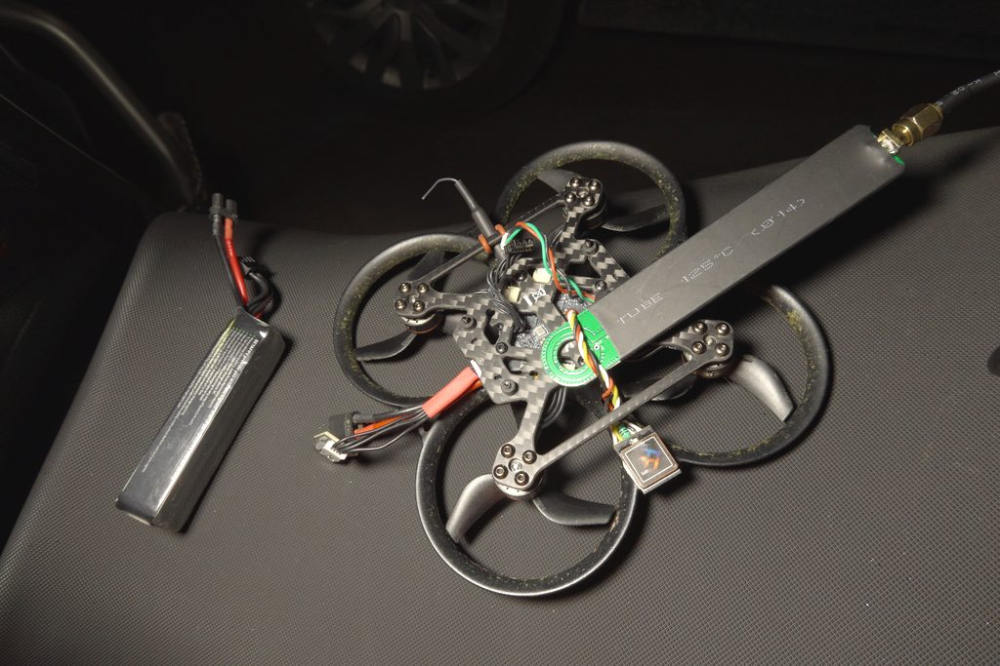
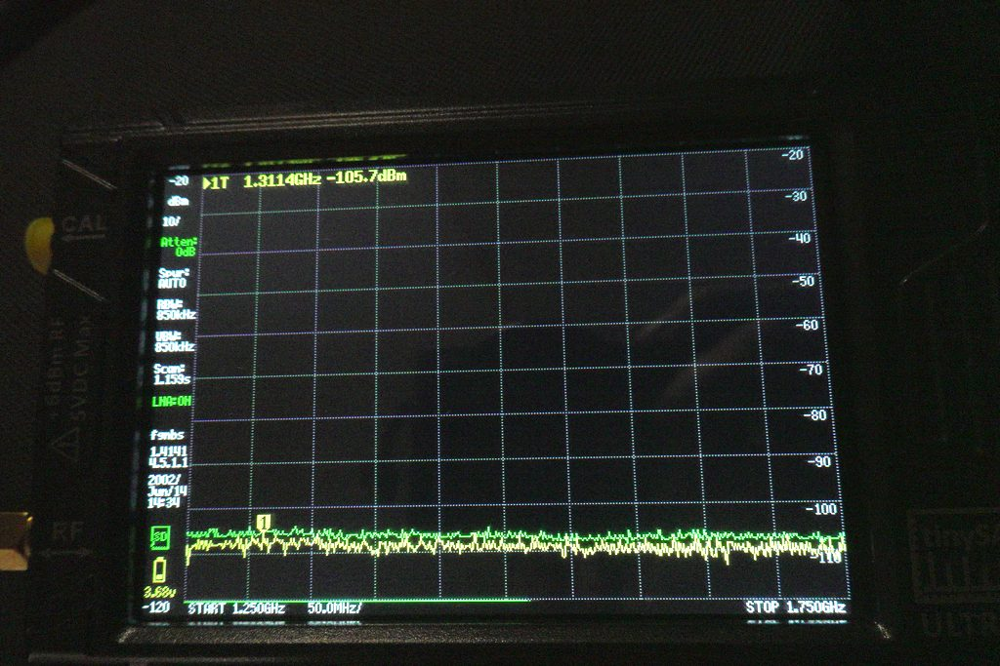
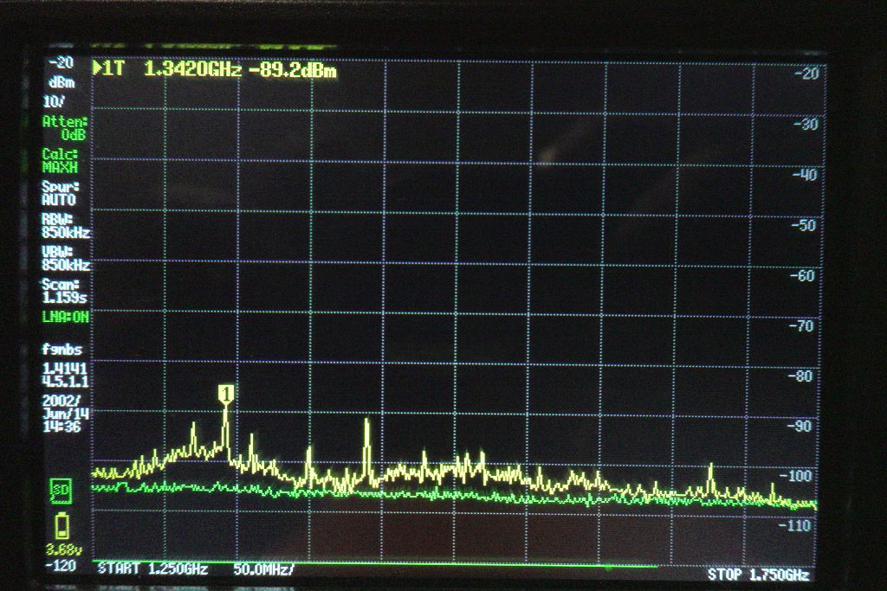
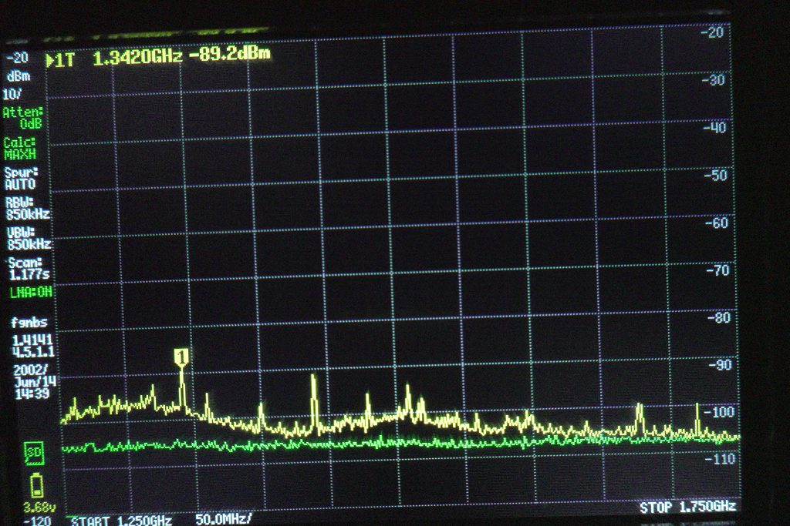
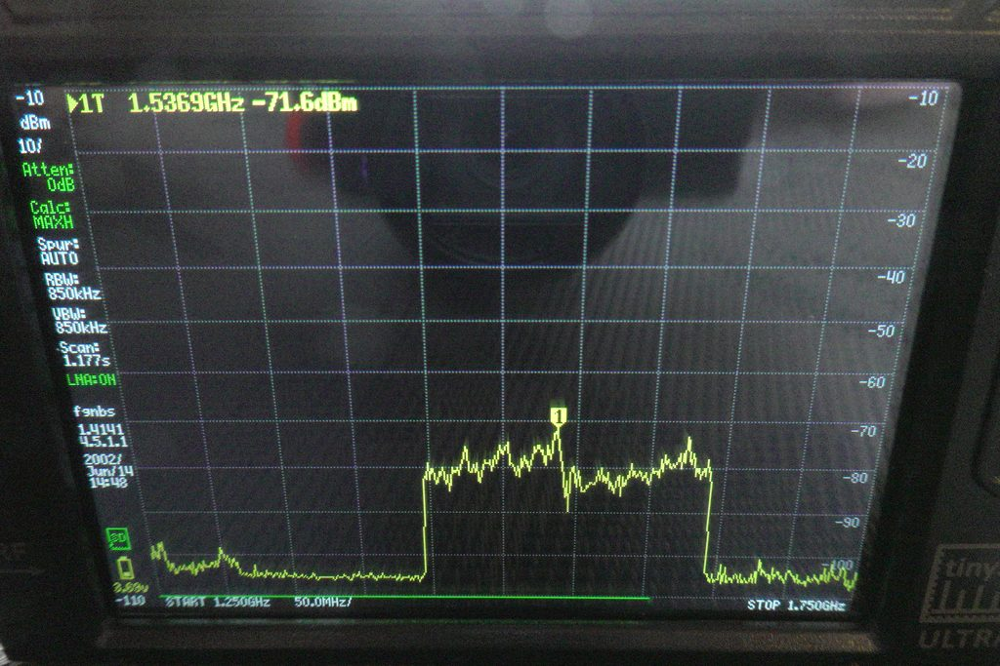

The Pavo20 Pro II is a capable 2.5" whoop with GPS built in. On paper that should mean GPS Rescue on a micro build — a genuine safety net. In practice the GPS is nearly useless in most flying conditions: I watch the satellite count sit at 2 or 3 while a different quad on the same field, at the same time, locks onto 20+. This is the story of what I found and where I am with it.

---

## The Symptom

First flight of the day. Field is open, sky is clear, no buildings. I power up both quads and wait:

| Quad | Time to first fix | Satellites at fix |
|------|------------------|------------------|
| 1S Matrix 3-in-1 digital build | ~90s | 20–22 |
| Pavo20 Pro II | >5min | 2–4 |

The 1S build is smaller. Its electronics are arguably denser. The GPS module is the same generation. The difference is the video system: the 1S build runs a DJI O3 Air Unit on a whoop stack with a camera module, while the Pavo20 runs an integrated stack where the VTX, FC, ESC, and GPS share a single compact board.

A whoop chassis has almost no space between the GPS module and everything else generating noise.

---

## First Look: Physical Setup

Before touching a spectrum analyser I did the obvious checks.

*Current configuration: the GPS module sits on top of the DJI O4 Pro camera, mounted further above the FC/ESC stack. The shielded cable routes down to the FC. Even with this physical separation from the VTX and BEC, GPS acquisition remains unreliable.*

In the stock configuration the GPS antenna sits directly above the ESC/VTX board. The antenna ground plane is the PCB copper — which is also the return path for the 5V BEC switching currents and VTX RF ground. There is no physical shield between the GPS module's LNA and the VTX output stage.

<!-- IMAGE: photo of GPS wiring and filtering attempt — ferrite beads, filtering capacitors on power line -->
*[TODO: Photo — GPS wiring with ferrite beads and power line filtering]*

I added ferrite beads on the GPS power line and a 100µF cap at the module's power pins. This is the standard low-frequency noise fix. It made no measurable difference to satellite count.

---

## Spectrum Analysis — 1S Build vs Pavo20

Time to actually measure the noise floor where GPS operates. GPS L1 band is at **1575.42 MHz**. The constellation signals arriving at the antenna are extraordinarily weak — typically around −130 dBm. Any local interference in the 1.5–1.6 GHz range drowns them out.

I connected a TinySA to a short wire antenna positioned near the stack on each quad, with the quads on battery only — no motors running, no props. To isolate the FC/ESC stack noise from the VTX, I ran the initial Pavo20 measurement with the VTX removed entirely.

*Pavo20 with VTX removed. The TinySA short-wire probe sits next to the FC/ESC stack. No VTX means any noise measured here is purely from the FC, ESC, and GPS module itself.*

*Baseline measurement. TinySA probe in position, everything powered off. Flat noise floor around −105 dBm across the entire 1.2–1.8 GHz span — this is the reference.*

<!-- IMAGE: TinySA screenshot — 1S Matrix 3-in-1 digital build, 1.2GHz–1.8GHz span, showing noise floor -->
*[TODO: TinySA screenshot — 1S digital build, 1.2–1.8 GHz span]*

*Pavo20 on battery (no VTX). Noise floor elevated well above the −105 dBm baseline. A sharp spur at approximately 1.34 GHz reaches −89 dBm — 16 dB above baseline. The GPS band at 1575 MHz is already noticeably raised.*

The contrast is stark. The 1S build shows a clean noise floor in the GPS band with only the expected atmospheric background. The Pavo20 shows a raised noise floor across the entire 1.2–1.8 GHz range, with several distinct spurs in the 1.4–1.6 GHz region.

---

## The Switching Harmonic Problem

The dominant noise source here is not what most people assume. The quad was sitting on a bench — no motors spinning, no props, no flight. Motor PWM was never in the picture.

The actual culprit is the **5V BEC** (Battery Eliminator Circuit) on the integrated FC/ESC board. BECs are switching regulators, and on a compact integrated stack like the Pavo20's they switch at a few MHz. That sounds harmless — a few MHz is nowhere near 1575 MHz. But fast-edge switching currents produce harmonics and intermodulation products that radiate across a wide spectrum. In practice the BEC spills noise nastily up to several GHz, and those spurs land at unpredictable frequencies depending on the specific regulator design, PCB layout, and load.

When the GPS module is sitting 10–15 mm directly above that BEC, on the same ground plane, the coupling is near-field. It is not traveling via the power line — it is radiating directly from the PCB traces into the GPS LNA.

Additionally: **video transmitters** on 5.8 GHz can generate sub-harmonics and mixing products. A 5.8 GHz VTX at 200mW can produce detectable energy at 5800/4 = 1450 MHz — right in the GPS band. The VTX measurement confirmed that removing it did not eliminate the noise, which points firmly back to the BEC as the primary source.

I confirmed this in a different environment — the basement, for lower ambient RF:

*MAX HOLD scan after several minutes accumulation in the basement. Multiple spurs spread through the 1.2–1.6 GHz range. The spurs are not fixed-frequency harmonics — they drift and shift with BEC load and temperature, which is characteristic of switching regulator intermodulation products rather than clean integer harmonics.*

Outside, GPS antenna pointing at open sky, the actual GPS signal context becomes visible:

*Measurement taken outside with clear sky. The GPS L1 signal at 1575.42 MHz produces a broad plateau-like elevation across the GPS band — the entire constellation arriving at once. The aggregate GPS signal sits about 20 dB above the baseline noise floor. The BEC spurs visible on the Pavo20 measurements are 10–15 dB above that same baseline — not as dramatic in absolute level, but enough to degrade the SNR that the LNA needs to recover individual satellite signals.*

The problem isn't that the spurs overpower the aggregate GPS band — it's that they raise the local noise floor. Individual satellite signals, which the GPS module has to pull out separately, don't survive that kind of noise floor elevation. The LNA is fighting an elevated baseline, not a clean sky.

---

## What I Have Tried

### 1. Ferrite Beads on GPS Power

Ferrite beads on the VCC and GND lines to the GPS module. Effective for conducted noise on the power rail at lower frequencies. No effect on the BEC's radiated RF in the GPS band.

**Result: No improvement in satellite count.**

### 2. Removing the VTX

Removed the VTX entirely from the stack — not just powered down, physically absent. If VTX sub-harmonics at 1450 MHz were the primary source, this should have shown a clear improvement.

**Result: No improvement.** The noise profile on the TinySA was unchanged with the VTX removed. The BEC is the dominant source, not the VTX.

### 3. Shielded Cable and Decoupling on the GPS Module

Replaced the stock GPS wiring with a shielded balanced audio cable (4-conductor with braid shield). The shield connects to FC ground **at the FC end only** — the module end of the shield is left unconnected (floating). Internal conductors carry power (VCC and GND) and data (RX/TX). Added 1 µF and 0.1 µF capacitors in parallel directly on the GPS module's power pins.

**Result: Partial improvement.** Satellite count sometimes reaches 8 instead of the previous maximum of 5. Lock is still unreliable and sometimes fails entirely. Better, but not solved.

### 4. GPS Module on Top of the Camera

Moved the GPS module off the stack entirely — it now sits on top of the DJI O4 Pro camera, further from the FC, ESC, BEC, and VTX. The shielded cable routes down to the FC. The goal was to reduce near-field coupling from the BEC by adding physical distance between the GPS LNA and the switching regulator.

**Result: No significant improvement.** The satellite count and lock reliability are essentially unchanged compared to the shielded cable + decoupling result alone. The near-field BEC coupling either still reaches the module at this distance through the cable itself, or the BEC's radiated field extends far enough that the separation available on a 2.5" frame is insufficient.

---

## Root Cause Assessment

The Pavo20 Pro II's integrated stack design prioritizes compactness over RF isolation. This is a deliberate trade-off for a 2.5" chassis — there is simply no room for the separation that would make a difference.

The interference has at least two components:

1. **Radiated RF from the 5V BEC** — the switching regulator on the integrated FC/ESC board, running at a few MHz with harmonics and spurs spreading into the GHz range. This is the dominant source: it was present even with VTX removed and no motors running.
2. **VTX sub-harmonics** — a 5.8 GHz transmitter can produce spurs at 5800/4 = 1450 MHz. Turned out not to be a meaningful contributor: removing the VTX entirely made no measurable difference to the noise profile.

Ferrite beads address conducted noise on the power rail only — they have no effect on the BEC's radiated RF. Physical separation between the GPS module and the BEC is the only approach that actually addresses component 1.

The GPS module used in the Pavo20 is a standard M8N/M10 variant in a miniaturised SMD package — there is no shield can over the RF LNA. This is common on whoop-class GPS builds; the assumption is that flying outdoors provides enough sky view to overcome the degraded SNR.

That assumption holds for some flying environments and fails completely in others.

---

## Where I Am Now

Still searching for a reliable noise isolation solution. Shielded cable + decoupling gave a partial improvement; moving the module to the top of the O4 Pro camera (further from the stack) gave no additional benefit. The BEC's reach in near-field conditions appears to exceed the physical separation available on a 2.5" frame.

What's left to try:

- **Even longer cable**: routing the GPS module on an extended cable to the front or rear arm, maximising the distance from the FC/ESC board. The separation already tried (camera height) is small — arm-level separation might be a different order of magnitude in near-field attenuation.
- **Active re-radiation (GPS repeater)**: external active GPS antenna with its own LNA, mounted well outside the aircraft envelope, connected via thin coax. Definitively answers whether it's a proximity problem. Total overkill for a whoop, but would confirm the root cause.

---

### While I Was at It: ELRS UFL Antenna Mod

Not GPS-related, but done during the same round of cable work: I added a UFL connector for the ELRS receiver antenna. The stock internal antenna on the Pavo20 stack is functional for close-in flying but nothing more.

With the UFL mod and an external antenna, the link held clean at 1 km. The limiting factor at that range was battery capacity in 15 m/s wind — not the radio link. That mod worked first time and gave an immediate, measurable result. A useful contrast to the GPS work, which has not.

---

## Next Steps

I'll update this article as experiments progress. If you've solved this on a similar integrated-stack whoop build, I want to hear about it.
