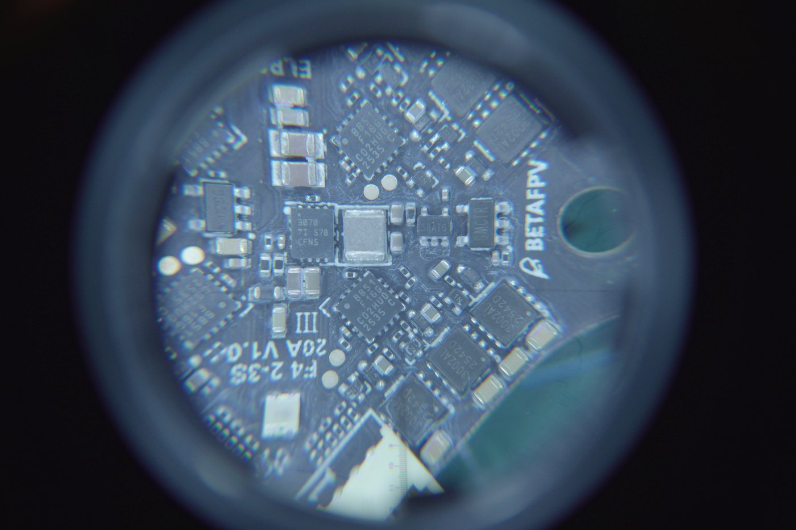
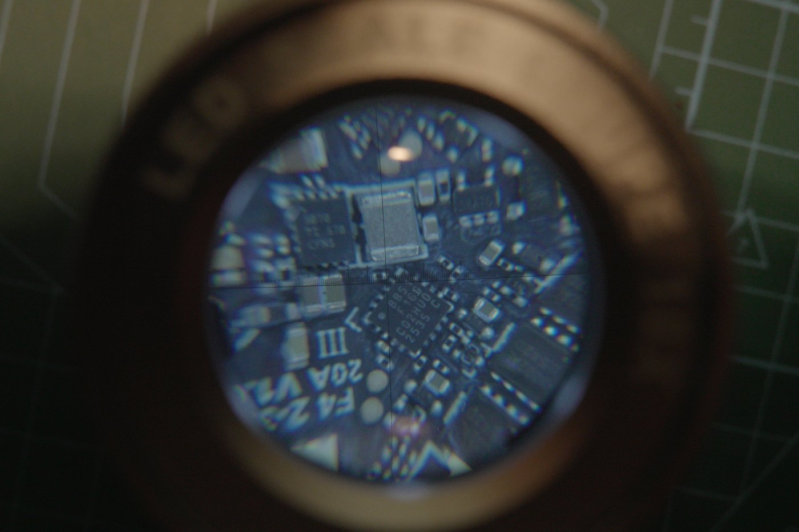
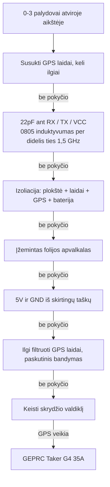
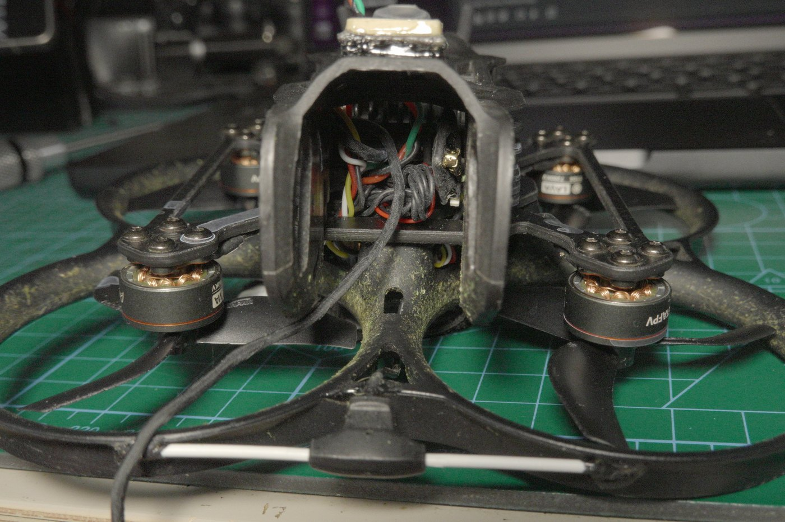
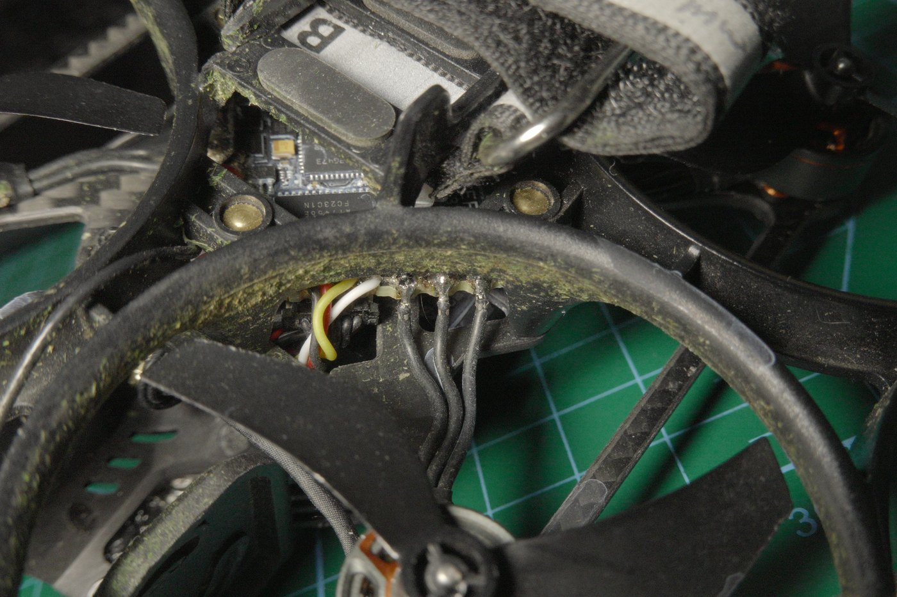
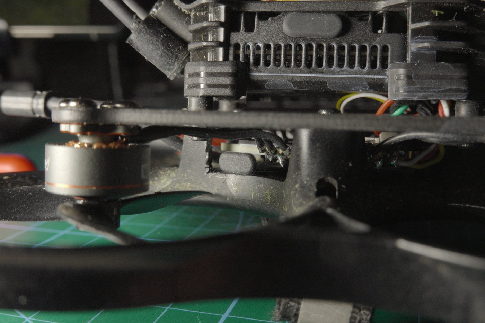
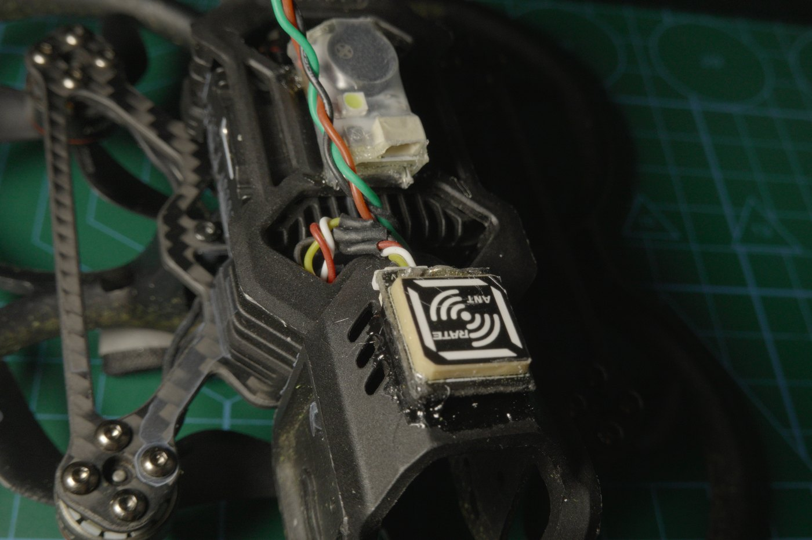
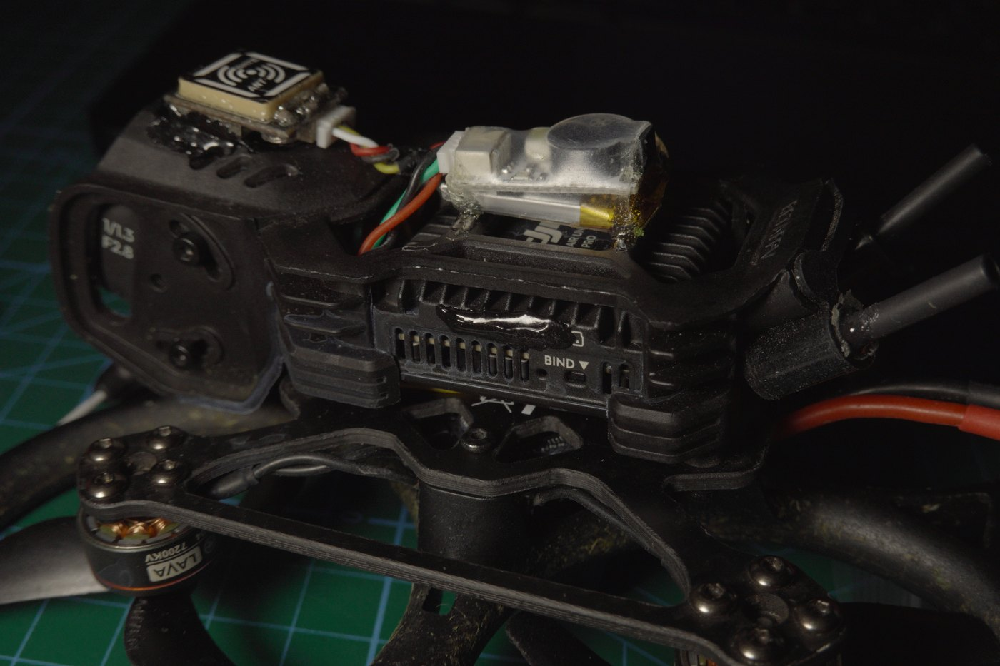
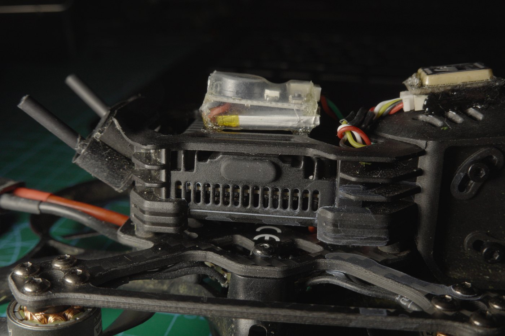
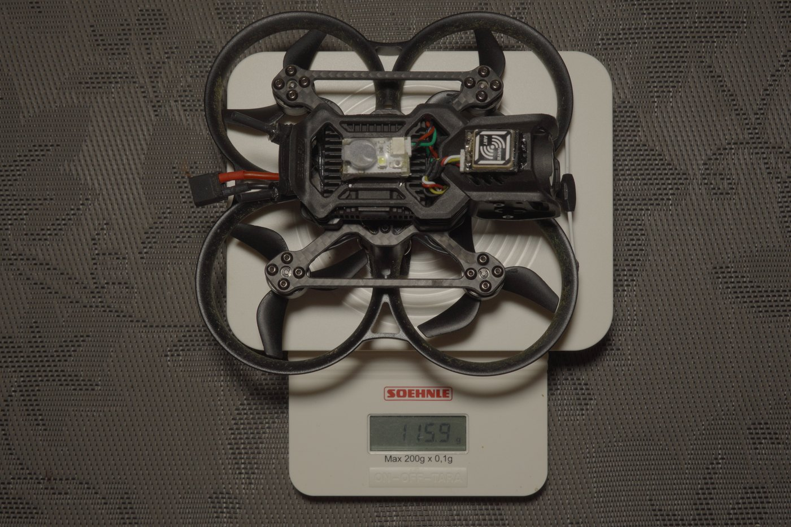

> Tęsinys po [Pavo20 Pro II GPS taisymo bandymų: BEC perjungimo triukšmas 1575 MHz](/fpv/pavo20-gps-struggles/), kur išmatavau trukdžius ir baigiau be sprendimo. Šis įrašas sprendimą turi. Jis tau nepatiks, ir man irgi nepatiko.

Trys palydovai gerą dieną. Nulis po penkiolikos minučių blogą dieną, atviroje aikštėje, kai 1S whoop'as ant tos pačios žolės randa dvidešimt ar daugiau. Išmatavau triukšmą su TinySA, radau smailes, pasklidusias nuo 1,2 iki 1,6 GHz, viską surašiau, o paskui savaites bandžiau sutvarkyti kaip reikia.

Kaip reikia nesutvarkiau. Pakeičiau skrydžio valdiklį.

## Hipotezė išsiplėtė ir dabar ji apie ritę

Praeitame straipsnyje BEC įvardijau kaip šaltinį, ir buvau tikresnis, nei turėjau teisę būti. Nuo tada radau kažką pakankamai konkretaus, kad pasikeistų viso paaiškinimo forma.

**Abi linijos naudoja tą patį lustą.** Ir 5V, ir 9V BEC pastatyti aplink **TPS63070**, Texas Instruments buck-boost keitiklį, kurio įėjimo diapazonas 2–16 V, o komutuojamos srovės riba 3,6 A. Tai gerokai per daug keitiklio tam, ką jis čia maitina, o mūsų egzempliorius GPS priėmimą blogina praktiškai be apkrovos.

**Detalė, kurią laikiau kondensatoriumi, yra induktyvumo ritė.** Ieškojau ritės ir tikrinau detales in-circuit LCR matuokliu. Ja pasirodė esąs didelis komponentas prie TPS63070, maždaug 2,5 mm. Iki tol žiūrėjau tiesiai per jį.





**Ir ji atrodo magnetiškai nesandari.** Kitose mano plokštėse ritės fiziškai didesnės, su tinkamai uždaromis feromagnetinėmis šerdimis, o būtent tai laiko perjungimo lauką apvijų viduje. Ši, atrodo, tokios šerdies neturi, o buck-boost topologija ritę pastato į visko centrą: ji neša komutuojamą srovę abiejose fazėse.

Štai kodėl tuo tikiu, o ne tik noriu tikėti: **TinySA magnetinis zondas tai pagauna geriau nei artimojo lauko elektrinis zondas.** Jei pagrindinis nutekėjimo kelias būtų elektrinio lauko sąsaja per takelius, turėtų nugalėti E zondas. Nenugali. Nugali H zondas.

Ir tai perrėmina visą problemą. Jei perjungimo energija yra **induktyviai įvedama į aplinkines grandines**, o ne vedama laidais ar spinduliuojama kaip E laukas, tai ji jau yra viskame aplinkui dar prieš pasiekdama GPS, ir **jokiu ekranavimu to neišspręsi.** Tai paaiškina kiekvieną žemiau aprašytą nesėkmę, įskaitant dvi, kurios buvo arčiausiai: ekranuotas GPS laidas užstrigo prie keturių ar penkių palydovų po penkiolikos varginančių minučių tiesiuose saulės spinduliuose, o plokštės maitinimas per USB vietoje baterijos nepakeitė nieko.

Ankstesnis pastebėjimas apie šuntavimą vis dar galioja ir naują paaiškinimą papildo, o ne su juo konkuruoja: BEC išėjimo kondensatorius yra vienas didelis keraminis, be mažesnės vertės kondensatorių šalia, o maži kondensatoriai sutelkti aplink MCU. Didelis keraminis pats vienas nustoja veikti kaip kondensatorius gerokai žemiau 1,5 GHz, tokia pati klaida, kokią po minutės padarysiu su savo filtrais.

**Ir rekomenduojamo išdėstymo šioje plokštėje nėra.** TPS63070 dokumentacijoje yra EVM išdėstymas, kuriame du kondensatoriai, C1 ir C4, sėdi tiesiai prie ritės ir lusto, ten, kur perjungimo kilpa ankščiausia. Tai ne dekoratyvinė detalė, o būtent ta rekomendacijos dalis, kuri skirta aukštų dažnių kilpos plotui mažinti.

Realioje plokštėje **C1 ir C4 visai nėra.** Kiti kondensatoriai galbūt yra, per lupą tikrai sunku pasakyti, bet jie toliau, atstumti dėl vietos apribojimų. Tad detalės, sudėtos būtent tam, kad kilpa liktų maža, yra tos, kurių atsisakyta.

```viz-dot
digraph hotloop {
  rankdir=LR;
  fontname="Helvetica"; fontsize=11;
  node [shape=box style=filled fillcolor="#f2f3f3" fontname="Helvetica" fontsize=11];
  edge [fontname="Helvetica" fontsize=9];

  subgraph cluster_rec {
    label="TPS63070 dokumentacija, rekomenduojama";
    color="#244d68"; fontcolor="#244d68"; fontname="Helvetica";
    r_ic [label="TPS63070"];
    r_c  [label="C1 + C4\nprie perjungimo mazgų" fillcolor="#95b0c1"];
    r_l  [label="L1"];
    r_ic -> r_c [label="trumpai"];
    r_c -> r_l [label="trumpai"];
    r_l -> r_ic [label="ankšta HF kilpa" style=bold];
  }

  subgraph cluster_act {
    label="Ši plokštė";
    color="#915d52"; fontcolor="#915d52"; fontname="Helvetica";
    a_ic [label="TPS63070"];
    a_gap [label="C1 + C4\nneįdėtos" fillcolor="#bd9361" style="filled,dashed"];
    a_l  [label="L1, ~2,5 mm\nbe uždaros šerdies"];
    a_far [label="kiti kondensatoriai,\ntoliau"];
    a_ic -> a_gap [style=dashed];
    a_gap -> a_l [style=dashed];
    a_l -> a_far;
    a_far -> a_ic [label="didesnė HF kilpa" style=bold];
  }
}
```

TI taip pat turi taikymo aprašą apie šią problemų klasę, [SLVAEP5](https://www.ti.com/lit/pdf/SLVAEP5), kur lyginamas spinduliuojamas EMI tarp standartinio Webench išdėstymo ir optimizuoto keturių sluoksnių, su kelių dB skirtumu vien nuo išdėstymo.

Skaitant jį, reikia dviejų išlygų, ir viena iš jų prieš mane. Matavimai baigiasi ties 1 GHz, o GPS L1 sėdi ties 1575 MHz, tad jis paremia mechanizmą, ne mano dažnį. Ekstrapoliuojant kreivę aukščiau, ji akivaizdžiai ties 1 GHz nesibaigia, ir ten gali būti dar smailių ties L1, ypač jei kas nors plokštėje toje srityje rezonuoja. Bet **rezonansinės smailės yra būtent tai, ko ekstrapoliuoti negalima**, tad tai lieka spėjimas, o ne išvada. Aš vis tiek kaltinu ritę, kad prateka.

Noriu būti tiesus dėl to, kas tai yra: **apžiūra, zondavimas ir logika, ne kontroliuojamas matavimas.** Ritės lauko nuo MCU lauko neatskyriau ir negaliu to padaryti nesugriaudamas integruotos plokštės. Ginčą išspręstų tinkamas H zondo skenavimas tiesiai virš ritės ir virš MCU, įjungus plokštę ir atjungus GPS. To nepadariau.

## Šeši dalykai, kurie nepadėjo

Nė vienas iš jų nenufotografuotas. Tuo metu ieškojau gedimo, o ne jį dokumentavau, ir pabaigoje buvau per daug suirzęs, kad prisiminčiau fotoaparatą.

**Įvairaus ilgio susukti GPS laidai.** Idėja buvo, kad laidas veikia kaip atsitiktinis rezonatorius kažkur apie 1,5 GHz, tad perdariau jį keliais skirtingais ilgiais, susuktą. Jei kuris nors ilgis būtų rezonavęs, jo pakeitimas turėjo pajudinti triukšmo lygį. Nepajudėjo niekas.

**Filtrai prie modulio kojelių.** 22 pF nuo RX į žemę, nuo TX į žemę ir nuo VCC į žemę. Šį bandymą pražudė turimos detalės: mano kondensatoriai yra 0805, o ties 1,5 GHz tas korpusas turi tiek nuosekliojo induktyvumo, kad nustoja veikti kaip kondensatorius. Žinojau tai iš anksto ir vis tiek pabandžiau, nes detalės buvo po ranka. Pagerinimo nebuvo, o tai bent patvirtina, kad problema buvo korpusas, o ne pati idėja.

**Visiška izoliacija.** Plokštė, laidai, GPS, baterija. Jokių variklių, jokio zumerio, jokio VTX. Jei kas nors kitas būtų prisidėjęs, sumažinus droną iki keturių komponentų tai turėjo išryškėti. Palydovų skaičius nepasikeitė nė kiek.

**Įžemintas folijos apvalkalas aplink FC.** Jokio reikšmingo pokyčio. Esant kelių centimetrų atstumui, esi artimojo lauko viduje, o folija taip arti nesuteikia to, ko intuityviai lauktum.

**Įtampa ir žemė iš skirtingų taškų.** Šis bandymas buvo nukreiptas į hipotezę apie blogą žemės pilnutinę varžą: jei GPS dalijasi grįžtamuoju keliu su kažkuo triukšmingu, 5V ir žemės paėmimas iš skirtingų plokštės vietų turėjo ką nors pakeisti. Nepakeitė, jokioje kombinacijoje, kurią išbandžiau.

**Kitas UART, kurio sąmoningai netikrinau.** GPS prijungtas prie **UART1** ir taip buvo visada. Į UART6 jo niekada nekėliau, nes pakankamai žmonių praneša apie bėdas ten, kad bandymas neatrodė vertas laiko. Tad „ne tas UART“ čia niekada nebuvo kandidatas, ir jei tu gaudai kažką panašaus, UART1 man problema nebuvo.

Tada supykau, išlitavau viską, įskaitant variklius ir zumerio laidus, ir dar kartą pabandžiau su ilgais filtruotais GPS laidais. Vis tiek ne.



## Sprendimas buvo išvyka į vietinę parduotuvę

Nuvažiavau į vietinę FPV parduotuvę ir nusipirkau **GEPRC Taker G4 35A**. Išlitavau BetaFPV plokštę, įdėjau GEPRC, sujungiau.

GPS veikia.

Tai visas sprendimas, ir kaip inžinerija jis visiškai netenkina. Negaliu tau pasakyti, kuris originalios plokštės projektinis sprendimas tai sukėlė, nes niekada to neatskyriau. Galiu pasakyti tik tai, kad plokštės pakeitimas buvo vienintelis veiksmas iš visų aukščiau išvardytų, kuris pakeitė rezultatą, o tai stipriai rodo, kad problema plokštėje, ne mano laiduose, modulyje ar montavime.



## Skaičiai, nes „veikia“ nėra matavimas

Štai ko aš pats norėčiau, skaitydamas kito žmogaus aprašymą.

| Aparatas | Įprastai | Geriausiai matyta | Pastabos |
|---|---|---|---|
| 4" sulankstomas | ~17 palydovų | **30** vieną kartą | Pasigauna net skrydžio metu, kai neturiu kantrybės |
| Pavo20, sena plokštė | 0 iki 3 | nieko vertas kiekis | Nulis po 15 minučių blogą dieną |
| Pavo20, Taker G4 | **8 palydovai per 2 min** | **15** | 15 tik po kelių minučių „mirkymo“ |

Tą lentelę galima skaityti į dvi puses.

Perėjimas nuo nulio palydovų per penkiolika minučių prie aštuonių per dvi yra didžiulis pagerinimas, o penkiolika idealiomis sąlygomis su šiuo rėmu man yra tikras pasiekimas.

Bet Pavo20 vis dar toli gražu ne 4 colių lygyje. Jam pasiseka, jei atviroje aikštėje pamato 10, kai sulankstomas laikosi ties 17 ir vieną kartą pasiekė 30. **Tad skrydžio valdiklis buvo dominuojantis gedimas, bet ne vienintelis.** GPS pasodinimas taip arti DJI O4 Pro modulio ir kameros, be jokio anglies pluošto tarp jų, kuris veiktų kaip barjeras, vis tiek pastebimai blogina priėmimą. Plokštės pakeitimas pašalino didžiausią prisidedantį veiksnį. Jis nepadarė whoop'o geru GPS aparatu.

## Kas dar pasikeitė po keitimo

Ėjau dėl palydovų, o išėjau su kitu aparatu.

**Jis palaiko 4S.** Plokštės dėl to nepirkau ir nežinojau, kad taip bus. Su 4S dronas skrieja daugiau nei 100 km/h, kas šio dydžio whoop'ui yra šiek tiek absurdiška.

**Nėra integruoto ELRS.** Tikroji keitimo kaina. BetaFPV plokštėje imtuvas buvo integruotas, Taker jo neturi, tad reikėjo mažiausio išorinio RX, kokį galėjau rasti, ir vietos jam. Esant 17 mW telemetrijos galiai, ryšys vis tiek laiko. Tinkamų nuotolio testų nedariau, tad nuotolio skaičiaus, kurio neišmatavau, tau nesakysiu. Pliusas tas, kad imtuvas dabar yra atskirai keičiamas komponentas, ko anksčiau nebuvo.



**Antenos vieta ir kodėl priekyje yra gerai.** T-dipolio galai pritvirtinti B7000 lašeliais. Sumontavau priekyje be jokio nerimo, nes propelerių apsaugos čia yra plastikinės ir sėdi toli nuo bet kokio anglies pluošto.

Ta vieta atitinka ir tai, kaip blogas skrydis realiai vystosi. Kai aparatas skrenda nuo manęs, ryšio įspėjimus gaunu anksti, RxLow arba visišką nutrūkimą, o būtent tada ir noriu būti informuotas. Paskui, kai pasuku jį atgal į save, antena mane mato aiškiai ir signalas atsistato. Tas pasukimas ir yra momentas, kurį turėtų padengti GPS rescue, o dabar, kai GPS tikrai turi palydovų, jis gali.

**Varikliai prilituoti tiesiai prie plokštės.** Jungčių nukirpti nesivarginau, tiesiog prilitavau metalą tiesiai prie FC kontaktų. Ore skirtumo nuo jungčių nejaučiu, bet mechaniškai turėtų būti tvirčiau, o po to, kas nutiko toliau, tai man svarbu labiau nei anksčiau.

**Jis įsitenka tarp kameros ir O4 Pro.** Vietos kaip tik, dar lieka zumeriui ir GPS laidams. Buvau pasiruošęs jello efektui, nes sandvičas ankštas, o plokštė sėdi arti kameros. Nėra jokio. Nei jello, nei matomos vibracijos vaizde, net ir esant didelei traukai.



**USB-C, šone.** Vienu metu ir pliusas, ir minusas. Vieta nepatogi, bet tai USB-C, o ne micro, ir tokį keitimą imsiu visada. Ten, kur jis sėdi, kaupiasi žolė, tad nešioja guminį gaubtelį.

**Apsauga nuo vandens.** Flywoo ant plokštės, DJI modulio ir kameros jungties, plius šiek tiek B7000 ant pačios kameros. Kameros prieš tai neišrinkau, kitaip nei vaizdo įrašuose, kur tai daroma kaip reikia. GPS ir zumeris priklijuoti B7000 viršuje.



**HQProps.** Tiesiog pagerinimas. Skraido maloniau ir turi gerokai mažiau to aukšto cypimo, kurį leidžia originalūs propeleriai. Jokių matavimų už to nėra, tik skraidymas ir klausymas, bet skirtumas nėra subtilus.

## Mažos antenos ir viena pretenzija

Atskirai nuo plokštės keitimo perėjau prie mažų antenų, ir tai yra pakeitimas, kuriuo esu labiausiai patenkintas dėl priežasties, visai nesusijusios su charakteristikomis.

Jos priima blogiau. Neapsimetinėsiu; kiek blogiau, neišmatavau.

Užtat jos **nustoja žudyti mano DJI O4 U.FL jungtis.** Didelė antena ant trumpo laido yra svirtis, o atramos taškas yra U.FL jungtis, skirta keliolikai sujungimų ir niekada neprojektuota šoninei apkrovai iš antenos, užkibusios žolėje. Savąsias sutvirtinau papildomu alavu ir klijais, ir jos laiko.

Tas sutvirtinimas ir yra tai, kas mane labiausiai nervina. Aš esu vartotojas. Nusipirkau gatavą oro modulį. Neturėčiau pridėti alavo prie jungties gaminyje, už kurį sumokėjau, kad galėčiau skraidyti negalvodamas, ar antenos dar prikabintos, ir tai, kad hobyje tai normali praktika, dar nereiškia, kad tai gera inžinerija.





## Kiek jis sveria

Ant stalinių svarstyklių: **115,8 g**, kaip nufotografuota, be baterijos.



Patogi atsarga iki 250 g net ir uždėjus bateriją, o tai man dabar svarbu labiau nei anksčiau. Šis aparatas praėjo plokštės keitimą, imtuvo keitimą, antenų rinkinį ir nemažą kiekį B7000, o trisdešimt gramų taisymuose priauga nepastebimai.

## Variklis ir kas iš tikrųjų nutrūko

Skrydžio metu variklio laidai atsijungė ir dronas nukrito tiesiai į ką tik suartą lauką, kuris yra švelniausias paviršius, kokį galėjo pasirinkti, ir kartu priežastis, kodėl žemės yra beveik visose šiose nuotraukose.

Noriu būti atsargus dėl priežasties, nes graži istorija būtų „4S jį užmušė“, o nemanau, kad taip nutiko. Buvau iki galo atidaręs trauką, ieškodamas maksimalaus greičio, tad galia tikrai buvo pakelta. Bet tai nebuvo sudegęs variklis ir nebuvo elektrinis gedimas. **Trys laidai fiziškai nutrūko.** Klijai jų prie variklio pado nelaikė kaip reikia, ir tas variklis jau kurį laiką klibėjo pastebimai labiau nei kiti trys, kol galiausiai atsileido. Laidų fiksavimo gedimas, kurį galėjau numatyti, bet į jį nesureagavau.

Buvau tikras, kad skrydžio valdiklis miręs. Nepanašu. MOSFET'ai atrodo tvarkingi ir plokštė vis dar veikia, bet prieš tvirtinti galutinai laukiu naujo variklio, nes kol visi išėjimai vėl nebus apkrauti, aš tiesiog nežinau, o „įsijungia“ nėra tas pats kaip „veikia“.

Su šiuo variklių rinkiniu vis tiek lieku prie **3S**. Šešių minučių atsargaus skraidymo pakanka tam, kam šį aparatą naudoju, o 4S galimybė niekur nedingsta, tik laukia variklių rinkinio, kuris jos norės.

## Ar tai vis dar galima vadinti Pavo20?

Be istorijos: GPS randa palydovus, 4S prieinamas vėliau, imtuvas keičiamas, propeleriai tylesni, antenos nebegriauna jungčių, o svoris 115,8 g. O kitoje pusėje: integruotas imtuvas tapo atskiru komponentu, kurį reikia kur nors įsprausti, ir pralošiau variklį klijams, ne fizikai.

Ir dėl to lieka klausimas, į kurį neturiu švaraus atsakymo. Rėmas yra Pavo20 Pro II. Gaubtai, kiautas, kamera ir oro modulis yra Pavo20. Smegenys ne, o smegenys pasirodė ta dalis, kuri nulėmė visas problemas abiejuose šiuose straipsniuose. **Tad ar Pavo20 Pro su persodintomis smegenimis vis dar yra Pavo20?**

Aš linkstu prie „ne“ ir linkstu tai vadinti Taker G4 rėmu, apsirengusiu BetaFPV drabužiais. Tai aprašymui nepatogi išvada, nes tai, ką iš visos šios istorijos rekomenduočiau, nėra tas aparatas, kurį nusipirkau.

Tuo tarpu atkeliavo 4S Pavo20 Pro. Ar jis daro tą patį — kitas testas, kuris ir nuspręs, ar tai buvo platformos savybė, ar viena bloga plokštė.
