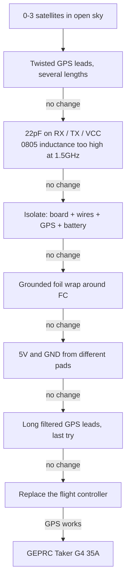

> Follow-up to [Pavo20 Pro II GPS Fix Attempts: BEC Switching Noise at 1575 MHz](/fpv/pavo20-gps-struggles/), which measured the interference and ended without a fix. This one has a fix. You are not going to like it, and neither did I.

Three satellites on a good day, zero after fifteen minutes on a bad one, in open sky, while a 1S whoop on the same grass found twenty or more. I measured the noise with a TinySA, found spurs across the 1.2 to 1.6 GHz range, wrote it all up, then spent weeks trying to fix it properly.

I did not fix it properly. I replaced the flight controller.

## The hypothesis has grown, and it is now about an inductor

The previous article named the BEC as the source and was more confident than it had earned. Since then I found something specific enough to change the shape of the explanation.

**Both rails run the same chip.** The 5V and the 9V BEC are both built around a **TPS63070**, a Texas Instruments buck-boost converter with a 2V to 16V input range and a 3.6A switch current limit. That is a lot of converter for what it is driving here, and ours degrades GPS at essentially zero load.

**The thing I assumed was a capacitor is an inductor.** I was hunting for the inductor and probing parts with an in-circuit LCR meter, and the large component next to the TPS63070, about 2.5mm, turned out to be it. I had been looking straight past it.


**And it looks magnetically leaky.** Other boards I have use physically larger inductors with properly enclosed ferromagnetic cores, which is what keeps the switching field inside the windings. This one does not appear to have that, and a buck-boost topology puts the inductor at the centre of everything, carrying switched current in both phases.

Here is the part that makes me believe it rather than just like it: **the magnetic probe on the TinySA picks this up better than the near-field electric probe does.** If the dominant escape route were electric-field coupling from traces, the E-field probe should win. It does not. The H-field probe does.

Which reframes the problem. If switching energy is **inductively coupled into the surrounding circuitry** rather than conducted along wires or radiated as an E-field, it is already inside everything nearby before it reaches the GPS, and **no amount of shielding fixes that.** That matches every failure in the next section, including the two that came closest: shielded GPS wire capped at four or five satellites after fifteen grueling minutes in direct sun, and powering the board over USB instead of the pack changed nothing.

The earlier decoupling observation still stands, complementary rather than competing: the BEC output capacitor is a single large ceramic with no smaller companions, and the small caps cluster around the MCU. A big ceramic alone stops behaving like a capacitor well below 1.5 GHz, the same mistake I make with my own filters in a moment.

**And the recommended layout is not on this board.** The TPS63070 datasheet includes an EVM layout showing two capacitors, C1 and C4, sitting immediately beside the inductor and the IC, in the tightest part of the switching loop. That is not a decorative detail, it is the part of the recommendation that specifically targets high-frequency loop area.

On the actual PCB, **C1 and C4 are absent altogether.** Other capacitors may be present, it is genuinely hard to tell under a loupe, but they are further out, pushed away by space constraints. So the components placed specifically to keep the hot loop small are the ones that got dropped.

```viz-dot
digraph hotloop {
  rankdir=LR;
  fontname="Helvetica"; fontsize=11;
  node [shape=box style=filled fillcolor="#f2f3f3" fontname="Helvetica" fontsize=11];
  edge [fontname="Helvetica" fontsize=9];

  subgraph cluster_rec {
    label="TPS63070 datasheet, recommended";
    color="#244d68"; fontcolor="#244d68"; fontname="Helvetica";
    r_ic [label="TPS63070"];
    r_c  [label="C1 + C4\nat the switch nodes" fillcolor="#95b0c1"];
    r_l  [label="L1"];
    r_ic -> r_c [label="short"];
    r_c -> r_l [label="short"];
    r_l -> r_ic [label="tight HF loop" style=bold];
  }

  subgraph cluster_act {
    label="This board";
    color="#915d52"; fontcolor="#915d52"; fontname="Helvetica";
    a_ic [label="TPS63070"];
    a_gap [label="C1 + C4\nnot fitted" fillcolor="#bd9361" style="filled,dashed"];
    a_l  [label="L1, ~2.5 mm\nno enclosed core"];
    a_far [label="other caps,\nfurther away"];
    a_ic -> a_gap [style=dashed];
    a_gap -> a_l [style=dashed];
    a_l -> a_far;
    a_far -> a_ic [label="larger HF loop" style=bold];
  }
}
```

TI also have an application note on this class of problem, [SLVAEP5](https://www.ti.com/lit/pdf/SLVAEP5), comparing radiated EMI between a stock Webench layout and an optimised four-layer one, with several dB of difference from layout alone.

Two caveats on reading it, one of which cuts against me. Its measurements stop at 1 GHz while GPS L1 sits at 1575 MHz, so it supports the mechanism rather than my frequency. Extrapolating the envelope upward, it plainly does not stop at 1 GHz, and there may well be further peaks up at L1, particularly if anything on the board is resonant there. But **resonant peaks are precisely the thing you cannot extrapolate**, so that remains a guess and not a finding. I still blame the inductor for leaking.

I want to be clear about what this is: **inspection, probing and reasoning, not a controlled measurement.** I have not isolated the inductor's field from the MCU's, and I cannot do it non-destructively on an integrated board. What would settle it is a proper H-field probe sweep directly over the inductor versus over the MCU, powered, with the GPS disconnected. I have not done that.

## Six things that did not work

None of these are photographed. I was troubleshooting, not documenting, and by the end I was too annoyed to think about a camera.

**Twisted GPS lead lengths.** The theory was that the lead was acting as an accidental resonator near 1.5 GHz, so I rebuilt it at several lengths, twisted. If a particular length had been resonant, changing it should have moved the noise floor. Nothing moved.

**Filters at the module pins.** 22 pF from RX, TX and VCC to ground. Doomed by the parts I had: mine are 0805, and at 1.5 GHz that package has enough series inductance to stop behaving like a capacitor at all. I knew that and tried anyway because the parts were in front of me. No improvement, which at least confirms the package was the problem, not the idea.

**Full isolation.** Board, wires, GPS, battery. No motors, buzzer or VTX. If anything downstream were contributing, stripping the aircraft to four components should have shown it. The count did not budge.

**A grounded foil wrap around the FC.** No meaningful change. At a few centimetres you are inside the near field, and foil that close does not buy you what intuition says it should.

**Power and ground from different pads.** Aimed at the bad-ground-impedance idea: if the GPS shared a return path with something noisy, taking its 5V and its ground from different locations should have changed something. It did not, in any combination I tried.

**A different UART, which I deliberately did not test.** The GPS runs on **UART1** and always has. I never moved it to UART6, because enough people report trouble there that it was not worth the experiment. So if you are chasing something similar, UART1 was not my problem.

Then I got angry, unsoldered everything including the motors and the buzzer wires, and gave it one last go with long filtered GPS leads. Still no.



## The fix was a trip to the local shop

I drove to the local FPV store and bought a **GEPRC Taker G4 35A**. Unsoldered the BetaFPV board, put the GEPRC in, wired it up.

The GPS works.

That is the whole fix and it is deeply unsatisfying as engineering. I cannot tell you which design decision on the original board caused this, because I never isolated it. What I can say is that swapping the board was the only intervention out of everything above that changed the outcome, which points hard at the board rather than at my wiring, my module or my mounting.


## The numbers, because "it works" is not a measurement

This is the part I would want if I were reading someone else's write-up.

| Aircraft | Typical | Best seen | Notes |
|---|---|---|---|
| 4" foldable | ~17 sats | **30** once | Will acquire mid-flight when I get impatient |
| Pavo20, old board | 0 to 3 | a useless handful | Zero after 15 minutes on a bad day |
| Pavo20, Taker G4 | **8 sats in 2 min** | **15** | 15 only after soaking for several minutes |

That table cuts both ways.

Zero satellites in fifteen minutes to eight in two is an enormous improvement, and fifteen in ideal conditions on this airframe I count as a genuine win.

But the Pavo20 is still nowhere near the 4-inch, which sits at 17 and once touched 30. **So the flight controller was the dominant fault, not the only one.** Sitting the GPS that close to a DJI O4 Pro air unit and camera, with no carbon fibre between them to act as any kind of barrier, still costs real reception. The swap removed the biggest contributor. It did not turn a whoop into a good GPS platform.

## Everything else the swap changed

I went in for satellites and came out with a different aircraft.

**It supports 4S.** I did not buy the board for this and did not know it was coming. On 4S the quad zips along at over 100 km/h, which on a whoop this size is faintly ridiculous.

**No built-in ELRS.** The real cost of the swap. The Taker has no integrated receiver, so I needed the smallest external RX I could find and somewhere to put it. At 17 mW of telemetry the link still delivers, though I have not done distance testing and will not quote a range I have not measured. The upside: the receiver is now replaceable on its own.


**Antenna placement, and why the front is fine.** The T-dipole ends are secured with dabs of B7000, mounted at the front without worrying, because the prop guards here are plastic and sit far from any carbon.

It also suits how a bad flight unfolds. Heading away from me I get link warnings early, RxLow or an outright drop, which is when I want to be told. Rotating it back to face me gives the antenna clear sight and the signal returns. That rotation is the moment GPS rescue is meant to cover, and now that the GPS has satellites, it can.

**Motors soldered straight to the board.** I did not cut the connectors off, I soldered the metal directly to the FC pads. No difference I can feel in the air, but mechanically more secure, and after what happens below I care about that more.

**It fits between the camera and the O4 Pro.** Just enough room, with space for the buzzer and GPS wiring. I was braced for jello, given how tight the sandwich is. There is none, even at high throttle.


**USB-C, on the side.** Awkward position, but USB-C rather than micro, and it collects grass, so it wears a rubber cap.

**Weatherproofing.** Flywoo on the board, the DJI module and the camera connector, plus a little B7000 on the camera itself, without disassembling it first unlike the videos that do this properly. GPS and buzzer are B7000'd on top.


**HQProps.** They fly nicer and have far less of the high-pitched scream the originals produce. No measurements, just flying and listening, but it is not subtle.

## The small antennas, and a complaint

Separately from the board swap I moved to small antennas, and this is the change I am happiest about, for a reason unrelated to performance.

They receive worse. I am not pretending otherwise and have not quantified how much worse.

What they do is **stop destroying my DJI O4 U.FL connectors.** A big antenna on a short pigtail is a lever, and the fulcrum is a U.FL connector rated for a handful of mating cycles, never designed for side load from a whip catching in grass. I reinforced mine with extra solder and glue and they are holding.

That reinforcement is the part that annoys me. I am a consumer, I bought a finished air unit, and I should not have to add solder to a connector on a product I paid for in order to stop worrying whether my antennas are still attached. That this is normal practice in the hobby does not make it good engineering.


## What it weighs

On the bench scale: **115.8 g**, as photographed, without a pack.


Comfortable headroom under 250 g with a battery on. That matters more than it used to, because this aircraft has absorbed a board swap, a receiver, antennas and a lot of B7000, and thirty grams of fixes accumulate without you noticing.

## The motor, and what actually broke

Mid-flight the motor wires came disconnected and the quad dropped into a recently plowed field, the softest surface it could have chosen and the reason there is earth in most of these photos.

I want to be careful about the cause, because the tidy story would be "4S killed it" and I do not think that is what happened. I had been running full throttle to find the top speed, so the power was up. But this was not a burned motor and not an electrical failure. **The three wires physically tore.** The glue was not holding them properly at the motor base, and that motor had been wiggling noticeably more than the other three for a while before it let go. A strain relief failure I could have seen coming and did not act on.

I assumed the flight controller was dead. It does not look it: the MOSFETs appear fine and the board still behaves. But I am waiting on a replacement motor before calling that definitively, because until every output is loaded again I do not know, and "it powers up" is not "it works".

I am staying on **3S** with this motor set regardless. Six minutes of timid flying is enough for what I use this aircraft for, and 4S does not go away, it waits for a motor set that wants it.

## Can you still call it a Pavo20?

Stripped of the narrative: the GPS finds satellites, 4S waits for later, the receiver is upgradeable, the props are quieter, the antennas stop wrecking connectors, 115.8 g. Against that, an integrated receiver became a separate part to fit, and I lost a motor to glue rather than physics.

Which leaves a question I have no clean answer to. The frame, ducts, canopy, camera and air unit are all Pavo20. The brains are not, and the brains turned out to be the part that determined every problem across both articles. **So is a Pavo20 Pro with transplanted brains still a Pavo20?**

I lean towards no, and towards calling this a Taker G4 airframe in BetaFPV clothing. An awkward conclusion for a write-up, because what I would actually recommend out of this is not the aircraft I bought.

A 4S Pavo20 Pro has since arrived. Whether it does the same thing is the next test, and it decides whether this was a platform characteristic or one bad board.
