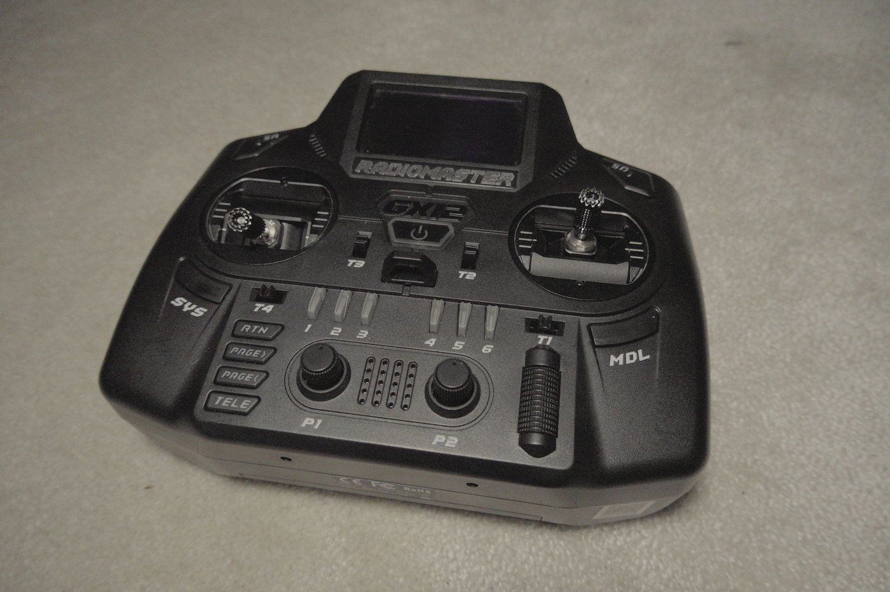
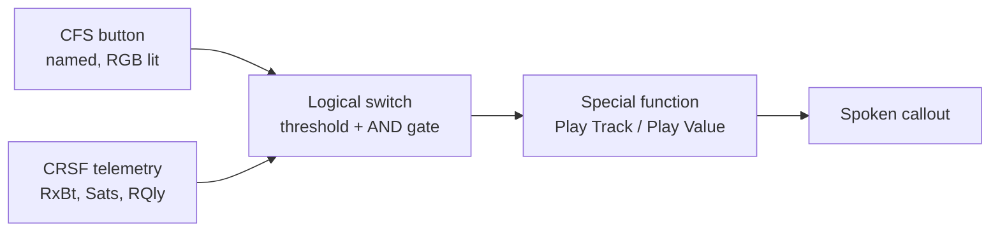

Most radio reviews compare gimbals, screens and module bays. Mine got chosen on
luggage volume, and I suspect I am not the only one.

The GX12 is my third radio. I fell for it the moment I saw it, and after using it
long enough to build a nine part telemetry project on top of it, I still think it
was the right call. Not because it is the best radio you can buy. It is not. But
"best radio" and "right radio" stopped being the same question for me the day my
flying started happening off the back of a motorcycle.



## The constraint nobody reviews

Most of my flying happens on motorcycle trips. That means the whole kit has to go
into the top box of a GS Adventure, together with two drones, goggles, batteries
and whatever else the trip needs. The DJI Mini 3 era of packing, when the entire
kit still left room for sandwiches and a bottle of water, is long gone.

So the radio decision came down to a physical envelope rather than a spec sheet.

**The Pocket** is small enough, and I have used one. It packs beautifully. But it
does not feel good in the hands in the way a full sized radio does, and on a trip
where I might get three flying sessions across four days, the thing I am holding
for those sessions matters.

**The Boxer** is the better radio. I want to be completely straight about that,
because it would be easy to write a justification here instead of a comparison. I
briefly flew a colleague's 5 inch on his Boxer. Better gimbals, better ergonomics,
no argument from me. My first flight with it went directly, immediately and
vertically into a tree, to considerable amusement from its owner. I redeemed
myself with a few power loops through gates afterwards, but the tree is the part
he remembers.

The reason I do not own a Boxer is prosaic. It does not fit. And for longer trips
I am going to have to pack more ruthlessly still, so a Boxer sized radio is
exactly the wrong direction.

The GX12 sits between the two. Not as compact as the Pocket, considerably more
ergonomic, and small enough that it does not cost me a battery's worth of space.
It is the compromise that stopped feeling like a compromise.

## The six buttons are the actual feature

Here is the part that turned out to matter far more than I expected when I bought
it.

The GX12 has six extra buttons above the sticks. In EdgeTX these are
**Customisable Function Switches**, or CFS, which means each one can be named,
given a default state, and assigned an RGB colour that the radio actually drives.
Individually addressable, so each button can be a different colour.

That sounds like a cosmetic detail. It is not. It is the difference between a
configuration you can operate and one you have to remember.

I use my telemetry warnings as three subsystems, one button each, colour coded:
recording, battery, GPS. Each button is a hardware switch with a light on it, so
the state of each subsystem is visible on the radio without unlocking the screen
or navigating a menu. Before a launch I can see what is armed, at a glance, in
daylight.



Six named, coloured, physical toggles are what made building that pleasant instead
of tedious. On a radio without them, the same configuration exists but lives
behind a menu, and a configuration you cannot see is a configuration you stop
trusting.

## What I actually built on it

The reason I care about any of this is that a low battery should be something I
hear, not something I forgot to look at. A voltage number in the corner of the OSD
is an interface failure, not a pilot failure. The data was always there. Nobody
was listening to it.

So the radio speaks. Battery ladder, satellite count, altitude changes, a
half capacity "return home" callout that has genuinely saved flights on long range
missions by telling me to start planning the trip back while I still have the
budget to make it.

Two things worth knowing if you want to do the same:

1. **No Lua.** All of it is EdgeTX logical switches and special functions, which
   have been in the firmware the whole time. Nothing exotic, nothing to install.
2. **The callouts are the stock voice pack.** I did not record anything and did not
   generate anything. The words shipped with the radio.

The one setting the whole thing rests on happens on the aircraft rather than the
radio. Setting `report_cell_voltage = ON` in Betaflight makes the flight
controller divide pack voltage by its own detected cell count before the telemetry
frame is ever sent. That means `3.5 V` means the same physical thing on a 1S whoop
and a 4S LiHV 3 inch, so one threshold ladder covers the whole fleet instead of a
hand maintained set per model.

The full walkthrough is in the series, starting with
[why the radio should talk at all](/fpv/edgetx-cockpit-voice-why/) and the
[calibration everything else depends on](/fpv/edgetx-cockpit-voice-calibration/).
The [buttons and AND gates](/fpv/edgetx-cockpit-voice-buttons/) post is the one
specific to this radio.

## The GX12 gotcha worth writing down

This one cost me a while, and it is the sort of thing that does not appear in a
review because you only meet it once you start configuring seriously.

**On the GX12, the per model CFS block overrides the radio level switch config.**
Both files carry entries for SW4, SW5 and SW6. The one in `radio.yml` is a
fallback. The per model block in `/MODELS/` is what actually applies. If you set
up your buttons globally, then wonder why a particular model ignores them, that is
why.

Mine reports `board: gx12` on EdgeTX 2.12.2. Two audio settings are worth knowing
about, because they change whether you hear the callouts at all:

```yaml
# radio.yml
wavVolume: 4
beepVolume: 0
audioMuteEnable: 1
```

Voice up, beeps off. I want words, not tones.

## What I have not measured

Being honest about the boundaries of this, because a review that claims to have
tested everything usually has not.

I have not done range testing that would let me say anything useful about RF
performance versus a Boxer or a Pocket. I have not measured gimbal precision, and
my subjective impression that the Boxer's are better is exactly that, subjective.
I have no long term data on switch or gimbal wear yet. And I fly ELRS on
everything, so I cannot tell you how the GX12 behaves with any other protocol.

What I can tell you is that it fits in the top box, the buttons changed how I
configure a radio, and after nine posts of building on it I have not wanted to
swap.

## Where to go from here

If you have a GX12 and want it to talk, the series is the practical part of this
post:

- [Part 1: why voice telemetry beats the OSD](/fpv/edgetx-cockpit-voice-why/)
- [Part 3: the CFS buttons and the AND gate](/fpv/edgetx-cockpit-voice-buttons/)
- [Part 4: battery and GPS callouts](/fpv/edgetx-cockpit-voice-callouts/)
- [Part 8: four things wrong with my own build](/fpv/edgetx-cockpit-voice-whats-wrong/)
- [The whole series](/series/edgetx-cockpit-voice/)

And if you are choosing between a Pocket, a GX12 and a Boxer, my honest advice is
to work out your physical envelope first. The Boxer is the better radio. It is
only the better radio for you if it fits where you need it to go.
