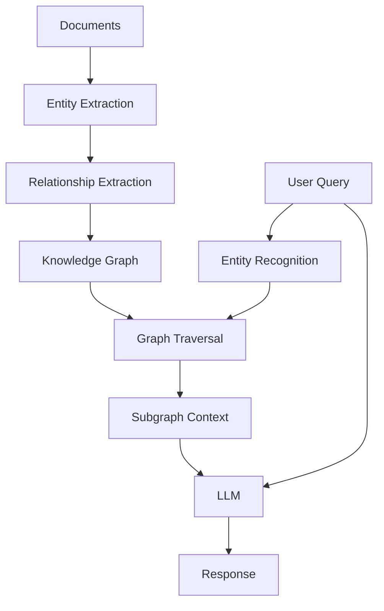

Graph-based Retrieval-Augmented Generation for enhanced context and relationship understanding.

## Core Idea

**Graph RAG** represents knowledge as a structured graph (entities and relationships) rather than flat document chunks, enabling **multi-hop reasoning** and relationship-aware retrieval.

### Mathematical Foundation

Traditional vector RAG uses point-wise similarity:
$$\text{retrieve}(q) = \arg\max_{d \in D} \text{sim}(\mathbf{q}, \mathbf{d})$$

Graph RAG uses **graph traversal** to retrieve connected subgraphs:
$$\text{retrieve}(q) = \text{traverse}(G, E_q, h)$$

where:
- $G = (V, E)$ is the knowledge graph with vertices (entities) and edges (relationships)
- $E_q$ are entities extracted from query $q$
- $h$ is the hop depth for traversal
- The traversal returns a subgraph $G' \subseteq G$ containing relevant entities and their relationships

**Key Advantages:**
1. **Relationship Preservation**: Captures explicit connections: $(e_1, r, e_2) \in E$
2. **Multi-hop Reasoning**: Traverses paths: $e_1 \xrightarrow{r_1} e_2 \xrightarrow{r_2} e_3$ to answer complex queries
3. **Structure Awareness**: Maintains document hierarchy and entity relationships
4. **Hybrid Retrieval**: Combines graph traversal with vector similarity for entities: $\text{hybrid}(q) = \alpha \cdot \text{graph}(q) + (1-\alpha) \cdot \text{vector}(q)$

**Process:**
1. **Extraction**: Extract entities and relationships from documents: $\{(e_i, r_{ij}, e_j)\}$
2. **Graph Construction**: Build knowledge graph $G$ with nodes and edges
3. **Query Processing**: Identify query entities $E_q$ and traverse connected subgraph
4. **Context Formation**: Convert subgraph to textual context preserving relationships
5. **Generation**: LLM generates response using graph-structured context

This enables answering questions like "Who collaborated with authors of papers about RAG?" which requires following relationships: $\text{Paper} \xrightarrow{\text{hasAuthor}} \text{Author} \xrightarrow{\text{collaboratesWith}} \text{Author}$.

---

## Graph RAG Architecture



---

## Why Graph RAG?

**Advantages over Vector RAG:**
- Captures relationships between entities
- Enables multi-hop reasoning
- Preserves document structure
- Better for complex queries requiring context

---

## Building Knowledge Graph

### Entity and Relationship Extraction

```python
from langchain.llms import OpenAI
from langchain.chains import create_extraction_chain

schema = {
    "properties": {
        "entities": {
            "type": "array",
            "items": {
                "type": "object",
                "properties": {
                    "name": {"type": "string"},
                    "type": {"type": "string"},
                }
            }
        },
        "relationships": {
            "type": "array",
            "items": {
                "type": "object",
                "properties": {
                    "source": {"type": "string"},
                    "target": {"type": "string"},
                    "type": {"type": "string"},
                }
            }
        }
    }
}

llm = OpenAI()
chain = create_extraction_chain(schema, llm)
result = chain.run(document_text)
```

---

## Neo4j Integration

### Setup

```python
from langchain.graphs import Neo4jGraph

graph = Neo4jGraph(
    url="bolt://localhost:7687",
    username="neo4j",
    password="password"
)
```

### Store Entities and Relationships

```python
# Create nodes
for entity in entities:
    query = """
    MERGE (e:Entity {name: $name, type: $type})
    SET e.embedding = $embedding
    """
    graph.query(query, {
        "name": entity["name"],
        "type": entity["type"],
        "embedding": get_embedding(entity["name"])
    })

# Create relationships
for rel in relationships:
    query = """
    MATCH (a:Entity {name: $source})
    MATCH (b:Entity {name: $target})
    MERGE (a)-[r:RELATES_TO {type: $type}]->(b)
    """
    graph.query(query, {
        "source": rel["source"],
        "target": rel["target"],
        "type": rel["type"]
    })
```

---

## Graph Retrieval Strategies

### 1. Direct Entity Lookup

**Core Idea**: Retrieves all entities directly connected to a query entity, providing immediate context about relationships.

**Mathematical Formulation**:
$$\text{retrieve}(e_q) = \{e : (e_q, r, e) \in E \lor (e, r, e_q) \in E\}$$

where $e_q$ is the query entity and $E$ is the set of edges. Returns 1-hop neighbors.

**Key Insight**: Fast and precise for queries about direct relationships, but limited to immediate connections.

```python
def retrieve_entity_context(entity_name):
    query = """
    MATCH (e:Entity {name: $name})-[r]-(connected)
    RETURN e, r, connected
    LIMIT 10
    """
    return graph.query(query, {"name": entity_name})
```

### 2. Multi-Hop Traversal

**Core Idea**: Traverses the graph multiple hops from query entities, enabling reasoning across chains of relationships.

**Mathematical Formulation**:
$$\text{retrieve}(e_q, h) = \{e : \exists \text{path}(e_q, e) \text{ with length } \leq h\}$$

where $h$ is the hop depth. Uses graph traversal algorithms (BFS/DFS) to find all reachable entities within $h$ hops.

**Key Insight**: Enables answering complex queries requiring inference across multiple relationships (e.g., "Who collaborated with authors of papers about X?").

```python
def retrieve_multi_hop(entity_name, hops=2):
    query = f"""
    MATCH path = (e:Entity {{name: $name}})-[*1..{hops}]-(connected)
    RETURN path
    LIMIT 20
    """
    return graph.query(query, {"name": entity_name})
```

### 3. Community Detection

**Core Idea**: Uses graph clustering algorithms (e.g., Louvain) to identify communities of related entities, then retrieves entire communities for comprehensive context.

**Mathematical Formulation**:
1. Detect communities: $C = \{C_1, C_2, \ldots\}$ using modularity maximization:
   $$Q = \frac{1}{2m} \sum_{ij} \left[A_{ij} - \frac{k_i k_j}{2m}\right] \delta(c_i, c_j)$$
   where $A_{ij}$ is adjacency, $k_i$ is degree, $m$ is total edges, and $\delta$ is Kronecker delta
2. Retrieve community: $\text{retrieve}(e_q) = C_i$ where $e_q \in C_i$

**Key Insight**: Communities represent thematically related entities, providing broader context than direct connections alone.

```python
# Run Louvain algorithm
graph.query("""
CALL gds.louvain.write({
    nodeProjection: 'Entity',
    relationshipProjection: 'RELATES_TO',
    writeProperty: 'community'
})
""")

# Retrieve by community
def retrieve_community(entity_name):
    query = """
    MATCH (e:Entity {name: $name})
    MATCH (related:Entity)
    WHERE related.community = e.community
    RETURN related
    LIMIT 20
    """
    return graph.query(query, {"name": entity_name})
```

### 4. Vector + Graph Hybrid

**Core Idea**: Combines vector similarity search to find initial entities with graph traversal to expand context, leveraging both semantic similarity and structural relationships.

**Mathematical Formulation**:
$$\text{retrieve}(q) = \text{expand}(\text{TopK}(\text{sim}(\mathbf{q}, \mathbf{E}), k), h)$$

where:
1. Vector search: $\text{TopK}(\text{sim}(\mathbf{q}, \mathbf{E}), k)$ finds $k$ most similar entities
2. Graph expansion: $\text{expand}(E_{\text{initial}}, h)$ traverses $h$ hops from initial entities
3. Final context: Union of expanded subgraphs

**Key Insight**: Vector search provides semantic relevance, while graph expansion adds structural context and related entities.

```python
def hybrid_retrieve(query_text, k=5):
    # 1. Vector search for initial entities
    query_embedding = get_embedding(query_text)
    
    cypher = """
    CALL db.index.vector.queryNodes('entity_embeddings', $k, $embedding)
    YIELD node, score
    
    // 2. Expand to connected entities
    MATCH (node)-[r]-(connected)
    RETURN node, r, connected, score
    ORDER BY score DESC
    """
    
    return graph.query(cypher, {
        "k": k,
        "embedding": query_embedding
    })
```

---

## LangChain Graph QA

```python
from langchain.chains import GraphCypherQAChain

chain = GraphCypherQAChain.from_llm(
    llm=OpenAI(),
    graph=graph,
    verbose=True
)

response = chain.run("Who are the authors of papers about RAG?")
```

---

## Microsoft GraphRAG Approach

**Core Idea**: Builds a hierarchical summary structure by detecting communities, summarizing each community, and organizing summaries into a tree for multi-level querying.

**Mathematical Formulation**:
1. **Community Detection**: $C = \text{Louvain}(G)$ partitions graph into communities
2. **Community Summarization**: $S_i = \text{LLM}(\text{summarize}, C_i)$ for each community
3. **Hierarchy Construction**: Build tree $T$ where nodes are communities/summaries
4. **Query Routing**: $\text{query}(q) = \text{route}(q, T)$ selects appropriate level in hierarchy

**Key Insight**: Hierarchical organization enables querying at different granularities—detailed entity-level or high-level community summaries.

### Hierarchical Summarization

```python
from langchain.chains.summarize import load_summarize_chain

# 1. Extract entities and build graph
# 2. Detect communities
# 3. Summarize each community

def summarize_community(community_nodes):
    documents = [node.text for node in community_nodes]
    chain = load_summarize_chain(llm, chain_type="map_reduce")
    summary = chain.run(documents)
    return summary

# 4. Build hierarchy
# 5. Query at appropriate level
```

---

## Graph RAG with LlamaIndex

```python
from llama_index import KnowledgeGraphIndex, ServiceContext
from llama_index.graph_stores import Neo4jGraphStore
from llama_index.llms import OpenAI

# Setup
graph_store = Neo4jGraphStore(
    username="neo4j",
    password="password",
    url="bolt://localhost:7687",
    database="neo4j"
)

service_context = ServiceContext.from_defaults(
    llm=OpenAI(model="gpt-4"),
    chunk_size=512
)

# Build index
index = KnowledgeGraphIndex.from_documents(
    documents,
    storage_context=storage_context,
    service_context=service_context,
    max_triplets_per_chunk=10,
    include_embeddings=True
)

# Query
query_engine = index.as_query_engine(
    include_text=True,
    response_mode="tree_summarize"
)

response = query_engine.query("What are the main concepts?")
```

---

## Subgraph Extraction

**Core Idea**: Extracts a focused subgraph around query entities by traversing paths up to a maximum depth, creating a compact, relevant context.

**Mathematical Formulation**:
$$\text{subgraph}(E_q, h) = \{v, e : v \in V', e \in E' \land \exists \text{path}(e_q, v) \text{ with length } \leq h\}$$

where $E_q$ are query entities, $h$ is max depth, and $V', E'$ form the induced subgraph.

**Key Insight**: Reduces noise by focusing on entities and relationships most relevant to the query, improving context quality for generation.

```python
def extract_relevant_subgraph(query_entities, max_depth=2):
    """Extract subgraph around query entities"""
    
    query = """
    UNWIND $entities AS entity
    MATCH path = (e:Entity {name: entity})-[*1..$max_depth]-(connected)
    WITH collect(path) AS paths
    CALL apoc.convert.toTree(paths) YIELD value
    RETURN value
    """
    
    result = graph.query(query, {
        "entities": query_entities,
        "max_depth": max_depth
    })
    
    return result
```

---

## Graph-Enhanced Prompting

```python
def graph_enhanced_prompt(query, subgraph):
    """Create prompt with graph context"""
    
    # Convert subgraph to text
    context = format_subgraph_as_text(subgraph)
    
    prompt = f"""
    Given the following knowledge graph context:
    
    {context}
    
    Answer the question: {query}
    
    Use the relationships and entities in the graph to provide a comprehensive answer.
    """
    
    return llm(prompt)

def format_subgraph_as_text(subgraph):
    """Format graph as readable text"""
    lines = []
    for node in subgraph['nodes']:
        lines.append(f"- {node['name']} ({node['type']})")
    
    for rel in subgraph['relationships']:
        lines.append(f"  → {rel['type']} → {rel['target']}")
    
    return "\n".join(lines)
```

---

## Evaluation

### Graph Quality Metrics

```python
def evaluate_graph_quality(graph):
    metrics = {}
    
    # Node count
    metrics['node_count'] = graph.query("MATCH (n) RETURN count(n) AS count")[0]['count']
    
    # Edge count
    metrics['edge_count'] = graph.query("MATCH ()-[r]->() RETURN count(r) AS count")[0]['count']
    
    # Average degree
    result = graph.query("""
        MATCH (n)
        RETURN avg(size((n)-->())) AS avg_degree
    """)
    metrics['avg_degree'] = result[0]['avg_degree']
    
    # Connected components
    result = graph.query("""
        CALL gds.wcc.stats({nodeProjection: '*', relationshipProjection: '*'})
        YIELD componentCount
        RETURN componentCount
    """)
    metrics['components'] = result[0]['componentCount']
    
    return metrics
```

---