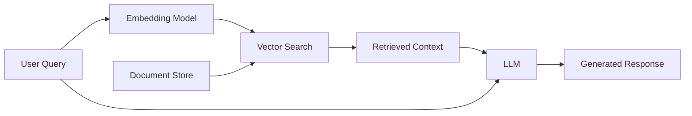

Retrieval-Augmented Generation techniques for enhancing LLM responses with external knowledge.

## Core Idea

**RAG** combines retrieval from external knowledge bases with LLM generation to produce accurate, up-to-date responses without retraining the model.

### Mathematical Foundation

The core retrieval mechanism uses **cosine similarity** in embedding space:

$$\text{similarity}(q, d) = \frac{\mathbf{q} \cdot \mathbf{d}}{||\mathbf{q}|| \cdot ||\mathbf{d}||} = \cos(\theta)$$

where:
- $\mathbf{q}$ is the query embedding vector
- $\mathbf{d}$ is the document chunk embedding vector
- $\theta$ is the angle between vectors

**Key Process:**
1. **Embedding**: Convert query and documents to dense vectors using an embedding model: $\mathbf{q} = E(q)$, $\mathbf{d}_i = E(d_i)$
2. **Retrieval**: Find top-$k$ most similar chunks: $\text{TopK} = \arg\max_{i \in [1,N]} \text{similarity}(\mathbf{q}, \mathbf{d}_i)$
3. **Augmentation**: Inject retrieved context into the prompt: $\text{prompt} = f(q, \text{TopK})$
4. **Generation**: LLM generates response conditioned on augmented prompt: $r = \text{LLM}(\text{prompt})$

This approach enables:
- **Knowledge injection** without model fine-tuning
- **Reduced hallucination** by grounding in retrieved facts
- **Dynamic updates** by refreshing the document store
- **Source attribution** by referencing retrieved chunks

---

## RAG Architecture



---

## Basic RAG Pipeline

```python
from langchain.embeddings import OpenAIEmbeddings
from langchain.vectorstores import Chroma
from langchain.text_splitter import RecursiveCharacterTextSplitter
from langchain.llms import OpenAI
from langchain.chains import RetrievalQA

# 1. Load and split documents
documents = load_documents()
text_splitter = RecursiveCharacterTextSplitter(
    chunk_size=1000,
    chunk_overlap=200
)
texts = text_splitter.split_documents(documents)

# 2. Create embeddings and vector store
embeddings = OpenAIEmbeddings()
vectorstore = Chroma.from_documents(texts, embeddings)

# 3. Create retrieval chain
qa_chain = RetrievalQA.from_chain_type(
    llm=OpenAI(),
    chain_type="stuff",
    retriever=vectorstore.as_retriever(search_kwargs={"k": 4})
)

# 4. Query
response = qa_chain.run("What is the main topic?")
```

---

## Chunking Strategies

### Fixed-Size Chunking

```python
from langchain.text_splitter import CharacterTextSplitter

splitter = CharacterTextSplitter(
    chunk_size=1000,
    chunk_overlap=200,
    separator="\n"
)
chunks = splitter.split_text(text)
```

### Recursive Chunking

```python
from langchain.text_splitter import RecursiveCharacterTextSplitter

splitter = RecursiveCharacterTextSplitter(
    chunk_size=1000,
    chunk_overlap=200,
    separators=["\n\n", "\n", " ", ""]
)
chunks = splitter.split_text(text)
```

### Semantic Chunking

```python
from langchain.text_splitter import SemanticChunker
from langchain.embeddings import OpenAIEmbeddings

splitter = SemanticChunker(
    embeddings=OpenAIEmbeddings(),
    breakpoint_threshold_type="percentile"
)
chunks = splitter.split_text(text)
```

---

## Embedding Models

### OpenAI Embeddings

```python
from langchain.embeddings import OpenAIEmbeddings

embeddings = OpenAIEmbeddings(model="text-embedding-3-large")
vector = embeddings.embed_query("Hello world")
```

### Sentence Transformers

```python
from langchain.embeddings import HuggingFaceEmbeddings

embeddings = HuggingFaceEmbeddings(
    model_name="sentence-transformers/all-mpnet-base-v2"
)
vector = embeddings.embed_query("Hello world")
```

---

## Vector Stores

### Chroma

```python
from langchain.vectorstores import Chroma

vectorstore = Chroma.from_documents(
    documents=texts,
    embedding=embeddings,
    persist_directory="./chroma_db"
)

# Search
results = vectorstore.similarity_search("query", k=4)
```

### FAISS

```python
from langchain.vectorstores import FAISS

vectorstore = FAISS.from_documents(texts, embeddings)
vectorstore.save_local("faiss_index")

# Load
vectorstore = FAISS.load_local("faiss_index", embeddings)
```

### Pinecone

```python
import pinecone
from langchain.vectorstores import Pinecone

pinecone.init(api_key="YOUR_API_KEY", environment="us-west1-gcp")
vectorstore = Pinecone.from_documents(texts, embeddings, index_name="my-index")
```

---

## Retrieval Strategies

### Similarity Search

```python
# Basic similarity
results = vectorstore.similarity_search("query", k=4)

# With scores
results = vectorstore.similarity_search_with_score("query", k=4)
```

### MMR (Maximal Marginal Relevance)

**Core Idea**: Selects documents that are both relevant to the query and diverse from already-selected documents, preventing redundant information.

**Mathematical Formulation**:
$$\text{MMR} = \arg\max_{d_i \in R \setminus S} \left[ \lambda \cdot \text{sim}(q, d_i) - (1-\lambda) \cdot \max_{d_j \in S} \text{sim}(d_i, d_j) \right]$$

where:
- $R$ is the candidate set of retrieved documents
- $S$ is the set of already-selected documents
- $\lambda \in [0,1]$ controls the trade-off (0 = diversity, 1 = relevance)
- $\text{sim}(q, d_i)$ is query-document similarity
- $\text{sim}(d_i, d_j)$ is inter-document similarity

**Key Insight**: The second term penalizes documents similar to already-selected ones, ensuring coverage of different aspects.

Balances relevance and diversity:

```python
results = vectorstore.max_marginal_relevance_search(
    "query",
    k=4,
    fetch_k=20,
    lambda_mult=0.5  # 0=diversity, 1=relevance
)
```

### Hybrid Search

**Core Idea**: Combines **dense** (semantic) and **sparse** (keyword-based) retrieval to leverage both semantic understanding and exact term matching.

**Mathematical Formulation**:
$$\text{score}(q, d) = \alpha \cdot \text{sim}_{\text{dense}}(\mathbf{q}, \mathbf{d}) + (1-\alpha) \cdot \text{BM25}(q, d)$$

where:
- $\text{sim}_{\text{dense}}$ is cosine similarity in embedding space
- $\text{BM25}(q, d)$ is the BM25 ranking function: $\sum_{t \in q} \text{IDF}(t) \cdot \frac{f(t,d) \cdot (k_1 + 1)}{f(t,d) + k_1 \cdot (1 - b + b \cdot \frac{|d|}{\text{avgdl}})}$
- $\alpha \in [0,1]$ controls the weighting

**Key Insight**: Dense vectors capture semantic meaning while sparse retrieval handles exact matches and rare terms effectively.

Combine dense and sparse retrieval:

```python
from langchain.retrievers import EnsembleRetriever
from langchain.retrievers import BM25Retriever

# Dense retriever
dense_retriever = vectorstore.as_retriever()

# Sparse retriever
bm25_retriever = BM25Retriever.from_documents(texts)

# Ensemble
ensemble_retriever = EnsembleRetriever(
    retrievers=[dense_retriever, bm25_retriever],
    weights=[0.5, 0.5]
)
```

---

## Reranking

**Core Idea**: Uses a more powerful (but slower) model to re-rank initial retrieval results, improving precision by considering query-document interactions more deeply.

**Mathematical Formulation**:
$$\text{rerank}(q, D_k) = \text{argsort}_{d \in D_k} \left[ f_{\text{reranker}}(q, d) \right]$$

where:
- $D_k$ are the top-$k$ documents from initial retrieval
- $f_{\text{reranker}}$ is a cross-encoder that jointly encodes query and document
- Cross-encoders compute attention between query and document tokens: $\text{score} = \text{softmax}(\mathbf{Q}\mathbf{K}^T / \sqrt{d_k})\mathbf{V}$

**Key Insight**: Cross-encoders see query-document pairs together, enabling fine-grained relevance scoring, but are too slow for initial retrieval over large corpora.

```python
from langchain.retrievers import ContextualCompressionRetriever
from langchain.retrievers.document_compressors import CohereRerank

# Base retriever
base_retriever = vectorstore.as_retriever(search_kwargs={"k": 20})

# Reranker
compressor = CohereRerank(model="rerank-english-v2.0", top_n=4)

# Compression retriever
compression_retriever = ContextualCompressionRetriever(
    base_compressor=compressor,
    base_retriever=base_retriever
)

results = compression_retriever.get_relevant_documents("query")
```

---

## Query Transformation

### Multi-Query

**Core Idea**: Generates multiple query variations from the original query, then retrieves documents for each variation and merges results, improving recall.

**Mathematical Formulation**:
$$\text{retrieve}(q) = \bigcup_{i=1}^{n} \text{TopK}(E(q_i), D)$$

where:
- $q_i = \text{LLM}(q, \text{"Generate alternative query"})$ for $i \in [1, n]$
- Each $q_i$ retrieves top-$k$ documents
- Results are deduplicated and merged

**Key Insight**: Different phrasings of the same intent may match different document formulations, expanding coverage.

```python
from langchain.retrievers.multi_query import MultiQueryRetriever

retriever = MultiQueryRetriever.from_llm(
    retriever=vectorstore.as_retriever(),
    llm=OpenAI()
)
```

### HyDE (Hypothetical Document Embeddings)

**Core Idea**: Generates a hypothetical answer document using the LLM, then uses its embedding for retrieval instead of the query embedding, bridging the vocabulary gap.

**Mathematical Formulation**:
1. Generate hypothetical document: $d_h = \text{LLM}(q, \text{"Generate answer document"})$
2. Embed hypothetical document: $\mathbf{d}_h = E(d_h)$
3. Retrieve using hypothetical embedding: $\text{TopK} = \arg\max_{d \in D} \text{sim}(\mathbf{d}_h, \mathbf{d})$

**Key Insight**: The hypothetical document uses domain-specific vocabulary that better matches the corpus, improving retrieval quality for technical queries.

```python
from langchain.chains import HypotheticalDocumentEmbedder

hyde_embeddings = HypotheticalDocumentEmbedder.from_llm(
    llm=OpenAI(),
    base_embeddings=embeddings,
    prompt_key="web_search"
)

vectorstore = FAISS.from_documents(texts, hyde_embeddings)
```

---

## Advanced RAG Patterns

### Self-Query

**Core Idea**: Uses LLM to parse natural language queries into structured queries with metadata filters, enabling semantic search combined with structured filtering.

**Mathematical Formulation**:
$$\text{parse}(q) \rightarrow (q_{\text{semantic}}, \mathcal{F})$$

where:
- $q_{\text{semantic}}$ is the semantic query component
- $\mathcal{F} = \{f_1, f_2, \ldots\}$ are metadata filters (e.g., date, source, type)
- Retrieval: $\text{retrieve}(q) = \text{TopK}(\text{sim}(q_{\text{semantic}}, D_{\mathcal{F}}))$ where $D_{\mathcal{F}}$ are documents matching filters

**Key Insight**: Enables queries like "papers about RAG from 2024" by combining semantic search with structured metadata constraints.

```python
from langchain.retrievers.self_query.base import SelfQueryRetriever
from langchain.chains.query_constructor.base import AttributeInfo

metadata_field_info = [
    AttributeInfo(
        name="source",
        description="The source of the document",
        type="string"
    ),
    AttributeInfo(
        name="date",
        description="The date the document was created",
        type="string"
    )
]

retriever = SelfQueryRetriever.from_llm(
    llm=OpenAI(),
    vectorstore=vectorstore,
    document_contents="Research papers",
    metadata_field_info=metadata_field_info
)
```

### Parent Document Retriever

**Core Idea**: Uses small chunks for precise retrieval, but returns larger parent documents for context, balancing retrieval precision with generation context.

**Mathematical Formulation**:
1. Split into small child chunks: $C = \{c_1, c_2, \ldots\}$ where $|c_i| < \text{chunk\_size}$
2. Store parent documents: $P = \{p_1, p_2, \ldots\}$ where $c_i \subseteq p_j$
3. Retrieve child chunks: $C_{\text{retrieved}} = \text{TopK}(\text{sim}(q, C))$
4. Return parent documents: $P_{\text{returned}} = \{p_j : c_i \in C_{\text{retrieved}} \land c_i \subseteq p_j\}$

**Key Insight**: Small chunks improve retrieval precision (better semantic matching), while parent documents provide full context for generation (avoiding truncation).

```python
from langchain.retrievers import ParentDocumentRetriever
from langchain.storage import InMemoryStore

# Small chunks for retrieval
child_splitter = RecursiveCharacterTextSplitter(chunk_size=400)

# Store for parent documents
store = InMemoryStore()

retriever = ParentDocumentRetriever(
    vectorstore=vectorstore,
    docstore=store,
    child_splitter=child_splitter
)
```

---

## Evaluation Metrics

### Retrieval Metrics

```python
from ragas.metrics import (
    context_precision,
    context_recall,
    faithfulness,
    answer_relevancy
)

# Evaluate
results = evaluate(
    dataset,
    metrics=[
        context_precision,
        context_recall,
        faithfulness,
        answer_relevancy
    ]
)
```

---