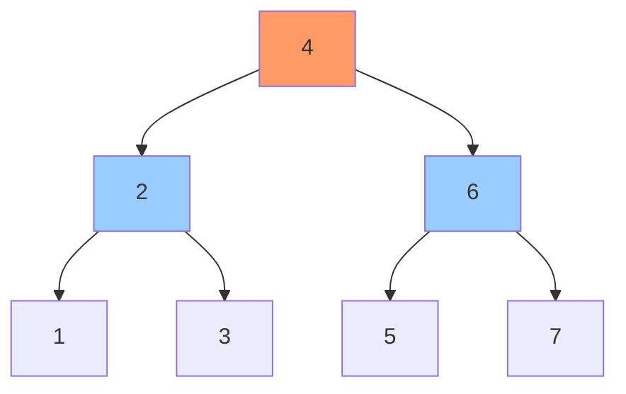

A **binary tree** is a tree data structure where each node has at most two children, referred to as the left child and right child.

## Structure

```go
type TreeNode struct {
    Val   int
    Left  *TreeNode
    Right *TreeNode
}

// Helper to create a node
func NewNode(val int) *TreeNode {
    return &TreeNode{Val: val}
}
```

### Visualization



## Types of Binary Trees

### 1. Full Binary Tree
Every node has either 0 or 2 children.

**Properties**:
- If height is $h$, maximum nodes: $2^{h+1} - 1$
- If $n$ is total nodes, $i$ is internal nodes, $l$ is leaves: $n = 2i + 1$ and $l = i + 1$

### 2. Complete Binary Tree
All levels completely filled except possibly the last level, filled from left to right.

**Properties**:
- Height: $h = \lfloor \log_2 n \rfloor$
- Used in heap implementation

### 3. Perfect Binary Tree
All internal nodes have exactly 2 children, all leaves at same level.

**Properties**:
- Total nodes: $n = 2^{h+1} - 1$
- Leaves: $2^h$
- Internal nodes: $2^h - 1$

### 4. Balanced Binary Tree
Height of left and right subtrees differ by at most 1.

**Balance Factor**:
$$
BF = \text{height}(\text{left}) - \text{height}(\text{right})
$$

Balanced if: $|BF| \leq 1$ for all nodes

```go
func IsBalanced(root *TreeNode) bool {
    _, balanced := checkHeight(root)
    return balanced
}

func checkHeight(node *TreeNode) (int, bool) {
    if node == nil {
        return 0, true
    }
    
    leftHeight, leftBalanced := checkHeight(node.Left)
    if !leftBalanced {
        return 0, false
    }
    
    rightHeight, rightBalanced := checkHeight(node.Right)
    if !rightBalanced {
        return 0, false
    }
    
    if abs(leftHeight - rightHeight) > 1 {
        return 0, false
    }
    
    return 1 + max(leftHeight, rightHeight), true
}

func abs(x int) int {
    if x < 0 {
        return -x
    }
    return x
}
```

## Tree Traversals

### In-Order (Left → Root → Right)

```go
func InOrder(root *TreeNode) []int {
    result := []int{}
    inOrderHelper(root, &result)
    return result
}

func inOrderHelper(node *TreeNode, result *[]int) {
    if node == nil {
        return
    }
    
    inOrderHelper(node.Left, result)
    *result = append(*result, node.Val)
    inOrderHelper(node.Right, result)
}

// Iterative version
func InOrderIterative(root *TreeNode) []int {
    result := []int{}
    stack := []*TreeNode{}
    curr := root
    
    for curr != nil || len(stack) > 0 {
        // Go to leftmost node
        for curr != nil {
            stack = append(stack, curr)
            curr = curr.Left
        }
        
        // Process node
        curr = stack[len(stack)-1]
        stack = stack[:len(stack)-1]
        result = append(result, curr.Val)
        
        // Go to right subtree
        curr = curr.Right
    }
    
    return result
}
```

**Use case**: For BST, produces sorted sequence

**Time**: $O(n)$, **Space**: $O(h)$ where $h$ is height

### Pre-Order (Root → Left → Right)

```go
func PreOrder(root *TreeNode) []int {
    result := []int{}
    preOrderHelper(root, &result)
    return result
}

func preOrderHelper(node *TreeNode, result *[]int) {
    if node == nil {
        return
    }
    
    *result = append(*result, node.Val)
    preOrderHelper(node.Left, result)
    preOrderHelper(node.Right, result)
}

// Iterative version
func PreOrderIterative(root *TreeNode) []int {
    if root == nil {
        return []int{}
    }
    
    result := []int{}
    stack := []*TreeNode{root}
    
    for len(stack) > 0 {
        node := stack[len(stack)-1]
        stack = stack[:len(stack)-1]
        
        result = append(result, node.Val)
        
        // Push right first (so left is processed first)
        if node.Right != nil {
            stack = append(stack, node.Right)
        }
        if node.Left != nil {
            stack = append(stack, node.Left)
        }
    }
    
    return result
}
```

**Use case**: Create copy of tree, prefix expression

### Post-Order (Left → Right → Root)

```go
func PostOrder(root *TreeNode) []int {
    result := []int{}
    postOrderHelper(root, &result)
    return result
}

func postOrderHelper(node *TreeNode, result *[]int) {
    if node == nil {
        return
    }
    
    postOrderHelper(node.Left, result)
    postOrderHelper(node.Right, result)
    *result = append(*result, node.Val)
}
```

**Use case**: Delete tree, postfix expression, calculate directory sizes

### Level-Order (BFS)

```go
func LevelOrder(root *TreeNode) [][]int {
    if root == nil {
        return [][]int{}
    }
    
    result := [][]int{}
    queue := []*TreeNode{root}
    
    for len(queue) > 0 {
        levelSize := len(queue)
        level := []int{}
        
        for i := 0; i < levelSize; i++ {
            node := queue[0]
            queue = queue[1:]
            
            level = append(level, node.Val)
            
            if node.Left != nil {
                queue = append(queue, node.Left)
            }
            if node.Right != nil {
                queue = append(queue, node.Right)
            }
        }
        
        result = append(result, level)
    }
    
    return result
}
```

**Time**: $O(n)$, **Space**: $O(w)$ where $w$ is maximum width

## Common Operations

### 1. Height Calculation

```go
func Height(root *TreeNode) int {
    if root == nil {
        return -1 // or 0 depending on definition
    }
    
    return 1 + max(Height(root.Left), Height(root.Right))
}
```

**Time**: $O(n)$

### 2. Count Nodes

```go
func CountNodes(root *TreeNode) int {
    if root == nil {
        return 0
    }
    
    return 1 + CountNodes(root.Left) + CountNodes(root.Right)
}
```

**Time**: $O(n)$

### 3. Diameter (Longest Path)

```go
func DiameterOfBinaryTree(root *TreeNode) int {
    diameter := 0
    calculateHeight(root, &diameter)
    return diameter
}

func calculateHeight(node *TreeNode, diameter *int) int {
    if node == nil {
        return 0
    }
    
    leftHeight := calculateHeight(node.Left, diameter)
    rightHeight := calculateHeight(node.Right, diameter)
    
    // Update diameter if path through this node is longer
    *diameter = max(*diameter, leftHeight + rightHeight)
    
    return 1 + max(leftHeight, rightHeight)
}
```

**Time**: $O(n)$

### 4. Lowest Common Ancestor

```go
func LowestCommonAncestor(root, p, q *TreeNode) *TreeNode {
    if root == nil || root == p || root == q {
        return root
    }
    
    left := LowestCommonAncestor(root.Left, p, q)
    right := LowestCommonAncestor(root.Right, p, q)
    
    if left != nil && right != nil {
        return root // Both found in different subtrees
    }
    
    if left != nil {
        return left
    }
    return right
}
```

**Time**: $O(n)$

### 5. Maximum Path Sum

```go
func MaxPathSum(root *TreeNode) int {
    maxSum := root.Val
    maxPathSumHelper(root, &maxSum)
    return maxSum
}

func maxPathSumHelper(node *TreeNode, maxSum *int) int {
    if node == nil {
        return 0
    }
    
    // Get max sum from left and right (ignore negative paths)
    leftMax := max(0, maxPathSumHelper(node.Left, maxSum))
    rightMax := max(0, maxPathSumHelper(node.Right, maxSum))
    
    // Max path through this node
    pathThroughNode := node.Val + leftMax + rightMax
    *maxSum = max(*maxSum, pathThroughNode)
    
    // Return max path extending from this node
    return node.Val + max(leftMax, rightMax)
}
```

**Time**: $O(n)$

### 6. Serialize and Deserialize

```go
import "strconv"
import "strings"

func Serialize(root *TreeNode) string {
    if root == nil {
        return "null"
    }
    
    return strconv.Itoa(root.Val) + "," + 
           Serialize(root.Left) + "," + 
           Serialize(root.Right)
}

func Deserialize(data string) *TreeNode {
    values := strings.Split(data, ",")
    index := 0
    return deserializeHelper(&values, &index)
}

func deserializeHelper(values *[]string, index *int) *TreeNode {
    if *index >= len(*values) || (*values)[*index] == "null" {
        *index++
        return nil
    }
    
    val, _ := strconv.Atoi((*values)[*index])
    *index++
    
    node := &TreeNode{Val: val}
    node.Left = deserializeHelper(values, index)
    node.Right = deserializeHelper(values, index)
    
    return node
}
```

**Time**: $O(n)$

### 7. Invert Tree (Mirror)

```go
func InvertTree(root *TreeNode) *TreeNode {
    if root == nil {
        return nil
    }
    
    // Swap children
    root.Left, root.Right = root.Right, root.Left
    
    // Recursively invert subtrees
    InvertTree(root.Left)
    InvertTree(root.Right)
    
    return root
}
```

**Time**: $O(n)$

## Binary Search Tree (BST)

A binary tree where for each node:
- All values in left subtree < node value
- All values in right subtree > node value

### BST Operations

```go
// Insert
func Insert(root *TreeNode, val int) *TreeNode {
    if root == nil {
        return &TreeNode{Val: val}
    }
    
    if val < root.Val {
        root.Left = Insert(root.Left, val)
    } else {
        root.Right = Insert(root.Right, val)
    }
    
    return root
}

// Search
func Search(root *TreeNode, val int) *TreeNode {
    if root == nil || root.Val == val {
        return root
    }
    
    if val < root.Val {
        return Search(root.Left, val)
    }
    return Search(root.Right, val)
}

// Delete
func DeleteNode(root *TreeNode, key int) *TreeNode {
    if root == nil {
        return nil
    }
    
    if key < root.Val {
        root.Left = DeleteNode(root.Left, key)
    } else if key > root.Val {
        root.Right = DeleteNode(root.Right, key)
    } else {
        // Node to delete found
        if root.Left == nil {
            return root.Right
        }
        if root.Right == nil {
            return root.Left
        }
        
        // Node has two children: get inorder successor
        minNode := findMin(root.Right)
        root.Val = minNode.Val
        root.Right = DeleteNode(root.Right, minNode.Val)
    }
    
    return root
}

func findMin(node *TreeNode) *TreeNode {
    for node.Left != nil {
        node = node.Left
    }
    return node
}

// Validate BST
func IsValidBST(root *TreeNode) bool {
    return isValidBSTHelper(root, nil, nil)
}

func isValidBSTHelper(node *TreeNode, min, max *int) bool {
    if node == nil {
        return true
    }
    
    if (min != nil && node.Val <= *min) || (max != nil && node.Val >= *max) {
        return false
    }
    
    return isValidBSTHelper(node.Left, min, &node.Val) &&
           isValidBSTHelper(node.Right, &node.Val, max)
}
```

**BST Time Complexity**:
- Search/Insert/Delete: $O(h)$ where $h$ is height
- Best case (balanced): $O(\log n)$
- Worst case (skewed): $O(n)$

## Complexity Summary

| Operation | Time | Space |
|-----------|------|-------|
| Traversal | $O(n)$ | $O(h)$ |
| Height | $O(n)$ | $O(h)$ |
| Count Nodes | $O(n)$ | $O(h)$ |
| Search (general) | $O(n)$ | $O(h)$ |
| Search (BST) | $O(h)$ | $O(h)$ |
| Insert (BST) | $O(h)$ | $O(h)$ |
| Delete (BST) | $O(h)$ | $O(h)$ |

where $h$ is height: $O(\log n)$ for balanced, $O(n)$ for skewed

## Helper Functions

```go
func max(a, b int) int {
    if a > b {
        return a
    }
    return b
}

func min(a, b int) int {
    if a < b {
        return a
    }
    return b
}
```
