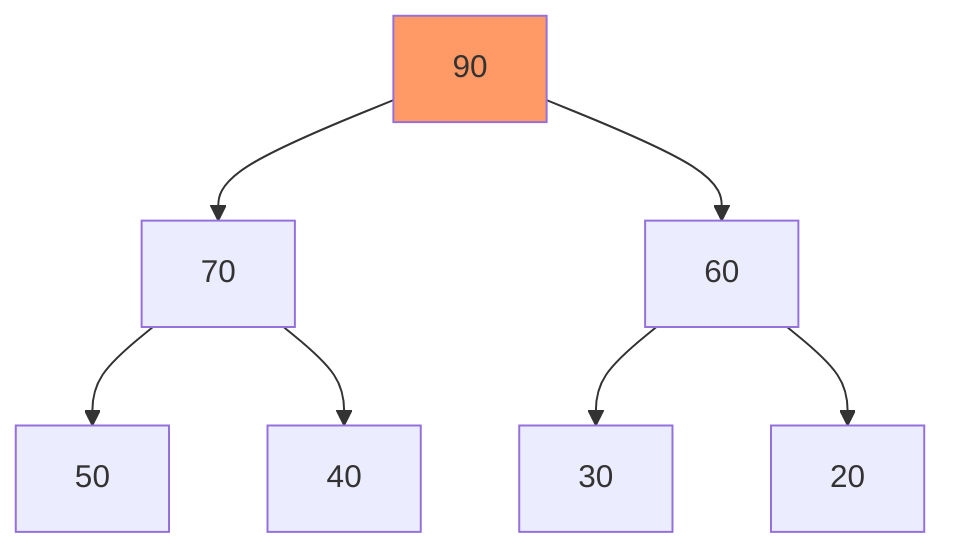
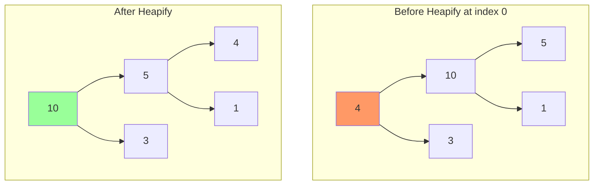

**Heap sort** is a comparison-based sorting algorithm that uses a binary heap data structure. It has guaranteed $O(n \log n)$ time complexity and sorts in-place.

## Algorithm Overview

1. **Build Max Heap**: Convert array into max heap
2. **Extract Max**: Repeatedly remove max element and rebuild heap

### Key Properties

- **Time**: $O(n \log n)$ for all cases
- **Space**: $O(1)$ (in-place)
- **Not stable**: Equal elements may change relative order
- **Not adaptive**: Doesn't benefit from partially sorted data

## Heap Structure

A **max heap** is a complete binary tree where each parent ≥ its children.

### Array Representation

For node at index $i$:
- **Parent**: $\lfloor (i-1)/2 \rfloor$
- **Left child**: $2i + 1$
- **Right child**: $2i + 2$

### Visualization



Array: `[90, 70, 60, 50, 40, 30, 20]`

## Heapify Operation

Maintain heap property by "bubbling down" a node.

```go
// Heapify subtree rooted at index i
// n is size of heap
func heapify(arr []int, n, i int) {
    largest := i
    left := 2*i + 1
    right := 2*i + 2
    
    // If left child is larger than root
    if left < n && arr[left] > arr[largest] {
        largest = left
    }
    
    // If right child is larger than largest so far
    if right < n && arr[right] > arr[largest] {
        largest = right
    }
    
    // If largest is not root
    if largest != i {
        arr[i], arr[largest] = arr[largest], arr[i]
        
        // Recursively heapify the affected subtree
        heapify(arr, n, largest)
    }
}
```

**Time**: $O(\log n)$ - height of heap

### Iterative Heapify

```go
func heapifyIterative(arr []int, n, i int) {
    for {
        largest := i
        left := 2*i + 1
        right := 2*i + 2
        
        if left < n && arr[left] > arr[largest] {
            largest = left
        }
        
        if right < n && arr[right] > arr[largest] {
            largest = right
        }
        
        if largest == i {
            break
        }
        
        arr[i], arr[largest] = arr[largest], arr[i]
        i = largest
    }
}
```

## Build Max Heap

Convert unsorted array into max heap.

```go
func buildMaxHeap(arr []int) {
    n := len(arr)
    
    // Start from last non-leaf node and heapify all nodes
    // Last non-leaf node is at index (n/2 - 1)
    for i := n/2 - 1; i >= 0; i-- {
        heapify(arr, n, i)
    }
}
```

**Time**: $O(n)$ - not $O(n \log n)$!

**Proof**: Most nodes are near bottom (few swaps), fewer nodes near top (many swaps).

$$
T(n) = \sum_{h=0}^{\log n} \frac{n}{2^{h+1}} \times h = O(n)
$$

## Complete Heap Sort

```go
func HeapSort(arr []int) {
    n := len(arr)
    
    // Step 1: Build max heap
    buildMaxHeap(arr)
    
    // Step 2: Extract elements one by one
    for i := n - 1; i > 0; i-- {
        // Move current root (max) to end
        arr[0], arr[i] = arr[i], arr[0]
        
        // Heapify reduced heap
        heapify(arr, i, 0)
    }
}

// Example
func main() {
    arr := []int{12, 11, 13, 5, 6, 7}
    fmt.Println("Before:", arr)
    HeapSort(arr)
    fmt.Println("After:", arr)
    // Output: [5, 6, 7, 11, 12, 13]
}
```

## Step-by-Step Example

**Input**: `[4, 10, 3, 5, 1]`

### Step 1: Build Max Heap

```
Initial: [4, 10, 3, 5, 1]

Heapify index 1: [4, 10, 3, 5, 1] (10 > 5, 1 - no change)
Heapify index 0: [10, 5, 3, 4, 1] (swap 4 and 10, then 4 and 5)

Max Heap: [10, 5, 3, 4, 1]
```

### Step 2: Extract Max

```
[10, 5, 3, 4, 1] → Swap 10 and 1 → [1, 5, 3, 4 | 10]
Heapify: [5, 4, 3, 1 | 10]

[5, 4, 3, 1 | 10] → Swap 5 and 1 → [1, 4, 3 | 5, 10]
Heapify: [4, 1, 3 | 5, 10]

[4, 1, 3 | 5, 10] → Swap 4 and 3 → [3, 1 | 4, 5, 10]
Heapify: [3, 1 | 4, 5, 10]

[3, 1 | 4, 5, 10] → Swap 3 and 1 → [1 | 3, 4, 5, 10]

Final: [1, 3, 4, 5, 10]
```

## Complexity Analysis

### Time Complexity

**Build Heap**: $O(n)$  
**Extract Max** (n times): $n \times O(\log n) = O(n \log n)$

**Total**: $O(n + n \log n) = O(n \log n)$

**All cases**: Best, Average, Worst = $O(n \log n)$

### Space Complexity

**In-place**: $O(1)$ auxiliary space  
**Recursion stack**: $O(\log n)$ for recursive heapify

**Iterative version**: $O(1)$ total space

## Min Heap Sort (Descending Order)

For descending order, use min heap:

```go
func heapifyMin(arr []int, n, i int) {
    smallest := i
    left := 2*i + 1
    right := 2*i + 2
    
    if left < n && arr[left] < arr[smallest] {
        smallest = left
    }
    
    if right < n && arr[right] < arr[smallest] {
        smallest = right
    }
    
    if smallest != i {
        arr[i], arr[smallest] = arr[smallest], arr[i]
        heapifyMin(arr, n, smallest)
    }
}

func HeapSortDescending(arr []int) {
    n := len(arr)
    
    // Build min heap
    for i := n/2 - 1; i >= 0; i-- {
        heapifyMin(arr, n, i)
    }
    
    // Extract min elements
    for i := n - 1; i > 0; i-- {
        arr[0], arr[i] = arr[i], arr[0]
        heapifyMin(arr, i, 0)
    }
}
```

## Optimizations

### 1. Bottom-Up Heapify (Floyd's Method)

More efficient heap construction:

```go
func buildMaxHeapFloyd(arr []int) {
    n := len(arr)
    
    // Build heap from bottom up
    for i := n/2 - 1; i >= 0; i-- {
        // Sift down
        child := 2*i + 1
        for child < n {
            // Find larger child
            if child+1 < n && arr[child+1] > arr[child] {
                child++
            }
            
            // If parent is larger, done
            if arr[i] >= arr[child] {
                break
            }
            
            arr[i], arr[child] = arr[child], arr[i]
            i = child
            child = 2*i + 1
        }
    }
}
```

### 2. Ternary Heap

Use 3 children per node instead of 2:

- **Fewer levels**: $\log_3 n$ instead of $\log_2 n$
- **More comparisons per level**: 3 instead of 2
- **Trade-off**: Better cache locality vs. more comparisons

## Comparison with Other Sorts

| Algorithm | Time (Best) | Time (Avg) | Time (Worst) | Space | Stable | In-Place |
|-----------|-------------|------------|--------------|-------|--------|----------|
| Heap Sort | $O(n \log n)$ | $O(n \log n)$ | $O(n \log n)$ | $O(1)$ | No | Yes |
| Quick Sort | $O(n \log n)$ | $O(n \log n)$ | $O(n^2)$ | $O(\log n)$ | No | Yes |
| Merge Sort | $O(n \log n)$ | $O(n \log n)$ | $O(n \log n)$ | $O(n)$ | Yes | No |
| Insertion Sort | $O(n)$ | $O(n^2)$ | $O(n^2)$ | $O(1)$ | Yes | Yes |

## Advantages

✅ **Guaranteed $O(n \log n)$**: No worst-case degradation like quick sort  
✅ **In-place**: $O(1)$ extra space  
✅ **No recursion needed**: Can be fully iterative  
✅ **Predictable**: Performance is consistent

## Disadvantages

❌ **Not stable**: Equal elements may change order  
❌ **Not adaptive**: Doesn't benefit from partial sorting  
❌ **Cache unfriendly**: Random memory access pattern  
❌ **Slower in practice**: Higher constant factors than quick sort

## Applications

### 1. Priority Queue

Heap sort is based on heap data structure, which is perfect for priority queues.

### 2. K Largest/Smallest Elements

```go
func FindKLargest(arr []int, k int) []int {
    // Build max heap
    buildMaxHeap(arr)
    
    result := make([]int, k)
    n := len(arr)
    
    // Extract k largest
    for i := 0; i < k; i++ {
        result[i] = arr[0]
        arr[0], arr[n-1-i] = arr[n-1-i], arr[0]
        heapify(arr, n-1-i, 0)
    }
    
    return result
}
```

**Time**: $O(n + k \log n)$

### 3. Median Maintenance

Use two heaps (max heap for lower half, min heap for upper half) to maintain running median.

### 4. External Sorting

Heap sort is useful for external sorting when data doesn't fit in memory.

## When to Use Heap Sort

✅ **Use when**:
- Need guaranteed $O(n \log n)$ performance
- Memory is limited (in-place sorting)
- Worst-case performance matters
- Implementing priority queue
- Finding k largest/smallest elements

❌ **Don't use when**:
- Stability is required (use merge sort)
- Data is nearly sorted (use insertion sort or tim sort)
- Average-case performance is critical (use quick sort)
- Cache efficiency matters (use quick sort or merge sort)

## Complete Implementation with Comments

```go
package main

import "fmt"

// HeapSort sorts array in ascending order
func HeapSort(arr []int) {
    n := len(arr)
    
    // Build max heap
    // Start from last non-leaf node
    for i := n/2 - 1; i >= 0; i-- {
        heapify(arr, n, i)
    }
    
    // Extract elements from heap one by one
    for i := n - 1; i > 0; i-- {
        // Move current root (max) to end
        arr[0], arr[i] = arr[i], arr[0]
        
        // Call heapify on reduced heap
        heapify(arr, i, 0)
    }
}

// heapify maintains max heap property
// n is size of heap, i is index of root
func heapify(arr []int, n, i int) {
    largest := i       // Initialize largest as root
    left := 2*i + 1    // Left child
    right := 2*i + 2   // Right child
    
    // If left child exists and is greater than root
    if left < n && arr[left] > arr[largest] {
        largest = left
    }
    
    // If right child exists and is greater than largest so far
    if right < n && arr[right] > arr[largest] {
        largest = right
    }
    
    // If largest is not root
    if largest != i {
        arr[i], arr[largest] = arr[largest], arr[i]
        
        // Recursively heapify the affected subtree
        heapify(arr, n, largest)
    }
}

func main() {
    arr := []int{12, 11, 13, 5, 6, 7, 3, 2, 9, 1}
    fmt.Println("Original:", arr)
    
    HeapSort(arr)
    fmt.Println("Sorted:", arr)
    
    // Output:
    // Original: [12 11 13 5 6 7 3 2 9 1]
    // Sorted: [1 2 3 5 6 7 9 11 12 13]
}
```

## Visualization of Heapify



## Common Interview Problems

### 1. Kth Largest Element

Use heap sort or partial heap construction.

### 2. Sort Nearly Sorted Array

If array is k-sorted (each element is at most k positions away), use min heap of size k+1.

### 3. Merge K Sorted Arrays

Use min heap to efficiently merge k sorted arrays.

