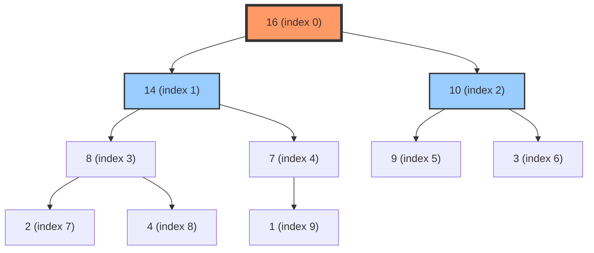
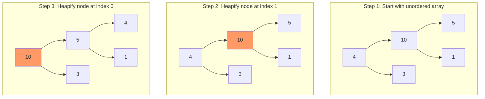

A **heap** is a specialized tree-based data structure that satisfies the heap property. It's commonly used to implement priority queues and for efficient sorting (heapsort).

## Heap Property

### Max-Heap Property
For every node $i$ other than the root:

$$
A[\text{parent}(i)] \geq A[i]
$$

The parent's value is greater than or equal to its children's values. The maximum element is at the root.

### Min-Heap Property
For every node $i$ other than the root:

$$
A[\text{parent}(i)] \leq A[i]
$$

The parent's value is less than or equal to its children's values. The minimum element is at the root.

## Binary Heap Structure

A binary heap is a **complete binary tree** stored as an array. For a node at index $i$:

- **Parent index**: $\lfloor (i-1)/2 \rfloor$
- **Left child index**: $2i + 1$
- **Right child index**: $2i + 2$

### Array Representation



**Array**: `[16, 14, 10, 8, 7, 9, 3, 2, 4, 1]`

## Core Operations

### 1. Heapify (Bubble Down)

Maintains the heap property by moving a node down the tree.

**Time Complexity**: $O(\log n)$

**Process**:
1. Compare node with its children
2. If heap property is violated, swap with the larger child (max-heap) or smaller child (min-heap)
3. Recursively heapify the affected subtree

**Mathematical Analysis**:
- Height of heap: $h = \lfloor \log_2 n \rfloor$
- Maximum swaps: $h = O(\log n)$

```go
// MaxHeap implementation
type MaxHeap struct {
    items []int
}

// Heapify maintains max-heap property at index i
func (h *MaxHeap) heapify(i int) {
    n := len(h.items)
    largest := i
    left := 2*i + 1
    right := 2*i + 2
    
    // Find largest among node and its children
    if left < n && h.items[left] > h.items[largest] {
        largest = left
    }
    if right < n && h.items[right] > h.items[largest] {
        largest = right
    }
    
    // If largest is not root, swap and continue heapifying
    if largest != i {
        h.items[i], h.items[largest] = h.items[largest], h.items[i]
        h.heapify(largest)
    }
}
```

### 2. Bubble Up (Sift Up)

Moves a node up the tree to restore heap property.

**Time Complexity**: $O(\log n)$

```go
// bubbleUp moves element at index i up to restore heap property
func (h *MaxHeap) bubbleUp(i int) {
    for i > 0 {
        parent := (i - 1) / 2
        
        if h.items[parent] >= h.items[i] {
            break // Heap property satisfied
        }
        
        // Swap with parent
        h.items[i], h.items[parent] = h.items[parent], h.items[i]
        i = parent
    }
}
```

### 3. Insert

Add a new element to the heap.

**Time Complexity**: $O(\log n)$

```go
// Insert adds a new element to the heap
func (h *MaxHeap) Insert(value int) {
    // Add element at the end
    h.items = append(h.items, value)
    
    // Bubble up to restore heap property
    h.bubbleUp(len(h.items) - 1)
}

// Example
func main() {
    heap := &MaxHeap{}
    heap.Insert(10)
    heap.Insert(5)
    heap.Insert(15)
    heap.Insert(3)
    
    fmt.Println(heap.items) // [15, 10, 5, 3]
}
```

### 4. Extract Max/Min

Remove and return the root element.

**Time Complexity**: $O(\log n)$

```go
// ExtractMax removes and returns the maximum element
func (h *MaxHeap) ExtractMax() (int, error) {
    if len(h.items) == 0 {
        return 0, errors.New("heap is empty")
    }
    
    // Store root value
    max := h.items[0]
    
    // Move last element to root
    lastIdx := len(h.items) - 1
    h.items[0] = h.items[lastIdx]
    h.items = h.items[:lastIdx]
    
    // Heapify root
    if len(h.items) > 0 {
        h.heapify(0)
    }
    
    return max, nil
}

// Example
func main() {
    heap := &MaxHeap{items: []int{16, 14, 10, 8, 7, 9, 3, 2, 4, 1}}
    
    max, _ := heap.ExtractMax()
    fmt.Println(max)         // Output: 16
    fmt.Println(heap.items)  // [14, 8, 10, 4, 7, 9, 3, 2, 1]
}
```

### 5. Peek

Return the root element without removing it.

**Time Complexity**: $O(1)$

```go
// Peek returns the maximum element without removing it
func (h *MaxHeap) Peek() (int, error) {
    if len(h.items) == 0 {
        return 0, errors.New("heap is empty")
    }
    return h.items[0], nil
}
```

### 6. Build Heap

Convert an arbitrary array into a heap.

**Time Complexity**: $O(n)$ - surprisingly linear!

**Process**:
1. Start from the last non-leaf node: $\lfloor n/2 \rfloor - 1$
2. Heapify each node moving backwards to the root

**Why $O(n)$?**

The sum of work done at each level:

$$
\sum_{h=0}^{\lfloor \log n \rfloor} \frac{n}{2^{h+1}} \cdot h = O(n)
$$

Most nodes are near the leaves and require minimal work. Only a few nodes near the root require $O(\log n)$ operations.

```go
// BuildMaxHeap converts array to max-heap in-place
func BuildMaxHeap(arr []int) *MaxHeap {
    h := &MaxHeap{items: arr}
    n := len(arr)
    
    // Start from last non-leaf node and heapify all
    for i := n/2 - 1; i >= 0; i-- {
        h.heapify(i)
    }
    
    return h
}

// Example
func main() {
    arr := []int{4, 10, 3, 5, 1}
    heap := BuildMaxHeap(arr)
    fmt.Println(heap.items) // [10, 5, 3, 4, 1]
}
```

## Heapify Process Visualization



## Complexity Summary

| Operation | Time Complexity |
|-----------|----------------|
| Insert | $O(\log n)$ |
| Extract Max/Min | $O(\log n)$ |
| Peek | $O(1)$ |
| Heapify | $O(\log n)$ |
| Build Heap | $O(n)$ |
| Search | $O(n)$ |

**Space Complexity**: $O(1)$ auxiliary (in-place operations)

## Complete Go Implementation

```go
package main

import (
    "errors"
    "fmt"
)

type MaxHeap struct {
    items []int
}

func (h *MaxHeap) parent(i int) int { return (i - 1) / 2 }
func (h *MaxHeap) left(i int) int   { return 2*i + 1 }
func (h *MaxHeap) right(i int) int  { return 2*i + 2 }

func (h *MaxHeap) swap(i, j int) {
    h.items[i], h.items[j] = h.items[j], h.items[i]
}

func (h *MaxHeap) heapify(i int) {
    n := len(h.items)
    largest := i
    left := h.left(i)
    right := h.right(i)
    
    if left < n && h.items[left] > h.items[largest] {
        largest = left
    }
    if right < n && h.items[right] > h.items[largest] {
        largest = right
    }
    
    if largest != i {
        h.swap(i, largest)
        h.heapify(largest)
    }
}

func (h *MaxHeap) bubbleUp(i int) {
    for i > 0 && h.items[h.parent(i)] < h.items[i] {
        p := h.parent(i)
        h.swap(i, p)
        i = p
    }
}

func (h *MaxHeap) Insert(value int) {
    h.items = append(h.items, value)
    h.bubbleUp(len(h.items) - 1)
}

func (h *MaxHeap) ExtractMax() (int, error) {
    if len(h.items) == 0 {
        return 0, errors.New("heap is empty")
    }
    
    max := h.items[0]
    lastIdx := len(h.items) - 1
    h.items[0] = h.items[lastIdx]
    h.items = h.items[:lastIdx]
    
    if len(h.items) > 0 {
        h.heapify(0)
    }
    
    return max, nil
}

func (h *MaxHeap) Peek() (int, error) {
    if len(h.items) == 0 {
        return 0, errors.New("heap is empty")
    }
    return h.items[0], nil
}

func (h *MaxHeap) Size() int {
    return len(h.items)
}

func BuildMaxHeap(arr []int) *MaxHeap {
    h := &MaxHeap{items: make([]int, len(arr))}
    copy(h.items, arr)
    
    for i := len(arr)/2 - 1; i >= 0; i-- {
        h.heapify(i)
    }
    
    return h
}

// Heapsort using heap
func HeapSort(arr []int) []int {
    heap := BuildMaxHeap(arr)
    result := make([]int, len(arr))
    
    for i := len(arr) - 1; i >= 0; i-- {
        result[i], _ = heap.ExtractMax()
    }
    
    return result
}

func main() {
    // Example usage
    heap := &MaxHeap{}
    
    values := []int{4, 10, 3, 5, 1, 15, 7}
    for _, v := range values {
        heap.Insert(v)
        fmt.Printf("Inserted %d: %v\n", v, heap.items)
    }
    
    fmt.Println("\nExtracting max values:")
    for heap.Size() > 0 {
        max, _ := heap.ExtractMax()
        fmt.Printf("Extracted %d, remaining: %v\n", max, heap.items)
    }
    
    // Build heap from array
    arr := []int{4, 10, 3, 5, 1}
    heap2 := BuildMaxHeap(arr)
    fmt.Printf("\nBuilt heap from %v: %v\n", arr, heap2.items)
    
    // Heapsort
    unsorted := []int{4, 10, 3, 5, 1, 15, 7}
    sorted := HeapSort(unsorted)
    fmt.Printf("\nHeapsort %v: %v\n", unsorted, sorted)
}
```

## Min-Heap Implementation

```go
type MinHeap struct {
    items []int
}

func (h *MinHeap) heapify(i int) {
    n := len(h.items)
    smallest := i
    left := 2*i + 1
    right := 2*i + 2
    
    if left < n && h.items[left] < h.items[smallest] {
        smallest = left
    }
    if right < n && h.items[right] < h.items[smallest] {
        smallest = right
    }
    
    if smallest != i {
        h.items[i], h.items[smallest] = h.items[smallest], h.items[i]
        h.heapify(smallest)
    }
}

func (h *MinHeap) Insert(value int) {
    h.items = append(h.items, value)
    i := len(h.items) - 1
    
    for i > 0 {
        parent := (i - 1) / 2
        if h.items[parent] <= h.items[i] {
            break
        }
        h.items[i], h.items[parent] = h.items[parent], h.items[i]
        i = parent
    }
}

func (h *MinHeap) ExtractMin() (int, error) {
    if len(h.items) == 0 {
        return 0, errors.New("heap is empty")
    }
    
    min := h.items[0]
    lastIdx := len(h.items) - 1
    h.items[0] = h.items[lastIdx]
    h.items = h.items[:lastIdx]
    
    if len(h.items) > 0 {
        h.heapify(0)
    }
    
    return min, nil
}
```

## Applications

### 1. Priority Queue

```go
type Task struct {
    name     string
    priority int
}

type PriorityQueue struct {
    heap *MaxHeap
    tasks map[int][]Task
}

func (pq *PriorityQueue) Enqueue(task Task) {
    pq.heap.Insert(task.priority)
    pq.tasks[task.priority] = append(pq.tasks[task.priority], task)
}

func (pq *PriorityQueue) Dequeue() (Task, error) {
    priority, err := pq.heap.ExtractMax()
    if err != nil {
        return Task{}, err
    }
    
    tasks := pq.tasks[priority]
    task := tasks[0]
    pq.tasks[priority] = tasks[1:]
    
    return task, nil
}
```

### 2. Heapsort

Sort an array in $O(n \log n)$ time:
1. Build max-heap: $O(n)$
2. Extract max $n$ times: $O(n \log n)$

Total: $O(n \log n)$

### 3. K-th Largest/Smallest Element

Use a min-heap of size $k$ to find the $k$-th largest element in $O(n \log k)$ time.

```go
func FindKthLargest(nums []int, k int) int {
    minHeap := &MinHeap{}
    
    for _, num := range nums {
        minHeap.Insert(num)
        if minHeap.Size() > k {
            minHeap.ExtractMin()
        }
    }
    
    result, _ := minHeap.Peek()
    return result
}
```

### 4. Merge K Sorted Arrays

```go
type HeapNode struct {
    value    int
    arrayIdx int
    elemIdx  int
}

func MergeKSortedArrays(arrays [][]int) []int {
    // Use min-heap to track smallest element from each array
    // Time: O(N log k) where N is total elements, k is number of arrays
    
    result := []int{}
    // Implementation details omitted for brevity
    return result
}
```

## Heap vs. Binary Search Tree

| Feature | Heap | BST |
|---------|------|-----|
| Structure | Complete binary tree | Can be unbalanced |
| Ordering | Partial (heap property) | Total (in-order traversal) |
| Find min/max | $O(1)$ | $O(h)$, $O(\log n)$ if balanced |
| Search arbitrary | $O(n)$ | $O(h)$, $O(\log n)$ if balanced |
| Insert | $O(\log n)$ | $O(h)$, $O(\log n)$ if balanced |
| Delete | $O(\log n)$ | $O(h)$, $O(\log n)$ if balanced |
| Space efficiency | Compact (array) | Pointers overhead |

## When to Use Heaps

✅ **Use when**:
- Need repeated access to min/max element
- Priority-based processing
- Don't need to search for arbitrary elements
- Want $O(1)$ space overhead

❌ **Don't use when**:
- Need to search for arbitrary elements frequently
- Need sorted order of all elements
- Need to find k-th smallest efficiently (use selection algorithms instead)
