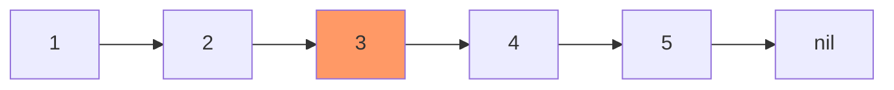
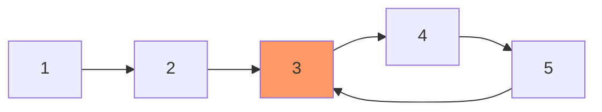
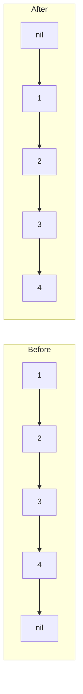
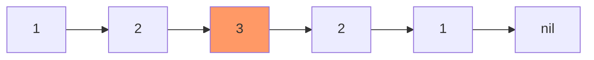
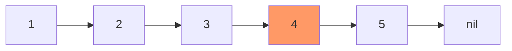
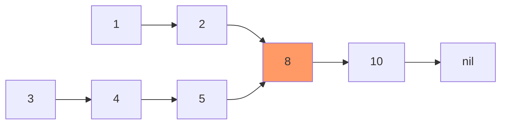
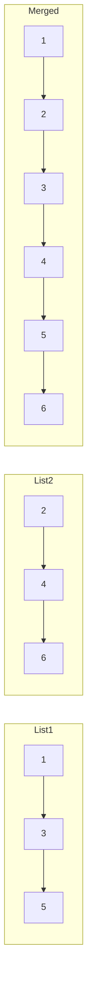
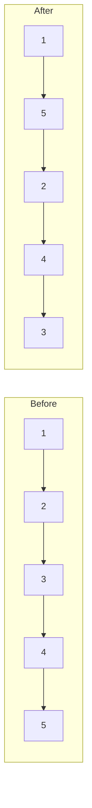

Optimal techniques for common linked list operations using pointer manipulation, particularly the **two-pointer** (slow/fast) and **three-pointer** techniques.

## Linked List Structure

```go
type ListNode struct {
    Val  int
    Next *ListNode
}

// Helper to create a list from array
func CreateList(values []int) *ListNode {
    if len(values) == 0 {
        return nil
    }
    
    head := &ListNode{Val: values[0]}
    current := head
    
    for i := 1; i < len(values); i++ {
        current.Next = &ListNode{Val: values[i]}
        current = current.Next
    }
    
    return head
}

// Helper to print list
func PrintList(head *ListNode) {
    for head != nil {
        fmt.Printf("%d -> ", head.Val)
        head = head.Next
    }
    fmt.Println("nil")
}
```

## Two-Pointer Technique (Slow/Fast)

Use two pointers moving at different speeds.

**Pattern**:
- **Slow pointer**: Moves 1 step at a time
- **Fast pointer**: Moves 2 steps at a time

## 1. Find Middle of List

**For odd length**: Return middle node  
**For even length**: Return second middle node

### Visualization



Slow moves: 1 → 2 → **3**  
Fast moves: 1 → 3 → 5 → nil

### Go Implementation

```go
func FindMiddle(head *ListNode) *ListNode {
    if head == nil {
        return nil
    }
    
    slow, fast := head, head
    
    // When fast reaches end, slow is at middle
    for fast != nil && fast.Next != nil {
        slow = slow.Next      // Move 1 step
        fast = fast.Next.Next // Move 2 steps
    }
    
    return slow
}

// Example
func main() {
    list := CreateList([]int{1, 2, 3, 4, 5})
    middle := FindMiddle(list)
    fmt.Println("Middle:", middle.Val) // 3
}
```

**Time**: $O(n)$, **Space**: $O(1)$

## 2. Detect Cycle

Detect if list has a cycle using Floyd's algorithm.

### Visualization



### Go Implementation

```go
func HasCycle(head *ListNode) bool {
    if head == nil {
        return false
    }
    
    slow, fast := head, head
    
    for fast != nil && fast.Next != nil {
        slow = slow.Next
        fast = fast.Next.Next
        
        if slow == fast {
            return true // Cycle detected
        }
    }
    
    return false
}
```

**Time**: $O(n)$, **Space**: $O(1)$

## 3. Find Cycle Start

Find the node where cycle begins.

### Algorithm

1. Detect cycle using slow/fast pointers
2. Move slow to head
3. Move both pointers 1 step at a time
4. They meet at cycle start

### Go Implementation

```go
func DetectCycle(head *ListNode) *ListNode {
    if head == nil {
        return nil
    }
    
    // Phase 1: Detect cycle
    slow, fast := head, head
    hasCycle := false
    
    for fast != nil && fast.Next != nil {
        slow = slow.Next
        fast = fast.Next.Next
        
        if slow == fast {
            hasCycle = true
            break
        }
    }
    
    if !hasCycle {
        return nil
    }
    
    // Phase 2: Find cycle start
    slow = head
    for slow != fast {
        slow = slow.Next
        fast = fast.Next
    }
    
    return slow
}
```

**Time**: $O(n)$, **Space**: $O(1)$

## 4. Reverse Linked List

### Visualization



### Go Implementation

```go
func ReverseList(head *ListNode) *ListNode {
    var prev *ListNode
    curr := head
    
    for curr != nil {
        next := curr.Next  // Save next
        curr.Next = prev   // Reverse pointer
        prev = curr        // Move prev forward
        curr = next        // Move curr forward
    }
    
    return prev // New head
}

// Example
func main() {
    list := CreateList([]int{1, 2, 3, 4, 5})
    PrintList(list)           // 1 -> 2 -> 3 -> 4 -> 5 -> nil
    reversed := ReverseList(list)
    PrintList(reversed)       // 5 -> 4 -> 3 -> 2 -> 1 -> nil
}
```

**Time**: $O(n)$, **Space**: $O(1)$

## 5. Check Palindrome

### Visualization



### Algorithm

1. Find middle using slow/fast pointers
2. Reverse second half
3. Compare first half with reversed second half

### Go Implementation

```go
func IsPalindrome(head *ListNode) bool {
    if head == nil || head.Next == nil {
        return true
    }
    
    // Find middle
    slow, fast := head, head
    for fast != nil && fast.Next != nil {
        slow = slow.Next
        fast = fast.Next.Next
    }
    
    // Reverse second half
    secondHalf := ReverseList(slow)
    
    // Compare
    firstHalf := head
    for secondHalf != nil {
        if firstHalf.Val != secondHalf.Val {
            return false
        }
        firstHalf = firstHalf.Next
        secondHalf = secondHalf.Next
    }
    
    return true
}
```

**Time**: $O(n)$, **Space**: $O(1)$

## 6. Remove N-th Node From End

### Visualization



Remove 2nd from end (node 4)

### Algorithm

Use two pointers with N gap between them.

### Go Implementation

```go
func RemoveNthFromEnd(head *ListNode, n int) *ListNode {
    dummy := &ListNode{Next: head}
    first, second := dummy, dummy
    
    // Move first n+1 steps ahead
    for i := 0; i <= n; i++ {
        first = first.Next
    }
    
    // Move both until first reaches end
    for first != nil {
        first = first.Next
        second = second.Next
    }
    
    // Remove node
    second.Next = second.Next.Next
    
    return dummy.Next
}
```

**Time**: $O(n)$, **Space**: $O(1)$

## 7. Find Intersection of Two Lists

### Visualization



### Go Implementation

```go
func GetIntersectionNode(headA, headB *ListNode) *ListNode {
    if headA == nil || headB == nil {
        return nil
    }
    
    pA, pB := headA, headB
    
    // Traverse both lists
    // When reaching end, jump to other list's head
    for pA != pB {
        if pA == nil {
            pA = headB
        } else {
            pA = pA.Next
        }
        
        if pB == nil {
            pB = headA
        } else {
            pB = pB.Next
        }
    }
    
    return pA // Either intersection or nil
}
```

**Time**: $O(m + n)$, **Space**: $O(1)$

**Why this works**: Both pointers travel same distance: $m + n - k$ where $k$ is common length.

## 8. Merge Two Sorted Lists

### Visualization



### Go Implementation

```go
func MergeTwoLists(l1, l2 *ListNode) *ListNode {
    dummy := &ListNode{}
    curr := dummy
    
    for l1 != nil && l2 != nil {
        if l1.Val <= l2.Val {
            curr.Next = l1
            l1 = l1.Next
        } else {
            curr.Next = l2
            l2 = l2.Next
        }
        curr = curr.Next
    }
    
    // Attach remaining nodes
    if l1 != nil {
        curr.Next = l1
    } else {
        curr.Next = l2
    }
    
    return dummy.Next
}
```

**Time**: $O(m + n)$, **Space**: $O(1)$

## 9. Compare Two Lists (Equality)

Check if two lists are identical.

```go
func AreListsEqual(l1, l2 *ListNode) bool {
    for l1 != nil && l2 != nil {
        if l1.Val != l2.Val {
            return false
        }
        l1 = l1.Next
        l2 = l2.Next
    }
    
    // Both should be nil
    return l1 == nil && l2 == nil
}
```

**Time**: $O(min(m, n))$, **Space**: $O(1)$

## 10. Find Difference of Two Lists (A - B)

Find nodes in list A that are not in list B, with $O(1)$ space.

### Algorithm

For each node in A, traverse B to check if it exists. Not efficient but $O(1)$ space.

```go
// Returns values in A that are not in B
func ListDifference(a, b *ListNode) []int {
    result := []int{}
    
    for currA := a; currA != nil; currA = currA.Next {
        found := false
        
        // Check if currA.Val exists in B
        for currB := b; currB != nil; currB = currB.Next {
            if currA.Val == currB.Val {
                found = true
                break
            }
        }
        
        if !found {
            result = append(result, currA.Val)
        }
    }
    
    return result
}
```

**Time**: $O(m \times n)$, **Space**: $O(1)$ (excluding result)

### Better Approach: Sort First

If we can modify the lists, sort them first:

```go
func ListDifferenceSorted(a, b *ListNode) []int {
    // Assume lists are sorted or sort them first
    result := []int{}
    
    for a != nil && b != nil {
        if a.Val < b.Val {
            result = append(result, a.Val)
            a = a.Next
        } else if a.Val > b.Val {
            b = b.Next
        } else {
            // Equal, skip both
            a = a.Next
            b = b.Next
        }
    }
    
    // Add remaining from A
    for a != nil {
        result = append(result, a.Val)
        a = a.Next
    }
    
    return result
}
```

**Time**: $O(m + n)$ if already sorted, **Space**: $O(1)$

## 11. Find Intersection (Common Elements) with O(1) Space

Find values that appear in both lists.

```go
// Returns values that appear in both A and B
func ListIntersection(a, b *ListNode) []int {
    result := []int{}
    
    for currA := a; currA != nil; currA = currA.Next {
        // Check if currA.Val exists in B
        for currB := b; currB != nil; currB = currB.Next {
            if currA.Val == currB.Val {
                // Check if not already in result
                alreadyAdded := false
                for _, v := range result {
                    if v == currA.Val {
                        alreadyAdded = true
                        break
                    }
                }
                if !alreadyAdded {
                    result = append(result, currA.Val)
                }
                break
            }
        }
    }
    
    return result
}

// Better: If lists are sorted
func ListIntersectionSorted(a, b *ListNode) []int {
    result := []int{}
    
    for a != nil && b != nil {
        if a.Val < b.Val {
            a = a.Next
        } else if a.Val > b.Val {
            b = b.Next
        } else {
            // Equal - add to result
            if len(result) == 0 || result[len(result)-1] != a.Val {
                result = append(result, a.Val)
            }
            a = a.Next
            b = b.Next
        }
    }
    
    return result
}
```

**Time**: $O(m \times n)$ unsorted, $O(m + n)$ sorted  
**Space**: $O(1)$ (excluding result)

## 12. Reorder List (L0 → Ln → L1 → Ln-1 → ...)

### Visualization



### Go Implementation

```go
func ReorderList(head *ListNode) {
    if head == nil || head.Next == nil {
        return
    }
    
    // Find middle
    slow, fast := head, head
    for fast != nil && fast.Next != nil {
        slow = slow.Next
        fast = fast.Next.Next
    }
    
    // Reverse second half
    var prev *ListNode
    curr := slow
    for curr != nil {
        next := curr.Next
        curr.Next = prev
        prev = curr
        curr = next
    }
    
    // Merge two halves
    first, second := head, prev
    for second.Next != nil {
        temp1, temp2 := first.Next, second.Next
        first.Next = second
        second.Next = temp1
        first, second = temp1, temp2
    }
}
```

**Time**: $O(n)$, **Space**: $O(1)$

## Summary Table

| Operation | Time | Space | Technique |
|-----------|------|-------|-----------|
| Find Middle | $O(n)$ | $O(1)$ | Slow/Fast pointers |
| Detect Cycle | $O(n)$ | $O(1)$ | Floyd's algorithm |
| Find Cycle Start | $O(n)$ | $O(1)$ | Two-phase slow/fast |
| Reverse | $O(n)$ | $O(1)$ | Three pointers |
| Check Palindrome | $O(n)$ | $O(1)$ | Find middle + reverse |
| Remove N-th from End | $O(n)$ | $O(1)$ | Two pointers with gap |
| Find Intersection | $O(m+n)$ | $O(1)$ | Two pointers |
| Merge Sorted | $O(m+n)$ | $O(1)$ | Two pointers |
| Compare Lists | $O(min(m,n))$ | $O(1)$ | Simultaneous traversal |
| Difference (unsorted) | $O(m \times n)$ | $O(1)$ | Nested traversal |
| Difference (sorted) | $O(m+n)$ | $O(1)$ | Two pointers |
| Intersection (sorted) | $O(m+n)$ | $O(1)$ | Two pointers |

## Key Patterns

1. **Slow/Fast Pointers**: Middle, cycle detection
2. **Two Pointers with Gap**: N-th from end
3. **Three Pointers**: Reverse list
4. **Dummy Node**: Simplify edge cases
5. **Two-List Traversal**: Merge, intersection, comparison
