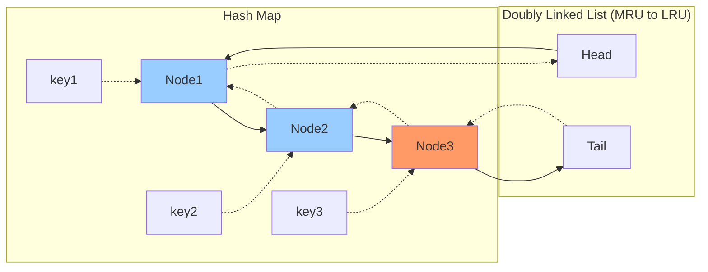
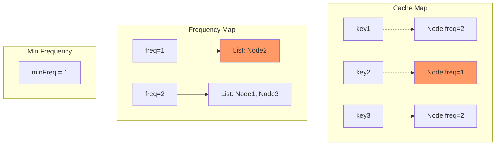
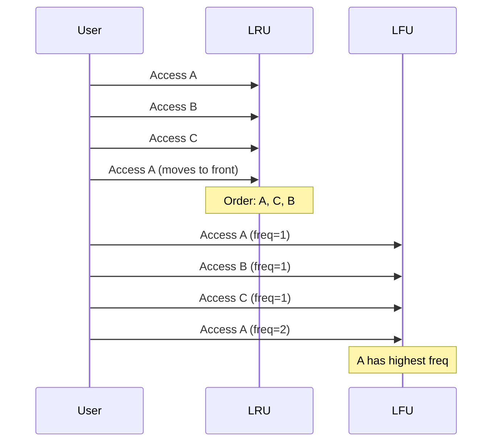

Cache replacement policies determine which items to evict when the cache is full. **LRU (Least Recently Used)** and **LFU (Least Frequently Used)** are two popular strategies.

## LRU Cache (Least Recently Used)

Evicts the least recently accessed item when cache is full.

### Operations

- **get(key)**: Return value if exists, mark as recently used
- **put(key, value)**: Insert/update key-value, mark as recently used, evict LRU if full

### Time Complexity Requirements

Both operations should be $O(1)$.

## LRU: Optimal Implementation

### Data Structures

**Hash Map + Doubly Linked List**

**Hash Map**: key → node for $O(1)$ lookup

**Doubly Linked List**: Maintains access order
- Head: Most recently used
- Tail: Least recently used

### Structure Visualization



### Complete Go Implementation

```go
package main

import "fmt"

// Node represents a doubly linked list node
type Node struct {
    key, value int
    prev, next *Node
}

// LRUCache implements LRU cache with O(1) operations
type LRUCache struct {
    capacity int
    cache    map[int]*Node
    head     *Node // Dummy head (most recent)
    tail     *Node // Dummy tail (least recent)
}

// Constructor creates a new LRU cache
func Constructor(capacity int) LRUCache {
    lru := LRUCache{
        capacity: capacity,
        cache:    make(map[int]*Node),
        head:     &Node{},
        tail:     &Node{},
    }
    lru.head.next = lru.tail
    lru.tail.prev = lru.head
    return lru
}

// removeNode removes a node from the list
func (lru *LRUCache) removeNode(node *Node) {
    node.prev.next = node.next
    node.next.prev = node.prev
}

// addToHead adds a node right after head (most recent)
func (lru *LRUCache) addToHead(node *Node) {
    node.next = lru.head.next
    node.prev = lru.head
    lru.head.next.prev = node
    lru.head.next = node
}

// moveToHead moves an existing node to head
func (lru *LRUCache) moveToHead(node *Node) {
    lru.removeNode(node)
    lru.addToHead(node)
}

// removeTail removes and returns the tail node (LRU)
func (lru *LRUCache) removeTail() *Node {
    node := lru.tail.prev
    lru.removeNode(node)
    return node
}

// Get returns the value of the key if exists, otherwise -1
func (lru *LRUCache) Get(key int) int {
    if node, exists := lru.cache[key]; exists {
        lru.moveToHead(node) // Mark as recently used
        return node.value
    }
    return -1
}

// Put inserts or updates the key-value pair
func (lru *LRUCache) Put(key int, value int) {
    if node, exists := lru.cache[key]; exists {
        // Update existing key
        node.value = value
        lru.moveToHead(node)
    } else {
        // Insert new key
        newNode := &Node{key: key, value: value}
        lru.cache[key] = newNode
        lru.addToHead(newNode)
        
        // Check capacity
        if len(lru.cache) > lru.capacity {
            // Remove LRU
            tail := lru.removeTail()
            delete(lru.cache, tail.key)
        }
    }
}

// Example usage
func main() {
    lru := Constructor(2)
    
    lru.Put(1, 1)
    lru.Put(2, 2)
    fmt.Println(lru.Get(1))    // returns 1
    lru.Put(3, 3)              // evicts key 2
    fmt.Println(lru.Get(2))    // returns -1 (not found)
    lru.Put(4, 4)              // evicts key 1
    fmt.Println(lru.Get(1))    // returns -1 (not found)
    fmt.Println(lru.Get(3))    // returns 3
    fmt.Println(lru.Get(4))    // returns 4
}
```

### Complexity

**Time**: $O(1)$ for get and put  
**Space**: $O(\text{capacity})$

### Why Doubly Linked List?

**Need to remove arbitrary nodes**: When moving to head or evicting

**Singly linked list**: $O(n)$ to find previous node

**Doubly linked list**: $O(1)$ to remove node with direct reference

## LFU Cache (Least Frequently Used)

Evicts the least frequently accessed item. If tie, evict least recently used among them.

### Operations

- **get(key)**: Return value if exists, increment frequency
- **put(key, value)**: Insert/update, increment frequency, evict LFU if full

### Time Complexity Requirements

Both operations should be $O(1)$.

## LFU: Optimal Implementation

### Data Structures

**Three Hash Maps + Doubly Linked Lists**

1. **cache**: key → node
2. **freqMap**: frequency → DLL of nodes
3. **minFreq**: Track minimum frequency

### Structure Visualization



### Complete Go Implementation

```go
package main

import "fmt"

// LFUNode represents a node in LFU cache
type LFUNode struct {
    key, value, freq int
    prev, next       *LFUNode
}

// DoublyLinkedList for LFU
type DLL struct {
    head, tail *LFUNode
}

func NewDLL() *DLL {
    dll := &DLL{
        head: &LFUNode{},
        tail: &LFUNode{},
    }
    dll.head.next = dll.tail
    dll.tail.prev = dll.head
    return dll
}

func (dll *DLL) addToHead(node *LFUNode) {
    node.next = dll.head.next
    node.prev = dll.head
    dll.head.next.prev = node
    dll.head.next = node
}

func (dll *DLL) remove(node *LFUNode) {
    node.prev.next = node.next
    node.next.prev = node.prev
}

func (dll *DLL) removeTail() *LFUNode {
    if dll.isEmpty() {
        return nil
    }
    node := dll.tail.prev
    dll.remove(node)
    return node
}

func (dll *DLL) isEmpty() bool {
    return dll.head.next == dll.tail
}

// LFUCache implements LFU cache with O(1) operations
type LFUCache struct {
    capacity int
    minFreq  int
    cache    map[int]*LFUNode
    freqMap  map[int]*DLL
}

func ConstructorLFU(capacity int) LFUCache {
    return LFUCache{
        capacity: capacity,
        minFreq:  0,
        cache:    make(map[int]*LFUNode),
        freqMap:  make(map[int]*DLL),
    }
}

func (lfu *LFUCache) updateFreq(node *LFUNode) {
    oldFreq := node.freq
    
    // Remove from old frequency list
    lfu.freqMap[oldFreq].remove(node)
    
    // If this was minFreq and list is now empty, increment minFreq
    if oldFreq == lfu.minFreq && lfu.freqMap[oldFreq].isEmpty() {
        lfu.minFreq++
    }
    
    // Increment frequency
    node.freq++
    
    // Add to new frequency list
    if lfu.freqMap[node.freq] == nil {
        lfu.freqMap[node.freq] = NewDLL()
    }
    lfu.freqMap[node.freq].addToHead(node)
}

func (lfu *LFUCache) Get(key int) int {
    if node, exists := lfu.cache[key]; exists {
        lfu.updateFreq(node)
        return node.value
    }
    return -1
}

func (lfu *LFUCache) Put(key int, value int) {
    if lfu.capacity == 0 {
        return
    }
    
    if node, exists := lfu.cache[key]; exists {
        // Update existing key
        node.value = value
        lfu.updateFreq(node)
    } else {
        // Insert new key
        if len(lfu.cache) >= lfu.capacity {
            // Evict LFU (and LRU among LFU)
            minFreqList := lfu.freqMap[lfu.minFreq]
            evicted := minFreqList.removeTail()
            delete(lfu.cache, evicted.key)
        }
        
        // Create new node with freq = 1
        newNode := &LFUNode{key: key, value: value, freq: 1}
        lfu.cache[key] = newNode
        
        if lfu.freqMap[1] == nil {
            lfu.freqMap[1] = NewDLL()
        }
        lfu.freqMap[1].addToHead(newNode)
        lfu.minFreq = 1
    }
}

// Example usage
func main() {
    lfu := ConstructorLFU(2)
    
    lfu.Put(1, 1)
    lfu.Put(2, 2)
    fmt.Println(lfu.Get(1))    // returns 1, freq(1) = 2
    lfu.Put(3, 3)              // evicts key 2 (freq=1)
    fmt.Println(lfu.Get(2))    // returns -1 (not found)
    fmt.Println(lfu.Get(3))    // returns 3, freq(3) = 2
    lfu.Put(4, 4)              // evicts key 1 (both have freq=2, 1 is LRU)
    fmt.Println(lfu.Get(1))    // returns -1 (not found)
    fmt.Println(lfu.Get(3))    // returns 3
    fmt.Println(lfu.Get(4))    // returns 4
}
```

### Complexity

**Time**: $O(1)$ for get and put  
**Space**: $O(\text{capacity})$

## LRU vs. LFU Comparison

| Aspect | LRU | LFU |
|--------|-----|-----|
| Eviction | Least recently used | Least frequently used |
| Recency | Considers | Doesn't consider (unless tie) |
| Frequency | Doesn't consider | Considers |
| Implementation | Simpler (1 list) | Complex (multiple lists) |
| Space | $O(n)$ | $O(n)$ |
| Time | $O(1)$ | $O(1)$ |
| Use Case | Temporal locality | Access patterns |

### When to Use LRU

✅ **Temporal locality**: Recently accessed items likely to be accessed again
- Web page caching
- Database query results
- Memory paging

### When to Use LFU

✅ **Frequency matters**: Popular items should stay
- CDN caching
- DNS caching
- Popular content caching

**Problem with LFU**: Old popular items may stay forever even if no longer accessed

## Access Pattern Visualization



## Practical Considerations

### Thread Safety

For concurrent access:
- Use locks (mutex/semaphore)
- Or lock-free data structures
- Trade-off: Performance vs. complexity

```go
import "sync"

type ThreadSafeLRU struct {
    lru  *LRUCache
    mu   sync.RWMutex
}

func (tslru *ThreadSafeLRU) Get(key int) int {
    tslru.mu.Lock()
    defer tslru.mu.Unlock()
    return tslru.lru.Get(key)
}

func (tslru *ThreadSafeLRU) Put(key, value int) {
    tslru.mu.Lock()
    defer tslru.mu.Unlock()
    tslru.lru.Put(key, value)
}
```

### Expiration (TTL)

Add Time To Live:

```go
type NodeWithTTL struct {
    key, value int
    expireAt   time.Time
    prev, next *NodeWithTTL
}

func (lru *LRUCacheWithTTL) Get(key int) int {
    if node, exists := lru.cache[key]; exists {
        if time.Now().After(node.expireAt) {
            // Expired
            lru.remove(node)
            delete(lru.cache, key)
            return -1
        }
        lru.moveToHead(node)
        return node.value
    }
    return -1
}
```

## Common Interview Problems

### 1. Implement LRU Cache

**Problem**: Implement get and put in $O(1)$.

**Solution**: Hash map + doubly linked list.

### 2. Implement LFU Cache

**Problem**: Implement get and put in $O(1)$.

**Solution**: Hash map + frequency map + doubly linked lists.

### 3. LRU Cache with Expiration

**Problem**: Add TTL to LRU cache.

**Solution**: Store timestamp in node, check on access.

### 4. Design Browser History

**Problem**: Implement back, forward, visit.

**Solution**: Doubly linked list with current pointer.

## Applications

### Operating Systems

- **Page replacement**: LRU for virtual memory
- **Disk cache**: Buffer cache management

### Databases

- **Query result cache**: LRU for recent queries
- **Buffer pool**: LRU for disk pages

### Web Servers

- **HTTP cache**: LRU for web pages
- **Session cache**: LRU for user sessions

### CDN

- **Content cache**: LFU for popular content
- **Edge caching**: Hybrid strategies

### Browsers

- **Browser cache**: LRU for web resources
- **DNS cache**: LFU for popular domains

## When to Use

✅ **Use LRU when**:
- Temporal locality is strong
- Recent items likely to be accessed again
- Simple implementation preferred

✅ **Use LFU when**:
- Frequency matters more than recency
- Popular items should be retained
- Access patterns are predictable

❌ **Don't use caching when**:
- Data changes frequently (high invalidation cost)
- Memory is severely limited
- Access patterns are completely random
