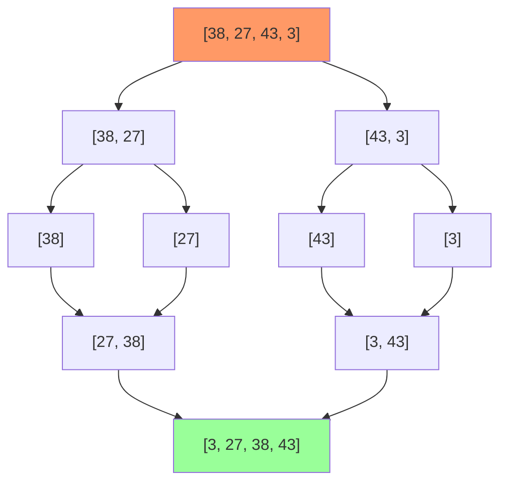

**Merge sort** is a stable, comparison-based sorting algorithm that uses the divide-and-conquer paradigm to sort elements in $O(n \log n)$ time.

## Algorithm Overview

### Divide and Conquer Strategy

1. **Divide**: Split array into two halves
2. **Conquer**: Recursively sort each half
3. **Combine**: Merge the two sorted halves

### Mathematical Formulation

$$
\text{MergeSort}(A, \text{left}, \text{right}) = \begin{cases}
A & \text{if left} \geq \text{right} \\\\
\text{Merge}(\text{MergeSort}(A, \text{left}, \text{mid}), \text{MergeSort}(A, \text{mid}+1, \text{right})) & \text{otherwise}
\end{cases}
$$

where:
$$
\text{mid} = \lfloor (\text{left} + \text{right}) / 2 \rfloor
$$

### Visualization



## Merge Operation

The key operation that combines two sorted subarrays into one sorted array.

### Process

Given two sorted arrays $L[0 \ldots n_1-1]$ and $R[0 \ldots n_2-1]$:

1. Compare $L[i]$ and $R[j]$
2. Copy smaller element to result
3. Advance pointer of array from which element was copied
4. Repeat until one array is exhausted
5. Copy remaining elements from non-empty array

### Go Implementation: Merge Function

```go
// merge combines two sorted subarrays
func merge(arr []int, left, mid, right int) {
    // Create temporary arrays
    n1 := mid - left + 1
    n2 := right - mid
    
    L := make([]int, n1)
    R := make([]int, n2)
    
    // Copy data to temp arrays
    copy(L, arr[left:mid+1])
    copy(R, arr[mid+1:right+1])
    
    // Merge temp arrays back
    i, j, k := 0, 0, left
    
    for i < n1 && j < n2 {
        if L[i] <= R[j] {
            arr[k] = L[i]
            i++
        } else {
            arr[k] = R[j]
            j++
        }
        k++
    }
    
    // Copy remaining elements
    for i < n1 {
        arr[k] = L[i]
        i++
        k++
    }
    
    for j < n2 {
        arr[k] = R[j]
        j++
        k++
    }
}
```

**Time**: $O(n_1 + n_2)$ where $n_1, n_2$ are sizes of subarrays  
**Space**: $O(n_1 + n_2)$ for temporary arrays

## Complexity Analysis

### Time Complexity

**Recurrence relation**:
$$
T(n) = 2T(n/2) + O(n)
$$

**Solution** (by Master Theorem, case 2):
$$
T(n) = O(n \log n)
$$

**Proof by recursion tree**:
- Height of tree: $\log_2 n$
- Work at each level: $O(n)$
- Total work: $O(n) \times O(\log n) = O(n \log n)$

**All cases**: Best, Average, Worst = $O(n \log n)$

### Space Complexity

**Recursive call stack**: $O(\log n)$  
**Temporary arrays**: $O(n)$  
**Total**: $O(n)$

## Array Implementation

### Top-Down (Recursive)

```go
// MergeSort sorts array using top-down merge sort
func MergeSort(arr []int) {
    if len(arr) <= 1 {
        return
    }
    mergeSortHelper(arr, 0, len(arr)-1)
}

func mergeSortHelper(arr []int, left, right int) {
    if left >= right {
        return
    }
    
    mid := left + (right-left)/2
    
    // Recursively sort both halves
    mergeSortHelper(arr, left, mid)
    mergeSortHelper(arr, mid+1, right)
    
    // Merge sorted halves
    merge(arr, left, mid, right)
}

// Example
func main() {
    arr := []int{38, 27, 43, 3, 9, 82, 10}
    fmt.Println("Before:", arr)
    MergeSort(arr)
    fmt.Println("After:", arr)
    // Output: [3, 9, 10, 27, 38, 43, 82]
}
```

**Space**: $O(n + \log n) = O(n)$

### Bottom-Up (Iterative)

```go
// MergeSortIterative sorts using bottom-up approach
func MergeSortIterative(arr []int) {
    n := len(arr)
    
    // Start with subarrays of size 1, double size each iteration
    for size := 1; size < n; size *= 2 {
        // Pick starting index of left subarray
        for left := 0; left < n-size; left += 2 * size {
            mid := left + size - 1
            right := min(left+2*size-1, n-1)
            
            merge(arr, left, mid, right)
        }
    }
}

func min(a, b int) int {
    if a < b {
        return a
    }
    return b
}

// Example
func main() {
    arr := []int{38, 27, 43, 3, 9, 82, 10}
    fmt.Println("Before:", arr)
    MergeSortIterative(arr)
    fmt.Println("After:", arr)
    // Output: [3, 9, 10, 27, 38, 43, 82]
}
```

**Iterations**: $\lceil \log_2 n \rceil$

**Space**: $O(n)$ (no recursion stack)

## Linked List Implementation

Merge sort is **particularly efficient** for linked lists because:
- No random access needed
- Merge operation is $O(1)$ space
- No need for auxiliary arrays

### Go Implementation for Linked Lists

```go
type ListNode struct {
    Val  int
    Next *ListNode
}

// MergeSortList sorts a linked list using merge sort
func MergeSortList(head *ListNode) *ListNode {
    if head == nil || head.Next == nil {
        return head
    }
    
    // Find middle using slow/fast pointers
    slow, fast := head, head
    var prev *ListNode
    
    for fast != nil && fast.Next != nil {
        prev = slow
        slow = slow.Next
        fast = fast.Next.Next
    }
    
    // Split list into two halves
    prev.Next = nil
    
    // Recursively sort both halves
    left := MergeSortList(head)
    right := MergeSortList(slow)
    
    // Merge sorted halves
    return mergeLists(left, right)
}

// mergeLists merges two sorted linked lists
func mergeLists(l1, l2 *ListNode) *ListNode {
    dummy := &ListNode{}
    curr := dummy
    
    for l1 != nil && l2 != nil {
        if l1.Val <= l2.Val {
            curr.Next = l1
            l1 = l1.Next
        } else {
            curr.Next = l2
            l2 = l2.Next
        }
        curr = curr.Next
    }
    
    if l1 != nil {
        curr.Next = l1
    } else {
        curr.Next = l2
    }
    
    return dummy.Next
}

// Example
func main() {
    // Create list: 4 -> 2 -> 1 -> 3
    head := &ListNode{Val: 4}
    head.Next = &ListNode{Val: 2}
    head.Next.Next = &ListNode{Val: 1}
    head.Next.Next.Next = &ListNode{Val: 3}
    
    sorted := MergeSortList(head)
    // Result: 1 -> 2 -> 3 -> 4
}
```

**Time**: $O(n \log n)$  
**Space**: $O(\log n)$ for recursion stack only (no auxiliary arrays!)

### Comparison: Array vs. Linked List

| Aspect | Array | Linked List |
|--------|-------|-------------|
| Time | $O(n \log n)$ | $O(n \log n)$ |
| Auxiliary Space | $O(n)$ | $O(1)$ |
| Find Middle | $O(1)$ | $O(n)$ |
| Merge | $O(n)$ with copying | $O(n)$ pointer manipulation |
| Cache Performance | Better (contiguous) | Worse (scattered) |
| Preferred | Arrays | Linked Lists |

## Properties

### Stability

Merge sort is **stable**: equal elements maintain their relative order.

**Proof**: During merge, when $L[i] = R[j]$, we take from $L$ first (left subarray), preserving original order.

### Adaptivity

Merge sort is **not adaptive**: doesn't take advantage of existing order.

**Time is always** $O(n \log n)$, even if array is already sorted.

### In-Place

Standard merge sort is **not in-place**: requires $O(n)$ auxiliary space.

**Note**: In-place variants exist but are complex and lose stability.

## Optimizations

### 1. Use Insertion Sort for Small Subarrays

```go
const INSERTION_THRESHOLD = 10

func mergeSortOptimized(arr []int, left, right int) {
    if right - left <= INSERTION_THRESHOLD {
        insertionSort(arr, left, right)
        return
    }
    
    mid := left + (right-left)/2
    mergeSortOptimized(arr, left, mid)
    mergeSortOptimized(arr, mid+1, right)
    merge(arr, left, mid, right)
}

func insertionSort(arr []int, left, right int) {
    for i := left + 1; i <= right; i++ {
        key := arr[i]
        j := i - 1
        for j >= left && arr[j] > key {
            arr[j+1] = arr[j]
            j--
        }
        arr[j+1] = key
    }
}
```

**Improvement**: 10-15% faster in practice.

### 2. Check if Already Sorted

```go
func mergeSortWithCheck(arr []int, left, right int) {
    if left >= right {
        return
    }
    
    mid := left + (right-left)/2
    
    mergeSortWithCheck(arr, left, mid)
    mergeSortWithCheck(arr, mid+1, right)
    
    // If already sorted, skip merge
    if arr[mid] <= arr[mid+1] {
        return
    }
    
    merge(arr, left, mid, right)
}
```

**Best case improvement**: $O(n)$ for already sorted arrays.

## Comparison with Other Sorting Algorithms

| Algorithm | Time (Best) | Time (Avg) | Time (Worst) | Space | Stable | Adaptive |
|-----------|-------------|------------|--------------|-------|--------|----------|
| Merge Sort | $O(n \log n)$ | $O(n \log n)$ | $O(n \log n)$ | $O(n)$ | Yes | No |
| Quick Sort | $O(n \log n)$ | $O(n \log n)$ | $O(n^2)$ | $O(\log n)$ | No | No |
| Heap Sort | $O(n \log n)$ | $O(n \log n)$ | $O(n \log n)$ | $O(1)$ | No | No |
| Insertion Sort | $O(n)$ | $O(n^2)$ | $O(n^2)$ | $O(1)$ | Yes | Yes |
| Tim Sort | $O(n)$ | $O(n \log n)$ | $O(n \log n)$ | $O(n)$ | Yes | Yes |

## Applications

### 1. External Sorting

When data doesn't fit in memory (e.g., sorting large files on disk).

**Reason**: Sequential access pattern is disk-friendly.

**Process**:
1. Sort chunks that fit in memory
2. Merge sorted chunks using k-way merge

### 2. Inversion Count

Count number of pairs $(i, j)$ where $i < j$ but $A[i] > A[j]$.

```go
func countInversions(arr []int) int {
    temp := make([]int, len(arr))
    return mergeSortAndCount(arr, temp, 0, len(arr)-1)
}

func mergeSortAndCount(arr, temp []int, left, right int) int {
    count := 0
    if left < right {
        mid := left + (right-left)/2
        
        count += mergeSortAndCount(arr, temp, left, mid)
        count += mergeSortAndCount(arr, temp, mid+1, right)
        count += mergeAndCount(arr, temp, left, mid, right)
    }
    return count
}

func mergeAndCount(arr, temp []int, left, mid, right int) int {
    i, j, k := left, mid+1, left
    count := 0
    
    for i <= mid && j <= right {
        if arr[i] <= arr[j] {
            temp[k] = arr[i]
            i++
        } else {
            temp[k] = arr[j]
            count += (mid - i + 1) // All remaining in left are inversions
            j++
        }
        k++
    }
    
    for i <= mid {
        temp[k] = arr[i]
        i++
        k++
    }
    
    for j <= right {
        temp[k] = arr[j]
        j++
        k++
    }
    
    copy(arr[left:right+1], temp[left:right+1])
    return count
}
```

**Time**: $O(n \log n)$

### 3. Linked List Sorting

Merge sort is the **preferred algorithm** for linked lists.

**Reason**: $O(1)$ space, no random access needed.

### 4. Stable Sorting Requirement

When stability is required and $O(n)$ space is acceptable.

**Examples**: Sorting records by multiple keys.

## When to Use Merge Sort

✅ **Use when**:
- Need guaranteed $O(n \log n)$ performance
- Stability is required
- Sorting linked lists
- External sorting (large datasets on disk)
- Parallel sorting
- Space is not a constraint

❌ **Don't use when**:
- Memory is severely limited (use heap sort or in-place quick sort)
- Data is small (use insertion sort)
- Average case $O(n \log n)$ with $O(\log n)$ space is acceptable (use quick sort)
- Need adaptive behavior (use tim sort or insertion sort)

## Common Interview Problems

### 1. Sort Linked List

**Problem**: Sort a linked list in $O(n \log n)$ time and $O(1)$ space.

**Solution**: Merge sort with slow/fast pointer to find middle.

### 2. Count Inversions

**Problem**: Count pairs where $i < j$ but $A[i] > A[j]$.

**Solution**: Modified merge sort counting inversions during merge.

### 3. Merge K Sorted Arrays

**Problem**: Merge $k$ sorted arrays into one sorted array.

**Solution**: K-way merge using min-heap.

**Time**: $O(n \log k)$ where $n$ is total elements.

### 4. Reverse Pairs

**Problem**: Count pairs where $i < j$ and $A[i] > 2 \times A[j]$.

**Solution**: Modified merge sort with additional counting step.
