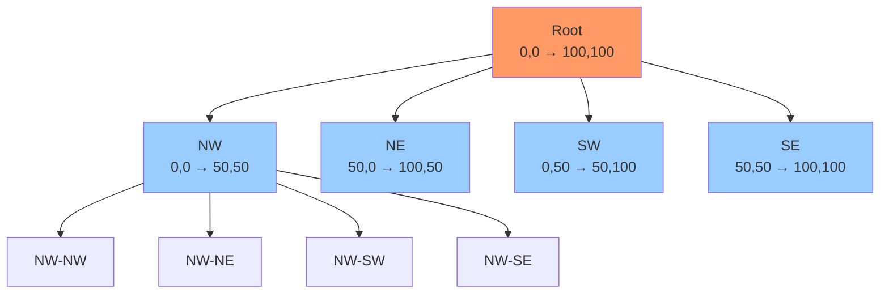

A **Quadtree** is a tree data structure where each internal node has exactly four children. Used for spatial partitioning in 2D space, commonly in graphics for Level of Detail (LOD) and collision detection.

## Structure

```go
type Point struct {
    X, Y float64
}

type Rectangle struct {
    X, Y, Width, Height float64
}

func (r *Rectangle) Contains(p Point) bool {
    return p.X >= r.X && p.X < r.X+r.Width &&
           p.Y >= r.Y && p.Y < r.Y+r.Height
}

func (r *Rectangle) Intersects(other *Rectangle) bool {
    return !(other.X > r.X+r.Width ||
             other.X+other.Width < r.X ||
             other.Y > r.Y+r.Height ||
             other.Y+other.Height < r.Y)
}

type QuadTree struct {
    boundary  *Rectangle
    capacity  int
    points    []Point
    divided   bool
    
    // Four quadrants
    northwest *QuadTree
    northeast *QuadTree
    southwest *QuadTree
    southeast *QuadTree
}

func NewQuadTree(boundary *Rectangle, capacity int) *QuadTree {
    return &QuadTree{
        boundary: boundary,
        capacity: capacity,
        points:   make([]Point, 0, capacity),
    }
}
```

### Visualization



## Core Operations

### 1. Insert

```go
func (qt *QuadTree) Insert(p Point) bool {
    // Point not in boundary
    if !qt.boundary.Contains(p) {
        return false
    }
    
    // If not at capacity, add point
    if len(qt.points) < qt.capacity {
        qt.points = append(qt.points, p)
        return true
    }
    
    // Subdivide if not already divided
    if !qt.divided {
        qt.subdivide()
    }
    
    // Insert into appropriate quadrant
    if qt.northwest.Insert(p) {
        return true
    }
    if qt.northeast.Insert(p) {
        return true
    }
    if qt.southwest.Insert(p) {
        return true
    }
    if qt.southeast.Insert(p) {
        return true
    }
    
    return false
}

func (qt *QuadTree) subdivide() {
    x := qt.boundary.X
    y := qt.boundary.Y
    w := qt.boundary.Width / 2
    h := qt.boundary.Height / 2
    
    qt.northwest = NewQuadTree(&Rectangle{x, y, w, h}, qt.capacity)
    qt.northeast = NewQuadTree(&Rectangle{x + w, y, w, h}, qt.capacity)
    qt.southwest = NewQuadTree(&Rectangle{x, y + h, w, h}, qt.capacity)
    qt.southeast = NewQuadTree(&Rectangle{x + w, y + h, w, h}, qt.capacity)
    
    qt.divided = true
}
```

**Time**: $O(\log n)$ average, $O(n)$ worst case  
**Space**: $O(n)$

### 2. Query (Range Search)

```go
func (qt *QuadTree) Query(searchRange *Rectangle) []Point {
    found := []Point{}
    
    // If range doesn't intersect boundary, return empty
    if !qt.boundary.Intersects(searchRange) {
        return found
    }
    
    // Check points in this node
    for _, p := range qt.points {
        if searchRange.Contains(p) {
            found = append(found, p)
        }
    }
    
    // If divided, check children
    if qt.divided {
        found = append(found, qt.northwest.Query(searchRange)...)
        found = append(found, qt.northeast.Query(searchRange)...)
        found = append(found, qt.southwest.Query(searchRange)...)
        found = append(found, qt.southeast.Query(searchRange)...)
    }
    
    return found
}

// Example
func main() {
    qt := NewQuadTree(&Rectangle{0, 0, 100, 100}, 4)
    
    qt.Insert(Point{25, 25})
    qt.Insert(Point{75, 25})
    qt.Insert(Point{25, 75})
    qt.Insert(Point{75, 75})
    
    // Query points in region
    searchRange := &Rectangle{20, 20, 60, 60}
    points := qt.Query(searchRange)
    fmt.Println("Found points:", points)
}
```

**Time**: $O(\log n + k)$ where $k$ is number of points found  
**Space**: $O(k)$

## Graphics Applications

### 1. Level of Detail (LOD)

```go
type LODQuadTree struct {
    boundary *Rectangle
    level    int
    maxLevel int
    
    // Mesh data for this LOD level
    vertices  []Point
    indices   []int
    
    // Children for higher detail
    children [4]*LODQuadTree
}

func NewLODQuadTree(boundary *Rectangle, level, maxLevel int) *LODQuadTree {
    qt := &LODQuadTree{
        boundary: boundary,
        level:    level,
        maxLevel: maxLevel,
    }
    
    // Generate mesh for this level
    qt.generateMesh()
    
    return qt
}

func (qt *LODQuadTree) generateMesh() {
    // Generate vertices based on level
    // Higher level = more detail
    detail := 1 << uint(qt.level) // 2^level
    
    for i := 0; i <= detail; i++ {
        for j := 0; j <= detail; j++ {
            x := qt.boundary.X + float64(i)*qt.boundary.Width/float64(detail)
            y := qt.boundary.Y + float64(j)*qt.boundary.Height/float64(detail)
            qt.vertices = append(qt.vertices, Point{x, y})
        }
    }
    
    // Generate indices for triangles
    // ... (triangle strip or indexed triangles)
}

func (qt *LODQuadTree) GetLODForDistance(cameraPos Point, distance float64) *LODQuadTree {
    // Calculate distance from camera to quad center
    centerX := qt.boundary.X + qt.boundary.Width/2
    centerY := qt.boundary.Y + qt.boundary.Height/2
    
    dx := cameraPos.X - centerX
    dy := cameraPos.Y - centerY
    dist := math.Sqrt(dx*dx + dy*dy)
    
    // Determine LOD level based on distance
    if dist < distance && qt.level < qt.maxLevel {
        // Need higher detail, subdivide
        if qt.children[0] == nil {
            qt.subdivide()
        }
        
        // Return appropriate child
        // ... (determine which child based on camera position)
    }
    
    return qt
}

func (qt *LODQuadTree) subdivide() {
    x := qt.boundary.X
    y := qt.boundary.Y
    w := qt.boundary.Width / 2
    h := qt.boundary.Height / 2
    
    qt.children[0] = NewLODQuadTree(&Rectangle{x, y, w, h}, qt.level+1, qt.maxLevel)
    qt.children[1] = NewLODQuadTree(&Rectangle{x + w, y, w, h}, qt.level+1, qt.maxLevel)
    qt.children[2] = NewLODQuadTree(&Rectangle{x, y + h, w, h}, qt.level+1, qt.maxLevel)
    qt.children[3] = NewLODQuadTree(&Rectangle{x + w, y + h, w, h}, qt.level+1, qt.maxLevel)
}

func (qt *LODQuadTree) Render(cameraPos Point, lodDistance float64) {
    lod := qt.GetLODForDistance(cameraPos, lodDistance)
    
    // Render mesh at appropriate LOD
    // ... (OpenGL/Vulkan rendering code)
}
```

### 2. Frustum Culling

```go
type Frustum struct {
    planes [6]Plane // 6 planes defining view frustum
}

type Plane struct {
    normal Point
    distance float64
}

func (qt *LODQuadTree) FrustumCull(frustum *Frustum) []*LODQuadTree {
    visible := []*LODQuadTree{}
    
    // Check if boundary intersects frustum
    if !qt.boundary.IntersectsFrustum(frustum) {
        return visible
    }
    
    // If leaf or all children visible, add this node
    if qt.children[0] == nil {
        visible = append(visible, qt)
    } else {
        // Recursively check children
        for _, child := range qt.children {
            if child != nil {
                visible = append(visible, child.FrustumCull(frustum)...)
            }
        }
    }
    
    return visible
}
```

### 3. Terrain Rendering

```go
type TerrainQuadTree struct {
    boundary  *Rectangle
    heightmap [][]float64
    level     int
    maxLevel  int
    
    // Mesh data
    vertices []Vertex
    normals  []Point
    
    children [4]*TerrainQuadTree
}

type Vertex struct {
    pos    Point
    height float64
}

func (tqt *TerrainQuadTree) GenerateTerrainMesh() {
    detail := 1 << uint(tqt.level)
    
    for i := 0; i <= detail; i++ {
        for j := 0; j <= detail; j++ {
            // Sample heightmap
            x := tqt.boundary.X + float64(i)*tqt.boundary.Width/float64(detail)
            y := tqt.boundary.Y + float64(j)*tqt.boundary.Height/float64(detail)
            
            height := tqt.sampleHeightmap(x, y)
            
            tqt.vertices = append(tqt.vertices, Vertex{
                pos:    Point{x, y},
                height: height,
            })
        }
    }
    
    // Calculate normals for lighting
    tqt.calculateNormals()
}

func (tqt *TerrainQuadTree) sampleHeightmap(x, y float64) float64 {
    // Bilinear interpolation from heightmap
    // ... (implementation)
    return 0.0
}

func (tqt *TerrainQuadTree) calculateNormals() {
    // Calculate normals from vertices for smooth shading
    // ... (implementation)
}
```

## Collision Detection

```go
type CollisionObject struct {
    pos    Point
    radius float64
}

func (qt *QuadTree) CheckCollisions(obj *CollisionObject) []Point {
    // Create search range based on object's bounding box
    searchRange := &Rectangle{
        X:      obj.pos.X - obj.radius,
        Y:      obj.pos.Y - obj.radius,
        Width:  obj.radius * 2,
        Height: obj.radius * 2,
    }
    
    // Query potential collisions
    candidates := qt.Query(searchRange)
    
    // Precise collision check
    collisions := []Point{}
    for _, p := range candidates {
        dx := p.X - obj.pos.X
        dy := p.Y - obj.pos.Y
        dist := math.Sqrt(dx*dx + dy*dy)
        
        if dist < obj.radius {
            collisions = append(collisions, p)
        }
    }
    
    return collisions
}
```

## Image Compression

```go
type ImageQuadTree struct {
    boundary *Rectangle
    color    [3]uint8 // RGB
    error    float64
    
    children [4]*ImageQuadTree
}

func CompressImage(img [][]color.RGBA, threshold float64) *ImageQuadTree {
    boundary := &Rectangle{0, 0, float64(len(img[0])), float64(len(img))}
    return compressRegion(img, boundary, threshold)
}

func compressRegion(img [][]color.RGBA, boundary *Rectangle, threshold float64) *ImageQuadTree {
    qt := &ImageQuadTree{boundary: boundary}
    
    // Calculate average color
    avgColor, colorError := calculateAverageColor(img, boundary)
    qt.color = avgColor
    qt.error = colorError
    
    // If error is below threshold, don't subdivide
    if colorError < threshold || boundary.Width <= 1 || boundary.Height <= 1 {
        return qt
    }
    
    // Subdivide
    x := boundary.X
    y := boundary.Y
    w := boundary.Width / 2
    h := boundary.Height / 2
    
    qt.children[0] = compressRegion(img, &Rectangle{x, y, w, h}, threshold)
    qt.children[1] = compressRegion(img, &Rectangle{x + w, y, w, h}, threshold)
    qt.children[2] = compressRegion(img, &Rectangle{x, y + h, w, h}, threshold)
    qt.children[3] = compressRegion(img, &Rectangle{x + w, y + h, w, h}, threshold)
    
    return qt
}

func calculateAverageColor(img [][]color.RGBA, boundary *Rectangle) ([3]uint8, float64) {
    var sumR, sumG, sumB uint32
    count := 0
    
    for y := int(boundary.Y); y < int(boundary.Y+boundary.Height); y++ {
        for x := int(boundary.X); x < int(boundary.X+boundary.Width); x++ {
            c := img[y][x]
            sumR += uint32(c.R)
            sumG += uint32(c.G)
            sumB += uint32(c.B)
            count++
        }
    }
    
    avgR := uint8(sumR / uint32(count))
    avgG := uint8(sumG / uint32(count))
    avgB := uint8(sumB / uint32(count))
    
    // Calculate error (variance)
    var errorSum float64
    for y := int(boundary.Y); y < int(boundary.Y+boundary.Height); y++ {
        for x := int(boundary.X); x < int(boundary.X+boundary.Width); x++ {
            c := img[y][x]
            dr := float64(c.R) - float64(avgR)
            dg := float64(c.G) - float64(avgG)
            db := float64(c.B) - float64(avgB)
            errorSum += dr*dr + dg*dg + db*db
        }
    }
    
    return [3]uint8{avgR, avgG, avgB}, errorSum / float64(count)
}
```

## Complexity Analysis

| Operation | Average | Worst Case |
|-----------|---------|------------|
| Insert | $O(\log n)$ | $O(n)$ |
| Query | $O(\log n + k)$ | $O(n)$ |
| Delete | $O(\log n)$ | $O(n)$ |
| Build | $O(n \log n)$ | $O(n^2)$ |

where $k$ is number of points found

**Space**: $O(n)$

## Octree (3D Extension)

For 3D space, use Octree (8 children instead of 4):

```go
type Octree struct {
    boundary *Cube
    capacity int
    points   []Point3D
    divided  bool
    
    // Eight octants
    children [8]*Octree
}

type Point3D struct {
    X, Y, Z float64
}

type Cube struct {
    X, Y, Z, Size float64
}
```

**Applications**: 3D collision detection, 3D LOD, voxel engines, ray tracing

## When to Use Quadtree

✅ **Use when**:
- 2D spatial queries (games, GIS)
- Level of Detail rendering
- Collision detection in 2D
- Image compression
- Adaptive mesh refinement

❌ **Don't use when**:
- 1D data (use binary search tree)
- 3D data (use octree)
- Uniform distribution (use grid)
- Very dynamic data (consider loose quadtree)

