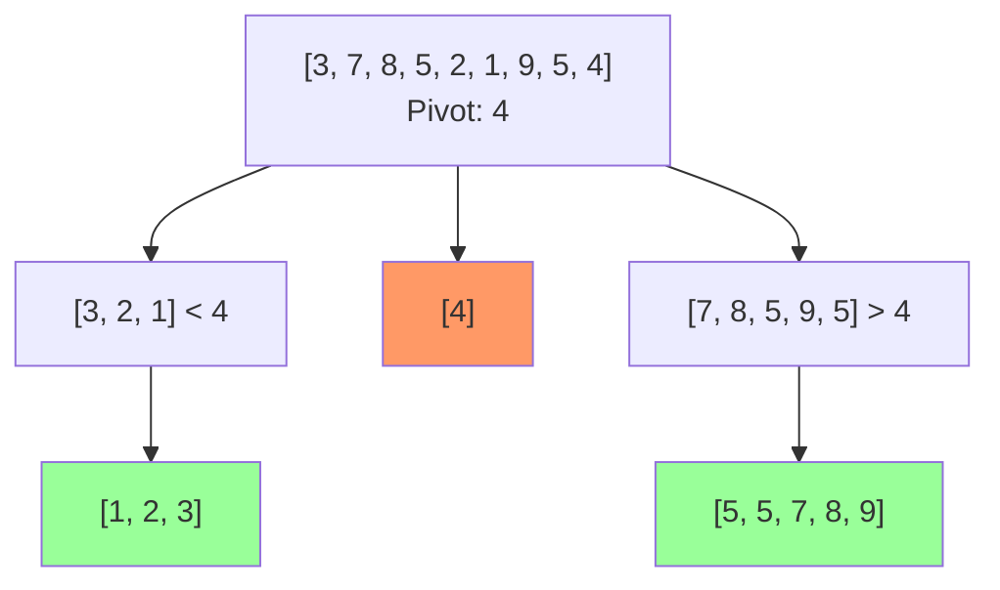

**Quick sort** is an efficient, in-place, comparison-based sorting algorithm that uses divide-and-conquer. It has $O(n \log n)$ average time complexity but $O(n^2)$ worst case.

## Algorithm Overview

### Divide and Conquer Strategy

1. **Partition**: Choose a pivot and partition array so that:
   - Elements ≤ pivot are on the left
   - Elements > pivot are on the right
2. **Conquer**: Recursively sort left and right partitions
3. **Combine**: No work needed (in-place sorting)

### Mathematical Formulation

$$
\text{QuickSort}(A, \text{low}, \text{high}) = \begin{cases}
A & \text{if low} \geq \text{high} \\\\
\text{QuickSort}(A, \text{low}, p-1) \cup \{A[p]\} \cup \text{QuickSort}(A, p+1, \text{high}) & \text{otherwise}
\end{cases}
$$

where $p = \text{Partition}(A, \text{low}, \text{high})$ is the pivot's final position.

### Visualization



## Partition Schemes

### 1. Lomuto Partition Scheme

**Simpler but less efficient**

```go
// LomutoPartition uses last element as pivot
func LomutoPartition(arr []int, low, high int) int {
    pivot := arr[high] // Choose last element as pivot
    i := low - 1       // Index of smaller element
    
    for j := low; j < high; j++ {
        if arr[j] <= pivot {
            i++
            arr[i], arr[j] = arr[j], arr[i]
        }
    }
    
    // Place pivot in correct position
    arr[i+1], arr[high] = arr[high], arr[i+1]
    return i + 1
}

func QuickSortLomuto(arr []int, low, high int) {
    if low < high {
        pi := LomutoPartition(arr, low, high)
        
        QuickSortLomuto(arr, low, pi-1)  // Before pivot
        QuickSortLomuto(arr, pi+1, high) // After pivot
    }
}

// Example
func main() {
    arr := []int{10, 7, 8, 9, 1, 5}
    QuickSortLomuto(arr, 0, len(arr)-1)
    fmt.Println(arr) // [1, 5, 7, 8, 9, 10]
}
```

**Invariant**:
- $A[\text{low} \ldots i] \leq \text{pivot}$
- $A[i+1 \ldots j-1] > \text{pivot}$
- $A[j \ldots \text{high}-1]$ not yet processed

**Time**: $O(n)$

### 2. Hoare Partition Scheme

**Original and more efficient**

```go
// HoarePartition uses two pointers from both ends
func HoarePartition(arr []int, low, high int) int {
    pivot := arr[low] // Choose first element as pivot
    i, j := low-1, high+1
    
    for {
        // Move i right while arr[i] < pivot
        for {
            i++
            if arr[i] >= pivot {
                break
            }
        }
        
        // Move j left while arr[j] > pivot
        for {
            j--
            if arr[j] <= pivot {
                break
            }
        }
        
        if i >= j {
            return j
        }
        
        arr[i], arr[j] = arr[j], arr[i]
    }
}

func QuickSortHoare(arr []int, low, high int) {
    if low < high {
        pi := HoarePartition(arr, low, high)
        
        QuickSortHoare(arr, low, pi)    // Left partition
        QuickSortHoare(arr, pi+1, high) // Right partition
    }
}
```

**Swaps**: About 3 times fewer than Lomuto

**Time**: $O(n)$

### 3. Three-Way Partition (Dutch National Flag)

**For arrays with many duplicates**

```go
// ThreeWayPartition partitions into <, =, > pivot
func ThreeWayPartition(arr []int, low, high int) (int, int) {
    if high - low <= 1 {
        if arr[low] > arr[high] {
            arr[low], arr[high] = arr[high], arr[low]
        }
        return low, high
    }
    
    pivot := arr[low]
    lt, i, gt := low, low+1, high
    
    for i <= gt {
        if arr[i] < pivot {
            arr[lt], arr[i] = arr[i], arr[lt]
            lt++
            i++
        } else if arr[i] > pivot {
            arr[i], arr[gt] = arr[gt], arr[i]
            gt--
        } else {
            i++
        }
    }
    
    return lt, gt
}

func QuickSort3Way(arr []int, low, high int) {
    if low >= high {
        return
    }
    
    lt, gt := ThreeWayPartition(arr, low, high)
    
    QuickSort3Way(arr, low, lt-1)  // Less than pivot
    QuickSort3Way(arr, gt+1, high) // Greater than pivot
    // Elements from lt to gt are equal to pivot
}

// Example
func main() {
    arr := []int{4, 9, 4, 4, 1, 9, 4, 4, 9, 4, 4, 1, 4}
    QuickSort3Way(arr, 0, len(arr)-1)
    fmt.Println(arr) // [1, 1, 4, 4, 4, 4, 4, 4, 4, 9, 9, 9]
}
```

**Advantage**: Linear time for arrays with many duplicates

**Time**: $O(n)$ when all elements are equal

## Complexity Analysis

### Time Complexity

**Best case**: $O(n \log n)$
- Pivot divides array into two equal halves

**Recurrence**:
$$
T(n) = 2T(n/2) + O(n)
$$

**Solution**: $T(n) = O(n \log n)$

**Average case**: $O(n \log n)$
- Expected partition is reasonably balanced

**Analysis**: Even if partition is 1:9, still $O(n \log n)$:
$$
T(n) = T(n/10) + T(9n/10) + O(n) = O(n \log n)
$$

**Worst case**: $O(n^2)$
- Pivot is always smallest or largest element
- Happens when array is already sorted (with naive pivot selection)

**Recurrence**:
$$
T(n) = T(n-1) + O(n) = O(n^2)
$$

### Space Complexity

**Best/Average case**: $O(\log n)$
- Recursion depth for balanced partitions

**Worst case**: $O(n)$
- Recursion depth for unbalanced partitions

**Optimization**: Recurse on smaller partition first, iterate on larger
- Guarantees $O(\log n)$ space even in worst case

## Pivot Selection Strategies

### 1. Random Element

```go
import "math/rand"

func RandomizedPartition(arr []int, low, high int) int {
    // Choose random pivot
    randomIdx := low + rand.Intn(high-low+1)
    arr[randomIdx], arr[high] = arr[high], arr[randomIdx]
    
    return LomutoPartition(arr, low, high)
}

func RandomizedQuickSort(arr []int, low, high int) {
    if low < high {
        pi := RandomizedPartition(arr, low, high)
        RandomizedQuickSort(arr, low, pi-1)
        RandomizedQuickSort(arr, pi+1, high)
    }
}
```

**Pros**: Expected $O(n \log n)$ regardless of input  
**Cons**: Requires random number generation

### 2. Median-of-Three

```go
func MedianOfThree(arr []int, low, high int) int {
    mid := low + (high-low)/2
    
    // Sort low, mid, high
    if arr[mid] < arr[low] {
        arr[low], arr[mid] = arr[mid], arr[low]
    }
    if arr[high] < arr[low] {
        arr[low], arr[high] = arr[high], arr[low]
    }
    if arr[mid] < arr[high] {
        arr[mid], arr[high] = arr[high], arr[mid]
    }
    
    // Place median at high-1
    arr[mid], arr[high-1] = arr[high-1], arr[mid]
    return high - 1
}

func QuickSortMedian3(arr []int, low, high int) {
    if high - low < 3 {
        // Use insertion sort for small arrays
        insertionSort(arr, low, high)
        return
    }
    
    pivotIdx := MedianOfThree(arr, low, high)
    arr[pivotIdx], arr[high] = arr[high], arr[pivotIdx]
    
    pi := LomutoPartition(arr, low, high)
    QuickSortMedian3(arr, low, pi-1)
    QuickSortMedian3(arr, pi+1, high)
}
```

**Pros**:
- Better pivot selection
- Avoids worst case on sorted arrays
- No randomness needed

**Improvement**: Reduces probability of worst case significantly

## Optimizations

### 1. Tail Call Elimination

```go
func QuickSortOptimized(arr []int, low, high int) {
    for low < high {
        pi := LomutoPartition(arr, low, high)
        
        // Recurse on smaller partition, iterate on larger
        if pi - low < high - pi {
            QuickSortOptimized(arr, low, pi-1)
            low = pi + 1
        } else {
            QuickSortOptimized(arr, pi+1, high)
            high = pi - 1
        }
    }
}
```

**Benefit**: Guarantees $O(\log n)$ stack space even in worst case

### 2. Insertion Sort for Small Subarrays

```go
const THRESHOLD = 10

func QuickSortHybrid(arr []int, low, high int) {
    if high - low < THRESHOLD {
        insertionSort(arr, low, high)
        return
    }
    
    pi := LomutoPartition(arr, low, high)
    QuickSortHybrid(arr, low, pi-1)
    QuickSortHybrid(arr, pi+1, high)
}

func insertionSort(arr []int, low, high int) {
    for i := low + 1; i <= high; i++ {
        key := arr[i]
        j := i - 1
        for j >= low && arr[j] > key {
            arr[j+1] = arr[j]
            j--
        }
        arr[j+1] = key
    }
}
```

**Improvement**: 20-25% faster in practice

## Complete Optimized Implementation

```go
package main

import (
    "fmt"
    "math/rand"
)

const (
    THRESHOLD = 10
    USE_MEDIAN_OF_THREE = true
)

func QuickSort(arr []int) {
    quickSortHelper(arr, 0, len(arr)-1)
}

func quickSortHelper(arr []int, low, high int) {
    for low < high {
        // Use insertion sort for small subarrays
        if high - low < THRESHOLD {
            insertionSort(arr, low, high)
            return
        }
        
        // Partition
        var pi int
        if USE_MEDIAN_OF_THREE {
            pi = partitionMedian3(arr, low, high)
        } else {
            pi = partitionLomuto(arr, low, high)
        }
        
        // Tail call optimization: recurse on smaller, iterate on larger
        if pi - low < high - pi {
            quickSortHelper(arr, low, pi-1)
            low = pi + 1
        } else {
            quickSortHelper(arr, pi+1, high)
            high = pi - 1
        }
    }
}

func partitionLomuto(arr []int, low, high int) int {
    pivot := arr[high]
    i := low - 1
    
    for j := low; j < high; j++ {
        if arr[j] <= pivot {
            i++
            arr[i], arr[j] = arr[j], arr[i]
        }
    }
    
    arr[i+1], arr[high] = arr[high], arr[i+1]
    return i + 1
}

func partitionMedian3(arr []int, low, high int) int {
    mid := low + (high-low)/2
    
    // Sort low, mid, high
    if arr[mid] < arr[low] {
        arr[low], arr[mid] = arr[mid], arr[low]
    }
    if arr[high] < arr[low] {
        arr[low], arr[high] = arr[high], arr[low]
    }
    if arr[high] < arr[mid] {
        arr[mid], arr[high] = arr[high], arr[mid]
    }
    
    // Use mid as pivot
    arr[mid], arr[high] = arr[high], arr[mid]
    return partitionLomuto(arr, low, high)
}

func insertionSort(arr []int, low, high int) {
    for i := low + 1; i <= high; i++ {
        key := arr[i]
        j := i - 1
        for j >= low && arr[j] > key {
            arr[j+1] = arr[j]
            j--
        }
        arr[j+1] = key
    }
}

func main() {
    arr := []int{10, 7, 8, 9, 1, 5, 3, 6, 4, 2}
    fmt.Println("Before:", arr)
    QuickSort(arr)
    fmt.Println("After:", arr)
}
```

## Comparison with Other Sorting Algorithms

| Algorithm | Time (Best) | Time (Avg) | Time (Worst) | Space | Stable | In-Place |
|-----------|-------------|------------|--------------|-------|--------|----------|
| Quick Sort | $O(n \log n)$ | $O(n \log n)$ | $O(n^2)$ | $O(\log n)$ | No | Yes |
| Merge Sort | $O(n \log n)$ | $O(n \log n)$ | $O(n \log n)$ | $O(n)$ | Yes | No |
| Heap Sort | $O(n \log n)$ | $O(n \log n)$ | $O(n \log n)$ | $O(1)$ | No | Yes |
| Insertion Sort | $O(n)$ | $O(n^2)$ | $O(n^2)$ | $O(1)$ | Yes | Yes |

## Why Quick Sort is Fast in Practice

Despite $O(n^2)$ worst case, quick sort is often faster than merge sort and heap sort:

### 1. Cache Efficiency

**In-place**: Better cache locality, fewer cache misses

**Sequential access**: Partition scans array sequentially

### 2. Fewer Comparisons

**Average**: $1.39n \log n$ comparisons vs. $n \log n$ for merge sort

**Constant factors**: Lower overhead per operation

### 3. Fewer Swaps

**Hoare partition**: About $n/6$ swaps on average

**Merge sort**: $O(n \log n)$ moves

### 4. In-Place

**No auxiliary array**: Saves memory allocation/deallocation overhead

## When to Use Quick Sort

✅ **Use when**:
- Average case performance is critical
- Memory is limited (in-place sorting)
- Cache efficiency matters
- Stability is not required
- General-purpose sorting

❌ **Don't use when**:
- Worst-case guarantee is needed (use merge sort or heap sort)
- Stability is required (use merge sort or tim sort)
- Data is nearly sorted (use insertion sort or tim sort)
- Many duplicate elements without three-way partition

## Common Interview Problems

### 1. Kth Largest Element

**Problem**: Find k-th largest element in unsorted array.

```go
func FindKthLargest(nums []int, k int) int {
    return quickSelect(nums, 0, len(nums)-1, len(nums)-k)
}

func quickSelect(nums []int, low, high, k int) int {
    if low == high {
        return nums[low]
    }
    
    pi := LomutoPartition(nums, low, high)
    
    if k == pi {
        return nums[k]
    } else if k < pi {
        return quickSelect(nums, low, pi-1, k)
    } else {
        return quickSelect(nums, pi+1, high, k)
    }
}
```

**Time**: $O(n)$ average, $O(n^2)$ worst

### 2. Sort Colors (Dutch National Flag)

**Problem**: Sort array with 3 distinct values.

**Solution**: Three-way partition.

**Time**: $O(n)$, one pass

## Applications

1. **General Purpose Sorting**: Most language standard libraries
2. **Selection Algorithm**: Find k-th smallest element
3. **Duplicate Detection**: Three-way partition efficiently handles duplicates
4. **Parallel Sorting**: Partitioning can be parallelized effectively
