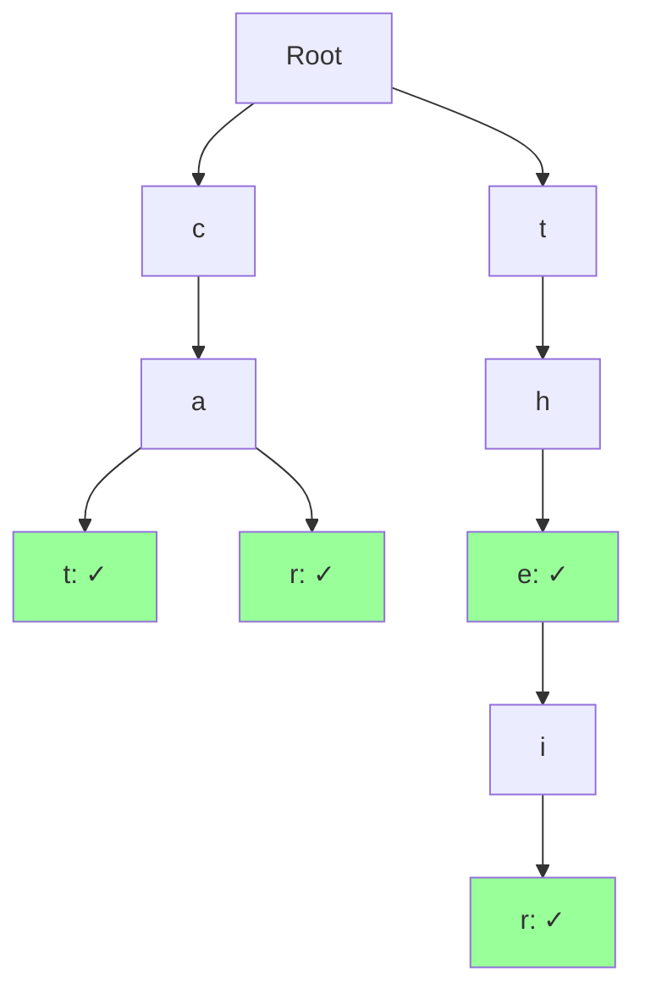

A **Trie** (pronounced "try") is a tree-like data structure used to store and retrieve strings efficiently. Each path from root to a node represents a prefix.

## Structure

```go
type TrieNode struct {
    children map[rune]*TrieNode
    isEnd    bool  // Marks end of a word
}

type Trie struct {
    root *TrieNode
}

func NewTrie() *Trie {
    return &Trie{
        root: &TrieNode{
            children: make(map[rune]*TrieNode),
        },
    }
}
```

### Visualization



Words stored: "cat", "car", "the", "their"

## Core Operations

### 1. Insert

```go
func (t *Trie) Insert(word string) {
    node := t.root
    
    for _, char := range word {
        if node.children[char] == nil {
            node.children[char] = &TrieNode{
                children: make(map[rune]*TrieNode),
            }
        }
        node = node.children[char]
    }
    
    node.isEnd = true
}

// Example
func main() {
    trie := NewTrie()
    trie.Insert("cat")
    trie.Insert("car")
    trie.Insert("card")
}
```

**Time**: $O(m)$ where $m$ is word length  
**Space**: $O(m)$

### 2. Search

```go
func (t *Trie) Search(word string) bool {
    node := t.root
    
    for _, char := range word {
        if node.children[char] == nil {
            return false
        }
        node = node.children[char]
    }
    
    return node.isEnd
}

// Example
func main() {
    trie := NewTrie()
    trie.Insert("cat")
    
    fmt.Println(trie.Search("cat"))  // true
    fmt.Println(trie.Search("ca"))   // false (not a complete word)
    fmt.Println(trie.Search("dog"))  // false
}
```

**Time**: $O(m)$  
**Space**: $O(1)$

### 3. StartsWith (Prefix Search)

```go
func (t *Trie) StartsWith(prefix string) bool {
    node := t.root
    
    for _, char := range prefix {
        if node.children[char] == nil {
            return false
        }
        node = node.children[char]
    }
    
    return true
}

// Example
func main() {
    trie := NewTrie()
    trie.Insert("apple")
    
    fmt.Println(trie.StartsWith("app"))  // true
    fmt.Println(trie.StartsWith("appl")) // true
    fmt.Println(trie.StartsWith("ban"))  // false
}
```

**Time**: $O(m)$  
**Space**: $O(1)$

### 4. Delete

```go
func (t *Trie) Delete(word string) bool {
    return t.deleteHelper(t.root, word, 0)
}

func (t *Trie) deleteHelper(node *TrieNode, word string, index int) bool {
    if index == len(word) {
        if !node.isEnd {
            return false // Word doesn't exist
        }
        
        node.isEnd = false
        
        // Return true if node has no children (can be deleted)
        return len(node.children) == 0
    }
    
    char := rune(word[index])
    child := node.children[char]
    
    if child == nil {
        return false // Word doesn't exist
    }
    
    shouldDeleteChild := t.deleteHelper(child, word, index+1)
    
    if shouldDeleteChild {
        delete(node.children, char)
        // Return true if current node has no children and is not end of another word
        return len(node.children) == 0 && !node.isEnd
    }
    
    return false
}
```

**Time**: $O(m)$  
**Space**: $O(m)$ for recursion

### 5. Find All Words with Prefix

```go
func (t *Trie) FindWordsWithPrefix(prefix string) []string {
    node := t.root
    
    // Navigate to prefix
    for _, char := range prefix {
        if node.children[char] == nil {
            return []string{}
        }
        node = node.children[char]
    }
    
    // Collect all words from this point
    words := []string{}
    t.collectWords(node, prefix, &words)
    return words
}

func (t *Trie) collectWords(node *TrieNode, current string, words *[]string) {
    if node.isEnd {
        *words = append(*words, current)
    }
    
    for char, child := range node.children {
        t.collectWords(child, current+string(char), words)
    }
}

// Example
func main() {
    trie := NewTrie()
    words := []string{"cat", "car", "card", "care", "careful", "dog"}
    for _, word := range words {
        trie.Insert(word)
    }
    
    fmt.Println(trie.FindWordsWithPrefix("car"))
    // Output: [car, card, care, careful]
}
```

**Time**: $O(p + n)$ where $p$ is prefix length, $n$ is number of nodes in subtree  
**Space**: $O(n)$

## Advanced Operations

### Autocomplete

```go
func (t *Trie) Autocomplete(prefix string, maxResults int) []string {
    node := t.root
    
    // Navigate to prefix
    for _, char := range prefix {
        if node.children[char] == nil {
            return []string{}
        }
        node = node.children[char]
    }
    
    // Collect words with limit
    words := []string{}
    t.collectWordsLimited(node, prefix, &words, maxResults)
    return words
}

func (t *Trie) collectWordsLimited(node *TrieNode, current string, words *[]string, limit int) {
    if len(*words) >= limit {
        return
    }
    
    if node.isEnd {
        *words = append(*words, current)
    }
    
    for char, child := range node.children {
        if len(*words) >= limit {
            return
        }
        t.collectWordsLimited(child, current+string(char), words, limit)
    }
}
```

### Longest Common Prefix

```go
func (t *Trie) LongestCommonPrefix() string {
    if t.root == nil || len(t.root.children) == 0 {
        return ""
    }
    
    prefix := ""
    node := t.root
    
    for len(node.children) == 1 && !node.isEnd {
        for char, child := range node.children {
            prefix += string(char)
            node = child
        }
    }
    
    return prefix
}
```

### Word Count

```go
func (t *Trie) CountWords() int {
    return t.countWordsHelper(t.root)
}

func (t *Trie) countWordsHelper(node *TrieNode) int {
    count := 0
    
    if node.isEnd {
        count = 1
    }
    
    for _, child := range node.children {
        count += t.countWordsHelper(child)
    }
    
    return count
}
```

## Complexity Analysis

| Operation | Time | Space |
|-----------|------|-------|
| Insert | $O(m)$ | $O(m)$ |
| Search | $O(m)$ | $O(1)$ |
| StartsWith | $O(m)$ | $O(1)$ |
| Delete | $O(m)$ | $O(m)$ |
| Find All with Prefix | $O(p + n)$ | $O(n)$ |

where:
- $m$ = length of word
- $p$ = length of prefix
- $n$ = number of nodes in subtree

**Space Complexity**: $O(\text{ALPHABET\_SIZE} \times N \times M)$ where:
- ALPHABET_SIZE = character set size
- N = number of words
- M = average word length

## Optimizations

### 1. Array-Based Children (for small alphabets)

```go
const ALPHABET_SIZE = 26

type TrieNodeArray struct {
    children [ALPHABET_SIZE]*TrieNodeArray
    isEnd    bool
}

func charToIndex(ch rune) int {
    return int(ch - 'a')
}

func (t *TrieArray) Insert(word string) {
    node := t.root
    
    for _, char := range word {
        index := charToIndex(char)
        if node.children[index] == nil {
            node.children[index] = &TrieNodeArray{}
        }
        node = node.children[index]
    }
    
    node.isEnd = true
}
```

**Advantage**: Faster access, $O(1)$ child lookup  
**Disadvantage**: More memory if sparse

### 2. Compressed Trie (Radix Tree / Patricia Trie)

Store strings on edges instead of single characters.

```go
type RadixNode struct {
    children map[string]*RadixNode
    isEnd    bool
}
```

**Advantage**: Space-efficient for sparse tries  
**Example**: "test" and "testing" share edge "test"

## Applications

### 1. Autocomplete

```go
type AutocompleteSystem struct {
    trie *Trie
}

func (a *AutocompleteSystem) AddWord(word string) {
    a.trie.Insert(word)
}

func (a *AutocompleteSystem) GetSuggestions(prefix string, limit int) []string {
    return a.trie.Autocomplete(prefix, limit)
}
```

### 2. Spell Checker

```go
func (t *Trie) SpellCheck(word string) []string {
    if t.Search(word) {
        return []string{word} // Correct spelling
    }
    
    // Find similar words (simple version: edit distance 1)
    suggestions := []string{}
    
    // Try all possible single-character edits
    for i := 0; i < len(word); i++ {
        // Deletion
        candidate := word[:i] + word[i+1:]
        if t.Search(candidate) {
            suggestions = append(suggestions, candidate)
        }
        
        // Substitution
        for ch := 'a'; ch <= 'z'; ch++ {
            candidate := word[:i] + string(ch) + word[i+1:]
            if t.Search(candidate) {
                suggestions = append(suggestions, candidate)
            }
        }
    }
    
    return suggestions
}
```

### 3. IP Routing (Longest Prefix Match)

```go
type IPTrie struct {
    root *TrieNode
}

func (ipt *IPTrie) AddRoute(ipPrefix string, nextHop string) {
    // Store routing information in trie
    // Each bit of IP becomes a path in trie
}

func (ipt *IPTrie) LongestPrefixMatch(ip string) string {
    // Find longest matching prefix for routing
    return ""
}
```

### 4. Word Search in Grid

```go
func FindWords(board [][]byte, words []string) []string {
    // Build trie from words
    trie := NewTrie()
    for _, word := range words {
        trie.Insert(word)
    }
    
    result := []string{}
    visited := make([][]bool, len(board))
    for i := range visited {
        visited[i] = make([]bool, len(board[0]))
    }
    
    // DFS from each cell
    for i := 0; i < len(board); i++ {
        for j := 0; j < len(board[0]); j++ {
            dfsWordSearch(board, i, j, trie.root, "", &result, visited)
        }
    }
    
    return result
}

func dfsWordSearch(board [][]byte, i, j int, node *TrieNode, current string, result *[]string, visited [][]bool) {
    if i < 0 || i >= len(board) || j < 0 || j >= len(board[0]) || visited[i][j] {
        return
    }
    
    char := rune(board[i][j])
    if node.children[char] == nil {
        return
    }
    
    visited[i][j] = true
    current += string(char)
    node = node.children[char]
    
    if node.isEnd {
        *result = append(*result, current)
        node.isEnd = false // Avoid duplicates
    }
    
    // Explore all 4 directions
    dfsWordSearch(board, i+1, j, node, current, result, visited)
    dfsWordSearch(board, i-1, j, node, current, result, visited)
    dfsWordSearch(board, i, j+1, node, current, result, visited)
    dfsWordSearch(board, i, j-1, node, current, result, visited)
    
    visited[i][j] = false // Backtrack
}
```

## Trie vs. Hash Table

| Feature | Trie | Hash Table |
|---------|------|------------|
| Search | $O(m)$ | $O(1)$ average |
| Prefix Search | $O(p)$ | $O(n)$ (scan all keys) |
| Space | $O(ALPHABET \times N \times M)$ | $O(N \times M)$ |
| Ordered | Yes (lexicographic) | No |
| Collision | No | Yes |
| Autocomplete | Efficient | Inefficient |

## When to Use Trie

✅ **Use when**:
- Prefix-based operations (autocomplete, spell check)
- Dictionary with many words sharing prefixes
- IP routing (longest prefix match)
- Word games (Boggle, Scrabble)
- T9 predictive text

❌ **Don't use when**:
- Simple exact-match lookups (use hash table)
- Memory is very limited
- Alphabet size is huge (use compressed trie)
- No prefix operations needed

## Complete Implementation

```go
package main

import "fmt"

type TrieNode struct {
    children map[rune]*TrieNode
    isEnd    bool
    count    int // Number of words passing through this node
}

type Trie struct {
    root *TrieNode
}

func NewTrie() *Trie {
    return &Trie{
        root: &TrieNode{
            children: make(map[rune]*TrieNode),
        },
    }
}

func (t *Trie) Insert(word string) {
    node := t.root
    
    for _, char := range word {
        if node.children[char] == nil {
            node.children[char] = &TrieNode{
                children: make(map[rune]*TrieNode),
            }
        }
        node = node.children[char]
        node.count++
    }
    
    node.isEnd = true
}

func (t *Trie) Search(word string) bool {
    node := t.root
    
    for _, char := range word {
        if node.children[char] == nil {
            return false
        }
        node = node.children[char]
    }
    
    return node.isEnd
}

func (t *Trie) StartsWith(prefix string) bool {
    node := t.root
    
    for _, char := range prefix {
        if node.children[char] == nil {
            return false
        }
        node = node.children[char]
    }
    
    return true
}

func (t *Trie) CountWordsWithPrefix(prefix string) int {
    node := t.root
    
    for _, char := range prefix {
        if node.children[char] == nil {
            return 0
        }
        node = node.children[char]
    }
    
    return node.count
}

func main() {
    trie := NewTrie()
    
    words := []string{"cat", "car", "card", "care", "careful", "dog", "dodge"}
    for _, word := range words {
        trie.Insert(word)
    }
    
    fmt.Println("Search 'car':", trie.Search("car"))           // true
    fmt.Println("Search 'ca':", trie.Search("ca"))             // false
    fmt.Println("StartsWith 'car':", trie.StartsWith("car"))   // true
    fmt.Println("Words with prefix 'car':", trie.CountWordsWithPrefix("car")) // 4
}
```
