Clean Architecture (by Robert C. Martin) organizes code into layers with clear dependencies flowing inward. The inner layers contain business logic and are independent of frameworks, UI, and databases.

## Use Case

Use Clean Architecture when you need to:
- Build maintainable, testable systems
- Keep business logic independent of frameworks
- Support multiple interfaces (web, CLI, API)
- Enable easy technology changes

## Architecture Layers

```mermaid
graph TB
    subgraph Frameworks["🔧 Frameworks & Drivers (External)"]
        Web[Web Framework]
        DB[Database]
        UI[UI Framework]
        API[External APIs]
    end
    
    subgraph Adapters["🔌 Interface Adapters"]
        Controllers[Controllers]
        Presenters[Presenters]
        Gateways[Gateways]
    end
    
    subgraph UseCases["⚙️ Use Cases (Application Logic)"]
        UC1[Create User]
        UC2[Update Order]
        UC3[Process Payment]
    end
    
    subgraph Entities["📦 Entities (Business Rules)"]
        E1[User]
        E2[Order]
        E3[Product]
    end
    
    Web --> Controllers
    DB --> Gateways
    UI --> Presenters
    API --> Gateways
    
    Controllers --> UC1
    Controllers --> UC2
    Gateways --> UC1
    Presenters --> UC2
    
    UC1 --> E1
    UC2 --> E2
    UC3 --> E3
    
    style Entities fill:#4ecdc4
    style UseCases fill:#95e1d3
    style Adapters fill:#f38181
    style Frameworks fill:#aa96da
```



**Dependency Rule**: Dependencies point inward (outer → inner). Inner layers know nothing about outer layers.


## Code

### Example 1: Go Implementation

```go
// Domain Layer (Entities)
package domain

type User struct {
    ID       string
    Email    string
    Name     string
    Password string
}

type UserRepository interface {
    Save(user *User) error
    FindByID(id string) (*User, error)
    FindByEmail(email string) (*User, error)
}

// Use Case Layer
package usecase

type CreateUserUseCase struct {
    repo domain.UserRepository
}

func NewCreateUserUseCase(repo domain.UserRepository) *CreateUserUseCase {
    return &CreateUserUseCase{repo: repo}
}

func (uc *CreateUserUseCase) Execute(email, name, password string) (*domain.User, error) {
    // Business logic
    existing, _ := uc.repo.FindByEmail(email)
    if existing != nil {
        return nil, errors.New("user already exists")
    }
    
    user := &domain.User{
        ID:       generateID(),
        Email:    email,
        Name:     name,
        Password: hashPassword(password),
    }
    
    if err := uc.repo.Save(user); err != nil {
        return nil, err
    }
    
    return user, nil
}

// Interface Adapter Layer (Repository Implementation)
package repository

type PostgresUserRepository struct {
    db *sql.DB
}

func NewPostgresUserRepository(db *sql.DB) *PostgresUserRepository {
    return &PostgresUserRepository{db: db}
}

func (r *PostgresUserRepository) Save(user *domain.User) error {
    query := "INSERT INTO users (id, email, name, password) VALUES ($1, $2, $3, $4)"
    _, err := r.db.Exec(query, user.ID, user.Email, user.Name, user.Password)
    return err
}

func (r *PostgresUserRepository) FindByID(id string) (*domain.User, error) {
    // Implementation
}

// Interface Adapter Layer (Controller)
package handler

type UserHandler struct {
    createUser *usecase.CreateUserUseCase
}

func NewUserHandler(createUser *usecase.CreateUserUseCase) *UserHandler {
    return &UserHandler{createUser: createUser}
}

func (h *UserHandler) CreateUser(w http.ResponseWriter, r *http.Request) {
    var req struct {
        Email    string `json:"email"`
        Name     string `json:"name"`
        Password string `json:"password"`
    }
    
    json.NewDecoder(r.Body).Decode(&req)
    
    user, err := h.createUser.Execute(req.Email, req.Name, req.Password)
    if err != nil {
        http.Error(w, err.Error(), http.StatusBadRequest)
        return
    }
    
    json.NewEncoder(w).Encode(user)
}

// Framework Layer (Main)
package main

func main() {
    // Setup database
    db, _ := sql.Open("postgres", "connection-string")
    
    // Wire dependencies (Dependency Injection)
    userRepo := repository.NewPostgresUserRepository(db)
    createUserUC := usecase.NewCreateUserUseCase(userRepo)
    userHandler := handler.NewUserHandler(createUserUC)
    
    // Setup routes
    http.HandleFunc("/users", userHandler.CreateUser)
    http.ListenAndServe(":8080", nil)
}
```

### Example 2: Python Implementation

```python
# Domain Layer (Entities)
from dataclasses import dataclass
from abc import ABC, abstractmethod

@dataclass
class User:
    id: str
    email: str
    name: str
    password: str

class UserRepository(ABC):
    @abstractmethod
    def save(self, user: User) -> None:
        pass
    
    @abstractmethod
    def find_by_id(self, id: str) -> User:
        pass

# Use Case Layer
class CreateUserUseCase:
    def __init__(self, repo: UserRepository):
        self.repo = repo
    
    def execute(self, email: str, name: str, password: str) -> User:
        # Business logic
        existing = self.repo.find_by_email(email)
        if existing:
            raise ValueError("User already exists")
        
        user = User(
            id=generate_id(),
            email=email,
            name=name,
            password=hash_password(password)
        )
        
        self.repo.save(user)
        return user

# Interface Adapter Layer (Repository)
class PostgresUserRepository(UserRepository):
    def __init__(self, db_connection):
        self.db = db_connection
    
    def save(self, user: User) -> None:
        query = "INSERT INTO users (id, email, name, password) VALUES (%s, %s, %s, %s)"
        self.db.execute(query, (user.id, user.email, user.name, user.password))

# Interface Adapter Layer (Controller)
from flask import Flask, request, jsonify

class UserController:
    def __init__(self, create_user_uc: CreateUserUseCase):
        self.create_user = create_user_uc
    
    def create_user_endpoint(self):
        data = request.get_json()
        try:
            user = self.create_user.execute(
                email=data['email'],
                name=data['name'],
                password=data['password']
            )
            return jsonify(user.__dict__), 201
        except ValueError as e:
            return jsonify({'error': str(e)}), 400

# Framework Layer (Main)
def main():
    # Setup
    db = create_db_connection()
    
    # Wire dependencies
    user_repo = PostgresUserRepository(db)
    create_user_uc = CreateUserUseCase(user_repo)
    user_controller = UserController(create_user_uc)
    
    # Setup Flask
    app = Flask(__name__)
    app.route('/users', methods=['POST'])(user_controller.create_user_endpoint)
    
    app.run(port=8080)
```

## Key Principles

### 1. Dependency Inversion
```
High-level modules should not depend on low-level modules.
Both should depend on abstractions (interfaces).
```

### 2. Single Responsibility
```
Each layer has one reason to change:
- Entities: Business rules change
- Use Cases: Application workflow changes
- Controllers: API contract changes
- Repositories: Data storage changes
```

### 3. Testability


```go
// Easy to test - mock the repository
func TestCreateUser(t *testing.T) {
    mockRepo := &MockUserRepository{}
    useCase := NewCreateUserUseCase(mockRepo)
    
    user, err := useCase.Execute("test@example.com", "Test", "pass")
    
    assert.NoError(t, err)
    assert.NotNil(t, user)
}
```

## Benefits

- ✅ **Testable**: Business logic can be tested without frameworks
- ✅ **Independent**: Core logic doesn't depend on UI, DB, or frameworks
- ✅ **Flexible**: Easy to swap implementations (e.g., Postgres → MongoDB)
- ✅ **Maintainable**: Clear separation of concerns
- ✅ **Scalable**: Can grow without becoming tangled

## Trade-offs

- ⚠️ **More code**: More interfaces and layers than simple approaches
- ⚠️ **Learning curve**: Team needs to understand the pattern
- ⚠️ **Overkill for simple apps**: Not needed for CRUD applications
- ⚠️ **Boilerplate**: Requires discipline to maintain structure

## Notes

- Start simple, add layers as needed
- Use dependency injection for wiring
- Keep entities pure (no framework dependencies)
- Use cases should be thin - just orchestration
- Test each layer independently

## Gotchas/Warnings

- ⚠️ **Over-abstraction**: Don't create interfaces for everything
- ⚠️ **Anemic domain**: Entities should have behavior, not just data
- ⚠️ **Leaky abstractions**: Be careful not to leak implementation details
- ⚠️ **Premature optimization**: Don't use this for simple projects